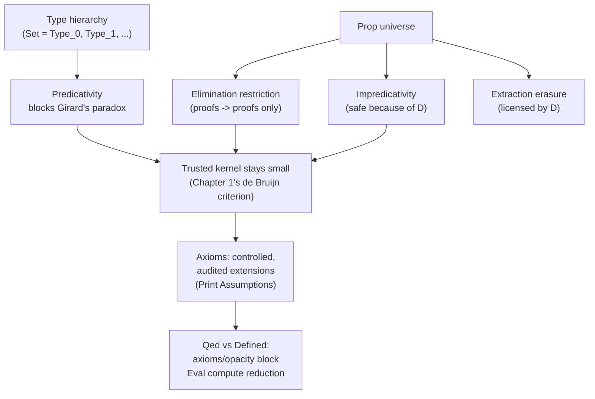

[[book-guidelines|↩ Back to guidelines]]

## What breaks if `Type` is its own type?

Every term in Gallina has a type — `0 : nat`, `nat : Set`. `Set` itself needs a type too, and Coq's answer is `Type`. The naive next question — "what's the type of `Type`?" — has a naive answer that is *fatal*: if `Type : Type`, the system is inconsistent, via **Girard's paradox**. A polymorphic language where the universe of types contains itself lets you reconstruct Russell's-paradox-style self-reference at the type level, and once that lands you can "prove" any proposition whatsoever — the entire point of a trusted kernel evaporates.

So `Type : Type` cannot be literally true, yet Coq happily accepts `Check Type.` and prints `Type : Type`. The resolution: `Type` is not one type but an **infinite, stratified hierarchy** $\text{Type}_0, \text{Type}_1, \text{Type}_2, \ldots$, invisible by default. `Set` is `Type₀`; `Type₀ : Type₁`; `Type₁ : Type₂`; and so on, forever. `Set Printing Universes` reveals the hidden annotations:

```
Check Set.
  Set : Type (* (0)+1 *)
Check Type.
  Type (* Top.3 *) : Type (* (Top.3)+1 *)
```

The rule for a $\forall$-type (equivalently, a $\Pi$-type — Coq's function/quantifier type is literally the dependent-type-theory $\Pi$): the universe of $\forall x : T_1, T_2$ is the **max** of $T_1$'s and $T_2$'s universes. Subtyping across levels ($\text{Type}_i \le \text{Type}_j$ for $j > i$) is what makes the stratification mostly invisible in ordinary use — you rarely have to think about which level you're at.

**Predicativity** is the discipline this stratification enforces: when something is defined via a quantifier, none of that quantifier's instantiations may ever be the very object being defined. Concretely:

```
Definition id (T : Type) (x : T) : T := x.
Check id id.
Error: Universe inconsistency (cannot enforce Top.16 < Top.16).
```

`id` quantifies over a `Type` at some level, and applying `id` to itself would require that level to be simultaneously above and below itself — an unsatisfiable constraint. **Universe inconsistency** errors are exactly this: a symptom of Coq's constraint solver detecting that no consistent assignment of universe levels exists for the term you wrote. This is the *mechanism*, not just the slogan — behind the scenes, every occurrence of `Type` gets a fresh universe variable, and typing generates a system of inequalities over those variables that must remain satisfiable.

**Grounding (Lean):** Lean's universe story is the same idea, more exposed at the surface. `Sort u` is Lean's uniform notion of "the type of types at level `u`" — `Prop` is `Sort 0`, `Type u` is sugar for `Sort (u+1)`, and ordinary definitions are *universe-polymorphic* by default (`def id.{u} : {α : Sort u} → α → α`), so you write `u` explicitly where Coq hides `Top.N` variables under the hood. `#check @id` in Lean shows you the universe parameter directly; Coq's `Set Printing Universes` is doing the same unhiding, just reactively rather than by default. The underlying invariant — no universe may be instantiated with itself — is identical, because both kernels are ultimately checking the same predicativity constraint to block the same Girard-style inconsistency.

## Why does this matter for *inductive* definitions specifically?

A "large" inductive type — one where some constructor's argument has type `Type` — must itself live in `Type`, not `Set`:

```
Inductive exp : Set -> Set :=
| Const : ∀ T : Set, T -> exp T
...
Error: Large non-propositional inductive types must be in Type.
```

Once `exp : Type -> Type`, self-application still fails — `Const (Const O)` triggers a universe inconsistency, because `exp`'s own universe level must exceed the level of *every* type any constructor can accept, which rules out feeding `exp`-typed values back into `exp`'s own constructors. `Print Universes` exposes the actual constraint database driving this — a set of inequalities like `Top.19 < Top.9 ≤ Top.8` maintained "off to the side," never appearing explicitly in the terms you write.

The chapter's sharpest observation is the **parameters-versus-indices** distinction, and it's easy to miss because syntactically parameters and indices look similar (both are things `exp`/`prod`/etc. are indexed by):

- A **parameter** is named to the left of the defining colon and must be *shared identically* across every constructor's range type (e.g., `prod (A : Type) (B : Type) : Type := pair : A -> B -> A * B` — `A` and `B` are parameters).
- An **index** (or an unrestricted constructor argument) appears to the right, and different constructors may fix it to different values.

The consequence: **parameters induce only $\le$ constraints; indexed/unrestricted quantification induces strict $<$ constraints.** `prod A B` lives at `max(level(A), level(B))` — no increment — precisely because `A`, `B` are parameters. An index-based analogue of the same pair type (`prod' : Type -> Type -> Type := pair' : ∀ A B : Type, A -> B -> prod' A B`) fails self-nesting exactly the way `exp` did, because quantifying over `A`/`B` *inside* a constructor's type forces `prod'`'s own level strictly above theirs. This is the direct, mechanical reason parameterized types (like `list`, `option`, `prod`) support unrestricted nesting (`list (list nat)`, nested pairs of types) while naively "generalized" indexed versions of the same types do not.

Coq also quietly clones definitions: `Inductive foo (A : Type) : Type := Foo : A -> foo A.` gets automatically specialized to `foo nat : Set`, `foo Set : Type`, `foo True : Prop` — the checker picks the lowest consistent universe/sort for each use, which is convenient but occasionally produces surprising results (a `Type`-defined enum silently reporting `bar : Prop`).

**Grounding (Rust):** there's no faithful Rust analogue for universe stratification itself — Rust's type system has no notion of "the type of types" recursing into itself, so this whole class of paradox and its containment machinery is foreign to it. The closest intuition pump is much weaker: a generic `struct Wrapper<T>(T)` parameterized over `T` (a parameter, sharing `T` uniformly) versus an enum whose different variants could in principle carry differently-scoped type parameters (indices) — Rust doesn't let you build the second kind at all without extra machinery (trait objects, GADTs-via-encoding), so the parameter/index distinction here is really a distinction Coq's dependent-type system has to police explicitly that Rust's simpler generics sidestep by construction.

## `Set Printing All` and unification-variable scoping — reading error messages that lie by omission

Two practical debugging skills round out §12.1:

- **`Set Printing All`** disables notations and implicit-argument elision, showing raw CIC terms. A baffling `apply` failure ("Impossible to unify `?35 = ?34` with `unit = unit`") becomes legible once you see the hidden implicit universe argument to `eq` (`@eq Type ?46 ?45` vs. `@eq Set unit unit`) — the mismatch was never in the visible equation at all.
- **Unification-variable scoping**: a metavariable introduced at one point in a proof cannot later be instantiated with a variable introduced *after* it. `eexists` followed by `destruct H` fails because the freshly-destructed `x` postdates the existential's metavariable — reordering the proof (destructing first, then supplying the witness) fixes it. This isn't a quirk; it reflects that CIC itself has no primitive notion of "unification variable" — the metavariable is purely a proof-search bookkeeping device that gets textually substituted into the final term, so any instantiation referencing an out-of-scope variable would produce an ill-formed term.

**Grounding (Lean):** this is precisely the discipline behind Miller's pattern-unification fragment and metavariable *local contexts* in Lean's elaborator. Every metavariable in Lean carries an explicit local context recording exactly which free variables are legally in scope for its eventual assignment; an attempted assignment mentioning an out-of-context variable is rejected the same way Coq's is here. If you're building a metavariable-unification engine of your own (per this workbench's compiler project), this section is a direct specification of an invariant your own metavariable representation must enforce — track each metavariable's admissible-variable set at creation time, and reject (or trigger context-widening/pattern-generalization logic) on any instantiation attempt that escapes it.

## `Prop`: the universe where proofs live, and why it needs *three* special rules

Chapter 4 already used `Prop` informally as "the type of propositions/proofs," parallel to `Set` for "the type of programs." This chapter cashes in the formal reasons that separation is enforced, not just conventional. `sig` (subset types, the program-level $\Sigma$) and `ex` (the proof-level existential) differ in exactly one place:

```
Inductive sig (A : Type) (P : A -> Prop) : Type  := exist   : ∀ x : A, P x -> sig P
Inductive ex  (A : Type) (P : A -> Prop) : Prop  := ex_intro: ∀ x : A, P x -> ex  P
```

Three consequences follow from `ex` living in `Prop`:

**1. The elimination restriction.** You can pattern-match (Coq calls this "eliminate") a `sig` value to extract its witness — `match x with exist v => v end : A` type-checks fine, because the result type `A` is in `Type`/`Set`. The identical function on `ex` is rejected outright:

```
Error: Incorrect elimination of "x" in the inductive type "ex":
the return type has sort "Type" while it should be "Prop".
```

The rule: **you may only pattern-match a `Prop`-sorted discriminee if the match's result type is also `Prop`** (with one carve-out for singleton `Prop`s, not shown above). This is an information-flow policy in the literal sense — a firewall preventing proof-level detail from ever leaking into program-level results. It is the same "proofs are erasable because programs can never inspect their internals" guarantee, enforced structurally rather than by convention.

**2. Extraction erasure.** Because programs provably never depend on a proof's internal structure (rule 1 guarantees this), extraction can safely delete every `Prop`-typed value entirely. `sym_sig`, which pattern-matches and rebuilds a `sig`-wrapped equality proof, extracts to the *identity function* on `nat` — the proof payload vanishes. `sym_ex`, doing the analogous thing over `ex`, extracts to a single erased-unit value `__` — the *entire proof package*, not just its proof component, disappears, because the ambient type itself was `Prop`. This is a genuinely different design point from Haskell-style proof-carrying code via GADTs, where such "proofs" are ordinary runtime values that consume space and time; Coq's extraction is a real optimization pass licensed by the elimination restriction, not a documentation convention.

**3. Impredicativity.** Unlike `Set`/`Type`, a `Prop` *may* quantify over `Prop` — including itself — without bumping to a higher universe: `∀ P Q : Prop, P ∨ Q -> Q ∨ P : Prop`, still `Prop`, not `Type₁`. This is essential just to *state* ordinary propositional tautologies. Impredicativity alone is exactly the ingredient that caused Girard's paradox for `Type`; the reason it's *safe* for `Prop` is that the elimination restriction (rule 1) blocks the specific pattern-matching moves a Girard-style construction needs to bootstrap inconsistency. Predicativity and the elimination restriction are two different mechanisms defending against the same failure mode, applied to two different universes — `Type` is protected by staying predicative; `Prop` is protected by staying elimination-restricted while being allowed impredicativity.

The chapter demonstrates this with a second attempt at the earlier `exp` type, this time targeting `Prop` (`expP : Type -> Prop`), which sidesteps the earlier universe-inconsistency wall — `ConstP (ConstP O)` now type-checks — but the "victory" is shallow: an `expP`-typed value can no longer be pattern-matched into anything but another proof, so it's useless as an actual expression-representation datatype. Where impredicativity *does* pay off for real work is in inductively defined **judgments** — relations you genuinely only ever use propositionally, like the more-permissive-than-`=` equality `eqPlus` built via impredicative quantification over functions, exactly the machinery underlying the equality-of-proofs reasoning from the previous chapter.

**Grounding (Lean):** here the two systems diverge in an interesting, citable way. Lean's `Prop` is also impredicative and also elimination-restricted (the "large elimination" rule is essentially identical), but Lean additionally bakes **proof irrelevance for `Prop` directly into definitional equality** — any two proofs `p1 p2 : P` for `P : Prop` are *definitionally* equal in Lean's kernel, no axiom required. Coq deliberately does *not* do this by default (see `proof_irrelevance` below) — it leaves proof irrelevance as an optional, explicitly-asserted axiom rather than a kernel-builtin defeq rule. This is a genuine design fork between the two systems' trusted computing bases: Lean's kernel trusts more (proof irrelevance is unconditionally true, baked into `isDefEq`), in exchange for never needing an axiom for it; Coq's kernel trusts less by default, but then developments that *do* want proof irrelevance must explicitly widen their axiom set and account for it in every `Print Assumptions` audit.

## Axioms: extending Gallina without touching the kernel

An `Axiom` (or its `Prop`-agnostic synonym `Parameter`) asserts a proposition or object without proof — literally new, unchecked source code injected into the trusted base. The chapter tours the standard ones:

- **Excluded middle** (`classic : ∀ P : Prop, P ∨ ¬P`) — not provable in Coq's default constructive logic (constructively, $\forall$ is a dependent function and $\lor$ a variant type, so excluded middle would need to be a genuine decision procedure for *every* proposition, which computability rules out), but consistent to assume, proved so via a set-theoretic model of CIC. It's "safe" specifically because rule 1 above (the elimination restriction) prevents the resulting non-computational proof term from ever being treated as a program — an excluded-middle-style axiom stated over `Set` instead of `Prop` would be genuinely dangerous, since `Set` values *are* extracted and run.
- **Any inconsistent combination is fatal, even if each axiom is individually fine.** `classic` plus its own negation `not_classic` (each separately consistent with CIC) together prove `False`, and thus every proposition, including `1 + 1 = 3`. `Print Assumptions` audits exactly which axioms a given theorem transitively depends on — the direct analogue of Lean's `#print axioms`.
- **Proof irrelevance** (`proof_irrelevance : ∀ (P : Prop) (p1 p2 : P), p1 = p2`) — lets you prove that a dependently typed function is insensitive to *which* proof it received as an argument, without inspecting the function's definition. Without the axiom, the same fact is only true metatheoretically (guaranteed by the elimination restriction) but not internally provable — you'd have to unfold the function body by hand (`destruct n; crush` on the concrete definition of `pred_strong1`) rather than reason abstractly (`f_equal; apply proof_irrelevance`).
- **UIP / Streicher's axiom K** (`eq_rect_eq`, with corollaries `UIP_refl`, `UIP`) — special cases of proof irrelevance restricted to equality proofs specifically, already met in the equality-proofs chapter; provable axiom-free whenever the type in question has decidable equality (`Eqdep_dec`).
- **Function/predicate extensionality** — two functions equal at every input are equal as functions; not derivable in bare CIC, standardly assumed.
- **Choice**, in three strengths: `constructive_definite_description` is provable *without* any axiom for countable sets via brute-force enumeration guarded by a uniqueness proof (`∃!`) — genuinely just a decision procedure, no philosophical commitment needed; `dependent_unique_choice`/`choice` are real axioms converting a relational specification into a function. Chlipala's sharpest remark here: in a constructive setting, "choice" restated via subset types (`{y : B | R x y}` in, `{f : A -> B | ...}` out) is *provable as a plain theorem* — essentially uncurrying — because Curry–Howard already gives you the witness-extraction machinery for free. Coq's choice axioms only become philosophically substantive once combined with excluded middle, which supplies genuinely non-computational proofs as choice's raw material.

## Axioms and stuck computation — the cost of assuming instead of proving

This is the section with the sharpest engineering payoff. A term closed with `Qed` is marked **opaque** — its definition is hidden from later computation, even without any axiom involved. A term closed with `Defined` stays **transparent** and can be unfolded/reduced by `Eval compute`. Consider a type-cast function built by pattern-matching on an equality proof:

```
Definition cast (x y : Set) (pf : x = y) (v : x) : y :=
  match pf with eq_refl => v end.
```

If `pf` is a concrete, structurally-built equality (from `refl_equal`/`eq_refl`, or unfolded from a `Defined` proof), `Eval compute` reduces straight through the match and produces a normal value. If `pf` instead comes from an *axiom* (like `functional_extensionality`) — or even from an ordinary tactic proof closed with `Qed` rather than `Defined` — computation gets **stuck**: the match cannot proceed because the proof term's constructor-level shape is opaque, and the `Eval compute` result is left as an unreduced tree of pending matches over the axiom. This is not a performance quirk; it's structural — a match can only reduce once its discriminee is known (by iota-reduction, from the earlier equality-reduction taxonomy) to actually be built from a specific constructor, and an axiom, by definition, supplies no constructor-level evidence at all. **The fix in the tactic-only case is simply to end the proof with `Defined` instead of `Qed`** — same proof script, but now the checker keeps the term transparent and reduction proceeds normally.

## Techniques for avoiding axioms

Chlipala frames axiom-avoidance as a **trusted-computing-base minimization** exercise, directly continuing the de Bruijn-criterion theme from Chapter 1: every axiom is new, unverified source code added to what a reader must trust to believe the theorem. Three concrete techniques recur:

1. **Unfold instead of invoking proof irrelevance.** `pred_strong1`'s proof-insensitivity was shown by inspecting the concrete function definition (`destruct n; crush`), avoiding the `proof_irrelevance` axiom entirely, at the cost of a proof that's coupled to the function's internals rather than a one-liner.
2. **Refactor via [[Dependent-Types-for-Program-Correctness#The convoy pattern|the convoy pattern]]** so a `destruct`/`inversion`-style case analysis applies to a variable-typed argument rather than needing `dep_destruct` (which silently depends on the `JMeq_eq` axiom under the hood — `Print Assumptions` reveals this even when the tactic call looked innocuous). The chapter's worked example restates a `fin`-case-analysis lemma with the index pattern-matched via an explicit `match n return ... with` motive, letting plain `destruct` succeed axiom-free.
3. **Redefine functions so the needed property holds by construction**, rather than threading an externally-supplied, opaque equality proof through a definition and later needing an axiom to reason about it.

## Where this leads



This chapter is the theoretical payoff of the trust architecture set up all the way back in "[[The-Coq-Proof-Assistant-and-Certified-Programming|The Coq Proof Assistant and Certified Programming]]": the de Bruijn criterion asked for a small, auditable kernel, and universes plus the `Prop`/`Set` split are exactly the kernel-level rules that keep that small core sound while still letting the surface language (Gallina) feel expressive. `Print Assumptions` is the concrete, day-to-day instrument for auditing what a "certified" program actually rests on — which axioms, if any, have been smuggled into its trusted base.

For the compiler/elaborator project this vault is oriented toward (`type-theory`, `automated-reasoning`): this chapter *is* the specification for how a Π/Σ-type-based type checker must handle its own universe hierarchy — get the parameter-vs-index distinction wrong in a refinement-type surface language's own inductive definitions, and you'll hit exactly this chapter's universe-inconsistency failures. The `Prop` elimination restriction is the direct model for *any* trusted-kernel design decision about what proof-carrying data may influence: if your verifier's own proof certificates are meant to be erasable before code generation (the certifying-vs-certified distinction from Chapter 1), they need an elimination-restriction-like invariant enforced by your own type checker, not just a convention. And the `Qed`/`Defined`-style opacity distinction is the general lesson for any proof-producing architecture: decide early which proof terms your system needs to keep *computationally transparent* (for normalization, decision procedures, or certificate-checking) versus which can be safely sealed — that boundary determines whether your own "compute with proofs" pipeline gets stuck the way Coq's `Eval compute` does here.
