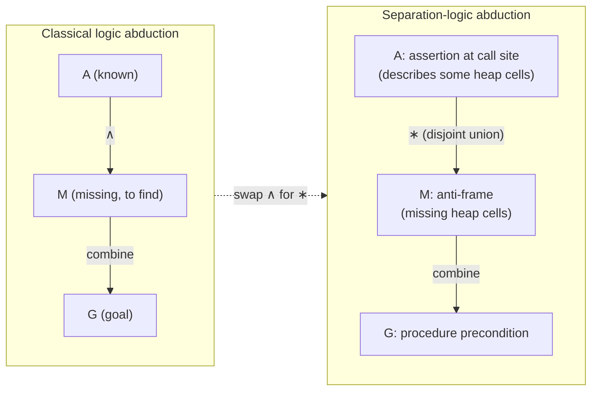

# Abductive Inference

[[book-guidelines|↩ Back to guidelines]]

## The problem: a proof gets stuck, and you know why

Picture a program verifier walking through a procedure body, symbolically. At each statement it carries an assertion — a description of everything it currently knows about the heap and the stack — and it tries to show that this assertion is strong enough to justify the next statement. Then it hits a procedure call. The callee comes with a precondition $G$ that it demands be true before it runs. The verifier's current assertion is $A$. If $A$ already implies $G$, fine, keep going. But very often $A$ does *not* imply $G$ — not because the program is wrong, but because the verifier simply hasn't been told enough yet about the state the caller starts in.

This is the moment abduction earns its keep. Instead of giving up, the verifier asks: *what would I have needed to assume at the start of this procedure, in addition to what I already derived, in order for this call to be justified?* That "what would I have needed" is an existential question over hypotheses, not over conclusions — the mirror image of ordinary deduction. Deduction takes premises and produces a conclusion; abduction takes a premise and a desired conclusion and produces a *missing premise*. The paper puts real weight on this being a form of inference in its own right, not just failure-driven backtracking: the missing fact is not just "gotcha, proof search restarted with a lucky guess," it becomes the procedure's own inferred precondition — a real, reportable piece of the program's specification.

**What breaks without it:** without an inference step that fills the gap, the verifier either (a) demands the human write down every procedure's precondition by hand before analysis starts, which is exactly the up-front annotation burden that has historically kept shape analysis out of practical use, or (b) refuses to proceed and reports a spurious "cannot verify" at the first call site whose caller state is incomplete. Abduction turns "the proof is stuck" into "the proof tells you what it's missing."

## Peirce's original formulation

The term is not the authors' invention. Charles Sanders Peirce introduced *abductive inference* — his own term was closer to "hypothesis" or "retroduction" — in his writings on the logic of scientific reasoning, to carve out a third pattern of inference standing apart from the two everyone already had names for:

- **Deduction**: from a rule and a case, infer the result. ("All beans in this bag are white; these beans are from this bag; therefore these beans are white.")
- **Induction**: from a case and a result, infer a general rule. ("These beans are from this bag and are white; therefore, probably, all beans in this bag are white.")
- **Abduction**: from a rule and a result, infer a case that would explain it. ("All beans in this bag are white; these beans are white; therefore, perhaps, these beans are from this bag.")

Peirce's point was that science does not proceed by deduction or induction alone — someone first has to *propose* the hypothesis ("these beans are from that bag") before it can be tested. Abduction is the logic of hypothesis-*generation*, distinct from the logic of hypothesis-*justification*. Crucially, an abductive conclusion is not guaranteed true merely because it makes the entailment hold — many different hypotheses could explain the same observation, and picking among them requires further criteria (simplicity, testability, and so on).

The paper imports this idea wholesale into program verification, and the analogy is worth taking seriously rather than treating as decorative: a procedure's precondition, in this framework, is literally the abduced *explanation* for why a call site's assertion, once completed with the right missing pieces, is sufficient for the call to be safe. Just as Peirce's hypothesis needs downstream criteria to be a good hypothesis and not just *a* hypothesis, the paper needs its own downstream criteria — consistency and minimality, discussed below — to keep the abduced precondition from being useless or absurd.

## Abduction in classical logic versus separation logic

The paper first states the classical-logic version of the abduction problem, in a form standard in AI and logic-programming abduction:

> **Given:** assumption $A$ and goal $G$.
> **To find:** a "missing" assumption $M$ making the entailment
> $$A \wedge M \vdash G$$
> hold.

Read that literally: you already believe $A$; you want to derive $G$; you're allowed to add one more fact $M$, conjoined ordinarily, and asked to find the weakest/most reasonable such $M$. Nothing here is specific to programs or to memory — it's a generic schema that shows up in diagnosis (what fault, conjoined with the known symptoms, explains the observed behavior?) and in planning (what unstated fact, conjoined with the known world-state, makes the goal reachable?).

The paper then swaps ordinary conjunction $\wedge$ for the *separating conjunction* $*$ of separation logic:

> **Given:** assumption $A$ and goal $G$.
> **To find:** a "missing" assumption $M$ making the entailment
> $$A * M \vdash G$$
> hold.

This single substitution is where the reinterpretation of abduction as a *spatial* inference happens. In separation logic, formulas describe not arbitrary facts but *states of memory*, and $A * M$ is true of a heap exactly when that heap can be split into two **disjoint** parts, one satisfying $A$ and the other satisfying $M$ — "$A$, and separately, $M$." So in $A * M \vdash G$, the missing fact $M$ is no longer merely a logically-independent conjunct; it is read as *a description of a chunk of memory the current assertion says nothing about*, and the whole entailment says: if you had that memory chunk too, disjoint from what you already have, you'd satisfy $G$.

This is a genuine change of subject matter, not just a notational swap. In classical logic, $\wedge$ doesn't care whether $A$ and $M$ talk about overlapping or independent things — $M$ could restate part of $A$, could constrain the same variables, and the conjunction is still perfectly meaningful. In separation logic's $*$, that overlap is exactly what's forbidden: $A$ and $M$ must hold of *disjoint* portions of the heap. That's what licenses reading $M$ as "the missing portion of memory" rather than just "the missing fact" — a claim only sensible once your logic has a primitive notion of separateness to make it precise.

A further complication is worth naming: with enough logical firepower, the separation-logic abduction question has an *immediate*, trivial solution. Take $M$ to be the separating implication (magic wand) $A \twoheadrightarrow G$ — by construction, $A * (A \twoheadrightarrow G) \vdash G$ always holds, no matter what $A$ and $G$ are. So an unconstrained abduction question is not interesting; it has a boring universal answer that carries no information. The paper heads this off in two ways: first, by later restricting candidate $M$'s to *symbolic heaps* — a fixed grammar of "additively and separately conjoined atomic predicates" (§3.1) that doesn't include $\twoheadrightarrow$ at all, so the wand solution isn't even expressible; second, by imposing the general abducibility constraints below, which the wand-based $M$ would fail even in a richer logic.



## Abducibility constraints: consistency and minimality

Even after fixing the logic, "find some $M$ such that $A * M \vdash G$" is under-constrained — there are usually many technically-correct answers, and most of them are useless. The paper follows a standard move in the abduction literature (citing the AI abduction surveys) of layering additional constraints on top of bare logical validity:

1. **Restriction to abducible facts.** The candidate $M$ must come from a restricted syntactic class, not an arbitrary formula. In classical AI abduction this is usually "a conjunction of literals" rather than a general formula — which rules out the degenerate solution $M = A \Rightarrow G$ (trivially valid, since $A \wedge (A \Rightarrow G) \vdash G$, but completely uninformative). In the separation-logic setting, the analogous restriction is to *symbolic heaps* (§3.1): quantifier-free conjunctions of pure equalities/disequalities and spatial points-to/list-segment facts. This is what rules out the wand-based solution mentioned above.

2. **Minimality.** Even within the restricted class, you don't want the largest or most specific $M$ that happens to work — you want one that says "just enough." The degenerate solution to rule out here is $M = G$ itself: trivially, $A * G \vdash G$ whenever $*$ is at least as strong as $\wedge$ on the relevant fragment, but this throws away everything you already knew about $A$ contributing to the proof, and it certainly isn't the *cause* of the gap, just a restatement of the target. Section 3.3 later makes "minimal" precise via a *betterness ordering* $\preceq$ on candidate anti-frames — but even before that formal apparatus, the heuristic proof rules of §3.2 already embody a minimality preference operationally: the `remove` rule is deliberately tried *before* the `missing` rule (which is the rule that actually manufactures a piece of the anti-frame), specifically so that anything already derivable from what's on hand gets discharged for free rather than being redundantly abduced. Example 3.3 in the paper makes the payoff concrete: for the question $x{\mapsto}z * [??] \vdash ls(x,z) * ls(y,0) * \mathit{true}$, applying `remove` first yields the anti-frame $ls(y,0)$; skipping straight to `missing` twice yields the strictly worse $ls(z,z) * ls(y,0)$ — logically fine, but padded with a redundant fact ($ls(z,z)$ is provable from $\mathit{emp}$ and shouldn't have been abduced at all).

3. **Consistency.** The abduced $M$, conjoined with what's already known, must not be able to derive $\mathit{false}$ — an inconsistent precondition is worse than no precondition, since it would make the procedure's "verified" behavior vacuous (anything follows from a contradiction) while looking, superficially, like a successful proof. The paper is explicit that a naive proof-search-based abduction procedure can fail this constraint. Example 3.2 walks through $x{\mapsto}y * [??] \vdash x{\mapsto}X * ls(X,0) * \mathit{true}$: a heuristic that only ever adds missing spatial facts, without first noticing that $y$ must be *unified* with the logical variable $X$ (via the `→-match` rule doing double duty as unification of the cell's contents), would abduce $x{\mapsto}X * ls(X,0)$ as the missing chunk. Conjoined with the existing $x{\mapsto}y$, that produces $x{\mapsto}y * x{\mapsto}X * ls(X,0)$ — an assertion claiming *two* separate, disjoint cells at address $x$, which is unsatisfiable in any heap (a location holds one value, not two). The correct rule instead extracts the equation $y = X$ as a *side fact* joined into $M$ alongside $ls(X,0)$, keeping the whole thing satisfiable. Consistency-checking here is not a separate afterthought pass; it's built into how the matching rule handles shared logical variables.

These three constraints (restricted syntax, minimality, consistency) are exactly Peirce's downstream criteria made formal and mechanical: a bare witness that discharges the entailment is not enough; it has to look like an *explanation* — economical, non-circular, and internally coherent.

## Abduction for generating procedure preconditions

Section 2.2 walks the mechanism through with a self-contained example, and it's worth reconstructing because it's the template every later algorithm (`PreGen`, `AbduceAndAdapt`, `InferSpecs`) elaborates on. Given a procedure `foo(x,y)` with a previously-computed (or user-supplied) *summary*

$$\text{Pre: } \mathit{list}(x) * \mathit{list}(y) \qquad \text{Post: } \mathit{list}(x)$$

and a caller `p(y)` that allocates a fresh cell into `x` and then calls `foo(x,y)`, symbolic execution of `p` up to the call site produces the assertion $A \equiv x{\mapsto}\mathit{nil}$. This does not entail the required precondition $G \equiv \mathit{list}(x) * \mathit{list}(y)$ — nothing has said anything about `y` yet. Rather than aborting, the analysis poses the abduction question

$$x{\mapsto}\mathit{nil} * \,??\, \vdash \mathit{list}(x) * \mathit{list}(y)$$

and reads off $?? = \mathit{list}(y)$: literally, "if the caller additionally had a list rooted at `y`, disjoint from the cell at `x`, the call would be safe." That answer is then hoisted all the way back to the *start* of `p`, becoming `p`'s own inferred precondition — even though `p`'s body never mentions this requirement explicitly; it only becomes visible once you try to justify a call deep inside the body. This backward propagation from "midway through the proof, this call is unjustified" to "therefore this is what the whole procedure required all along" is the essence of using abduction for *precondition generation*: preconditions are not declared, they are the residue of every abduction performed while walking through the body.

Two things are worth flagging as connections to the wider automated-reasoning toolkit here (Focus Area: **`automated-reasoning`**):

- **This is not weakest-precondition calculation in the Dijkstra sense**, even though it plays a superficially similar role (both produce "what must hold beforehand"). Weakest-precondition calculus is a purely deductive backward pass through a *known* postcondition and program text — it never needs to invent new atomic facts, only combine/transform existing ones. Abductive precondition generation invents genuinely new spatial facts ($\mathit{list}(y)$ appears from nowhere but the shape of the gap) that were not implicit in either the call site's local information or the callee's postcondition alone. It's closer to **counterexample-guided hypothesis proposal** than to substitution-based backward reasoning.
- **The `→-match` rule's variable instantiation step is a restricted unification procedure** operating inside the abduction search: matching $x{\mapsto}y$ on the left against $x{\mapsto}X$ (a logical/metavariable-holding pattern) on the right forces the assignment $X := y$, exactly the pattern a bidirectional elaborator's metavariable solver performs when unifying a concrete term against a pattern containing an unresolved metavariable. The scope is much narrower here — one first-order equation over program variables and locations, no higher-order patterns — but the shape of the problem (find a substitution making two spatial terms line up before continuing the proof) is the same kind of task Miller-pattern unification solves in a dependent type checker's elaborator.

### A minimal Rust sketch of the abduction judgement

The three-place judgement $H_1 * [M] \rhd H_2$ from §3.2 ("given $H_1$, find $M$, to reach $H_2$") is naturally read as a recursive search procedure returning an accumulated substitution-plus-missing-heap, very much like a unification or type-checking routine returning a constraint set:

```rust
/// A single points-to or list-segment fact, kept deliberately tiny —
/// this models only the "Simple Lists" instantiation from §3.1.
#[derive(Clone, Debug, PartialEq)]
enum SpatialFact {
    PointsTo(Expr, Expr),      // E |-> E'
    ListSeg(Expr, Expr),       // ls(E, E')
}

#[derive(Clone, Debug)]
struct SymbolicHeap {
    pure: Vec<PureFact>,       // equalities / disequalities
    spatial: Vec<SpatialFact>, // separately-conjoined facts
}

/// Abduce1(H1, H2): find M such that H1 * M |- H2, or fail.
/// Mirrors Algorithm 1: try axioms, then remove, then per-predicate matching,
/// then `missing` as the last resort — this ORDER is what encodes the
/// minimality preference described above.
fn abduce(h1: &SymbolicHeap, h2: &SymbolicHeap) -> Result<SymbolicHeap, AbductionFailure> {
    if let Some(m) = try_base_axioms(h1, h2) {
        return Ok(m);
    }
    if let Some((h1_reduced, h2_reduced)) = try_remove(h1, h2) {
        return abduce(&h1_reduced, &h2_reduced); // discharge what's already provable, for free
    }
    if let Some((h1_reduced, h2_reduced, unifier)) = try_pointsto_match(h1, h2) {
        // unifier carries any X := y forced by matching contents,
        // exactly the consistency-preserving step of Example 3.2
        let mut m = abduce(&h1_reduced, &h2_reduced)?;
        m.pure.extend(unifier);
        return Ok(m);
    }
    // ... ls_left, ls_right analogously ...
    if consistent_with(h1, h2) {
        // last resort: the missing predicate itself becomes part of M
        return Ok(missing_fact_as_heap(h2));
    }
    Err(AbductionFailure::Inconsistent)
}
```

The `if let Some(...) = try_remove(...)` branch tried *before* the matching/`missing` branches is the direct code-shape of "prefer discharging for free over inventing a new fact" — the same ordering discipline a constraint solver uses when it applies unit propagation before case-splitting.

### The judgement in Lean-flavored terms

Because §3.2's system is presented exactly as an inference-rule proof system (a sequent calculus with premises and a conclusion, read bottom-up as a search procedure), it maps directly onto how a Lean-style tactic or elaborator artifact would be specified — a judgement, not a function, with the *algorithm* recovered by giving the judgement a computational/proof-search reading:

```lean
-- H1 * [M] ▷ H2 : "given H1, the missing fact M lets you reach H2"
-- Read bottom-up, this is a proof-search judgement; read top-down, it's
-- literally the soundness statement the paper cares about: H1 * M ⊨ H2.
inductive Abduces : SymbolicHeap → SymbolicHeap → SymbolicHeap → Prop
  | baseTrue {Xs : List LVar} {P : PureFormula} :
      Abduces (Δ P) (∃∃ Xs, P ∧ SpatialFormula.emp) (∃∃ Xs, P ∧ SpatialFormula.tru)
  | ptsMatch {Δ Δ' : PureFormula} {e e0 e1 : Expr} (m : SymbolicHeap)
      (h : Abduces Δ Δ' m) :
      Abduces (Δ.and (e ↦ e0)) (Δ'.and (e ↦ e1)) (m.and (e0 =ₑ e1))
  -- ... remove, ls-left, ls-right, missing, exists, analogously ...
```

The point of writing it this way is not that this repository needs a Lean formalization of shape analysis — it's that recognizing the judgement-as-derivation-tree shape is exactly the mental move needed later for reading a type-checker's own typing judgment $\Gamma \vdash e : \tau$ or an elaborator's `isDefEq` the same way: a relation defined by rules, executable by reading the rules as a search procedure, whose *soundness* is a separate theorem about the relation (here, that $H_1 \rhd M \Rightarrow H_2$ derivable implies $H_1 * M \models H_2$ semantically) rather than something baked into the syntax of the rules themselves.

## Where this leads

Abductive inference, as set up in Chapter 2 and formalized (for one direction of the entailment) in §3.1–3.2, is the smaller of the two problems the paper actually needs. The moment a procedure call also has *leftover* state that isn't consumed by the callee — the ordinary case, since most calls only touch part of the heap — abduction alone doesn't tell you what to do with the untouched cells. That's the subject of the next topic, **Bi-Abduction**: the joint inference of a missing anti-frame *and* an unconsumed frame,
$$\Delta * {?\text{anti-frame}} \vdash H * {?\text{frame}},$$
which the paper presents explicitly as abduction's generalization "as a kind of inverse to the frame problem." Everything built here — the restriction to symbolic heaps, the consistency/minimality discipline, the reading of proof rules as a search algorithm — is reused wholesale; bi-abduction's `BiAbd` algorithm is literally built by composing an `Abduce` procedure (this topic) with a `Frame`-inference procedure.

Within this workbench's standing goals (Focus Area: **Automated Reasoning**), this topic is the load-bearing one for the theorem-prover project's proof-search engine specifically: the pattern of "read inference rules bottom-up as a search procedure, with an explicit ordering discipline to bias toward minimal/canonical solutions" is precisely the shape a clause-selection or unification-based proof search needs, independent of separation logic — and the `→-match` rule's variable-instantiation step is a small, concrete instance of the same unification machinery that a Miller-pattern metavariable solver will need to perform at a much larger scale.
