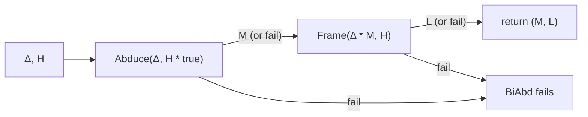

[[book-guidelines|↩ Back to guidelines]]

## Why abduction alone isn't enough

Section 2.2 of the paper already gives you plain abduction: at a call site you have an assertion $A$, the callee wants precondition $G$, and $A$ doesn't imply $G$. You ask "what would I need to add to $A$ to make it imply $G$?" — formally, solve $A * ?M \vdash G$ for the missing piece $M$. That's enough to synthesize preconditions, and it's the whole content of the `Abductive-Inference` topic.

But look at what abduction *throws away*. Suppose $A$ is bigger than what the callee actually needs — it describes some heap cells the callee never touches. Plain abduction only asks "what's missing," never "what's left over." If you want to resume symbolic execution *after* the call, you need to know what's still around: the part of $A$ that wasn't consumed. That leftover portion is called the **frame**, and computing it is a completely different, well-studied problem — **frame inference** — that predates this paper (Berdine et al. 2005b). Ordinary abduction and ordinary frame inference are two separate procedures solving two separate questions. **Bi-abduction is what you get when you need both answers at once, and — crucially — need to figure out the missing part in order to identify the leftover part.**

What breaks without this: if you only run frame inference, you can propagate leftover heap through a call, but the moment the caller's state doesn't fully satisfy the callee's precondition, frame inference itself gets stuck — it presupposes $A \vdash G * L$ actually holds. You can't compute a frame for an entailment that isn't provable yet. Bi-abduction removes that presupposition by letting the entailment be "fixed up" with an anti-frame *before* frame inference is asked to run.

## Bi-abduction as joint inference of anti-frames and frames

The paper states it plainly in the abstract: bi-abduction "jointly infers anti-frames (missing portions of state) and frames (portions of state not touched by an operation)." Both unknowns sit in one entailment:

$$A * \mathord{?\text{anti-frame}} \vdash G * \mathord{?\text{frame}}$$

Read left to right: $A$ is what you actually have (the caller's current symbolic heap), $G$ is what's required (the callee's precondition). The anti-frame is the deficit — what $A$ is missing to satisfy $G$. The frame is the surplus — what's in $A$ (plus the anti-frame) that $G$ doesn't care about and that survives, unconsumed, into the postcondition.

The paper's worked example (§2.3) makes the coupling concrete. Take the same `foo(x,y)` from §2.2, with summary `{list(x) * list(y)} foo(x,y) {list(x)}`, but now call it inside a slightly richer caller:

```c
struct node* q(struct node *y) {           // Inferred Pre: list(y)
  struct node *x, *z;
  x = malloc(sizeof(struct node)); x->tail = 0;
  z = malloc(sizeof(struct node)); z->tail = 0;
  // Abduced: list(y), Framed: z|->0
  foo(x, y);                                // Obtained Post: list(x) * z|->0
  // Abduced: emp, Framed: emp
  foo(x, z);                                // Obtained Post: list(x)
  return x;
}                                            // Inferred Post: list(ret)
```

At the call `foo(x,y)` the current heap is $x{\mapsto}\text{nil} * z{\mapsto}\text{nil}$. The callee wants $\mathit{list}(x) * \mathit{list}(y)$. Solving

$$x{\mapsto}\text{nil} * z{\mapsto}\text{nil} * \mathord{?\text{anti-frame}} \vdash \mathit{list}(x) * \mathit{list}(y) * \mathord{?\text{frame}}$$

gives anti-frame $= \mathit{list}(y)$ (exactly as before — we still don't know anything about $y$, so we assume the caller must have supplied it) *and* frame $= z{\mapsto}\text{nil}$ — the cell for $z$ plays no role in this call and survives untouched. The postcondition after the call is the callee's own post, `list(x)`, reunited with the frame: `list(x) * z|->0`. That's the mechanism that lets the *second* call, `foo(x,z)`, immediately succeed with an empty anti-frame — the frame computed at the first call site is exactly the resource the second call needs, discovered and threaded through by one bi-abductive step rather than two independent analyses. This is the concrete cash value of "joint": frame inference at one point and anti-frame inference at the next are not independent facts you could compute separately and expect to compose correctly — they come from a single search over the same entailment.

**Rust framing.** If you were implementing this, an anti-frame and a frame are answers to two holes in the same query, so the natural signature returns both together rather than as two separate calls:

```rust
/// A minimal, decidable fragment of separation-logic assertions
/// (points-to facts, list-segment predicates, pure equalities).
struct SymbolicHeap { /* ... */ }

enum BiAbdError { Fail }

/// Solves  delta * ?anti_frame |- h * ?frame
fn bi_abduce(delta: &SymbolicHeap, h: &SymbolicHeap)
    -> Result<(SymbolicHeap /* anti-frame */, SymbolicHeap /* frame */), BiAbdError>
{
    // implemented in terms of Abduce and Frame — see below
    unimplemented!()
}
```

Notice this signature already tells you something the classical frame-inference signature (`fn frame(a: &Heap, g: &Heap) -> Result<Heap, Error>`) can't: it never fails just because `a` doesn't already entail `g`. It only fails when *no* anti-frame can repair the mismatch (or when the resulting state would be inconsistent) — a strictly weaker precondition on success, which is exactly the point.

## Bi-abduction as an inverse to the frame problem

The abstract's own phrase is precise and worth taking literally: "Bi-abduction displays abduction as a kind of inverse to the frame problem." The ordinary **frame inference problem** (as posed in prior separation-logic work) is: given $H_0$ and $H_1$, find $L$ such that $H_0 \vdash H_1 * L$ — i.e., find what's left over, *assuming the entailment already holds*. Frame inference presupposes that $H_0$ is at least as strong as $H_1$; its only job is to identify the residue.

Bi-abduction inverts that presupposition. Instead of assuming $\Delta \vdash H$ already holds and asking only for the residue, it asks: what would need to be *conjoined onto $\Delta$* to make the entailment hold, and only then, what residue is left? In other words, plain frame inference computes a function of a *given* proof; bi-abduction computes the missing premise that *makes* a proof possible, and treats frame inference as a subroutine to run once that premise exists. This is why the paper doesn't propose a new, monolithic bi-abductive proof system from scratch (§3.5): "it turns out that there is a way to answer the question by appealing to separate frame inference and abduction procedures." Bi-abduction is architecturally a composition of (1) ordinary abduction, solving for the missing hypothesis, feeding into (2) ordinary frame inference, solving for the residue — abduction supplies exactly the premise that frame inference's presupposition needs.

## The bi-abductive question, formally

Definition 3.26 in the paper states it exactly as motivated above:

> **Definition (Bi-Abduction).** Given symbolic heaps $\Delta$ and $H$, find symbolic heaps $\mathord{?\text{anti-frame}}$ and $\mathord{?\text{frame}}$ such that
> $$\Delta * \mathord{?\text{anti-frame}} \vdash H * \mathord{?\text{frame}}$$

Two supporting procedures are assumed as building blocks, each with its own soundness contract, stated independently of *how* they're implemented (this is a specification, not yet an algorithm):

- **`Frame`**, from prior work, with the contract
$$\mathrm{Frame}(H_0, H_1) = L \;(\neq \mathrm{fail}) \implies H_0 \vdash H_1 * L$$
  i.e. if it doesn't fail, whatever it returns really is a sound residue.

- **`Abduce`** (Algorithm 2 in the paper), with the contract
$$\mathrm{Abduce}(\Delta, H) = M \;(\neq \mathrm{fail}) \implies \Delta * M \vdash H$$
  i.e. if it doesn't fail, whatever missing piece it returns really does patch the entailment. Internally, `Abduce` runs the heuristic proof system of §3.2 (the one built from `Abductive-Inference`'s bottom-up rule reading) to find a candidate $M$ with $\Delta * [M] \rhd H$, then double-checks $\Delta * M$ is consistent — an abduced anti-frame that makes the heap self-contradictory is worthless, so `Abduce` rejects it and fails instead.

Both contracts are one-directional ("if it succeeds, it's sound") rather than "iff" — neither procedure is required to be complete. That's a deliberate design choice carried over from the rest of the paper: soundness is never negotiable, completeness is explicitly out of scope (see the chapter's closing "Discussion," §3.6).

## The BiAbd algorithm: combining Abduce and Frame

Algorithm 3 assembles the two subroutines into one bi-abductive solver:

```
Algorithm 3 — BiAbd(Δ, H):
    M := Abduce(Δ, H * true)
    L := Frame(Δ * M, H)
    return (M, L)
```

Walk through why each step is shaped the way it is:

1. **`M := Abduce(Δ, H * true)`.** We ask `Abduce` to patch $\Delta$ up to entail $H * \mathit{true}$, not $H$ itself. The extra `* true` is doing real work: it tells the abduction search "don't worry about matching up leftover material — just find whatever's missing to establish $H$, and let anything else in $\Delta$ float free as an unconstrained residue for now." This is precisely what decouples the anti-frame search from the frame search: `Abduce` never needs to reason about what will be left over, because `true` already absorbs it. Without the `* true`, `Abduce`'s underlying proof system would need built-in frame-computation machinery, collapsing the modularity the two-subroutine design buys you.
2. **`L := Frame(Δ * M, H)`.** Now that $M$ has been found, $\Delta * M \vdash H$ genuinely holds (by `Abduce`'s contract) — frame inference's presupposition is satisfied, so it's safe to hand $\Delta * M$ and $H$ to the ordinary `Frame` procedure and let it compute the honest residue $L$.
3. **`return (M, L)`.**

**Theorem 3.27 (soundness of BiAbd).** $\mathrm{BiAbd}(\Delta, H) = (M, F) \implies \Delta * M \vdash H * F$. This follows immediately by chaining the two subroutine contracts — it is not a new proof, just composition of two already-proved facts, which is the entire payoff of having factored the problem this way.



**Rust sketch**, showing the actual dependency between the two calls (this is the part of the paper that's *directly* algorithmic, not just a specification, so it's worth grounding concretely):

```rust
fn abduce(delta: &SymbolicHeap, goal: &SymbolicHeap) -> Result<SymbolicHeap, BiAbdError> {
    // Runs the heuristic proof system of §3.2 bottom-up, then checks
    // delta * M is consistent before accepting M.
    let m = run_heuristic_abduction(delta, goal)?;
    if is_inconsistent(&conjoin(delta, &m)) {
        return Err(BiAbdError::Fail);
    }
    Ok(m)
}

fn bi_abduce(delta: &SymbolicHeap, h: &SymbolicHeap)
    -> Result<(SymbolicHeap, SymbolicHeap), BiAbdError>
{
    let goal_with_true = conjoin(h, &SymbolicHeap::pure_true());
    let anti_frame = abduce(delta, &goal_with_true)?;          // step 1
    let extended = conjoin(delta, &anti_frame);
    let frame = run_frame_inference(&extended, h)?;             // step 2, now safe
    Ok((anti_frame, frame))
}
```

**Lean framing.** The two subroutine contracts are exactly hypotheses you'd carry as proof obligations if you were formalizing this: `Abduce` and `Frame` aren't total functions on the model, they're partial procedures accompanied by soundness *lemmas* of the shape `h : Abduce Δ H = some M → (Δ * M ⊢ H)`. `BiAbd`'s own soundness theorem is then a two-line proof by `rw` / substitution chaining those two lemmas — structurally identical to how you'd compose two `isDefEq`-style partial procedures in an elaborator and derive a combined correctness lemma from each one's local contract, rather than re-verifying the composite from scratch. This is the same "trusted small kernel, composed procedures" shape that shows up in proof-producing architectures more generally: `Frame` and `Abduce` are the untrusted heuristics; the two implications above are the checkable core that a trusted checker actually needs.

## The bi-abductive frame rule for program analysis

This is where bi-abduction stops being a standalone logical question and becomes the engine of an analysis. Start from the ordinary separation-logic frame rule:

$$\dfrac{\{A\}\,C\,\{B\}}{\{A * F\}\,C\,\{B * F\}} \quad\text{(Frame Rule, usual version)}$$

This rule only tells you when a *specific* enlargement of the precondition by a known frame $F$ is safe. For an analysis it's more useful "backwards": given a triple $\{A\}C\{B\}$ (e.g. a stored procedure summary) and the actual state $P$ found at a call site, adapt the summary to the call site by combining the frame rule with the Hoare rule of consequence:

$$\dfrac{\{A\}\,C\,\{B\} \qquad \mathrm{Frame}(P,A) = L}{\{P\}\,C\,\{B * L\}} \quad\text{(Frame Rule, forwards-analysis version)}$$

This still isn't good enough for automatic use, because it silently assumes $P \vdash A * L$ already holds — exactly the presupposition frame inference can't discharge on its own. Substituting `BiAbd` for `Frame` removes that assumption and gives the rule the paper actually deploys in its program-analysis algorithms (PreGen/PostGen, covered under `Compositional-Program-Analysis-Algorithms`):

$$\dfrac{\{A\}\,C\,\{B\} \qquad \mathrm{BiAbd}(P,A) = (M, L)}{\{P * M\}\,C\,\{B * L\}} \quad\text{(Frame Rule, bi-abductive analysis version)}$$

Read this bottom-up, the way the analysis actually uses it: you're given the procedure summary $\{A\}C\{B\}$ and the state $P$ *before* $C$ in the analyzed program. `BiAbd(P, A)` tells you (a) what's missing from $P$ for $A$ to hold — $M$, which gets folded back into the precondition being synthesized for the *enclosing* procedure — and (b) what in $P$ survives $C$ untouched — $L$, which gets carried forward into the postcondition. One rule application both patches the precondition and propagates state through a call; that's precisely how `p()` and `q()` in §2.3's examples get their inferred pre/post specs assembled statement by statement, purely from local information at each call site, with no whole-program pass required. Logically the rule adds nothing beyond the ordinary frame rule plus consequence — the paper is explicit that it is "just a consequence" of the two — but as an *algorithm schema* it's the load-bearing step that turns a logical entailment-solver into a compositional program analyzer.

## Comparing bi-abductive solutions

Bi-abduction, like plain abduction, is under-determined — many $(M, L)$ pairs can satisfy Theorem 3.27's soundness contract for a given $(\Delta, H)$, and most of them are useless (e.g. $M = \mathit{false}$ trivially discharges anything). §3.5.1 defines an ordering $\sqsubseteq$ to pick a good one, and it's worth noting *which* half of the pair it prioritizes:

$$M \approx M' \iff M \preceq M' \wedge M' \preceq M \qquad\qquad (M,L) \sqsubseteq (M',L') \iff (M \prec M') \vee (M \approx M' \wedge L \vdash L')$$

This is a **lexicographic** order: compare anti-frames first using the spatial betterness order $\preceq$ from plain abduction (`Quality-and-Ordering-of-Abduction-Solutions`); only if they tie ($M \approx M'$) does the comparison fall through to the frames, preferring the logically *stronger* one ($L \vdash L'$ beats $L'$). The paper's own justification for this bias: the anti-frame directly updates the precondition under discovery — get that part right first, because it's the harder resource to walk back later — while the frame just gets tacked onto a postcondition. Example 3.28 in the paper works this out concretely for $x{\mapsto}0 * M \vdash \mathit{ls}(x,0) * \mathit{ls}(y,0) * L$: among three candidate solutions, $(M,L) = (\mathit{ls}(y,0), \mathit{emp})$ beats $(\mathit{ls}(y,0)*z{\mapsto}0,\; z{\mapsto}0)$ purely on a smaller anti-frame, and separately beats $(\mathit{ls}(y,0),\; \mathit{true})$ — tied anti-frames — purely because $\mathit{emp}$ is a logically stronger frame than $\mathit{true}$. `BiAbd`'s two-step structure (find $M$ first, then $L$) is exactly built to respect this priority: it never has to backtrack into a better anti-frame after committing to a frame, because the frame search only starts once the anti-frame is fixed.

## Where this leads

Bi-abduction is the single mechanism the rest of the paper's machinery serves: `Abductive-Inference` and `Quality-and-Ordering-of-Abduction-Solutions` build the `Abduce` half; `Separation-Logic-Foundations` supplies the symbolic-heap fragment both subroutines operate over; and `Compositional-Program-Analysis-Algorithms` is nothing more than the bi-abductive frame rule above, iterated statement-by-statement over a control-flow graph (PreGen) and reconciled with a standard forwards pass (PostGen). The soundness theorem for the whole analysis (`Soundness-and-Semantic-Models`) ultimately bottoms out in Theorem 3.27 — every guarantee the paper makes about `InferSpecs` is inherited from the one-line soundness argument for `BiAbd` given here.

For the standing goals of this workbench (`automated-reasoning`): `BiAbd` is a clean instance of a **proof-producing, partial procedure composed from smaller partial procedures with local soundness contracts**, the exact shape needed for a trusted-kernel architecture where an untrusted search (here, the heuristic abduction proof system) produces a candidate that a separate, simpler checker validates. The lexicographic solution ordering is also a direct preview of the kind of heuristic-quality-vs-soundness tradeoff a CSP/abductive-refinement layer will have to make repeatedly when searching for verification-condition patches rather than raw counterexamples — the same "get the harder half right first, then optimize the easier half" structure recurs anywhere a search is factored into stages with unequal cost of backtracking.
