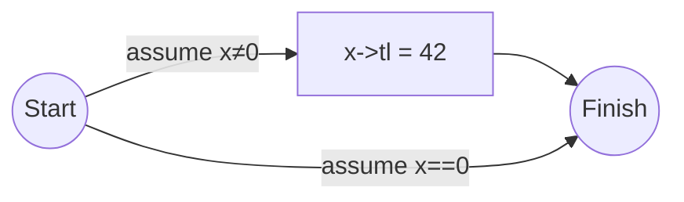
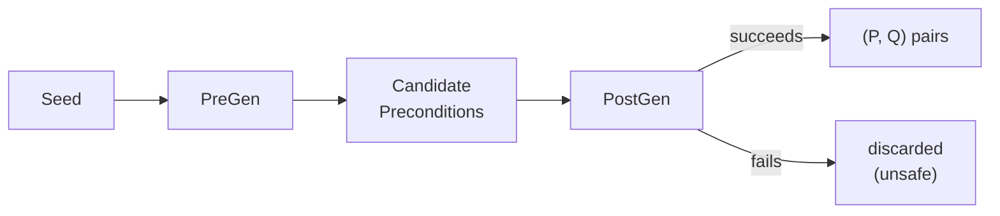
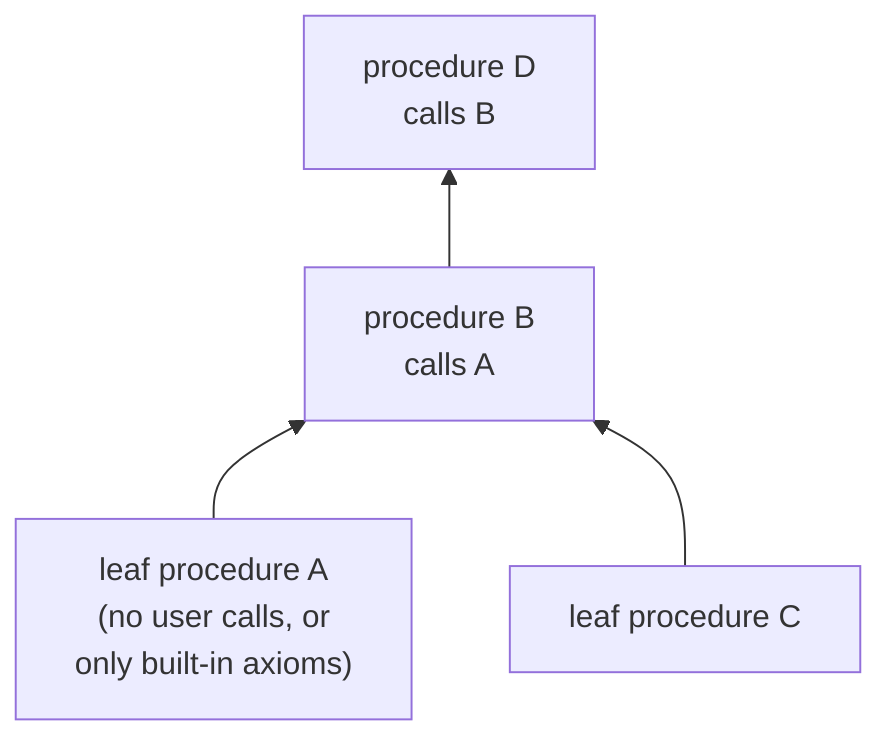

[[book-guidelines|↩ Back to guidelines]]

## Why abduction alone isn't a program analysis

Everything up to this chapter answers a *local* logical question: given some current state and some formula you're trying to prove, what's missing (the anti-frame) and what's left over (the frame)? That's abduction and bi-abduction as inference rules. But an inference rule is not an algorithm that walks a program. You still need to decide: where do you start, what do you do at a branch, what do you do at a loop, what do you do when a call site could match several possible specs, and — critically — how do you know when to *stop trusting* a candidate precondition you invented along the way.

This chapter is the wiring that turns "bi-abduction as a proof rule" into "bi-abduction as a compiler pass." It's organized around three algorithms:

- **PreGen** — given a starting shape (possibly just "nothing is known"), run a *forward* symbolic execution that uses abduction every time it would otherwise fail, and harvest the set of preconditions this generates as a byproduct.
- **PostGen** — a completely ordinary forward analysis (no abduction) that, given a *precondition*, tries to prove the program safe and compute its postcondition.
- **InferSpecs** — glue: run PreGen to *propose* preconditions, then run PostGen on each candidate to *check* it, throwing away anything that doesn't actually verify.

This split (propose-by-abduction, then verify-by-ordinary-analysis) is the load-bearing engineering idea of the chapter, and it's worth holding onto as a throughline before diving into notation: **PreGen is allowed to be unsound-looking, even wrong, because InferSpecs never accepts its output on faith.**

## §4.1 — Procedures as control-flow graphs with Hoare-triple summaries

### The representation

A program is not a syntax tree here — it's a control-flow graph (CFG) whose edges are procedure calls. This is a deliberate simplification: instead of separate AST node kinds for assignment, allocation, dereference, and calls to *your own* functions, everything is unified into one shape:

$$(\ell, \; x := f(\vec e), \; \ell')$$

an edge from location $\ell$ to $\ell'$ labeled by a call to procedure $f$. Even `malloc`, `free`, a heap read `[x]`, and a heap write `[x] := y` are procedures — "atomic commands" with their own tiny specs, sitting at the leaves of the call tree. **Definition 4.1** makes this precise: a program is a tuple $(L, \mathit{start}, \mathit{finish}, T, \mathit{summary})$ — a finite set of locations, designated start/finish locations, a set of transitions, and a summary function assigning each procedure name $f$ a set of Hoare triples

$$\{P\}\, f(\vec x) \,\{Q_1 \vee \cdots \vee Q_k\}.$$

**What breaks without this uniformity:** if `malloc`, dereference, and user-defined calls were three different edge kinds, every algorithm below would need three parallel code paths (one per kind) instead of one loop over `summary(f)`. Folding built-ins into the same "spec lookup" machinery as ordinary calls is what makes the algorithm short enough to state cleanly — and it mirrors how real static analyzers actually work: libc functions get hand-written summaries, and the interprocedural engine doesn't care whether a summary was inferred or supplied.

Figure 3 gives the seed summaries — the "small axioms" — for the built-ins used throughout the chapter:

$$\{\mathrm{emp}\}\,\mathtt{malloc}()\,\{(\mathit{ret}\mapsto -) \vee (\mathit{ret}=\mathit{nil} \wedge \mathrm{emp})\}$$
$$\{x\mapsto -\}\,\mathtt{free}(x)\,\{\mathrm{emp}\}$$
$$\{x\mapsto - \wedge y{=}Y\}\,[x]{:=}y\,\{x\mapsto Y \wedge y{=}Y\}$$
$$\{x\mapsto X\}\,\mathtt{return}[x]\,\{x\mapsto X \wedge \mathit{ret}=X\}$$

Notice the disjunction in `malloc`'s postcondition — succeed with a fresh cell, *or* fail and return `nil` with nothing allocated. That single disjunct is what forces every algorithm downstream to be disjunction-aware from the start; a Hoare-triple system that could only talk about single symbolic heaps would already be too weak to describe `malloc`.

**Rust grounding.** The natural encoding is almost literal:

```rust
struct Program {
    locations: HashSet<Location>,
    start: Location,
    finish: Location,
    transitions: Vec<(Location, Call, Location)>,
    summaries: HashMap<ProcName, Vec<HoareTriple>>,
}

struct Call { target: ProcName, args: Vec<Expr>, result: Option<Var> }

struct HoareTriple {
    pre: SymbolicHeap,
    post: Vec<SymbolicHeap>, // disjuncts Q1 .. Qk
}
```

If you've built (or plan to build) an interprocedural dataflow framework, this is exactly the shape of a call-graph edge annotated with a summary — the same representation `PostGen`/RHS-style algorithms use, just with symbolic-heap lattice elements instead of, say, interval-abstraction facts. The paper explicitly notes it ignores `if`/`while` as first-class constructs — they get compiled to nondeterministic branching via `assume`, which shows up on distinct CFG out-edges (see the diagram in §4.2 below).

## §4.2 — The PreGen algorithm

### The core idea: turn every proof failure into a question, not a dead end

Ordinary tight-triple symbolic execution is *brittle*: the moment a statement might fault (e.g. `free(x)` when you don't know `x` points to anything), the proof attempt is simply invalid and you give up. PreGen's central move is to **not give up** — instead, whenever a step would fault, it asks bi-abduction "what would I have needed to have, to make this step safe?" and folds the answer into a growing precondition, then *keeps executing* as if that assumption had been true all along.

This is exactly the informal move from Chapter 2, now made into worklist pseudocode. **Algorithm 4 (PreGen)** is a modified reachability/worklist algorithm à la Jhala–Majumdar, tracking triples $(\ell, \mathit{pre}, \mathit{curr})$ — location, the precondition accumulated so far, and the current abstract heap:

```
PreGen(Seed):
  ws := {(start, p, p) | p in Seed};  reach := ∅
  while ws ≠ ∅:
    pick (ℓ, pre, curr) ∈ ws, remove it
    if (ℓ, pre, curr) ∉ reach: reach := reach ∪ {(ℓ, pre, curr)}
    for each out-edge (ℓ, x := f(e⃗), ℓ') from ℓ:
      let ∃X̄.Δ = curr
      for each {P} f(x⃗) {Q} in summary(f):
        P' := P[e⃗/x⃗];  Q' := Q[e⃗/x⃗]           // instantiate params
        if AbduceAndAdapt(Δ, P', Q', X̄) = (M, L, e⃗', Ȳ) ≠ fail:
          newpre  := abstract#(pre * M)
          for each Q ∈ Q':
            pick fresh Z
            newpost := abstract#(∃X̄Z. (Q * L)[Z/x][x/ret, e⃗'/Ȳ])
            ws := ws ∪ {(ℓ', newpre, newpost)}
  return { p | ∃c. (finish, p, c) ∈ reach }
```

Three things are doing all the work here, and each deserves unpacking before the toy examples make sense:

1. **Line 13 — `AbduceAndAdapt` instead of plain entailment check.** A standard forward analysis would just check "does `curr` entail `P'`?" and fail otherwise. PreGen instead calls bi-abduction: it asks for a missing anti-frame $M$ (what's needed but absent) *and* a leftover frame $L$ (what's present but untouched), simultaneously handling variable adaptation. We unpack this subroutine below.
2. **Line 14 — the precondition accumulates by `*`-conjunction.** Every time a new fact is missing, it gets separately conjoined onto whatever preconditions were already accumulated: `newpre := abstract#(pre * M)`. This is what lets PreGen discover `x↦– * y↦–` from two separate `free` calls without ever restarting the analysis (Example 4.2 below).
3. **Line 27 — only *final* preconditions are reported.** PreGen doesn't report every intermediate precondition that arose mid-execution; it only reports the ones on triples that reached `finish`. This single design choice is what gives PreGen its bias toward *terminating* executions — a subtlety worth sitting with (Examples 4.5–4.6 below).

Abstraction (`abstract#`) is applied twice — once to `pre` (line 14) and once to `newpost` (line 18) — and the paper is careful to flag an asymmetry: applied to the *current state*, abstraction is a sound deductive step (you're generalizing something you've already proven safe, so generalizing it further is still safe — the frame rule licenses running the same proof on a bigger heap). Applied to a *precondition*, though, abstraction is **inductive, not deductive**: you're guessing that a pattern you observed (say, one linked cell) generalizes to an entire structure (a list segment), and nothing guarantees that guess is valid. This is precisely why InferSpecs exists as a second, independent verification pass (§4.3) — PreGen's preconditions are hypotheses, not proofs.

**What breaks without abstraction on preconditions specifically:** without generalizing "one cell was accessed" into "a list segment was accessed," a loop that walks an unbounded list would force PreGen to explore unboundedly many distinct concrete shapes (one cell, two cells, three cells, ...) and never terminate — this is the "infinite regress problem" from Chapter 2's `foo`/loop example, now embedded as a chapter-4 algorithmic concern rather than an intuition.

### Seeding the algorithm

A typical seed is $x_1{=}X_1 \wedge \cdots \wedge x_n{=}X_n \wedge \mathrm{emp}$ — the procedure's real parameters $x_i$ pinned to fresh *logical* variables $X_i$ that appear nowhere else in the program. The reason for this indirection: the analysis is going to talk about "the value $x$ had *at entry*," and if $x$ itself gets reassigned partway through the procedure, you need a name that's immune to that mutation. Discovered preconditions get expressed in terms of the $X_i$, and only afterward does the tool substitute $x_i$ back in for presentation. (If a parameter is never reassigned, you can skip this dance and just use $x_i$ directly — the paper notes this as an optimization, not a soundness requirement.)

### Toy example 1 — the frame rule pays for itself (Example 4.2)

```c
void continue_along_path(struct node *x, struct node *y) {
  free(x); free(y);
}
```

Starting from $x{=}X \wedge y{=}Y \wedge \mathrm{emp}$: `free(x)` needs $x\mapsto{-}$, which is missing, so it's abduced. Symbolic execution then *continues* (doesn't restart) and hits `free(y)`, abducing $y\mapsto{-}$ as well, conjoined onto the running precondition: $x\mapsto{-} * y\mapsto{-}$.

The point isn't the arithmetic — it's *why continuing is safe* rather than a hack. The justification is the ordinary separation-logic frame rule, applied retroactively: if you'd already proved $\{H_0\}\,\pi\,\{H_1\}$ for the path $\pi$ up to the fault point, and bi-abduction gives you $\{H_1 * A\}\,a\,\{H_2 * L\}$ for the faulting statement $a$, then the frame rule says $\{H_0 * A\}\,\pi\,\{H_1 * A\}$ *also* holds — so $\{H_0 * A\}\,\pi;a\,\{H_2*L\}$ follows by ordinary sequential composition. In other words: retroactively enlarging the precondition of the *whole prefix* to cover the newly-discovered requirement is licensed by the same rule that lets a small spec run on a bigger heap. Restarting from scratch would re-derive the same conclusion at the cost of re-analyzing everything before the fault — wasteful when $\pi$ is long, and the paper is candid that this "continue" strategy is a heuristic, not a universally-better one (a branchy $\pi$ can make "stop and restart" preferable in some cases).

### Toy example 2 — try every applicable spec, not just the first (Example 4.3)

```c
void safe_reset(int *y) {          // SUMMARY ONLY
  // Given Pre1: y=0 ∧ emp         // Given Post1: y=0 ∧ emp
  // Given Pre2: y≠0 ∧ y↦–         // Given Post2: y≠0 ∧ y↦0
}
void safe_reset_wrapper(int *y) { safe_reset(y); }
```

Starting from `emp`, PreGen finds `emp` abducible against `Pre1` ($y{=}0$). A standard interprocedural analysis would stop there — one matching spec is enough, and trying more can only cost precision/efficiency if the domain lacks a meet operator. PreGen deliberately doesn't stop: it *also* tries `Pre2` ($y\mapsto{-}$), finds `emp` abducible against it too (abducing $y\mapsto{-}$ itself, i.e. the memory just needs to exist), and so discovers **two** preconditions — $y{=}0 \wedge \mathrm{emp}$ and $y{\neq}0 \wedge y\mapsto{-}$ — where a single-match analysis would only ever find the first.

This is a genuine departure from classical interprocedural analysis (line 11's `for all` instead of `find first`), and it's justified precisely because PreGen's job is precondition *discovery*, not postcondition *precision* — those are different objectives, and this chapter treats them as requiring different algorithms (PreGen vs. PostGen) rather than one algorithm doing double duty.

### The assume-as-assert heuristic

`if B then C1 else C2` compiles to a nondeterministic choice `(assume B); C1 + (assume ¬B); C2` on distinct CFG out-edges. The textbook specs are

$$\{B \wedge \mathrm{emp}\}\,\mathtt{assert}\,B\,\{B \wedge \mathrm{emp}\} \qquad \{\mathrm{emp}\}\,\mathtt{assume}\,B\,\{B \wedge \mathrm{emp}\}$$

— `assert` *demands* $B$ already hold; `assume` doesn't, it just adds the fact for free. That asymmetry is exactly the problem for precondition generation.

```c
void why_assume_as_assert(struct node *x) {
  if (x != 0) { x->tl = 42; }
}
```



Interpreting `assume` the textbook way (`{emp} assume B {B ∧ emp}`), the `x==0` branch contributes *nothing* to the precondition — it starts from `emp` and stays `emp` all the way to `Finish`. Since PreGen's precondition for the whole procedure is built by combining what's needed along *all* paths that reach `finish`, and the mutation on the other branch demands $x\mapsto Z$, you'd only ever get the single, overly strong precondition $x\mapsto Z$ — silently ruling out calling this function with `x == 0`, even though that's perfectly safe.

The fix: treat `assume B` **as if it were `assert B`**, i.e. temporarily use $\{B \wedge \mathrm{emp}\}\,\mathtt{assume}\,B\,\{B \wedge \mathrm{emp}\}$ purely for precondition-generation purposes. Now the $x{=}0$ branch's precondition is forced to record $x{=}0 \wedge \mathrm{emp}$ explicitly, and PreGen discovers **two** preconditions: $x\mapsto Z$ and $x{=}0 \wedge \mathrm{emp}$ — the second of which correctly does *not* rule out the safe branch.

**What breaks without this heuristic:** any procedure that only dereferences memory after a guard (extremely common — every null check, every "is this list non-empty" test) would get a precondition needlessly entangled with, or blind to, the branches that never touch the guarded memory. The heuristic is explicitly a heuristic, though — the implementation tries "assume as assert" first and *falls back* to plain "assume as assume" when the trick doesn't produce a usable result (Example 4.8, below, is exactly such a failure case: there's simply no way to push the needed fact back to a pre-state variable, regardless of how `assume` is interpreted).

### Termination-sensitive preconditions (Examples 4.5–4.6)

Because PreGen only reports preconditions attached to triples that reach `finish` (line 27), it has a *structural* bias toward preconditions that guarantee termination — not by any explicit termination check, but as a side effect of "unreachable = unreported."

```c
void avoid_provable_divergence(int x) {
  if (x == 0) { while (1) {} }
}
```

Analysis discovers $x{\neq}0 \wedge \mathrm{emp}$ — sufficient to *avoid* the diverging branch. There's a second precondition, $x{=}0$, that's equally *safe* (no memory fault) but leads straight into the infinite loop; PreGen never reports it, because the triple carrying $x{=}0$ just keeps re-entering the loop's own worklist entry and never reaches a state at `finish`.

```c
void not_total_correctness() {
  struct node *y;
  y = malloc(sizeof(struct node));
  if (y) { while (1) {} }
}
```

Here PreGen finds `emp` as *the* precondition — via the path where `malloc` fails (`y == nil`), which reaches `finish`. But there genuinely is **no** precondition that guarantees termination for this procedure under this semantics: `malloc`'s spec treats success/failure as a free nondeterministic choice (Figure 3's disjunctive post), and success leads to unconditional divergence. This isn't an algorithmic gap to be fixed — it's a true fact about the program's semantics as given. (A more detailed semantics tracking actual memory size could, in principle, support a precondition ruling out `malloc` failure and thus prove divergence — but that's outside the model here.)

The authors are explicit that "report preconditions surviving to `finish`" isn't the *only* sensible design (you could record the divergence-implying ones too), just the one they picked, and they use these two examples pedagogically rather than as a defense of that choice.

### AbduceAndAdapt and Rename — variable adaptation at call sites

This is the intricate machinery hiding inside line 13, and it's worth slowing down for because it's where "abduction as a logical rule" meets "Hoare-logic adaptation as decades-old plumbing" (Hoare 1971, Cook, Kleymann).

**The problem in one sentence:** bi-abduction finds you an anti-frame $M$ and frame $L$ expressed in terms of the *callee's* logical variables and the *call site's current* program variables — but a precondition you're building has to be expressed only in terms of quantities that existed *before the procedure even started* (the $X_i$ from the seed). If $M$ mentions a program variable that gets reassigned three lines later, using $M$ as part of the precondition would be simply wrong.

Figure 4 gives the two subroutines:

```
AbduceAndAdapt(Δ, P, Q, X̄):
  if BiAbd(Δ, P) = (M, L) ≠ fail
     and Rename(Δ, M, P, Q, X̄) = (e⃗, Ȳ, M₀) ≠ fail:
    return (M₀, L, e⃗, Ȳ)
  else: return fail

Rename(Δ, M, P, Q, X̄):
  let Ȳ = FreeLVar(P, Q)
  pick e⃗ disjoint from Ȳ such that Δ * M ⊢ e⃗ = Ȳ,     else fail
  pick M₀ disjoint from Ȳ, X̄, and program vars such that
       Δ * M₀ ⊢ Δ * M[e⃗/Ȳ],                            else fail
  return (e⃗, Ȳ, M₀)
```

Conceptually the whole thing is one instance of the **bi-abductive frame rule**:

$$\frac{\{A\}\,C\,\{B\} \qquad \mathrm{BiAbd}(P, A) = (M, L)}{\{P * M\}\,C\,\{B * L\}}$$

— but dressed up with the extra bookkeeping that `Rename` performs: re-expressing the abduced anti-frame $M$ in terms of variables ($\bar Y$, chosen fresh or already free in $\Delta$) that are guaranteed *not* to be clobbered before this precondition gets used.

**Worked example (4.7) — `swap`.** Given the spec $\{x\mapsto X * y\mapsto Y\}\,\mathtt{swap}(x,y)\,\{\mathit{ret}{=}\mathit{nil} \wedge x\mapsto Y * y\mapsto X\}$ and a call site with $\mathit{pre} = (x{=}X \wedge y{=}Y \wedge X\mapsto Z)$, $\mathit{curr} = (y{=}Y \wedge x\mapsto y * z\mapsto 0)$, calling `v := swap(x, y)`:

- `BiAbd` on $\mathit{curr}$ against the instantiated precondition $x\mapsto X' * y\mapsto Y'$ finds $M = (X'{=}y \wedge Y'{=}W \wedge y\mapsto W)$ and leftover $L = z\mapsto 0$.
- `Rename` turns this into $M_0 = (Y\mapsto W)$ — expressed via the *existing* logical variable $Y$ and a fresh $W$, with $\vec e = (y, W)$ instantiating $(X', Y')$.
- The precondition gets extended: $\mathit{pre} * Y\mapsto W \iff x{=}X \wedge y{=}Y \wedge X\mapsto Z * Y\mapsto W$.
- The current heap, mutated per `swap`'s postcondition plus the frame, becomes $v{=}0 \wedge x\mapsto W * y\mapsto Z * z\mapsto 0$.

Every piece of this — the fresh variable $W$, the reuse of $Y$ rather than some call-site-local name — exists so that the resulting precondition can be handed, unmodified, to a *different* call site or reused as this procedure's own summary later, independent of how `x`/`y` happen to be named or mutated in this particular caller.

**Failure case (Example 4.8) — when adaptation is simply impossible.**

```c
void cannot_verify(int x) {
  int y = f(x);      // f's spec: {emp} f(x) {emp} — y could be *any* int
  g(y);               // g's spec: {x≠0} g(x) {emp}
}
```

At the call to `g`, bi-abduction correctly determines you need $y{\neq}0$. But $f$'s spec is entirely noncommittal about the *value* it returns — logically, $y$ could be anything — so there is no formula over the pre-state variable $X$ (the initial value of $x$) that implies $y{\neq}0$ at this program point. `Rename` fails, and — unlike the assume-as-assert fallback available for branching — there's no fallback here: **verification for this call genuinely fails.** (Whether $f$'s real implementation happens to be deterministic doesn't matter: if you only have its *spec*, and the spec says "nondeterministic," the analysis must treat it that way — exactly as a type checker must treat an opaque `dyn Trait` call as unable to promise more than the trait's interface does.)

**Python sketch of the adaptation logic** (illustrative only — the real thing needs a full unifier/entailment prover underneath `⊢`):

```python
def rename(delta, M, P, Q, params):
    Y = free_logical_vars(P, Q)
    for e in candidate_terms(delta, M, exclude=Y):
        if entails(delta_star(delta, M), equalities(e, Y)):
            for M0 in candidate_formulas(exclude=Y | params | prog_vars(delta)):
                if entails(delta_star(delta, M0), delta_star(delta, substitute(M, e, Y))):
                    return e, Y, M0
    return None  # fail
```

### Bi-abduction and footprints (§4.2.4): what the theory promises

This subsection is explicitly flagged by the authors as skippable, but it's the piece that connects everything above back to the "footprint" idea from Chapter 1 — the minimal memory a command actually touches.

**Precise predicates (Definition 4.9).** $P$ is *precise* if for every stack/heap pair $(s,h)$ there is *at most one* sub-heap $h_f \subseteq h$ satisfying $P$ — i.e., "the part of the heap $P$ is talking about" is unambiguous, not just "some part or other." This precision is exactly what makes "the accessed cells" a well-defined notion rather than a family of equally-valid candidates.

**Safe states and footprint (Definition 4.10).** For a straight-line sequence of actions $C$, with $\mathrm{spec}(\alpha) = \{P_\alpha\}\,\alpha\,\{Q_\alpha\}$:

$$\mathrm{safe}(\alpha) \overset{\mathrm{def}}{=} P_\alpha * \mathrm{true}, \qquad \mathrm{safe}(\alpha; C) \overset{\mathrm{def}}{=} P_\alpha * (Q_\alpha \twoheadrightarrow \mathrm{safe}(C))$$
$$\mathrm{foot}(C) \overset{\mathrm{def}}{=} \min(\mathrm{safe}(C))$$

using the magic wand $\twoheadrightarrow$ to state "whatever's needed to run the rest of $C$ safely, on top of what $\alpha$ leaves behind." **Theorem 4.11** then says: if every $P_\alpha$ is precise and bi-abduction always returns the *best* (weakest/smallest) anti-frame, then the precondition generated by chaining bi-abduction across $C$ **is** $\mathrm{foot}(C)$ — the analysis doesn't just approximate the footprint, it computes it exactly, under those idealized assumptions. The proof is a clean induction using Lemma/Theorem 3.13 (the best abduction solution is $\min(F \twoheadrightarrow G)$) plus the fact that precision lets $\min$ distribute across the separating conjunction.

This is the theoretical payoff promised back in Chapter 1: bi-abductive analysis isn't just "an inference trick that happens to give plausible answers" — under the right idealization, it is *provably* computing the thing you actually want (the minimal safe state), not some accidental over- or under-approximation of it.

### Two acknowledged refinements the idealized algorithm skips

1. **Partial concretization.** Algorithm 4 as literally stated can get stuck on questions like $x{\neq}\mathit{nil} \wedge \mathit{ls}(x,\mathit{nil}) * ?? \vdash x\mapsto X * \mathrm{true}$ — there's no consistent answer because $X$ can't be matched against an *inductive* predicate on the left. The fix (used in the real Abductor tool, following [Calcagno et al. 2007]) is to *unroll* the inductive definition once — turning $\mathit{ls}(x,\mathit{nil})$ into $\exists Z.\, x\mapsto Z * \mathit{ls}(Z,\mathit{nil})$ — before attempting the match, which is exactly analogous to "materializing a summary node" in classic shape-analysis terms (Sagiv et al.). Symbolic heaps as a *fragment* buy decidability and speed; concretization is the escape hatch you reach for whenever that fragment is too coarse to phrase the entailment you actually need.
2. **The disjunctive frame rule.** The algorithm as stated pretends `Abduce`/`Frame` each return a single formula, when the systematic algorithm from §3.4 can genuinely return disjunctions. This is licensed because $*$ distributes over $\vee$, giving a fully general disjunctive frame rule:
   $$\frac{\{P\}\,a\,\{\bigvee_{k\in K} Q_k\} \qquad H * \bigvee_{i \in I} A_i \vdash P * \bigvee_{j\in J} F_j}{\{\bigvee_{i\in I} H * A_i\}\,a\,\{\bigvee_{j\in J,k\in K} Q_k * F_j\}}$$
   which is just the ordinary frame rule read through the distributivity law $P * \bigvee_i Q_i = \bigvee_i P * Q_i$. Not a new principle — a bookkeeping convenience for handling case splits (e.g. $\mathit{ls}(x,y) * y\mapsto 0 \vdash x\mapsto{-} * ??$ naturally splits into an $x{\neq}y$ case and an $x{=}y$ case).

## §4.3 — Pre/Post Synthesis: verify what you proposed

### Why PreGen's own output can't be trusted directly

PreGen makes choices that are *deliberately* biased toward generating candidate preconditions — trying every matching spec (not just the first), interpreting `assume` as `assert`, applying inductive abstraction to preconditions. Every one of those choices can produce a precondition that is **not actually safe**. So InferSpecs treats PreGen purely as a *proposal generator*, and re-checks each proposal with an ordinary, non-abductive, no-tricks forward analysis: **PostGen**.

```
InferSpecs(Seed):
  Specs := ∅
  CandidatePreconditions := PreGen(Seed)
  for P in CandidatePreconditions:
    if PostGen(P) = Q ≠ fail:
      Specs := Specs ∪ {(P, Q)}
  return Specs
```



**PostGen (Algorithm 6)** is what you'd expect from an ordinary forward interprocedural analysis: no abduction, plain frame-rule-plus-adaptation via `FrameAndAdapt` (a strictly simpler cousin of `AbduceAndAdapt` — it doesn't need to invent anything missing, just check entailment, so its formal definition is omitted). Two structural differences from PreGen are worth flagging explicitly:

- **Line 19 — stop at the first matching spec.** Unlike PreGen's "try every spec" (Example 4.3), PostGen exits its inner loop the moment one spec matches. This is the normal interprocedural-analysis discipline the paper contrasted PreGen against earlier — appropriate here because PostGen's job is precise postcondition computation for a *given* precondition, not precondition discovery.
- **Line 22–23 — no match means outright failure.** If *no* spec's precondition is entailed by the current state, PostGen doesn't abduce anything — it returns `fail` for the whole precondition being tested. This is the mechanism that lets `InferSpecs` filter.

### Filtering unsafe candidates by re-execution (Example 4.12)

```c
void nondet_example(struct node *x, struct node *y) {
  if (nondet()) { x->tl = 0; } else { y->tl = 0; }
}
```

PreGen, run path-by-path, discovers $x\mapsto{-}$ (from the `x->tl` branch) and $y\mapsto{-}$ (from the `y->tl` branch) as two separate candidates — each sufficient for the branch it came from, **neither** sufficient for the *other* branch. PostGen re-executing from $x\mapsto{-}$ hits the `y->tl = 0` branch and fails (no entailment of $y\mapsto{-}*\mathrm{true}$); symmetrically for $y\mapsto{-}$. `InferSpecs` filters both out — correctly, since neither is actually safe on its own. (The real safe precondition, $x\mapsto{-} * y\mapsto{-}$, is discoverable if you *iterate* PreGen — feed the failed run's information back in — though the paper treats this as a possible refinement rather than baking it into the idealized algorithm.)

This is a genuine analogue of **CEGAR's** counterexample-refinement loop, worth naming explicitly since it's a Focus Area connection: CEGAR refines the *abstract domain* in response to a spurious counterexample while holding the precondition/spec fixed; here, the roles are inverted — the abstract domain (symbolic heaps + the fixed set of proof rules) stays fixed, and it's the **candidate precondition** that gets refined/filtered in response to a failed re-verification. Same shape of feedback loop, different knob being turned — this is exactly the contrast the paper draws explicitly in its Related Work chapter.

### Filtering by abstraction failure, not just path-sensitivity (Example 4.13)

```c
void needs_even_list(struct node *x) {
  while (x != 0) { x = x->tl; x = x->tl; }
}
```

PreGen discovers two candidates: $x{=}0 \wedge \mathrm{emp}$ (safe) and $x\mapsto X * \mathit{ls}(X, 0)$ (unsafe — filtered by InferSpecs). The unsafe one arises because the abstraction domain's list-segment predicate $\mathit{ls}$ is **oblivious to parity** — it can't distinguish "list of even length" from "list of odd length," yet this loop (advancing two cells per iteration) is only safe on even-length input. No fix to *this specific* abstract domain closes the gap permanently: swap in a parity-aware domain, and (by a general computability argument) some other program will fool *that* domain instead. Filtering-by-re-execution isn't a bug-patch for one weak abstraction — it's the analysis's only generally-available defense against **any** abstraction's blind spots, which is precisely why InferSpecs treats PostGen-verification as mandatory rather than optional.

### The bottom-up recipe for a whole codebase (§4.3.1)

Once a single procedure fragment can be turned into pre/post specs *without reference to its callers*, compositional whole-program analysis is almost a corollary rather than new machinery:



1. **Start at the leaves of the call tree** — procedures whose calls are only to already-specified built-ins (`malloc`, `free`, dereference) — and run `InferSpecs` to get their pre/post specs.
2. **Walk up the tree.** Each procedure's calls to lower procedures now have concrete `summary(f)` entries available, so `InferSpecs` can be run on it exactly as before — the algorithms never needed a whole-program view, only a summary table that happens to be filled in bottom-up.
3. **Mutually recursive groups** need to be handled together (the standard fix from RHS-style bottom-up interprocedural analysis: treat a strongly-connected component of the call graph as one unit and iterate to a fixpoint on it), rather than one procedure at a time.

The chapter is candid that none of this "bottom-up over a call graph" idea is novel on its own — the actual contribution is that the *summaries being propagated* are footprint-shaped Hoare triples discovered by bi-abduction, not hand-written or whole-program-computed ones. This recipe is what later lets the Abductor tool analyze an "incomplete" codebase (no `main`, missing callers) and scale per-procedure timeouts independently — themes taken up in the case-studies chapter.

**Rust sketch of the recipe** (using a `HashMap` as the shared summary table — this is close to how you'd actually structure a real bottom-up interprocedural pass):

```rust
fn analyze_bottom_up(call_graph: &CallGraph, mut summaries: HashMap<ProcName, Vec<HoareTriple>>) {
    for scc in call_graph.topo_order_sccs() {      // leaves first
        // within an SCC (mutually recursive group), iterate to a fixpoint
        let mut changed = true;
        while changed {
            changed = false;
            for proc in &scc {
                let specs = infer_specs(proc, &summaries); // PreGen + PostGen
                if summaries.get(proc) != Some(&specs) {
                    summaries.insert(proc.clone(), specs);
                    changed = true;
                }
            }
        }
    }
}
```

### A forward pointer: §4.4 stops here on purpose

The chapter closes (§4.4, pp. 54–56) by making precise *in what sense* this whole pipeline is sound: it defines the concrete domain of procedure meanings as state-to-powerset functions, the abstract domain of Hoare-triple sets, a concretization function $\gamma$, and states Theorem 4.14 (soundness of `InferSpecs`, in both abstract-interpretation and Hoare-logic phrasing). That material is covered in depth in the companion article **"[[Soundness-and-Semantic-Models|Soundness and Semantic Models]]"** — the short version worth carrying forward from *this* article is: everything PreGen guesses is provisional, and it is exactly the PostGen re-verification pass described above that is doing the soundness-preserving work; §4.4's theorem is essentially the formal certificate that this two-phase design achieves what it looks like it achieves.

## Synthesis: how this fits the larger picture

This chapter is the **Static Analysis & Abstract Interpretation** payload of the paper made concrete: PreGen/PostGen/InferSpecs are a worked instance of invariant generation (discovering Hoare-triple/footprint-style contracts automatically) built on top of a *relational* analysis — the abstract domain here is a set of pre/post pairs, not a transfer function over a fixed abstract state, which is precisely what makes compositionality (analyzing a part with no knowledge of the whole) possible at all. The propose/verify split (PreGen then PostGen) is a concrete, non-toy illustration of a pattern worth recognizing anywhere abstract interpretation meets an open-ended search space: let an unsound-but-productive search phase over-generate candidates, then discharge every candidate through a genuinely sound checking pass before it's trusted. The CEGAR-adjacent connection drawn above (§4.3's filtering loop) is exactly this pattern's counterexample-guided cousin, and belongs on the same shelf as your own project's planned CEGAR-flavored refinement loop for the CSP/counterexample search kernel.

For the compiler-and-elaborator project specifically: `AbduceAndAdapt`/`Rename` (Figure 4) is a fully worked-out instance of **substitution and variable adaptation under an inference procedure** — the exact plumbing problem that shows up again, differently dressed, in a bidirectional elaborator's metavariable instantiation at call/application sites (freshness conditions, "don't let the answer depend on something that could later be reassigned/generalized," disjointness side-conditions on the chosen witnesses). It's worth reading Figure 4 a second time with that correspondence in mind: `Rename`'s freshness and entailment side-conditions are doing for Hoare-triple adaptation what occurs-check and pattern-fragment restrictions do for Miller-style unification — a legality check that exists precisely to keep the inferred witness independent of things that can move underneath it.

## Where this leads

The soundness theorem (§4.4, next article) closes the loop this chapter opens: it states exactly what guarantee `InferSpecs`'s output carries, given everything built here. The case-studies chapter (Chapter 5) is this chapter's empirical payoff — Table I's small-program results are literally "run `InferSpecs` and see what it finds," `merge.c`'s failure is explained by the same shape-abstraction blind-spot mechanism as the `needs_even_list` example above, and the Firewire/Linux-kernel scalability results depend directly on the bottom-up recipe's per-procedure independence (§4.3.1) to make per-procedure timeouts and partial analysis of incomplete codebases possible at all.
