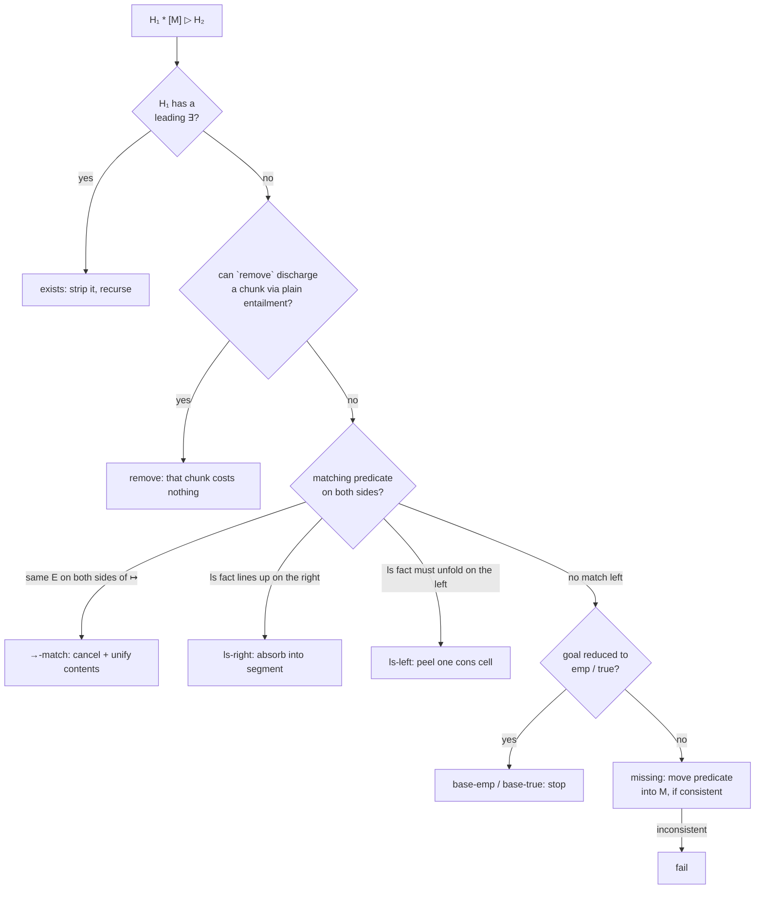
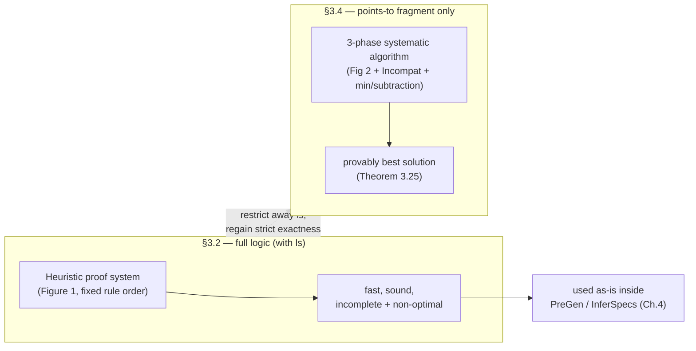

# Proof Systems and Algorithms for Abduction

[[book-guidelines|↩ Back to guidelines]]

[[Abductive-Inference]] laid out *what* abduction is asking for — a missing spatial fact $M$ making $A * M \vdash G$ hold, subject to consistency and minimality. This article is about the machinery that actually *answers* that question: a formal proof system whose rules can be read as a search algorithm (§3.2), and — because that algorithm turns out to be provably incomplete and non-optimal — a second, more disciplined algorithm that computes a genuinely best solution, at the cost of restricting to a smaller fragment of separation logic (§3.4). If the previous article was "what does it mean to fill a gap," this one is "how do you mechanically find the filling, and how do you know when your mechanism is cutting corners."

## From an entailment prover to an abduction prover

Here is the design problem in one sentence: **you already know how to build an entailment prover for symbolic heaps** (does $H_1 \vdash H_2$ hold?), and you want to reuse as much of that machinery as possible to answer a *different* question — "what would need to be added to $H_1$ to make $H_1 \vdash H_2$ hold?"

The naive idea is: run the entailment prover on $H_1 \vdash H_2$, let it get stuck, and read off whatever's left over on the right-hand side as $M$. The paper explicitly considers and rejects this as too weak. Section 3.2.1 walks through why with a worked case (their Example 3.2):

$$x \mapsto y * ?? \vdash x \mapsto X * ls(X, 0) * \mathit{true}$$

A naive "run the prover, harvest the leftovers" approach would match nothing (the left side has a concrete value $y$, the right side has a logic variable $X$, and a plain entailment prover isn't in the business of solving for variables), so it would report the entire right side as missing: $x \mapsto X * ls(X,0)$. Conjoined back onto the premise you'd get $x \mapsto y * x \mapsto X * ls(X, 0)$ — an assertion claiming the same address $x$ holds two different values simultaneously, which is unsatisfiable in any heap. **The naive strategy produces an inconsistent, useless answer.**

What's needed instead is a prover that treats matching cells against each other as an *opportunity to solve for logic variables* — i.e., a small unification step folded directly into the proof rules — rather than a strict syntactic mismatch. That's the actual content of §3.2: a bespoke proof system, not just entailment-proving-plus-bookkeeping.

## A heuristic proof system for abductive inference (§3.2.1)

The proof system works over a three-place judgement

$$H_1 * [M] \rhd H_2$$

read as: "given $H_1$, the heap fact $M$ (written inside brackets to mark it as the thing being *solved for*, not assumed) is enough, combined with $H_1$, to reach $H_2$." The intended soundness reading, baked into the notation choice $* [\cdot]$, is that whenever $H_1 * [M] \rhd H_2$ is derivable, the ordinary semantic entailment $H_1 * M \models H_2$ should hold. This is exactly [[Separation-Logic-Foundations|the same semantic entailment $\models$]] from Chapter 3.1 — the proof system's job is to be a *sound* mechanism for finding witnesses to it, nothing more exotic.

The rules (Figure 1 in the paper) are given for the **Simple Lists** instantiation — $E \mapsto E'$ and one inductive predicate $ls(E, E')$ — and §3.2.3 later shows how to generalize the pattern to arbitrary inductive predicates. Throughout, bound logic variables are assumed fresh (never colliding with other bound or free variables), which is the usual hygiene condition that keeps substitution well-behaved.

Here is every rule, read **top-down first** (as an ordinary soundness-preserving inference rule), because that's the reading under which you can convince yourself each one is safe.

**`exists`** — pushing an existential out of the way:
$$\frac{H_1 * [M] \rhd H_2}{(\exists \vec X. H_1) * [M] \rhd H_2} \quad (X \notin \mathrm{FreeLVar}(M, H_2))$$
If $H_1$ has a bound variable $\vec X$ that doesn't interfere with what you're solving for or with $H_2$, you can just strip the quantifier and reason about the body. Nothing about existentials on the *left* actually complicates abduction, provided freshness holds.

**`remove`** — discharging a piece of the goal *without* touching the anti-frame:
$$\frac{\Pi \wedge \Sigma \vdash \exists \vec X. \Pi' \qquad \Pi \wedge \Pi' \wedge \mathit{emp} \vdash \Sigma'}{(\Pi \wedge \Sigma) * [M] \rhd H * (\exists \vec X. \Pi' \wedge \Sigma')}$$
Both premises here are **ordinary entailment questions**, not abduction questions — this rule is the seam where the whole proof system plugs into an existing separation-logic theorem prover (the paper explicitly treats "a sound prover for plain entailment" as a black-box parameter, citing Smallfoot/SpaceInvader/Sleek/VeriFast/SLAyer/jStar as existing implementations). If the pure part of $H_1$ already proves the pure part of the target, and the target's spatial part $\Sigma'$ is provable from *nothing* ($\mathit{emp}$, under the derived equalities), then that whole chunk $\Pi' \wedge \Sigma'$ is free — no abduction needed for it at all.

**`→-match`** — canceling matching cells and solving for their contents:
$$\frac{(E_0 {=} E_1 \wedge \Delta) * [M] \rhd \exists \vec Y. \Delta'}{\Delta * E \mapsto E_0 * [\exists \vec X. E_0{=}E_1 \wedge M] \rhd \exists \vec X \vec Y. \Delta' * E \mapsto E_1} \quad (\vec Y \cap \mathrm{FreeLVar}(E_1) = \emptyset)$$
This is the rule doing exactly the job the naive strategy above botched: if both sides have a cell at the *same* address $E$, cancel them and record the *contents* as an equation ($E_0 = E_1$) rather than as new spatial obligations. This equation gets folded into $M$ as a side fact. It is a genuine (if narrow) unification step — solving $E_0 := E_1$, or vice versa, whichever side is the variable — happening *inside* proof search, not as a separate pass.

**`ls-right`** — subtracting a points-to fact from a list-segment goal:
$$\frac{\Delta * [M] \rhd \exists \vec X. \Delta' * ls(E_0, E_1)}{\Delta * B(E, E_0) * [M] \rhd \exists \vec X. \Delta' * ls(E, E_1)} \quad (B(E,E_0) \text{ is } E{\mapsto}E_0 \text{ or } ls(E,E_0))$$
If the left side has one link of a chain — a single cell or a shorter segment ending where the target list segment begins — that link gets absorbed *into* the segment on the right, extending it backwards. This is essentially "peeling one cons cell off the front of an inductively-defined list and recursing," read here in the direction of *subtracting* that cell from the goal.

**`ls-left`** — the mirror rule, unfolding a list segment on the left when the goal wants a concrete cell:
$$\frac{(E {\neq} E_0 \wedge \Delta * ls(X, E_0)) * [M] \rhd \exists \vec Y. \Delta'}{\Delta * ls(E, E_0) * [E{\neq}E_0 \wedge M] \rhd \exists \vec X \vec Y. \Delta' * E \mapsto X}$$
This is exactly the base case of the inductive definition of $ls$ being used constructively: $ls(E,E_0)$ is either $\mathit{emp}$ (when $E = E_0$) or $\exists X. E \mapsto X * ls(X, E_0)$ (when $E \neq E_0$). Taking the second disjunct, unfold one step and continue matching.

**`base-emp`** and **`base-true`** — the two axioms that terminate a branch:
$$\frac{}{(\Pi \wedge \mathit{emp}) * [\exists \vec X. \Pi' \wedge \mathit{emp}] \rhd \exists \vec X. \Pi' \wedge \mathit{emp}} \qquad \frac{}{\Delta * [\exists \vec X. \Pi \wedge \mathit{emp}] \rhd \exists \vec X. \Pi \wedge \mathit{true}}$$
`base-emp` says: if the goal's spatial part is already $\mathit{emp}$ and the current heap is also $\mathit{emp}$, the missing fact is just the pure residue $\Pi'$. `base-true` is more permissive — a goal ending in `true` (meaning "anything else may be present, don't ask") is satisfied by *any* leftover heap $\Delta$, so the missing fact only needs to carry the pure part.

**`missing`** — the rule of last resort, which actually manufactures new anti-frame material:
$$\frac{\Delta * [M] \rhd \Delta' \qquad \Delta * \exists \vec X. B(E,E') \nvdash \mathit{false}}{\Delta * [M * \exists \vec X. B(E,E')] \rhd \Delta' * \exists \vec X. B(E, E')}$$
When nothing else applies, this rule moves an entire predicate straight from the goal into the anti-frame — but *only* after checking, via the side condition, that adding it wouldn't make the whole thing inconsistent. This side-condition check is where the **consistency** abducibility constraint from the previous article gets enforced operationally, rule by rule, rather than as an afterthought filter at the end.



### A worked derivation, read as a tree

Example 3.3's derivation for $x{\mapsto}z * [??] \rhd ls(x,z) * ls(y,0) * \mathit{true}$ chains four of these rules:

$$
\cfrac{
  \cfrac{
    \cfrac{
      {}
    }{
      \mathit{emp} * [\mathit{emp}] \rhd \mathit{true}
    } \; \texttt{base-true}
  }{
    \mathit{emp} * [ls(y,0)] \rhd ls(y,0) * \mathit{true}
  } \; \texttt{missing}
}{
  \cfrac{
    \phantom{x}
  }{
    \mathit{emp} * [ls(y,0)] \rhd ls(z,z) * ls(y,0) * \mathit{true}
  } \; \texttt{remove}
}
$$
$$\Rightarrow \quad x{\mapsto}z * [ls(y,0)] \rhd ls(x,z) * ls(y,0) * \mathit{true} \quad (\texttt{ls-right})$$

Reading bottom-up: `ls-right` peels off the $x{\mapsto}z$ cell as the first link of $ls(x,z)$, leaving $ls(z,z)$ still to justify. `remove` then notices $ls(z,z)$ is provable from $\mathit{emp}$ alone (a segment from a point to itself can always be the empty list) and discharges it *for free* — this is the crucial step, discussed below. `missing` then manufactures $ls(y,0)$ as genuinely new anti-frame material, since nothing on the left says anything about $y$. `base-true` closes the branch because the goal ends in $\mathit{true}$.

## Reading the proof rules bottom-up as a search algorithm (§3.2.2)

Every non-axiom rule in Figure 1 has the same shape:

$$\frac{H_1' * [M'] \rhd H_2' \qquad \mathit{Cond}}{H_1 * [M] \rhd H_2}$$

where $\mathit{Cond}$ is a decidable side condition on $H_1, H_2$ (a pattern match, or a call to the plain entailment prover), and $M$ is computed *from* $M'$ by some fixed transformation (adding an equation, wrapping in an existential, etc.). Read top-down this is an inference rule; read **bottom-up**, it is a recursive procedure: check $\mathit{Cond}$, recursively solve the smaller subproblem $H_1' \rhd H_2'$ for $M'$, then post-process $M'$ into $M$. That reading is Algorithm 1 verbatim:

```
Algorithm 1  Abduce1(H1, H2)
Input:  symbolic heaps H1, H2
Output: M such that H1 * [M] ▷ H2 is derivable, or exception fail

if base-emp or base-true applies:
    return the M given directly by the axiom
else if some other rule in Figure 1 applies:
    currentrule := the lowest-ranking applicable rule
                   (rules ranked top-to-bottom as printed in Figure 1)
    M' := Abduce1(H1', H2')      # H1', H2' from currentrule's premise
    M  := (compute from M' per currentrule's conclusion)
    return M
else:
    return fail
```

Because each recursive call strictly shrinks the symbolic heap (a predicate is consumed from one side or the other at every step other than `exists`, which strips a quantifier), the recursion terminates. Counting calls to the underlying plain-entailment prover as unit cost, the paper states the whole procedure runs in **cubic worst-case time** (better typically) — a direct consequence of trying each candidate predicate-pair match in turn against a shrinking heap.

```rust
/// Direct transcription of Algorithm 1's control structure: rules are tried
/// in a *fixed priority order*, and the first applicable one wins — this is
/// the same "ordered alternative rules" shape as a recursive-descent parser
/// or a rewrite-rule-based optimizer pass.
fn abduce1(h1: &SymbolicHeap, h2: &SymbolicHeap) -> Result<SymbolicHeap, Fail> {
    if let Some(m) = try_base_emp(h1, h2)  { return Ok(m); }
    if let Some(m) = try_base_true(h1, h2) { return Ok(m); }
    if let Some((h1p, h2p, post)) = try_remove(h1, h2) {
        let m_prime = abduce1(&h1p, &h2p)?;
        return Ok(post(m_prime));               // remove doesn't touch M at all
    }
    if let Some((h1p, h2p, post)) = try_ptsto_match(h1, h2) {
        let m_prime = abduce1(&h1p, &h2p)?;
        return Ok(post(m_prime));                // post adds E0 = E1 to M'
    }
    if let Some((h1p, h2p, post)) = try_ls_right(h1, h2) { /* … */ }
    if let Some((h1p, h2p, post)) = try_ls_left(h1, h2)  { /* … */ }
    if let Some((h1p, h2p, post)) = try_missing(h1, h2)  { /* … */ }
    Err(Fail)
}
```

The `currentrule := lowest-ranking applicable rule` line is the entire algorithmic content of the "heuristic" in "heuristic algorithm": it is not that any *individual* rule is unsound (Theorem 3.7 below shows the whole system sound regardless of order) — it's that fixing *this particular priority order*, rather than exploring all applicable rules and comparing results, is what makes the algorithm fast, deterministic, and consequently sometimes non-optimal or (as shown below) incomplete.

## Rule ordering to minimize the inferred anti-frame

The priority order is not arbitrary — it is chosen specifically to bias the search toward *smaller* missing facts, in line with the minimality abducibility constraint. Two structural choices carry this weight:

1. **`remove` is tried before `missing`.** Given $\mathit{emp} * [??] \vdash ls(x,x)$, both rules technically apply-able-in-spirit: `remove` can discharge the whole goal for free (an $ls$ from a point to itself is satisfied by the empty heap, so $\mathit{emp} \vdash ls(x,x)$ holds as a plain entailment), returning $M = \mathit{emp}$; `missing` would instead just copy the goal into the anti-frame, returning $M = ls(x,x)$. Since `remove` outranks `missing`, the algorithm always finds the empty (better) answer here. Example 3.3 above showed the same effect on a subterm: without `remove` firing on the $ls(z,z)$ residue, `missing` would have been applied twice, yielding $ls(z,z) * ls(y,0)$ — logically sound, but padded with a redundant conjunct that a "just enough" explanation shouldn't contain.
2. **The predicate-matching rules (`→-match`, `ls-right`, `ls-left`) are tried before `missing`.** This maximizes how much of $H_2$ gets *cancelled against* $H_1$ before anything is conceded as missing — the more that gets matched away, the less ends up needing to be invented.

This operational bias anticipates the formal **spatial betterness ordering** $\preceq$ that [[Quality-and-Ordering-of-Abduction-Solutions|Section 3.3 defines rigorously]] (a topic in its own right elsewhere in this book) — but it's worth noting explicitly that the heuristic algorithm's rule order is a hand-tuned *approximation* of that ordering, not a computation of it. That gap between "approximates the good ordering by construction" and "actually computes the best element under that ordering" is exactly what forces the systematic algorithm of §3.4, discussed below.

## Incompleteness of the heuristic abduction algorithm

Fixing one priority order buys speed and simplicity, but it costs both **optimality** and, in a sharper failure mode, **completeness** — cases where a solution exists but the algorithm reports `fail` outright.

**Non-optimality (Example 3.4).** For $x{\mapsto}3 * [??] \vdash y{\mapsto}3 * \mathit{true}$, the proof system finds $y{\mapsto}3$ — a perfectly valid answer (add a fresh, unrelated cell at $y$). But another solution, $(y{=}x \wedge \mathit{emp})$, is also valid: if $y$ just *happens to alias* $x$, nothing needs to be added at all. If disjunction were allowed in the target fragment, the truly best answer would be $y{\mapsto}3 \vee (y{=}x \wedge \mathit{emp})$ — covering both cases. The heuristic algorithm structurally cannot produce this: it makes no case split on aliasing at all. The paper defends this choice deliberately, not as an oversight, citing three concerns: exploding disjunctions from pairwise-comparing every pointer would kill performance on large codebases; computing the *actual* best solution (once "best" is even defined, which needs the machinery of §3.3) is nontrivial even offline; and empirically, if a program itself never checks for this kind of aliasing, the *proof* doesn't need to consider it either — if the program *does* check (e.g. traversing a possibly-cyclic list), the program's own conditional branch will already trigger the necessary case split during symbolic execution, so the aliasing possibility isn't silently lost, just handled elsewhere.

**Outright incompleteness (Example 3.6).** Drop the trailing $\mathit{true}$ from the previous question:

$$x{\mapsto}3 * [??] \vdash y{\mapsto}3$$

A solution still exists — $(y{=}x \wedge \mathit{emp})$ works exactly as before — but now **no rule in Figure 1 applies at all**, and `Abduce1` returns `fail`. Without the trailing $\mathit{true}$, there's no `base-true` axiom to terminate on, and none of `→-match`/`ls-right`/`ls-left` fire because the addresses $x$ and $y$ don't syntactically match. The proof system doesn't merely make a suboptimal choice here — it is *incomplete*: it fails to derive a judgement that is semantically valid. The authors are candid that this is not a corner case that vanishes with more rules; they note that abduction questions *with* a trailing `true` in the goal (the shape actually used throughout the paper's program-analysis algorithms) can still fail similarly in more elaborate cases, a fact attributed to unpublished work by Gorogiannis, Kanovich, and O'Hearn.

The authors' framing of this trade-off is worth stating plainly, because it recurs constantly in applied automated reasoning: a **complete but expensive** decision procedure and a **fast but incomplete** heuristic are not always in tension to be resolved — sometimes the right engineering call is to accept incompleteness explicitly, characterize *where* it bites (aliasing case-splits), and rely on the surrounding system (here, symbolic execution's own branching on program conditionals) to recover the missing cases where it actually matters in practice. This is the same posture SAT/SMT solvers take with incomplete preprocessing simplifications, or a type checker's elaborator takes by restricting unification to a decidable pattern fragment (Miller patterns) rather than attempting full undecidable higher-order unification — accept a smaller, tractable slice of the real problem, and document the boundary sharply rather than blurring it.

## Generalizing abduction rules to arbitrary inductive predicates (§3.2.3)

Everything above was specialized to one inductive predicate, $ls$. Section 3.2.3 shows the specialization was inessential — the *pattern* generalizes to any inductive spatial predicate (doubly-linked lists, nested lists, trees, skip lists), by treating the predicate-specific rules (`→-match`, `ls-left`, `ls-right`) as **instances of a uniform recipe**, driven by axioms about the abstract domain rather than hard-coded into the proof system.

Let $B(E, \vec E)$ range over the abstract domain's basic spatial predicates (here specialized to $B(E,E') ::= E{\mapsto}E' \mid ls(E,E')$). The recipe assumes the domain comes equipped with a set of **entailment axioms**, each of one of two shapes:

$$\exists \vec y.\, \Pi(x,\vec y, \vec z) \wedge B(x, \vec y) * \Sigma(\vec y, \vec z) \;\vdash\; B'(x, \vec z) \qquad \text{or} \qquad \Pi(x,\vec z) \wedge B(x, \vec z) \;\vdash\; \exists \vec y.\, B'(x, \vec y) * \Sigma(\vec y, \vec z)$$

For $ls$, the concrete axioms instantiating this schema are:
$$(\exists y.\, y{=}z \wedge x{\mapsto}y * \mathit{emp}) \vdash x{\mapsto}z, \qquad (\exists y.\, ls(x,y) * ls(y,z)) \vdash ls(x,z), \qquad x{\neq}z \wedge ls(x,z) \vdash \exists y.\, x{\mapsto}y * ls(y,z)$$
— transitivity of segment concatenation, and the inductive unfold/fold step, stated as plain entailments rather than as bespoke proof rules.

Each axiom of the first shape mechanically generates an abduction rule
$$\frac{(\Pi(E,\vec E,E') \wedge \Delta) * [M] \rhd \exists \vec Y. \Delta' * \Sigma(\vec E, E')}{\Delta * B(E,\vec E) * [\exists \vec X.\, \Pi(E,\vec E,E') \wedge M] \rhd \exists \vec X \vec Y.\, \Delta' * B'(E, E')}$$
and each axiom of the second shape generates
$$\frac{(\Pi(E,E') \wedge \Delta * \Sigma(\vec X, E')) * [M] \rhd \exists \vec Y. \Delta'}{(\Delta * B(E,E')) * [\Pi(E,E') \wedge M] \rhd \exists \vec X \vec Y.\, \Delta' * B'(E,\vec X)}$$

Applying these two schemas to the three $ls$ axioms reproduces `→-match`, `ls-left`, and `ls-right` exactly. The `missing` rule generalizes even more directly — swap the specific predicate for the schematic $B(E, \vec E)$:
$$\frac{\Delta * [M] \rhd \Delta' \qquad \Delta * \exists \vec X. B(E,\vec E) \nvdash \mathit{false}}{\Delta * [M * \exists \vec X. B(E,\vec E)] \rhd \Delta' * \exists \vec X. B(E,\vec E)}$$

The soundness guarantee is stated once, at this general level, rather than re-proved per instantiation:

> **Theorem 3.7.** If plain entailment checking is sound (whenever it reports $H_0 \vdash H_1$, in fact $H_0 \models H_1$), then the abduction proof system is sound: $\Delta * [M] \rhd H$ derivable implies $\Delta * M \models H$.

The proof is by a straightforward induction showing each rule preserves the validity of the underlying entailment $\Delta * M \models H$ — every rule was engineered to have exactly this property, which is why the theorem is "simple" rather than deep: it is really a design invariant of the rule set, checked once and for all.

**Why this matters beyond generality for its own sake:** this is precisely the move a type-theoretic kernel makes when it derives elimination/recursion principles *generically* from an inductive type's constructor signatures, rather than hard-coding a separate recursor for each inductively-defined type. Here, "give me an axiom of one of two shapes about your predicate" plays the role that "give me a strictly-positive constructor signature" plays for a Lean-style inductive family — a small, checkable interface that a generic piece of machinery (proof-rule generation here; recursor generation there) can consume mechanically, with soundness proved once against the interface rather than once per instance.

## A systematic algorithm for the points-to-only fragment (§3.4)

Section 3.2's proof system is fast, but Example 3.4 already showed it isn't always *optimal* — and Example 3.6 showed it can outright fail. Section 3.4 asks a sharper question: can you compute the actual **best** solution (in the sense of the betterness ordering $\preceq$), not just a good-enough one? The honest answer for the full logic (with inductive predicates) is: nobody knows in general — decidability results for entailment with inductive list-segment predicates exist, but no decidability results are known for wider inductive-predicate fragments, and abduction is strictly harder than plain entailment. So the paper narrows its scope to make the question tractable: **drop inductive predicates entirely**, keeping only points-to facts and equalities/disequalities.

$$\textbf{Points-to Instantiation:} \qquad P ::= E{=}E \mid E{\neq}E \qquad\qquad S ::= E{\mapsto}E$$

The abduction question becomes: given quantifier-free $\Delta$ and $H$ (both points-to-only), find $D$ such that
$$\Delta * D \models H \tag{5}$$
— except now $D$ ranges over a **disjunction** of symbolic heaps, $D ::= H_1 \vee \cdots \vee H_n$, rather than a single symbolic heap. This relaxation is what lets Example 3.4's genuinely disjunctive best answer ($y{\mapsto}3 \vee (y{=}x \wedge \mathit{emp})$) actually be expressed and computed, instead of being structurally unreachable the way it was in §3.2.

Computing the best $D$ directly turns out to be hard even in this restricted fragment, so the algorithm is broken into **three phases**, executed in sequence:

1. Derive a solution $D_1$ that is minimal with respect to a relaxed preorder $\leq_c$ ("compatible" solutions only) — this uses a dedicated proof system (Figure 2).
2. Compute the disjunction $D_2$ describing exactly the **incompatible** solutions — the ones $\leq_c$ deliberately ignored — via a closed-form formula, `Incompat`.
3. Compute $\min(D_1 \vee D_2)$, combining the two pieces and filtering out anything non-minimal, using a general subtraction-based minimization procedure.

Each phase is genuinely independent machinery; each is covered below.

### Compatible solutions and the compatible preorder (§3.4.1–3.4.2)

The key definitional move is a separation-logic idiom the paper calls **`Elsewhere`**:
$$\mathrm{Elsewhere}(F) \;\overset{\mathrm{def}}{=}\; \neg(F \mathbin{-\!\!*} \mathit{false})$$
Unwinding the magic-wand semantics, $F \mathbin{-\!\!*} \mathit{false}$ holds at a heap $h$ exactly when *no* disjoint extension of $h$ satisfies $F$ — i.e., "$F$ cannot possibly hold anywhere separate from here." Negating that gives $\mathrm{Elsewhere}(F)$: "*some* disjoint heap satisfies $F$." Reading $F$ as the assumption $\Delta$ on the left of the abduction question, $\mathrm{Elsewhere}(\Delta)$ says: the candidate anti-frame's heap leaves room, somewhere, for $\Delta$ to also hold true — which is exactly the property an anti-frame *must* have, since $\Delta$ and the anti-frame are asserted to hold of disjoint parts of the same heap by the meaning of $*$.

This licenses a genuinely useful three-way split of candidate solutions:

- **Compatible**: $D \models \mathrm{Elsewhere}(\Delta)$ — the solution is consistent with $\Delta$ having somewhere to be.
- **Completely incompatible**: $D \models \neg\mathrm{Elsewhere}(\Delta)$ — the solution rules out $\Delta$ holding anywhere separate; these are the ones that arise purely from aliasing/degenerate cases (like $y{=}x \wedge \mathit{emp}$ in Example 3.4 — there, $\Delta = x{\mapsto}3$, and taking $y=x$ collapses the "separate" heap needed for $\Delta$ into the very cell $\Delta$ already owns).
- Everything in between, when $D$ is a disjunction whose disjuncts straddle both categories.

The **compatible preorder** restricts the ordinary betterness comparison to ignore the incompatible slice entirely:
$$D \leq_c D' \;\overset{\mathrm{def}}{=}\; (D \wedge \mathrm{Elsewhere}(\Delta)) \leq (D' \wedge \mathrm{Elsewhere}(\Delta))$$

**Example 3.15** makes the three-way split concrete for $y{\mapsto}3 * D \models y{\mapsto}3 * x{\mapsto}2$:
- $D_1 = (y{\neq}x \wedge x{\mapsto}2)$ is compatible — it's consistent with $y{\mapsto}3$ living somewhere disjoint.
- $D_2 = (x{=}y \wedge y{\mapsto}4) \vee (y{\neq}x \wedge x{\mapsto}2)$ is *not* compatible (one disjunct collides with $y \mapsto 3$) but also not *completely* incompatible (the other disjunct is fine) — a mixed case.
- $D_3 = x{\mapsto}2$ (with no disequality guard at all) is *not* compatible either, because nothing rules out the world where $x = y$, which would again collide with the assumed $y \mapsto 3$.

Deliberately restricting attention to compatible solutions is what makes the proof rules for computing the minimal-mod-$\leq_c$ solution simpler than they would otherwise need to be — a solution that's already known to be discarded by $\leq_c$ doesn't need special-case handling in the rules that build it.

**Figure 2 — the proof system for perfect abduction modulo $\leq_c$** derives judgements $\Delta * [D] \rhd H$ over the Points-to Instantiation only:

$$\frac{}{(\Pi \wedge E{\mapsto}E' * \Sigma) * [\mathit{false}] \rhd \Pi' \wedge \mathit{emp}} \; \texttt{false} \qquad \frac{}{(\Pi \wedge \mathit{emp}) * [\Pi' \wedge \mathit{emp}] \rhd \Pi' \wedge \mathit{emp}} \; \texttt{emp} \qquad \frac{}{(\Pi \wedge \Sigma) * [\Pi' \wedge \mathit{emp}] \rhd \Pi' \wedge \mathit{true}} \; \texttt{true}$$

$$\frac{\big(\Pi \wedge \Sigma_{-j}\big) * [D_j] \rhd \Pi' \wedge \Sigma' \; (j{=}1..n) \qquad (\Pi \wedge \Sigma) * [D] \rhd \Pi' \wedge \Sigma'}{(\Pi \wedge \Sigma) * \Big[\bigvee_{j=1..n} (L_j{=}L' \wedge R_j{=}R' \wedge D_j) \vee (D * L'{\mapsto}R')\Big] \rhd \Pi' \wedge L'{\mapsto}R' * \Sigma'} \; \texttt{psto} \qquad \frac{\Delta * [D] \rhd \Delta'}{\Delta * [\exists \vec X. D] \rhd \exists \vec X. \Delta'} \; \texttt{exists}$$

(where $\Sigma \equiv *_{i=1..n} L_i{\mapsto}R_i$ and $\Sigma_{-j}$ drops the $j$-th conjunct)

The three axioms `false`/`emp`/`true` mirror the earlier `base-emp`/`base-true` idea but now with an explicit `false` case: reading it *bottom-up*, if the left side has a real cell ($E \mapsto E'$) but the goal side has reduced to $\mathit{emp}$, there is genuinely no way to make that hold — a nonempty heap cannot equal the empty heap — so the honest answer is $\mathit{false}$ (an unsatisfiable anti-frame, correctly signaling "this branch of the search contributes nothing"). Read top-down, the $E \mapsto F$ premise looks decorative for soundness (the conclusion doesn't mention it); read bottom-up as a search rule, it's exactly what licenses ruling the branch out.

**`psto`** is the rule doing the real work, and it is the direct fix for the case-split the heuristic algorithm in §3.2 structurally refused to make: to satisfy a points-to fact $L'\mapsto R'$ on the goal side, **every** existing cell $L_j \mapsto R_j$ on the left is considered as a candidate alias for it (giving disjunct $j$: "$L_j$ and $L'$ turn out to be the same address, so this cell already does the job, so long as its contents also match"), *and* the possibility that none of them alias is considered too (the final disjunct: "genuinely add a fresh cell $L' \mapsto R'$"). Every alternative becomes one disjunct of the answer — this is precisely the extra case-analysis §3.2 declined to do, made tractable here because the fragment excludes inductive predicates and the answer type is allowed to be a genuine disjunction.

Applying `psto` to Example 3.4's question directly reproduces the improved, disjunctive answer:
$$\frac{\mathit{emp}*[\mathit{emp}]\rhd\mathit{true}\quad(\texttt{true}) \qquad x{\mapsto}3*[\mathit{emp}]\rhd\mathit{true}\quad(\texttt{true})}{x{\mapsto}3 * \big[(x{=}y \wedge \mathit{emp}) \vee (\mathit{emp} * y{\mapsto}3)\big] \rhd y{\mapsto}3 * \mathit{true}} \; \texttt{psto}$$
— the algorithm now finds *both* disjuncts the heuristic system could only pick one of. And it recovers Example 3.6's previously-unreachable solution too, since dropping the $\mathit{true}$ just removes the `true`-axiom branch, leaving `false` as the only way to close the "reuse an existing cell" case — after simplifying $P \vee \mathit{false} = P$ and $\mathit{false} * Q = \mathit{false}$, the derivation collapses to exactly $x{=}y \wedge \mathit{emp}$, the answer that Example 3.6 showed the heuristic system could not produce at all.

Two structural results anchor this system:

- **Termination (Lemma 3.18).** Reading the rules bottom-up, `exists` first strips quantifiers, then `psto` is applied repeatedly, consuming one $\mapsto$ from the goal's right side per application, until no $\mapsto$'s remain and one of the three axioms closes each leaf — a strictly decreasing measure (goal-side points-to count), so the search always terminates with *some* $D$.
- **Minimality with respect to $\leq_c$ (Lemma 3.19).** Any derivable $D$ is provably $\leq_c$-below every *other* valid solution $F$ (including semantic ones outside the symbolic-heap syntax, described with $\mathbin{-\!\!*}$ and $\neg$). The proof leans on a property called **strict exactness**: a quantifier-free, points-to-only $\Delta$ pins down *at most one* heap per stack (there's no ambiguity about which heap $\Delta$ describes, given a stack) — a property that fails the moment inductive predicates re-enter, because $ls(x, x)$, for instance, is satisfied by *both* the empty heap and by any cyclic list rooted at $x$. This is exactly why §3.4's construction cannot simply be re-run over the full logic: the `exists` rule's completeness argument leans on strict exactness in a way that genuinely breaks for $ls$. Concretely, $x{\neq}0 \wedge ls(x,0) * ??? \vdash \exists x'. x{\mapsto}x' * \mathit{true}$ has solution $\mathit{emp}$, but the ostensibly similar $x{\neq}0 \wedge ls(x,0) * ??? \vdash x{\mapsto}x' * \mathit{true}$ (without the existential) has *no* solution except $\mathit{false}$ — a distinction the `exists` rule's reasoning, sound as it is for pure points-to facts, cannot draw once inductive segments are back in the picture.

### Computing incompatible solutions via `Incompat` (§3.4.3)

Phase 1 deliberately ignored the incompatible slice of solution space; phase 2 computes that slice explicitly, in closed form, so phase 3 can put the two pieces back together. Write the assumption as $\Delta \equiv \bigwedge_{i=1}^n A_i \wedge *_{j=1}^m E_j \mapsto E_j'$ (a conjunction of pure literals $A_i$ and points-to facts). Then:

$$\mathrm{Incompat}(\Delta) \;\overset{\mathrm{def}}{=}\; \bigvee_{i=1}^n \neg A_i \;\vee\; \bigvee_{j=1}^m E_j{=}0 \;\vee\; \bigvee_{\substack{i,j=1 \\ i\neq j}}^m E_i{=}E_j \;\vee\; \bigvee_{j=1}^m \exists X.\, E_j{\mapsto}X * \mathit{true}$$

and **Lemma 3.20** states $\mathrm{Incompat}(\Delta)$ is semantically equivalent to $\neg\mathrm{Elsewhere}(\Delta)$ — i.e., this syntactic formula *exactly* characterizes "no disjoint heap can possibly satisfy $\Delta$." Each disjunct names one concrete reason $\Delta$ could be unsatisfiable-elsewhere:

1. **A pure literal already fails** ($\neg A_i$): if $\Delta$'s own equality/disequality constraints are violated, $\Delta$ can't hold anywhere, period.
2. **A left-hand-side address is $0$** ($E_j{=}0$): a valid $\mapsto$ requires an allocated (non-null) address, so if $\Delta$ forces $E_j = 0$, $\Delta$ is already unsatisfiable regardless of location.
3. **Two of $\Delta$'s own cells alias** ($E_i{=}E_j$, $i\neq j$): $\Delta$ itself asserts *disjoint* cells at $E_i$ and $E_j$ via $*$; if the current state forces them equal, $\Delta$ contradicts itself before "elsewhere" even becomes a question.
4. **A cell already sits at $E_j$** ($\exists X. E_j{\mapsto}X * \mathit{true}$): if *this* heap already has something allocated at one of $\Delta$'s own addresses, there is no room left for $\Delta$'s cell at that same address to additionally exist in a disjoint elsewhere.

**Example 3.21** instantiates this on $H \equiv x{=}y \wedge x{\mapsto}0 * w{\mapsto}0$: $\mathrm{Incompat}(H) = x{\neq}y \vee x{=}0 \vee w{=}0 \vee x{=}w \vee \exists X. x{\mapsto}X * \mathit{true} \vee \exists Y. w{\mapsto}Y * \mathit{true}$ — reading each disjunct off the recipe above against $H$'s own two literals ($x{=}y$) and two cells ($x, w$).

The genuinely nice property of `Incompat` is that it's **purely syntactic** — a finite case-split read directly off $\Delta$'s literals and left-hand-side addresses, with no quantifier alternation or magic-wand reasoning required to compute it, even though its *specification* ($\neg\mathrm{Elsewhere}(\Delta)$) was stated using exactly that heavier machinery. This is a recurring shape in decision-procedure design worth naming explicitly: define a semantic property using the full expressive power of the logic (here, $\mathbin{-\!\!*}$ and $\neg$), then find and *prove correct* a syntactic, quantifier-free normal form that computes the same thing — the same move a Craig-interpolation procedure makes when it produces an interpolant formula in a restricted syntactic shape provably equivalent to a semantic separating property, or that CDCL conflict-clause learning makes when it turns "this partial assignment is unsatisfiable" into an explicit clause over existing literals.

### Subtraction and the min operator for minimal solutions (§3.4.4)

The last phase needs a computable version of $\min$ — recall from the general theory that $\min(F) = F \wedge \neg((\neg \mathit{emp}) * F)$, "the states satisfying $F$ that have no strictly smaller substate also satisfying $F$." The paper introduces a two-argument generalization, **subtraction**:

$$F - G \;\overset{\mathrm{def}}{=}\; F \wedge \neg\big((\neg \mathit{emp}) * G\big)$$

— "the states satisfying $F$ for which no strictly smaller substate satisfies $G$" (so $\min(F) = F - F$ is the special case $G := F$). Subtraction obeys a small algebra (Lemma 3.23) that turns the semantic definition into an actual computation procedure:

$$\min(F) = F - F \qquad (F \vee G) - H = (F{-}H) \vee (G{-}H) \qquad F - (G \vee H) = (F{-}G) \wedge (F{-}H)$$
$$(\exists X.F) - G = \exists X.(F{-}G) \; [X \notin G] \qquad F - (\exists X.G) = \forall X.(F{-}G) \; [X \notin F]$$
$$\min(F_1 \vee \cdots \vee F_n) = G_1 \vee \cdots \vee G_n \quad\text{where } G_i = \big((F_i - F_1) \cdots - F_n\big)$$

The last line is the actual algorithm: to minimize an $n$-way disjunction, subtract *every other* disjunct from each disjunct in turn — a state stays in $\min$ of the whole disjunction exactly when it belongs to some $F_i$ and isn't dominated by a strictly smaller state from *any* other disjunct. This reduces the whole minimization problem to repeated calls to **binary** subtraction between individual symbolic heaps, which the paper then computes syntactically.

**Quantifier-free subtraction, via saturations.** For quantifier-free $\Delta, \Delta'$, a *saturation* $\Pi$ is a maximal consistent choice of equality/disequality between every pair of expressions mentioned — enough information to pin down, essentially uniquely, which heap $\Pi \wedge \Delta$ and $\Pi \wedge \Delta'$ each denote. Define $\Delta \subseteq_\Pi \Delta'$ ("under saturation $\Pi$, $\Delta$'s heap is a subheap of $\Delta'$'s") to hold when every cell $E_1{\mapsto}E_1'$ in $\Delta$ has a matching cell $E_2{\mapsto}E_2'$ in $\Delta'$ with $E_1{=}E_2, E_1'{=}E_2' \in \Pi$. Then:

$$\Delta - \Delta' = \Big(\neg\Pi_1 \vee \cdots \vee \neg\Pi_n\Big) \wedge \Delta$$

ranging over exactly those saturations $\Pi_i$ under which $\Delta'$ turns out to be a *strict* subheap of $\Delta$ (the cases where subtracting $\Delta'$ actually removes $\Delta$) — negate them all, push the negations inward with De Morgan, and distribute over $\wedge$ to land on a genuine disjunction of symbolic heaps.

**Quantifiers.** Handling $(\exists \vec X.\Delta) - (\exists \vec Y.\Delta')$ chains the algebraic identities above: push the outer $\exists \vec X$ out front by law (3), turn the inner $\exists \vec Y$ into a $\forall \vec Y$ by law (5), reduce to the quantifier-free case, and then eliminate the resulting $\forall \vec Y$ over a *pure* (equality/disequality-only) formula by a dedicated quantifier-elimination procedure: repeatedly rewrite $\exists X.(X{=}E \wedge \Pi)$ to $\exists X.\Pi[E/X]$ and $\exists X.(X{\neq}E \wedge \Pi)$ to either $0{\neq}0$ (if $E \equiv X$, i.e. unsatisfiable) or $\exists X.\Pi$ (otherwise) — repeated until $X$ no longer appears free, then converted to disjunctive normal form. This is exactly the standard quantifier-elimination procedure for the theory of equality over an unbounded domain, specialized to this narrow pure fragment, and it terminates because each rewrite strictly reduces the number of literals mentioning $X$.

**Example 3.24** works a case with genuine quantifier alternation: $(\exists Y, Z.\, Y{\mapsto}Z * Z{\mapsto}3) - (\exists X.\, X{\mapsto}X)$ reduces, via the identities above, to $\exists Y, Z. \forall X. (Y{\mapsto}Z * Z{\mapsto}3 - X{\mapsto}X)$; the inner subtraction produces the pure obligation $Z{\neq}X \vee X{\neq}3$; eliminating $\forall X$ over that gives $Z{\neq}3$; so the final answer is $\exists Y, Z.\, Z{\neq}3 \wedge Y{\mapsto}Z * Z{\mapsto}3$ — intuitively: "a two-cell chain from $Y$, except when its middle value happens to equal $3$," precisely the case that would let the chain be seen as an instance of the pattern-being-subtracted ($X \mapsto X$, a self-loop).

```rust
/// The quantifier-free binary-subtraction algorithm, following the paper's
/// saturation-based recipe. This is a genuinely implementable normalization
/// pass, not just a specification — the kind of routine a symbolic-heap
/// engine (or a refinement-type solver's own subtyping-obligation minimizer)
/// would ship as real code.
fn subtract(delta: &SymbolicHeap, delta_prime: &SymbolicHeap) -> Disjunction {
    let mut result = Vec::new();
    for saturation in enumerate_saturations(delta, delta_prime) {
        // delta' strictly included in delta under this total equality picture?
        if includes_under(&saturation, delta_prime, delta)
            && !includes_under(&saturation, delta, delta_prime)
        {
            result.push(negate_saturation(&saturation)); // one ¬Π_i disjunct
        }
    }
    // (¬Π_1 ∨ ... ∨ ¬Π_n) ∧ Δ, distributed into a disjunction of heaps
    distribute_conjunction(disjoin(result), delta.clone())
}

/// min(F1 ∨ ... ∨ Fn): repeatedly subtract every OTHER disjunct from each one.
fn min_disjunction(disjuncts: &[SymbolicHeap]) -> Disjunction {
    disjuncts.iter().enumerate().map(|(i, f_i)| {
        disjuncts.iter().enumerate()
            .filter(|(j, _)| *j != i)
            .fold(Disjunction::single(f_i.clone()), |acc, (_, f_j)| acc.subtract(f_j))
    }).flatten().collect()
}
```

**Putting the three phases together** gives the paper's headline result for this fragment:

> **Theorem 3.25 (Minimal Solution Algorithm).** The minimal solution to the abduction question (5), with respect to the full betterness ordering $\preceq$, is expressible as a disjunction $D$ of symbolic heaps, and is effectively computable.

The chain of reasoning behind the theorem is exactly the three phases in sequence: derive $D_1$ minimal-mod-$\leq_c$ via Figure 2 (Lemma 3.19); compute $D_2 = \mathrm{Incompat}(\Delta)$ in closed form (Lemma 3.20); then $\min(D_1 \vee D_2)$, computed via the subtraction algorithm above, is *provably* the minimal solution with respect to the real, unrestricted ordering $\preceq$ (Lemma 3.16) — not merely a good heuristic answer, but the actual best one, for the points-to-only fragment.

## Where this leads

The two algorithms in this article sit at opposite ends of the same trade-off, and the book is candid about not resolving it: §3.2's heuristic algorithm handles the full logic (inductive predicates included) but is provably incomplete and non-optimal; §3.4's systematic algorithm computes the genuine best solution but only for a fragment stripped of inductive predicates, precisely because its correctness argument leans on **strict exactness** — a property $\mapsto$ has and $ls$ doesn't. Neither algorithm is presented as a stopgap on the way to a "real" unified one; the paper explicitly flags open questions about completeness and complexity of abduction over the full logic as unresolved (§3.6), and Chapter 4's `PreGen`/`PostGen`/`InferSpecs` machinery is built to run soundly *on top of* the heuristic algorithm's incompleteness, accepting that some preconditions will occasionally be missed rather than waiting for a complete procedure.



This article's material is the one in this book most directly load-bearing for the workbench's **Automated Reasoning** (`automated-reasoning`) focus area, and specifically for the standing goal of building a theorem-prover kernel with a proof-search engine: the pattern of "state a judgement form, read its rules bottom-up as a search procedure, then separately prove the resulting algorithm sound (and, where possible, complete) against the judgement's semantic reading" is the exact architecture a resolution- or tableau-based prover needs — trusted kernel (Theorem 3.7's soundness argument) cleanly separated from search heuristic (the rule-priority order). The `Incompat`/subtraction machinery is a second, independent connection: computing a closed-form syntactic characterization of a semantically-defined property (`Incompat` versus $\neg\mathrm{Elsewhere}$) is structurally the same task as Craig-interpolant generation or CDCL conflict-clause derivation, both named threads in this workbench's `automated-reasoning` and `sat-smt-csp` focus areas — all three are instances of "replace a magic-wand/negation-heavy semantic spec with a decidable syntactic procedure, and prove the two coincide." The `psto` rule's exhaustive aliasing case-split is likewise the separation-logic analogue of a CSP/SMT solver's branching step, made necessary precisely where the cheaper heuristic search (§3.2) declined to branch at all.
