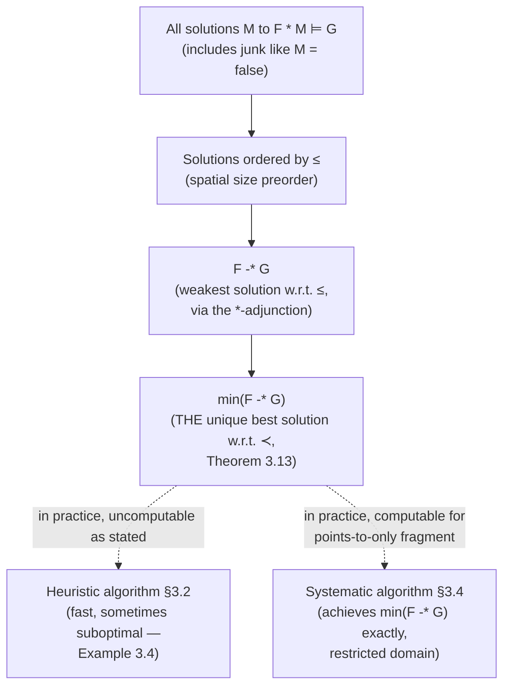

# Quality and Ordering of Abduction Solutions

[[book-guidelines|↩ Back to guidelines]]

## The problem: abduction questions have too many answers

An abduction question asks: given $F$ and $G$, find some $M$ such that

$$F * M \models G.$$

The trouble is that this equation is almost comically under-constrained. Take $M = \mathsf{false}$. Since $\mathsf{false}$ entails anything once you conjoin it with anything else, $F * \mathsf{false} \models G$ holds trivially, for *any* $F$ and $G$. So "find a solution" is not a useful specification on its own — you need a second-order judgment: not just *a* solution, but a *good* one.

What makes a candidate abduced heap "good"? Intuitively: it shouldn't claim more memory exists than is actually needed to make the entailment go through. If the target only needs one linked list, an anti-frame claiming *two* lists is technically sound but is padding out the precondition with junk the caller never needed. This is exactly the failure mode `M = \mathsf{false}` takes to the extreme — it's sound, but useless, because it says nothing about what's actually missing.

This is the concern the paper calls **quality of solutions** (§3.3), and it's worth separating cleanly from the *algorithm* that searches for solutions (covered in the companion article on [[Proof-Systems-and-Algorithms-for-Abduction|proof systems and algorithms for abduction]]). Here the question is purely: given two candidate solutions, which one is better, is there always a best one, and can we describe it? The paper explicitly flags this material as "more detailed theoretical work" that "can be skipped... without loss of continuity" — it's a semantic ideal against which the practical algorithms are judged, not itself a practical algorithm (that's the job of §3.4, treated here as a black box that "computes the best solution" for a restricted fragment).

## What breaks without an ordering

Without an explicit betterness criterion, you cannot even *state* what "the heuristic algorithm is incomplete" means, let alone reason about how incomplete. The paper needs this ordering to make a precise claim later: their fast, rule-directed heuristic algorithm (`Abduce1`) sometimes returns a solution that is *not* the best one. Example 3.4 in the source shows this concretely:

$$x{\mapsto}3 * [??] \vdash y{\mapsto}3 * \mathsf{true}$$

The heuristic proof system finds $y{\mapsto}3$. But $(y{=}x \wedge \mathsf{emp})$ is *also* a solution — and it asserts strictly less new memory (none at all, just an equality constraint). Without a formal ordering, you can gesture at "smaller is better," but you can't prove that one candidate genuinely dominates another, or that a "best" one even exists in principle. The ordering theory in §3.3 exists to make this rigorous.

## The spatial betterness ordering $\preceq$

### First: shift the level of discourse

Before defining the order, the paper generalizes what a "solution" *is*. Up to this point, candidate anti-frames were syntactic symbolic heaps (formulas like $\mathit{ls}(x,y) * z{\mapsto}0$). For the ordering theory, the paper works at the *semantic* level instead: a predicate $F$ is just a set of stack-heap pairs, $F \in \mathcal{P}(\mathrm{States})$ where $\mathrm{States} = \mathrm{Stack} \times \mathrm{Heap}$. This is a boolean algebra (so negation $\neg$ and disjunction $\vee$ make sense) equipped with the extra structure of a commutative residuated monoid — a fancy way of saying it has $*$ (separating conjunction) and a residual/adjoint operation $\mathrel{-\!\!*}$ (separating implication, "magic wand") satisfying:

$$s, h \models F \mathrel{-\!\!*} G \iff \forall h'.\ (h \uplus h' \text{ defined and } s,h' \models F) \implies s, h \uplus h' \models G.$$

**Grounding the adjunction.** If you've done any category-adjacent programming, $\mathrel{-\!\!*}$ should feel familiar: it is the *internal hom* for the monoidal structure $(*, \mathsf{emp})$, exactly the role that function types play for products in a cartesian closed category. The defining property is a genuine Galois connection / adjunction:

$$F * M \models G \iff M \models F \mathrel{-\!\!*} G.$$

This is uncurry/curry, but "substructural" — $*$ doesn't duplicate or discard resources the way $\times$ does, so $\mathrel{-\!\!*}$ is a resource-sensitive exponential. In Lean, if you were formalizing this boolean-BI structure, this adjunction is precisely what you'd state as a `theorem sepimp_adj : (F ⋆ M ⊢ G) ↔ (M ⊢ F -⋆ G)` — the same shape as an `Adjunction.homEquiv` lemma, just instantiated in a substructural logic instead of `Type`.

### The order itself

The paper first defines a coarser preorder $\leq$ ("spatially no bigger than"):

$$M \leq M' \iff M' \models M * \mathsf{true}.$$

Read this as: $M'$ is at least as big as $M$, because $M'$ implies $M$ plus *something else* (`true` absorbs any leftover). $M \le M'$ says $M$'s states can be carved as a sub-heap out of $M'$'s states.

Then the real betterness order, $M \prec M'$ ("$M$ is a strictly better solution than $M'$"):

$$M \prec M' \iff \underbrace{(M \leq M' \wedge M' \not\leq M)}_{\text{strictly spatially smaller}} \ \vee\ \underbrace{(M \leq M' \wedge M' \leq M \wedge M \models M')}_{\text{same size, but logically stronger}}$$

In words: $M$ beats $M'$ if $M$ describes strictly smaller heaps, **or**, when the two are spatially tied, if $M$ is the logically stronger (more informative) formula. Size wins first; precision is the tiebreaker.

**Worked example (the paper's Example 3.8).** Take $M \triangleq \mathit{ls}(y,0)$, $M' \triangleq \mathit{ls}(y,0) * z{\mapsto}0$, $M'' \triangleq \mathit{ls}(y,-)$ (a list to an unconstrained end value).

- $M' \models M * \mathsf{true}$ (drop the extra $z{\mapsto}0$ conjunct, get $M$) so $M \leq M'$; but $M' \not\leq M$ in reverse, so $M \prec M'$ — an extra spatial conjunct always makes a candidate worse.
- $M'' \leq M$ and $M \not\leq M''$: matching this against the first disjunct of $\prec$ (with $M''$ playing the "better" role) gives $M'' \prec M$ — the list with an unconstrained tail value and the list with a concrete tail value $0$ occupy incomparable amounts of "spatial information" in the wrong direction for $M$ to win outright here, so $M''$'s weaker commitment makes it the spatially-preferred candidate. (The published text prints this conclusion as "$M' \prec M$" — almost certainly a second typo of the same kind footnote 7 already flags for this definition, since the stated premises $M'' \le M \wedge M \not\le M''$ match the $\prec$-pattern for $M''$, not $M'$.)

A second example exercises that second disjunct directly: $M = \mathsf{emp}$ vs $M' = (\mathsf{emp} \vee x{\mapsto}0)$. Both are spatially equivalent to each other ($\mathsf{emp} \le M' * \mathsf{true}$ and $M' \le \mathsf{emp} * \mathsf{true}$ — a disjunction with an $\mathsf{emp}$ disjunct is spatially "the same size" as $\mathsf{emp}$), so it comes down to logical strength: $\mathsf{emp} \models M'$, so $\mathsf{emp} \prec M'$. Concrete beats disjunctive-but-equivalent.

**What breaks without the second disjunct.** If betterness were *purely* about spatial size (only the first disjunct), ties would be unresolved: $\mathit{ls}(y,0)$ and $\mathit{ls}(y,-)$ occupy the same shape of heap, so a size-only order would call them incomparable or equal, even though one pins down more information that a downstream analysis can use. The lexicographic fallback to logical implication is what lets the order actually pick a winner among same-footprint candidates — without it, "best solution" wouldn't be unique even up to the properties we care about.

## The `min` function and minimal states

To go from "an ordering on formulas" to "the single best formula," the paper needs a way to strip a predicate down to just its smallest satisfying states.

**Definition 3.9.** $\min(F) = \{(s,h) \models F \mid \text{no strict subheap } h' \text{ of } h \text{ also satisfies } F \text{ at } s\}$.

This is exactly a *minimal-model* filter: throw away every state that has a strictly smaller state doing the same job. $\min$ is idempotent (filtering twice changes nothing — the minimal elements of an already-minimized set are themselves) and behaves predictably against $\leq$:

- **Lemma 3.10:** $\leq$ is a preorder; $M \leq \min(M)$ and $\min(M) \leq M$ (minimizing doesn't change spatial size-class); and $M \leq M'$ together with $M' \leq M$ iff $\min(M) = \min(M')$ (spatial ties collapse to *identical* minimal cores, not just equivalent ones).
- **Lemma 3.11:** $\prec$ is a genuine partial order (not just a preorder — it's antisymmetric, unlike $\leq$), and $M' \leq M \implies \min(M') \prec M$ (minimizing a smaller-or-equal candidate always yields something at least as good).

**Grounding: this is dead-simple to prototype for finite domains**, even though the real semantic $\min$ ranges over an infinite lattice of heaps. If you model a predicate as a finite set of candidate states with an explicit subheap relation, filtering to minimal elements is a five-line antichain computation:

```python
def minimal(states, is_subheap):
    """Keep only states with no strictly-smaller state also in the set."""
    return [
        s for s in states
        if not any(is_subheap(t, s) and t != s for t in states)
    ]
```

This is the textbook "compute the antichain of minimal elements of a poset" routine — nothing separation-logic-specific about the *algorithm*, only about what "subheap" means for the domain. That's precisely why the paper stresses this operates at an abstract lattice level (Boolean BI algebra) rather than syntactically on symbolic heaps: `min` is a general order-theoretic tool, applied here to heap predicates.

## Theorem 3.13: the best solution always exists

Two lemmas assemble into the paper's central existence result.

**Lemma 3.12** (minimal solution w.r.t. $\leq$): $F \mathrel{-\!\!*} G$ solves the abduction question. This drops straight out of the adjunction: $F * M \models G \iff M \models F \mathrel{-\!\!*} G$, so $F \mathrel{-\!\!*} G$ is literally the *weakest* thing you could put in $M$'s place — it plays the same role that a weakest-liberal-precondition transformer plays in Hoare-logic reasoning: the least-restrictive assumption under which the goal is guaranteed. (This is worth pausing on if you're building the refinement-type/Hoare-triple side of a verifier: $\mathrel{-\!\!*}$ *is* a form of weakest-precondition computation, just for the "what's missing" direction instead of the "what must hold beforehand" direction.) But $\leq$ is only a preorder, so "the" minimal solution w.r.t. $\leq$ isn't unique — $\min(F \mathrel{-\!\!*} G)$ is another one, tied with it.

**Theorem 3.13** (Unique Minimal Solution w.r.t. $\prec$): the minimal solution to $F * M \models G$ with respect to the strict betterness order $\prec$ **always exists**, and it is

$$\min(F \mathrel{-\!\!*} G).$$

The proof is short and mechanical once the lemmas are in place: (1) it's a genuine solution because $F * (F \mathrel{-\!\!*} G) \models G$ (adjunction) and $\min(F \mathrel{-\!\!*} G) \models F \mathrel{-\!\!*} G$ (minimizing only shrinks), so $F * \min(F \mathrel{-\!\!*} G) \models G$ follows by monotonicity of $*$. (2) it's *the* best one because any other solution $M$ satisfies $M \models (F \mathrel{-\!\!*} G) * \mathsf{true}$ (unfold the adjunction again), i.e. $(F \mathrel{-\!\!*} G) \leq M$, and Lemma 3.11 turns that into $\min(F \mathrel{-\!\!*} G) \prec M$.

So, semantically, there is never any ambiguity about what the ideal abduction answer is. The entire remaining difficulty — which occupies the rest of §3.3 and all of §3.4 — is that this description is *useless as a specification for a theorem prover*.



## Why the semantic best solution is impractical to compute directly

Section 3.3.2 characterizes $\min$ concretely in separation-logic connectives:

$$\min(F) = F \wedge \neg(F * \neg\mathsf{emp}),$$

so the ideal abduction answer can be written out explicitly as a formula:

$$(F \mathrel{-\!\!*} G) \wedge \neg\big((F \mathrel{-\!\!*} G) * \neg\mathsf{emp}\big). \tag{4}$$

You might reasonably ask: why not just *define* abduction's answer to be formula (4) and be done with the whole enterprise of heuristic and systematic algorithms? The paper gives three concrete reasons this doesn't work, and they're worth internalizing because they explain the entire shape of the rest of the chapter:

1. **It begs the question.** Formula (4) restates "the missing heap is whatever makes $F * M \models G$ minimally" without exposing *what that heap actually looks like* — no list predicates, no points-to facts, nothing a human or a downstream tool can read off.
2. **It's outside the reach of existing automated theorem provers.** Nesting $\mathrel{-\!\!*}$ and $\neg$ around $*$ produces formulas current separation-logic solvers cannot decide — and deciding *inconsistency* of a candidate anti-frame (needed constantly, to prune bad search branches) becomes intractable in this fragment. This is a decidability/complexity wall, not a bug in one particular prover.
3. **It can't drive the tool's actual deliverable.** Abductor's whole practical value is drawing "pictures of memory" — partial graphs with dangling edges from $\mapsto$/$\mathit{ls}$ facts — to show a human the inferred pre/postconditions. Formula (4) gives you a semantic set of states, not a syntactic graph-shaped formula; there's no direct route from (4) to a picture without essentially re-solving the original problem by other means.

**The pattern to notice, for anything checker/verifier-shaped you build yourself:** a semantically clean existence theorem ("the best answer always exists, here's its formula") and a *practically computable, syntactically legible* algorithm are two different deliverables, and the gap between them is where all the engineering lives. This is the same gap between "there exists a most general unifier" (a semantic guarantee) and "here is Robinson's algorithm, restricted to syntactically well-behaved terms, that actually finds it in your implementation." The paper's response is exactly analogous to restricting to a decidable fragment for a tractable unification algorithm: restrict to symbolic heaps over a points-to-only instantiation (§3.4, covered as a black box here) and get a *computable* $\min(F \mathrel{-\!\!*} G)$ back, at the cost of losing inductive predicates like $\mathit{ls}$ from that particular guarantee.

## Ordering bi-abductive solutions: anti-frame first, frame second

Section 3.5 lifts abduction's ordering machinery one level, to **bi-abduction** — jointly finding an anti-frame $M$ and a frame $L$ for

$$\Delta * ?\text{anti-frame} \vdash H * ?\text{frame}.$$

`BiAbd` (Algorithm 3) is soundness-only as stated (Theorem 3.27: $\mathrm{BiAbd}(\Delta,H)=(M,F) \implies \Delta * M \vdash H * F$), and — just as with plain abduction — soundness alone is trivially satisfiable (pick a useless $M, F$). So §3.5.1 defines a quality order on *pairs*.

First, an equivalence induced by $\prec$: $M \approx M'$ means $M$ and $M'$ are tied under the betterness comparison — each is at least as good as the other, so neither strictly beats the other. Then the order on solution pairs $(M, L)$ (anti-frame, frame):

$$(M, L) \sqsubseteq (M', L') \iff (M \prec M') \ \vee\ \big(M \approx M' \wedge L \vdash L'\big).$$

This is a **lexicographic order**: compare anti-frames first using the abduction betterness order from §3.3.1; only if they're tied, break the tie by comparing frames using ordinary entailment strength ($L \vdash L'$ means $L$ is the logically stronger, more informative frame).

**Why anti-frame takes priority, not frame.** The paper is explicit about the motivation: `BiAbd`'s main downstream use is precondition inference during program analysis (§4.2). The anti-frame $M$ is what gets folded into the precondition being built up for a procedure — it's the part of the answer with long-range consequences for every future caller of that procedure. The frame $L$, by contrast, is leftover state that just gets carried forward symbolically to the postcondition at this one program point. Getting the anti-frame small and precise matters more than getting the frame small, so the algorithm (and the order it targets) is structured to search for a good $M$ first, then a good $L$ — mirroring exactly how `BiAbd` is implemented: `Abduce` runs before `Frame` in Algorithm 3, not because of some arbitrary sequencing choice but because it optimizes for the dimension the order weights first.

**Worked example (the paper's Example 3.28).** For $x{\mapsto}0 * M \vdash \mathit{ls}(x,0) * \mathit{ls}(y,0) * L$, compare three candidate pairs:

| | anti-frame | frame |
|---|---|---|
| best | $M = \mathit{ls}(y,0)$ | $L = \mathsf{emp}$ |
| worse (bigger anti-frame) | $M' = \mathit{ls}(y,0) * z{\mapsto}0$ | $L' = z{\mapsto}0$ |
| worse (weaker frame, tied anti-frame) | $M'' = \mathit{ls}(y,0)$ | $L'' = \mathsf{true}$ |

$(M, L) \sqsubseteq (M', L')$ because $M \prec M'$ outright — smaller anti-frame wins regardless of the frames. $(M, L) \sqsubseteq (M'', L'')$ for a different reason: $M \approx M''$ (literally the same formula, so certainly tied), so the tie-break kicks in, and $\mathsf{emp} \vdash \mathsf{true}$ but not the reverse, so $L = \mathsf{emp}$ is the strictly stronger frame. This is the lexicographic structure doing exactly what it's supposed to: dimension one (anti-frame) dominates whenever it discriminates; dimension two (frame) only matters on ties.

**Grounding in Rust.** This lexicographic comparison is precisely what `Ordering::then_with` exists for — comparing a tuple where the first field has priority and the second is a tiebreaker:

```rust
// Conceptual sketch: comparing candidate (anti-frame, frame) pairs.
// `spatial_cmp` implements the ≺ order from §3.3.1 (Some(Less) = strictly
// better, None = incomparable); `entails` implements ⊢ for frames.
fn compare_biabd_solutions(
    a: &(AntiFrame, Frame),
    b: &(AntiFrame, Frame),
) -> Option<Ordering> {
    match spatial_cmp(&a.0, &b.0) {
        Some(Ordering::Less) => Some(Ordering::Less),
        Some(Ordering::Greater) => Some(Ordering::Greater),
        Some(Ordering::Equal) /* M ≈ M' */ => {
            // tie-break on frame strength: stronger frame (a.1 ⊢ b.1) wins
            if entails(&a.1, &b.1) { Some(Ordering::Less) }
            else if entails(&b.1, &a.1) { Some(Ordering::Greater) }
            else { None }
        }
        None => None, // anti-frames incomparable, no lexicographic fallback defined
    }
}
```

Notice this has to return `Option<Ordering>`, not `Ordering` — $\prec$ (and hence $\sqsubseteq$) is a genuine *partial* order, not a total one, and a real implementation must be honest about incomparable candidates rather than forcing an arbitrary tiebreak.

The paper closes §3.5.1 by noting that a full "best bi-abductive solution" theorem, analogous to Theorem 3.13, is left as future work — though a strongest frame is known to exist when the right-hand side of the frame-inference question is *precise* (a notion from the separation-logic-foundations material: a predicate whose satisfying heaps are exactly determined by their stack). This is a loose thread the paper deliberately doesn't pull on further.

## Where this leads

This ordering theory is the theoretical spine that everything else in the chapter has to answer to:

- The **heuristic algorithm** (§3.2, `Abduce1`) is judged against $\prec$ retroactively — Example 3.4 is only a meaningful "gap" because $\prec$ gives you a yardstick to say *how* it falls short.
- The **systematic algorithm** (§3.4) exists entirely to make $\min(F \mathrel{-\!\!*} G)$ *computable* for the points-to-only fragment — it is, by construction, an algorithm whose correctness proof bottoms out in Theorem 3.13.
- The **bi-abductive frame rule** used throughout program analysis (§4, `PreGen`/`PostGen`/`InferSpecs`) inherits its "good precondition, don't-care-as-much frame" bias directly from the $\sqsubseteq$ order defined here — every time the analysis chooses one candidate precondition over another, it's implicitly appealing to this lexicographic priority.

For the **Automated Reasoning** focus area specifically: this section is a clean instance of the general pattern *"characterize the ideal proof-theoretic answer semantically, then show why the semantic characterization is not the same thing as a decision procedure."* The same gap reappears verbatim in the unification literature (most general unifiers exist semantically long before Robinson's algorithm or Miller's pattern-unification fragment make them computable), in weakest-precondition calculi (a wp-transformer is easy to state, hard to discharge automatically), and in Craig interpolation (an interpolant is guaranteed to exist by a semantic argument, but *finding* a small, useful one is the actual engineering problem). If you're building a proof-producing kernel, the lesson to carry forward is structural: keep the semantic existence theorem as your ground-truth soundness criterion, but expect — and design for — a separate, more restricted computable procedure that only *approximates* it, with an explicit, provable relationship (here, Theorem 3.25's claim that the systematic algorithm computes exactly $\min(F \mathrel{-\!\!*} G)$ on its restricted fragment) tying the two together.
