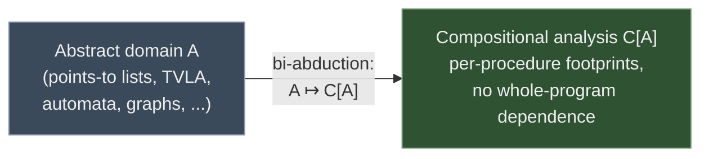
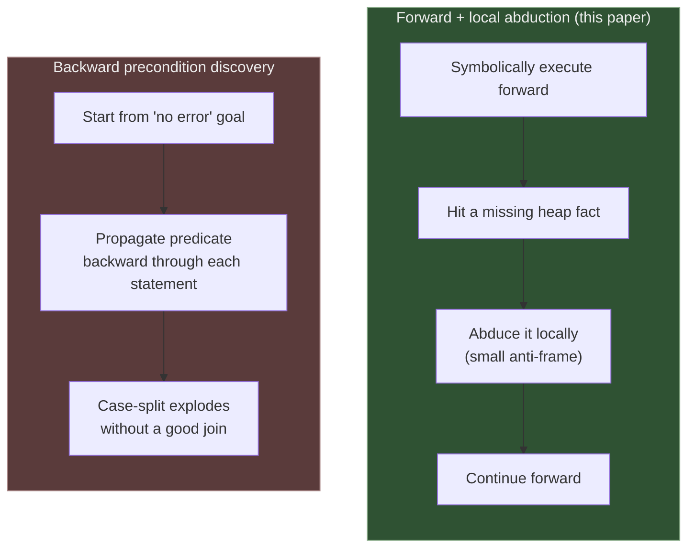
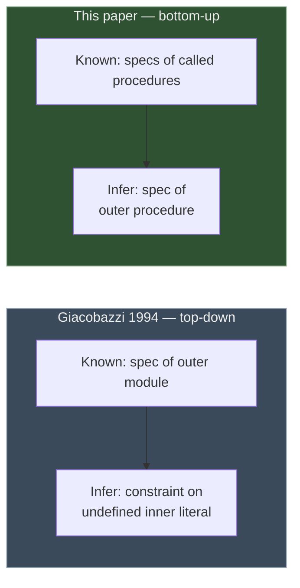

[[book-guidelines|↩ Back to guidelines]]

## Why a "related work" section is actually the paper's thesis statement, restated

Most related-work sections are bookkeeping: a list of citations to prove you did your homework. This one is not that. Read carefully, Chapter 6 is where the authors finally say, in the plainest terms in the whole paper, *what they think they actually did*. Everywhere else — the abduction proof system, the `PreGen`/`PostGen` algorithms, the soundness theorem, the Linux-kernel numbers — is in service of one narrow methodological claim, and Chapter 6 is where that claim gets isolated from the machinery that delivers it.

The claim, in the authors' own notation:

$$A \;\longmapsto\; C[A]$$

Take *any* shape-analysis abstract domain $A$ — the points-to/list domain used in this paper's own experiments, but just as well a three-valued-logic domain (TVLA), an automaton-based domain, or a graph-based domain — and bi-abduction gives you a recipe for turning it into a **compositional** analysis $C[A]$: one that analyzes a procedure from its own body alone, inferring a footprint-sized precondition/postcondition pair, instead of requiring the whole program up front. The theoretical contribution is the *arrow*, not the particular $A$ the paper happened to plug in.

This reframing matters because it tells you how to read every comparison that follows. The question is never "is bi-abduction more precise than technique X" — the authors are explicit that precision is bounded by whatever base domain you chose, and their own domain is admittedly weak on arrays and pointer arithmetic. The question is always: **does X give you a transformation with the same shape as $A \mapsto C[A]$, and if so, how does it get there?** Four comparisons in the chapter answer that question from four different angles, and a fifth (Giacobazzi) answers a *dual* question. The Conclusions chapter then closes the paper by naming, without hedging, what is and isn't settled by any of this.



**What breaks without this framing:** if you read Chapter 6 as "here is why we're better than shape analysis Y," you'll come away thinking the paper lost several of its comparisons — it explicitly concedes CEGAR is only an *analogy*, concedes backward analysis is a live open problem it once tried and abandoned, and concedes Giacobazzi solved a genuinely different (dual) problem earlier. The paper isn't claiming victory on any of these fronts. It's claiming that the *mechanism* — bi-abduction as the engine behind $A \mapsto C[A]$ — is new and general, and everything else is triangulating that one claim from different reference points.

---

## 1. Whole-program shape analyses: booster, not competitor

The lineage the authors place themselves in starts with Sagiv, Reps, and Wilhelm's foundational **TVLA** (three-valued logic analysis) work from 1998 — the first shape analysis accurate enough to handle *deep heap update* (a mutation made some statically-unknown number of pointer-hops down a linked structure, e.g. `while (x->next != null) x = x->next; x->next = y;`). A long line of successors chased better shape *domains* for this same problem: predicate abstraction (Balaban, Pnueli, Zuck), automata-based domains (Bouajjani et al.), the list-segment domain this paper itself builds on (Berdine et al. 2007), and others.

Two things went wrong at scale for this entire line of work:
1. **Precise analyses didn't scale.** Reported experiments topped out in the low thousands of lines of code.
2. **Analyses that did scale sacrificed the one property that made shape analysis worth doing** — proving the *absence* of pointer-safety faults (Ghiya & Hendren, Hackett & Rugina traded soundness/completeness on this front for speed).

The paper's positioning move here is almost self-effacing: *"we emphasize that the work in this paper is not aimed at supplanting existing shape analyses, but in finding ways to boost them by making them compositional."* Concretely, their own experiments instantiate $A \mapsto C[A]$ with the SpaceInvader list-segment domain — but nothing in the bi-abductive machinery is specific to that choice. The same recipe should apply to an automata-based $A$, a graph-based $A$, or a three-valued-logic $A$. This is the paper drawing a hard line between "we improved shape analysis" (not really their claim) and "we found a domain-agnostic way to make *any* shape analysis compositional" (their actual claim) — precisely the $A \mapsto C[A]$ arrow from above.

**Connection to your project (static analysis / abstract interpretation focus area):** this is the cleanest real-world instance you'll find of separating an **abstract domain** (the lattice of shapes, its join/meet, its abstraction function) from the **analysis strategy** that consumes it (whole-program vs. compositional). If your invariant-generation pass is going to support multiple abstract domains for refinement types (intervals, octagons, list-segment-style heap shapes), this paper is evidence that the strategy layer — how preconditions get discovered and composed across procedure boundaries — can be engineered once, parametrically over the domain, exactly the way you'd want a Galois-connection-based analyzer to be domain-parametric in Rust (a `trait AbstractDomain` with `join`, `meet`, `widen`, and the analysis engine coded against the trait, not against a concrete lattice).

---

## 2. Backwards versus forwards: why the "obvious" alternative was tried and abandoned

If you want, for a given procedure, to discover a precondition sufficient to avoid pointer errors, there's an approach that sounds more direct than bi-abduction: run the analysis **backwards**. Start from "no error occurs" as a postcondition-shaped goal, and propagate it backwards through the procedure body — computing, roughly, a weakest-precondition-style predecessor at each step — until you land on a precondition at the entry point. This is *under-approximating* backward analysis: you're computing a set of states from which you can *guarantee* safety, rather than over-approximating what a forward pass can *reach*.

The authors tried exactly this, in their own precursor work (before the POPL'09 paper that this one extends), and the result is reported here almost as a cautionary tale: *"it created an enormous number of abstract states, and when it took several seconds to analyze a trivial list traversal program we abandoned the approach."* Backward propagation over heap-shaped predicates blows up because there's no natural "join" that collapses the branching case analysis the way forward abstraction does with widening/folding into list segments.

Subsequent groups (Lev-Ami et al. 2007; Podelski et al. 2008; Abdulla et al. 2008) made progress on backward shape-precondition discovery, but the authors note two limits that were still open at time of writing: none of these was formulated **interprocedurally** (i.e., none does the compositional call-tree composition this paper's `PreGen`/`InferSpecs` does), and reported experiments were on programs of only tens of lines.

Bi-abduction's own precondition discovery (`PreGen`, via `AbduceAndAdapt`) is, by contrast, essentially a **forward** symbolic execution that runs abduction *locally*, at the point a missing heap fact is needed, rather than trying to solve the global backward-propagation problem in one shot. This is the paper's real answer to "why not go backwards": going backwards is a *harder search problem* over the same domain, whereas going forwards and patching local gaps with abduction turns a global search into a sequence of small, local ones — which is exactly what lets it compose across a call tree.



**What breaks without local abduction:** if precondition discovery required a single global backward pass, you'd lose exactly the property that makes the whole paper's engineering case (Chapter 5) work — the ability to time out on one procedure without losing results for the rest, and to analyze files independently without loading the whole program into memory. Locality of the *search* is what buys compositionality of the *result*.

---

## 3. Local reasoning, sharpened: reachable heap versus true footprint

A related but distinct comparison: several prior shape analyses already passed procedure calls something less than the *entire* global heap — specifically, the portion of the heap *reachable* from the procedure's actual arguments (Rinetzky et al. 2005; Gotsman et al. 2006; Marron et al. 2008). That's already a form of locality, and it's already a real gain over passing the whole heap.

The paper claims a *stronger* form of locality: by hunting for the **footprint** — the minimal cells a procedure's body actually touches — bi-abduction is sometimes able to pass *fewer* cells than everything reachable. A procedure that walks past several list nodes without touching them (e.g., skips to `x->next->next` without reading or writing the skipped node's payload) doesn't need those nodes described in its precondition at all, even though they're reachable from `x`. This is the same idea you'll recognize from the frame rule and separating conjunction — reachability is a syntactic/graph-theoretic notion, footprint is a semantic one tied to what the command's execution actually accesses — and it's worth flagging explicitly here because "reachable subheap" and "footprint" are easy to conflate if you haven't seen a paper draw the line between them this carefully.

---

## 4. CEGAR: same shape, opposite knob

This is the comparison worth slowing down for, because CEGAR — Counterexample-Guided Abstraction Refinement — is a load-bearing concept for your own CSP-kernel design, and the paper's comparison here is genuinely precise, not just a hand-wave.

**CEGAR in one paragraph, from first principles.** You want to know whether a program can reach a bad state. Checking this exactly over the concrete, unbounded state space is undecidable in general, so you check it over an *abstraction* instead — a coarser model with a smaller (often finite) state space, e.g. tracking only a handful of boolean predicates over the program's variables instead of their exact values. If the abstract model has no path to the bad state, you're done — soundness of the abstraction (it never under-approximates reachability) means "no path abstractly" implies "no path concretely." If the abstract model *does* find a path, that path might be a **spurious counterexample**: a sequence of abstract transitions with no concrete program execution behind it, because the abstraction was too coarse to distinguish states that are actually different. When that happens, you inspect the spurious path, find where the abstraction lost the distinction that would have ruled it out, add a predicate that recovers that distinction, and **re-run the check with the refined abstraction**. Repeat until either a real counterexample is found or the abstraction is fine enough that the check succeeds.

**The comparison the paper draws.** `PreGen` is, in the authors' words, "part of a wider trend, whereby the verification method is guided by using the information in failed proofs" — exactly CEGAR's core move of learning from a failed attempt rather than discarding it. But the *target* of the refinement differs:

| | What gets refined | What stays fixed |
|---|---|---|
| **CEGAR** | the abstract domain (add a predicate) | the precondition / property being checked |
| **Bi-abduction (`PreGen`)** | the precondition (abduce a missing heap fact) | the abstract domain |

In other words: CEGAR responds to a failed proof attempt by making the *lens* sharper. Bi-abduction responds to a failed proof attempt by making the *starting assumption* more informative. Same feedback loop, orthogonal knob.

And the analogy has a second layer the paper is careful to draw out: in *both* schemes, a single successful local step carries no global soundness guarantee by itself. A CEGAR refinement removes one spurious path but doesn't, on its own, guarantee the next path explored is real. An abduced precondition is only guaranteed sound *up to the point in the symbolic execution where it was abduced* — "it works only for a path up to a given point." Both approaches need an extra outer loop to close the gap: CEGAR re-runs model checking on the refined abstraction; bi-abduction needs **re-execution** (rerunning the analysis from the abduced precondition to confirm it holds all the way through, filtering out candidates that don't survive re-execution — this is exactly what `InferSpecs`'s "filtering unsafe candidate preconditions by re-execution" step, covered in the Compositional Program Analysis topic, is doing).

The paper even reaches for a second, more specific analogy: the choice between *stopping and re-executing from scratch* after a failed path (their own strategy, and reminiscent of **SLAM**) versus *continuing along the path without redoing the completed work* (reminiscent of **BLAST**'s lazy abstraction refinement, which reuses the unaffected part of the abstract reachability tree). They flag this as suggestive, not exact — but it's a useful second data point for the same underlying pattern: *fail → localize the cause → patch → resume, cheaply if you can avoid redoing work you already trust.*

```rust
// A schematic of the shared "refine on failure" loop, with CEGAR and
// bi-abduction as two instantiations that differ only in WHAT gets patched.
// This is the shape your CSP kernel's counterexample loop and your
// abstract-interpretation invariant pass will both want to share.

enum RefinementTarget {
    AbstractDomain,   // CEGAR: add a predicate / split an abstract state
    Precondition,     // bi-abduction: abduce a missing heap/logical fact
}

trait ProofAttempt {
    type Path;      // the (possibly spurious) trace produced by a failed check
    type Patch;     // what gets learned from that failure

    fn attempt(&self) -> Result<Proof, Self::Path>;
    fn diagnose(&self, spurious: Self::Path) -> Self::Patch;
    fn apply(&mut self, patch: Self::Patch, target: RefinementTarget);
}

// CEGAR:        target = AbstractDomain, patch = new predicate
// Bi-abduction: target = Precondition,   patch = abduced anti-frame
//
// Both loops share the same top-level shape:
//     loop {
//         match attempt() {
//             Ok(proof) => return proof,
//             Err(path) => { let patch = diagnose(path); apply(patch, TARGET); }
//         }
//     }
// and neither loop's single iteration is sound on its own — soundness is a
// property of the whole fixed point, established only once the loop
// terminates in a genuine proof (never silently on a "probably fine").
```

**Connection to your project (SAT/SMT/CSP focus area, and this book's specific tag).** This comparison is the cleanest bridge in the whole chapter to your compiler's planned dual architecture: an abstract-interpretation pass proving *absence* of bugs by over-approximation, alongside a CSP kernel searching for concrete counterexamples that prove *presence* of bugs. CEGAR is precisely the protocol by which those two halves talk to each other in a real verifier — a CSP/SMT-style concrete search produces a counterexample, and if it's spurious against the *abstraction* the abstract-interpretation side refines its own domain in response. Bi-abduction shows you the sibling move for a *different* piece of state (the precondition rather than the domain), which is a strong argument for designing your refinement-loop infrastructure (the `ProofAttempt`-shaped trait above) so that "what gets patched" is a parameter, not something hard-wired into the loop — you may eventually want both knobs turnable in the same system.

---

## 5. Giacobazzi's abductive analysis of logic programs: the dual problem

[[Abductive-Inference|Abductive inference]] didn't originate with this paper, and the authors are careful to cite the earlier use closest to their own: **Giacobazzi (1994)**, applying abduction to the analysis of *logic programs* (Prolog-style, not the imperative heap programs this paper targets). It's worth working through exactly how his problem differs, because "abduction, but for a different variable" is a genuinely instructive contrast, not just a citation to tick off.

Giacobazzi's setup: you have a logic-programming *module* with (a) a specification of the whole module's intended behavior and (b) an implementation of the module in which some literals are **undefined** — they refer to code that lives outside the module (open code, to be supplied by a caller or a not-yet-written component). His method abduces **constraints on those undefined literals**: given what the module as a whole is supposed to do, and what the defined parts of its implementation do, infer what property the missing, externally-supplied pieces must satisfy for the whole to behave as specified. This is **top-down**: you start from a whole-module spec and synthesize constraints on the parts you don't have code for yet.

Translate this into the vocabulary of this paper's procedural setting, and the duality becomes exact. Suppose an "outer" procedure has a Hoare triple you're trying to establish, and its body calls an "unknown" procedure you have no spec for. Giacobazzi's method, ported to this setting, would: start from the outer triple, and infer a constraint (spec) on the unknown callee sufficient to make the outer triple hold. This paper does the mirror image: it infers the spec for the **outer** procedure, relying on **already-computed** specs for the procedures it calls. One direction reasons from a known whole down to constraints on an unknown part; the other reasons from known parts up to a spec for the whole they compose into.



The authors explicitly flag this as unfinished business: *"it would be interesting to attempt to apply abduction in Giacobazzi's way to procedural code, to infer constraints from open code."* That is, nothing stops you from running *both* directions on the same call graph — infer bottom-up specs where callees are known, and abduce top-down constraints on genuinely unknown/foreign code (an uninstrumented library, say) where they aren't. (They separately note Gulwani et al. 2008 used abduction for a third, unrelated purpose — under-approximating logical connectives like conjunction/disjunction inside quantified abstract domains — as a reminder that "abduction" by itself names a very general inference pattern, not a single fixed technique.)

**Connection to your project (automated reasoning / type theory focus areas).** This top-down-versus-bottom-up duality is exactly the shape of a problem your elaborator will face with **unknown or partially-elaborated code**: given a typed context that mentions a metavariable (an "unknown" whose defining term isn't resolved yet) and a target type the whole expression must have, constraint generation for metavariable unification is doing a Giacobazzi-shaped inference — synthesizing a constraint on the *unknown* piece from what's known about the *whole*. Bi-abduction's bottom-up composition, by contrast, is closer to how a trusted kernel checks a fully-elaborated term: composing already-established judgments about subterms into a judgment about the whole, no unknowns left to constrain. Recognizing these as two directions of the same underlying abductive move — rather than two unrelated algorithms — is likely to save you from re-deriving one as a special case of the other later.

---

## 6. Follow-on work: dropping re-execution, and closing the loop with Giacobazzi

The chapter closes by naming work that had already built on the POPL'09 precursor by the time this journal version was written — useful less as a citation list than as a signal of which open questions the authors themselves considered most promising:

- **Gulavani et al. (2009)** give a bottom-up shape analysis that *avoids the re-execution phase entirely* — recall from §4 above that this paper's own precondition discovery needs a re-execution pass because a single abduction step is only locally sound. Gulavani et al. sidestep this by using an abstract domain that doesn't require the usual canonicalization/abstraction step in the first place. The open question the authors flag is exactly how far "avoiding abstraction" can be pushed before you lose the scalability abstraction itself was buying you — a real design tension, not a solved problem.
- **Luo et al. (2010)** tackle inferring specs of *unknown* procedures — i.e., they pick up precisely the Giacobazzi-style top-down direction the authors flagged as future work in §5 — and separately propose an alternate abduction algorithm and an alternate ordering for comparing candidate-solution quality (recall the spatial betterness ordering $\preceq$ and the $\min$ function from the Proof Systems and Quality-of-Solutions topics — this is evidence those choices in the base paper were design decisions, not the only workable ones).
- **Distefano & Filipovic (2010)** develop the memory-leak-detection angle that this paper reported only as an incidental byproduct of proof failure (Chapter 5's 84 potential leaks found "for free").
- **Calcagno et al. (2009)** extend the compositional method to concurrency — the caveat flagged in §5.3.2 as the most fundamental of the paper's stated limitations.

---

## Closing synthesis: what Chapter 6 leaves settled, and what Chapter 7 says about it

Chapter 7's Conclusions restates, without new content, four contributions that Chapter 6 has now situated against the wider field:

1. Proof techniques and algorithms for abduction and bi-abduction over separated heap abstractions (positioned in §1–§3 above as *domain-agnostic machinery*, not a rival heap domain).
2. A method for generating preconditions via bi-abduction (positioned in §2 and §4 as *forward, locally-abductive*, in contrast to backward precondition discovery and analogous in shape, but not mechanism, to CEGAR).
3. A compositional algorithm for generating whole-procedure summaries (positioned in §3 as achieving a *stronger-than-reachability* locality).
4. The first shape analysis of its kind to scale to genuinely large codebases (positioned in §1 as a claim about *engineering reach*, explicitly not a claim about *precision* — precision is inherited from whatever base domain $A$ you plugged in).

The one distinction the authors insist on, twice, in slightly different words each time, is **soundness versus completeness/precision**. *"When the analysis says 'yes' it means that the inferred Hoare triple is true... unanswered technical questions concern completeness or precision or complexity, rather than soundness."* This is not a throwaway qualifier — it's the same distinction that makes the CEGAR comparison in §4 work at all: a CEGAR loop's abstract domain can be too coarse (incomplete) without ever being *unsound* (a spurious counterexample is a false positive on reachability, never a false negative on safety), and bi-abduction's heuristic proof system can be incomplete (Example 3.6, from the Proof Systems topic) for exactly the same reason — an incomplete search finds fewer true things, it does not certify false ones.

**For the trusted-kernel / proof-producing-architecture side of your project specifically**: this is the paper modeling, in miniature, the discipline you'll want in your own theorem-prover-backed compiler — a component (`InferSpecs`, here) can be heuristic, incomplete, and even occasionally hopeless on adversarial input (the `merge.c` failure from Chapter 5), and none of that threatens the soundness of what it *does* manage to certify, provided the checking step (re-execution here; your kernel's proof-term checking, eventually) is the part that's never allowed to be heuristic. Completeness is a UX and coverage problem you can improve incrementally forever; soundness is a one-time architectural commitment you cannot retrofit.

## Where this leads

This chapter is a dead end in the sense that nothing downstream in *this* paper cites it back — it's the paper's final self-assessment, not a load-bearing definition. But its content is exactly the connective tissue between this book and the rest of your reading list: the CEGAR comparison (§4) is your clearest bridge from bi-abduction to the CEGAR/CHC/SMT literature your CSP-kernel design will draw on next, and the Giacobazzi duality (§5) is worth re-reading once you're deep in metavariable-constraint generation for the elaborator — the "known whole, unknown part" shape shows up there under a different name.
