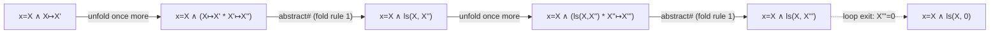

[[book-guidelines|↩ Back to guidelines]]

## Why a program logic needs to talk about *disjointness*

Before there's any bi-abduction, any Abductor tool, any Linux-kernel-scale case study, there has to be a way to write down *what a piece of a program touches in memory* — compactly enough that the description survives being reused in a thousand different calling contexts. That's the actual engineering problem this section solves, and it's worth sitting with the problem before the notation, because the notation is otherwise just Greek soup.

Here's the concrete failure mode. Suppose you want to specify a procedure that frees a linked list:

```
{ the heap is an acyclic list rooted at x }  disposelist(x)  { the heap is empty }
```

In ordinary (non-spatial) predicate logic, "the heap is an acyclic list rooted at x" and "the heap is empty" are just predicates over *some* global heap variable. The trouble starts the moment you want to call `disposelist(x)` inside a bigger program, where the heap also contains a list rooted at `y`, a hash table, and half of some cache. Classical Hoare logic gives you no principled way to say "and everything else — the `y`-list, the cache — is simply *not touched*, whatever it looks like." You'd have to either (a) rewrite the precondition and postcondition for every possible surrounding heap shape, which is unbounded and defeats the entire point of writing a reusable spec, or (b) drag in an explicit list of "frame conditions" naming every unmodified variable, which becomes unmanageable as soon as the heap has dynamically-allocated, unbounded structure (you can't enumerate "all the cells not reachable from x" as a finite list of variable names).

Separation logic's answer is to make disjointness of memory a *primitive of the logic itself*, via a new connective — the separating conjunction — so that "elsewhere, unrelatedly, some other stuff holds" becomes something you can state once and reuse forever, without knowing what that other stuff is. This is the single idea underneath everything else in this section.

## The storage model: stacks and heaps

Before the logic, fix what a "state" is. The paper (§3.1.2) uses:

$$
\begin{aligned}
\mathit{Heap} &\stackrel{\text{def}}{=} \mathit{Loc} \rightharpoonup_{\mathit{fin}} \mathit{Val} \\
\mathit{Stack} &\stackrel{\text{def}}{=} (\mathit{Var} \cup \mathit{LVar}) \to \mathit{Val} \\
\mathit{States} &\stackrel{\text{def}}{=} \mathit{Stack} \times \mathit{Heap}
\end{aligned}
$$

A heap is a *finite partial function* from locations to values — "finite" because only finitely many cells are ever allocated at once, "partial" because most locations are unallocated (undefined, not "defined and null"). A stack maps every variable — both ordinary program variables (`x`, `y`, ...) and a second, disjoint family of *logical variables* (`X`, `Y`, ...) that never appear in actual program code — to a value. Logical variables exist purely so specifications can name "the value `x` had when the procedure started" even after the program has since overwritten `x`; you'll see them do exactly this job in the swap-procedure example below.

**Rust framing.** A heap here is precisely a partial-domain map — think `HashMap<Location, Value>` where "not in the map" *means* "not allocated," not "allocated and zero." This distinction matters: separation logic's `emp` predicate is "the map is literally empty," and a dangling-pointer dereference is a *lookup miss*, not a null read. If you've ever modeled a custom allocator's live-cell table as a `HashMap`, this is the same shape.

## The points-to predicate and the separating conjunction

The instantiation the paper works with first — the **Simple Lists Instantiation** — has one atomic spatial fact about a single cell:

$$
E \mapsto E'
$$

with semantics `s, h ⊨ E ↦ E'` iff `h = [[[E]]_s ↦ [[E']]_s]` — i.e., *the entire heap `h`* consists of exactly one allocated cell, at the address that `E` evaluates to, holding the value that `E'` evaluates to. This is a strong, "exact" reading: `x ↦ y` doesn't just claim x's cell holds y somewhere in a bigger heap — read on its own, it claims the heap *is* that one cell and nothing more. That exactness is what makes the separating conjunction meaningful.

The separating conjunction glues formulas together by splitting the heap:

$$
s, h \models \Sigma_0 * \Sigma_1 \quad\text{iff}\quad \exists h_0, h_1.\ h = h_0 \uplus h_1 \text{ and } s, h_0 \models \Sigma_0 \text{ and } s, h_1 \models \Sigma_1
$$

The `⊎` (disjoint union) is the whole idea in symbol form: it is *only* defined when `dom(h₀) ∩ dom(h₁) = ∅`. So `A * B` isn't "A and B are both true of the heap" (that's ordinary `∧`, which the logic also has, reserved for heap-independent *pure* facts) — it's "the heap splits into two non-overlapping regions, one satisfying A, the other satisfying B." `x↦x' * y↦y'` is only satisfiable in a heap with (at least) two distinct allocated cells, which is exactly why the entailment `x↦x' * y↦y' ⊨ x≠y` holds (Section 3.1.2's sample entailments) — if `x` and `y` denoted the same address, the two disjoint sub-heaps required by `*` couldn't both contain a cell there.

**What breaks without `*`.** If you tried to express "x points to something, and separately y points to something, and they don't overlap" using ordinary conjunction plus an explicit inequality, you'd write `x↦x' ∧ y↦y' ∧ x≠y` — but under the ordinary reading of `∧` over a *shared* global heap, this doesn't actually force disjointness of the *cells the two facts are about* once you have facts about multi-cell structures (a list and a sub-list can satisfy two heap-predicates about a shared heap without any pointer-level inequality forcing non-overlap). Separating conjunction bakes disjointness into the connective itself, which is precisely what generalizes cleanly to inductively-defined structures like lists, where there's no finite set of "the addresses involved" to write inequalities over.

**Rust framing.** This is the same discipline Rust's borrow checker enforces for `&mut` references: two live mutable borrows must never alias. `A * B` is "I have exclusive access to region A, and separately, exclusive access to disjoint region B" — the same guarantee `fn f(a: &mut Cell, b: &mut Cell)` gives you when `a` and `b` are statically known not to alias. It's not a coincidence that separation logic and Rust's ownership model rhyme; both exist to let you reason about a mutation locally, without tracking every other live reference into the same heap. The disanalogy: Rust's aliasing discipline is enforced *statically by construction* (the type system rejects aliasing borrows outright), while separation logic's disjointness is a semantic side-condition on the model (`h = h₀ ⊎ h₁`) that a *proof* must establish — closer to what an unsafe-Rust or C verifier would need to check on your behalf.

## The frame rule and local reasoning

The separating conjunction only pays off once you have an inference rule that exploits it. That rule is the **frame rule**:

$$
\dfrac{\{A\}\ C\ \{B\}}{\{A * F\}\ C\ \{B * F\}} \quad\textbf{(Frame Rule, usual version)}
$$

Read it as: if you've proved `C` safe and correct starting from precondition `A` and ending in `B`, then for *any* separately-conjoined `F` — any heap fragment that `C` neither reads nor writes — the same triple holds with `F` tacked onto both sides, unchanged. This is exactly the *principle of local reasoning*: a specification only has to describe the part of the heap the procedure actually touches; the rule guarantees it composes correctly with arbitrarily large, arbitrarily unrelated surrounding state, because `F` is untouched by construction (disjointness from the footprint is what `*` already required at the point the triple was proved).

Return to `disposelist`. The one-line spec `{list(x)} disposelist(x) {emp}` says nothing about heaps bigger than the list at `x`. The frame rule is what licenses using it anyway: instantiate `F` to "whatever else is on the heap" — say, a list rooted at `y`, or a hash table, or another million-line program's private state — and you get `{list(x) * F} disposelist(x) {emp * F}` for free, no re-proof required. This is the mechanism, not just the motivating slogan, behind "small specs generalize to big heaps."

**What breaks without it.** Without a frame rule, every specification has to be re-derived, or manually re-stated with an explicit invariant, for every context it's used in — which is precisely the "whole-program" bottleneck the paper spends its introduction complaining about (§1.1: shape analyses had been "formulated as whole-program analyses," unusable on incomplete programs). The frame rule is the actual technical device that turns "prove this procedure once" into "reuse that proof everywhere," and it's the reason compositional analysis is even *conceivable* as a design.

The paper immediately specializes this into an *analysis*-oriented form, combined with the Hoare rule of consequence, where `P` is the actual state found at a call site and `Frame(P, A) = L` is an algorithm that computes the missing leftover `L`:

$$
\dfrac{\{A\}\ C\ \{B\} \qquad \mathit{Frame}(P, A) = L}{\{P\}\ C\ \{B * L\}} \quad\textbf{(Frame Rule, forwards-analysis version)}
$$

This is the shape the rule takes once you stop treating "find `F`" as a proof-theoretic afterthought and start treating it as something an *algorithm* must compute during symbolic execution — the seed that later grows into the bi-abductive frame rule once "find `F`" is paired with "and also find what's *missing*." (That pairing is Topic 2's subject; here, note only that the ordinary frame rule is the special case where nothing is missing.)

<svg viewBox="0 0 640 260" xmlns="http://www.w3.org/2000/svg" font-family="sans-serif" font-size="13">
  <style>
    .box { fill: none; stroke: #888888; stroke-width: 1.5; }
    .foot { fill: #3b82f622; stroke: #3b82f6; stroke-width: 1.5; }
    .frame { fill: #f59e0b22; stroke: #f59e0b; stroke-width: 1.5; }
    .lbl { fill: #555555; }
    .cell { fill: none; stroke: #999999; }
  </style>
  <text x="20" y="24" class="lbl" font-weight="bold">Before: {list(x) * F}</text>
  <rect x="20" y="36" width="280" height="150" class="box" rx="6"/>
  <rect x="35" y="50" width="130" height="60" class="foot" rx="4"/>
  <text x="45" y="45" class="lbl">footprint: list(x)</text>
  <circle cx="55" cy="80" r="10" class="cell"/><text x="52" y="84" font-size="10">x</text>
  <circle cx="95" cy="80" r="10" class="cell"/>
  <circle cx="135" cy="80" r="10" class="cell"/>
  <line x1="65" y1="80" x2="85" y2="80" stroke="#888"/>
  <line x1="105" y1="80" x2="125" y2="80" stroke="#888"/>
  <rect x="35" y="125" width="245" height="45" class="frame" rx="4"/>
  <text x="45" y="120" class="lbl">frame F: untouched heap (y-list, cache, ...)</text>

  <text x="330" y="24" class="lbl" font-weight="bold">After: {emp * F}</text>
  <rect x="330" y="36" width="290" height="150" class="box" rx="6"/>
  <rect x="345" y="50" width="130" height="20" class="box" stroke-dasharray="4,3" rx="4"/>
  <text x="352" y="65" class="lbl" font-size="11">list(x) freed (emp)</text>
  <rect x="345" y="125" width="255" height="45" class="frame" rx="4"/>
  <text x="355" y="120" class="lbl">frame F: identical, still untouched</text>

  <line x1="300" y1="110" x2="330" y2="110" stroke="#555" stroke-width="2" marker-end="url(#arrow)"/>
  <defs><marker id="arrow" markerWidth="8" markerHeight="8" refX="6" refY="3" orient="auto"><path d="M0,0 L6,3 L0,6 z" fill="#555"/></marker></defs>
  <text x="303" y="100" class="lbl" font-size="11">disposelist(x)</text>
</svg>

## The footprint: what the frame rule is protecting

"Footprint" gets used loosely in the introduction (§1.2) — "the cells accessed by a procedure" — but it has a precise meaning worth pinning down now, even though its formal definition doesn't appear until §4.2.4, because it's the concept the whole separation-logic machinery exists to let you *state compactly*.

Call a state *safe* for a command `C` if `C` won't fault (dereference something dangling or null) starting there. The **footprint** of `C` is the set of *minimal* safe states — no cell in a footprint state is there gratuitously; remove any cell and the command is no longer guaranteed safe from it. A footprint-sized precondition is the tightest, most reusable specification you could write, because the frame rule then lets you extend it to any larger state for free (by conjoining an arbitrary `F`) — but nothing in a *minimal* safe state can be dropped without losing that guarantee.

Formally (§4.2.4), given a sequence of actions with specs `{Pα} α {Qα}`, where each `Pα` is **precise** (defined below):

$$
\mathit{safe}(\alpha) \stackrel{\text{def}}{=} P_\alpha * \mathit{true}, \qquad
\mathit{safe}(\alpha; C) \stackrel{\text{def}}{=} P_\alpha * (Q_\alpha \mathbin{-\!\!*} \mathit{safe}(C))
$$

$$
\mathit{foot}(C) \stackrel{\text{def}}{=} \min(\mathit{safe}(C))
$$

The `-*` here is the *separating implication* ("magic wand"): `Q_α -* safe(C)` describes exactly the extra heap you'd need alongside anything satisfying `Q_α` to land in a state safe for the rest of the program `C`. Composing `P_α` with that via `*` and then taking the componentwise minimum (`min`, formally defined in §3.3, ordering symbolic heaps by "how much they claim") gives the tightest possible precondition for the whole sequence. **Theorem 4.11** then closes the loop: if the bi-abductive prover always computes the *best* (minimal) antiframe at each step, the precondition that the compositional analysis actually derives coincides exactly with `foot(C)` — i.e., the machinery this paper builds is not merely a heuristic approximation of footprints in spirit, it provably computes them exactly under an idealized best-solution assumption.

**What breaks without minimality.** If preconditions were merely *sufficient* (safe, but not minimal), you'd get specs like `{list(x) * list(y) * list(z)}` for a procedure that only ever touches `x` — technically sound, but useless for compositional reuse: every caller would be forced to supply `y` and `z` too, even when they don't exist in that caller's heap. Minimality is what makes "small specifications ... describe more general facts about procedures ... [leading] to a more precise analysis of callers" (§2.3) true in the first place.

## Precise predicates: what makes "the accessed part" well-defined

`min` and `foot(C)` both presuppose that "the substate a predicate is really talking about" is unambiguous. That's exactly what a **precise predicate** guarantees:

> **Definition 4.9 (Precise Predicate).** A predicate `P` is precise if, for every `s, h`, there is at most one `h_f ⊆ h` where `s, h_f ⊨ P`.

Read: no matter how big a surrounding heap `h` you're standing in, there's *at most one* sub-heap that `P` could be describing — never two different candidate "footprints" for the same predicate in the same state. `x↦y` is precise (there's exactly one candidate sub-heap: the single cell at `x`, if it exists and holds `y`). By contrast, an assertion like `x↦_ ∨ true` (unrestricted, disjunctive) would be imprecise — many different sub-heaps could satisfy it in the same ambient heap, so "the part it's about" stops being a well-defined question.

Precision is exactly the property Theorem 4.11's proof leans on at its final step (`min(P_α * (...)) = min(P_α) * min(...)` — `min` distributes over `*` only because `P_α`'s footprint doesn't have multiple candidates to get confused between). It's also why the paper is careful, at Definition 4.10, to require every `Pα` in a procedure's spec to be precise: footprints are only a coherent *logical* concept (as opposed to an ad-hoc heuristic) when the predicates naming them can't equivocate about which cells they mean.

**Lean framing.** Precision is a uniqueness proposition, and Lean is the natural place to see that literally:

```lean
def Precise (P : Stack → Heap → Prop) : Prop :=
  ∀ s h hf1 hf2, hf1 ⊆ h → hf2 ⊆ h → P s hf1 → P s hf2 → hf1 = hf2
```

This is exactly the shape of a *subsingleton* / uniqueness lemma you'd prove to justify calling `hf` "*the*" witness rather than "*a*" witness — the same pattern that shows up when you prove a dependent elaborator's metavariable solution is unique before calling `getExprMVarAssignment` on it. A predicate that isn't precise is, in this sense, a "predicate with an underdetermined witness," structurally the same failure mode as an ill-posed unification problem with more than one most-general unifier.

## Symbolic heaps: a deliberately restricted assertion language

Everything above works over *arbitrary* separation-logic formulas. But arbitrary formulas — with unrestricted nesting of `∗`, `∧`, negation, and the separating implication `-*` — make abduction and entailment checking expensive or undecidable in general. So the paper fixes a **symbolic heap** fragment (§3.1.1), deliberately impoverished to keep the automated proof procedures fast:

$$
\begin{aligned}
E &::= x \mid X \mid \kappa &&\text{Expressions}\\
\Pi &::= P \mid \mathit{true} \mid \Pi \wedge \Pi &&\text{Pure formulae}\\
\Sigma &::= S \mid \mathit{true} \mid \mathit{emp} \mid \Sigma * \Sigma &&\text{Spatial formulae}\\
\Delta &::= \Pi \wedge \Sigma &&\text{Quantifier-free symbolic heaps}\\
H &::= \exists \vec X.\ \Delta &&\text{Symbolic heaps}
\end{aligned}
$$

Notice the shape of the restriction: pure facts (`P`, heap-independent — equalities, disequalities) and spatial facts (`S`) each get their own separate additive layer — you can `∧`-combine pure facts, and `*`-combine spatial facts, but you can never *nest* `∗` inside `∧`, put a `∧` inside a `∗`, or negate around a `∗`, and there's no `-*` at all in the surface syntax. A symbolic heap is, syntactically, "some equalities and disequalities, conjoined; and separately, some spatial facts, `*`-combined; wrapped in one block of existential quantifiers out front." That's it — no deeper recursive structure.

**What breaks without the restriction.** Full separation logic with `-*` and boolean combinators over `*` is not just harder to automate — several natural questions about it (validity, satisfiability of general formulas) become intractable or undecidable. By collapsing the connective structure down to one flat conjunction of atoms, the paper turns "does formula `A` abductively entail formula `B`" into a *structural, syntax-directed* search problem: the proof rules in §3.2 (Topic 4's subject) can pattern-match directly on which atomic predicate occurs on which side, because there's no hidden nesting to unfold first. The restriction is precisely what makes the phrase "abducible facts" meaningful at all — abduction only makes sense over a *fixed, structurally simple* space of candidate hypotheses, and symbolic heaps are exactly that space: "additively and separately conjoined collections of atomic predicates," nothing fancier.

**Rust framing.** This is a textbook case of shrinking a general recursive grammar down to a flat, analyzable normal form before writing an algorithm over it — the same move as restricting a general expression AST down to a specific normal form (e.g., ANF, or CNF for boolean formulas) before writing a pass over it. In Rust, you'd represent it directly as two small enums with no recursive spatial nesting inside the pure layer or vice versa:

```rust
enum Expr { Var(VarId), LVar(LVarId), Const(Const) }

enum PureAtom { Eq(Expr, Expr), Neq(Expr, Expr) }
enum Pure { Atom(PureAtom), True, And(Box<Pure>, Box<Pure>) }

enum SpatialAtom { PointsTo(Expr, Expr), ListSeg(Expr, Expr) } // Simple Lists instantiation
enum Spatial { Atom(SpatialAtom), True, Emp, Star(Box<Spatial>, Box<Spatial>) }

struct QFSymHeap { pure: Pure, spatial: Spatial }          // Δ
struct SymHeap  { exists: Vec<LVarId>, body: QFSymHeap }   // H
```

The fact that `Spatial` never contains a `Pure` and `Pure` never contains a `Spatial` *is the restriction* — encoding it this way in the type system means an algorithm walking a `SymHeap` never has to handle a case that the theory disallows; the type checker enforces the fragment discipline for you, the same benefit you get from any well-chosen AST shape.

## Two instantiations: Simple Lists and Higher-order Lists

The grammar above leaves `P` and `S` as placeholders — "basic pure/spatial predicates" — deliberately, so the same abduction machinery can be reused across different data-structure vocabularies. Two instantiations appear in the paper:

**Simple Lists Instantiation** (used for most of the paper's presentation):

$$
P ::= E{=}E \mid E{\neq}E \qquad S ::= E{\mapsto}E \mid \mathit{ls}(E,E)
$$

`ls(x, y)` is a list segment predicate: a (possibly zero-length) chain of singly-linked cells from `x` up to, but not including, `y`. Its meaning is given inductively (§3.1.2):

$$
\mathit{ls}(E, E') \iff \mathit{emp} \ \vee\ \exists y.\ E \mapsto y * \mathit{ls}(y, E')
$$

This is the base case and the recursive unfolding of a linked list, expressed as a *least* fixed point — least, because it must not admit heaps beyond what a finite unfolding of the disjunction can produce. Note `list(x)` from the introduction's examples is just `ls(x, nil)` — a full acyclic list is the special case where the segment terminates at `nil`. Also note: because nothing in the definition forbids `x = y`, `ls(x, x)` is satisfied by *both* the empty heap and any nonempty *cyclic* list rooted at `x` — the predicate on its own can't distinguish those, a subtlety the paper flags explicitly since it matters for abduction's soundness later.

**Higher-order Lists Instantiation** (used for the actual experiments, generalized further to doubly-linked variants):

$$
k ::= \mathit{PE} \mid \mathit{NE} \qquad S ::= (e {\mapsto} \vec f{:}\vec e) \mid \mathit{hls}\ k\ \phi\ e\ e
$$

Here the points-to fact generalizes to multi-field records (`e ↦ f₁:e₁, f₂:e₂, ...`), and the list predicate is parameterized by an arbitrary description `φ(x,y)` of *what one node looks like*, rather than hard-wiring "one pointer-sized cell":

$$
\mathit{hls}_{\mathrm{NE}}\ \phi\ x\ y \iff \phi(x,y)\ \vee\ \exists y'.\ \phi(x,y') * \mathit{hls}_{\mathrm{NE}}\ \phi\ y'\ y
$$

(`NE` = provably non-empty; `PE` = possibly empty, which just swaps the base case's `φ(x,y)` disjunct for `emp`.) The payoff of parameterizing over `φ` is *compositionality of the predicate vocabulary itself*: instantiate `φ` with a predicate that itself contains a nested `hls`, and you get nested list-of-lists structures (the paper's example: each node of an outer list points to a private, disjoint inner sub-list) for free, without inventing a new inductive definition from scratch. Two lists sharing one header record but linked through different fields (a doubly-linked-list-shaped structure) is likewise just two different `hls` predicates, with two different `φ`s, over the same shared node.

**Python framing.** The recursive-unfolding definitions of `ls` and `hls` are exactly the shape of a recursive generator you'd sketch to *enumerate* concrete instances of the predicate for testing an implementation:

```python
def ls_instances(x, y, max_len):
    """yield concrete heaps (as dicts) satisfying ls(x, y), up to length max_len"""
    yield {}                                   # emp: zero-length segment
    if max_len > 0:
        for fresh in fresh_var_pool():
            for tail in ls_instances(fresh, y, max_len - 1):
                yield {x: fresh, **tail}        # x -> fresh, then a shorter segment
```

This is not how the paper implements anything — it's a five-line illustration of what the inductive definition *means*, useful as a sanity check before trusting the formal unfolding.

## Semantics: the forcing relation and entailment

Everything above is syntax. The semantics (§3.1.2) is a **forcing relation** `s, h ⊨ A`, defined by structural recursion on the formula:

$$
\begin{aligned}
s, h &\models \mathit{true} &&\text{always}\\
s, h &\models \Pi_0 \wedge \Pi_1 &&\text{iff } s,h\models\Pi_0 \text{ and } s,h\models\Pi_1\\
s, h &\models \mathit{emp} &&\text{iff } h = \emptyset\\
s, h &\models \Sigma_0 * \Sigma_1 &&\text{iff } \exists h_0 h_1.\ h = h_0 \uplus h_1 \text{ and } s,h_0\models\Sigma_0 \text{ and } s,h_1\models\Sigma_1\\
s, h &\models \exists \vec X.\Delta &&\text{iff there is } \vec v \text{ where } (s[\vec X{:=}\vec v], h)\models \Delta
\end{aligned}
$$

with base cases `s, h ⊨ E ↦ E'` iff `h = [[[E]]_s ↦ [[E']]_s]`, `s, h ⊨ E = E'` iff `[[E]]_s = [[E']]_s`. Once you have this, **semantic entailment** is just the expected universal statement:

$$
H_1 \models H_2 \quad\text{iff}\quad \forall s, h.\ (s,h \models H_1) \Rightarrow (s,h \models H_2)
$$

and this is the ground-truth notion that any proof-theoretic abduction or entailment *algorithm* (Topic 4's subject) is obligated to respect — an algorithm that outputs "yes" or a missing formula `M` is only *sound* if it's provable that the corresponding semantic entailment actually holds. The paper's sample entailments (§3.1.2) are worth internalizing as calibration for how spatial and pure reasoning interact:

$$
x{\mapsto}x' * y{\mapsto}y' \models x \neq y \qquad\qquad
\mathit{ls}(x,x') * \mathit{ls}(y,y') \not\models x \neq y
$$

$$
\mathit{emp} \models \mathit{ls}(x,x) \qquad\qquad
\mathit{ls}(x,x) \not\models \mathit{emp}
$$

The first pair shows separating conjunction *forcing* disequality between concrete cells but *not* between list segments (a list segment can be zero-length, so two `ls` facts can coexist even if `x = y`, as long as both are empty at that shared point — spatial separation of *segments* doesn't pin down non-overlap the way it does for single guaranteed-allocated cells). The second pair is the cyclic/empty ambiguity of `ls(x,x)` mentioned above, made precise: the empty heap satisfies it (zero-length segment), but not every heap satisfying it is empty (a cyclic list also does), so the entailment only goes one way.

**Rust/Lean framing.** The forcing relation is a textbook structural recursion over the `SymHeap` enum from earlier — in Rust, an evaluator function pattern-matching on the AST; in Lean, an inductive `Prop`-valued relation you'd define with `inductive Forces : Stack → Heap → SymHeap → Prop` and then prove properties of by structural induction, exactly the way you'd define and reason about a typing judgment `Γ ⊢ e : τ`. The parallel is not superficial: both are "does this piece of syntax, interpreted against this piece of semantic data, hold" judgments, and both support the same proof technique (induction on the syntax) for the same reason (the semantics was *defined* by recursion on that syntax).

## Abstraction functions

Symbolic execution over a loop, unfolded literally, produces ever-longer heap descriptions — one cell, then two, then three (§2.4's `free_list` walkthrough: `x=X ∧ X↦X'`, then `x=X ∧ (X↦X' * X'↦X'')`, ...) — an infinite regress unless something *folds* a chain of concrete cells into a single, length-independent list-segment fact. That folding step is the job of an **abstraction function**:

$$
\mathit{abstract}^\# : \mathit{SH} \to \mathit{SH}
$$

with one non-negotiable soundness requirement — abstraction may only ever *weaken*, never invent:

$$
H \models \mathit{abstract}^\# H
$$

This is exactly the abstraction half of a Galois-connection-style setup from abstract interpretation: `abstract#` plays the role of an abstraction map from (syntactic proxies for) concrete heaps up into a coarser description, and the soundness side-condition `H ⊨ abstract# H` is the standard "the abstract value over-approximates the concrete one" requirement — the same shape as `α(c) ⊒ c` in a classical Galois-connection presentation, just stated at the level of formula entailment rather than a lattice order. (The paper doesn't build a full Galois connection with an explicit concretization map — it only commits to the one-directional soundness obligation — but the *intent* is identical to the standard abstract-interpretation abstraction step, and it's worth naming that connection explicitly since it's exactly the mechanism this workbench's static-analysis thread keeps coming back to.)

Two concrete rewriting rules realize this (rewriting *left to right*, i.e. generalizing):

$$
\exists \vec X.\Delta * \rho(x, Y) * \rho'(Y, Z) \longrightarrow \exists \vec X.\Delta * \mathit{ls}(x, Z) \qquad (Y \text{ not free in } \Delta)
$$

$$
\exists \vec X.\Delta * \rho(Y, Z) \longrightarrow \exists \vec X.\Delta * \mathit{true} \qquad (Y \text{ not provably reachable from program vars})
$$

(`ρ, ρ'` range over `ls, ↦`.) The first rule "gobbles" an internal, unshared logical variable into a list segment: two adjacent points-to/segment facts sharing an unreferenced-elsewhere midpoint collapse into one segment fact spanning both. The example given: `x↦X₁ * y↦X₁ * X₁↦X₂ * X₂↦0` abstracts to `x↦X₁ * y↦X₁ * ls(X₁,0)` — the two-cell tail folds away, but `X₁` itself survives unfolded because it's *shared* (both `x` and `y` alias into it) and folding a shared point would lose the sharing information. The second rule is more drastic: forget a cell entirely (replace it with `true`) once it's no longer reachable from any program variable. Using `true` rather than `emp` here is deliberate — `true` in a symbolic heap is the paper's built-in signal for a *potential memory leak* (an unreachable, un-freed cell), so this abstraction step is simultaneously "forget the details" and "flag that this might be garbage."

**What breaks without abstraction.** Without folding, precondition inference over any loop with an a-priori-unknown iteration count literally never terminates as a symbolic-execution process — each iteration produces a strictly bigger formula, and there's no fixed point to converge to. Abstraction is what turns an unbounded family of concrete shapes into a single, finite, generalized description a fixed-point (or, here, heuristic-but-checked) analysis can actually stabilize on — precisely the same role widening/abstraction plays in classical abstract interpretation over infinite-height lattices, just realized here as syntactic term-rewriting on formulas rather than as a numeric-domain widening operator. (The paper is explicit, §2.4, that this particular use of abstraction — on a *candidate precondition* rather than a forward-invariant — is a deductively *unsound* step in isolation, more like scientific induction than deduction; that's exactly why the analysis re-checks abduced preconditions with an independent forwards pass afterward, rather than trusting the abstraction step on faith.)



## Where this leads

This is the vocabulary everything downstream is written in. The heuristic abduction proof system (Topic 4) is a syntax-directed search over exactly this symbolic-heap grammar, whose rules (`↦-match`, `ls-left`, `ls-right`, `missing`, `remove`) pattern-match on the atomic predicates defined here. The `min` function and the "best solution" theorem invoked informally above (Topic 5) is what makes "the footprint" and "precise predicate" definitions in this section more than a wish — it's the actual order-theoretic apparatus that identifies *which* candidate antiframe deserves to be called minimal. And the frame rule's forwards-analysis and bi-abductive versions, only sketched here, become the load-bearing inference step inside PreGen and PostGen (Topic 6) — every precondition and postcondition the Abductor tool ever prints out is, definitionally, an attempt to approximate a footprint in exactly the sense Definition 4.10 makes precise.

For the standing compiler/verifier project (`static-analysis`), the connection is direct and worth stating plainly: `abstract#`'s soundness obligation `H ⊨ abstract# H` *is* the Galois-connection-shaped correctness condition your own invariant-generation passes will need for any heap- or shape-like abstract domain, and the precise-predicate/footprint apparatus is the separation-logic-flavored analogue of a minimal inductive invariant in a Hoare-triple-style verification condition generator. Separately, for `automated-reasoning`: the forcing relation and semantic-entailment definitions here are the ground truth that Topic 4's proof system must be checked *against* — the same judgment-versus-algorithm relationship that recurs whenever a type checker or a proof checker is justified against a declarative semantics rather than trusted outright.
