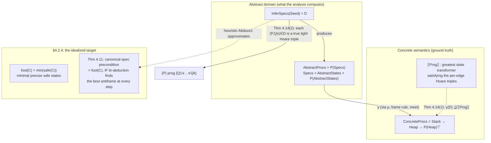

[[book-guidelines|↩ Back to guidelines]]

## Why this article exists

[[Compositional-Program-Analysis-Algorithms]] already walked through the machinery — `PreGen`, `PostGen`, `InferSpecs`, `AbduceAndAdapt`, [[Compositional-Program-Analysis-Algorithms#The assume-as-assert heuristic|the assume-as-assert heuristic]]. That article answers "how does the analysis *compute* a set of preconditions and postconditions for a procedure?" This article answers a different question: "given that it computes *something*, in what sense can you trust the answer?" That's the soundness question, and the paper deliberately isolates it into its own subsection (§4.4, "The Soundness Property") after all the algorithmic machinery is on the table.

This split matters because the two questions have different failure modes. An algorithm can be beautifully engineered and still lie to you — the trust has to come from somewhere external to the algorithm's own bookkeeping. In verification, that "somewhere" is a semantic model: a mathematical object that says what a program *actually* does, independent of any particular analysis of it, against which the analysis's output can be checked. That's what this article builds: the concrete semantics of a procedure, the abstract domain the analysis actually computes in, the function connecting the two, and the theorem (4.14) that ties them together. Along the way we also pick up **footprints** properly — the paper touches them informally back in §1.2 and uses the word constantly, but only gives them a real definition in §4.2.4, right before the soundness section. We'll cover that piece too, since "footprint" is the intuitive picture that the soundness theorem is ultimately formalizing.

## What breaks without a semantic model

Suppose you only had the algorithms from the previous article: `PreGen` searches for preconditions by abduction, `PostGen` re-checks them forwards, `InferSpecs` glues the two together and keeps only the survivors. Nothing in that description tells you whether the output specs are *true* — it's entirely possible to write an algorithm that looks principled, terminates, and returns confidently wrong answers (this happens constantly in software: a type checker with a soundness bug, a static analyzer that "verifies" a use-after-free). The only way to rule this out is to define, independently of the algorithm, what a program *means* — and then prove that whatever the algorithm outputs is consistent with that independent meaning.

This is exactly the role a semantic model plays in a Rust type checker or a Lean kernel: the type system's rules are only as good as the proof that they're sound with respect to an operational semantics (for Rust) or a set-theoretic/categorical model (for Lean's type theory). Without that proof, "well-typed" or "verified" is just a syntactic label, not a guarantee. §4.4 is this paper's version of that proof — compressed into a page and a half, but structurally the same move.

## Concrete meaning: procedures as state-to-powerset functions

### The intuitive picture first

What should the "true meaning" of a procedure be? Concretely: you give it a starting heap, and it does one of two things — it either runs to completion and leaves you in some resulting heap, or it crashes with a memory fault (dereferencing a dangling pointer, double-freeing a cell, and so on). Two wrinkles complicate the naive "heap in, heap out" picture:

1. **Nondeterminism.** `malloc` doesn't return a fixed address — it returns *some* unused cell, and which one it picks is not specified by the program. So a procedure's meaning, for a fixed input heap, isn't a single output heap — it's a *set* of possible output heaps (one per nondeterministic choice the runtime could have made).
2. **Fault is contagious and terminal, and it needs to dominate everything.** If a procedure could fault, we want that fact to survive into any composition — you can't average a crash away. The paper handles this by putting fault ($\top$) as a distinguished top element that swallows any other combination it's paired with, rather than putting it inside the set of possible outcomes.

### The formal definition

Putting this together, the book defines:

$$
\text{ConcreteProcs} \stackrel{\text{def}}{=} \text{Stack} \to \text{Heap} \to \mathcal{P}(\text{Heap})_\top
$$

Read this right to left: $\mathcal{P}(\text{Heap})_\top$ is "the powerset of heaps, plus one extra top element $\top$ standing for possible memory fault." A procedure's meaning takes a stack (the values of the procedure's parameters/free variables) and a heap, and returns either $\top$ (fault is possible from here) or a set of heaps (all the heaps the procedure could legitimately terminate in).

The book's own worked example: a procedure that deletes every element of a linked list rooted at `x`, applied to heap $h$, returns $\top$ if `x` doesn't actually point to a nil-terminated list in $h$ (dereferencing garbage), and otherwise returns the singleton set $\{h'\}$ where $h'$ is $h$ with that list's cells removed. No nondeterminism here — the singleton is because deletion is a deterministic operation once you know the input is a well-formed list — but the *type* of the meaning is still "set of heaps," to accommodate the `malloc`-style cases where it wouldn't be a singleton.

A crucial structural fact, mentioned almost in passing but load-bearing for the soundness proof: **ordered pointwise, $\text{ConcreteProcs}$ is a complete lattice**, and the analysis uses its *meet* $\bigwedge$. Why meet and not join? Because $\top$ (fault, "no information / worst case") is the *top* of this lattice — it's the most permissive, least-informative answer. Combining information should push you *down* from $\top$ toward more precise, smaller sets of allowed heaps. Meet is "give me only what's common/consistent across these," which is exactly the direction you want when you're intersecting multiple pieces of partial knowledge into a sharper claim. This is the same shape as an abstract-interpretation lattice where $\top$ means "don't know anything" and the analysis's job is to compute something strictly below it.

```rust
// A direct transliteration of the type — not runnable analysis code,
// just making the mathematical shape concrete in something a type
// checker would accept.
enum Outcome<Heap> {
    Fault,                 // the "⊤" element
    Results(BTreeSet<Heap>), // the powerset of Heap, minus ⊤
}

// ConcreteProcs = Stack -> Heap -> Outcome<Heap>
type ConcreteMeaning<Stack, Heap> = Box<dyn Fn(&Stack, &Heap) -> Outcome<Heap>>;
```

In Rust terms: this is a `Fn(Stack, Heap) -> Outcome<Heap>` where `Outcome` is `Result`-shaped but the "error" case (`Fault`) carries no information and acts as an absorbing top element rather than a normal `Err(E)` — closer to `Option<BTreeSet<Heap>>` where `None` means fault, except we want `None` to be the *greatest* element under a partial order, which plain `Option` doesn't give you for free (you'd need a custom `PartialOrd` impl making `None` the top rather than the usual convention of treating it as bottom/absence).

## Relational analysis: why there's no abstract transfer function

### The standard picture, and why it doesn't apply here

In a conventional whole-program dataflow or shape analysis, you build one **abstract transfer function** per statement: something of type `AbstractState -> AbstractState`, and you prove a simulation/soundness diagram — if the abstract function sends abstract state $a$ to $a'$, then concretizing $a$ and running the real semantics lands you inside (or below) the concretization of $a'$. This is the textbook abstract-interpretation setup: a concrete function $f$, an abstract function $f^\#$, and $\gamma \circ f^\# \sqsupseteq f \circ \gamma$ (or the Galois-connection dual with $\alpha$).

The paper's analysis deliberately does **not** build such a function. Quoting the reasoning directly: *"our analysis over-approximates the entire functional meaning of a procedure, without explicitly using a function on the entire abstract domain (such a function is just too big)."* This is what the paper (citing Cousot and Cousot 2002) calls a **relational analysis**: instead of approximating the transfer function pointwise (state by state), the analysis approximates the procedure's whole *relation* between inputs and outputs in one shot, as a finite object — a set of pre/post pairs.

Why does "too big" matter concretely? An abstract transfer function over an infinite (or just astronomically large) abstract domain of heap shapes would itself be an infinite object — you can't tabulate it, and you can't compute with it directly except by re-deriving it pointwise every time you need it applied somewhere. A **procedure summary** — a finite set of Hoare triples — sidesteps this: it's a compact, reusable artifact you compute once per procedure and then instantiate at each call site, which is exactly the compositionality property the whole paper is chasing (see [[Bi-Abduction]] and [[Compositional-Program-Analysis-Algorithms]]).

### The abstract domain, precisely

$$
\text{AbstractProcs} \stackrel{\text{def}}{=} \mathcal{P}(\text{Specs}) \qquad \text{Specs} \stackrel{\text{def}}{=} \text{AbstractStates} \times \mathcal{P}(\text{AbstractStates})
$$

In words: an abstract "meaning" of a procedure is a *set* of specs, where each spec is one precondition paired with a *set* of possible postconditions (the disjunctive postcondition $Q_1 \vee \cdots \vee Q_k$ you saw in `InferSpecs`'s output type). The outer $\mathcal{P}(\cdot)$ around `Specs` is there because `InferSpecs` might legitimately discover *several* independent (precondition, postcondition-set) pairs for one procedure — e.g. different specs for the odd-length vs. even-length cases of a list, or the append-with-fresh-tail vs. append-into-an-existing-node cases.

```rust
// A schematic Rust shape for AbstractProcs / Specs — not the paper's
// actual representation (symbolic heaps are richer than this stub
// suggests), but enough to make the two-level powerset concrete.
type Spec = (AbstractState, BTreeSet<AbstractState>); // (P, {Q1,...,Qn})
type AbstractProcSummary = BTreeSet<Spec>;             // D ∈ AbstractProcs
```

This is worth pausing on because it's a genuinely different *shape* of abstract domain than "one abstract value per program point," which is probably the mental model you'd default to from a standard dataflow-analysis background. Here the abstract domain element is closer to a **type signature with multiple overloads** — each spec is one overload (precondition = the "input type," postcondition set = the possible "output types" under that input), and the whole `AbstractProcs` element is the overload set. If you've ever written a Rust trait with multiple `impl` blocks constrained by different bounds, or a Lean function elaborated via multiple dispatch on an inductive argument, the shape is the same: no single function type captures the procedure, only a *finite union* of (precondition, postcondition-set) obligations does.

## Connecting the domains: the concretization function $\gamma$

### First principles: what does "this abstract spec set is trustworthy" even mean?

Before writing $\gamma$'s formula, it's worth being explicit about what job it has to do. We have two different mathematical universes — $\text{ConcreteProcs}$ (real state-transformer functions) and $\text{AbstractProcs}$ (finite sets of Hoare-triple specs) — and no way, yet, to compare an element of one to an element of the other. $\gamma$'s entire job is to translate an abstract answer *back into* the concrete universe, so that "is this abstract answer trustworthy?" becomes the answerable concrete question "does $\gamma$ applied to it dominate the real procedure meaning?"

The construction happens in two stages: first turn a *single* spec into a concrete meaning ($\mu$), then combine all the specs in a set via the lattice meet.

### Stage 1 — one spec's concrete meaning, $\mu$

Take one spec $(p, (q_1, \ldots, q_n))$. What concrete state-transformer should it stand for? Intuitively: "starting from a state satisfying $p$, the procedure produces a state satisfying one of the $q_i$'s — and if the actual heap is *bigger* than what $p$ describes, whatever's left over (the **frame**) just comes along for the ride unchanged." That last clause is exactly the frame rule from [[Separation-Logic-Foundations]], now being used to *define* semantics rather than to prove a program correct.

$$
\mu(p,(q_1,\ldots,q_n))\, s\, h \stackrel{\text{def}}{=} \bigwedge_{\vec v} \Big[\text{proj}\big((\cup_i \llbracket q_i \rrbracket) \ast \{(s+\vec v, h_1)\}\big) \;\big|\; h = h_0 \bullet h_1 \text{ and } (s+\vec v, h_0) \in \llbracket p \rrbracket \Big]
$$

Unpacking each piece:

- $\llbracket p \rrbracket, \llbracket q_i \rrbracket \subseteq \text{Stack} \times \text{Heap}$ are the ordinary satisfaction-based denotations of the assertions $p$ and $q_i$ from [[Separation-Logic-Foundations]]'s forcing relation.
- $s + \vec v$: a spec's logical/existential variables (the "ghost" variables used to relate pre- and post-states, e.g. "the list had value $X$ before, and still has $X$ after") are **universally quantified outside the Hoare triple** — the triple has to hold for *every* instantiation of them. $s + \vec v$ is the stack $s$ extended with one such instantiation $\vec v$.
- $h = h_0 \bullet h_1$: split the actual input heap into the part $h_0$ the spec's precondition talks about, and the leftover frame $h_1$ it doesn't.
- The requirement $(s+\vec v, h_0) \in \llbracket p \rrbracket$: only heaps whose "owned" portion actually satisfies $p$ (under *some* instantiation of the logical variables) are covered by this spec at all.
- $(\cup_i \llbracket q_i \rrbracket) \ast \{(s+\vec v, h_1)\}$: take the disjunction of all the postconditions, and separately-conjoin the untouched frame $h_1$ back on — this is the frame rule, spelled out as an operation on denotations rather than as an inference rule.
- $\text{proj}$ strips the stack back off, since $\mu$'s codomain is $\mathcal{P}(\text{Heap})_\top$, not $\mathcal{P}(\text{Stack}\times\text{Heap})_\top$.
- The outer $\bigwedge_{\vec v}$ (meet over all instantiations $\vec v$): because the logical variables are universally quantified, the meaning has to be consistent across every instantiation, and meet is how you fold "must hold for all of these" into a single lattice value.

If no such split exists at all (the heap doesn't contain a sub-heap satisfying $p$ under any instantiation), the spec says nothing useful about this $(s,h)$ — the resulting value is (or approaches) $\top$, which is the safe, honest answer: "this spec doesn't cover this state, so we know nothing, so assume the worst."

### Stage 2 — a whole abstract element's concrete meaning, $\gamma$

$$
\gamma(D) \stackrel{\text{def}}{=} \bigwedge \{\mu\, d \mid d \in D\}
$$

Take every spec $d$ in the set $D$, run each through $\mu$, and meet the results. Meet again, for the same reason as before: each spec in $D$ is an independent piece of true knowledge about the procedure ("if you start satisfying $p_1$, you land in $q_1$-or-whatever"; "if you start satisfying $p_2$, ..."), and combining independent true facts should only ever make your combined claim *more* precise (move down the lattice), never less.

The degenerate case is instructive: **if $D$ is empty — the analysis found no spec at all for this procedure — $\gamma(\emptyset) = \top$**, the top of the lattice, i.e. "assume fault is possible everywhere." This is the formal way of saying what the previous article's discussion of `InferSpecs` filtering already implied informally: a procedure the analysis gave up on isn't silently ignored or assumed safe — it's assumed to be the *worst possible* procedure, from the caller's point of view, until something proves otherwise. This is what makes graceful degradation *sound* rather than just convenient: losing precision costs you completeness (you might not verify something that's actually safe), never soundness (you'll never falsely claim something safe that isn't).

```python
# A toy, finite-heap illustration of gamma's degenerate behavior —
# not the paper's formalism, just making the "empty spec set = top"
# fact concrete and checkable.
TOP = object()  # stands in for the fault/"don't know" top element

def mu(spec, state):
    """Very simplified: spec = (precondition_check, postcondition_set)."""
    pre, posts = spec
    if not pre(state):
        return TOP               # spec doesn't cover this state -> unsafe to say anything
    return set(posts)            # otherwise: the (frame-extended) postconditions

def gamma(specs, state):
    if not specs:
        return TOP                # gamma(empty) = ⊤, exactly as in the paper
    results = [mu(s, state) for s in specs]
    if any(r is TOP for r in results):
        return TOP                # meet with ⊤ on either side is dominated by the other side's info,
                                   # but if ALL info says "don't know", meet stays TOP
    # meet of concrete result-sets: paper uses lattice meet, here intersect as a stand-in
    out = results[0]
    for r in results[1:]:
        out &= r
    return out
```

## The soundness theorem itself

Everything above exists to state one theorem. First, the paper needs the *actual* meaning of the program under analysis, $\llbracket \text{Prog} \rrbracket \in \text{ConcreteProcs}$ — defined (citing the companion 2007 paper) as the **greatest** state transformer satisfying the Hoare triples attached to each edge of the control-flow graph. "Greatest" is deliberate, not incidental: taking the greatest such transformer means $\llbracket \text{Prog} \rrbracket$ over-approximates *any* concrete runtime that happens to satisfy those per-edge specs, so proving something about $\llbracket \text{Prog} \rrbracket$ automatically covers every possible concrete implementation consistent with the axioms in Figure 3 (`malloc`, `free`, mutation, dereference).

> **Theorem 4.14 (Soundness of Program Analysis).** Suppose `InferSpecs(Seed)` terminates and returns $D$, where $\text{Seed} = x_1{=}X_1 \wedge \cdots \wedge x_n{=}X_n \wedge \mathrm{emp}$ and $x_1,\ldots,x_n$ are all the free variables of the program `prog` under consideration.
>
> **(1) Abstract-interpretation form.**
> $$\gamma(D) \sqsupseteq \llbracket \text{Prog} \rrbracket$$
>
> **(2) Hoare-logic form.** If $(P, \{Q_1,\ldots,Q_k\}) \in D$, then
> $$\{P\}\ \text{prog}\ \{Q_1 \vee \cdots \vee Q_k\}$$
> is a *true* Hoare triple, under the **tight** (fault-avoiding) interpretation of separation-logic triples.

Two things worth being precise about, since the paper itself flags them as informal but they're exactly the parts a Rust/Lean-minded reader will want nailed down:

- **The two clauses are the same claim in two languages, not two separate results.** Clause (1) is the abstract-interpretation-style statement: whatever the analysis concretizes to, it sits above (is a looser, safer over-approximation of) the true procedure meaning in the $\text{ConcreteProcs}$ lattice. Clause (2) is the same fact unpacked triple-by-triple, in the vocabulary a programmer would actually read: each individual discovered spec is a *bona fide, true* Hoare triple you could hand to someone as a lemma about the procedure. The paper states both because (1) is what makes the theorem *provable by induction over the analysis's own structure* (lattices compose predictably), while (2) is what makes the theorem *usable* — it's the form you'd actually cite when composing this procedure's spec into a caller's proof via the frame rule.
- **"Tight" interpretation matters and is not the default reading of a Hoare triple.** Ordinary partial correctness ($\{P\}c\{Q\}$ means "if $c$ started in a $P$-state and terminates, it terminates in a $Q$-state") says nothing about whether $c$ *faults*. The **tight, fault-avoiding** reading additionally asserts $c$ does *not* fault when started in a $P$-state — this is precisely why $\top$ had to be baked into $\text{ConcreteProcs}$'s codomain in the first place: without a fault outcome in the semantic domain, there'd be nothing for "tight" to quantify over. This tight reading is also *why* `PostGen`'s filtering step (discussed at length in [[Compositional-Program-Analysis-Algorithms]]) is not optional cleanup — a candidate precondition from `PreGen` that PostGen rejects is one where the tight interpretation would be violated, so dropping it isn't losing information, it's preventing an unsound claim from ever entering $D$.

The proof sketch the paper gives is refreshingly honest about scope: it says the argument reduces to the semantic framework of the companion paper, and that *"the argument for soundness uses that `PostGen` works by using sound proof rules"* — each procedure call's treatment corresponds to a valid Hoare triple for that call (frame rule + rule of consequence + variable adaptation, i.e. exactly `FrameAndAdapt` from the `PostGen` algorithm), and the worklist's handling of branching/looping corresponds to the disjunction rule and the loop rule of Hoare logic. In other words: soundness of the *algorithm* reduces to soundness of the underlying *proof system*, which is inherited, not re-derived — every step `PostGen` takes is licensed by an already-sound Hoare-logic inference rule, so the algorithm can't accumulate unsoundness no matter how it navigates the search space. This is the same discharge-to-a-trusted-core pattern you'd want from a Lean tactic: the tactic can search however it likes, as long as every step it emits is checked by the (small, trusted) kernel rule for that step.

```lean
-- A schematic Lean-flavored rendering of the shape of the soundness argument.
-- Not the paper's own formalism (it works in a bespoke separation-logic
-- semantics), but this is the pattern being invoked: don't verify the
-- analysis's search process, verify only that each output it commits to
-- is licensed by an independently-sound rule.

-- Independently-trusted Hoare-logic rules (the "kernel"):
axiom frame_rule    : Triple P c Q → Disjoint R (mod c) → Triple (P ∗ R) c (Q ∗ R)
axiom disj_rule      : Triple P c Q → Triple P' c Q → Triple (P ∨ P') c Q
axiom consequence    : (P' → P) → Triple P c Q → (Q → Q') → Triple P' c Q'

-- Soundness of InferSpecs is then: every (P, Qs) it outputs was built by
-- composing calls to frame_rule / disj_rule / consequence / loop_rule,
-- never by asserting a triple outright. So `Triple P prog (⋁ Qs)` is a
-- theorem, not a trusted assumption, for every output spec.
theorem inferSpecs_sound (D : AbstractProcs) (h : InferSpecs seed = D) :
    ∀ P Qs, (P, Qs) ∈ D → Triple P prog (disjAll Qs) := by
  sorry -- the actual proof: induction on the derivation InferSpecs builds,
        -- discharging each step against frame_rule / disj_rule / consequence
```

## Footprints, properly defined

The word "footprint" has been doing informal work since the introduction — "the cells a procedure actually touches" — but §4.2.4 (right before the soundness section, and worth reading as its warm-up) gives it a real definition, built on a concept from [[Separation-Logic-Foundations]]: the **precise predicate**.

**Definition 4.9 (Precise Predicate).** A predicate $P$ is precise if, for every $(s,h)$, there is *at most one* sub-heap $h_f \subseteq h$ with $s, h_f \models P$.

Intuitively: a precise predicate can't be ambiguous about *which* cells it's claiming — given a heap, there's a unique candidate substate it could be describing (or none at all). This matters because "the accessed cells" only makes sense as a well-defined notion if there's no ambiguity about which cells those are.

**Definition 4.10 (Safe States and Footprints).** For a sequence of actions $C$, where each action $\alpha$ has spec $\{P_\alpha\}\alpha\{Q_\alpha\}$ with $P_\alpha$ precise:

$$
\text{safe}(\alpha) \stackrel{\text{def}}{=} P_\alpha \ast \mathrm{true} \qquad\qquad \text{safe}(\alpha; C) \stackrel{\text{def}}{=} P_\alpha \ast (Q_\alpha \mathbin{-\!\!*} \text{safe}(C))
$$

$$
\text{foot}(C) \stackrel{\text{def}}{=} \min(\text{safe}(C))
$$

Read the recursive clause first, since it's the interesting one: "$C$ starting with $\alpha$ is safe on a heap if that heap contains a sub-heap satisfying $\alpha$'s precondition $P_\alpha$ (framed with anything else, `true`), **and**, whatever heap you'd have *after* running $\alpha$ (captured via the magic wand $Q_\alpha \mathbin{-\!\!*}$, separation logic's "if I had a heap satisfying this, then..." connective), the rest of the sequence $C$ is safe on it too." This is a purely *logical* characterization — no reference to an independent operational semantics — but the paper notes it agrees with "the set of states on which $C_1; C_2$ is not $\top$" under the operational semantics of the companion paper (with a caveat: this agreement can fail for imprecise assertions, which is exactly why precision was demanded up front).

The **footprint** itself, $\text{foot}(C) = \min(\text{safe}(C))$, is then just: among all the safe states, take the *minimal* ones (using the $\min$/spatial-betterness machinery from [[Quality-and-Ordering-of-Abduction-Solutions]]) — the smallest heaps on which $C$ is guaranteed not to fault. This cashes out the intuitive picture from the introduction precisely: the footprint isn't merely "some safe precondition," it's the tightest one, containing nothing but the cells $C$ actually needs.

**Theorem 4.11 (Deriving Footprint)** then connects this logical definition back to the bi-abductive algorithm: if every call to the bi-abductive prover inside the construction of a sequence's canonical spec delivers the *best* antiframe (recall from [[Quality-and-Ordering-of-Abduction-Solutions]] that "best" means $\min$ of the abduction question), then the precondition $P_C$ of that canonical spec *equals* $\text{foot}(C)$ exactly. The proof is a clean induction: for a single action it's immediate; for $\alpha; C$, unfolding definitions and using that $P_\alpha$ is precise (so $\min$ distributes across the separating conjunction $P_\alpha \ast (\ldots)$) reduces the claim to exactly what the bi-abductive best-antiframe assumption already gives you. This is the theoretical payoff that justifies calling the whole search "shooting for footprints" rather than just "searching for some safe precondition" — under the idealized best-antiframe assumption, bi-abduction doesn't just find *a* safe precondition, it finds *the* minimal one, on the nose.

The gap between this idealized theorem and the actual heuristic algorithm ([[Proof-Systems-and-Algorithms-for-Abduction]]'s `Abduce1`, which is fast but *incomplete*, not guaranteed to hit the best antiframe) is exactly the gap between "the theory says footprints are achievable" and "the implemented tool gets close in practice." The paper is explicit that this is a topic for further theoretical work, not a solved problem — Theorem 4.11 is an existence/characterization result about the *idealized* pipeline, a ceiling to aim at, not a guarantee about what the actual heuristic proof search delivers on any given program.

## Putting the pieces together



**What this topic depends on:** the frame rule and forcing relation from [[Separation-Logic-Foundations]] (used directly inside $\mu$'s definition and inside `safe`/`foot`); the notion of a best/minimal abduction solution from [[Quality-and-Ordering-of-Abduction-Solutions]] (used inside Theorem 4.11 and inside `foot`'s $\min$); and the `PreGen`/`PostGen`/`InferSpecs` machinery from [[Compositional-Program-Analysis-Algorithms]] (the object whose output, $D$, is what $\gamma$ and Theorem 4.14 are about).

**What depends on this topic:** the rest of the paper's empirical claims. Every result in [[The-Abductor-Tool-and-Case-Studies|Chapter 5's case studies]] — "Abductor discovered this precondition for `append.c`," "no safe precondition was found for `merge.c`" — is only meaningful as a *verification* result (as opposed to a heuristic guess dressed up as one) because Theorem 4.14 stands behind it. When the paper says in its conclusion that soundness is "never compromised" even as completeness and precision remain open problems, this section is where that promise is cashed out formally — completeness failures (like the `merge.c` case, or `needs_even_list`'s abstraction blind spot) show up as $D$ being smaller or emptier than you'd like, but never as $D$ containing a false spec, because Theorem 4.14 rules that out categorically.

## Where this leads

With soundness pinned down formally, the paper turns from theory to practice: Chapter 5 reports what `Abductor` actually finds when you point the (heuristic, incomplete, but *sound*) implementation at real code — small list benchmarks, a device driver, and eventually the Linux kernel. Every one of those results should now read differently than it would from a purely engineering-benchmarks perspective: a discovered precondition isn't just "output the tool produced," it's a spec covered by Theorem 4.14(2), a real Hoare triple you could hand to a human reviewer as a trustworthy claim about the code — the tool's incompleteness can make it silent, but this section is the guarantee that it can't make it wrong.

For the standing project in [[../.learning-goals|the workbench learning goals]]: this article is a load-bearing worked example of `static-analysis`'s "soundness argument for over-approximating analysis passes" thread, and of `automated-reasoning`'s Hoare-logic/weakest-precondition connections. The $\text{ConcreteProcs}$/$\text{AbstractProcs}$/$\gamma$ triple here is a textbook Galois-connection-style soundness architecture (concrete domain, abstract domain, concretization map, "abstract answer over-approximates concrete truth" theorem) — exactly the shape your compiler's own Hoare-contract invariant-generation pass will need a soundness argument for, and the tight-vs-partial-correctness distinction (safety of memory access baked into the semantic domain via $\top$, not bolted on afterward) is a design decision worth carrying over directly: decide up front what your refinement-type checker's semantic domain says about a *failing* check, the same way $\top$ says it here, rather than treating failure as an afterthought layered on top of a success-only semantics.
