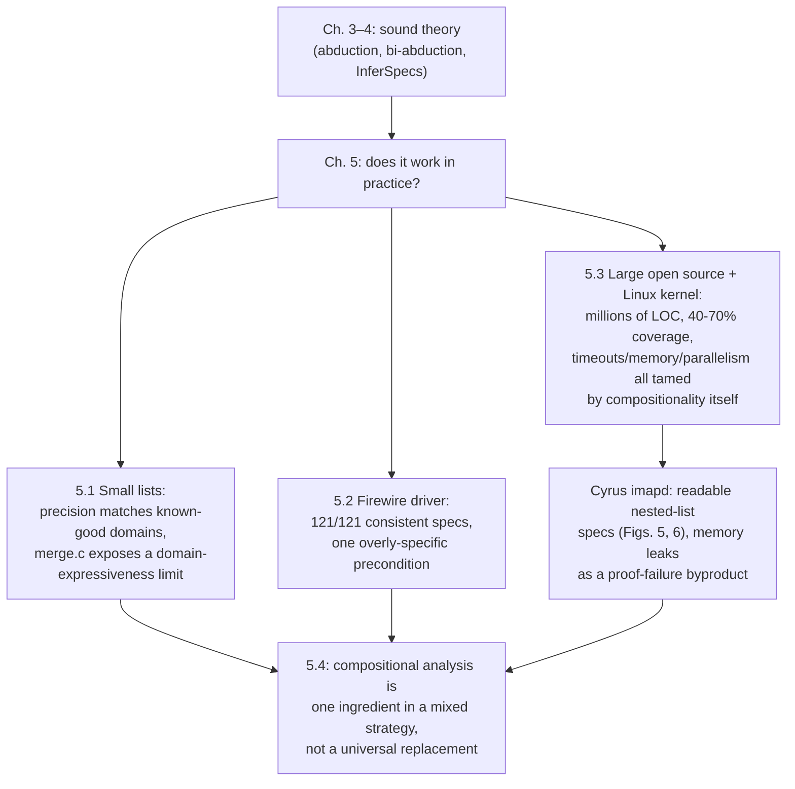

[[book-guidelines|↩ Back to guidelines]]

## Why the paper needs this chapter at all

Everything up through Chapter 4 is a soundness argument: `InferSpecs` is proved to produce Hoare triples that are actually true, no matter what base abstract domain you plug in. But a sound algorithm can still be *useless* — it might infer only trivial specs, or blow up on any program bigger than a textbook example, or take a week per procedure. Chapter 5 is where the paper stops asking "is this correct?" and starts asking "does this actually work, and at what scale?" That's an empirical question, and the authors answer it the only honest way: by running the `Abductor` prototype on real code, from ten-line list programs up to a full Linux kernel tree, and reporting the failures alongside the successes.

This matters more than a typical "experiments" section in a theory paper, because the central selling point of bi-abduction — compositionality — is exactly the kind of property that's easy to prove and easy to doubt in practice. A whole-program shape analysis that never leaves the lab can still look impressive on paper. A compositional one has to be *shown* scaling, because the entire argument for why it should scale (each procedure gets its own tiny footprint, verified independently, stitched together bottom-up) is a claim about engineering reality, not just proof theory. Chapter 5 is that demonstration, and it's unusually candid about where the method still falls short — which is itself informative: the paper is explicit that soundness and precision are different axes, and that this chapter's job is to probe precision and scale while leaving soundness untouched.

## 5.1 — Small linked-list programs: precision on home turf

The first case study is deliberately easy: a battery of classic C list routines — `append`, `append-dispose`, `copy`, `create`, `del-doublestar`, `del-all`, `del-all-circular`, `del-lseg`, `find`, `insert`, `merge`, `reverse`, `traverse-circ` — for which *hand-written* preconditions were already known to work well with existing forward shape analyses. The question isn't "can shape analysis handle lists" (already known: yes, given a precondition) but "can `PreGen` *discover* a good precondition on its own, with no human in the loop." This isolates the abduction algorithm from the abstract domain: if a domain is known to be adequate for the postcondition side, any success or failure on the precondition side is attributable to abduction itself.

Table I in the paper reports, per program, three numbers plus a normalized-and-deduplicated view of the results:

| Column | Meaning |
|---|---|
| Candidate Pre | how many preconditions `PreGen` initially proposes (multiple paths through the procedure body abduce different requirements) |
| Unsafe Pre | how many of those get filtered out by the safety-check re-execution pass (recall from Chapter 4: `PreGen`'s candidates are provisional until re-run against the concrete/soundness-checking semantics) |
| Discovered Precondition | the surviving, deduplicated, implication-compacted preconditions actually reported |

Two things are worth internalizing about what a "discovered precondition" looks like, because they reveal what abduction is and isn't doing:

**It's exactly the footprint, no more.** For `del-doublestar` — the classic C idiom that deletes a node by keeping a pointer to the *previous* node's `next` field so it never special-cases the head of the list — Abductor discovers two disjoint preconditions:

```
listP|->x_ * ls(x_,x1_) * x1_|->elmt:value      (element found partway down the list)
listP|->x_ * ls(x_,0)                            (element absent — full list scanned)
```

```c
void del_doublestar(nodeT **listP, elementT value) {
  nodeT *currP, *prevP;
  prevP = 0;
  for (currP = *listP; currP != 0; prevP = currP, currP = currP->next) {
    if (currP->elmt == value) {
      if (prevP == 0) *listP = currP->next;
      else prevP->next = currP->next;
      free(currP);
    }
  }
}
```

Notice what's *not* in either precondition: nothing about list cells that would come *after* the found element (`ls(x_, x1_)` runs only up to the match, then stops — the postcondition for that branch is just `listP|->x_ * ls(x_,x1_)`, dropping any need to describe what follows). The analysis has correctly inferred that the procedure never touches that tail, so it isn't part of the footprint. This is the frame rule from Chapter 3 operating in reverse: instead of a human deciding what's irrelevant and folding it into a frame, abduction discovers that irrelevance from the trace of the symbolic execution itself.

**It fails exactly where the underlying abstraction can't express the true precondition, not where the abduction algorithm is weak.** `del-doublestar` has a subtler gap: Abductor never proposes a *circular*-list precondition `listP|->x_ * ls(x_,x_)`, even though running the procedure on a circular list is memory-safe (it just loops forever without ever faulting). This is a direct instance of a phenomenon flagged earlier in the paper (in the discussion of the `assume-as-assert` heuristic): abduction, as implemented, tends to avoid inferring preconditions that provably lead to non-termination, because the analysis only ever "discovers" facts along terminating symbolic-execution paths — a diverging path never reaches a point where the missing circularity fact would need to be asserted.

Contrast this with `traverse-circ`, a procedure that *explicitly* checks for return to a fixed start node:

```c
void traverse_circ(struct node *c) {
  struct node *h;
  h = c; c = c->tl;
  while (c != h) { c = c->tl; }
}
```

Here Abductor *does* find the circular-list precondition `c|->c_ * ls(c_,c)`. The mechanism is worth naming precisely, because it's the `assume-as-assert` heuristic from §4.2 doing real work: the loop guard `c != h` is treated, at loop exit, as an assumed fact `c == h`; combined with the list-segment fact `ls(h, c)` accumulated by symbolic execution around the loop, `c == h` collapses that open segment into a genuinely circular structure `ls(c_, c)`. The alias check written into the loop condition is precisely what supplies the piece of information the *un*-guarded `del_doublestar` never gets — the analysis isn't smarter about circularity in general, it's exploiting a boolean test the program happened to perform.

The `append` vs. `append-dispose` pair makes the footprint principle concrete in another direction:

```c
void append(nodeT *x, nodeT *y) { /* swings a pointer at the end of x's list to point at y */ }
```

`append.c`'s discovered precondition is just `ls(x,0)` — nothing about `y` is required, because the procedure never *dereferences into* `y`, it only writes a pointer *to* it. But `append-dispose.c` — which appends, then walks and frees the now-combined list — needs `ls(x,0) * ls(y,0)`, because now both halves get traversed and their acyclicity actually matters for termination and safety. Composing two operations composes their footprints; nothing about `y`'s structure appears in one spec and vanishes in the other by magic — it appears exactly when the code path requires it.

### The one failure: `merge.c`

Out of the whole batch, `merge.c` — the standard sorted-list merge — is the sole case where Abductor finds **no safe precondition at all**: all 30 candidates are generated, and all 30 are rejected by the unsafe-filter re-execution pass. This deserves its own explanation because it's a *principled* failure, not a bug in the tool.

The behavior of `merge` depends on the *values* stored in the two lists, not just their shape: it walks whichever list currently has the smaller head value, and the traversal pattern (which list gets consumed to completion first, which is left partially walked) is determined by a comparison over list contents. Abductor's underlying abstract domain reasons about shape (spatial structure — pointers, allocation, list-segment predicates) and, separately, about a *simple* pure domain of equalities/inequalities over scalars; it has no way to relate the two, i.e. it cannot express "list $A$ is null-terminated *because* every value in $A$ is smaller than every value in $B$."

So concretely: the analysis correctly observes that, along some traces, only one of the two input lists gets fully traversed to `null` while the other is merely partially walked. But it cannot see *why* — that the partial traversal happens precisely when the remaining values in that list are all larger than what's left in the other. Lacking that value-dependent explanation, abduction generalizes the observation the only way its abstraction lets it: it proposes that *both* lists are disjoint linked lists, one running to null and the other running to some arbitrary (possibly non-null) end. That candidate does not actually guarantee memory safety in general — there exist heaps satisfying it on which `merge` faults — so it's correctly discarded at re-execution.

The lesson the authors draw is important and generalizes past this one example: **this is a limitation of the shape-only abstract domain, not of the abduction algorithm.** Bi-abduction is domain-parametric — it searches for missing/leftover heap facts *within whatever vocabulary the base domain supplies*. If that vocabulary can't state "sortedness implies boundedness," no search strategy over it will ever construct a safe, sufficiently general precondition for `merge`. A richer domain relating shape and data (e.g., one tracking sortedness as a spatial-adjacent fact) could in principle fix this — but that is future work, not evidence against bi-abduction as a discovery mechanism.

## 5.2 — The IEEE 1394 Firewire device driver: a "mixed" result on real code

The second study steps up from toy list programs to a real Windows device driver (~10 KLOC, 121 procedures), previously analyzed *top-down* with the whole-program tool `SpaceInvader`, which required a human to write environment code — a harness nondeterministically invoking the driver's dispatch routines with correctly-initialized data structures — before it could even start. Abductor is run on the *same* driver, but bottom-up and with **no environment code at all**: each procedure gets its precondition inferred purely from its own body plus the already-inferred summaries of its callees.

The headline result: Abductor finds **consistent (non-inconsistent) specifications for all 121 procedures.** This is a stronger claim than it might first appear, because consistency has to hold *compositionally*: a higher-level procedure's proof only goes through if the specs of everything it calls actually "fit" its call sites (recall `AbduceAndAdapt` and `Rename` from Chapter 4, which perform the variable renaming and precondition-adaptation needed to reuse a callee's summary at a specific call site). An overly-imprecise spec discovered for some low-level procedure would propagate upward and break every proof that depends on it — so 121-for-121 consistent specs is indirect evidence that the *whole call tree's* summaries are simultaneously coherent, not just individually plausible.

Qualitatively, the discovered specs are not shallow. The analysis of the top-level `t1394Diag_Pnp` procedure discovers preconditions describing **several circular linked lists, some with nested acyclic sub-lists** — structurally similar to what the earlier top-down `SpaceInvader` analysis needed a human to specify. More strikingly, the bottom-up analysis surfaces a fact a human specifier would likely not think to write down explicitly: whether a lower-level collaborating driver actually gets *dereferenced* depends on the values of certain parameters — i.e., some code paths never touch that driver's fields at all, and the discovered precondition correctly reflects that conditional dependency rather than blanket-requiring the driver to be allocated (which is what a conservative human-written spec typically does, "just in case").

The mixed part: for one specific routine, `t1394Diag_PnpRemoveDevice`, Abductor discovers an **"overly specific" precondition** — one so narrow it rules out many paths that the real driver's environment would actually exercise. That spec wouldn't compose with the environment code SpaceInvader used, so the authors are careful *not* to claim Abductor has verified the driver as thoroughly as the earlier whole-program effort. The diagnosed cause is not a flaw in bi-abduction per se, but a mismatch of abstract domain to task: the shape domain used was designed with a whole-program analysis in mind, and a more expressive domain might let the compositional method find a properly general precondition here too. The chapter draws a broader methodological point from this: a compositional analysis might be a good tool for *helping a human construct* environment code for a whole-program verification effort, without itself being a drop-in replacement that closes the verification loop unattended in every case.

## 5.3 — Scaling to real open-source codebases

This is where the paper makes its strongest empirical claim: Abductor was run over a set of large, unmodified open-source C projects — including a **complete Linux kernel 2.6.30 distribution (3032 KLOC, 143,768 procedures)** — with results reported in Table II:

| Program | KLOC | Num. Procs | Proven Procs | Coverage % | Time (s) |
|---|---:|---:|---:|---:|---:|
| Linux kernel 2.6.30 | 3032 | 143,768 | 86,268 | 60.0 | 9617.44 |
| Gimp 2.4.6 | 705 | 16,087 | 8,624 | 53.6 | 8422.03 |
| Gtk 2.18.9 | 511 | 18,084 | 9,657 | 53.4 | 5242.23 |
| Emacs 23.2 | 252 | 3,800 | 1,630 | 42.9 | 1802.24 |
| Glib 2.24.0 | 236 | 6,293 | 3,020 | 48.0 | 3240.81 |
| Cyrus imapd 2.3.13 | 225 | 1,654 | 1,150 | 68.2 | 1131.72 |
| OpenSSL 0.9.8g | 224 | 4,982 | 3,353 | 67.3 | 1449.61 |
| Bind 9.5.0 | 167 | 4,384 | 1,740 | 39.7 | 1196.47 |
| Sendmail 8.14.3 | 108 | 820 | 430 | 52.4 | 405.39 |
| Apache 2.2.8 | 102 | 2,032 | 1,066 | 52.5 | 557.48 |
| Mailutils 1.2 | 94 | 2,273 | 1,533 | 67.4 | 753.91 |
| OpenSSH 5.0 | 73 | 1,329 | 594 | 44.7 | 217.81 |
| Squid 3.1.4 | 26 | 419 | 281 | 67.1 | 107.85 |

*("Proven Procs" = procedures for which at least one consistent — not necessarily precise — spec was found.)*

**What breaks without compositionality — and how it's fixed.** The point of this table isn't precision (coverage sits in the 40–70% band, and the authors are upfront that most successfully-analyzed procedures get simple, list-predicate-free specs, since most procedures don't traverse nontrivial data structures at all). The point is scale and *graceful imprecision* — a core theme flagged as early as Chapter 1. Three structural properties of the compositional design make the scale-up possible, each addressing a concrete failure mode a whole-program analysis hits on codebases this size:

1. **Per-procedure timeouts, applied compositionally.** With a 1-second timeout per procedure, only a small fraction of procedures actually time out; more commonly the analysis simply fails to find a *nontrivial* consistent spec (falls back to something trivial or unprovable) rather than hanging. Crucially, one procedure timing out doesn't halt or corrupt the analysis of anything else — a whole-program analysis has no comparable circuit breaker, because a stuck fixpoint computation over global state blocks the entire result, not just one summary.
2. **No whole-program memory footprint.** Because each *file* — indeed, each procedure — can be analyzed independently of the rest of the source, the tool never needs the entire program loaded into memory simultaneously. For a 3-million-line kernel, "load everything and analyze" would thrash any realistic machine; compositional analysis sidesteps the problem entirely rather than optimizing around it.
3. **Free parallelism.** Since procedure-level analyses are largely independent, running the same Linux-kernel analysis on an 8-core machine versus 1 core yielded roughly a **4x speedup** with no special parallel-analysis machinery — compositionality is *itself* the mechanism that exposes the parallelism.

The authors are candid that "there is no deep reason" for the scalability beyond the drive toward small, footprint-sized specs — this isn't a clever scheduling trick, it's a structural consequence of never needing more than a procedure's own footprint plus its direct callees' summaries at any one time.

The chapter also flags where the underlying domain's known weaknesses persist at scale: the pure (non-spatial) part of a symbolic heap here is a simple domain of constants/equalities/inequalities, and in particular **arrays and pointer arithmetic are not handled precisely** — they're treated as nondeterministic, sound-but-imprecise operations for the purpose of proving pointer safety. This is the same domain-limitation theme as the `merge.c` failure in §5.1, now showing up as a systemic gap rather than a single failing example.

### 5.3.1 — The Cyrus imapd example: reading a synthesized specification

Because Abductor's raw output for a huge codebase is unwieldy, the authors zoom into one project — Cyrus imapd — and walk through actual synthesized specs as pictures. Of Cyrus's successfully-analyzed procedures, only about 1.5% have specs involving genuinely complex (nested/non-nested list) data structures — reinforcing the point that most procedures in real software just don't traverse rich structures, so the interesting evaluation is concentrated in a small minority of cases.

**Reading Figure 5 (the `freeentryatts` spec).** The picture is a graphical rendering of exactly the symbolic-heap objects defined formally in §3.1: a small solid rectangle is an allocated cell; a dashed rectangle is a possibly-dangling pointer or `nil`; a tall shaded rectangle labeled `lsPE`/`lsNE` is the higher-order list predicate $\mathit{hls}_k(\varphi, e, e')$ from §3.1.1 — the subscript $k$ (possibly-empty `PE` vs. provably-nonempty `NE`) records emptiness information, and the "internal structure" $\varphi$, drawn as a nested dashed box, records the shape of each list *element* (here, a `STRUCT` with fields `attvalues`, `next`, `entry`).

Reading the figure top to bottom: `PRE1` shows a list rooted at `l` whose elements are structs with an `attvalues` field pointing to a **second, nested list** of structs (fields `value`, `next`, `attrib`). Two postconditions are shown, `POST1` and `POST2`, corresponding to the two ways the procedure can terminate (this is the disjunctive-postcondition machinery from `PostGen`/`InferSpecs` in Chapter 4 — a single precondition can yield a disjunction of outcomes). So the discovered footprint of `freeentryatts` is: *a non-circular singly linked list whose elements each own a nested non-circular singly linked list* — inferred entirely automatically, with no human specifying that shape in advance.

**Reading Figure 6 (`freeattvalues`) and why the composition matters.** `freeentryatts` calls `freeattvalues(l->attvalues)` to deallocate the inner list, and Figure 6 shows exactly the spec discovered for `freeattvalues` in isolation — one that talks only about the *inner* list, with no mention whatsoever of the outer list or the struct fields (`next`, `entry`) that live one level up in the caller. This is the modularity payoff of local reasoning made visible: `freeattvalues`'s spec doesn't need to describe the context it's called from, and the bottom-up analysis is able to *compose* that narrow spec into the wider proof for `freeentryatts` (via the frame rule: the caller's own footprint is combined with the untouched frame around the callee's smaller footprint) rather than re-deriving list-traversal facts about the inner structure from scratch inside the caller. Concretely, this is the compositional analysis doing at kernel-sized scale exactly what the two-call worked example in Chapter 2 did by hand: discovering a frame at one call site and reusing it, rather than re-analyzing global state at every step.

From this one spec, the paper draws a genuine correctness conclusion, not just a shape description: given `PRE1`, `freeentryatts` provably **does not leak memory, does not dereference a null or dangling pointer, and does not double-free** — because the discovered postconditions exhaustively account for every cell in the precondition's footprint (nothing "falls off the map" unaccounted for), which is precisely what a genuine over-approximating abstract-interpretation proof (in the sense of Cousot & Cousot) guarantees, in contrast to unsound bug-finding tools that might merely fail to *find* such an error without proving its absence.

## Memory leak detection as a side effect, not a design goal

A secondary finding from the Cyrus study: among procedures where the analysis *failed* to synthesize a full spec, **84 potential memory leaks were reported**. A "potential leak" here means a spatial fact (an allocated cell or predicate) appears in a symbolic heap during the proof attempt but is not provably reachable from any program variable by the time the analysis gives up — i.e., exactly the situation the proof-search machinery of Chapter 3 flags as "stuff left over that nothing points to anymore." Manual triage of these 84 cases found roughly 22.6% were genuine leaks, 30.9% were false positives, and the remaining ~46.4% were too ambiguous to classify without deeper source knowledge (a limitation of tooling/reporting support, not of the underlying logic).

The paper is explicit about the epistemic status of this result: Abductor was **not designed as a bug-finding tool** — it's a *proof* tool, built to construct valid Hoare-triple derivations, and leak detection falls out only because a failed proof attempt leaves behind exactly the kind of "unaccounted-for cell" evidence that also happens to be a leak symptom. The authors call this a "pleasant surprising feature," deliberately hedging against over-claiming it as a designed capability — a genuinely different posture from a dedicated unsound bug-catcher, which trades soundness for aggressive pattern-matching on suspicious code shapes.

## 5.3.2 — Caveats: where the model and reality diverge

The authors close the large-scale study with an unusually direct list of caveats — worth reading as a checklist of open problems, since none of them are fixed by more or better abduction; they're about the underlying program model:

1. **Concurrency is ignored entirely.** The analysis treats every procedure as if it runs sequentially. Concurrent separation logic suggests sequential results *might* transfer soundly to some concurrent settings, but the authors explicitly decline to make that claim here (follow-on work does pursue a concurrent variant).
2. **Unknown library calls are treated as nondeterministic, side-effect-free assignments.** This is sound *for pointer-safety purposes* in many cases, but it was a pragmatic choice made because manually specifying every C library function used across these codebases was infeasible within the study — not a claim that this modeling choice is always safe or always precise.
3. **Code pointers are treated as unknown procedures.** This is flagged as a "longstanding open problem," not specific to this paper. The chosen workaround — modeling a code pointer as belonging to an object with its own separate footprint from the calling procedure — is likened to the *hypothetical* frame rule sketched elsewhere in the authors' related work, but the paper stops short of claiming this is a solved problem; it's a stopgap.
4. **Arrays and non-pointer values are treated imprecisely** (as already noted in §5.3) — the pure domain used is too coarse to reason about array indexing or arithmetic precisely; a better plug-in domain could fix this without touching the bi-abduction machinery itself.
5. **File-by-file analysis via `gcc`-call interception** treats some procedures as "unknown" when they needn't be, and misses between-file cycles in the call graph — an engineering artifact of how the case studies were run, not a theoretical limitation.

The authors' own framing matters here: these caveats are **independent of the paper's actual scientific contribution** (bi-abduction and the soundness of `InferSpecs`), which remains intact regardless. What the caveats bound is how much *accuracy* to expect when the sound algorithm is pointed at real, large, imperfectly-modeled C code — a distinction the paper is careful never to blur.

## 5.4 — Discussion: compositional analysis as one tool among several

The chapter's short closing discussion resists over-claiming in the other direction too: compositional shape analysis is *not* presented as categorically superior to whole-program analysis — it has real precision costs (as `merge.c` and the Firewire driver's one bad case demonstrate) alongside its scalability and automation wins. The authors sketch a future where these techniques are combined rather than chosen between: run bottom-up most of the time (cheap, scalable, handles incomplete programs gracefully), then apply a top-down *narrowing* pass to recover precision on specific parts of the code that matter, possibly backstopped by interactive/human proof effort where automation alone can't close the gap. This is consistent with the paper's overall stance since Chapter 1: bi-abduction buys compositionality, and compositionality is valuable even though — not instead of — retaining whole-program methods as a complementary tool.

## Synthesis: what this chapter is actually evidence for



Every failure mode surfaced in this chapter traces back to the **base abstract domain**, never to the bi-abduction algorithm or to soundness: `merge.c` fails because the domain can't relate values to shape; the Firewire driver's bad case fails because the domain was tuned for whole-program use; arrays and code pointers are imprecise because the domain doesn't model them richly. This is exactly the "$A \mapsto C[A]$" framing the paper uses explicitly in its Related Work chapter (Chapter 6): bi-abduction is a *domain-parametric transformer* that takes any base shape-analysis domain $A$ and produces a compositional analysis $C[A]$ inheriting $A$'s expressiveness limits along with its strengths. Chapter 5's case studies are the empirical proof that this transformer, applied to a real (if imperfect) domain, survives contact with millions of lines of production C code without needing its soundness argument revisited.

For the standing project of building a Rust-based refinement-type compiler with an embedded verifier (Focus Area: **Static Analysis & Abstract Interpretation**, with a strong secondary pull toward **SAT/SMT/CSP**), this chapter is the most concrete argument in the whole paper for *why* compositional, footprint-based specification synthesis is worth implementing at all, rather than a whole-program dataflow pass: the same practical failure modes (state blow-up, non-terminating fixpoints, inability to parallelize) that would threaten a monolithic invariant-generation pass over a large codebase are exactly what per-procedure Hoare-triple summaries with a bi-abductive frame rule are shown here to sidestep. The `merge.c` failure is a direct preview of a recurring tension in that project too: an abstract domain (shape, in this case; refinement predicates, in the compiler's case) can only support the preconditions it can *express*, and no amount of clever search over that domain manufactures expressiveness the domain doesn't have — a lesson that generalizes straight to designing the CSP kernel's domain lattices for the compiler's over-approximating invariant generator. The Cyrus imapd walkthrough is also a template worth imitating directly: rendering synthesized specifications as structural pictures (rather than raw logical formulas) is a genuinely useful tooling idea for making an automatically-inferred contract legible to a human reading the compiler's diagnostic output.

## Where this leads

The related-work chapter that follows (Chapter 6) explains this contribution abstractly as the passage $A \mapsto C[A]$ and situates it against whole-program shape analyses, backwards precondition-inference, and CEGAR — but the empirical grounding for taking that abstract claim seriously is entirely this chapter. Nothing later in the paper revisits soundness (that was closed in Chapter 4) or introduces new algorithms; Chapter 5 is the paper's last word on *whether the machinery is worth having*, and its answer is a qualified yes: scalable and automatic, with precision limited by the base domain rather than by bi-abduction itself.
