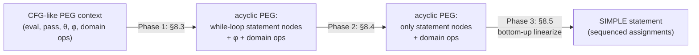
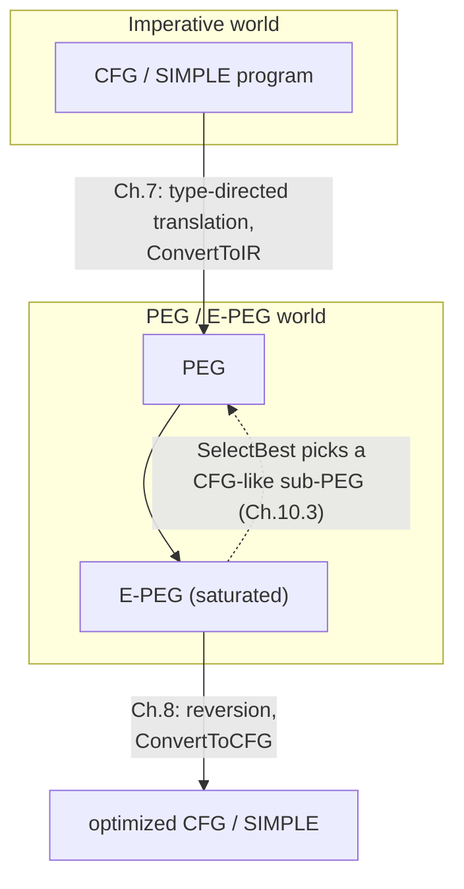

[[book-guidelines|↩ Back to guidelines]]

# Converting Between Imperative Code and PEGs

## Why a compiler IR needs a two-way bridge at all

Everything else in this thesis — [[Equality-Saturation|equality saturation]], the global profitability heuristic, [[Translation-Validation|translation validation]], [[Learning-Optimizations-from-Proofs|learning optimizations from proofs]] — happens *inside* the Program Expression Graph (PEG) world, where a program is a pure, referentially transparent expression instead of a sequence of destructive commands. But no source language and no target machine speaks PEG. A Java method arrives as bytecode with explicit control flow; the optimized result has to leave as bytecode with explicit control flow too. So the entire apparatus is only useful if there is a faithful, mechanical way to go **imperative code → PEG** (so equality saturation has something to work on) and then **PEG → imperative code** (so the optimized result can actually run). This chapter pair is that bridge, and it is asymmetric in an interesting way: the forward direction (Chapter 7) is comparatively easy, because throwing away the explicit ordering of an imperative program and replacing it with dataflow is mostly "just" tracking, per variable, the most recent PEG node that represents its value. The backward direction (Chapter 8) is hard, because a PEG's $\phi$/$\theta$/$\mathrm{eval}$/$\mathrm{pass}$ nodes only encode a *dependency structure* — they say nothing about which physical loop or branch in the output program should host a given piece of computation, and naively answering that question produces correct but violently inefficient code (duplicated loops, duplicated branches, hoisted-and-broken semantics). If you have ever hand-written a "lower this SSA/CPS IR back to a while-loop" pass and hit exactly this kind of code duplication, you already know why half of Chapter 8 exists.

If you are building a Rust compiler with a checker/verifier core, this pair of chapters is worth reading closely for a structural reason beyond PEGs themselves: **the forward translation (7.3) is a type-directed / judgment-driven translation exactly in the sense a bidirectional type checker is** — the translation rules are indexed by, and structurally recurse on, a *typing derivation*, not on raw syntax. That is precisely the discipline your elaborator will need when it translates a surface AST into a core IR while simultaneously validating it.

---

## Part 1 — SIMPLE and its typing rules: the object language for the translation

### What breaks without a fixed, minimal source language

The thesis needs *some* concrete imperative language to translate from, but it deliberately keeps that language minimal — no procedures, no heap, no complex types beyond "some primitive operations over some primitive types with a boolean for conditionals." Without this reduction, the translation rules and the correctness proof would be entangled with irrelevant language features (subtyping, aliasing, calling conventions). By stripping to the essence — sequencing, assignment, if/else, while — Tate isolates exactly the mechanism that matters: how does control flow (branching, looping) get compiled into pure dataflow?

### The grammar and typing judgments

SIMPLE's grammar (book's Figure 7.1):

$$
\begin{aligned}
p &::= \mathrm{main}(x_1:\tau_1,\dots,x_n:\tau_n):\tau\,\{s\} \\
s &::= s_1;s_2 \mid x := e \mid \mathrm{if}\,(e)\,\{s_1\}\,\mathrm{else}\,\{s_2\} \mid \mathrm{while}\,(e)\,\{s\} \\
e &::= x \mid \mathrm{op}(e_1,\dots,e_n)
\end{aligned}
$$

A program is a single function `main` with typed parameters and a distinguished return variable `retvar`; assignment is untyped syntactically (`x` inherits the type of `e`); constants are just nullary operators.

There are three judgment forms — and this triad is worth naming explicitly, because it is the shared ancestor of "a type checker" and "a proof checker" that keeps recurring across formal systems:

- $\vdash p$ — the program is well typed.
- $\Gamma \vdash s : \Gamma'$ — starting from context $\Gamma$, after executing $s$ the context becomes $\Gamma'$. Note this is *not* the usual "expression has type $\tau$" judgment — it's a **context transformer**, reflecting that a statement's typing effect is to update which variables are bound to which types.
- $\Gamma \vdash e : \tau$ — the ordinary expression-typing judgment.

The interesting rules:

$$
\text{Type-While: } \frac{\Gamma \vdash e:\mathrm{bool} \quad \Gamma \vdash s : \Gamma}{\Gamma \vdash \mathrm{while}(e)\{s\} : \Gamma}
$$

The context *before* and *after* the loop body must be identical — this is what pins down the "loop-induction variables": exactly the variables that can legally vary across iterations are exactly those already in $\Gamma$ before the loop starts.

$$
\text{Type-Sub: } \frac{\Gamma \vdash s : \Gamma' \quad \Gamma'' \subseteq \Gamma'}{\Gamma \vdash s : \Gamma''}
$$

This is a weakening/subsumption rule that lets you "forget" bindings — exactly analogous to context weakening in a dependent-type presentation, and it exists here for a mundane but important reason: it lets `if`/`while` bodies introduce and later discard temporary variables without polluting the context that downstream code sees.

**Rust [[Domain-Independent-Applications-of-Generalization#Grounding|grounding]].** A context $\Gamma$ here is just `HashMap<Var, Type>`; the statement judgment $\Gamma \vdash s : \Gamma'$ is a function `fn check_stmt(ctx: &Context, s: &Stmt) -> Result<Context, TypeError>` that *returns* a new context rather than mutating in place — this immutability is not incidental, it is exactly what lets the PEG translation (next section) piggyback on the same recursive structure and thread *PEG node contexts* instead of *type contexts* through an isomorphic recursion.

---

## Part 2 — Type-directed translation from SIMPLE to PEGs

### The core idea: node contexts as "SSA, but functional"

The central data structure of the whole translation is the **node context** $\Psi$: a finite map from SIMPLE variables to PEG nodes, where $\Psi(x) = n$ means "the current value of $x$ is represented by PEG node $n$." This is exactly what a compiler's SSA-construction pass tracks (the mapping from a variable to its current defining SSA value) — except here, instead of inserting classical SSA $\phi$-functions at merge points and leaving definitions ordered, the whole thing collapses into pure, unordered dataflow.

The pseudocode translation (book's Figure 7.3) has this shape:

- `TE(e, Ψ)` translates an expression: a variable read is a context lookup, `Ψ(x)`; an operator application recursively translates each argument, and builds a PEG node `op(n_1,...,n_k)`.
- `TS(s, Ψ, ℓ)` translates a statement at loop-nesting depth $\ell$, producing an updated context:
  - Sequencing: thread $\Psi$ through — `TS(s2, TS(s1, Ψ, ℓ), ℓ)`.
  - Assignment: `Ψ[x ↦ TE(e, Ψ)]`.
  - If/else: translate both branches to get $\Psi_1,\Psi_2$, then build a $\phi$ node **per variable common to both branches**: `PHI(TE(e,Ψ), Ψ_1, Ψ_2)`.
  - While: the interesting case (below).

### Branches: one $\phi$ node per live variable

`PHI(n, Ψ_1, Ψ_2)` walks the keys shared by $\Psi_1$ and $\Psi_2$ and, for each variable $x$, creates $\phi(n, \Psi_1(x), \Psi_2(x))$ — the guard is shared across all of them, only the true/false children differ per variable. This is a direct generalization of classical gated-SSA $\phi$-functions to a value-level (not control-flow-level) representation: instead of "which predecessor block did control come from," it's "which boolean value did the condition evaluate to."

**Inefficiency, honestly reported.** The book flags that this creates a $\phi$ node for *every* variable live before the branch, even ones untouched by either side — cleaned up later by the trivial rewrite $\phi(C,A,A) = A$. This detail matters as a design lesson: the translation is deliberately kept simple and *complete*, with cleanup deferred to the equational rewrite system rather than special-cased into the translation itself — a recurring theme of "push complexity into the part of the system that's designed to handle complexity" (here, the saturation engine).

### While loops: tying the recursive knot with temporary nodes

This is the crux of the whole forward direction, and it directly parallels how one handles recursive/self-referential definitions in an elaborator (e.g., defining a recursive function whose own name must appear inside its body before the definition is "closed").

The problem: a loop variable's value inside the loop body depends on *itself* (its own value from the previous iteration) — but you don't have a node for "the value of $x$ during the loop" until you've finished translating the body, and you can't translate the body without already having *some* node standing in for $x$.

The fix, step by step (pseudocode `TS` on `while`, lines 9–15 of Figure 7.3):

1. **Allocate placeholders.** For every variable `v` currently live, create a fresh `TemporaryNode(v)` and bind it in $\Psi_t$. These are not real PEG nodes with semantics — they are forward-reference stand-ins, exactly like a "hole" or unresolved metavariable.
2. **Translate the body against the placeholders**, at loop depth $\ell+1$, producing $\Psi'$: the body's effect expressed *in terms of* the temporaries.
3. **Build $\theta$ nodes.** `THETA` pairs the pre-loop value (from $\Psi$, the base case) with the in-loop value (from $\Psi'$, in terms of temporaries) into $\theta_{\ell+1}(b, n)$ for each variable — recall from the PEG formalism that $\theta$'s left child is the initial value and its right child is the next value expressed in terms of the previous one.
4. **Close the knot.** `FixpointTemps` walks every $\theta$ node just built and replaces edges to `TemporaryNode(x)` with edges to the actual $\theta$ node created for `x`. This is the "tying the knot" step — after this, each $\theta$ genuinely is self-referential (its own right child mentions it, indirectly, through the other loop variables' $\theta$s), exactly the way a `letrec` or a Lean/OCaml recursive value binding closes over itself once fully elaborated.
5. **Extract post-loop values.** `pass_{ℓ+1}` takes the *negated* guard (the break condition) as a child; then `EVAL` builds one `eval_{ℓ+1}(θ, pass)` node per variable — this is literally reading off Chapter 3's definition: $\mathrm{pass}(s)$ returns the first true index of a boolean sequence (here, the iteration where the loop stops), and $\mathrm{eval}(s,n)$ returns the $n$-th element of a sequence.

**Worked example (factorial of 10, book's Figure 7.4).** For `while (Y<=10) { X := Y*X; Y := 1+Y }` starting from `X=1, Y=1`:

- Temporaries: $\Psi_t = \{X:v_X,\ Y:v_Y\}$.
- Body translated against temporaries: $\Psi' = \{X : v_Y * v_X,\ Y: 1+v_Y\}$.
- $\theta$ nodes: $X \mapsto \theta_1(1, v_Y * v_X)$, $Y \mapsto \theta_1(1, 1+v_Y)$, then `FixpointTemps` replaces $v_X, v_Y$ inside those right children with the $\theta$ nodes themselves.
- Final: $X \mapsto \mathrm{eval}_1(\theta_1(1,\dots), \mathrm{pass}_1(\lnot(\theta_1(\dots) \le 10)))$, similarly for $Y$.

Note the built-in inefficiency again: *every* live variable gets wrapped in an `eval`, even ones the loop never touches — cleaned up by a rewrite that recognizes a self-looping $\theta$ (one whose second child is just itself) and collapses `eval` back to the original node.

### The type-directed version: why derivation-driven translation makes the proof tractable

Section 7.3 restates the *exact same* translation as inference rules indexed by judgments $\Gamma \vdash e : \tau \triangleright \Psi ; n$ and $\Gamma \vdash s : \Gamma' \triangleright \Psi ;_\ell \Psi'$ — read: "given a proof that $e$ has type $\tau$ (resp. $s$ transforms $\Gamma$ into $\Gamma'$), and a node context $\Psi$, the translation deterministically produces node $n$ (resp. $\Psi'$)."

The book is explicit about *why* this reformulation exists even though it computes the identical result as the pseudocode: **the pseudocode's correctness silently depends on invariants that are "tedious to establish"** — e.g., that a map lookup `Ψ(x)` never fails. In the type-directed version those invariants become *structural*: the translation is literally defined by induction on a well-typedness derivation, so at the `Trans-Var` case, `Γ(x)=τ` (from `Type-Var`) is already known, hence `x ∈ dom(Ψ)` follows immediately from the maintained invariant that $\Gamma$ and $\Psi$ always share the same domain. This is precisely the move a bidirectional or Curry–Howard–flavored type checker makes when it turns "does this term typecheck" into "produce an elaborated term/proof term together with the typing," rather than checking and translating as two separate, potentially-inconsistent passes.

$$
\text{Trans-While: } \frac{\Gamma \vdash e : \mathrm{bool} \triangleright \Psi;n \quad \Psi = \{x:v_x\}_{x\in\Gamma},\ v_x\ \text{fresh} \quad \Gamma \vdash s : \Gamma \triangleright \Psi;_{\ell+1}\Psi'}
{\Gamma \vdash \mathrm{while}(e)\{s\} : \Gamma \triangleright \Psi;_\ell\ \Psi_\infty}
$$

with the side condition that each $v_x$ gets **unified** with $\theta_{\ell+1}(n_x, n_x')$ (the base/inductive values pulled from $\Psi$/$\Psi'$) and

$$
\Psi_\infty = \{x : \mathrm{eval}_{\ell+1}(v_x, \mathrm{pass}_{\ell+1}(\lnot n))\}_{x\in\Gamma}.
$$

**Lean grounding.** This is a nice, concrete instance of what your elaborator's `isDefEq`/unification machinery will eventually do at scale: the temporary node $v_x$ is a *metavariable*, and "unify $v_x$ with $\theta_{\ell+1}(n_x, n_x')$" is a metavariable *assignment*, not a symmetric equality check — exactly the asymmetric, one-directional resolution that Miller pattern unification performs when it solves `?m args =?= t` by assigning `?m := λargs. t`. The fact that the thesis phrases this informally as "unify" rather than formalizing it as a metavariable-context operation is a gap your compiler's design should close: model `TemporaryNode` as a genuine metavariable with an explicit assignment/occurs-check discipline rather than an ad hoc "patch the graph afterward" pass.

### Semantics preservation, up to non-termination

**Theorem 7.1** (machine-checked in Coq): if $\vdash \mathrm{main}(\dots):\tau\{s\} \triangleright n$, and $\Sigma$ supplies well-typed values for the parameters, and $\hat n$ is $n$ with parameters substituted by those values, then $\llbracket \mathrm{main}\rrbracket(\Sigma) = \nu \implies \llbracket \hat n \rrbracket(\lambda\ell.0) = \nu$.

The qualifier "up to non-[[The-Peggy-Implementation#Termination|termination]]" is doing real work: the PEG translation *silently discards* any subgraph unreachable from the return value. An infinite loop with no side effects and no contribution to `retvar` gets pruned — changing the program's termination behavior (from non-terminating to "returns whatever `retvar` would have been"). The proof strategy is a clean instance of a technique worth remembering for verifier design: define a **loop-invariance predicate** $\mathrm{invariant}_\ell(n)$ syntactically (Chapter 6's rules — a sound *conservative* approximation, since semantic loop-invariance is undecidable in general), extend it pointwise to whole contexts $\Psi$, then prove by induction on the *typing derivation* (not on program syntax) that if the incoming context is syntactically loop-invariant at depths above $\ell$, so is the outgoing one (Lemmas 7.1–7.2), and finally that the PEG's denotational semantics $\llbracket\Psi\rrbracket$ agrees with the SIMPLE operational semantics at every loop vector $i$ (Lemmas 7.3–7.4). This is the classic "syntactic soundness implies semantic soundness, and syntactic is decidable/checkable while semantic is not" pattern that recurs constantly in abstract interpretation and Hoare-logic soundness proofs — worth flagging explicitly since it is exactly the shape your compiler's invariant-generation and CHC-solving components will need: a decidable syntactic criterion standing in for an undecidable semantic property, always sound, never claimed complete.

**Fixing the non-termination gap: effect witnesses.** The chapter's fix (elaborated fully in Chapter 9) is to thread an explicit **non-termination effect witness** through `pass` nodes and any potentially-nonterminating operation, and to make the effect witness itself an output of the function, alongside the return value. A `pass` node then takes *two* inputs (the break condition and the incoming effect state) and produces *two* outputs (the break iteration and the outgoing effect state). Because the effect witness is now on the path to something always "reachable" from the function's outputs, evaluating it forces evaluating the break condition, which forces non-termination to actually manifest rather than being silently pruned. The book's worked example: `x := a÷0; retvar := 13` — without an effect witness the whole division subgraph is unreachable from `retvar=13` and gets optimized away entirely; with an effect witness threaded through `÷` (returning a projected pair $(\rho_e,\rho_v)$), the division stays reachable via $\rho_e$ even though its value $\rho_v$ is never used.

---

## Part 3 — Converting an arbitrary CFG to a PEG

SIMPLE only has structured control flow (if/while) by construction. Real bytecode CFGs are unstructured graphs, so Section 7.5 gives a separate, two-stage algorithm that works directly on CFGs (this is what a real compiler frontend actually calls).

### Stage 1: CFG → Abstract PEG (A-PEG)

An **Abstract PEG** operates over whole *program stores* (opaque, per-basic-block "the state after this block ran") rather than individual variables. For each CFG basic block $n$, an A-PEG node $\mathrm{SE}_n$ ("symbolic evaluator") represents "run block $n$, mapping the input store to the output store." A block ending in a branch is assumed to leave a specially-named boolean variable in its output store; `cond(SE_n)` extracts it.

### Stage 2: A-PEG → PEG

Once the A-PEG's $\phi$/$\theta$/$\mathrm{eval}$/$\mathrm{pass}$ skeleton captures the CFG's *structure*, expanding to a real PEG is mechanical: replace each $\mathrm{SE}_n$ with $k$ structural copies of the A-PEG skeleton (one per live variable), each tracking that variable's individual dataflow instead of the whole store.

### The forward flow graph (FFG): acyclicizing the CFG

Because $\phi$/$\theta$ machinery needs to distinguish "value coming from outside a loop" (base case) from "value coming from inside" (inductive case), the algorithm first builds a **forward flow graph**: identical to the CFG, but every loop-header node $n$ gets a shadow node $n'$, and back-edges into $n$ are redirected to $n'$ instead. This makes the graph acyclic while preserving the distinction the $\theta$-construction needs — a lightweight version of the same "unroll one level to expose the recursive structure" trick used for the temporary-node knot-tying in Section 7.2.

### `Decide`: turning dominance structure into $\phi$/eval/pass nests

The workhorse function `Decide(source, E, value, L)` answers: "given that control has definitely reached `source`, build a PEG expression that picks out the right value among edge set `E`, where `value` maps edges to A-PEG nodes and `L` is the set of loops currently 'transparent' to this decision." It works by finding the **least dominator** $d$ of the edges (furthest from `source` while still dominating all of them):

- If $d$'s loop nesting is within the current context $L$, recursively `Decide` between $d$'s true/false successors and combine with $\phi(c_d, t, f)$ — directly mirroring how a dominator-tree-based SSA construction algorithm decides where to place $\phi$-functions.
- If $d$ belongs to a loop *not* in $L$ — meaning the edges being decided between come from inside a more deeply nested loop than the context currently accounts for — compute that loop's break condition (recursively, via the same `Decide` machinery in `BreakCondition`) and wrap the recursive result in $\mathrm{eval}_i(\mathrm{val}, \mathrm{pass}_i(\mathrm{break}))$, adding that loop to $L$ for the recursive call.

This is the general mechanism whose special case, for structured SIMPLE while-loops, was the more visibly hand-rolled "temporary node + FixpointTemps" construction in Section 7.2 — here it is dominance analysis doing the same job for arbitrary reducible control flow. (Non-reducible CFGs are first transformed into reducible ones via node splitting, at the cost of code duplication — standard compiler-theory fact, cited but not re-derived.)

---

## Part 4 — CFG-like PEGs: the precondition for going back

Reversion (turning a PEG back into imperative code) does **not** work on arbitrary well-formed PEGs — equality saturation can and does produce PEGs whose recursive/self-referential structure is too tangled to interpret as a loop (e.g. $x = 1+x$, unsolvable, or $x = 0*x$, ambiguous). Section 8.1 defines a restricted, sufficient syntactic class: **CFG-like PEGs** (Definition 8.1, rules in the book's Figure 8.1), via a judgment $\Gamma,\ell,\Theta \vdash n:\tau$ where $\Theta$ is an *assumption context* recording, for each $\theta_\ell$ node currently "open," the promise that it will indeed have type $\tau$ at depth $\ell$ — precisely the same bookkeeping device a type checker uses to type mutually-recursive or self-referential definitions (assume the conclusion, discharge it once the recursive occurrence is reached, à la a fixpoint/`Y`-combinator typing rule). Notably `Type-Eval-Pass` forbids nesting where an inner loop's initializer is actually the outer loop's final result — ruling out pathological "the loop needs its own answer to start" cycles. Because the pseudo-boolean solver (Section 10.3, covered elsewhere) is responsible for *selecting* a program out of the saturated E-PEG, it is specifically constrained to only ever select CFG-like sub-PEGs, guaranteeing reversion always has a valid input.

CFG-like PEGs are precisely the ones for which removing a $\theta$ node's second (inductive) edge makes the graph acyclic, and for which every $\mathrm{eval}$'s second child is guaranteed to be a $\mathrm{pass}$ node — both facts the reversion algorithm leans on structurally.

---

## Part 5 — Naive reversion: statement nodes, and the three-phase skeleton

### Statement nodes: a PEG node that wraps real imperative code

The device that makes reversion compositional is the **statement node** $\langle s \rangle^{\Gamma'}_{\Gamma}$: a PEG node wrapping a SIMPLE statement $s$ (satisfying $\Gamma_0;\Gamma \vdash s : \Gamma'$), with one *input* per variable in $\Gamma$ and one *output* per variable in $\Gamma'$ — a multi-input, multi-output primitive, unlike every PEG operator seen so far. Think of it as a PEG-level "black box" whose internals are already imperative code — reversion's whole job, then, is to repeatedly replace pure PEG control-flow nodes ($\mathrm{eval}$/$\mathrm{pass}$/$\theta$, $\phi$) with statement nodes wrapping while-loops and if/else, until nothing but statement nodes and ordinary domain operators (`+`, `*`, …) remain, and *then* linearize what's left.

The naive reversion process (Sections 8.3–8.5) is exactly this three-phase pipeline:



### Phase 1 — loops (§8.3): converting $\mathrm{eval}_\ell$ to a while-loop statement node

For each loop-invariant $\mathrm{eval}_\ell$ node:

1. Find the set $S$ of $\theta_\ell$ nodes reachable from the $\mathrm{eval}_\ell$ (or its `pass`) without crossing another $\mathrm{eval}_\ell$ — these are exactly the loop's *induction variables*. Assign each a fresh name; call the base child $b_x$, the inductive child $i_x$.
2. Build $\Psi_i$: for each $x$, a *copy* of $i_x$ where every occurrence of a node in $S$ is replaced by `param(var(n))` — this "cuts" the recursive self-reference into an ordinary parameter, turning "the next value in terms of the $\theta$" into "the next value in terms of the current loop-variable *values*." Recursively revert $\Psi_i$ to statement $s_i$ (the loop body).
3. Similarly extract and recursively revert the break condition (from `pass`'s child) into $s_c$, and the post-loop value (from `eval`'s first child) into $s_r$.
4. Assemble: $\langle s_c;\ \mathrm{while}(\lnot x_c)\{s_i;s_c\};\ s_r\rangle$, wiring each $b_x$ to the loop variable's initial input.

This is the general recursive-descent shape of *any* IR-to-structured-control-flow lowering pass — the interesting content is entirely in step 1–2's "cut the graph at the induction variables and recurse."

### Phase 2 — branches (§8.4): converting $\phi$ to if/then/else, bottom-up

Processed innermost-$\phi$-first (a $\phi$ with no $\phi$ descendants converts first, exposing the next layer) to avoid the trap illustrated by the book's worked example: naively assuming a node reachable from *both* children of a $\phi$ is "always evaluated" is wrong once another $\phi$ sits between them and the top-level branch — a divide-by-`x` reachable from both sides of an outer $\phi$ might still only actually execute conditionally, because an *inner* $\phi$ gates it on one side. Processing bottom-up sidesteps this entirely: once the inner $\phi$ has already been folded into a statement node, the remaining graph genuinely has no such hidden conditionality left to trip over.

For each $\phi$: the set $S$ of nodes reachable from *both* the true and false children is "always evaluated regardless of guard" — extracted as inputs to the resulting if/then/else statement node; the guard's own value flows in as an extra input $x_c$.

### Phase 3 — sequencing (§8.5): bottom-up linearization

Process the now-acyclic PEG (only statement nodes and domain operators left) bottom-up: whenever a node's children are all parameter nodes, "fire" it — assign it a fresh variable, emit one line of code, and replace it with a parameter node referencing that variable. Statement nodes emit their wrapped statement, wired via input/output assignments. At the very end, "parallel" final assignments (output var $x' \to$ variable $x$) are resolved via temporary copies where naming conflicts exist (the classic swap-problem fix). The final code is cleaned up with ordinary copy propagation.

**Python grounding (quick sketch, not load-bearing — just the linearization shape):**

```python
def linearize(peg_ctx):
    stmts = []
    frontier = list(peg_ctx.nodes_bottom_up())  # children before parents
    for node in frontier:
        if node.is_domain_op():
            var = fresh()
            stmts.append(f"{var} := {node.label}({', '.join(c.param_name for c in node.children)})")
            node.replace_with_param(var)
        elif node.is_statement_node():
            for x, x0 in node.input_bindings():
                stmts.append(f"{x} := {x0}")
            stmts.append(node.wrapped_statement)
            node.replace_outputs_with_params()
    return stmts
```

---

## Part 6 — Why naive reversion is *correct but bad*, and the four optimizations that fix it

Naive reversion processes each $\mathrm{eval}$ and each $\phi$ **independently**, so if two `eval` nodes share the same loop (same `pass` node) or two `φ` nodes share the same guard, the naive process regenerates the *entire* loop or branch *twice* — once per node. In SIMPLE this is merely wasteful; **once the PEG can carry side effects (Chapter 9's heap loads/stores), it becomes an outright correctness bug**, since duplicating a write duplicates its effect. This is the load-bearing reason these four optimizations move from "nice to have" to "mandatory" the moment PEGs go from pure toy language to real compiler IR.

### Loop fusion (§8.6)

Two loop nodes are **fusable** iff they share the same `pass` node and neither is a descendant of the other (a descendant relationship would mean one loop's result feeds the other, ruling out running them simultaneously). The fix requires making the eval→loop conversion **lazy**: rather than eagerly reverting the loop body to a statement, store it as a PEG context inside a new **loop node**, tagging each $\theta$ with a *reused* fresh variable name whenever the same $\theta$ shows up again for another `eval` sharing the same `pass`. Fusable loop nodes are then merged by simple graph union of their body contexts, inputs, and outputs — and *only after this fusion pass* are the (now-merged) loop bodies actually converted to statements.

**Ordering matters, and the book explains exactly why:** fusion must happen *after* all $\phi$ nodes are processed, not right after `eval`-to-loop-node conversion. Consider two loops sharing a break condition where one is unconditional and the other sits behind a branch guard — fusing them before resolving the branch would force the guarded loop to execute unconditionally, which is not semantics-preserving. Processing $\phi$ first correctly leaves the guarded loop nested *inside* the branch's recursively-processed sub-context, where fusion never even gets a chance to see it alongside the unconditional loop.

### Branch fusion (§8.7), including "vertical" fusion

Symmetric to loop fusion: **branch nodes** lazily hold their true/false PEG contexts; two branch nodes sharing a guard-condition input (and with no descendant relationship) fuse by unioning their true contexts together and their false contexts together. A pleasant side effect: since union of PEG contexts naturally deduplicates identical subexpressions, fusing branches also performs common-subexpression elimination for free (the book's worked example collapses a redundantly-recomputed $x*x*x$ into a shared node reused as `p*x`).

When one branch node *is* a descendant of another sharing the same guard, ordinary fusion doesn't apply, but **vertical fusion** does: sequence the true context of the outer branch with the true context of the inner one (likewise for false), producing one branch whose then/else arms each contain both computations in order — this is the reversion-side analogue of "fusing two nested if-same-condition blocks into one," a pattern any hand-rolled lowering pass eventually needs.

### Hoisting redundancies from branches — the MustEval analysis (§8.8)

Even after fusion, code common to *both* sides of a branch but not literally reachable from *both* $\phi$ children (because an inner $\phi$ gates one path to it) gets needlessly duplicated. The fix generalizes "reachable from both children" to a pluggable **MustEval analysis**: any sound over-approximation of "nodes guaranteed to execute regardless of this guard" works, as long as it's **minimally precise** (Definition 8.2 — trivial closure properties: everything a live variable's binding points to, every child of an always-evaluated operator, every guard of an always-evaluated $\phi$, is itself always-evaluated). This minimal-precision requirement is exactly what guarantees the reversion algorithm still terminates and makes progress even under a maximally conservative MustEval implementation, since every $\phi$ node is eventually forced to the top of *some* recursive sub-context where it becomes trivially "always evaluated."

The book is explicit that the *general* problem — exactly which nodes execute unconditionally — is **undecidable**, since it reduces to deciding whether a branch of a Turing-complete computation is taken. This is a clean, concrete instance of the abstract-interpretation move central to your compiler's invariant-generation goals: define a decidable, sound *analysis* (MustEval / EvalCond) as a conservative approximation to an undecidable semantic property, verify a minimal-precision axiom set is enough to preserve the meta-property you actually need (termination + progress of the algorithm, not maximal precision of the analysis), and let more precision only ever *improve* code quality, never correctness.

### Loop-invariant code motion (§8.9) — and why it can be *unsound* without care

Straightforwardly hoisting a loop-invariant node (per the syntactic $\mathrm{invariant}_\ell$ predicate from Chapter 6) out of a loop is **not always safe**, even though it's semantically constant across iterations — the book's example is stark: `99÷x` inside a loop guarded by `x>0` is invariant, but hoisting it above the loop makes it execute (and potentially fail on `x=0`) in cases where the original program, having zero iterations, never touched it at all. The fix is conservative gating: only hoist a loop-invariant node if there is no $\theta$ or $\phi$ node between it and the `eval` — since both of those *can* bypass evaluating one of their children (a `φ` skips a branch, a `θ` skips its inductive case on zero iterations), their presence on the path is exactly the syntactic signature of "might not actually run every time the loop runs." Generalizing MustEval, an **EvalCond** analysis computes, for every node, an abstract condition under which it's evaluated, and hoisting is licensed only when the loop-invariant node's evaluation condition is implied by the `eval` node's own.

When the conservative "no θ/φ between eval and n" test fails but the node would become hoistable after unrolling once, the reversion process performs **destructive loop peeling** (Figure 8.16's rewrite rules — the same idea as the engine-level loop-peeling optimization from Chapter 4, but applied as a one-shot rewrite rather than an equality analysis) to expose the opportunity: peel the loop once, so the invariant computation appears directly at the top level (no longer gated behind a $\theta$/$\phi$), then hoist it. This is loop-invariant code motion and loop peeling working *together* — peeling isn't the optimization goal, it's a structural prerequisite that makes the real optimization (hoisting) provably safe.

### Guarded PEG contexts and CFG nodes — handling `break`/`continue` (§8.10)

Structured `while`-loop-only reversion (Sections 8.3–8.9) can't cleanly represent `break`/`continue`, because a `break`-containing loop has **two** distinct exit conditions (the ordinary guard failing, or the break firing) tangled together in the PEG via nested $\phi$s feeding both the `pass` node and the `eval` node with the *same* guard — an opportunity for redundancy elimination that structured while-loop reversion can't exploit, since SIMPLE has no vocabulary for "exit the loop from the middle."

The fix generalizes the target of reversion from SIMPLE statements to **CFGs directly**. A **guarded PEG context** is a PEG context with one *distinguished node* marked as "the guard" — instead of building three separate contexts (condition/body/result) per loop and reverting each independently (which is exactly what caused the redundant double-negation and duplicated `1+i` computations seen in the peeling example), the loop-variable updates and the post-loop result are folded into **one** PEG context, gated by $\phi(c, \cdot, \cdot)$ against the shared guard. Reverting a guarded PEG context doesn't produce a statement — it produces a **CFG node**: a single-entry, multi-exit sub-CFG whose exits are each labeled `true`/`false` according to which way the guard went, generalizing the earlier statement node (single-entry single-exit) to the shape a real `break`/`continue`-bearing loop actually needs. Converting a loop node into one of these: revert the guarded context to a labeled-exit CFG, then simply route every `false`-labeled exit back to the loop header (continuing) and leave `true`-labeled exits to fall through (breaking) — turning a data-level guard distinction directly into CFG edges, without ever going through SIMPLE's structured `while` at all.

---

## Synthesis: how this bridge fits the thesis, and what it costs to build



Chapter 5's `Optimize` pipeline (`ConvertToIR`, `Saturate`, `SelectBest`, `ConvertToCFG`) is the frame this whole chapter pair fills in concretely: Chapter 7 *is* `ConvertToIR`; Chapter 8 *is* `ConvertToCFG`; and Section 8.1's "CFG-like PEG" restriction is precisely the contract `SelectBest` must respect so that `ConvertToCFG` never receives an input it can't handle. Everything downstream — equality saturation actually discovering optimizations (Chapters 3–4), representing effects soundly (Chapter 9's effect witnesses, whose non-termination-preserving cousin is introduced right here in §7.4), and the concrete Peggy implementation (Chapter 10, which relies on branch/loop fusion being *mandatory*, not optional, once heap effects are in play) — depends on this pair of translations being correct and, on the reversion side, efficient.

For the compiler/elaborator project this thread most directly informs: the **type-directed translation of Section 7.3** is the cleanest small-scale template in the thesis for "derivation-indexed translation as a proof-carrying compilation pass" — structurally recursing on a typing proof rather than on raw syntax so that the translation's well-definedness invariants (map lookups never fail, contexts stay aligned) fall out of the type system rather than needing separate lemmas. That is the discipline a bidirectional elaborator with metavariables needs, and the "tie the recursive knot with a fresh placeholder, then unify" pattern in `Trans-While` is a miniature, informally-stated instance of exactly the metavariable-assignment step your Miller-pattern unifier will need to formalize properly (occurs-check and all) — the thesis gets away with an ad hoc `FixpointTemps` substitution pass because SIMPLE has no dependent types and no higher-order unification to worry about; a dependent/refinement-typed core language will not have that luxury. Likewise, the MustEval/EvalCond analyses are worth remembering as a template for the invariant-generation half of your compiler: a decidable, monotone, minimally-precise syntactic over-approximation standing in for an undecidable semantic property, with a precisely stated minimal-axiom set (Definition 8.2) that is *just enough* to guarantee the algorithm using it still terminates and makes progress — the same shape you'll want when your abstract-interpretation lattice under-approximates or over-approximates program behavior for CHC generation.
