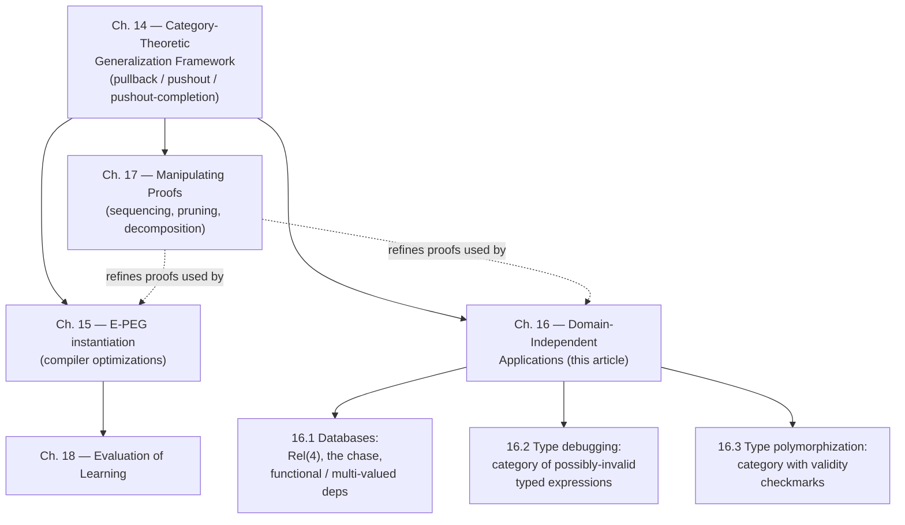

[[book-guidelines|↩ Back to guidelines]]

## Why this chapter exists at all

Everything up through Chapter 14 was built to solve one very specific problem: given a before/after pair of E-PEGs (Program Expression Graphs) and the sequence of axiom applications that proves them equal, find the *most general* rewrite rule for which that same proof still goes through. The machinery that does this — pullback, pushout, pushout completion, run backward one axiom at a time — was phrased entirely in the vocabulary of category theory: objects, morphisms, commuting squares. That phrasing was not decoration. It was the point.

The moment you can state "generalize a proof" as a categorical recipe rather than as an E-PEG-specific procedure, the recipe stops caring what an "object" or a "morphism" *is*. It only cares that your domain has objects, morphisms, a way to compute pullbacks and pushouts, and axioms expressible as identity-carried morphisms (Chapter 14's Diagram 14.3 shape: a sequence of objects connected by axiom-morphisms, ending at a "property" morphism you want to explain). Anything satisfying that interface gets proof generalization for free — the *same* three-step algorithm (pullback, then pushout, then pushout completion, iterated backward through the proof), with zero redesign.

Chapter 16 is Tate's demonstration that this isn't a hypothetical benefit. He picks three domains that have nothing to do with compilers — relational databases, Hindley-Milner type inference, and type-class polymorphism — encodes each one as a category, and gets useful, non-obvious results out of the unmodified Chapter 14 algorithm. This is the chapter's real payload for your project: it's a worked existence proof that "generalize backward through a proof of correctness" is a reusable primitive for *any* system built out of judgments and inference steps — which is exactly the shape a typing judgment, a Hoare-triple derivation, or a constraint-generation trace has.

**[[Loop-and-Branch-Optimizations-Discovered-by-Saturation#What breaks without this|What breaks without this]] generality:** if proof generalization had been defined operationally in terms of E-PEG node/operator structure (as an earlier, less abstract version of the technique might have been), none of what follows would transfer. You'd need to re-derive "what does removing an axiom's contribution mean" from scratch for databases, and again for type systems. The category-theoretic reformulation is precisely what makes that re-derivation unnecessary — the interface (pullback/pushout/pushout-completion over some category) is the only thing a new domain has to supply.

---

## 16.1 — Database query optimization

### The intuition first

A conjunctive query like $\exists y.\, R(x,y) \wedge R(y,z)$ asks: "find all $(x,z)$ such that some $y$ connects them through $R$." The book's key move is representing *the query itself* as a tiny database instance. Take

$$q := R(x,y,z,1) \wedge R(x', y, 0, 1)$$

This is represented as a two-row table $Q$:

| A | B | C | D |
|---|---|---|---|
| x | y | z | 1 |
| x'| y | 0 | 1 |

Running $q$ against a real database instance $I$ then corresponds exactly to finding a **relation-preserving, constant-preserving function from $Q$ into $I$** — i.e., a way to map $Q$'s variables to values in $I$ so that every row of $Q$ lands on an actual row of $I$, while literal constants (like the `1`s and `0` above) map to themselves. This is not an analogy; it is literally a homomorphism between relational structures, and it is *exactly* the categorical notion of morphism the rest of the chapter needs. Query answering becomes "find a morphism," which is why this domain slots into the categorical framework without friction.

The number of joins a query executor needs is one less than the number of rows in $Q$. So **shrinking $Q$'s row count is the optimization** — and that's what dependencies let you do.

### Dependencies, precisely

- A **functional dependency** $A \to C$ says: rows agreeing on column $A$ must agree on column $C$. This is an *equality-generating dependency* — applying it can only merge two values that a query mistakenly kept distinct.
- A **multi-valued dependency** $B \twoheadrightarrow A$ (equivalently $B \twoheadrightarrow CD$) says: for a fixed value of $B$, column $A$ varies independently of $C$ and $D$. Formally: $R(a,b,c,d) \wedge R(a',b,c',d') \implies R(a,b,c',d') \wedge R(a',b,c,d)$. This is a *tuple-generating dependency* — applying it can only **add** rows, never remove them, and added rows cost joins. It only pays off if it later unlocks an equality-generating dependency.

### The chase, worked

Starting from $Q$ above, apply $B \twoheadrightarrow A$ (adds a row), then $A \to C$ (merges columns now that the added row creates a matching pair on $A$):

$$
\begin{array}{c}
x\ y\ z\ 1\\
x'\ y\ 0\ 1
\end{array}
\;\xRightarrow{B \twoheadrightarrow A}\;
\begin{array}{c}
x\ y\ z\ 1\\
x'\ y\ 0\ 1\\
x\ y\ 0\ 1
\end{array}
\;\xRightarrow{A \to C}\;
\begin{array}{c}
x\ y\ 0\ 1\\
x'\ y\ 0\ 1
\end{array}
$$

The added tuple $(x,y,0,1)$ shares column $A=x$ with the original first row, so $A \to C$ forces $z = 0$ on that row — collapsing what would have been an unconstrained variable $z$ into the constant $0$. This is a genuine win: the optimizer can now filter on $C = 0$ *before* joining, which can be a massive pruning.

**This is the chase**: repeatedly apply equality-generating and tuple-generating dependencies until nothing new follows, treating the query itself as a database instance being saturated. If that phrase — "repeatedly apply inference steps to a representation until saturation, without destructively discarding intermediate structure" — sounds like *[[Equality-Saturation|equality saturation]] itself*, that's not a coincidence Tate calls out explicitly, but it's the same meta-pattern: additive, confluence-seeking, saturate-then-extract.

### What generalization adds on top

The chase above is a one-off computation for one specific query. Tate's actual contribution is applying Chapter 14's generalization algorithm to the *trace of a chase run* to learn a **new, reusable equality-generating dependency**. The category here is $\mathrm{Rel}(4)$ (4-ary relations with relation-preserving functions as morphisms). Each dependency becomes a morphism:

$$
A \to C:\quad
\begin{pmatrix}a & b & c & d\\ a & b' & c' & d'\end{pmatrix}
\xrightarrow{\ c,c' \mapsto \bar c\ }
\begin{pmatrix}a & b & \bar c & d\\ a & b' & \bar c & d'\end{pmatrix}
$$

Running the two-step chase above and then generalizing *backward through that proof* — pullback to isolate what the last axiom ($A\to C$) actually used, pushout-completion to strip away the specific structure of this particular example — yields the theorem

$$B \to C$$

directly, as a **new equality-generating dependency**, derived automatically from a single example run rather than hand-derived by a database designer. Future queries matching the shape "column $B$ determines column $C$" can now skip the intermediate tuple-generating step entirely. The chapter is explicit that this is a demonstration of framework flexibility rather than a production database technique, but notes that a database-theory colleague confirmed it as a genuinely promising research direction, not just a toy.

### Grounding

**Rust** — the chase-as-fixpoint-computation is exactly the kind of thing you'd implement as a worklist algorithm over a small in-memory relation:

```rust
#[derive(Clone, PartialEq, Eq, Hash)]
struct Row { a: Term, b: Term, c: Term, d: Term } // Term = Var(usize) | Const(i64)

enum Dependency {
    Functional { determines: Column, from: Column },       // equality-generating
    MultiValued { fixed: Column, independent: (Column, Column) }, // tuple-generating
}

fn chase(mut rows: Vec<Row>, deps: &[Dependency]) -> Vec<Row> {
    loop {
        let mut changed = false;
        for dep in deps {
            changed |= apply_dependency(&mut rows, dep); // union-find merge, or row insertion
        }
        if !changed { break; }
    }
    rows
}
```

The "generalize the chase trace" step is the part that has no obvious Rust analogue without building the categorical pullback/pushout machinery from Chapter 14 — which is the actual research contribution here, not the chase itself.

**Connection to your project's threads:** the chase over functional/multi-valued dependencies is structurally a **Constraint Satisfaction / Horn-clause propagation** procedure — each dependency is a Horn-like rule ("if these tuples hold, this equality or tuple follows"), and running it to a fixpoint is the same shape as CHC (Constrained Horn Clause) solving or Datalog evaluation. If your CSP kernel needs to reason about relational/structural domains (the "automata-grammar-as-domain" idea in your goals), the chase is a concrete, well-studied instance of exactly that: constraint propagation over a relational lattice, saturating rather than searching.

---

## 16.2 — Type debugging by generalizing backward through a typing proof

### The motivating failure mode

Hindley-Milner inference is notorious for blaming the wrong location. Tate's running example is Haskell:

```haskell
maxInRefList refs = case refs of
    []         -> Nothing
    ref : tail -> liftM2 max
                    (liftM Just (readSTRef ref))
                    (maxInRefList tail)
```

GHC reports: *"`readSTRef ref` has inferred type `ST s a` but is expected to have type `Maybe a`"* — pointing at `readSTRef ref`, which is not actually where the bug is. The real bug is that `Nothing` (a bare, non-stateful value) was never lifted into the `ST s` effect before being combined with values that *were* lifted — but nothing about the error message says that. **This is a debugging problem, not a type-checking problem**: type checking already told you *that* something's wrong; you need it to tell you *why*, tracing the actual causal chain of unifications, not just the syntactic location where the first contradiction surfaced.

### The categorical encoding

This is the part of the chapter your project should read most closely, because it is a direct, worked instance of treating **type inference itself as a proof in a category**, and then running proof generalization backward over it — which is precisely the operation an elaborator's diagnostics layer would want.

- **Objects**: typed expressions — a program expression plus a (possibly-invalid) map from subexpressions to types. Crucially, *"this map is not required to be a valid typing."* The category contains ill-typed states as first-class objects, not just successfully-checked ones. This is the trick that lets "why is this expression ill-typed" be phrased as a question with an answer, rather than a dead end.
- **Morphisms**: type-preserving substitutions of program and type variables, such that substituting into the source yields subexpressions of the target.
- **Typing rules become axioms**, i.e., specific morphisms. Function application:

$$
((f:\alpha)\,(x:\beta)):\gamma \xrightarrow{\ \alpha \mapsto (\beta \to \gamma)\ } ((f:\beta \to \gamma)\,(x:\beta)):\gamma
$$

  In words: applying this axiom is *literally performing the unification step* $\alpha := \beta \to \gamma$ that Hindley-Milner's algorithm W would perform. The polymorphic rule for `Nothing` (`α ↦ Maybe β`) and for `liftM` (`α ↦ (β→γ)→Mβ→Mγ`, where `M` ranges over unary type constructors) are given the same treatment — **each typing rule is a morphism that instantiates metavariables**.

### Backward generalization as root-cause analysis

The question "why does `readSTRef ref` need type `Maybe a`?" is posed as a morphism *from* the object `(x : Maybe ζ)`, mapping `x ↦ readSTRef ref` and `ζ ↦ a` — i.e., you start from the *property you want explained* and walk backward through the inference trace, at each step asking "did this axiom application contribute to this property?" Steps that didn't contribute are dropped automatically (no separate relevance analysis needed — this is a byproduct of running backward, a point Tate reuses in Chapter 17 for proof editing generally). Steps that did contribute get generalized: the `liftM Just (readSTRef ref)` application step reveals that only two properties actually matter — `liftM Just` having type $Ma \to M\delta$, and the application's result having type $\text{Maybe}\,\beta$ — everything else about that step is irrelevant and erased.

The output is a **skeleton program**, with irrelevant subexpressions replaced by `.`:

```
. = case . of
      . -> Nothing
      . -> liftM2 . (liftM . .) .
```

This pinpoints the two branches, the two lifting calls, and the bare `Nothing` as the *entire* causal explanation — which is enough for a programmer to see immediately that `Nothing` was never lifted into `ST s`. Note what this is doing structurally: it's producing a **minimal unsatisfiable core** of the typing derivation, the type-inference analogue of what an SMT solver's `unsat core` gives you for a failed constraint set.

### Grounding

**Lean** — this is the chapter's strongest fit for your Lean-first [[The-Peggy-Implementation#Grounding|grounding]] rule, because "typing rule as a metavariable-instantiating morphism, walked backward to explain a constraint" is *exactly* what Lean's elaborator's error-reporting and `isDefEq` machinery is trying to approximate when it produces (or fails to produce) a good error trace. In Lean terms:

- Tate's "object with a type-map that need not be valid" ≈ a partially-elaborated term with **metavariables** and pending unification constraints not yet solved (`isDefEq` calls queued but not discharged).
- Tate's axiom-as-morphism `α ↦ β → γ` ≈ a single **metavariable assignment** produced during elaboration of an application (`Lean.Meta.isDefEq` unifying an expected type against an inferred one, assigning a mvar).
- "Ask why property P holds, then walk backward dropping non-contributing steps" ≈ walking the **assignment/unification trace** backward from a failed or surprising constraint to find its minimal justifying subset — precisely the mechanism a good `trace.Meta.isDefEq` postmortem, or a hypothetical proof-term slicer, would need.

If you build the diagnostics layer for your dependent/refinement-type compiler's elaborator, this section is a direct blueprint: represent each unification step as a morphism with an explicit substitution, keep the *trace* of elaboration (not just its final substitution), and implement "explain this type error" as backward generalization over that trace rather than as a heuristic over surface syntax (which is what most compilers, including GHC here, actually do — and why they get it wrong).

**Rust** — the "object with possibly-invalid typing, morphism = substitution respecting the type map" is naturally a checker-side data structure:

```rust
struct TypedExpr {
    expr: Expr,
    types: HashMap<SubExprId, Type>,       // may be internally inconsistent
    // (validity checkmarks belong to §16.3, not here)
}

struct TypingStep {
    axiom: RuleId,
    subst: Substitution,   // e.g. { alpha: Type::Arrow(beta, gamma) }
    contributes_to: Vec<SubExprId>,
}
```

Recording `Vec<TypingStep>` alongside ordinary Hindley-Milner inference (algorithm W) gives you the trace that backward generalization needs — this is a small, worthwhile instrumentation to add to any unification-based checker whose error messages you care about.

---

## 16.3 — Automatic type polymorphization

### The idea

Take a monomorphic function:

```
int sum(l: int list, i: int) := foldr (+) i l
```

Now suppose the language grows a type class `Num`, and `+` becomes polymorphic over any `Num` instance. Rather than have a programmer manually re-derive which of `sum`'s uses of `+` generalize, **generalize the proof that `sum` type-checks at `int`**, and read off the weakest type constraint under which that same proof still works.

### The categorical encoding — validity checkmarks

This section reuses §16.2's category but adds one ingredient: objects now carry a **validity predicate** on subexpressions — a checkmark ✓ — and morphisms must *preserve* which subexpressions are marked valid (not just the type map). Concretely, `(x:✓int + y:int):int` means `x`, `y`, `x+y` are all typed `int`, but only `x`'s typing is *known valid so far*. Inference starts with a fully-typed-but-uncheckmarked object and each step *adds* a checkmark — so a completed derivation is the object with every subexpression checkmarked.

A general typing rule

$$
\dfrac{e_1:\tau_1 \quad e_2:\tau_2}{P[e_1,e_2]:\tau_3} \;\text{(P-rule)}
$$

becomes the axiom: from $P[e_1{:}✓\tau_1,\, e_2{:}✓\tau_2] : \tau_3$ (premises checkmarked, conclusion not) to $P[e_1{:}✓\tau_1,\, e_2{:}✓\tau_2] :✓ \tau_3$ (conclusion now checkmarked too). This is a clean encoding of **bidirectional-style propagation**: checkmarking a node is exactly "this subexpression's type is now trusted / has been checked," and an axiom fires only once its premises are trusted — the same discipline a bidirectional type checker enforces between its `infer` and `check` modes, made explicit as a monotone property (checkmarks only get added, never removed) instead of left implicit in the control flow of a checker function.

### Working the example

Typing `sum`'s body concretely at `int` produces the fully-checkmarked object

$$(\text{foldr}\ (+{:}✓\,\text{int}\to\text{int}\to\text{int})\ (i{:}✓\,\text{int})\ (l{:}✓\,\text{int list})){:}✓\,\text{int}$$

via two axiom applications: the `plus` axiom (now generalized to fire whenever `Num τ` holds, not per concrete numeric type) checkmarking `+`, and the `foldr` axiom checkmarking the whole expression. Generalizing this proof **backward** — asking "why is `foldr (+) i l : int` valid?", undoing `foldr` first, then undoing `plus` — produces:

$$(\text{foldr}\ (+{:}\tau\to\tau\to\tau)\ (i{:}✓\,\tau)\ (l{:}✓\,\text{list}\ \tau)){:}\tau \quad \text{where } \text{Num}\ \tau$$

i.e. the concrete instantiation `int` has been replaced everywhere by a fresh type variable $\tau$, constrained only by the side condition that made the `plus` axiom fire: $\text{Num}\ \tau$. Reading this back as a signature: `∀τ ∈ Num. τ sum(list τ, τ)`. The function has been automatically polymorphized to exactly the constraint its proof actually needed — not "as polymorphic as possible" by some syntactic heuristic, but "as polymorphic as this specific correctness proof licenses," which is the same maximal-generality guarantee Chapter 14 proves for E-PEG rewrite-rule learning.

### Grounding

**Lean** — "generalize a concrete instantiation type $\tau_0$ into a metavariable $\tau$ constrained by a typeclass side-condition, by walking backward through which typeclass instance search actually fired" is close to how Lean generalizes a concrete elaborated term when you ask it to produce a more general statement — instance-implicit arguments (`[Num τ]`) are exactly the checkmark-style side condition Tate's `Num τ` constraint corresponds to, discovered post hoc from the proof rather than declared up front.

**Rust** — the checkmark-propagation structure maps naturally onto a typestate-style validity marker if you were building this as an actual pass:

```rust
enum Validity { Unchecked, Checked }

struct Node { ty: Type, validity: Validity }
// an axiom application is a function Node -> Node that requires
// its premises' validity == Checked and sets its own to Checked
```

**Load-bearing note for your project:** this section is the most direct precedent in the whole thesis for **constraint-based refinement-type inference** — "start from a concrete proof, generalize backward to the weakest constraint under which it still holds" is structurally the same move as inferring the weakest refinement predicate (a Horn-clause / CHC-style side condition, analogous to `Num τ` here) that makes a Hoare-triple derivation go through, rather than fixing the refinement up front. If your compiler's constraint generator produces a concrete verification-condition proof for one example and you want to *generalize* it into a reusable refinement schema, this section — not §16.1 or §16.2 — is the closest structural template in the thesis.

---

## Where this leads



**What this depends on:** every result here is a direct corollary of Chapter 14's abstract algorithm — none of the three applications required extending or modifying the pullback/pushout/pushout-completion recipe. The only per-domain work was defining the category (objects, morphisms, and how axioms become identity-carried morphisms) — for databases, relations and relation-preserving maps; for type debugging and polymorphization, typed expressions and type/validity-preserving substitutions.

**What depends on this:** Chapter 17's proof-editing techniques (sequencing axiom applications via coproducts, automatically dropping irrelevant steps, decomposing proofs at cut points) apply uniformly to *any* of these categories, not just E-PEGs — the backward-generalization-drops-irrelevant-steps behavior you saw explicitly in §16.2 is the general phenomenon Chapter 17 formalizes. Chapter 18's evaluation is scoped to the E-PEG/compiler instantiation specifically, so it doesn't directly measure these three applications — they remain, by the thesis's own framing, a breadth demonstration rather than a benchmarked system.

**For your standing project:** this chapter is best read as a case study in the reusability discipline you want from your own elaborator and CSP kernel — separate the *domain-independent search/generalization algorithm* from the *domain-specific interface it needs* (here: "give me pullbacks, pushouts, pushout completions over your category"), and non-trivial cross-domain reuse falls out for free. §16.2 in particular is close to a reference design for elaborator diagnostics: keep the unification/elaboration trace as a first-class object (not just its final substitution), and implement "explain this error" as backward generalization over that trace. §16.3 is close to a reference design for inferring refinement constraints from a single concrete verification-condition proof rather than guessing them up front. §16.1's chase is a smaller but still useful data point: a concrete instance of Horn-clause-style constraint propagation to fixpoint, relevant if your CSP kernel needs relational/structural domains beyond numeric ones.
