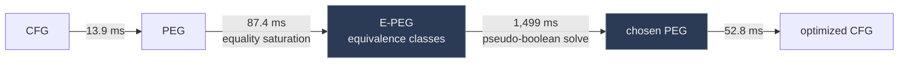
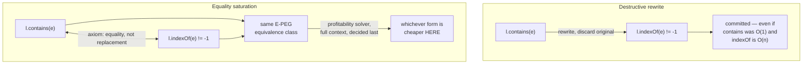

[[book-guidelines|↩ Back to guidelines]]

# Empirical Evaluation of Optimization

## Why this chapter has to exist

Everything up through Chapter 10 of the thesis is a *design argument*: Program Expression Graphs (PEGs) let you represent a function as a pure value, [[Equality-Saturation|equality saturation]] lets you accumulate equivalent forms of that value instead of committing to one destructive rewrite at a time, and a global profitability heuristic picks the best member of the resulting equivalence class only at the very end. That argument is elegant, but elegance is not evidence. Three concrete things could sink it even if the theory is sound:

1. **Cost.** Saturation explores an exponential space of equivalent programs. If building and searching that space takes too long or too much memory, the technique is a curiosity, not a compiler pass.
2. **Payoff.** Even if it's affordable, does saturation actually *find* anything useful — the standard optimizations a hand-written pass would find, and (more interestingly) optimizations nobody explicitly programmed for?
3. **Safety of the "additive" premise.** The entire pitch of equality saturation over rewrite systems is "add equalities, never delete information, decide at the end." Is that actually necessary, or is it a nice-to-have that a good enough destructive rewriter could match?

Chapter 11 answers all three with the **Peggy** implementation running against **SpecJVM** (2,461 Java methods) plus a hand-built ray-tracer and design-pattern micro-benchmarks. This is the empirical chapter — the numbers here are the book's own, not illustrative estimates, and they're worth preserving exactly because the whole thesis's practical claim rests on them.

---

## 1. Time and space overhead (§11.1)

### The measurement setup

Peggy's pipeline for a method has four phases: convert the method's CFG into a PEG, run equality saturation, run a pseudo-Boolean solver (the thesis calls it "Pueblo") to pick the best equivalent PEG under [[The-Peggy-Implementation#The cost model|the cost model]], then convert back to a CFG. Each phase is timed separately, averaged per method over all 2,461 SpecJVM methods:

| Phase | CFG → PEG | Saturation | Pueblo (solver) | PEG → CFG |
|---|---|---|---|---|
| Time | 13.9 ms | 87.4 ms | 1,499 ms | 52.8 ms |

Total: **a bit over 1.5 seconds per method**, and the pseudo-Boolean solver alone accounts for roughly 88% of that. Saturation itself — the part with the scary "exponentially many equivalent programs" reputation — is *cheap*: under 90ms on average. The expensive part is picking a winner out of what saturation built, not building it.

This is a genuinely important empirical finding independent of the raw numbers: **the profitability search, not the equational reasoning, is the bottleneck.** If you were designing a system in this family today, that tells you where to spend your engineering effort — a faster or approximate solver, not a faster congruence closure.

For scale, an end-to-end Peggy run averages **6× slower than Soot** running all of its intraprocedural optimizations. That's a real cost, but it's a compile-time cost paid once, and the thesis explicitly flags it as unoptimized engineering ("we have not focused our efforts on compile time") rather than a fundamental limit of the approach.

### Space: does it actually explode?

Peggy was capped at a 200MB JVM heap and compiled *all* of SpecJVM without running out of memory — so the "exponentially many programs in one structure" idea is not just theoretically compact, it's practically compact (this is the direct payoff of PEGs being a graph with sharing, not an explicit enumeration).

Saturation was also bounded: it stops either when no more equalities can be derived (**complete saturation**) or when an engine limit of 500 processed expressions is hit. The split:

- **84% of methods fully saturate** within the bound — no more equalities exist to add, full completeness guarantee.
- The remaining 16% hit the 500-expression limit. For these, Peggy can't guarantee completeness, but it can still report how much was explored: **using only 200MB of heap, the E-PEGs represented more than $2^{103}$ versions of the input program** (geometric average).

That number is worth sitting with. $2^{103}$ is astronomically larger than anything an explicit worklist of "candidate optimized programs" could ever hold in memory — and this is exactly the empirical payoff of representing equivalence *structurally* (shared PEG nodes + union-find-like equivalence classes) instead of *extensionally* (a list of concrete programs). A destructive rewrite system exploring the same space one program at a time would need to materialize each of those $2^{103}$ variants; equality saturation represents them all through node sharing and never has to.

**[[Loop-and-Branch-Optimizations-Discovered-by-Saturation#What breaks without this|What breaks without this]].** If PEGs didn't share structure — if each equality asserted a wholly new copy of the affected subgraph rather than merging into an equivalence class — this 200MB number would instead be however-many-bytes-per-program times an intractable count of programs. The practicality result is inseparable from the *representation* choice (E-PEGs as e-graphs of PEG nodes), not just the saturation *algorithm*.

---

## 2. A three-tier taxonomy of what saturation finds (§11.2)

The chapter's second half addresses payoff: given that saturation is affordable, what does it actually produce? The thesis organizes this into three tiers, and the tiering itself is the interesting methodological move — it separates "what you feed in" from "what falls out," which is precisely the phenomenon that distinguishes equality saturation from a hand-written optimizer.

### Tier 1 — the ingredients: basic equality analyses

Seven kinds of axioms were implemented (Figure 11.1(a) in the source):

1. **Built-in E-PEG operator axioms** — facts about the primitive PEG constructs themselves: $\phi$ (branch merge), $\theta$ (loop-carried value), `eval`, `pass`.
2. **Basic arithmetic** — axioms about `+`, `-`, `*`, `/`, `<<`, `>>` (associativity, distributivity, identities, etc.).
3. **Constant folding** — equating a constant expression with its computed value.
4. **Java-specific axioms** — field and array access semantics.
5. **Tail-recursion elimination** — replacing a tail-recursive method body with a loop.
6. **Method inlining** — driven by intraprocedural class analysis.
7. **Domain-specific** — user-supplied axioms about the application's own abstractions (this is the tier this chapter spends the most narrative effort on, in §2.3 below).

None of these is individually surprising — they read like a checklist a compiler-optimizations course would hand you.

### Tier 2 — emergent optimizations (analyses 1–6 only)

Here's the finding that matters most for evaluating the *architecture*, not just the implementation: the thesis authors did **not** program a copy-propagation pass, a common-subexpression-elimination pass, a loop-peeling pass, or a loop-induction-variable-strength-reduction pass. They implemented the seven basic equality analyses above, ran Peggy over SpecJVM and other benchmarks, and then *manually inspected the output* to catalogue what optimizations had happened. Figure 11.1(b)'s list (their numbering, 8–20) includes, among others:

- Constant propagation and folding
- Algebraic simplification, peephole strength reduction
- Array copy propagation, CSE for array reads
- Loop peeling, loop-induction-variable strength reduction (LIVSR)
- Entire-loop strength reduction (turning $n$ increments into "plus $n$")
- Loop-operation factoring and distribution
- Partial inlining
- Polynomial factoring

Every one of these is a *combination effect* — it results from several of the seven basic axioms interacting, in an order Peggy itself discovers by search rather than one a human declared. This is the chapter's central architectural claim, stated almost verbatim: *"with our approach these optimizations fall out from the interaction of basic equality analyses without any additional developer effort, and without specifying an order in which to run them. Essentially, Peggy finds the right sequence of equality analyses to apply."*

This directly answers Key Question 2 from the guidelines: the value proposition of saturation-based architecture over hand-written passes is not just "fewer passes to write" — it's that a fixed, small axiom set exposes a combinatorially larger set of optimizations than the axiom count would suggest, *for free*, because saturation searches the composition space that a fixed pass pipeline (with its phase-ordering problem) cannot.

### Tier 3 — domain-specific optimizations (analyses 1–7, adding user axioms)

Adding tier-1's axiom 7 — arbitrary user-supplied domain axioms — unlocks a further list (Figure 11.1(c), items 21–28): domain-specific LIVSR (e.g., matrix addition/multiplication), domain-specific code hoisting and CSE justified by domain invariance axioms, temporary-object removal, math-library specialization, design-pattern-overhead removal, method outlining, and specialized call redirection.

---

## 3. Two worked case studies

### Ray-tracer deforestation

A 5-KLOC ray tracer, written in a "pure" style with immutable vector objects (each vector operation allocates a new vector rather than mutating). This is clean code, but it produces heavy intermediate-object churn — the classic cost of point-free/pure-functional style in a language without a fusion-capable optimizer.

With a **few simple vector axioms** — relating vector getters, fields, and arithmetic — Peggy performs a form of **deforestation**: it eliminates the intermediate vector objects entirely. Result: **7% faster**, and **40% fewer allocated objects**. Soot, even with interprocedural optimizations enabled, recovers *none* of this overhead — because deforestation isn't in its pass vocabulary at all; it would require someone to write a domain-specific fusion pass for exactly this vector-object idiom. In Peggy, it's a byproduct of a handful of axioms plus the same generic saturation-and-select machinery used for everything else.

[[Domain-Independent-Applications-of-Generalization#Grounding|Grounding]] this in Rust terms: imagine a `Vec3` type where every method (`add`, `scale`, `dot`, `.x()`) allocates. A destructive rewrite pass fusing `a.add(b).x()` into `a.x() + b.x()` is exactly the kind of peephole rule a Rust MIR optimization pass could hand-write — but you'd need one rule per fusible method combination, discovered and maintained by hand. Peggy instead states `(a.add(b)).x() = a.x() + b.x()` once, as one axiom among many, and lets saturation compose it with everything else already in the E-PEG (constant folding, CSE, inlining) automatically.

### `contains`/`indexOf`: the safety argument, worked concretely

This is the chapter's most important case study for understanding *why* the additive approach exists at all, and it directly answers Key Question 1.

The idiom: check `list.contains(e)`, then inside the branch call `list.indexOf(e)`. Written cleanly, this performs the same linear search twice. The "obviously correct" fix a rewrite-rule system would apply:
$$
\texttt{l.contains(e)} \;\longrightarrow\; \texttt{l.indexOf(e)} \neq \texttt{-1}
$$
as a **destructive** rewrite: replace every occurrence of `contains` with the `indexOf`-based check, unconditionally.

**Why that's unsafe as a destructive rule:** some `List` implementations (a hash-backed one, say) implement `contains` in $O(1)$ or $O(\log n)$, while `indexOf` is necessarily $O(n)$ (it has to report a *position*, which a hash set can't give you for free). A destructive rewrite that always turns `contains` into `indexOf() != -1` would be a **pessimization** on exactly those implementations, and the rewrite system has already thrown away the original `contains` call by the time anyone could notice.

**What equality saturation does instead:** the axiom
$$
\texttt{l.contains(e)} \;=\; \texttt{l.indexOf(e)} \neq \texttt{-1}
$$
is added as an *equality*, not a *replacement*. Both forms coexist in the same E-PEG equivalence class after saturation. The profitability heuristic — the pseudo-Boolean solver from §11.1, running once at the very end with the *entire calling context* visible — picks whichever form is actually cheaper given everything else in the method. Concretely: if the surrounding code *also* needs `indexOf(e)`'s result (the common idiom this whole example is about), the solver sees that `indexOf` will be computed anyway and picks the fused `indexOf() != -1` form — recovering the hand-optimized code programmers write by hand. If nothing else needs the index, and the list happens to have a cheap `contains`, the solver can just as easily keep `contains`.

The general principle, stated plainly: **destructive rewriting must commit to a local decision before it can see whether that decision is globally profitable; additive saturation can defer the decision until the entire context is visible, because it never destroys the alternative.** This is not a minor implementation convenience — it's the load-bearing reason equality saturation's "add, never delete" discipline exists as a design principle rather than an optimization detail. A traditional extensible-rewrite-rule system, per the thesis's own words, "would not be able to provide the same easy solution" — any single global rewrite direction is wrong in *some* context.

### The general safety principle

The thesis generalizes from `contains`/`indexOf` to a broader point about the entire domain-specific-axiom mechanism: because axioms only *add* equalities, a user (or library author) can contribute an axiom without needing to reason about:

- what order it should run in relative to other axioms/passes, or
- how it interacts with the compiler's other internal optimizations.

Both of those are exactly the failure modes that make hand-written optimizer passes fragile and hard to extend safely — the classic **phase-ordering problem**. Equality saturation sidesteps it structurally: an axiom that's locally "wrong" in some contexts is harmless, because it's never forced to win; it just becomes one more option the solver may or may not choose. Safety here is a property of the *architecture* (additive assertions + deferred global choice), not of individually vetting every axiom for when it's safe to apply.

---

## Where this leads

**Depends on:** the PEG/E-PEG representation and the saturation engine from earlier chapters (the thing being measured here), and the pseudo-Boolean profitability solver introduced alongside the optimizer architecture — this chapter is where that solver's cost is actually quantified (88% of runtime) and where its *purpose* (deciding among additively-preserved alternatives with full context) is shown to matter, not just assumed.

**Feeds forward:**
- **Appendix A (Axioms, pp. 233–243)** is the full catalogue of exactly the axioms exercised here — general-purpose (built-in E-PEG ops, arithmetic, Java-specific) and domain-specific (vector, design-pattern, read-only, inlining, specialization) axioms, organized by the same taxonomy this chapter uses informally.
- **Chapter 12 ([[Translation-Validation|Translation Validation]])** reuses the same saturation machinery for a different question (equivalence-checking instead of optimization-search) and reports its own empirical validation (98% success rate against Soot, a real bug found) — this chapter is the template for "empirically validate a saturation-based technique" that Chapter 12 repeats.
- **Chapter 13 ([[Learning-Optimizations-from-Proofs|Learning Optimizations from Proofs]])** is partly motivated by this chapter's tier-3 finding: domain-specific axioms are valuable but currently hand-written; Chapter 13's proof-generalization technique is a way to *derive* new axioms like the vector or `contains`/`indexOf` ones automatically from a single before/after example, rather than requiring an expert to notice and state them.

### Note on the standing learning-goals project

This chapter is squarely an *empirical validation* chapter, not a mechanism chapter, so it doesn't teach new judgment forms, unification, or constraint-solving machinery directly. But it does bear on the verification/compiler project in one specific, transferable way worth flagging: the `contains`/`indexOf` argument is a clean illustration of a principle that generalizes past optimization into **verification-condition generation and CEGAR-style refinement**. A refinement-type checker or Horn-clause solver built on a destructive simplification strategy for candidate invariants faces the identical trap — simplifying (or discarding) a candidate invariant/verification-condition form too early, before global context (the rest of the proof obligations) is available, can silently throw away the one form that would have let a downstream SMT/CHC solver close the proof. The equality-saturation answer — represent all equivalent forms simultaneously via an e-graph-like structure, defer the "which form is useful" decision until a solver has full context — is exactly the design pattern underlying modern **e-graph-based equality saturation for term rewriting inside SMT preprocessing and invariant simplification**, and is worth keeping in mind as a candidate architecture for the CSP/abstract-interpretation kernel's own constraint-simplification layer, rather than a fixed-order simplification pipeline.
