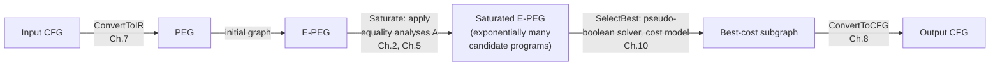

[[book-guidelines|↩ Back to guidelines]]

# Equality Saturation

## The problem: optimizations that fight each other

Start from a concrete failure mode, because the whole chapter is a response to it.

A classic compiler optimization pass is *destructive*: it looks at a piece of IR, decides a rewrite applies, and **replaces** the old form with the new one. The old form is gone. This is fine in isolation, but a compiler runs dozens of these passes, and passes interact. Consider the peephole rule

$$i * 5 = (i \ll 2) + i$$

Taken alone this looks like a strict improvement — a multiply becomes a shift and an add. But suppose `i * 5` sits inside a loop where `i` is only ever incremented, so a smarter optimization — **loop-induction-variable strength reduction** — could instead replace `i * 5` entirely with a separately-incremented accumulator, eliminating the multiplication altogether:

```
i := 0;                     i := 0;
while (...) {                while (...) {
   use(i * 5);                  use(i);
   i := i + 1;                  i := i + 5;
   if (...) { i := i + 3; }     if (...) { i := i + 15; }
}                             }
```

If the compiler runs the peephole rule first, `i * 5` no longer exists as a syntactic pattern — it's been destructively rewritten to `(i << 2) + i` — so the strength-reduction pass, which pattern-matches on multiplication, never fires. A locally "obviously good" rewrite has **destroyed information** that a later, more powerful optimization needed. This is the **phase-ordering problem**: the quality of generated code depends on the order passes run in, no single order is best for every program, and reasoning about all pairwise (and higher-order) interactions between passes doesn't scale.

The thesis's answer is to stop deleting information. Instead of *rewriting* $a$ into $b$, an optimization *adds the fact* that $a = b$ to a shared representation that still contains both. Nothing is ever thrown away until the very end, when a separate step picks the best of everything that's been proven equal. This is **equality saturation**, and Chapter 2 introduces it through the running strength-reduction example above; Chapter 5 gives it a precise, implementation-independent formal shell.

**[[Loop-and-Branch-Optimizations-Discovered-by-Saturation#What breaks without this|What breaks without this]]:** without additivity, a compiler writer must either (a) hand-tune a pass ordering and hope it generalizes across programs (it provably doesn't — Whitfield and Soffa's empirical result, cited in the text, is that enabling/disabling interactions vary program to program), or (b) iterate passes to a fixpoint, which still cannot undo a destructive rewrite already applied by an earlier pass in the same fixpoint loop.

## Optimizations as additive equality analyses

The representation that makes this practical is the **E-PEG** — a Program Expression Graph (PEG; see the companion PEGs article) whose nodes are grouped into equivalence classes of provably-equal expressions. Where a PEG has one canonical node per subcomputation, an E-PEG merges nodes that have been shown equal, drawn conventionally with a dashed edge between them. Since PEGs are referentially transparent (an expression's value depends only on the values of its children, never on when or how many times it's evaluated), *equal subexpressions are freely interchangeable anywhere in the graph* — this is exactly what license you need for "merge these two nodes" to be a sound operation rather than a hazardous one.

An **optimization**, in this framework, is not a transformation of the graph — it is a fact-producing procedure called an **equality analysis**. Structurally, an equality analysis has two parts:

- a **trigger**: an expression pattern describing what shape of subgraph the analysis cares about;
- a **callback**: a function invoked whenever the trigger pattern is matched somewhere in the E-PEG, which adds new equalities (and, if needed, new nodes) to the graph.

The simplest equality analyses are just axiom instantiations — e.g. trigger on $a * 0$, callback adds the equality $a * 0 = 0$. But the mechanism is strictly more general than "declarative rewrite rule with a formula on each side": the thesis notes it has also been used to implement inlining, tail-recursion elimination, and constant folding — anything expressible as "when you see this pattern, you may assert this equality" fits.

A **saturation engine** runs continuously: it watches all registered triggers simultaneously across the whole E-PEG, and whenever one fires, invokes the associated callback, which may itself expose new patterns for other triggers (this cascading is the "communication between equality analyses" the text describes — one axiom's added node becomes another axiom's new trigger match). The engine runs until either no analysis can add anything new, or a processing bound is hit.

For loop-induction-variable strength reduction, the entire causal chain is three axioms:

$$(a + b) * m = a * m + b * m \tag{2.1}$$
$$\theta(a, b) * m = \theta(a * m,\, b * m) \tag{2.2}$$
$$\phi(a, b, c) * m = \phi(a,\, b * m,\, c * m) \tag{2.3}$$

— distributivity of multiplication over addition, over the loop node $\theta$, and over the gated-select node $\phi$ — plus ordinary constant folding. Each firing adds nodes and dashed equality edges; nothing removes the original `i * 5` node from the graph. In the thesis's worked example, four applications of these axioms (edges labeled A–D in Figure 2.2) together with constant folding ($0*5=0$, $3*5=15$, $1*5=5$) saturate the E-PEG into a representation that simultaneously encodes **128 distinct ways** of expressing the original program — because it encodes 7 independent binary equality choices ($2^7 = 128$), all sharing structure in a single graph of size linear (not exponential) in the number of distinct sub-results.

**[[Domain-Independent-Applications-of-Generalization#Grounding|Grounding]] — Rust.** The trigger/callback shape is naturally a listener pattern over a union-find-backed graph:

```rust
struct EPeg {
    nodes: Vec<Node>,          // operator + children (may reference eclass ids)
    eclasses: UnionFind,       // merges node ids into equivalence classes
}

trait EqualityAnalysis {
    /// Does this eclass (or local pattern) match my trigger?
    fn matches(&self, epeg: &EPeg, node_id: NodeId) -> bool;
    /// Fire: add new nodes/equalities to the E-PEG. Never deletes anything.
    fn fire(&self, epeg: &mut EPeg, node_id: NodeId);
}

fn saturate(epeg: &mut EPeg, analyses: &[Box<dyn EqualityAnalysis>], budget: usize) {
    let mut processed = 0;
    let mut worklist: Vec<NodeId> = epeg.all_node_ids();
    while let Some(n) = worklist.pop() {
        if processed >= budget { break; }
        for a in analyses {
            if a.matches(epeg, n) {
                let before = epeg.eclasses.snapshot();
                a.fire(epeg, n);
                // any freshly touched eclasses go back on the worklist
                worklist.extend(epeg.eclasses.changed_since(&before));
                processed += 1;
            }
        }
    }
}
```

Note what's *absent*: there is no `remove_node`, no "replace this subtree." `fire` is monotone by construction — it can only call `union` (merge equivalence classes) or `insert` (add a node). This is the additivity property made concrete at the API level; a well-typed `EPeg` API simply doesn't expose a destructive operation, so the invariant is enforced by the type signature, not by discipline.

## The `Optimize` pipeline: conversion, saturation, selection, reversion

Chapter 5 packages the whole approach into one four-step function, deliberately stated abstractly over *any* IR with the right properties (later chapters instantiate it concretely with PEGs/E-PEGs):

$$
\begin{aligned}
&\textbf{function } \mathsf{Optimize}(cfg : \mathrm{CFG}) : \mathrm{CFG} \\
&\quad \mathsf{let}\ ir = \mathsf{ConvertToIR}(cfg) \\
&\quad \mathsf{let}\ saturated\_ir = \mathsf{Saturate}(ir,\ A) \\
&\quad \mathsf{let}\ best = \mathsf{SelectBest}(saturated\_ir) \\
&\quad \mathsf{return}\ \mathsf{ConvertToCFG}(best)
\end{aligned}
$$

where $A$ is a fixed global set of equality analyses. Four cleanly separated stages:

1. **Conversion** — `ConvertToIR`: translate the imperative CFG into the equality-friendly representation (a PEG). This is the subject of a later chapter and is the hard, semantics-preservation-requiring direction.
2. **Saturation** — `Saturate(ir, A)`: run every equality analysis in $A$ to a fixed point or a bound, exactly as described above. This is where *all* the optimization reasoning happens.
3. **Selection** — `SelectBest`: a **global profitability heuristic** picks one concrete program out of the saturated (exponentially-multi-valued) representation. In [[The-Peggy-Implementation|the Peggy implementation]] this is a pseudo-boolean solver (an ILP solver with 0/1-constrained variables) minimizing a static per-node cost model over the choice of one representative node per live equivalence class.
4. **Reversion** — `ConvertToCFG`: translate the selected PEG subgraph back into imperative CFG form (loops, branches, sequenced statements) — the reverse direction, and considerably harder than conversion, since a graph without an explicit control-flow representation must be "read off" back into one.

The crucial architectural point is that stages 2 and 3 are *strictly separated*: nothing in `Saturate` makes a profitability decision, and nothing in `SelectBest` adds new equalities. All the informed decision-making happens after all information has been gathered — this is precisely what a per-pass, order-dependent local heuristic *cannot* do, because at pass-execution time it doesn't yet know what later passes could exploit downstream.

## Monotonicity and the additivity property

Chapter 5 formalizes "optimizations only add information" as a property of a partial order $\sqsubseteq$ over IRs. For E-PEGs, $ir_1 \sqsubseteq ir_2$ means the nodes of $ir_1$ are a subset of the nodes of $ir_2$, and the equalities of $ir_1$ are a subset of the equalities of $ir_2$ — i.e. $ir_2$ knows at least everything $ir_1$ knew, and possibly more.

Write $ir_1 \xrightarrow{a} ir_2$ to mean "equality analysis $a$, run on $ir_1$, can produce $ir_2$" (non-deterministic: $a$ may have a choice of *where* to apply, e.g. distributivity could fire at any of several multiplication nodes, and different choices are all valid instances of "$a$ applies"). The **additivity property** is:

$$(ir_1 \xrightarrow{a} ir_2) \implies ir_1 \sqsubseteq ir_2 \tag{5.1}$$

This is the formal statement of "equality analyses never destroy information" — every single analysis application can only move up the information order.

Additivity alone isn't enough to make the *pipeline order-independent*, though — it just says each step doesn't lose ground. You also need a guarantee about what happens when analyses are interleaved in different orders. That's **monotonicity**: an equality analysis $a$ is monotonic iff

$$(ir_1 \sqsubseteq ir_2) \land (ir_1 \xrightarrow{a} ir_1') \implies \exists ir_2'.\ (ir_2 \xrightarrow{a} ir_2') \land (ir_1' \sqsubseteq ir_2') \tag{5.2}$$

In words: if $a$ can fire on the smaller IR $ir_1$ to produce $ir_1'$, then $a$ can *also* fire on any larger (more-informed) IR $ir_2 \sqsupseteq ir_1$, producing something $ir_2'$ that dominates $ir_1'$. Applying $a$ to a graph that already knows more never gives you *less* than applying $a$ to a graph that knows less. Combined with additivity, this immediately yields:

$$(ir_1 \xrightarrow{a} ir_1') \land (ir_1 \xrightarrow{b} ir_2) \implies \exists ir_2'.\ (ir_2 \xrightarrow{a} ir_2') \land (ir_1' \sqsubseteq ir_2') \tag{5.3}$$

— running $b$ before $a$ can never make $a$ *less effective* than running $a$ first. This is the formal core of "phase ordering doesn't matter here": no equality analysis can ever be disabled by having run another one first, because every analysis is monotonic with respect to $\sqsubseteq$, and $\sqsubseteq$ only ever grows.

## Uniqueness of normal form: confluence

Define a **normal form**: $ir_2$ is a normal form of $ir_1$ if $ir_1 \xrightarrow{*} ir_2$ (some sequence of analysis steps gets you there) and no analysis applies to $ir_2$ anymore (nothing further can fire).

Given a set $A$ of monotonic equality analyses, the thesis states (5.4):

> if $ir_2$ is a normal form of $ir_1$, then any other normal form of $ir_1$ is equal to $ir_2$.

This is exactly **confluence** in the term-rewriting sense (the diamond property lifted to a lattice-ordered system) — but note the proof strategy differs from a typical local-confluence-implies-global-confluence (Newman's Lemma) argument. Here it falls directly out of monotonicity: if two different orderings of analysis applications each reach a normal form, property (5.3) guarantees each ordering's intermediate results remain comparable-or-mergeable under $\sqsubseteq$, so both dead ends must actually be the *same* maximal element. If the saturation engine terminates on some input at all, **it doesn't matter which trigger fired first, or in what order callbacks ran** — you always land on the identical saturated E-PEG. This is the theorem that retroactively justifies calling the earlier claim "optimization order is irrelevant" more than a slogan: it's a proven fixed-point uniqueness result, conditioned only on every analysis in $A$ being monotonic (which, since every analysis is additive-only by construction — no deletion primitive exists — is easy to establish per-analysis).

## Non-termination and bounding the search

Confluence (5.4) is conditional on reaching *a* normal form — but saturation is not guaranteed to terminate. The thesis gives two direct examples:

- The axiom $A = (A + 1) - 1$, read left-to-right, can fire indefinitely: $x \to (x{+}1){-}1 \to (((x{+}1){-}1){+}1){-}1 \to \dots$, producing unboundedly larger (but semantically identical) expressions forever.
- Inlining a recursive function's call site can be applied without bound, unrolling the recursion arbitrarily deep in the E-PEG.

Since unrestricted saturation may simply never reach a normal form, Peggy bounds the number of expressions each analysis is allowed to process, guaranteeing `Saturate` always halts. This costs you the clean uniqueness theorem (5.4) — a truncated run isn't guaranteed to hit the *same* state regardless of order — but property (5.3) still gives a weaker, still-valuable guarantee: **no region of the search space is ever made permanently unreachable by having applied some other analysis first.** Truncating the search can make you miss an optimization for resource reasons, but it can never make a destructive-style "wrong turn" the way ordered rewriting can. That asymmetry — bounded-but-safe vs. unbounded-but-fragile — is the practical tradeoff the whole formalism buys you.

**Grounding — Python**, the shape of the [[The-Peggy-Implementation#Termination|termination]]/monotonicity distinction in miniature (a toy union-find-style saturation loop with a hard cap, standing in for Peggy's expression-count bound):

```python
def saturate(graph, rules, max_applications=10_000):
    applied = 0
    changed = True
    while changed and applied < max_applications:
        changed = False
        for rule in rules:
            for match in rule.find_matches(graph):
                if rule.apply(graph, match):   # only ever merges/adds
                    changed = True
                    applied += 1
                    if applied >= max_applications:
                        return graph  # bounded, not necessarily normal-form-unique
    return graph  # reached a true fixed point: unique normal form (thm 5.4)
```

The `return` inside the loop is exactly the non-termination escape hatch; the `return` after the loop is the case where (5.4) actually applies.

## Elimination of the phase-ordering problem, revisited formally

Section 2.3's narrative example ($i * 5 = (i \ll 2) + i$ disabling strength reduction under destructive rewriting) is now literally an instance of what (5.1)-(5.3) rule out. Encode the peephole rule as an equality analysis $a$ with trigger $x * 5$ and callback "add equality $x * 5 = (x \ll 2) + x$." Because $a$ only *adds* the equality — the node for $x * 5$ remains in the E-PEG, in its own equivalence class merged with the new shift-add node, rather than being replaced — the strength-reduction analysis $b$ (which pattern-matches on `θ(...) * constant`) can still trigger on the original multiplication node regardless of whether $a$ ran first, last, or interleaved. Property (5.3) is precisely the statement "$a$ running first cannot make $b$ less effective." The phase-ordering problem, as classically defined (Whitfield & Soffa: code quality depends on pass order because passes can disable each other), simply has no foothold in a system where disabling is structurally impossible.

## Global profitability over the saturated representation

Because `SelectBest` runs only after saturation is as complete as the bound allows, it is choosing among **fully-optimized** candidate programs rather than making an isolated local call. The thesis's example is inlining: a traditional inliner has to decide, at the call site, whether the direct cost (code bloat) outweighs the direct benefit (removed call overhead) — but the *indirect* benefit (what further optimizations inlining might unlock, e.g. exposing another instance of strength reduction inside the newly-inlined body) is invisible at decision time without an expensive inlining trial that must be run per-candidate and doesn't compose across multiple simultaneous inlining decisions (exponential blowup in outcomes to separately compile).

In equality saturation, inlining is just another equality analysis: it adds the equality "call site = function body instantiated with actual arguments," leaving both the call and the inlined form present and further optimizable in the same E-PEG. `SelectBest` then chooses, with full knowledge of everything both versions could become after saturation, whether the inlined or non-inlined form is cheaper — the decision that used to require exponentially many separate compilations collapses into one node-selection problem (Peggy's pseudo-boolean/ILP formulation) over a single shared graph.

## Where this leads

Equality saturation is the mechanism; PEGs/E-PEGs (the companion topic) are the data structure that make it *sound* (referential transparency is what licenses merging equal nodes without side-effect hazards) and *efficient* (equivalence classes avoid exponential blowup). Everything downstream in the thesis assumes this pipeline:



Concretely: Chapter 6 gives the full formal semantics of PEGs/E-PEGs that this chapter's $\sqsubseteq$-order and equivalence classes presuppose; Chapters 3–4 show equality saturation discovering *emergent* optimizations (inter-loop strength reduction, code motion, loop peeling) that no pass was explicitly written to find — a direct payoff of "compose freely, order doesn't matter"; Chapter 10 (Peggy) supplies the concrete `Saturate` (a Rete-based trigger-matching engine) and `SelectBest` (pseudo-boolean solver) that this chapter left abstract. Further out, Chapter 12's translation validator reuses *exactly this same saturation machinery* — prove two programs equal by saturating their combined E-PEG and checking convergence to a shared node — which only makes sense because saturation's normal form is provably unique (5.4). And Chapter 13's rule-learning technique is only safe to generalize *because* every learned rule is, again, just another additive equality analysis obeying (5.1)-(5.2): learning a bad rule can make the saturated graph bigger, never wrong.

**Connection to the standing project.** This entire chapter is, structurally, an *e-graph-based congruence-closure saturation procedure with a bounded, monotone rule set* — the same computational shape used by SMT solvers' equality (theory-of-equality-with-uninterpreted-functions) reasoning, and by CHC/Horn-clause solvers doing fixpoint computation over abstract domains. Three connections worth keeping explicit for a Rust-based verifier/elaborator:

- **Confluence as a design target for a rewrite-based normalizer.** If your elaborator's `isDefEq`/normalization procedure is going to apply rewrite rules (unfolding definitions, beta/iota reduction, unification-driven substitution) in a non-fixed order, the monotonicity argument here (§ "Uniqueness of normal form") is the template for proving your own normalizer is well-defined regardless of reduction strategy — i.e. that definitional equality doesn't depend on evaluation order, which is exactly what you need for `isDefEq` to be a sound, order-independent decision procedure rather than a fragile heuristic.
- **Additive vs. destructive rewriting as a model for constraint accumulation.** A CSP/abstract-interpretation kernel that refines an abstract domain (interval, octagon, or an automaton-shaped domain for structured data) should behave like this chapter's `Saturate`: every propagation step should only *narrow* (add information to) an abstract state, never destructively discard a previously-established fact, so that a Galois-connection-based fixpoint computation is confluent regardless of which propagator fires first — the same monotonicity property (5.2) underlies why Kleene-iteration to a fixpoint in a lattice is well-defined at all.
- **Bounded search as the CEGAR/proof-search analogue.** The "bound the number of processed expressions, keep (5.3)'s safety guarantee even without full confluence" tradeoff mirrors exactly the practical compromise in bounded model checking / CEGAR loops and in proof search over Horn clauses: an incomplete search is acceptable as long as it's *sound* (never rules out a real answer by an earlier choice), which is precisely additivity's payoff.
