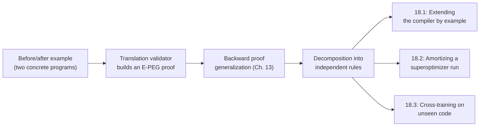
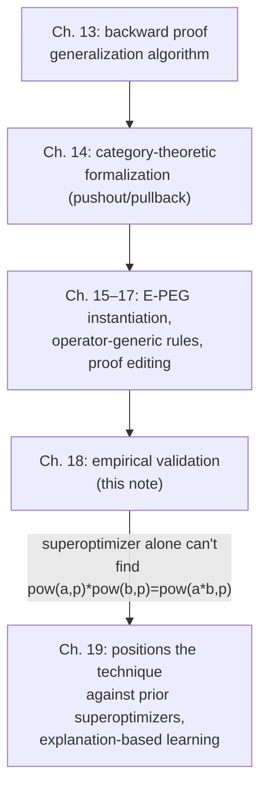

[[book-guidelines|↩ Back to guidelines]]

## Why this chapter has to exist

Every earlier chapter of the thesis makes a *structural* claim: "if you generalize a proof of program equivalence backward through its axiom applications, the result is the unique most-general optimization rule consistent with that proof." That claim is proven — it's a theorem, not a hope. But a theorem about generality says nothing about whether the technique is *worth running*. Three separate empirical questions are still open once you've accepted the math:

1. **Is this actually a good way to program a compiler?** If a programmer has to write ten pages of formal side-conditions to teach the compiler one optimization, "you can generalize from an example" is a party trick, not a productivity win.
2. **Does it pay for itself?** The thesis's optimizer (Peggy) explores an exponential space of equivalent programs by saturation — that's expensive. If learning a rule from one saturation run and then replaying only that rule is *also* expensive, or reproduces the same cost every time you compile, amortization is fiction.
3. **Does a learned rule generalize past the example it was learned on?** A rule memorized from `pow(a,p) * pow(b,p) ⟹ pow(a*b,p)` and useless on anything else is an elaborate way of hard-coding one rewrite. For learning to be more than that, a rule trained on one piece of code has to fire — usefully — on code the compiler has never seen.

Chapter 18 answers all three with actual measurements from [[The-Peggy-Implementation|the Peggy implementation]], run on real and micro benchmarks. This note walks through the three experiments in order, keeping the book's own numbers intact, and closes with how the results feed back into the thesis's larger argument.

## Recap: what "learning a rule" mechanically does

Before the numbers, it's worth being precise about what's being measured, because "learning" here is not statistical — there's no training set, no loss function, no approximation. It's a deterministic, proof-directed generalization procedure from Chapter 13, and the evaluation chapter is testing *that specific algorithm*, not a fuzzy notion of "the compiler got smarter."

The mechanism, in brief: given a before/after example pair, Peggy's translation validator (Chapter 12) builds an E-PEG proof that the two programs are equivalent — a chain of axiom applications, each one an edge in the graph annotated with which axiom produced it. Generalization then walks this proof **backward** from the conclusion, starting from a near-empty E-PEG and re-applying each axiom in reverse, introducing meta-variables and constraints only when the proof structure actually forces a merge. This backward-from-conclusion strategy is the answer to what the book calls the *splitting problem*: naively replacing every shared E-PEG node with a meta-variable over-generalizes when a shared node actually needs to be split into two independently-constrained copies (Chapter 13, Figure 13.2) — but PEGs can contain cycles, so you can't split blindly either. Working backward, splitting only where an axiom demands it, sidesteps the question of "how much to split" entirely.

Two auxiliary devices from Chapters 13/17 matter for reading this chapter's results:

- **Decomposition.** A single before/after example often encodes *several* independent optimizations happening at once (Chapter 13's Figure 13.4: a strength-reduction and an unrelated branch-specialization, tangled in one proof). Naive generalization would produce one overly specific rule that only fires when both patterns co-occur. Decomposition finds "required" nodes — nodes belonging to the original or transformed program, not proof-internal scratch nodes — and cuts the proof into independently-generalized lemmas at equalities between them. This is why Figure 18.1's list below contains pairs like "LIVSR" / "LIVSR Bounds": one example produced two separable rules.
- **Backward relevance pruning.** Because generalization proceeds backward from the conclusion, axiom applications that never touch the property being generalized are simply never visited — Chapter 17 notes this makes discarding irrelevant proof steps a *byproduct* of the algorithm, not a separate analysis pass you'd have to write.

Chapter 18 is where you find out whether that machinery, built on these two guarantees, actually produces something useful when pointed at real code.



## Experiment 1 — Learning optimizations from a single example (§18.1)

**Setup.** A programmer hand-writes one before/after pair illustrating a desired optimization; Peggy learns a general rule from it. The book reports this took **on average 3.5 seconds per example, including [[Translation-Validation|translation validation]]** — i.e., the whole pipeline of "prove the two programs equivalent, then generalize the proof" is fast enough to be an interactive workflow, not an overnight batch job.

**Results — Figure 18.1 (reproduced from the book):**

| Optimization | Description |
|---|---|
| LIVSR | Loop-induction variable strength reduction |
| Inter-Loop SR | Strength reduction across two loops |
| LIVSR Bounds | Optimizes loop bounds after LIVSR |
| ILSR Bounds | Optimizes loop bounds after inter-loop SR |
| Fun-Specific Opts | Function-specific optimizations |
| Spec Inlining | Inline only for special parameter values |
| Partial Inlining | Inline only part of the callee |
| Temp-Obj Removal | Remove temporary objects |
| Loop-op Factor | Factor an operator out of a loop |
| Loop-op Distr | Distribute an operator into a loop to cancel other ops |
| Entire-Loop SR | Replace an entire loop with one operation |
| Array-Copy Prop | Copy propagation through array elements |
| Design-Patt Opts | Remove overhead of design patterns |

The book is explicit about the punchline: **of these thirteen, only LIVSR and Array-Copy Prop are things `gcc -O3` already does.** Everything else — factoring a multiply out of a loop, specializing `pow`, partially exploiting a function's heap-invariance without inlining it — is a rule a conventional compiler simply doesn't have, and the technique produced it from one example each.

### Worked example: inter-loop strength reduction (Figure 18.2)

This is the book's running example, and it's worth walking through because it shows exactly what "generalize" removes and what it keeps.

Concrete instance — flattened 2D-image iteration, rewritten to avoid recomputing the row offset each time:

```c
// before
for (i = 0; i < h; i++)
  for (j = 0; j < w; j++)
    img[i*w + j] /= 2;

// after
for (i = 0; i < h*w; i += w)
  for (j = i; j < i+w; j++)
    img[j] /= 2;
```

Generalized rule the system produced:

$$
\begin{aligned}
&\texttt{for (I=}E_1\texttt{; I<}E_2\texttt{; I++)} \\
&\quad \texttt{for (J=0; J<}E_3\texttt{; J++)} \\
&\quad\quad E_4(I \cdot E_3 + J)
\end{aligned}
\;\Longrightarrow\;
\begin{aligned}
&\texttt{for (I=}E_1\texttt{; I<}E_2 \cdot E_3\texttt{; I+=}E_3\texttt{)} \\
&\quad \texttt{for (J=I; J<I+}E_3\texttt{; J++)} \\
&\quad\quad E_4(J)
\end{aligned}
$$

where $E_1, E_2, E_3, E_4$ range over any loop-invariant expressions. Notice what generalized away and what didn't: the `img` array identifier is gone entirely — the proof never actually depended on it being an array access, only on the shape `i*w + j` — the outer loop's starting point became free, and both loop bounds became arbitrary loop-invariant expressions. This is generalization doing its job on the proof, not on the syntax: nothing in the correctness argument mentioned `img`, so nothing in the rule mentions it either. The book adds a detail that matters for real-world applicability: the decomposition machinery automatically splits this into two separate rules — one for the loop *body* (Inter-Loop SR) and one for the loop *bounds* (ILSR Bounds) — and every generated rule tolerates other, irrelevant statements coexisting inside the loop, because the backward generalization never touches proof steps that don't bear on the property being generalized.

### The `pow` example (Figure 18.4) — algebraic generalization

From the single instance `pow(a,p) * pow(b,p) ⟹ pow(a*b,p)`, the generalizer produced:

$$\forall x, y, z \in \mathrm{int}.\; \mathrm{pow}(x,z) \cdot \mathrm{pow}(y,z) \;\Longrightarrow\; \mathrm{pow}(x \cdot y, z)$$

and, from a separately trained example, the non-trivial

$$\forall x \in \mathrm{uint}.\; \mathrm{pow}(2, x) \;\Longrightarrow\; 1 \ll x$$

(replacing exponentiation-by-2 with a bit shift). Neither is something `gcc -O3` performs. These are exactly the kind of function-specific, domain-flavored rules a general-purpose compiler is reluctant to hard-code, but which a graphics or numerics programmer can teach their own compiler in seconds.

**Rust framing.** If you've written a `#[rustc_pass]`-style peephole matcher or worked with `egg`'s `rewrite!` macros, this is the same shape of artifact — a rewrite rule with free metavariables and (optionally) side-conditions — except the source of the rule is a single concrete `before`/`after` pair rather than a rule the compiler author wrote by hand:

```rust
// Conceptually, what Chapter 18 learns is equivalent to writing:
rewrite!("inter-loop-sr";
    "(for I E1 (E2*E3) (for J I (I+E3) (E4 (+ (* I E3) J))))"
    =>
    "(for I E1 (E2*E3) E3 (for J I (I+E3) (E4 J)))"
);
// ...except no human wrote the rule. It was extracted from a proof
// that one concrete before/after pair (Figure 18.2(a)) were equivalent.
```

## Experiment 2 — Amortizing superoptimizer cost (§18.2)

This experiment answers empirical question 2 above directly, and it also produces a genuinely surprising structural finding: **some rules can only be learned this way — a superoptimizer alone cannot find them**, even though the same superoptimizer can *verify* them once handed both sides.

### Why a superoptimizer can prove `pow(a,p)*pow(b,p) = pow(a*b,p)` but can't find it

Peggy's core is itself a kind of superoptimizer: it saturates an E-PEG by exhaustively applying axioms, then runs a profitability heuristic over the resulting compactly-represented space of equivalent programs to pick a winner. Given `pow(a,p) * pow(b,p)` alone and told to optimize it with basic axioms, Peggy's saturation *can* decompose the expression into smaller pieces — but it has no way to *guess* that reassembling those pieces as `pow(a*b, p)` is a destination worth constructing, because that target term was never given to it. Saturation explores forward from what exists; it doesn't invent new function applications it wasn't shown.

But if you *give* Peggy both `pow(a,p)*pow(b,p)` and `pow(a*b,p)` — i.e., pose it as translation validation rather than open-ended optimization — it can saturate from both ends and **meet in the middle**, finding a shared normal form and thereby proving the two equal. This is the book's own framing: "it is easier to apply axioms on the original and transformed programs and meet in the middle, rather than derive the transformed program from the original." Proof-based learning then takes that meeting-in-the-middle proof and generalizes it into a rule — a rule the superoptimizer, run in the ordinary forward direction, would never have synthesized on its own. Put differently: **superoptimization is exploration; learning-from-proofs is a way to smuggle in a target the exploration can't reach on its own**, so long as you can supply one concrete instance of that target.

### Partial inlining — a byproduct, not a designed feature

This is one of the more elegant findings in the chapter, and the book frames it as something that *fell out* of the machinery rather than something that was engineered. Inlining in Peggy is cheap to pose: it just adds an equality between a call node and the callee's body — an equality analysis, not a destructive rewrite — leaving the profitability heuristic free to choose the inlined or non-inlined version later, once saturation is done.

Running on code using `pow` (Figure 18.4's integer `pow`), Peggy applied the inlining axiom, pulled `pow`'s body into the caller's E-PEG, exploited the fact that `pow` doesn't touch the heap to optimize the surrounding code — and then the profitability heuristic chose **not** to inline `pow` in the final output (too large, presumably). The generalizer, looking at the proof, extracted from this the standalone fact "`pow` is heap-invariant" — a fact useful on its own, replayable without ever re-running the expensive inlining-and-explore step. The book names this **partial inlining**: exploiting information that inlining *would* reveal, without ever committing to inline. A second observed instance: a large heap-mutating function that always returns `0` — Peggy inlined it during exploration, used the fact that the return value is always `0` to optimize the caller, chose not to inline in the final code (too large again), and the generalizer learned "this function always returns 0" as a standalone, reusable fact.

This matters conceptually because it exposes a gap between what saturation *explores* and what the profitability heuristic *selects* — the exploration phase visits states (like the fully-inlined program) that never appear in the winning output, and those visited-but-rejected states are still a source of learnable, reusable facts. Nothing about the learning algorithm was designed with "extract facts from rejected exploration branches" in mind; it's a direct consequence of treating inlining as an equality rather than a rewrite, plus generalizing whatever proof happens to result.

**Rust framing.** If you've built a monomorphizing/inlining pass, the usual design is binary: inline or don't, and once you don't, any local reasoning enabled by inlining is thrown away with the rejected branch. Partial inlining is the equivalent of caching a `#[inline]` candidate's *provable side-effect summary* (e.g., "does not touch `self`'s heap allocations", "always returns a constant") independently of the inlining decision itself — closer to how a modern optimizer's effect-summary / purity-analysis pass works, except here the summary is *derived*, once, from a single concrete inlining-and-explore trace, rather than computed by a hand-written interprocedural analysis every compilation.

### The amortization numbers

Methodology: for each class in SpecJVM, (1) run Peggy's superoptimizer with the full basic axiom set and generalize a set of rules from that run; (2) strip out all the basic axioms, keep only the learned rules, and re-optimize the same class.

The book's numbers, unaltered:

- Average time to **generalize** a method's learned rule set: **11.15 seconds**.
- Average per-method **compile time using basic axioms** (step 1, the "full superoptimization" cost): **26.64 seconds**.
- Average per-method **compile time using only the learned rules** (step 2): **1.47 seconds**.
- Both steps produce **the same output programs**.

That's roughly an **18× reduction** in per-method compile time for identical output, once the learned rules exist. The catch, which the book states plainly, is staleness: learned rules will eventually go out of date as code changes, at which point a fresh superoptimizing compilation is needed to relearn. The proposed usage pattern is therefore periodic: run the expensive superoptimizer occasionally, and use the cheap learned rules for the compiles in between — a caching strategy where the cache entries are themselves general rewrite rules instead of memoized results for one specific input.

## Experiment 3 — Cross-training on unseen code (§18.3)

This is the sharpest test of the three, because it's the only one asking whether a rule trained on code $A$ is useful on a *different* piece of code $B$ that the learner never saw. The hypothesis being tested: libraries tend to be used in **stylized** ways, so training on some call sites of a library should transfer to other call sites of the same library.

**Setup:** a Java ray tracer built on a pure vector library (from the thesis's Section 11.2). Peggy's full optimization (removing short-lived temporary objects — "Temp-Obj Removal" from Figure 18.1) improves this benchmark **7%** over Sun's Java 6 JIT alone. Most of that gain traces to one dominant method, call it $m$. Rather than train on $m$ itself, the experiment trains on a *different*, unrelated vector-intensive method, $f$, and then asks whether the rules learned purely from $f$ can optimize $m$.

**Results, exactly as reported:**

| Configuration | Speedup on $m$ |
|---|---|
| Fully optimizing $m$ directly (upper bound) | 7.1% |
| Learned-from-$f$ rules only, small training set | 3.1% |
| Learned-from-$f$ rules only, larger training set | 5.1% |
| Learned rules (either training set) **+ simplification-only axioms** | full 7.1%-level result |
| Simplification-only axioms alone (no learned rules) | 0.6% |

The mechanism the book identifies for the third row's jump to full performance: the rules learned from $f$ capture **large-step simplifications of common vector-library usage patterns** — the example given is a vector-scale-followed-by-vector-add pattern — while the *original* axioms that only ever infer equalities without constructing new terms (41% of all of Peggy's axioms) can't by themselves lead the optimizer down a wrong path, since they never introduce anything new to explore, only remove redundancy. Learned rules supply *direction* (large structural jumps that a from-scratch search wouldn't easily stumble into); simplification axioms supply *cleanup* (folding the resulting expressions the rest of the way down). Neither alone reaches the ceiling; together they do, and the 0.6%-alone number for simplification axioms shows they're not secretly doing the heavy lifting on their own.

**Python framing** (illustrative, not load-bearing): this composition — a small set of powerful, pattern-specific rewrite rules combined with a larger set of "always safe to apply, never explores anything new" simplification rules — is the same division of labor you'd sketch in a toy rewrite-rule interpreter:

```python
def optimize(expr, learned_rules, simplification_rules, fuel=100):
    # learned_rules: large-step, pattern-specific, found by generalization
    # simplification_rules: small-step, always-safe, never introduce new terms
    for _ in range(fuel):
        if (new := try_apply_any(learned_rules, expr)) != expr:
            expr = new
            continue
        if (new := try_apply_any(simplification_rules, expr)) != expr:
            expr = new
            continue
        break
    return expr
```

The empirical claim in §18.3 is precisely that neither rule set alone is fixed-point-equivalent to running both — the learned rules widen what's reachable, the simplification rules clean up what's reached.

## Where this leaves the proof-generalization technique

Put the three experiments together and they answer the three motivating questions from the top of this note:

1. **Is it a good way to program a compiler?** Yes, by the chapter's own evidence — 3.5 seconds per learned rule, eleven of thirteen learned optimizations absent from `gcc -O3`, and the programmer never touches the compiler's internals or a rule-description language.
2. **Does it pay for itself?** Yes, with a caveat — 26.64s → 1.47s per method (same output) is a genuine amortization win, but it's a *depreciating* asset: the rules go stale as code changes and periodic re-superoptimization is still required.
3. **Does it generalize past the training example?** Partially, and informatively so — cross-training recovers 44–72% of the achievable speedup from rules alone, and 100% once combined with orthogonal, always-safe simplification axioms. The result is less "the technique fully generalizes" and more "the technique's large-step rules and the pre-existing simplification axioms are *complementary*, and library code is stylized enough for that complementarity to pay off across call sites."

Structurally, this chapter sits at the empirical tail of a specific dependency chain in the thesis: Chapter 13 supplies the generalization *algorithm* (backward proof-walking, splitting, decomposition), Chapter 14 supplies its *category-theoretic justification* (pushout/pullback/pushout-completion, proven maximally general), Chapters 15–17 *instantiate and refine* it for E-PEGs specifically (adding operator-generic rules, non-equality relations, proof-manipulation techniques like sequencing and cutting), and Chapter 18 is where all of that cashes out as numbers on real code. Chapter 19 (Related Work) then positions the whole result against prior superoptimizers, explanation-based learning, and machine-learned compiler heuristics — Chapter 18's finding that a superoptimizer *alone* can't discover `pow(a,p)*pow(b,p) ⟹ pow(a*b,p)` is exactly the empirical evidence that motivates treating proof-generalization as a distinct technique from superoptimization, not a wrapper around it.



### A note on the learning-goals connection

This chapter is squarely an *engineering evaluation* chapter rather than a proof-theoretic one, so the direct load-bearing connections to the dependent-type-checker/elaborator project are thinner here than in Chapters 13–14 — but two threads are worth flagging explicitly:

- **Proof-directed generalization as a template for learned invariants.** The backward, proof-structure-driven walk that decides *what to generalize and how much to split* is conceptually close to what a CEGAR-style invariant generator has to do: given a concrete counterexample (here, a concrete proof of program equivalence) work backward through it to decide which facts were load-bearing and which were incidental, then generalize only the load-bearing ones — exactly the shape of interpolant extraction from a refutation proof in an SMT-based CEGAR loop, or Craig interpolation used to refine an abstract domain. The chapter's empirical validation that this produces *useful, non-trivial, previously-undiscovered facts* (partial inlining's "this function is heap-invariant," "this function always returns 0") is direct evidence that proof-directed generalization is a technique worth carrying into invariant-generation/CEGAR work, not just compiler-rule learning.
- **Trusted-kernel discipline, empirically confirmed.** Every rule in Figure 18.1, however learned, is only ever *used* if the underlying axioms it was generalized from are themselves sound — the learning process never bypasses the E-PEG's own equality-checking machinery. That "learned rules are still checked/generated by the same trusted proof machinery, not a separate untrusted heuristic" is the same discipline you'd want from a metavariable-unification-driven elaborator that occasionally needs to *propose* candidate unifiers or instantiations heuristically (e.g. higher-order pattern guesses beyond the Miller-pattern fragment) but must still have every proposal checked by the trusted kernel before it's accepted.

Where this chapter doesn't reach — and honestly shouldn't be stretched to — is anything about SAT/SMT solving, constraint propagation, or refinement-type inference; the "learning" here is proof generalization over a fixed equational theory, not constraint solving over an open one.
