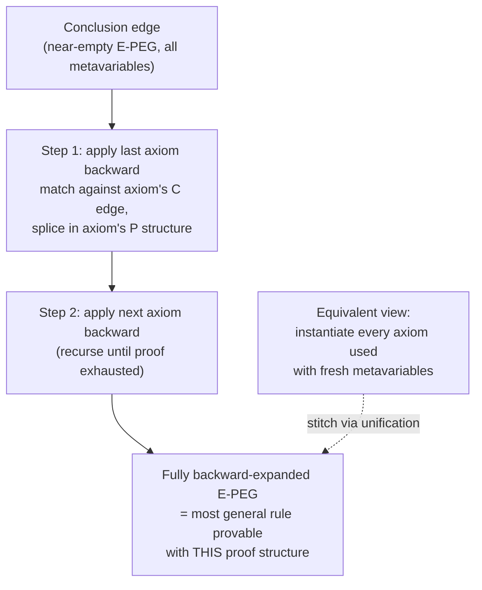

# Learning Optimizations from Proofs

[[book-guidelines|↩ Back to guidelines]]

## Why one example should be enough

Suppose a programmer hands your compiler exactly one worked example: here is a loop before, here is the same loop after a hand-tuned rewrite, and here is a proof (or a translation validator's output) that they compute the same thing. That's it — one before/after pair, one proof. Can a compiler turn that into a *general* optimization rule, applicable to loops it has never seen, and be sure the rule is still correct?

The naive answer is "generalize the two programs": find what's common between the before-tree and the after-tree, replace the parts that differ with placeholders, and declare the result a rewrite rule. This is exactly the move a `macro_rules!` pattern or an untyped E-graph rewrite miner would try — pattern-match on syntax, abstract the leaves. It fails for a subtle but important reason: **syntax alone doesn't tell you which parts are allowed to vary independently, and which parts must vary together.** Two occurrences of the same subterm in the "before" program might look identical, but the proof of correctness might only need them to be equal in one case and might not care about the other at all. Generalize by syntax and you either under-generalize (miss valid instances) or over-generalize (produce a rule that isn't sound). The thesis's insight — and the one that makes this chapter worth its own treatment — is that **the correctness proof itself, not the programs, is the right object to generalize.** The proof tells you exactly which equalities were load-bearing and which weren't, so walking it (specifically, walking it *backward*, from conclusion to premises) is what turns "one example" into "the most general sound rule consistent with that example's proof."

This is also, not coincidentally, a specialization-vs-generalization exercise that looks a lot like anti-unification in program synthesis and rule mining in the term-rewriting literature, and it rhymes strongly with how a **unification** algorithm or an elaborator's metavariable-solving loop decides which pieces of two expressions must be forced equal versus which can stay as free variables — a connection this article returns to at the end.

## Setting: PEGs, E-PEGs, and axioms as rewrite steps

Recall the thesis's core representation. A **PEG** (Program Expression Graph) represents an imperative program as a pure, referentially-transparent expression DAG — `θ` nodes encode "value before the loop, value after one iteration" pairs for induction variables, `eval`/`pass` encode loop unrolling/iteration, and ordinary nodes are pure operators. An **E-PEG** extends a PEG with an explicit equality relation over nodes: it groups provably-equal PEG nodes into equivalence classes (drawn with dashed edges) and *labels* each equality edge with the axiom that justified it. Because [[Equality-Saturation|equality saturation]] (Chapters 2–3) and [[Translation-Validation|translation validation]] (Chapter 12) both work by repeatedly applying **axioms** — equations like $x * 0 = 0$ or $1 * x = x$ — to grow an E-PEG's equalities, the *history* of which axioms fired, and in what order, is naturally recorded as annotated edges in the final E-PEG. That annotated E-PEG *is* the proof. This chapter is about reading that proof back out and turning it into a rule.

## The worked example: loop-induction-variable strength reduction

The book's running example (Figure 13.1) is loop-induction-variable strength reduction (LIVSR): replacing `use(i*5)` inside a loop that increments `i` by 1 each iteration with `use(j)` where `j` starts at 0 and is incremented by 5 each iteration — trading a multiply for an add.

```python
# before
i = 0
while ...:
    use(i * 5)
    i += 1

# after
i = 0; j = 0
while ...:
    use(j)
    i += 1
    j += 5
```

The proof that these are equivalent, expressed over the PEGs of the two programs, chains four axiom applications:

- edge $a$: $\theta(x,y) * z = \theta(x*z, y*z)$ — distribute multiplication over the loop's fixpoint
- edge $b$: $(x+y)*z = x*z + y*z$ — distribute over addition
- edge $c$: $1 * x = x$ — multiplicative identity
- edge $d$: $0 * x = 0$ — multiplicative zero

Two different generalizations fall out of this proof depending on how aggressively you're willing to generalize the *axioms themselves*, not just the constants in the E-PEG:

- **Weak logic, generalize constants only:** keep $*$ and $+$ fixed, but replace the literal constant $5$ with an arbitrary pure expression $C$. This is sound because nothing in the proof used any numeric fact about $5$ — the proof holds for any $C$.
- **Strong logic, generalize the operators too:** replace $*$ and $+$ themselves with $\mathrm{OP}_1$ and $\mathrm{OP}_2$, subject to side conditions $\mathrm{distributes}(\mathrm{OP}_1, \mathrm{OP}_2)$, $\mathrm{zero}(C_2, \mathrm{OP}_1)$, and $\mathrm{identity}(C_3, \mathrm{OP}_2)$ — recovered by generalizing the *axiom schemas themselves*: instead of the ground axiom $(x+y)*z = x*z+y*z$, use $\mathrm{OP}_1(\mathrm{OP}_2(x,y),z) = \mathrm{OP}_2(\mathrm{OP}_1(x,z),\mathrm{OP}_1(y,z))$ where $\mathrm{distributes}(\mathrm{OP}_1,\mathrm{OP}_2)$. This rule now covers boolean OR/AND, vector +/×, set union/intersect — anything satisfying the same algebraic shape.

The lesson generalizes past this one example: **the expressive power of the axiom logic bounds the expressive power of the learned rule.** A generalization algorithm can only be as general as the vocabulary its axioms are stated in — this is exactly why Chapter 14 re-derives the whole algorithm categorically, so that swapping in a richer axiom language (or a different domain of proofs entirely — databases, type systems) doesn't require re-deriving the generalization procedure from scratch.

*[[Loop-and-Branch-Optimizations-Discovered-by-Saturation#What breaks without this|What breaks without this]] insight:* if you generalized only at the syntactic level of the E-PEG's nodes (treat $*$, $+$, $0$, $1$ as opaque and untouchable, generalize only the constant $5$), you'd get the weak-logic rule and nothing more — a strictly less useful rule that a superoptimizer would have to re-discover independently for every operator pair with the same algebraic shape.

## The splitting problem: why "replace nodes with metavariables" isn't enough

Here's where naive generalization actively produces a *wrong* (too-specific) rule, not just a weak one. Consider the proof in Figure 13.2(a): a fragment shows $(\alpha + 0) - 0$ transitively equal to $\alpha$, established through edges

- $a$: $x + 0 = x$
- $b$: $x - x = 0$
- $c$: $(x+y) - y = x$
- $d$: $0 + x = x$
- $e$: transitivity of $c$ and $d$

The naive "replace every node with a metavariable, then constrain by the axioms actually applied" strategy would generalize $\alpha$ to a fresh metavariable and stop — because $\alpha$ appears only once at the leaves, syntactically nothing else needs to change. But the *actual* most general rule provable from this proof structure requires **duplicating the shared `+` node** into two separate `+` nodes with independently-constrained arguments (Figure 13.2(b); schematically the rule becomes something like $((X + 0) - Y) + (0 + Z) \Rightarrow X - Y + Z$ once each occurrence is allowed to diverge). The reason: a single shared node in the original E-PEG can be visited by the proof along two logically distinct paths, each of which only needs *some* of the shared node's structure to hold. Collapsing them into one metavariable silently imposes an equality constraint ("these two occurrences must be the same expression") that the proof never actually required — that's *under*-generalization masquerading as caution.

So the correct move is sometimes to **split** a shared node into two independent copies. But splitting can't be applied blindly either: PEGs contain cycles (that's how loops are represented, via $\theta$/`eval`/`pass`), and naively duplicating every node that's shared anywhere in the graph risks infinite expansion when you try to duplicate your way around a cycle. **The central algorithmic question of this chapter is: how much splitting is correct, and how do you compute it without infinite regress?**

This is worth pausing on because it is *exactly* the tension a unification algorithm faces when deciding whether two occurrences of a metavariable must be **the same** solution or may be solved **independently** — over-hasty identification is the classic failure mode of syntactic (as opposed to semantic, proof-directed) anti-unification. It's the same shape of problem Miller pattern unification solves cleanly for the linear, distinct-bound-variable fragment and struggles with in general higher-order unification: knowing *from the derivation*, not from surface shape, which occurrences are forced together.

## Working backward through the proof: the actual algorithm

The thesis's resolution (§13.3) inverts the naive strategy entirely. Instead of starting from the fully-instantiated final E-PEG and asking "what can I split apart," it **starts from a near-empty E-PEG containing just the proof's conclusion edge, and replays the proof backward, axiom by axiom, only introducing structure (new nodes, new constraints, or merges) exactly when the proof forces it.**

Concretely, on the tiny two-axiom example of Figure 13.3 ($x - x = 0$ then $x + 0 = x$ chained together):

1. **Start** with a single conclusion edge — an almost-empty E-PEG asserting "LHS $=$ RHS" with everything still a metavariable.
2. **Step 1**: apply the *second* axiom ($x + 0 = x$) in reverse. The axiom is itself represented as a small E-PEG with one edge labeled **P** (premise) and one labeled **C** (conclusion), and metavariables marked `•`. Applying it backward means: match the current conclusion edge against the axiom's **C** edge, then *replace* it with the axiom's **P** structure (here, `• + 0`), introducing a new node only for what the axiom's premise actually requires.
3. **Step 2**: apply the *first* axiom ($x - x = 0$) in reverse the same way, against the `0` node just introduced.

Each backward axiom application is a small, local matching-and-splicing step — no global "how much do I need to split" decision is ever made explicitly, because the proof structure makes the decision for you: nodes only get merged when two backward-expansions are forced to identify the same E-PEG position by the proof itself, and stay separate otherwise. This dissolves the splitting problem from §13.2 by construction, rather than by a separate case analysis.

There's a second, equivalent way to see this same process that the thesis flags explicitly, and it's the framing most directly useful if you're building a checker: **instantiate every axiom used in the proof with its own batch of fresh metavariables, then unify these freshly-instantiated axiom instances together** wherever the proof's edges connect them, using a bidirectional stitching (shown in the figure as a two-headed arrow between the backward-constructed E-PEG and the axiom instantiations). Read this way, proof generalization *is* a unification problem: each axiom firing contributes a rigid pattern with fresh metavariables, and the proof's edge structure supplies the equations between those patterns that a unifier must solve. This is precisely the mechanism a trait solver, an elaborator's metavariable context, or a Prolog-style clause resolution step would use to combine several already-instantiated facts into one coherent substitution — and it foreshadows Chapter 14's category-theoretic reformulation, where this whole backward-replay process is recast as **pushouts** (gluing new structure along shared substructure) chained together, with the "how much to identify" question answered by a universal property instead of an ad hoc procedure.



## Sequencing versus parallelizing axiom applications

A detail easy to miss but structurally important: the backward replay is driven by the *order* in which axioms actually fired in the original proof, but that order is a **partial order**, not a total one. Two axiom applications that touch disjoint parts of the E-PEG (as in the LIVSR proof, where the distribute-over-$\theta$ step and the distribute-over-$+$ step act on separate subexpressions before they're stitched together) can be replayed backward in either order, or conceptually in parallel, without changing the resulting generalized rule — only axiom applications that are causally dependent (one axiom's conclusion feeds a later axiom's premise, as with transitivity chaining edges $c$ and $d$ into $e$ in the splitting example) must be sequenced. This is the same distinction Chapter 14 makes precise with **coproducts** encoding independent, parallelizable axiom applications versus a **chain of pushout squares** encoding genuinely sequential dependency — the categorical machinery exists specifically so that "which steps commute" doesn't have to be reasoned about ad hoc for every proof domain.

## Decomposition: splitting an over-specific rule into independent smaller rules

Backward replay gives you *the* most general rule sound for a given proof — but "most general for this proof" and "usefully general in practice" aren't the same thing. If the input example bundles two conceptually unrelated optimizations into one before/after pair, the learned rule inherits that bundling, and a rule that only fires when *both* unrelated transformations are simultaneously applicable is nearly useless.

The book's second worked example (Figure 13.4) makes this concrete: a program does loop-induction-variable strength reduction (replacing `i*5` with an incrementally-updated `j`) *and*, independently, specializes an `if (!p)` branch for the case where the condition is always true. These are unrelated: each is separately profitable whether or not the other applies. Naive generalization of the whole proof produces one rule requiring both patterns to co-occur.

The fix (§13.4) is a two-pass decomposition:

1. **Pass 1 — identify required nodes.** Run generalization on the whole proof without decomposing. Nodes belonging to the generalized *original* or *transformed* programs (as opposed to nodes introduced purely as intermediate proof scaffolding) are marked **required**. An equality edge connecting two required nodes is a candidate **decomposition point** — it represents a place where the proof establishes something that is itself an independently-meaningful before/after fact, not just internal bookkeeping.
2. **Pass 2 — cut and recurse.** Re-run generalization, but whenever backward replay reaches an equality between two required nodes, stop — treat that equality as an *assumption* rather than something to keep expanding, and spawn a **separate** generalization problem rooted at that equality.

In the worked example, this produces exactly two independent rules: the branch-specialization rule (backward replay from the top-level conclusion, stopping at the LIVSR sub-equality $b$, treating it as given) and the LIVSR rule (backward replay starting fresh from $b$ as its own conclusion) — each independently checkable and independently applicable, matching real intuition about what these two optimizations are.

The guardrail against over-decomposing is explicit and important: **only cut at equalities between required (original/transformed-program) nodes, never at equalities involving temporary/intermediate nodes.** Cutting at intermediate nodes would decompose all the way back down to the individual base axioms you started with — technically "more decomposed" but strategically useless, since a single raw axiom application was never a discoverable optimization in the first place. So decomposition trades away some generality (the single combined rule could, in principle, fire in fewer, more specific situations than the decomposed pair, though typically the decomposed rules are strictly more broadly reusable) for reusability: two orthogonal small rules that recombine naturally beat one large rule that only matches the exact bundle seen once.

## Removing irrelevant axiom applications automatically

Notice what backward replay does *not* do: it never introduces structure for an axiom application that the proof's conclusion doesn't actually depend on. Because the algorithm walks strictly from the conclusion edge backward, only pulling in premises the current frontier requires, any axiom firing that was part of the original (forward) equality-saturation run but that turned out to be a dead end — a saturation step that added equalities never used to justify the final proved equality — simply never gets visited during backward replay. It's not filtered out by a separate pruning pass; it's structurally excluded because backward replay only ever asks "what did I need to derive *this*," never "what did the saturation engine happen to derive along the way." This is the same "only keep what the proof actually used" discipline that makes proof-carrying/proof-producing verification architectures trustworthy: the proof term itself is the filter, not a heuristic relevance pass layered on top.

## Where this leads

Chapter 13 gives the *algorithmic intuition* — replay the proof backward, split only when forced, decompose at required-node equalities — entirely in terms of PEGs and E-PEGs, deliberately kept concrete. The thesis's structural bet is that none of this intuition is actually PEG-specific:

- **Chapter 14 (Proofs in Categories)** re-expresses the entire backward-replay algorithm using category theory: axioms become (often identity-carried) morphisms, "applying an axiom" becomes a **pushout** ($B +_A C$, a universal gluing construction), a full proof becomes a chain of pushout squares, and — crucially — the informal claim "backward replay gives *the* most general rule" becomes a theorem about a universal property, with **pullbacks** formalizing the "isolate shared structure" half of the splitting problem and **pushout completions** formalizing decomposition. Sequencing vs. parallelizing axiom applications (this chapter's aside) becomes the difference between chained pushouts and **coproducts**.
- **Chapter 15** instantiates that categorical machinery concretely back down to E-PEGs, closing the loop and re-deriving this chapter's examples as instances of the abstract theorems.
- **Chapter 11** shows the same generalization algorithm applies unmodified to database query optimization (via the chase on conjunctive queries) and to type debugging (generalizing backward through a *typing* proof instead of an equational one) — direct evidence that "generalize by walking the proof backward" is a domain-independent technique, not a PEG trick.
- **Chapter 12 (Translation Validation)**, which this chapter depends on, is where the proofs being generalized actually come from: every learned rule starts life as a translation-validation proof of one concrete before/after pair.
- **Chapter 18 (Evaluation)** measures whether rules learned this way, from single examples, are actually useful as equality analyses in Peggy — including amortizing superoptimizer cost and partial inlining falling out as a byproduct.

For the standing project (a Rust-based verifying compiler with a Lean-style elaborator and CSP-backed abstract interpretation), this chapter is worth flagging as directly load-bearing in two ways. First, **backward-replay-as-unification** is a template for something your elaborator's metavariable solver already needs to do: when combining several already-solved unification problems (axiom instances) into one coherent global substitution, deciding which metavariable occurrences must be forced identical versus left independent is the *same* proof-structure-driven question this chapter answers for E-PEG nodes — get it wrong and you either under-unify (miss valid solutions) or over-unify (reject valid programs, exactly analogous to over-eager node merging here). Second, the "only keep what the proof's conclusion actually needed" discipline of backward replay is a lightweight version of the **trusted-kernel / proof-producing architecture** idea central to your CSP and abstract-interpretation goals: if your invariant generator or CEGAR loop emits a derivation, walking that derivation backward from the goal is how you'd extract a minimal, checkable proof certificate (or a minimal Craig interpolant) rather than trusting the whole forward search trace — the irrelevant-axiom-removal property described above is precisely what makes a derivation trace usable as a compact certificate instead of a black box.
