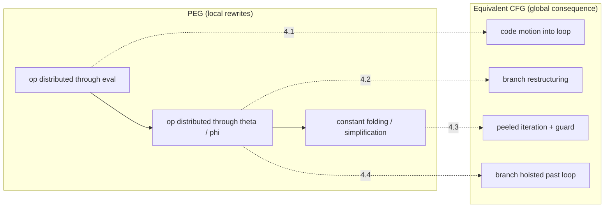
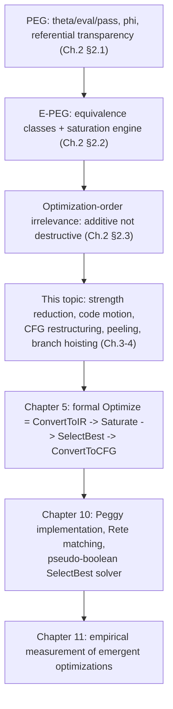

[[book-guidelines|↩ Back to guidelines]]

# Loop and Branch Optimizations Discovered by Saturation

## Why these optimizations don't need their own passes

Every classical compiler has a bestiary of loop optimizations: strength reduction, code motion, loop peeling, branch hoisting, loop-invariant conditional elimination. Each one traditionally gets its own analysis, its own pattern-matcher, its own hand-tuned enabling conditions, and — because they interact — a carefully negotiated place in the pass pipeline. Get the order wrong and one pass silently disables another.

Tate's thesis makes a striking claim about this chapter's material: none of that bestiary needs to exist as a separate engineering artifact. If you represent a loop as a small set of *mathematical operators* — expressions that produce whole sequences of values rather than statements that mutate a variable — and you give the compiler a handful of genuinely general algebraic axioms (distributivity, associativity, identity elements, a couple of loop-specific identities), then strength reduction, code motion, CFG restructuring, peeling, and branch hoisting all fall out as *side effects* of chasing those axioms to a fixed point. The compiler writer never encodes "loop peeling" as a concept. It emerges.

This is the payoff of the representation introduced in Chapter 2: the **Program Expression Graph (PEG)**, extended to an **E-PEG** (equality PEG) that tracks which nodes are provably equal via dashed equivalence edges, saturated by continuously firing local pattern-triggered rewrite rules (**equality analyses**: a trigger pattern + a callback that adds equalities) until no more equalities can be derived. Because an axiom only *adds* an equality — it never deletes the node it fired on — no optimization can ever disable another by removing a program variant from the representation. This is what "optimization-order irrelevance" buys you, and it's the mechanism that lets a genuinely local rewrite (e.g., "multiplication distributes over $\theta$") ripple into a global restructuring of the control-flow graph (CFG) once you pick the best program out of the saturated E-PEG with a global profitability heuristic (a pseudo-boolean/ILP solver over a static cost model).

Before any of the specific optimizations make sense, you need the vocabulary PEGs use to talk about loops at all.

---

## 1. The loop vocabulary: $\theta$, $\mathrm{eval}$, $\mathrm{pass}$

### What breaks without this

An imperative loop mutates a variable in place — `i := i + 1` reassigns the same memory cell 15 times. A pure, referentially-transparent representation cannot have a node whose "value" changes depending on when you ask. If PEGs tried to represent `i` with one node, equality reasoning about that node would be meaningless (equal to what, at which iteration?). The entire foundation of [[Equality-Saturation|equality saturation]] — that "PEG node A = PEG node B" is a timeless mathematical fact — collapses unless loop-varying quantities are represented as something that doesn't vary: not a value, but a *whole sequence of values*.

### The book's definitions

- **$\theta$ node.** $\theta(a, b)$ denotes the entire sequence of values a loop-carried variable takes across all iterations. The left child $a$ is the value at iteration 0 (the initial value); the right child $b$ computes the value at the current iteration in terms of the value at the *previous* iteration — i.e., $b$ is implicitly lifted to operate elementwise on the sequence $\theta(a,b)$ itself. One $\theta$ node exists per live variable in the loop.
- **$\mathrm{eval}(s, n)$.** Given a sequence $s$ and an iteration index $n$, returns the $n$-th element of $s$. This is how you extract "the value of a variable after the loop" — you need a specific index into the theta-sequence.
- **$\mathrm{pass}(s)$.** Given a boolean sequence $s$ (the loop's exit condition evaluated at every iteration), returns the index of the first `true` element — i.e., the iteration count at which the loop terminates. There is exactly **one** $\mathrm{pass}$ node per loop (the [[The-Peggy-Implementation#Termination|termination]] condition is loop-global), but there can be **many** $\theta$/$\mathrm{eval}$ nodes per loop (one pair per live variable).
- **Nested loops** subscript all three node kinds by nesting depth: $\theta_\ell$, $\mathrm{eval}_\ell$, $\mathrm{pass}_\ell$.

Concretely, for
```
for (i := 0; i < 29; i++) { i++; }
return i;
```
the returned value is $\mathrm{eval}(\theta(0,\,i+2),\ \mathrm{pass}(\theta(0,\,i+2) \geq 29))$: the theta node produces $[0, 2, 4, \dots]$, the pass node finds the first index where that sequence is $\geq 29$ (index 15, since $2 \times 15 = 30$), and eval reads off element 15.

The thesis is explicit about *why* $\theta$, $\mathrm{eval}$, and $\mathrm{pass}$ are kept as three separate node kinds rather than fused into one "loop-value" operator, even though they're almost always used together: (a) many $\mathrm{eval}$ nodes share a single $\mathrm{pass}$ node per loop, and having that single shared node is structurally useful across compilation stages; (b) $\mathrm{pass}$ is not the only thing that appears as $\mathrm{eval}$'s second argument — loop peeling (Section 4.3 below) inserts $\phi$ nodes and a `peel` operator in that slot instead. Fusing would foreclose exactly the compositional flexibility that later lets a handful of axioms do so much work.

### Grounding: the sequence-of-values reading

**Rust.** The cleanest mental model is a lazy infinite iterator, not a mutable variable:

```rust
// theta(a, f) : the sequence [a, f(a), f(f(a)), ...]
// i.e. index n gives the value of the loop variable entering iteration n
fn theta<T: Copy>(a: T, f: impl Fn(T) -> T) -> impl Iterator<Item = T> {
    std::iter::successors(Some(a), move |&prev| Some(f(prev)))
}

// eval(s, n): nth element of the sequence
fn eval<T>(mut s: impl Iterator<Item = T>, n: usize) -> T {
    s.nth(n).unwrap()
}

// pass(s): index of first true element
fn pass(s: impl Iterator<Item = bool>) -> usize {
    s.enumerate().find(|&(_, b)| b).unwrap().0
}

// for (i := 0; i < 29; i++) { i++; }  return i;
let i_seq = || theta(0, |prev| prev + 2);
let n = pass(i_seq().map(|v| v >= 29));
let result = eval(i_seq(), n); // 30
```
This is not how Peggy actually executes anything (PEGs are a *compile-time* representation, never run as an interpreter over infinite iterators) — but it makes the semantics of $\theta$/$\mathrm{eval}$/$\mathrm{pass}$ completely unambiguous, and it's a useful sanity check when reading the axioms below: every equation is really an equation between infinite sequences (or between an index into one).

**Python**, same idea, quick sketch:
```python
def theta(a, f):
    while True:
        yield a
        a = f(a)

def pass_(bools):
    return next(i for i, b in enumerate(bools) if b)

def evalp(seq, n):
    for i, v in enumerate(seq):
        if i == n: return v
```

**Lean.** The theta sequence is literally a function `Nat → T` satisfying a recursive equation — which is exactly what you'd write as a `Nat.rec`-defined function, or state as a fixpoint characterization to be proved correct by induction:
```lean
def thetaSeq (a : T) (f : T → T) : Nat → T
  | 0     => a
  | n + 1 => f (thetaSeq a f n)

-- pass and eval as before
def passIdx (s : Nat → Bool) : Nat := Nat.find (fun n => s n = true)  -- classically / with decidability
def evalAt (s : Nat → T) (n : Nat) : T := s n
```
The point worth flagging for the elaborator/verifier project: $\theta$'s recursive equation is *definitional* in exactly the sense Lean's kernel understands recursion — this is not a metaphor, it's the same structural-recursion machinery. When the thesis later reasons "$\theta$ produces sequence $S$, therefore $\theta = \theta'$ iff their sequences agree pointwise," that's an extensionality principle you'd need to state and discharge explicitly in Lean (function extensionality, or a bisimulation argument if you keep sequences coinductive instead).

---

## 2. Loop-induction-variable strength reduction (the seed example, Ch. 2)

This is Chapter 2's running example and it establishes the axiom-driven pattern every later optimization in this topic reuses. The source transformation:
```
i := 0;                  i := 0;
while (...) {            while (...) {
   use(i * 5);      →       use(i);
   i := i + 1;              i := i + 5;
   if (...) { i := i+3; }   if (...) { i := i+15; }
}                         }
```
`i*5` is replaced by `i` itself, provided every increment of `i` inside the loop is scaled by 5 to compensate. Three axioms suffice:
$$
(a+b)*m = a*m + b*m \qquad (2.1)
$$
$$
\theta(a,b)*m = \theta(a*m,\, b*m) \qquad (2.2)
$$
$$
\phi(a,b,c)*m = \phi(a,\, b*m,\, c*m) \qquad (2.3)
$$
where $\phi(cond, t, f)$ is a *gated*-SSA-style selector (unlike a plain SSA $\phi$, it takes the branch condition itself as an argument and is executable on its own — no separate control-flow join needed to know which value to pick).

Firing (2.2) pushes the $*5$ through the $\theta$ node — multiplying both the initial value and the per-iteration update by 5 — which exposes a new $\phi(\dots)*5$ node, which triggers (2.3), which exposes two new $+$ nodes, each triggering (2.1) and then constant folding ($0*5=0$, $3*5=15$, $1*5=5$). Seven independent equalities get added, and because equivalence classes are shared structure rather than separate copies, the saturated E-PEG compactly represents $2^7 = 128$ distinct ways of writing the program — not by enumerating them, but by leaving each binary choice (which representative to pick per equivalence class) open until the profitability heuristic resolves it.

**The crucial point about order-independence:** a "worse-looking" peephole rule like $i*5 = i \ll 2 + i$ (replace multiply by shift-and-add) would, in a *destructive* rewriting compiler, permanently replace the `i*5` node — and thereby destroy the very node that strength reduction needed to pattern-match on, silently disabling a much bigger win. In equality saturation the peephole rule only *adds* the shift-and-add as an equal alternative; `i*5` is still there, so strength reduction still fires regardless of what order the rules ran in. This single mechanism — additive rather than destructive rewriting — is what makes every optimization in the rest of this note "unlock-proof" against every other one.

---

## 3. Inter-loop strength reduction (Ch. 3.3): an optimization nobody programmed in

### The setup

```
for (i:=0;i<10;i++)              sum := 0;
  for (j:=0;j<10;j++)     ≡      for (i:=0;i<10;i++)
    use(i*10 + j);                  for (j:=0;j<10;j++)
                                       use(sum++);
```
The right-hand version replaces an expensive `i*10 + j` recomputed every iteration with a cheap accumulator increment. No pass in Peggy is designed to find this. It falls out of chasing the same general-purpose axioms across *two nested loops at once* — the "inter-loop" in the name. This is the thesis's flagship demonstration that equality saturation discovers optimizations no traditional compiler explicitly searches for, because no human had to anticipate the interaction pattern.

### The derivation, edge by edge

Starting PEG (already after applying loop-induction-variable strength reduction to the outer `i*10`, replacing it with $i' = \theta_1(0,\, 10+i')$):
$$i' + \theta_2(0,\, 1+j)$$

- **Edge A** — distribute $+$ over $\theta_2$:
$$i' + \theta_2(0, 1+j) = \theta_2(i'+0,\ i'+(1+j))$$
- **Edge B** — $0$ is the additive identity: $i' + 0 = i'$.
- **Edge C** — associativity/commutativity of $+$: $i' + (1+j) = 1 + (i'+j)$.
- **Edge D** — a genuinely loop-specific identity, *zero incremented $n$ times equals $n$*:
$$\mathrm{eval}_\ell(\mathrm{id}_\ell,\ \mathrm{pass}_\ell(\mathrm{id}_\ell \geq n)) = n \quad\text{where}\quad \mathrm{id}_\ell = \theta_\ell(0,\, 1+\mathrm{id}_\ell)$$
This axiom rewrites the *constant* $10$ (recognized as "a counter that counts to 10") into an actual loop-counter expression — a locally worse-looking move (introducing a whole loop where a constant sat before) that only pays off once its output feeds into $i'$'s own theta recursion below.
- **Edge E** — distribute $+$ over the first child of $\mathrm{eval}_2$: $\mathrm{eval}_2(j,k) + i' = \mathrm{eval}_2(j+i', k)$.
- **Edge F** — commutativity again: $j + i' = i' + j$.

The saturated E-PEG now contains, among its 128-ish encoded variants, exactly the accumulator form `sum := 0; for i { for j { use(sum++) } }` — which the pseudo-boolean profitability heuristic selects as cheapest.

### Why this matters for the emergent-optimization thesis

Edge D is the tell. No engineer writing a dedicated "inter-loop strength reduction pass" would think to *introduce* a new loop as an intermediate step — it looks like it's making things worse. But because the E-PEG never discards the original expression, trying this "bad" move costs nothing: it just adds one more equivalence class, and if it turns out useless the profitability heuristic simply never selects it. This is the general shape of every result in this note: **local, individually-justifiable algebraic moves, tried exhaustively because trying them is safe, occasionally compose into something no one designed.**

**Rust [[Domain-Independent-Applications-of-Generalization#Grounding|grounding]] — the axioms as a rewrite-rule table.** If you were implementing this as an e-graph rewriter (à la `egg`/`egglog`, which are direct engineering descendants of this thesis — see the Related Work chapter), each axiom above is literally one rewrite rule keyed by a pattern:
```rust
enum Pattern {
    Add(Box<Pattern>, Box<Pattern>),
    Theta(Box<Pattern>, Box<Pattern>),
    Eval(Box<Pattern>, Box<Pattern>),
    Pass(Box<Pattern>),
    Var(&'static str), // pattern variable, e.g. "a", "b", "m"
    Const(i64),
}

struct Axiom { name: &'static str, lhs: Pattern, rhs: Pattern }

// Edge A, as data:
let distribute_add_over_theta = Axiom {
    name: "add-over-theta",
    lhs: Pattern::Add(Box::new(Pattern::Var("i")),
                       Box::new(Pattern::Theta(Box::new(Pattern::Const(0)),
                                                Box::new(Pattern::Var("b"))))),
    rhs: Pattern::Theta(/* i + 0 */ Box::new(Pattern::Var("i")),
                         /* i + b */ Box::new(Pattern::Add(Box::new(Pattern::Var("i")),
                                                            Box::new(Pattern::Var("b"))))),
};
```
A saturation loop is then: repeatedly scan all e-classes for pattern matches against every axiom, union the matched node with the instantiated RHS node into the same e-class, until a fixpoint (or budget) is reached — precisely `Saturate` in the thesis's `Optimize` pseudocode (Chapter 5, previewed at the end of this note).

---

## 4. Local PEG rewrites, global CFG consequences (Ch. 4)

Chapter 4's thesis-within-the-thesis is that a rewrite entirely local to the PEG — touching one node and its immediate neighbors — can correspond to a *non-local, structural* change once you convert back to a control-flow graph. Four worked examples carry this argument.

### 4.1 Loop-based code motion (distributing through $\mathrm{eval}$ then $\theta$)

```
x = 0;                        x = 0;
while (...) x += 1;    →      while (...) x += 5;
return 5*x;                   return x;
```
PEG-side: the source multiplies by 5 *after* the loop, at the $\mathrm{eval}_1$ node. The derivation:
1. Distribute $*$ through $\mathrm{eval}_1$: $5 * \mathrm{eval}_1(\theta_1(0,1+x), P) = \mathrm{eval}_1(5*\theta_1(0,1+x), P)$. This is the pivotal step — algebraically it looks like nothing (push a multiply through an eval), but semantically it just *moved a multiplication from after the loop to before/around it* — because $\mathrm{eval}$'s argument sequence is what "is inside the loop."
2. Distribute $*$ through $\theta_1$ (axiom 2.2 again): now the multiply splits into a base-case multiply ($5*0$) and an inductive-case multiply ($5*(1+x)$), each simplified independently by constant folding and further distribution.

The mechanism the thesis names explicitly: *"when an operator distributes through $\mathrm{eval}$ ... it enters the loop (leading to code motion). Once inside the loop, distributing it through $\theta$ makes it apply separately to the initial value and the inductive value."* Two purely local axiom firings, chained, implement classical loop-invariant-code-motion-into-a-loop — with no separate "is this expression loop-invariant, and where should I hoist it" analysis at all; the fact of distributing through $\mathrm{eval}/\theta$ *is* the motion.

**What breaks without eval/pass as a genuine boundary:** if you didn't have a crisp $\mathrm{eval}(\text{sequence}, \text{index})$ node marking "value after the loop" as a distinguishable operator with its own algebraic distribution laws, there'd be no single syntactic hook for "distribute an operator across the eval boundary" to attach to — you'd be back to CFG-level dataflow analysis to decide what may be hoisted.

### 4.2 CFG restructuring from distributing through $\phi$

```
x=1  x=-1                                       x=1 (etc.)
 \   /                            radically different
  φ(b, ...) * c   →  (constant folding after   branch structure,
                       distributing * through    fewer branches
                       two φ nodes)
```
Two applications of axiom (2.3) — distributing multiplication through $\phi$ nodes on both sides of a nested conditional — followed by constant folding, collapse a 4-branch CFG shape into a single `return x` with one guard removed entirely. Nothing here is loop-specific; it's the same "distribute through the branch selector" move as strength reduction's axiom (2.3), just applied to a plain conditional rather than a loop-carried one. The lesson is representation-level: **because $\phi$ is executable and referentially transparent, the same distributivity axiom that helps loops also reshapes branches — the PEG doesn't distinguish "loop optimization" from "branch optimization" as separate axiom categories.** They're the same axiom, applied to different node kinds that happen to share the same algebraic interface.

### 4.3 Loop peeling — the most intricate derivation in the chapter

Loop peeling extracts the first iteration of a loop to run unconditionally before it, guarded by a check that the loop would have executed at least once:
```
x=0; i=0;
while(i<N){ x+=5; i++; }        if (0 >= N) { x = 0; }
return x;                  →    else { x=5; i=1; while(i<N){x+=5;i++;} }
                                 return x;
```
This is derived via **six** chained local axioms — worth walking because it's the clearest illustration of how a genuinely nontrivial transformation is built entirely from generic, reusable pieces:

1. **Split $\mathrm{pass}$ by the base/inductive case**, using
$$\mathrm{pass}_1(C) = \phi\big(\mathrm{eval}_1(C, Z),\ Z,\ S(\mathrm{pass}_1(\mathrm{peel}_1(C)))\big)$$
where $Z$ is the zero-iteration-count constant, $S(x) = x+1$, and $\mathrm{peel}(C)[i] = C[i+1]$ strips a sequence's first element. Read aloud: *the loop's exit iteration equals one more than the exit iteration of the "peeled" (tail) loop — unless the loop condition was already false at iteration 0, in which case it's just 0.* This single axiom is doing all the conceptual work: it recasts "how many iterations does this loop run" as a case split on the peeled sub-loop.
2. **Distribute $\mathrm{eval}_1$ through the new $\phi$**: $op(\phi(A,B,C),D) = \phi(A,\ op(B,D),\ op(C,D))$ — note $op$ only distributes into $B,C$ (the two branches), never $A$ (the condition itself).
3. **Push $\mathrm{eval}_1(\cdot, Z)$ downward** through domain operators ($+,*,S,\dots$) until it meets a $\theta$, where $\mathrm{eval}_1(\theta_1(A,B),Z)=A$ (evaluating at iteration zero is just the base case) — and $\mathrm{eval}_1(C,Z)=C$ for constants/parameters.
4. **Push $\mathrm{peel}_1$ downward** the same way; at a $\theta$, $\mathrm{peel}_1(\theta_1(A,B)) = B$ (peeling off iteration 0 leaves exactly the inductive-case sequence) — and $\mathrm{peel}_1(C)=C$ for constants/parameters.
5. **Eliminate the successor**: $\mathrm{eval}_1(\theta_1(A,B),\, S(C)) = \mathrm{eval}_1(B,C)$ — evaluating at iteration $n+1$ of the whole sequence is the same as evaluating at iteration $n$ of the tail sequence $B$.
6. **Simplify** the remaining plus-through-theta and constant-fold.

Two things the thesis flags as significant here. First, **the resulting peeled PEG is itself, structurally, a fresh candidate for the same $\mathrm{pass}$-splitting axiom** — nothing stops it from firing again, so arbitrary-depth peeling is available "for free," with the profitability heuristic (not the rewrite engine) deciding how much peeling is worth keeping. Second, the guard condition ($\mathrm{eval}_1(C,Z)$, i.e. "would the loop have run at all") is derived automatically and correctly by the algebra rather than by a separate static-analysis check for "provably executes $\geq 1$ time" — which is strictly more general than the classical technique of only peeling loops whose guard *syntactically* guarantees at least one iteration.

### 4.4 Branch hoisting: pulling a loop-invariant conditional out of the loop

```
y=0;                              y=0;
while(...){                       while(...){y++;}
  if (N==0) x=y*2; else x=y*3;    if (N==0) x=y*2; else x=y*3;
  y++;                     →      return x;
}
return x;
```
Here `x` is dead inside the loop (never read there), so its final value depends only on the final value of `y` — meaning the branch can move from "inside the loop, evaluated every iteration" to "after the loop, evaluated once." Derivation: (c) distribute $\mathrm{eval}_1$ through the $\phi$ node using the same $op(\phi(A,B,C),D)=\phi(A,\,op(B,D),\,op(C,D))$ schema as peeling's step 2; (d) distribute the two resulting $\mathrm{eval}_1$ nodes through the multiplications using $\mathrm{eval}_1(op(A,B),P) = op(\mathrm{eval}_1(A,P), \mathrm{eval}_1(B,P))$. Two axiom firings — both instances of the exact same "$\mathrm{eval}$ (or any domain operator) distributes through $\phi$/through a domain operator" pattern already used for peeling and code motion — and the loop moves *inside* the conditional rather than the conditional living inside the loop.

The thesis's own framing is worth preserving verbatim in spirit: because $\phi$ is executable and referentially transparent, $\mathrm{eval}$ distributing through it is what "moves the loop inside the conditional" in one step; then factoring the multiplications out of the two $\mathrm{eval}$s pushes all the loop machinery to the bottom of the PEG, which — read top-down as "what's computed first" — means the loop-carrying operations end up at the *beginning* of the resulting program.

### Grounding for 4.1–4.4: one CFG-shaped picture


The point of the diagram: every arrow on the left is the *same small family* of distributivity/identity axioms; every box on the right is a textbook-named, traditionally-hand-engineered CFG transformation. The mapping is many-axioms-to-one-optimization only in the bookkeeping sense (several firings needed); conceptually it's one representational idea — *distribute through the structural nodes that encode loops/branches* — applied repeatedly.

### 4.5 What's explicitly *not* covered (honesty about scope)

The thesis closes the chapter by naming two optimizations it believes are reachable in principle but did not fully work out: **loop fusion** (e.g., collapsing the inter-loop strength reduction's ideal output into one physical loop rather than two nested ones) and **loop unrolling/interchange**, both of which would need new PEG operators with carefully formalized semantics, plus a richer cost model that accounts for loop *bounds* (not just nesting depth) and architectural effects like caching — the existing cost model, as used, would misprice an unrolled loop as strictly worse. This is a useful calibration: the emergent-optimization story is real but bounded by what the current operator set and cost model can express, not a claim that *any* loop optimization falls out for free.

---

## Synthesis: where this sits in the thesis, and what it bears on

**Dependency structure.**

Everything in this note is a direct consequence of two earlier design decisions and a direct input to three later ones. It *depends on*: (1) PEGs being referentially transparent and complete (no need for a separate CFG during reasoning — Chapter 2 §2.1), and (2) equality saturation's additive-not-destructive semantics guaranteeing no axiom can disable another (Chapter 2 §2.3) — without that guarantee, the very safety of trying "locally worse" moves like inter-loop strength reduction's Edge D would be lost. It *feeds*: Chapter 5's formalization of `Optimize` as `ConvertToIR → Saturate → SelectBest → ConvertToCFG` (this chapter is the concrete, worked-example version of what `Saturate` + `SelectBest` actually do on loop-shaped input); Chapter 10's Peggy implementation, where the Rete-style trigger matching and the pseudo-boolean solver are engineering answers to "how do you run this at scale" for exactly the axiom sets shown here; and Chapter 11's empirical evaluation, which measures how often "emergent" optimizations like these actually fire on real Java benchmarks without being explicitly programmed for.

**Bearing on the learning-goals project (CSP/abstract-interpretation-informed refinement-type compiler with an embedded theorem prover).** This chapter is a load-bearing case study for the "equality/definitional-equality machinery doing unification's job without naming it as such" thread from the learning goals: an equality analysis's *trigger* is exactly a pattern-match against a term shape (structurally identical to matching against a typing-rule's LHS, or to a superposition-calculus indexing scheme), and its *callback* asserting a new equality is exactly a union operation in a congruence closure / union-find structure — the same data structure that underlies both SMT theory-combination (Nelson-Oppen style) and e-graph-based term rewriting (`egg`/`egglog`, which are this thesis's direct engineering descendants, cited in the Related Work chapter). If your planned CSP/abstract-interpretation kernel ever needs to normalize or saturate constraint expressions (e.g., recognizing that two differently-phrased refinement predicates are provably equal before feeding them to an SMT solver, or discovering an invariant like "loop counter $i$ equals $5j$" the way strength reduction does here), this chapter is the cleanest worked example of *saturation as a general reasoning strategy*: cheap, local, monotone (additive) rewriting rules, run to a fixpoint, with a separate optimization/search step (here, the pseudo-boolean solver; in your CSP kernel, presumably branch-and-bound or a lattice-propagation pass) making the final choice only once all consequences are visible. The $\theta/\mathrm{eval}/\mathrm{pass}$ encoding of loops is also a direct, useful precedent for representing loop invariants and induction as *sequence equations* rather than as mutable-state Hoare triples — worth revisiting when you get to invariant generation for loops in the abstract-interpretation half of the project.
