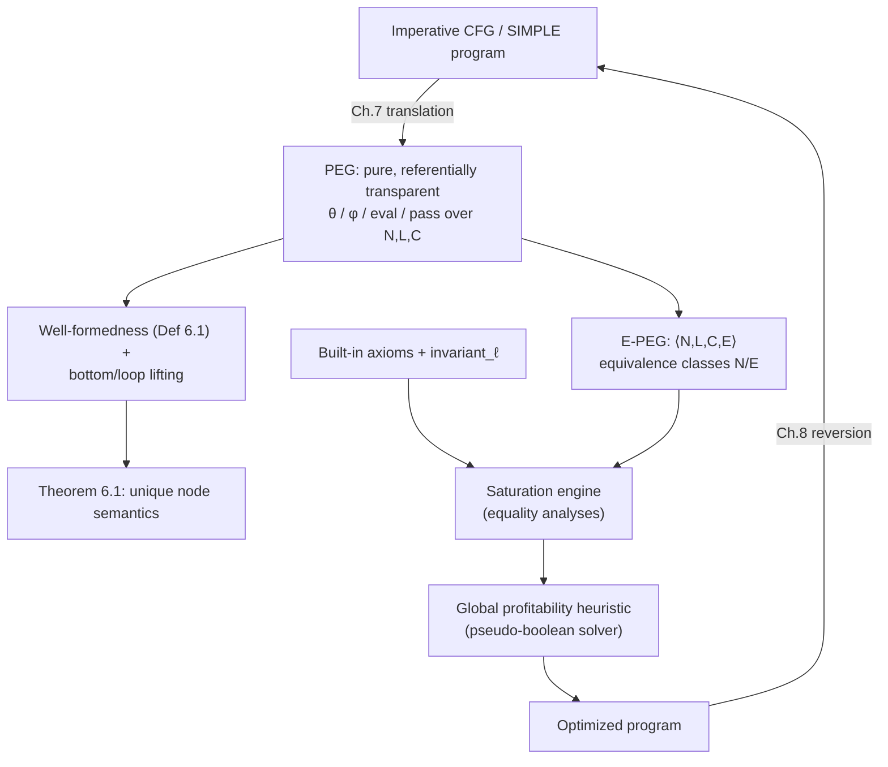

[[book-guidelines|↩ Back to guidelines]]

## Why a new IR at all

Start from the problem, not the representation. A compiler wants to try many rewrites of a program and eventually pick the best combination. The obstacle is *destructive* rewriting: the moment you replace `i * 5` with `i << 2 + i`, the original expression is gone. If some *other* rewrite — say, strength-reducing the whole loop so `i` itself becomes a cheap increment — needed to see the original multiplication to fire, you've silently disabled it. This is the phase-ordering problem, and it's not a bug in any particular optimizer; it's structural. Sequential, destructive IRs can only ever hold one version of the program at a time, so the compiler is forced to guess an order and live with the consequences.

The fix Tate proposes is to stop mutating the program and instead *accumulate equalities*. Keep every version simultaneously, encoded as one shared object, and only collapse it down to a single program at the very end, once a global cost model can look at everything at once. For this to work the underlying representation needs two properties that ordinary control-flow graphs (CFGs) don't have:

- **Referential transparency** — the value of a node depends only on the values of its children, never on *when* or *how many times* it's evaluated, or on any implicit machine state. This is what makes "replace node A with equal node B" a locally sound operation, with no non-local bookkeeping.
- **Completeness** — the representation needs no auxiliary structure (no separate CFG, no explicit control-flow edges) to be meaningful. A CFG-based SSA form is referentially transparent-ish for straight-line data, but it still needs the CFG's edges to know which φ-input is live; you can't just swap out a φ-node in isolation and trust the result.

Program Expression Graphs (PEGs) are Tate's answer: a graph representation of an *entire imperative function* — including its loops and branches — as a single, pure, recursively-defined expression, with no separate control-flow skeleton at all. Nothing here is a totally new idea in isolation (gated SSA already gave executable φ-nodes; functional/lambda encodings of loops existed too), but PEGs are the first representation designed specifically to make *equality reasoning over branching and looping imperative code* both sound and efficient — a design point earlier IRs never targeted, because none of them needed to support merging exponentially many program variants into one structure.

**[[Loop-and-Branch-Optimizations-Discovered-by-Saturation#What breaks without this|What breaks without this]]:** if you tried to do [[Equality-Saturation|equality saturation]] directly on a CFG, "two nodes are equal" would have to mean "two entire subgraphs, with their internal control-flow edges, compute the same thing" — a statement about *program state equality*, not value equality. That's a vastly harder thing to establish or exploit locally, and it's exactly the distinction PEGs are built to avoid (this becomes explicit in §6.4, discussed at the end).

## PEGs as algebraic expressions

Formally (§6.1, Definition, p. 45), a PEG is a triple $\langle N, L, C \rangle$:

- $N$ is a set of **nodes**.
- $L : N \to F$ is a **labeling function** mapping each node to a semantic function drawn from a set $F$ of built-in and domain operators (plus, minus, `if`, and the loop primitives introduced below).
- $C : N \to N^*$ maps each node to its ordered list of **children** (its arguments).

That's it — no separate edge set, no basic blocks, no explicit successor relation. A node "occurring in a loop" or "guarded by a branch" is just a node reachable through particular kinds of parent operators; there's no syntactic category distinguishing "loop code" from "straight-line code." This is the sense in which a PEG is an algebraic expression: like an AST, operators sit above the arguments that flow into them (the same top-down convention as E-graphs), and the whole thing denotes a single value via ordinary structural recursion,

$$\llbracket n \rrbracket = L(n)(\llbracket C(n) \rrbracket) \tag{6.1}$$

— except that the graph is allowed to be *cyclic*, because loops need to refer back to their own previous iteration's value. Untangling what that means precisely is most of the rest of this note.

**[[Domain-Independent-Applications-of-Generalization#Grounding|Grounding]] (Rust).** The closest everyday analogue is representing an AST as an arena of nodes with index-based (not pointer-based) children, which is exactly what lets you have cycles without fighting the borrow checker:

```rust
type NodeId = usize;

enum Op {
    Plus, Times, Const(i64),
    Theta(LoopId),          // theta node for loop `LoopId`
    Phi,                     // gated-SSA selector
    Eval(LoopId), Pass(LoopId),
    Param(String),
}

struct Peg {
    label: Vec<Op>,          // L : N -> F, indexed by NodeId
    children: Vec<Vec<NodeId>>, // C : N -> N*
}
```

A `Peg` here is *precisely* $\langle N, L, C \rangle$ with $N = \{0, \dots, \texttt{label.len}()-1\}$. Cycles are just indices that point "backward" in this arena — nothing special is required of the data structure, only of the well-formedness discipline you enforce on where those back-edges are allowed to occur (see below).

## Theta nodes: values that vary across iterations

The first construct that makes loops representable purely is the **theta node**, $\theta_\ell(A, B)$, one per loop-carried variable in loop $\ell$. Rather than representing "the value of `i` right now," a theta node represents the *entire sequence* of values that variable takes across all iterations of the loop:

- $A$ (the left child) is the value on the **first** iteration.
- $B$ (the right child) computes the value on the **current** iteration *in terms of the value on the previous iteration* — $B$'s subgraph itself refers back to the theta node.

Worked example, from the running loop-strength-reduction case (§2.1, Figure 2.2): for

```
i := 0;
while (...) { use(i*5); i := i+1; if (...) { i := i+3; } }
```

the value of `i` inside the loop is $\theta(0,\ \phi(\delta, i+1, i+3))$ — read informally as "starts at $0$; on later iterations, take whichever of `i+1` or `i+3` the branch condition selects, where `i` there means *this same theta node, one iteration back*." The self-reference is exactly the cycle Equation 6.1 has to make sense of, and it's why $\theta$ is treated as a primitive rather than something built from other operators: it is the loop-carried recurrence itself, expressed as one node.

**Grounding (Rust).** A theta node is precisely the recurrence you'd write with an explicit accumulator in a hand-rolled iterator:

```rust
// theta_l(base, step) as a lazy sequence — this *is* the semantics,
// just phrased operationally rather than denotationally.
fn theta(base: i64, step: impl Fn(i64) -> i64) -> impl Iterator<Item = i64> {
    std::iter::successors(Some(base), move |&prev| Some(step(prev)))
}
```

`theta(0, |i| i + 1)` is the loop-lifted value the PEG's $\theta$ node denotes — a whole sequence, not a single number. This is the crucial conceptual jump: a $\theta$ node is a value of a *sequence type*, not of the base type, until something extracts a specific element from it (which is exactly what `eval`/`pass` do below).

## Phi nodes: executable gated-SSA selectors

A **phi node**, $\phi(\mathit{cond}, t, f)$, merges two values based on a condition — but unlike a plain SSA φ-node, which has only two inputs (`true`-value, `false`-value) and relies on an *external* control-flow join to know at runtime which one to pick, a PEG φ-node carries its own condition as a third argument and is **executable by itself**:

$$\phi(\mathit{cond}, t, f)(i) = \begin{cases} \bot & \text{if } \mathit{cond}(i) = \bot \\ t(i) & \text{if } \mathit{cond}(i) = \mathrm{true} \\ f(i) & \text{if } \mathit{cond}(i) = \mathrm{false} \end{cases}$$

This is precisely gated SSA's contribution, and it's what makes φ a *pure function* rather than a syntactic marker that only makes sense next to a CFG join point. Because it's self-contained, a φ-node can be moved, duplicated, or replaced by an equal node without consulting any surrounding control-flow structure — which is exactly the completeness property PEGs need.

**Grounding (Rust).** This is `if cond { t } else { f }` as a first-class *value*, not a control-flow statement — the same shape as Rust's `if` expression (which, notably, already is an expression, not a statement, in Rust — a small hint that Rust's own design already leans toward this referentially-transparent framing):

```rust
fn phi<T>(cond: Option<bool>, t: T, f: T) -> Option<T> {
    match cond {
        None => None,        // cond = ⊥ (non-termination)
        Some(true) => Some(t),
        Some(false) => Some(f),
    }
}
```

**Grounding (Lean).** Since $\phi$'s definition is a plain case split on a boolean with no side effects, it's the direct semantic analogue of Lean's `cond` / `if-then-else` on `Bool` — total, decidable, and definitionally transparent: `cond c t f` reduces by `rfl` once `c` is a literal, exactly as $\llbracket \phi(\mathit{cond},t,f)\rrbracket$ "reduces" once $\mathit{cond}$'s value is known. The $\bot$ case has no counterpart in Lean's total `cond` — it's closer to lifting into `Option`, matching the Rust sketch above.

## Eval and pass: extracting values after a loop

$\theta$ gives you the *whole sequence* a variable takes across a loop. But most of the time you want *one* value out of that sequence — typically, the value after the loop terminates. Two more primitives handle this (§3.1):

- $\mathrm{pass}_\ell(\mathit{cond})$: given a sequence of booleans (the per-iteration value of the loop's exit condition), returns the index of the **first** iteration where it's true — i.e., the iteration count at which loop $\ell$ terminates. There is exactly **one** `pass` node per loop (there's only one [[The-Peggy-Implementation#Termination|termination]] point), even though there may be many `theta`/`eval` nodes (one per live variable).
- $\mathrm{eval}_\ell(\mathit{seq}, \mathit{idx})$: given a sequence and an index, returns the sequence's value at that index — i.e., projects a specific iteration's value out of a $\theta$-sequence (or any loop-lifted sequence).

Worked example (§3.1, Figure 3.1): for

```
for (i := 0; i < 29; i++) { i++; }
return i;
```

`i` inside the loop is $\theta(0,\ i+2)$ (the loop body increments twice: once from `i++` inside, once from the `for`'s own `i++`). The condition sequence is $i \geq 29$, so `pass(θ(0,i+2) ≥ 29)` is the exit iteration — $15$, since the loop's $15^\text{th}$ value (from $0$) is $30$, the first to satisfy $\geq 29$. The returned value is $\mathrm{eval}(\theta(0,i+2),\ \mathrm{pass}(\theta(0,i+2)\geq 29)) = 30$.

Why keep `eval`/`pass` as two separate primitives instead of one merged "get-final-value" operator? Tate is explicit about this design choice (§3.1, p. 25): a loop has exactly one termination iteration but potentially many live variables, so factoring out the *iteration count* as its own node avoids duplicating that reasoning per variable, and — more importantly — `eval`'s second argument doesn't always have to be a `pass` node. Loop peeling (Ch. 4) reuses `eval` with a φ-node or other special-purpose node as the second argument instead, which wouldn't be expressible if `eval`/`pass` were fused.

**Nested loops.** Each `theta`, `eval`, and `pass` node carries a loop-identifier subscript (§3.2, Figure 3.1(d)): a nested-loop program has one full theta/eval/pass triple per loop level, and the *inner* loop's theta node takes, as its base case, the value produced by evaluating the *outer* loop's state at the start of that outer iteration — exactly the "first iteration gets fed from the parent scope, later iterations recur on themselves" pattern, just one level deeper.

**Grounding (Python).** As a five-line sketch of the *operational* meaning (not the denotational one — see below), imagine running the loop concretely to compute both jointly:

```python
def theta_eval_pass(base, step, cond):
    i, n = base, 0
    while not cond(i):
        i = step(i)
        n += 1
    return i, n   # (eval result, pass result) — one loop, computed together
```

This is literally the optimization Tate notes in §6.1 (p. 50): although `eval`/`pass` look like two separate traversals denotationally, any real implementation — including Peggy's PEG-to-imperative reversion (Ch. 8) — computes them with a single loop, exactly as above.

## Loop lifting and bottom lifting: what a PEG value *is*

The definitions above were given informally against "a sequence of values." Making that precise is the point of §6.1's type machinery, and it matters because without it, Equation 6.1 (recursive node semantics) isn't obviously well-defined on a cyclic graph.

**Bottom-lifting.** Every type $\tau$ gets extended to $\tau_\bot = \tau \cup \{\bot\}$, where $\bot$ means "this computation doesn't terminate." This is standard domain-theoretic machinery — the same move behind denotational semantics for `while` loops in general (a fixed point in a CPO with $\bot$ as the least element) — imported here so that non-terminating loops have *some* well-defined value ($\bot$) rather than an undefined one.

**Loop-lifting.** A set $L$ of loop identifiers is fixed, partially ordered by nesting ($\ell < \ell'$ means $\ell'$ is nested inside $\ell$). An **iteration index** $i : L \to \mathbb{N}$ records, for every loop simultaneously, which iteration it's currently on (e.g. $i = [\ell_1 \mapsto 5, \ell_2 \mapsto 3]$: outer loop on iteration 5, inner loop on iteration 3). Writing $I = L \to \mathbb{N}$ for the set of all iteration indices, a **loop-lifted type** is

$$\tilde\tau = I \to \tau_\bot$$

— i.e. a PEG node of "type $\tau$" doesn't denote a single $\tau$-value, it denotes a *function from every possible iteration state to a (possibly-$\bot$) $\tau$-value*. This is precisely how $\theta$ manages to represent "the whole sequence at once" in the earlier informal description: $\theta_\ell(\mathit{base}, \mathit{loop})$ is a function of type $\tilde\tau$, defined by

$$\theta_\ell(\mathit{base}, \mathit{loop})(i) = \begin{cases} \mathit{base}(i) & i(\ell) = 0 \\ \mathit{loop}(i[\ell \mapsto i(\ell)-1]) & i(\ell) > 0 \end{cases}$$

— literally "at iteration $0$, return the base case; at iteration $n{>}0$, recurse on iteration $n{-}1$." This is where the earlier "the right child is the previous iteration's value" intuition becomes a formal equation.

$\mathrm{eval}_\ell(\mathit{loop}, \mathit{idx})$ and $\mathrm{pass}_\ell(\mathit{cond})$ are given analogous point-wise definitions (Figure 6.1), both built on a helper $\mathrm{monotonize}_\ell$, which propagates $\bot$ forward: once a sequence is undefined at some iteration of loop $\ell$, `monotonize` forces it to stay undefined at every later iteration too — formalizing "a loop that doesn't terminate by iteration $k$ has no defined value at iteration $k{+}1$" either.

Domain operators (`+`, `*`, comparisons, ...) are lifted the same way — first $\bot$-lifted (propagate $\bot$ through any operator applied to a $\bot$ input), then loop-lifted (apply pointwise across every iteration index) — which is why ordinary arithmetic axioms like distributivity carry over to $\theta$/$\phi$ "for free": $\theta(A,B) * m = \theta(A*m, B*m)$ holds precisely because multiplication, lifted this way, commutes with $\theta$'s pointwise definition.

**Grounding (Lean).** This is the cleanest correspondence in the whole topic. $\tau_\bot$ is `Option τ` (or, more faithfully to domain theory, `Part τ` — Lean's/Mathlib's type for possibly-nonterminating computations, which really does carry a "defined at this value, or not" structure rather than just a binary flag). $\tilde\tau = I \to \tau_\bot$ is then just a function type `I → Part τ`, and $\theta_\ell$'s definition above is literally a `match` on `i ℓ`:

```lean
def theta (base loop : (L → ℕ) → Part τ) (ℓ : L) : (L → ℕ) → Part τ :=
  fun i => match i ℓ with
    | 0     => base i
    | n + 1 => loop (Function.update i ℓ n)
```

The recursive call on `Function.update i ℓ n` is exactly $i[\ell \mapsto i(\ell)-1]$. This isn't a loose analogy — it's the same well-founded-ish recursion-on-a-natural-number pattern that shows up constantly in Lean when defining anything indexed by an iteration count, and it's a good model for *why* PEG well-formedness (next section) has to rule out certain cycles: Lean's termination checker would reject exactly the recursive definitions that PEG well-formedness also forbids, because both are protecting the same thing — that Equation 6.1 (or its Lean counterpart) actually picks out a *unique* value.

## Well-formedness: why cycles need rules

Equation 6.1, $\llbracket n \rrbracket = L(n)(\llbracket C(n) \rrbracket)$, is a system of *recursive* equations once the graph has cycles — and an arbitrary system of recursive equations need not have a unique solution (or any solution at all). Tate imposes three syntactic conditions (Definition 6.1, p. 48) to guarantee it always does:

1. **All cycles pass through the second child edge of a $\theta$.** I.e., the only way to have a cycle at all is via a loop's "next iteration" recurrence — you can't build a cyclic dependency out of ordinary operators. This is what makes $\theta$ a genuine primitive rather than sugar: it's the *only* source of recursion the formalism allows.
2. **A path from $\theta_\ell$, $\mathrm{eval}_\ell$, or $\mathrm{pass}_\ell$ to $\theta_{\ell'}$ implies $\ell' \leq \ell$, or the path passes through the first child of an $\mathrm{eval}_{\ell'}$ or $\mathrm{pass}_{\ell'}$.** Informally: code inside loop $\ell$ can't reach into an *inner* loop $\ell'$'s live state directly — it can only observe an inner loop's value after that inner loop has fully terminated (via that inner loop's own `eval`/`pass`, which is exactly the "first child" escape hatch named in the condition). Scoping, essentially — an outer iteration doesn't get to peek at an inner loop mid-flight.
3. **All cycles containing $\mathrm{eval}_\ell$ or $\mathrm{pass}_\ell$ contain some $\theta_{\ell'}$ with $\ell' < \ell$.** An inner loop's final result can't be defined self-referentially *except* by referring back to an outer loop's previous iteration — i.e. "this iteration's post-inner-loop value depends on last iteration's post-inner-loop value" is fine (that's condition (1)'s θ-cycle, one level up), but "this iteration's post-inner-loop value depends on itself" is not.

Given these three conditions, **Theorem 6.1**: every well-formed PEG has a unique semantic value $\llbracket n \rrbracket$ for every node $n$, by induction over the strongly-connected-component DAG of the graph combined with the loop-nesting partial order $\leq$. Intuitively: contract each SCC (which, by condition 1, is exactly one loop's recurrence) to a single unit, and the resulting DAG-of-SCCs, ordered by loop nesting, admits ordinary well-founded induction.

This is worth flagging explicitly against the learning-goals thread on judgment forms and well-formedness: these three conditions play *exactly* the role that context well-formedness / strict-positivity conditions play for inductive type definitions, or that a termination/well-foundedness check plays for a recursive function definition in a total language — a syntactic, checkable condition whose entire purpose is to guarantee that a system of equations that *looks* circular actually has a well-defined (here: unique) least/only solution. Rejecting a not-well-formed PEG is the direct analogue of Lean's kernel rejecting an ill-founded recursive definition or a non-strictly-positive inductive.

## Parameter nodes and substitution

A PEG can have **free variables** — parameters to the function it represents. These are modeled as **parameter nodes**: childless nodes whose label has the special form $\mathrm{param}(x)$ for a variable name $x$ (formally, the labeling function's codomain is extended to $L : N \to F \cup P$ where $P = \{\mathrm{param}(x)\}$). A PEG containing parameter nodes doesn't have well-defined node semantics on its own — $L(n)$ isn't a semantic function in $F$ for a parameter node — so Tate defines semantics via **substitution**: first replace every parameter with a constant, *then* apply Equation 6.1 to the now-parameter-free PEG.

Notation: $n[x \mapsto c]$ denotes $n$ with every descendant labeled $\mathrm{param}(x)$ replaced by (a lifted copy of) the constant $c$. Worked example (§6.1, Figure 6.2): a factorial function `X:=1; Y:=1; while(Y≤N){X:=X*Y; Y:=1+Y}; return X` has its return value represented by a PEG node $n$ containing a `param(N)` node; $n[N \mapsto 10]$ substitutes the constant $10$ for every occurrence, producing a fully closed PEG whose semantics are now well-defined by Theorem 6.1.

**Load-bearing connection.** This is precisely the substitution operation ($n[x \mapsto c]$) that underlies every substitution lemma in a type-theory soundness proof — the same operation as $\beta$-reduction's $t[x := u]$, or a Hoare-triple's substitution in the assignment rule $\{P[x \mapsto e]\}\ x := e\ \{P\}$. The reason it's worth pausing on here: notice that PEG substitution replaces a node by its descendants being rewired, i.e. it's a graph operation, not a term-tree operation — closer to how you'd implement substitution efficiently over a DAG/e-graph representation (share subterms, don't literally copy) than to the textbook tree-substitution most soundness proofs are stated over. If you're eventually implementing substitution over a DAG-shaped intermediate representation for a Hoare-logic soundness proof or an elaborator's metavariable instantiation, this is a concrete precedent for how to define it without paying an exponential blowup from naive copying.

## Built-in axioms and the invariance predicate

Because every primitive PEG operator has a precise mathematical definition (Figure 6.1), Tate can *prove* — not just assert — a core set of built-in identities that any equality-saturation engine over PEGs gets to use as sound rewrite rules (§6.3, p. 51; • means "doesn't matter"):

$$\theta_\ell(A,B) = \theta_\ell(\mathrm{eval}_\ell(A,0), B)$$
$$\mathrm{eval}_\ell(\theta_\ell(A,\bullet), 0) = \mathrm{eval}_\ell(A, 0)$$
$$\mathrm{eval}_\ell(\mathrm{eval}_\ell(A,B), C) = \mathrm{eval}_\ell(A, \mathrm{eval}_\ell(B,C))$$
$$\mathrm{pass}_\ell(\mathrm{true}) = 0$$
$$\mathrm{pass}_\ell(\theta_\ell(\mathrm{true}, \bullet)) = 0$$
$$\mathrm{pass}_\ell(\theta_\ell(\mathrm{false}, A)) = \mathrm{pass}_\ell(A) + 1$$

These aren't arbitrary — each is a theorem derivable from Figure 6.1's definitions, in the same spirit as deriving `map_id`/`map_comp` laws from a functor's actual implementation rather than asserting them. (Appendix A of the thesis catalogs the much longer practical list used in Peggy itself; these six are the ones formally justified in the main text.)

A second family of axioms depends on an **invariance predicate**: $\mathrm{invariant}_\ell(n)$ holds when $n$'s value provably does not vary across loop $\ell$'s iterations. This is a purely *syntactic* (Definition 6.2, p. 52), largest-predicate-satisfying-three-rules characterization:

1. Any node labeled $\theta_\ell$ is **not** invariant$_\ell$ (by construction, it's the thing that varies).
2. A node labeled $\mathrm{eval}_\ell$ is invariant$_\ell$ only if its *second* child (the index) is invariant$_\ell$ — the extracted value doesn't depend on which iteration you're on, but if the index itself varies with $\ell$, all bets are off.
3. Any other node (except one labeled $\mathrm{pass}_\ell$, which is *always* invariant$_\ell$ unconditionally) is invariant$_\ell$ only if **all** its children are invariant$_\ell$.

Note this is explicitly conservative — the definition says outright that "there are PEG nodes which are semantically invariant but do not satisfy [this] syntactic predicate." It's a sound *under-approximation* of true semantic invariance, computed by an optimistic (greatest-fixed-point-style) dataflow analysis — structurally the same shape as any syntactic over/under-approximation of a semantic property in program analysis (think: a conservative alias analysis, or a may/must dataflow fact). Given $\mathrm{invariant}_\ell(A)$, three more axioms become sound:

$$\mathrm{eval}_\ell(A, \bullet) = A \qquad x = A \text{ where } x = \theta_\ell(A, x) \qquad \mathrm{peel}_\ell(A) = A$$

— e.g. "evaluating a loop-invariant expression at any index just gives you the expression back," which is the formal justification for hoisting loop-invariant computations out of a loop, expressed purely as an equality rather than as a bespoke "loop-invariant code motion" pass.

**Connection worth flagging:** the invariance predicate is a small, concrete instance of exactly the abstract-interpretation pattern threaded through your compiler project — a syntactic, sound, greatest-fixed-point analysis over a program representation, used later (§10.3, cost modeling) to drive a decision (hoist or don't hoist) the way an abstract-interpretation-derived invariant would drive a verification or optimization decision elsewhere in a Hoare-logic pipeline. It's a useful small-scale template for "what does a dataflow analysis over a PEG/e-graph-shaped IR even look like," since most textbook dataflow presentations assume a CFG, not a DAG-with-loops-as-values IR.

## E-PEGs: equivalence classes of equal nodes

Everything so far describes a single PEG — one fixed way of expressing a computation. An **E-PEG** adds the ability to represent *many* equal expressions at once: formally (§6.2, p. 51), an E-PEG is a quadruple $\langle N, L, C, E \rangle$ where $\langle N, L, C \rangle$ is a PEG and $E \subseteq N \times N$ is a set of pairs of nodes asserting value equality, $\llbracket n \rrbracket = \llbracket n' \rrbracket$. $E$'s reflexive-transitive-symmetric closure $\sim$ partitions $N$ into equivalence classes; $[n]$ denotes $n$'s class, $N/E$ the set of all classes. Since a node's children can themselves belong to nontrivial equivalence classes, Tate also defines $\mathrm{params}(n) = ([n_1], \dots, [n_k])$ for $C(n) = (n_1, \dots, n_k)$ — a node's "arguments," properly speaking, are equivalence classes, not individual nodes.

Concretely, an E-PEG is drawn as a PEG with extra dashed edges connecting equal nodes (§2.2, Figure 2.2(b)) — those dashed edges are purely a visualization; the real representation groups nodes into classes directly (this is the practical implementation choice noted in §6.2 and elaborated in Ch. 10's Rete-based engine).

The payoff for the exponential-representation problem raised at the top of this note: each independent equality roughly doubles the number of distinct programs the E-PEG encodes, so $k$ independent dashed edges compactly represent up to $2^k$ program variants (the worked strength-reduction example, with 7 equalities, represents 128 variants — §2.2, p. 17) — all without copying a single node, because the variants differ only in *which representative* of each equivalence class you pick when reading the graph back out. A **saturation engine** repeatedly applies **equality analyses** (trigger pattern + callback that asserts new equalities) until no more equalities can be added or a bound is hit; a **global profitability heuristic** (in Peggy's case, a pseudo-boolean/integer-linear solver over a per-node cost model) then picks one representative node per equivalence class needed by the return value, yielding one concrete optimized program. This mechanism — merging, not rewriting — is what defeats the phase-ordering problem from the introduction: applying an axiom never removes the option of *not* applying it, so no order of axiom application can ever disable another axiom's applicability.

## Where this leads



Everything else in the thesis stands on this chapter's definitions. Chapter 7's translation from imperative code to PEGs has to produce well-formed PEGs (in the sense of Definition 6.1) or the translation is meaningless; Chapter 8's reversion back to imperative code exploits exactly the eval/pass single-loop optimization mentioned above. The built-in axioms and invariance predicate here are the *justified core* that Appendix A's much larger axiom catalog builds on for Chapter 10's actual Peggy implementation. And E-PEGs — the equivalence-class structure defined in §6.2 — are the object that equality saturation (formalized abstractly in Chapter 5, which this chapter concretizes) operates on throughout the rest of the thesis: [[Translation-Validation|translation validation]] (Ch. 12) builds one combined E-PEG from two programs and checks whether saturation unifies their outputs; [[Learning-Optimizations-from-Proofs|learning optimizations from proofs]] (Ch. 13–15) works by tracing *how* an E-PEG's equalities were derived and generalizing that derivation. None of that is expressible without first nailing down, as this chapter does, exactly what a PEG node denotes and exactly when two of them are allowed to be called equal.

For the standing compiler project, the most directly transferable pieces are: (1) the substitution mechanics ($n[x\mapsto c]$) as a DAG-native precedent for substitution lemmas you'll need for Hoare-triple soundness or elaborator metavariable instantiation; (2) well-formedness-as-termination-guarantee (Definition 6.1 / Theorem 6.1) as a worked example of turning "this recursive definition needs to be well-founded" into a checkable syntactic condition, the same move a kernel's positivity/termination checker makes; and (3) the invariant$_\ell$ predicate as a minimal, concrete template for a sound syntactic dataflow analysis over a non-CFG, expression-graph-shaped IR — worth revisiting once you're designing the abstract-interpretation layer over your own IR.
