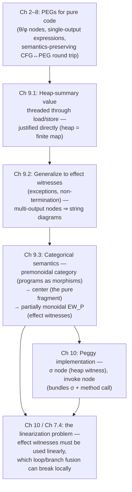

[[book-guidelines|↩ Back to guidelines]]

# Representing Effects in PEGs

## The problem: purity is free, until it isn't

A Program Expression Graph (PEG) is a graph where every node is a mathematical function of its inputs — no hidden state, no implicit ordering. That's what makes [[Equality-Saturation|equality saturation]] work at all: if `n1` and `n2` denote the same value, you can substitute one for the other *anywhere*, because "value" is all a PEG node has. There's no notion of "but this one has to run before that other thing" baked into the graph, because there's no "running" — there's only evaluating a function.

Real programs load and store memory, throw exceptions, and sometimes just don't terminate. All three of these break the assumption that a node's meaning is a pure function of its explicit inputs:

- **Loads and stores.** `load(addr)` doesn't just depend on `addr` — it depends on *when* you run it relative to other stores. In a CFG, program order pins this down for free. In a PEG, there is no program order — two nodes are only ordered if data actually flows from one to the other.
- **Exceptions.** `a / 0` doesn't return an integer at all in the exceptional case — it diverts control. A PEG node is supposed to always produce a value of a fixed type; "sometimes I throw instead" isn't representable as an ordinary function.
- **Non-[[The-Peggy-Implementation#Termination|termination]].** A PEG only evaluates the nodes reachable from the return value. An infinite loop that computes nothing anyone uses (a `while(true){}` inserted for, say, a side effect that got optimized away, or just dead code) is *unreachable* from the return value — and PEGs will happily discard it. But discarding it changes whether the program terminates. Silently turning a hanging program into a terminating one is not a legal compiler transformation.

So the question this chapter answers is: how do you keep a representation with *no evaluation order at all* honest about effects that are fundamentally about order and partiality — without regressing to "just bolt a CFG back on"? Tate's answer has two layers: first an engineering trick (thread a value representing "the state of the world" through effectful nodes), then a categorical argument for *why* that trick is semantically sound in general, not just for the one case (the heap) where it's semantically obvious.

## Layer 1: heap-summary values, threaded through load and store

Start with the case where the trick is easiest to justify: the heap.

In imperative code, `load` takes one argument (an address). In the PEG, Tate makes `load` take **two** arguments: the address, and a value representing the *entire state of the heap* at that point. Symmetrically, `store` takes three arguments — address, value to write, and the incoming heap state — and produces **one output**: the resulting heap state.

```
store(addr, val, heap_in) → heap_out
load(addr, heap_in) → value
```

If the source code stores and then immediately loads from the same address, the translation wires the `heap_out` of the `store` node directly into the `heap_in` of the `load` node. Sequential dependence, which imperative syntax expressed positionally ("this line, then that line"), is now expressed the only way a PEG can express anything: as a data dependency. Two effectful operations are ordered *if and only if* one's heap output feeds another's heap input.

Why is this semantically legitimate, not just a hack that happens to produce the right output? Because you can literally define `load` and `store` as ordinary total mathematical functions once you fix what a "heap state" *is*: a heap summary is just a function (or finite map) from addresses to values.

$$
\text{load}(a, h) = h(a) \qquad \text{store}(a, v, h) = h[a \mapsto v]
$$

Both are pure functions on an explicit heap-summary value — nothing hidden, nothing effectful in the mathematical sense. The imperative program never manipulates this heap summary directly (it just writes `x[i] = 3`), but the PEG makes it an explicit value flowing through the graph, and *that* is what lets equality saturation reason about heap operations with the same substitution-of-equals-for-equals machinery it uses for arithmetic. Tate notes this is essentially the "effect witness" idea used by Terauchi et al. to embed heap operations into pure functional programming, with one difference: their `load` also outputs a heap state (useful for actually *executing* the representation), while Tate's doesn't need to, though he notes the need resurfaces when reverting effectful PEGs back to CFGs (Stepp's thesis, and Chapter 10 of this one).

**[[Loop-and-Branch-Optimizations-Discovered-by-Saturation#What breaks without this|What breaks without this]]:** without threading a heap value, two loads from the same address with an intervening store in between would look like two calls to the same pure function `load(addr)` — indistinguishable, hence freely substitutable for each other by equality saturation. That's simply wrong once there's a store in between. The heap-summary value is what makes the store *visible* to the load as a changed argument, so the two loads are provably different PEG nodes.

**[[Domain-Independent-Applications-of-Generalization#Grounding|Grounding]] (Rust).** This is precisely the "threading a `&mut World`" pattern, except made explicit and *pure*: instead of mutating in place, you pass the old state in and get a new one out, like a persistent/immutable data structure update:

```rust
// Not how you'd actually write it (real code mutates), but this is
// the PEG-faithful, purely functional shape of load/store:
type Heap = im::HashMap<Addr, Value>; // persistent map, cheap "new" heaps

fn store(heap_in: &Heap, addr: Addr, val: Value) -> Heap {
    heap_in.update(addr, val)   // returns a *new* Heap value, heap_in untouched
}

fn load(heap_in: &Heap, addr: Addr) -> Value {
    heap_in.get(addr).cloned().unwrap()
}
```
Rust's ownership discipline is a useful lens here in reverse: normally `&mut Heap` *forbids* aliasing so mutation is safe. The PEG heap-summary trick goes the other way — it makes every "mutation" produce a *new* value, so there's nothing to alias, and the old caveats about ordering get replaced by ordinary dataflow (SSA-like: you can only use the `Heap` value that's actually in scope at that point in the graph).

## Layer 2: generalizing to arbitrary effects — effect witnesses

The heap trick generalizes cleanly because a heap summary is a genuinely well-defined mathematical object independent of the code that manipulates it. Exceptions are not so friendly.

Take integer division. In Java, `a / 0` throws `ArithmeticException`. Tate first tried representing this with explicit control flow in the PEG — and found it painful for both equational reasoning and for reverting PEGs to CFGs. So instead he reused the heap idea, generalized: an **effect witness** is an extra value threaded into and out of any operation that might be affected by, or might affect, some notion of "the state of the world" — heap contents, whether an exception has occurred, whether a loop has diverged, etc.

Concretely, division becomes a node taking three inputs (dividend, divisor, incoming effect witness) and producing **two** outputs (the quotient, and the outgoing effect witness):

$$
\div : (\text{int}, \text{int}, EW) \to (\text{int}, EW)
$$

Since a PEG node can now have more than one output, Tate needs a way to pick a single output back out — hence little **projection nodes**, written $\rho$, that select one component of a multi-output node. Concretely (from Figure 7.6 of the thesis, using a *non-termination* effect witness rather than exceptions — the same technique, applied to the "does this operation possibly not terminate" effect):

```
x = a / 0; retvar = 13;
```

Without an effect witness, the PEG for this is just the constant node `13` reachable from the return value — the division-by-zero subgraph is orphaned (nothing flows from it to the return value) and equality saturation will happily prune it, silently turning a program that hangs (if `/` is defined to diverge on zero) into one that returns `13` immediately. That's a semantics-changing "optimization" — exactly the failure mode motivating this whole chapter.

With an effect witness: `÷` takes an incoming effect witness $\varepsilon$ and the operands, and outputs a pair $(\rho_v, \rho_e)$ — the value projection and the effect projection. The function's overall output is now *also* a pair: the return value **and** the final effect witness. Because the final effect witness is reachable from an output of the function, and the effect witness threads back through the divide node, the divide node is reachable too — so it survives saturation and reversion, even though its value output ($\rho_v$) is never used.

**The conceptual shift this forces.** Up to this point a PEG node has one output — it's a graph of *expressions*. The moment a node can have multiple outputs, you've quietly changed the underlying formalism: this is no longer expression-land, it's the world of **string diagrams** — graphical notation for morphisms in a monoidal category, where "wires" can fan out into multiple typed outputs and combine multiple typed inputs. Tate is explicit that the projection nodes are an implementation convenience to keep things looking expression-shaped; the essential structure is multi-output diagrams. This reframing is what licenses pulling in category theory for the semantic justification in Section 9.3 — and it's what forces the question the rest of this article answers: heap-summaries had an obvious semantic story (finite maps, done). What's the analogous story for effect witnesses in general, where "what does it mean" isn't as obviously a total function?

**Grounding (Rust).** The multi-output node is exactly a function returning a tuple, and the projection nodes are exactly `.0` / `.1` field access:

```rust
enum DivOutcome { Ok(i64, EffectWitness), Threw(EffectWitness) }

fn div_with_effect(a: i64, b: i64, ew: EffectWitness) -> DivOutcome {
    if b == 0 {
        DivOutcome::Threw(ew.record_exception())
    } else {
        DivOutcome::Ok(a / b, ew)
    }
}
// ρ_v projects the Ok value; ρ_e projects the effect witness regardless of branch.
```
Note the enum already hints at the real difficulty ahead: in the `Threw` case there *is no* integer to project. This is exactly the semantic gap that breaks the heap-summary style justification, which we address next.

## Layer 3: why "just a function on states" stops working, and the categorical fix

Here's the crux of the chapter, and the reason it needs category theory at all instead of just "define effect witnesses as some data type, like we did for heaps."

For the heap, `store` really is total: give it any heap and any address/value, and it produces a new heap — no case where the operation "doesn't have" an output. But division-with-exceptions is *not* total in that shape: if there's an exception, there is no integer to output. You cannot write $\div : (\text{int}, \text{int}, EW) \to (\text{int}, EW)$ as an honest total function the way you could for the heap, because on the exceptional branch the "int" slot is simply empty. The heap-summary justification — "it's just a pure mathematical function on an explicit extra argument" — doesn't extend, because the *shape* of effectful operations (partial, branching, sometimes producing nothing of the expected type) is fundamentally different from the heap's (total, uniform).

So Tate reaches for category theory to answer a more structural question: **under what conditions is it legitimate to rearrange nodes in an effectful PEG, or place two effectful subgraphs "side by side" with no direct data dependency between them, and be guaranteed the result means the same thing?** This is precisely the question equality saturation needs answered, because equality saturation's entire value proposition is rewriting/rearranging graphs while preserving meaning.

### Categories, briefly, and why they fit imperative programs

A category has objects, morphisms between objects, a way to compose morphisms, and an identity morphism per object. Tate's first observation: **programs are already morphisms**. A program (or program fragment) $p$ has an input context $\Gamma$ (its free variables/parameters, with types) and an output context $\Gamma'$ (the variables/values it produces) — read $p : \Gamma \to \Gamma'$. Sequencing two programs is composition. The empty program (or a program that just copies its inputs to its outputs) is the identity.

### Premonoidal categories: threading unused context

Typical imperative programs have more structure than a bare category gives you: if $p : \Gamma \to \Gamma'$ and you have some unrelated fresh variable $x : \tau$ sitting around, there's automatically a program $\Gamma, x{:}\tau \to \Gamma', x{:}\tau$ that runs $p$ and passes $x$ through untouched. This is formalized with a **premonoidal category**: a category equipped with a binary operation on objects $\otimes$ (context-combining — think "and, in parallel"), together with, for every object $\bar G$, a *functorial* action extending any $f : G \to G'$ to $f \otimes \bar G : G \otimes \bar G \to G' \otimes \bar G$ (and symmetrically $\bar G \otimes f$ on the left). "Functorial" here just means this extension respects identities and composition — extending-with-unused-context is a well-behaved operation, not an ad hoc patch.

Crucially, a premonoidal category does **not** give you a bifunctor $\otimes$ on morphisms directly — you can extend a single morphism $f$ with idle context on either side, but you cannot in general combine two *different* nontrivial morphisms $f_1 \otimes f_2$ into one, because which one "goes first" can matter.

### Monoidal categories: the pure special case

Now suppose the language is pure. Given $p_1 : \Gamma_1 \to \Gamma_1'$ and $p_2 : \Gamma_2 \to \Gamma_2'$, you can build "run $p_1$ then $p_2$" as $(p_1 \otimes \Gamma_2)$ followed by $(\Gamma_1' \otimes p_2)$, or you could equally build "run $p_2$ then $p_1$" as $(\Gamma_1 \otimes p_2)$ followed by $(p_1 \otimes \Gamma_2')$. If both programs are pure, these two composite programs are semantically *identical* — order genuinely doesn't matter — so you can collapse both into a single well-defined morphism $p_1 \otimes p_2$, "run both, side by side." A category where $\otimes$ is a genuine **bifunctor** on morphisms (i.e., this side-by-side combination is always defined and well-behaved) is a **monoidal category**. It's a premonoidal category with the extra guarantee that order of execution among disconnected pieces never matters.

This is exactly why pure PEGs were trouble-free: nodes with no dataflow between them can be evaluated in any order (or none, or in parallel) because nothing depends on which happens "first" — there is no "first." **String diagrams are the internal graphical language of monoidal categories** — this is precisely what licenses drawing a PEG as a graph with no explicit ordering in the first place.

### The center: where purity lives inside an impure world

A realistic language mixes pure and impure code. Categorically, the "pure" morphisms of a premonoidal category — pure *relative to everything else*, not just internally simple — are exactly the ones in its **center**. Formally, $f : G \to G'$ is in the center if for every other morphism $\bar f : \bar G \to \bar G'$, the two ways of sequencing $f$ and $\bar f$ side-by-side agree:
$$
(f \otimes \bar G) \, ; \, (G' \otimes \bar f) \;=\; (G \otimes \bar f) \, ; \, (f \otimes \bar G')
$$
(and symmetrically with left/right swapped). In words: $f$ commutes with *anything*, so it truly doesn't matter whether $f$ or $\bar f$ conceptually "runs first." The center of a premonoidal category is always itself a monoidal category — order-irrelevance restricted to the pure subset recovers the nice bifunctor structure. When the tensor $\otimes$ on the center happens to be the categorical product, this construction becomes (a mild specialization of) **Freyd categories**, which are known to be equivalent to **arrows**, which generalize **strong monads on Cartesian categories** — the standard toolkit functional programmers already use to model effects (`IO`, `State`, etc.). Tate is pointing at a real, well-trodden line of work here, not inventing new abstract nonsense.

The important negative fact: **impure operations necessarily fall outside the center.** An operation like division-with-exceptions genuinely does *not* commute with arbitrary other effectful operations — swapping the order in which two divisions-that-might-throw execute can change which exception (if any) is observed first, or whether a heap read sees the effects of the other. That's what makes it impure. So you cannot simply say "everything is in some monoidal category" — the whole point of drawing the effect/purity line is that impure operations break exactly the guarantee ($f \otimes \bar f$ well-defined and order-irrelevant) that monoidal categories provide.

### Partially monoidal categories: the actual model for effectful PEGs

If effectful operations genuinely can't be placed "side by side" with order-irrelevance in general, how can effectful PEGs be a coherent diagram language at all? This is where **effect witnesses do their real semantic job**, not just their engineering job.

The intuition Tate builds on: **there is only one effect witness live at any point in the diagram.** Two subgraphs can sit side-by-side (be combined with $\otimes$, in string-diagram terms: drawn with no wire between them) *only if* at most one of them touches the live effect witness. If both do, you cannot place them side by side, because that would require two "current states of the world" to coexist — meaningless.

This motivates a **partially monoidal category**: like a monoidal category, but $\otimes$ is only a *partial* bifunctor. Given $f_1 : G_1 \to G_1'$ and $f_2 : G_2 \to G_2'$, the combination $f_1 \otimes f_2$ is defined *whenever* $G_1 \otimes G_2$ and $G_1' \otimes G_2'$ are defined — and undefined otherwise. Wherever it *is* defined, though, you get the full monoidal guarantee: order genuinely doesn't matter.

Tate makes this precise by building, from any premonoidal category $P$, a partially monoidal category $EW_P$ (his "effect witness" construction):

- Every object $G$ of $P$ gives rise to two objects: $\bar G$ ("$G$ without a live effect witness") and $\hat G$ ("$G$ with a live effect witness").
- Morphisms $\bar G \to \bar G'$ are morphisms of $P$'s *center* (pure operations, no effect witness needed) from $G$ to $G'$. Morphisms $\hat G \to \hat G'$ are *arbitrary* morphisms of $P$ from $G$ to $G'$ (they may be impure, hence need the effect witness). There are no morphisms crossing between "witnessed" and "unwitnessed" objects.
- Identities and composition are inherited directly from $P$.
- $\bar G \otimes \bar G'$ is defined as $G \otimes G'$ (two effect-witness-free things can always sit side by side — no conflict). $\bar G \otimes \hat G'$ and $\hat G \otimes \bar G'$ are defined as $\widehat{G \otimes G'}$ (a witnessed thing next to an unwitnessed thing is fine — still only one live witness). But $\hat G \otimes \hat G'$ is **undefined** — two live effect witnesses cannot coexist side by side.
- On morphisms, $f_1 \otimes f_2$ is defined exactly when the corresponding condition on objects holds — which, by construction, only happens when the combination is safe.

This is the formal payoff: **given a valid effectful PEG (or string diagram), any rearrangement of it is also valid and has the same semantics** — exactly the guarantee equality saturation needs to justify treating "logically independent" subgraphs as freely reorderable, while still correctly refusing to reorder two operations that share a live effect witness (because for those, $\otimes$ is simply not defined — there is no rearranged diagram to be equal to). Tate notes the real Peggy implementation goes further still — using several *kinds* of effect witnesses and sometimes allowing more than one to be live at once (e.g. the heap-summary value specifically, since a heap really is a well-defined total object as shown in Layer 1) — but leaves a full generalization of this partially-monoidal treatment to future work.

## Where this leads

Structurally, this chapter is the semantic hinge between "PEGs as a clean equational theory for pure code" (Chapters 2–8) and "PEGs as a practical intermediate representation for real, effectful languages" (Chapter 10 onward):



Two concrete downstream dependencies worth flagging explicitly:

1. **The linearization problem** (Chapter 10, and previewed with the non-termination example in Section 7.4): once effect witnesses exist, generated code must use each one *linearly* — thread it through exactly once, in order. Branch and loop fusion (from Chapter 8's reversion process) can produce PEGs where a *global* linear ordering of effect witnesses exists but no *local*, per-fusion-step ordering does, making the problem locally unsolvable even though it's globally solvable. That's a direct consequence of the partiality baked into $EW_P$'s tensor here.
2. **Peggy's $\sigma$ node and `invoke` node** (Chapter 10) are literally the heap-summary effect witness and a bundled effectful-call node, respectively — the engineering realization of exactly the machinery this chapter justifies.

**Connection to the standing project.** This chapter is a clean instance of a pattern worth internalizing for the refinement-type/verification compiler: *threading an explicit state value through otherwise-pure operations to make effects reasoning-friendly* is exactly what Hoare-logic verification-condition generation does when it carries a symbolic heap/store through weakest-precondition computation, and it's exactly what a `State` monad or Lean's `IO` does at the type-theoretic level — the effect witness *is* the value a strong monad would bind. The center-of-a-premonoidal-category idea is the categorical name for "the fragment of your language where definitional-equality-style reasoning is sound without worrying about evaluation order" — worth remembering when deciding, in a refinement-type checker, which operations a solver is allowed to reorder or common-subexpression-eliminate freely (pure, effect-witness-free terms) versus which must stay linearly ordered relative to the rest of a proof obligation (anything touching a live effect/heap witness). The partial-bifunctor trick — "this combination is defined only when it's safe, and where it's defined it's fully well-behaved" — is also a useful shape for CSP/constraint-propagation code: rather than a total combinator with side conditions checked after the fact, make illegal combinations *not type-check* at the level of the "objects" (contexts/domains) so the CSP kernel can't even construct an unsound composite in the first place.

**Grounding note.** This topic's core content — load/store representation, effect witnesses, string diagrams — grounds well in Rust (shown above: persistent-map heaps, tagged enums for partial operations). The categorical machinery of Section 9.3 (premonoidal categories, the center, partially monoidal categories) is, per the style guide's rule for type-/proof-theoretic material, better grounded in Lean: Lean's `IO` monad and its `EStateM`/`StateT` machinery are a strong monad on a Cartesian category in exactly the sense the thesis cites (Freyd categories $\cong$ arrows $\cong$ strong monads), and Lean's kernel treating two terms as definitionally equal only when no effectful reduction distinguishes them (`rfl`/`isDefEq` never fire across an `IO` boundary) is a concrete, everyday instance of "the center is where free rearrangement/substitution is sound, and effectful terms are excluded from it by construction."
