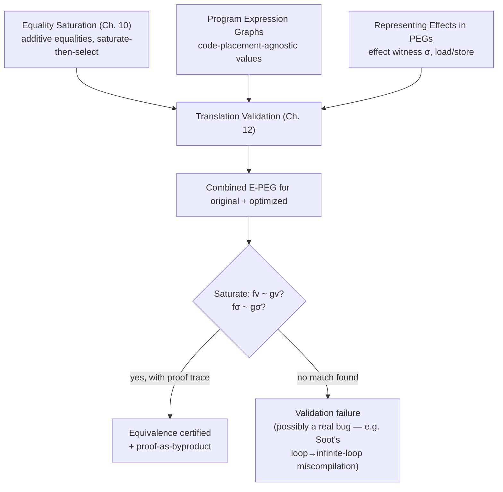

[[book-guidelines|↩ Back to guidelines]]

# Translation Validation

## The problem: trusting the optimizer is a different problem than building it

Everything in the earlier chapters is aimed at *finding* good optimizations: build a combined representation of many equivalent programs (an E-PEG), saturate it with equalities, let a profitability heuristic pick the best one out of the pile. That machinery answers "what is the best program equivalent to this one?"

Translation validation asks a narrower, and in some ways harder-to-dodge, question: **given two programs — an original and something a compiler claims is an optimized version of it — are they actually equivalent?** This is not a search problem. You already have both candidates. You don't need to explore the space of equivalent programs; you need to *certify* that one specific pair of points in that space coincide.

Why does that matter as a separate concern from optimization itself? Because "the compiler is correct" and "the compiler's own reasoning about correctness is correct" are different claims. Peggy's own profitability heuristic (the pseudo-boolean solver from [[Equality-Saturation|Chapter 10]]) never even needs to be trusted here — you can use Peggy purely as a *checker* for optimizations chosen by a completely different, unrelated compiler: Soot, LLVM, anything that hands you a before/after pair. This is the compiler-construction analogue of the difference between a type inferencer and a type *checker* — the checker's job is smaller, and correspondingly its trusted computing base can be smaller too. (If you're building a verifier with a proof-producing architecture, this is exactly the shape you want: an untrusted search process — the compiler's own optimizer — paired with a much simpler, independently-verifiable checking process that doesn't have to trust the search at all.)

**[[Loop-and-Branch-Optimizations-Discovered-by-Saturation#What breaks without this|What breaks without this]]:** without translation validation, you have two bad options. Either you *prove the optimizer correct once, in general* — a huge, whole-compiler proof effort (this is what CompCert does, at enormous cost) — or you *trust it and hope*, discovering miscompilations only when someone's binary segfaults in the field. Translation validation is a third path: prove correctness *per compilation*, automatically, using much cheaper machinery than a whole-compiler correctness proof, and cheaply enough to run on every build.

The thesis's central observation is that equality saturation is already almost exactly the right tool for this job, because "prove $A$ and $B$ are equivalent" and "search for equalities" are much more alike than they first look.

## The core idea: put both programs in one E-PEG and let saturation find the seam

Here is the reframing, stated plainly: **build the PEGs of the original program and the optimized program *inside the same E-PEG*, sharing structure wherever the two programs happen to compute the same thing, and then run ordinary equality saturation.** If saturation ever proves that the two programs' return values are equal, *and* that their effects on memory are equal, you have a machine-checked proof that the programs are equivalent.

This is worth pausing on, because it means translation validation isn't a new algorithm bolted onto equality saturation — it's the *same* saturation engine from [[Equality-Saturation|Chapter 10]], run on a differently-constructed input. Recall a PEG is referentially transparent: a node's value depends only on the values of its children, never on control-flow position or timing. That's exactly the property that licenses building both programs into one graph and letting shared subexpressions merge for free — `t & 4` computed in both `f` and `g` below is *literally the same node*, not two nodes later proven equal.

**[[Domain-Independent-Applications-of-Generalization#Grounding|Grounding]].** In Rust terms, imagine both functions compiled to the same arena-allocated DAG, where `HashCons` interning means two calls to `build_and(t, 4)` return the same node index if their operand nodes already coincide:

```rust
struct EPeg {
    nodes: Vec<PegNode>,
    // union-find over node ids; find(a) == find(b) means "proven equal"
    uf: UnionFind,
}

fn combined_epeg(f: &Peg, g: &Peg, epeg: &mut EPeg) -> (NodeId, NodeId) {
    // Insert both PEGs into the same arena with hash-consing,
    // so structurally identical subgraphs (like `t & 4`) collapse
    // into one node automatically — no equality proof needed for that part.
    let f_root = epeg.insert(f);
    let g_root = epeg.insert(g);
    (f_root, g_root)
}
```

Validation then reduces to: run `Saturate` (the same fixpoint loop from Figure 10.3 of the thesis — apply triggered axioms until none fire) and afterward check `epeg.uf.find(f_v) == epeg.uf.find(g_v)` and `epeg.uf.find(f_σ) == epeg.uf.find(g_σ)`, where $f_v, g_v$ are the value results and $f_\sigma, g_\sigma$ are the *effect witnesses* (the heap-summary tokens threaded through `load`/`store`, introduced in the companion [[Representing-Effects-in-PEGs|Representing Effects in PEGs]] article). Equal value **and** equal effect is the full equivalence condition — a program that returns the right answer but corrupts memory differently is not validated.

## Worked example: copy propagation and dead-store elimination

The thesis's Example 1 is small enough to carry the whole idea. LLVM transforms:

```c
int f(p,t) {              int g(p,t) {
  *p := t                   *p := t | (t & 4)
  *p := *p | (t & 4)        return 0
  return 0                }
}
```

LLVM did two things here: copy-propagated `*p` to `t` (since the first store makes them equal), and then eliminated the now-dead first store. Building the combined E-PEG, the thesis reports the proof as exactly three steps:

1. **①** Add the equality $\mathrm{load}(\mathrm{store}(\sigma, p, v), p) = v$ — a *load-after-store axiom*: reading back what you just wrote returns what you wrote. Applied to `f`'s second statement, this collapses `load(store(σ,p,t), p)` down to `t`, i.e. proves `*p` (right after `*p := t`) equals `t`. This is copy propagation, discovered as a byproduct of an axiom nobody wrote specifically to do copy propagation.
2. **②** Add an equality by **congruence closure**: $a = b \Rightarrow f(a) = f(b)$. Since `load(...)` was just proven equal to `t`, everything built on top of it — here, `t | (t & 4)` — is automatically proven equal to the corresponding expression built on `t` directly. Congruence closure is what makes a *local* axiom application propagate through the whole graph without anyone re-deriving anything by hand.
3. **③** Add the equality $\mathrm{store}(\mathrm{store}(\sigma, p, v_1), p, v_2) = \mathrm{store}(\sigma, p, v_2)$ — a *dead-store axiom*: two consecutive stores to the same location leave only the second store's effect. This proves `f`'s two stores have the same net effect as `g`'s single store.

Once step ③ lands, $f_\sigma$ and $g_\sigma$ are in the same equivalence class, and $f_v = g_v = 0$ was already trivial (both functions literally `return 0`). Equivalence proved — no rewriting, no destructive transformation, just three additive equalities and one union-find merge.

Notice something important: this is *not* a search for the best program. Peggy never had to consider whether the transformation was profitable, never had to guess that copy propagation followed by dead-store elimination was a good idea. It only had to check whether the axioms it already trusts *happen* to bridge the gap between two programs somebody else already produced.

## Alias-dependent load/store axioms, and why alias info is precomputed rather than derived

The load-after-store axiom above is "safe" in the strongest sense — it holds unconditionally, because `p` is syntactically the same node on both sides. But most of the interesting axioms about memory require knowing that two *different-looking* pointer expressions don't alias. The thesis gives:

$$p \neq q \;\Rightarrow\; \mathrm{load}(\mathrm{store}(\sigma, q, v), p) = \mathrm{load}(\sigma, p)$$

Read this as: *if $p$ and $q$ provably point to different locations, then a store to $q$ is invisible to a load from $p$* — you can slide the load "underneath" an unrelated store. This axiom is what let the thesis's Example 2 (a `strchr` call reordered around a redundant reload of `*p`) validate: LLVM knew, via an `only-reads` annotation on the standard-library `strchr`, that the call couldn't touch `*p`, so the second `load *p` is provably redundant.

The interesting engineering decision here is *how* $p \neq q$ gets established. The thesis's first attempt encoded alias analysis itself as a set of saturation axioms — i.e., let the same additive-equality machinery infer disequalities the way it infers equalities. This is conceptually clean but turned out to add **significant runtime overhead**. So the actual implementation takes the approach from prior work (Tristan et al.) instead: **run a conventional alias analysis once, as a precomputation pass outside the E-PEG, and feed its results in as side conditions that gate axiom triggers.** This is a pragmatic, load-bearing tradeoff: saturation stays in charge of *value* and *effect* equality (where its additive, order-independent machinery is uniquely valuable), while a separate, specialized, non-saturation analysis handles *aliasing* (where a purpose-built algorithm is just faster). Not every fact needs to be discovered inside the same fixpoint.

**Grounding.** This is the same division of labor you'd expect in a Rust-based verifying compiler: alias/points-to analysis as a precomputed side table (`HashMap<(NodeId, NodeId), AliasResult>` populated once via a Steensgaard- or Andersen-style pass), consulted as a guard when an axiom's trigger pattern matches:

```rust
enum AliasResult { MustAlias, MustNotAlias, MayAlias }

fn try_fire_disjoint_load_store(
    epeg: &EPeg, alias: &AliasInfo, p: NodeId, q: NodeId, sigma: NodeId, v: NodeId,
) -> Option<Equality> {
    match alias.query(p, q) {
        AliasResult::MustNotAlias => Some(Equality::new(
            load(store(sigma, q, v), p),
            load(sigma, p),
        )),
        _ => None, // MayAlias or MustAlias: axiom cannot safely fire
    }
}
```

Note the asymmetry: `MustNotAlias` licenses the axiom; anything weaker (`MayAlias`) must block it, since unsoundly firing this axiom would let the validator "prove" two programs equivalent when they aren't — the one failure mode a *checker* can never afford, unlike an *optimizer*, which can simply miss an opportunity without being wrong.

## Loop-invariant code motion: validated by conversion alone, no saturation needed

The thesis's third example is the most conceptually sharp one, and it's a direct answer to a genuinely deep question: **why can PEG-based translation validation prove loop-invariant code motion (LICM) correct without running equality saturation at all?**

```c
int f(x,y,z) {                    int g(x,y,z) {
  for (t:=0; t<z; t:=x*y+t) {}      xy := x*y
  return t                          for (t:=0; t<z; t:=xy+t) {}
}                                    return t
}                                  }
```

`g` hoists `x*y` out of the loop into `xy`, computed once instead of on every iteration. In a CFG-based representation, `f` and `g` are visibly different graphs — one has a multiply inside the loop body, the other has it before the loop. Making them match requires either a code-motion-aware equivalence check or an explicit rewrite rule for hoisting.

In PEG form, they are *the same graph*, syntactically. This is because — as established when [[Program-Expression-Graphs-(PEGs)|PEGs were first introduced]] — a PEG node names a *value*, not a *place in a schedule*. `x*y` inside a loop invariant to `x*y`, and `x*y` computed once before the loop, denote the identical value: the loop's `θ` (theta) node for the induction variable already encodes "compute `x*y+t` on each iteration starting from `0`," and whether that multiplication is textually written inside or outside the loop body is a code-*generation* decision PEGs simply don't represent. Converting both `f` and `g` to PEG independently, without ever invoking the saturation engine, produces byte-for-byte the same graph.

This is the deepest sense in which PEG-based validation differs from CFG-based (or rewrite-based) validators: **an entire, historically hard-to-validate class of optimizations — code motion, scheduling, lazy code motion — becomes free**, collapsing from "needs a bespoke equivalence argument" to "needs no argument, because the representation already identifies them." Saturation is reserved for the cases where the two programs are *not* already syntactically identical PEGs — where genuine algebraic reasoning (load/store axioms, congruence, arithmetic identities) is required to bridge them.

## Proof generation as a byproduct — not an afterthought

Because every axiom application in the saturation loop is an explicit, individually-justified equality (never a hidden or bulk transformation), the sequence of axiom applications that connects $f_v \sim g_v$ and $f_\sigma \sim g_\sigma$ *is itself a proof term* — a chain of named equalities, each licensed by a specific axiom instance, exactly like the three numbered steps in Example 1 above. Peggy doesn't need a separate proof-search phase after validation succeeds; the trace of *why* saturation happened to unify the two roots already constitutes a checkable certificate. This is the "proof generation as a byproduct" bullet in the topic outline, and it's worth being precise about what "byproduct" buys you:

- **A smaller trusted computing base.** You don't have to trust the saturation engine's implementation, only the (much smaller, individually auditable) proof it emits — the same architectural move that lets a Lean-style kernel stay small while an elaborator does arbitrarily complicated, unverified search to *find* a term the kernel then re-checks cheaply. Saturation is the elaborator here; the emitted equality chain is what the kernel would check.
- **A path to speeding up future validations.** The thesis explicitly notes: once you know which axioms were actually load-bearing for validating a function $f$, you can *record* that set and re-enable only those axioms on subsequent validations of $f$ (falling back to the full axiom set only if the restricted validation fails). The proof isn't just a certificate — it's diagnostic data about the saturation engine's own behavior, letting the validator specialize itself per function without sacrificing soundness (the fallback path still tries everything).

This is a genuinely useful pattern to keep in mind for a proof-producing verifier: search first (cheap to make unsound, expensive to make fast), then extract a certificate from the successful search that a much simpler, independent checker can re-verify — and mine that certificate for information about how to make the next search faster.

## Results: 98% on Soot, a real compiler bug found, and SPEC 2006 numbers on LLVM

The thesis reports two rounds of empirical validation, against two different real compilers — an important detail, since a validator that only ever sees one compiler's optimization idioms risks being accidentally tuned to it.

**Soot.** Peggy validated **98% of the methods Soot's optimizer produced**. What happened to the other 2% is the more interesting fact: among the unvalidated cases, Peggy found **three methods Soot had genuinely miscompiled** — Soot had incorrectly hoisted a statement out of an "intricate loop," turning a *terminating* loop into an *infinite* one. This is worth sitting with: LICM (as shown above) is exactly the class of optimization PEGs validate almost for free via pure conversion — which is precisely why Soot's *incorrect* instance of it stood out as a genuine, unresolvable mismatch rather than getting explained away by some other axiom. The remaining false positives (beyond the real bug) were attributed mostly to the validator's coarse heap model — a limitation, not a soundness gap: a false positive here means "validation failed to confirm a correct optimization," never "validation incorrectly certified a broken one."

Finding this bug is the strongest empirical argument in the chapter, and the thesis's own framing of why is worth stating precisely (this answers the second Key Question directly): a synthetic benchmark suite can *demonstrate* that a technique catches injected bugs, but it can't demonstrate that the technique surfaces bugs *nobody was looking for*, in a *widely used, already-shipped* optimizer, doing *ordinary, unremarkable* work. That's a categorically stronger claim about the tool's value than any measurement of validation success rate alone.

**LLVM 2.8 on SPEC 2006 C.** Running against a substantially more aggressive optimizer (dead-code elimination, global value numbering, partial-redundancy elimination, sparse conditional constant propagation, LICM, loop deletion, loop unswitching, dead-store elimination, constant propagation, basic-block placement — all enabled), success rates across the eleven benchmarks in Figure 12.4 ranged roughly **74–88%** of all functions (correspondingly higher — generally 65–87% — when restricted to functions LLVM actually changed), with per-function validation running in well under a second on success and up to tens of seconds on failure (failure requires exhausting the search before giving up).

Failures were attributed to three causes: (1) incomplete axioms for linear arithmetic, (2) insufficient alias information, and (3) LLVM's use of precomputed *interprocedural* facts inside otherwise *intraprocedural* optimizations that the validator wasn't set up to see. None of these are soundness problems — they're completeness gaps, the validator failing to confirm something true rather than certifying something false.

The thesis also directly compares its approach against a prior linear-path LLVM translation validator (Tristan et al.), and the comparison sharpens exactly why the E-PEG approach is structurally different, not just differently tuned:

| | This work (E-PEG / saturation) | Prior linear-path validator |
|---|---|---|
| Search space explored | Exponentially many equivalent programs at once, sharing work | One linear sequence of rewrites |
| Axiom ordering | Irrelevant — same phase-ordering-freedom argument as optimization | Must be carefully ordered, compiler-specific |
| Loop-induction reasoning | Effective (handled the same way LICM validation falls out of PEG conversion) | Reported as more difficult |
| Raw speed | Slower | Faster — a single path is cheaper to walk |

That last row is a real tradeoff, not a rounding error: exploring an exponential space simultaneously buys robustness and portability across compilers at the cost of raw throughput per validation.

## Where this leads

Translation validation closes a loop that the rest of the thesis opens. [[Equality-Saturation|Equality saturation]] and the [[Program-Expression-Graphs-(PEGs)|PEG]] representation were built to make optimization *search* additive and order-independent; this chapter shows the exact same additive machinery, pointed at a *checking* problem instead of a search problem, for free — because "does saturation unify these two roots" is a search-shaped question whether the two roots come from the optimizer's own candidate pool or from an external compiler's before/after pair. The effect-witness threading from [[Representing-Effects-in-PEGs|Representing Effects in PEGs]] is what makes the *load/store axioms* here well-typed at all — without a principled representation of the heap as a token flowing through `load`/`store`, there'd be no $\sigma$ for the load-after-store and dead-store axioms to talk about.



The chapter also foreshadows the thesis's third pillar directly: [[book-guidelines|Chapter 13, Learning Optimizations from Proofs]] takes the *proof-generation-as-byproduct* idea from this chapter and pushes it further — instead of just certifying one instance, it generalizes the proof itself into a reusable rule. Read together, the three technologies (optimize, validate, learn) all reduce to the same primitive operation — saturate a combined representation and inspect the resulting equivalence classes — pointed at three different questions: "what is the best program," "are these two programs the same," and "what general rule explains why they're the same."

**Bearing on the learning goals:** the checker/searcher split here — an untrusted, potentially-unsound search process (saturation exploring axiom applications) paired with a proof trace that a much simpler process re-verifies — is precisely the shape of a trusted-kernel architecture (an elaborator that searches versus a kernel that only checks). If the eventual Rust-based verifier follows the same discipline — let constraint solving, abstract interpretation, or CEGAR search freely and unsoundly for a witness, but always emit a proof certificate independently checkable by a minimal core — this chapter is a working, empirically-validated existence proof that the pattern scales to a real, non-toy verification task and catches real bugs (the Soot miscompilation) that no amount of testing found first.
