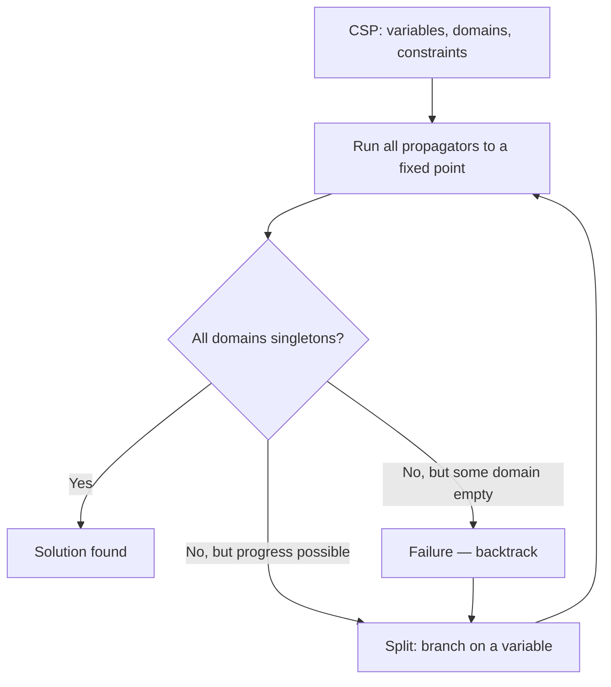

# Constraint Satisfaction and Propagation-Based Solving

[[book-guidelines|↩ Back to guidelines]]

## The problem: declarative modeling needs an efficient engine underneath it

Say you want to solve a Sudoku. You could write a bespoke backtracking search by hand — pick a cell, try a digit, recurse, backtrack on failure — hard-coding the row/column/block rules directly into your search loop. It would work, but it wouldn't generalize: the moment you moved to scheduling, or vehicle routing, or bin packing, you'd be back to writing another bespoke search from scratch, re-deriving the same pruning logic in a different shape each time.

**Constraint programming (CP)** separates these two concerns. You state the problem *declaratively* — as a set of **variables** (the unknowns) ranging over **domains** (their possible values) and a set of **constraints** (relations the variables must jointly satisfy) — and hand that model to a general-purpose **solver**. The solver doesn't know anything about Sudoku or scheduling; it only knows how to search for assignments that satisfy arbitrary constraints. This is precisely the same separation you already know from linear or dynamic programming: a specification language on one side, a generic solving engine on the other. Tack frames this cleanly: CP is "not a general-purpose programming paradigm, but rather a technique for solving certain kinds of problems," in the same tradition as those other "programming" methodologies.

Formally, a **Constraint Satisfaction Problem (CSP)** is exactly that pairing: variables + domains + constraints. When every domain is finite, it's a *finite-domain* CSP — the class Tack's dissertation is about. Solving a CSP means finding an assignment of values to variables (one value per variable, drawn from its domain) such that every constraint holds. This is worth naming precisely because CSP-solving is **NP-hard in general** — SAT (Boolean satisfiability) is literally one instance of it — so there's no free lunch here. Everything in this dissertation is about how to make an NP-hard search *practically* fast, not about escaping the complexity.

## Two engines working together: propagation and search

**[[The-Denotational-and-Operational-Model-of-Constraint-Propagation#What breaks without this|What breaks without this]]:** Naively, you could solve any CSP by **generate-and-test** — enumerate every possible full assignment, check each one against all constraints, stop at the first success. This is correct but catastrophically slow: for Sudoku's 81 cells with domain size 9, that's up to $9^{81}$ candidate assignments. The instant you can *infer* something before finishing the assignment — "column h already has every digit except 1, so cell h1 must be 1" — you're doing far less work than blind enumeration. That inference step is the whole point of the machinery that follows.

Tack's solvers combine two complementary inference mechanisms:

**Constraint propagation.** A **propagator** is the computational entity that realizes one constraint by removing ("pruning") values from variable domains that provably cannot be part of *any* solution to that constraint. Walking Tack's own Sudoku example: in the top-right $3\times3$ block, the digit 1 is missing, but columns $g$ and $i$ already contain a 1 elsewhere in the grid. Since a 1 can't repeat in those columns, the missing 1 in this block *must* land in column $h$ — and since only one empty cell remains in that block, that cell is forced. No guessing was involved; this is pure logical deduction from the constraints already in force. Each propagator does this locally, for its own constraint; the solver runs *all* propagators for a problem repeatedly until none of them can prune anything further — a **fixed point**. This dissertation's later chapters (2–6 in the Topic List) formalize exactly what a propagator is allowed to do and how a fixed point is computed efficiently.

**Search.** Propagation alone is usually **incomplete** — it can shrink domains but can't always pin down a unique value for every variable. (Sudoku puzzles are specifically *designed* to be solvable by propagation alone, which is why "the unwritten law of Sudoku is that you play with a pen, not a pencil" — but that's a property of well-posed puzzles, not of CSPs in general.) When propagation stalls without every variable assigned, the solver **splits** the problem — e.g., picks an undetermined variable and branches on a value for it — creating smaller subproblems, and recurses. This recursive splitting is a **backtracking search** over a tree of subproblems: propagate to a fixed point, branch if unresolved, repeat, backtrack on failure. Propagation and search are complementary precisely because propagation does the cheap deductive work up front, and search only pays the combinatorial cost for the genuinely underdetermined residue.



This is the architectural backbone of the entire dissertation: Part I (Chapters 3–6) is about making the *propagation* half efficient and well-founded; Part II (Chapters 7–11) is about making a *comprehensive library* of propagators cheap to build.

## Grounding: what a propagator actually looks like as code

**Rust.** A propagator is naturally a trait over a shared domain-store abstraction — this is close to how Gecode itself is architected in C++, just with Rust's ownership model making the domain-mutation contract explicit:

```rust
trait Propagator {
    /// Attempt to prune domains; return whether any domain changed,
    /// and whether the propagator has become "subsumed" (fully done).
    fn propagate(&self, store: &mut DomainStore) -> PropagationResult;
}

enum PropagationResult {
    NoChange,
    Pruned,
    Failed,      // some domain became empty — this branch is dead
    Subsumed,    // constraint now provably always holds — propagator can be discarded
}

fn fixpoint(props: &[Box<dyn Propagator>], store: &mut DomainStore) -> bool {
    loop {
        let mut changed = false;
        for p in props {
            match p.propagate(store) {
                PropagationResult::Pruned => changed = true,
                PropagationResult::Failed => return false,
                _ => {}
            }
        }
        if !changed { return true; }
    }
}
```

This naive `fixpoint` loop re-runs *every* propagator on *every* pass — correct, but wasteful. Chapter 5 ("Efficient Propagator Scheduling") is entirely about replacing this brute-force refixing with an event-driven agenda so that a propagator only re-runs when a domain it actually depends on has changed. Keep this naive version in mind as the baseline the later chapters improve on.

**Python**, for a quick illustration of the all-different propagator used in the Sudoku model (bare-bones "naked singles" pruning — remove already-placed values from peer domains):

```python
def propagate_all_different(domains, variables):
    changed = False
    singles = {v: next(iter(domains[v])) for v in variables if len(domains[v]) == 1}
    for v in variables:
        if len(domains[v]) > 1:
            for other, val in singles.items():
                if other != v and val in domains[v]:
                    domains[v].discard(val)
                    changed = True
    return changed
```

**Lean**, since the fixed-point idea is itself a small piece of order theory before it's an algorithm — a monotone-decreasing sequence of domain stores bottoming out (the model Chapter 3 will make precise):

```lean
-- domains only ever shrink; propagation is a monotone map on the domain lattice,
-- and Sudoku-style inference is just: iterate the map until it's a fixed point.
def isFixedPoint (f : Domains → Domains) (d : Domains) : Prop := f d = d
```

Lean's role here is a preview: once Chapter 3 defines propagators formally as contracting, sound functions on a domain lattice, this "iterate until fixed" pattern becomes a genuine order-theoretic fixed-point construction, not just a `while` loop.

## Set variables: expressivity as a symmetry-avoidance tool

Tack's second worked example, the **social golfer problem** (schedule $g \times s$ golfers into $g$ groups of size $s$ over $w$ weeks so no two golfers repeat a group), motivates **set-valued variables** — variables whose domain is a set of *sets*, not a set of atomic values. Each group-per-week is naturally one set variable $x_{i,j} \subseteq \{1,\dots,g{\times}s\}$ with $|x_{i,j}| = s$, rather than $s$ separate integer variables.

This isn't just notational convenience — it has a real algorithmic payoff. Modeling a group as $s$ *individual* integer variables introduces **symmetry**: any permutation of those $s$ variables' values within the group is an equally valid solution, but the search doesn't know that, so it wastes effort re-exploring symmetric variants of the same (non-)solution. A single set variable collapses that symmetry away entirely, because a set has no internal order to permute. This is why Tack calls out set constraints' "symmetry-avoidance advantage" as a first-class modeling benefit, not just a syntactic one — and it's a recurring theme (`static-analysis` / `sat-smt-csp` connection): choosing the right *abstract domain* for a variable — here, sets instead of tuples of integers — directly changes the tractability of the search, exactly the way choosing the right abstract domain in abstract interpretation changes the precision/cost tradeoff of an analysis.

Because a set variable's full domain (all subsets of its universe) is exponential to represent explicitly, Tack notes that practical solvers approximate it as an **interval** $[l, u]$: a guaranteed-lower-bound set $l$ (elements definitely in the set) and a guaranteed-upper-bound set $u$ (elements possibly in the set). This is a genuine Galois-connection-style approximation of the full powerset lattice by a much cheaper two-set representation — and it's the exact device Chapter 4 (Propagation Strength) formalizes as the *set-interval approximation*, and Chapter 11 builds an entire propagator-derivation technique around.

## Where this leads

This chapter's job is purely to motivate — Tack is explicit that "the next chapter recapitulates the fundamental ideas... by means of examples" before the mathematical treatment begins. Concretely, this topic hands off three unresolved threads that the rest of the dissertation exists to formalize:

- **What exactly is a propagator, precisely?** Here it's just "removes values that can't be part of a solution" — [[The-Denotational-and-Operational-Model-of-Constraint-Propagation]] (Chapter 3) turns this into a formal definition (contracting, sound functions on a domain lattice) with provable correctness properties.
- **How strong is a given propagator's pruning, and how do we compare propagators for the same constraint?** [[Propagation-Strength-and-Domain-Approximations]] (Chapter 4) answers this, and formalizes the set-interval approximation glossed over above.
- **How do we run "all propagators to a fixed point" efficiently, not just correctly?** The naive re-run-everything loop above is what [[Efficient-Propagator-Scheduling]] (Chapter 5) replaces with [[Efficient-Propagator-Scheduling#Event-directed scheduling|event-directed scheduling]].

For the `sat-smt-csp` focus area specifically: this chapter is the on-ramp to the CSP kernel — the generate-and-test vs. propagation-plus-search distinction here is exactly the difference between a naive counterexample search and the pruned search a real CSP-based bug-finder needs; and the social-golfer set-variable example is a concrete preview of representing structured domains (e.g., automaton/DFA-shaped domains) as first-class variables rather than flattening them into symmetric tuples of primitives.
