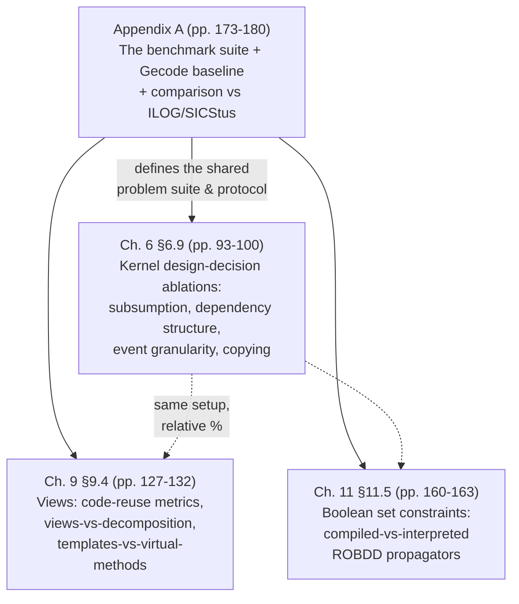

[[book-guidelines|↩ Back to guidelines]]

## Why a dissertation needs an appendix full of milliseconds

Tack's central thesis, stated on page 1 and repeated at every chapter boundary, is a *falsifiable engineering claim*: principled mathematical models and carefully justified design decisions — not ad hoc hacking — are what make a constraint solver simultaneously correct, well-understood, modular, comprehensive, and **fast**. The first four adjectives are established by proofs (Chapters 3, 4, 7, 11). The fifth, speed, cannot be established by proof at all — asymptotic complexity arguments tell you how *scaling* behaves, not whether a specific design decision (a bucket priority queue versus a suspension list, say) is worth its implementation cost on real problems. So the dissertation closes its empirical loop the only way available: it builds a production-quality solver (Gecode), runs it on a curated benchmark suite, and — critically — re-runs it with individual architectural decisions surgically reversed, to isolate exactly what each decision buys.

This is the discipline this topic is really about: not "here are some numbers," but a *method* — a fixed benchmark suite, a fixed measurement protocol, and a battery of controlled ablations, one variable changed at a time. That method is what you'd reuse verbatim if you ever needed to convince yourself (or a reviewer) that your own CSP kernel's design decisions are load-bearing rather than cosmetic.

The material is spread across four places in the book, and none of it is redundant:



Appendix A is the *instrument* — it defines the problems, the machine, and the measurement protocol once. Chapters 6, 9, and 11 each *reuse* that instrument to answer a chapter-specific empirical question, always reporting results as percentages relative to the Appendix A baseline rather than re-deriving new absolute numbers. Understanding that relationship is more valuable than memorizing any individual millisecond figure.

## The benchmark suite (Appendix A.1–A.4)

Tack's suite is deliberately heterogeneous, because a solver architecture that only looks good on one *kind* of problem hasn't proven anything general. Four categories:

- **Integer/Boolean CSPs (A.1):** classic combinatorial benchmarks — Alpha (cryptarithmetic, 20 linear equations over 26 variables), BIBD (balanced incomplete block design), Eq-20 (linear equation system), Golomb rulers, graph coloring, the *n*-Knights tour, Magic Sequences (in three propagator-strength variants: naive/reified, smart/counting, GCC/global-cardinality — deliberately chosen so the same *problem* stresses different propagator implementations), Partition, Perfect Square Packing, Photo Alignment, and *n*-Queens (again in naive/smart and value/domain-consistency variants). The repeated pattern — same problem, multiple propagator-strength encodings — is itself a methodological point: it isolates propagation *strength* as a variable independent of the problem being modeled.
- **Set-variable CSPs (A.2):** Crew Allocation, Hamming Codes, Social Golfers (the running example from Chapter 2), Steiner Triples, a set-based Sudoku encoding, Queen Armies. These stress the set-interval domain representation (Section 4.5) and the Boolean-set-constraint machinery of Chapter 11.
- **SAT problems (A.3):** DIMACS-format instances (Dubois, Towers of Hanoi, Ramsey, Pigeon Hole, Flat graph coloring) run through Gecode's DIMACS parser — included specifically to stress-test the *worst case* for a general CP kernel: near-stateless, massively numerous propagators (Boolean clauses), used later in §6.9 to probe the cost of the copying architecture in a regime it wasn't optimized for.
- **Stress tests (A.4):** Domain Stress (pure domain-operation throughput), Propagation Stress ($x<y \wedge y<x$ over domains of size $10^6$, isolating scheduling/execution speed from propagation *logic*), Search Stress (pure search-tree traversal with zero constraints, isolating the kernel from propagation entirely). These three are a nice example of *component isolation by problem construction*: each stress test is engineered so that exactly one subsystem dominates the runtime, since a full CSP benchmark conflates modeling, propagation, and search costs.

**Measurement protocol (A.5):** run-time as wall-clock arithmetic mean of 20 runs (5 for SAT, which is slower), reporting a coefficient of deviation under 2%; plus peak memory, number of search-tree failures, and number of propagation steps. Reporting all four together — not just time — matters: it lets later ablations (§6.9) attribute a time change to a *specific mechanism* (e.g., "propagations went up 3×, so this is a scheduling-frequency effect," versus "propagations stayed flat but memory rose, so this is a copying-cost effect").

Baseline platform: Gecode 3.0.0, Intel Core 2 Duo @ 1.83 GHz, 2GB RAM, Mac OS 10.5.5, GCC 4.2.1 (Table A.1). A separate, smaller comparison against **ILOG Solver 6.5** and **SICStus Prolog 4.0.2** (Table A.2, Figure A.1) had to be run on a *different* machine (Pentium 4 @ 2.8GHz, Linux) for licensing reasons, and on a *subset* of problems — the guidelines' own Key Question flags this, and the book's honest answer is instructive: for several set-constraint benchmarks, no model could be constructed that induced the *same search tree* across all three solvers, because ILOG's set propagators don't document their cardinality-reasoning strength and SICStus has no set constraints at all. This is a real methodological hazard in cross-solver comparison — if the search trees differ, you're not measuring propagator speed anymore, you're measuring a confound. Relative numbers are reported as a percentage of Gecode's time (e.g., ILOG at "285.51%" on smart Alpha means ILOG took 2.85× as long); on the subset that was comparable, Gecode is faster than both competitors on most problems, sometimes dramatically (Knights 18: ILOG 24×, SICStus 25× slower), though it loses on BIBD.

## Kernel design-decision ablations (Chapter 6, §6.9)

This is the dissertation's most rigorous empirical section, and it's structured as a genuine ablation study: take the unmodified Gecode 3.0.0 (whose absolute numbers are Table A.1's baseline), change **one architectural decision at a time**, and report the new numbers as a *percentage of the baseline* — 100% means no change, 200% means twice the cost. Six separate experiments:

**1. [[Efficient-Propagator-Scheduling#Subsumption|Subsumption]] removal (Table 6.2).** Subsumption is the run-time detection that a propagator can never prune again and can be safely discarded (Section 5.3/6.4). Tack changes the `subsumed` status to behave like `fix` (i.e., keeps subsumed propagators alive and subscribed) and re-measures. Result: performance degrades almost everywhere — up to **1340% run-time** on naive Magic Sequence (500) — via two compounding effects: (a) dead propagators still get scheduled and executed for no pruning benefit, and (b) under the copying architecture, dead propagators still get copied on every backtrack, which is pure waste. This is the single strongest empirical justification in the whole dissertation for treating subsumption detection as a *required*, not optional, kernel contract (recall the Key Question from the Chapter 6 summary about why subsumption is mandated rather than merely permitted).

**2. Assigned-variable subscribe/cancel skipping (Table 6.3).** A secondary optimization skips `subscribe`/`cancel` bookkeeping once a variable is assigned. The subscription-count statistics show *why* this optimization matters asymmetrically: `subscribe` calls on already-assigned variables are rare (most subscriptions happen at problem setup, before variables are assigned), but the number of subscriptions still live at *failure* time (column `F. cancel`) is often orders of magnitude larger than the number of cancels actually performed — meaning skipping cancellation on a failed space (which is about to be discarded wholesale) avoids a large amount of pointless bookkeeping.

**3. [[Implementation-Architecture-of-a-Propagation-Kernel#Dependency arrays|Dependency arrays]] vs. suspension lists (Tables 6.4–6.5).** The alternative to Gecode's indexed dependency array (Section 6.4) is a classic linked suspension list — singly-linked ($O(n)$ cancel) or doubly-linked ($O(1)$ cancel). Counterintuitively, the *asymptotically slower* singly-linked list is competitive, while the *asymptotically faster* doubly-linked list is **worse** — because extra back-links inflate the per-propagator memory footprint, and in a copying architecture, memory footprint directly multiplies into copying cost on every backtrack. This is the empirical payoff of the observation buried in the Chapter 6 Key Questions: the array-vs-list trade-off is not generic, it's *specific to copying* — a trailing-based kernel, which never copies dependency structures, would see the doubly-linked list's $O(1)$ cancel pay off cleanly, with none of the copying penalty. Same mechanism, opposite verdict, purely because of the surrounding architecture.

**4. Modification-event-indexed dependencies (Table 6.6).** Indexing the dependency array by propagation condition (as Gecode does) versus by individual modification event (which would let `notify` avoid touching irrelevant array segments, at the cost of triplicating some propagators' entries). Verdict: worse — the memory blow-up from duplicate entries outweighs the scheduling-precision gain, again because of copying cost.

**5. Delayed scheduling (Table 6.7).** Does batching same-run duplicate modifications (the modification-event-delta machinery of Section 6.3) actually save meaningful work? The `Double mod. %` column shows double-modification is real but modest (single digits to ~29% depending on benchmark) — so the delta-checking overhead is a cheap insurance policy against a moderate, not catastrophic, redundancy.

**6. Copied vs. shared propagators (Table 6.8).** The most architecturally pointed experiment: implement a Boolean clause propagator that is *never* copied (globally shared across all space copies, with backtrack-safe dynamic dependencies as in the watched-literals technique of Example 5.13), and measure it on SAT benchmarks — the regime engineered in Appendix A.3 specifically to stress "many, nearly-stateless propagators." Result: dramatic wins (down to ~26–39% memory, ~31–70% time on most instances), *even though* the number of propagation steps sometimes goes **up** due to different scheduling — the copying-avoidance saving dwarfs the extra propagation cost. But Tack is careful to frame this as evidence about a specific degenerate regime, not a general indictment of copying: "for typical propagation problems, the benefits of copying outweigh the costs," and he notes, honestly, that dedicated SAT solvers like MiniSat still beat any general CP solver on SAT by orders of magnitude regardless. This is a good model of how to report a positive ablation result without overclaiming its generality.

## Views: code reuse and zero-overhead claims (Chapter 9, §9.4)

Chapter 9's empirical section validates two separate claims about *views* (Chapter 7's propagator-derivation technique), using the same benchmark setup:

**Applicability (Table 9.1):** 127 hand-written parametric propagators in Gecode yield 514 *derived* instances — a 4.05× amplification ratio (higher for set variables, 5.25×, than integers, 3.90×). Translated into engineering cost: ~40,000 lines of hand-written propagator code, versus an estimated 120,000 lines that would have been needed to hand-write every derived variant separately, obtained for under 8,000 lines of view-implementation code — Tack's own framing is a "1500% return on investment." This is a code-reuse metric, not a speed metric, and it's worth keeping the two separate: Chapter 7's theorems already *guarantee* derived propagators are semantically perfect; Table 9.1 is evidence the mechanism is used pervasively enough for that guarantee to matter in practice.

**Zero run-time overhead (Example 9.4, disassembly):** the chapter backs its "views cost nothing at run time" claim with literal generated-assembly inspection — an offset view's `adjmin`/`adjmax` calls compile, under GCC monomorphization, into the *exact same instruction sequence* as if the offset arithmetic had been written by hand directly into the propagator. No function call, no indirection.

**Views vs. decomposition (Table 9.2):** replacing a view-derived propagator with a decomposition into auxiliary variables and simpler propagators (the alternative technique views were built to avoid) costs up to **~7×** run-time and memory on integer/Boolean benchmarks (Eq-20: 655% time, 700% memory) and a more moderate but still consistent 10–30% on set benchmarks. Interesting nuance: propagation-step counts sometimes explode far more than run-time (100-Queens: 23× more propagation steps but only 41% more time), because the decomposition's extra propagators are individually cheap — a reminder that propagation-step count and wall-clock cost are correlated but not interchangeable metrics.

**Templates vs. virtual methods (Table 9.3):** approximating a dynamic-binding implementation of views (C++ virtual calls instead of template monomorphization) costs 3–123% overhead for integer examples, 11–31% for set examples — direct empirical support for Section 9.1's claim that C++'s compile-time parametric polymorphism, not Java-style dynamic binding, is the right implementation strategy for zero-overhead views.

## Compiled vs. interpreted Boolean set propagators (Chapter 11, §11.5, Table 11.1)

The last empirical section validates Chapter 11's specification-to-propagator compilation pipeline (Boolean set constraints → interval normal forms → ROBDD-based code, Section 11.5). Using the same setup again, Tack replaces Gecode's hand-written ternary set-intersection propagator with two auto-generated versions — one *compiled* to C++ template code, one *interpreted* dynamically against the ROBDD at run time — both derived from the same trivial specification $x = y \cap z$. Both perform identical pruning (so propagation-step counts are omitted; only time and memory differ). The interpreted version is **3.4× to 11.3×** slower depending on the benchmark (Sudoku set-1: 803.95%), which is exactly what you'd expect from tree-walking a symbolic representation on every propagator invocation versus running pre-generated straight-line code. Tack's broader claim — that hand-optimized propagators have only *limited* room to beat generated ones, because any $\mathcal D^{[\mathcal P(U)]}$-complete propagator must do essentially the same case analysis — is supported qualitatively here (for this specific constraint, the generated code *is* what a human would have written) rather than by a head-to-head hand-vs-compiled time comparison.

## Reading the method, not just the numbers

Three things are worth carrying forward as reusable methodology, independent of Gecode or constraint propagation specifically:

1. **A shared instrument, reused across experiments.** Every one of Chapters 6, 9, and 11's empirical sections reuses Appendix A's exact machine, compiler, run count, and problem suite, and reports results as *percentages relative to the Appendix A baseline* rather than fresh absolute numbers. This is what makes the individual ablations comparable to each other at all — an isolated "our propagator is 50ms" number means little without a fixed reference point.
2. **One-variable-at-a-time ablation.** Every Chapter 6 experiment changes exactly one kernel decision (subsumption on/off, array vs. list, indexing granularity, copy vs. share) and holds everything else fixed. This is what lets Tack make causal claims ("subsumption removal costs X%") rather than merely correlational ones.
3. **Report more than one metric, and use the mismatch.** Time, memory, failures, and propagation-step counts are reported together specifically so that a metric mismatch (steps up but time flat, as in the shared-propagator SAT experiment; steps way up but time only mildly up, as in the decomposition experiment) becomes diagnostic evidence for *which* mechanism is responsible for an observed slowdown or speedup, rather than a black box.

A minimal Rust sketch of the same discipline — one ablation flag, one metric struct, relative-to-baseline reporting — looks like this:

```rust
struct BenchResult {
    time_ms: f64,
    peak_mem_kb: u64,
    failures: u64,
    propagations: u64,
}

impl BenchResult {
    /// Mirrors Table 6.2/6.4/etc.: report every field as a % of baseline,
    /// so a metric mismatch (e.g. propagations flat, time up) is visible
    /// at a glance rather than buried in absolute numbers.
    fn relative_to(&self, baseline: &BenchResult) -> [f64; 4] {
        [
            100.0 * self.time_ms / baseline.time_ms,
            100.0 * self.peak_mem_kb as f64 / baseline.peak_mem_kb as f64,
            100.0 * self.failures as f64 / baseline.failures as f64,
            100.0 * self.propagations as f64 / baseline.propagations as f64,
        ]
    }
}

enum KernelVariant {
    Baseline,
    NoSubsumptionRemoval,      // Table 6.2
    SuspensionListSingly,      // Table 6.4, O(n) cancel
    SuspensionListDoubly,      // Table 6.4, O(1) cancel
    SharedStatelessPropagators // Table 6.8
}
```

The point of writing it this way isn't that this crate is useful — it's that a `KernelVariant` enum with one baseline arm and one arm per architectural decision under test *is* the ablation methodology, made executable. If you're validating your own CSP kernel's design decisions (the `sat-smt-csp` line of this project — the kernel that searches for counterexamples/counterfacts against refinement-type invariants), this is close to the actual harness shape you'd want: a fixed benchmark corpus analogous to Appendix A's four problem classes, a `KernelVariant` switch for each contested design decision (copying vs. trailing, watched-literal-style dynamic dependency tracking vs. static, subsumption detection on/off), and relative-percentage reporting against one frozen baseline run. Note what this section deliberately does *not* claim: none of Tack's numbers transfer as absolute performance targets to a different language, allocator, or problem domain — what transfers is the *shape of the experiment*, not the millisecond values.

## Where this leads

This appendix-and-scattered-sections topic is the dissertation's evidentiary closing argument, not a new technical mechanism — it doesn't introduce constructs that later chapters build on (there is no "Chapter 12 assumes you understood benchmarking"). Instead it retroactively validates the mechanisms from every earlier chapter: the propagator model and scheduling algorithm of Chapters 3 and 5 (via the kernel ablations), the completeness-preserving views of Chapter 7 (via the code-reuse and zero-overhead measurements), and the ROBDD-compiled Boolean set propagators of Chapter 11 (via compiled-vs-interpreted timing). Chapter 12's "Future Research" directions — parallelized propagation, relaxed monotonicity, hybrid copying/trailing — are themselves partly *motivated* by this chapter's findings (e.g. the SAT copying-overhead result in Table 6.8 directly foreshadows the "hybrid copying/trailing" future-work item).

For the `sat-smt-csp` focus area specifically: this is the closest thing in the book to a template for validating *your* CSP kernel once it exists — not the theorems that prove it's sound and complete (those come from Chapters 3, 4, and 11's model), but the separate, harder question of proving the design decisions around that sound core were the *right* ones. A kernel can be provably correct and still be an order of magnitude slower than it needs to be because of an indexing structure or a memory-management choice that looked reasonable on paper — Table 6.4's suspension-list result is the sharpest illustration in the book of a decision whose right answer depends entirely on a separate architectural choice (copying vs. trailing) made elsewhere in the system.
