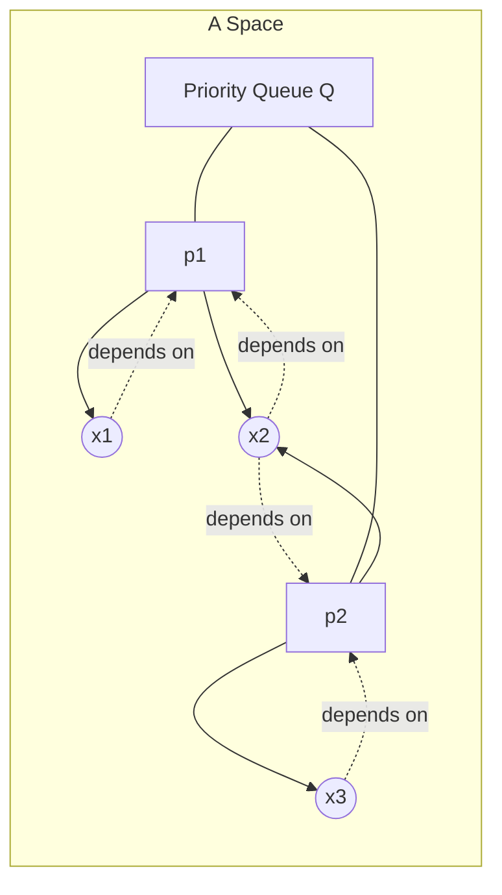
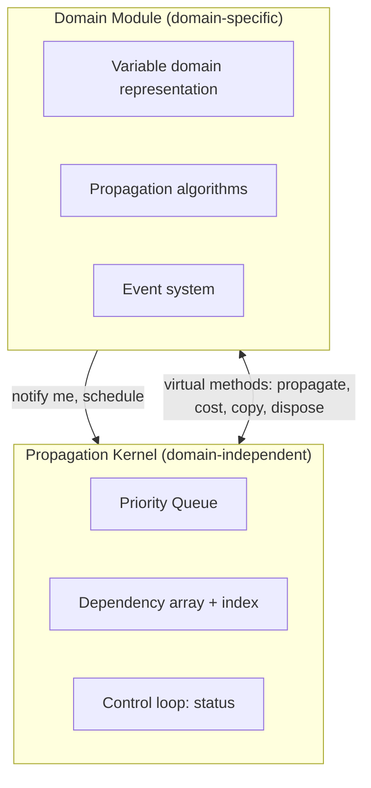
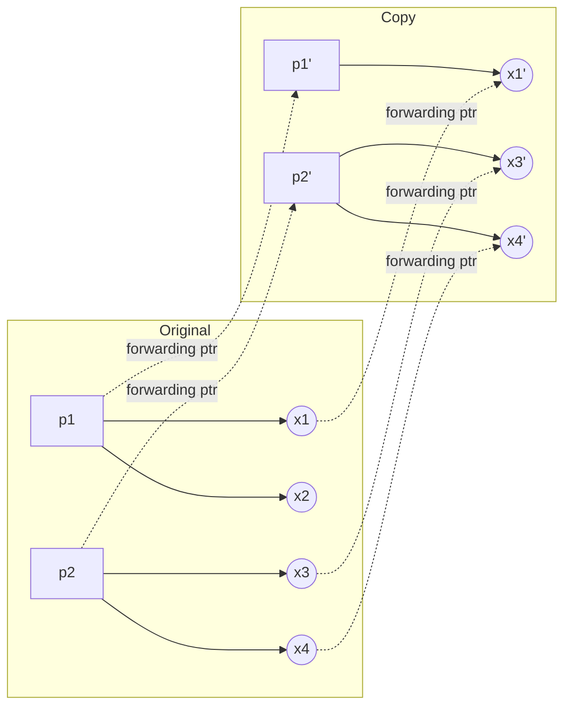

# Implementation Architecture of a Propagation Kernel

[[book-guidelines|↩ Back to guidelines]]

## The problem this chapter actually solves

Every chapter so far has been mathematics: [[The-Denotational-and-Operational-Model-of-Constraint-Propagation|propagators as contracting, sound functions on domains]], and [[Efficient-Propagator-Scheduling|an agenda-based, event-directed transition system]] that computes their mutual fixed point efficiently. All of that machinery was described *functionally* — propagation takes a domain and produces a stronger domain, as if domains were immutable mathematical values. That's the right level of abstraction for proving termination and correctness, but it is not how you'd actually build a fast solver. A real solver needs destructive, in-place updates: when a propagator prunes a domain, the old domain is garbage, and re-allocating a fresh domain object on every single pruning step would be an obscene amount of wasted work. So the implementation reality is: spaces, variables, propagators, and queues are all **stateful, mutable objects**.

That single decision — mutability — creates a problem the pure mathematical model never had to face: **search needs to undo state**. The whole point of backtracking search (Chapter 3's `solve`) is to try a branch, and if it fails, roll back to before that branch was tried and attempt a different one. If propagation and branching are destructive, "roll back" is not free — you need an actual mechanism for it. This chapter is about designing that mechanism, and everything downstream of it, with an eye to performance that is *justified*, not just assumed. As the chapter's own framing states: "there is one decision that influences the entire architecture: how the state of the system is represented." Nearly every other design decision in this chapter — the dependency data structure, the priority queue, the memory manager — falls out of that one choice.

## 1. Copying versus trailing: the foundational choice

There are exactly two known techniques for undoing destructive state changes during backtracking search:

**Trailing.** Record every destructive update on a stack (the *trail*) as you make it. To backtrack, pop the trail and undo each recorded change, one by one, back to the point of the last choice. This is the design behind the Warren Abstract Machine that underlies most Prolog implementations, and it's what ILOG Solver and CHOCO use.

**Copying with recomputation.** Instead of recording *changes*, periodically save a **complete snapshot** of the whole state — a full copy of the space — at certain search-tree nodes (always including the root). On backtracking, don't undo anything: throw away the failed branch, take the most recent available copy, and *recompute* forward from there by re-doing the choices that lead to the desired node.

The book's own picture (its Figure 6.1) makes the trade-off vivid: trailing keeps one "live" state plus an undo-log; copying keeps whole snapshots at some nodes and replays the gap between the nearest ancestor snapshot and the current node.

Each has real advantages:

- **Copying** naturally supports arbitrary search strategies — breadth-first search, best-first search, or anything that needs several tree nodes "open" simultaneously is trivial, because a copy is a self-contained, independent artifact you can just keep around. It is also naturally friendly to concurrent, multi-threaded search (no shared mutable trail to synchronize), and it lets you trade memory for run-time by tuning *how often* you take a snapshot.
- **Trailing** wins when domains are small and rarely modified (e.g., Boolean variables) — recording occasional single-bit undo entries is far cheaper than copying a whole space just to change one bit.

The chapter is explicit that it does not attempt to adjudicate this trade-off in the abstract — Tack states plainly that it is "not a goal of this dissertation to discuss or evaluate this decision." Instead, the architecture is committed to copying with recomputation because that is what Gecode uses, and the rest of the chapter is about engineering everything else *given* that commitment — most visibly in Section 6.7's memory-management and forwarding-pointer design, which only makes sense once copying is fixed as the backtracking mechanism.

**[[The-Denotational-and-Operational-Model-of-Constraint-Propagation#What breaks without this|What breaks without this]] decision being made explicitly:** if you don't commit up front, you end up with an architecture that's neither — trailing-shaped data structures bolted onto copying-shaped control flow (or vice versa), inheriting the worst of both: the memory overhead of copies *and* the synchronization complexity of a trail. Section 6.4's dependency-array design (below) is the clearest example of a data structure that is the *right* choice specifically *because* the architecture copies — it would be the wrong choice under trailing, where suspension lists' O(1) subscribe/cancel actually pays off (Section 6.9's own experiments confirm this).

```rust
// The state that must survive (or be reconstructed after) backtracking.
// This is the object that gets either trailed or copied — the shape of
// this struct is exactly what "how the state is represented" means.
struct Space {
    variables: Vec<VarCell>,
    propagators: Vec<Box<dyn Propagator>>,
    queue: BucketQueue,     // Section 6.5
    deps: DependencyArray,  // Section 6.4
}

// Trailing: undo-log of destructive updates.
enum TrailEntry {
    DomainChange { var: VarId, old_min: i32, old_max: i32 },
    // ... one entry per kind of mutation the propagation loop can make
}
struct TrailingSearch {
    space: Space,
    trail: Vec<TrailEntry>,
    choice_marks: Vec<usize>, // trail length at each choice point
}

// Copying with recomputation: no undo-log, just a `clone`-like operation
// plus a record of *which constraints were imposed* to reach a node —
// see batch recomputation below for why it's constraints, not a domain replay.
struct CopyingSearch {
    space: Space,
    branch_descriptions: Vec<BranchDescription>, // for recomputation
}
```

## 2. Batch recomputation: making copying survive non-monotonic propagators

Naive copying-with-recomputation has a subtle correctness trap, and it's a direct consequence of a decision made three chapters ago: propagators in this model need only be *contracting and sound* — not necessarily monotonic (recall [[The-Denotational-and-Operational-Model-of-Constraint-Propagation]]). Non-monotonic propagation is not confluent: different orders of applying propagators can legitimately reach *different* fixed points, all equally valid.

Now put that fact next to recomputation. Suppose only the root of the search tree was copied, and you backtrack from a failed node several levels deep. Recomputation proceeds by copying the root again and *redoing* the same sequence of branch choices — "commit to alternative 1, then alternative 1 again," say. Here's the trap: if "alternative 1" is defined *relative to the current space* — e.g., a fail-first heuristic that branches on "the currently smallest domain" — then a non-monotonic propagator can produce a different fixed point on the replay than it did the first time, which can make "alternative 1" mean something completely different on the second pass. The search can silently explore the wrong part of the tree, becoming **incomplete** without any visible error.

**What breaks without a fix:** naive recomputation plus non-monotonic propagators plus space-relative branching is a soundness/completeness hazard baked into the architecture — exactly the kind of subtle bug that would surface as "the solver missed a solution" with no obvious cause.

Two fixes exist. Mozart's is to force uniqueness by restricting non-monotonic propagators to a fixed application order, so fixed points are always unique (removing the hazard by removing non-monotonicity's consequences). Gecode's fix, following Choi et al. (2001), is more elegant and is the one this chapter adopts: **batch recomputation**. Instead of replaying *domain operations*, replay the *same set of constraints imposed* at each node. When a node is explored for the first time, extract a **branching description** — a value-independent description of what constraints get added for each branch — and store that instead of the branch's numeric identity. During recomputation, commit to the branch by re-imposing exactly the same constraints, regardless of what the recomputed domain looks like at that point.

Why does this work? Because propagator *soundness* alone (the induced constraint doesn't change) guarantees that imposing the same set of constraints reproduces the same solution set, independent of which particular fixed point the intermediate propagation steps land on. You don't need the *same* fixed point at every step — you only need the same *solutions* preserved, and that's exactly what soundness gives you, at no extra cost. As a bonus, batch recomputation needs only **one** fixed-point computation per recomputed node (propagate once, after all constraints for that node are imposed) rather than one per intermediate step.

```rust
// A branching description decouples "which alternative" from "what the
// domain currently looks like" — the fix for recomputation-under-non-monotonicity.
trait BranchDescription {
    /// Constraints to impose for alternative `i`, independent of any
    /// particular space's current domain contents.
    fn commit(&self, space: &mut Space, alternative: usize);
    fn num_alternatives(&self) -> usize;
}

fn recompute(root_copy: &Space, path: &[(Box<dyn BranchDescription>, usize)]) -> Space {
    let mut space = root_copy.clone_deep(); // forwarding-pointer copy, Section 6.7
    for (desc, alt) in path {
        desc.commit(&mut space, *alt);
    }
    space.status(); // one fixed point for the whole batch, not one per step
    space
}
```

This is the mechanism that lets Gecode keep the non-monotonic propagator model of Chapter 3 — the *weakest* possible restriction on what counts as a legal propagator — without paying for it with an incomplete search.

## 3. The kernel/domain-module boundary

With backtracking settled, the chapter turns to overall structure. A space, in object-oriented terms, is a graph: propagator objects hold references to the variable objects they read/write, and variable objects hold *dependency* references back to the propagators subscribed to them (the diagram below mirrors the book's Figure 6.2).



The crucial architectural move — credited to Laburthe (2000) — is splitting this object model along a seam: the **propagation kernel** (domain-independent: the priority queue, the dependency data structure, and the overall control loop that drives scheduling) versus **domain modules** (domain-specific: concrete variable representations, concrete propagation algorithms, and the event system for a particular kind of variable, e.g. integers versus sets).



The interface is **bidirectional**: the kernel needs to call into domain-module code (invoke a propagator's `propagate`), and domain-module code needs to call into kernel services (notify the kernel that a domain changed, so dependent propagators get scheduled). This is realized with base classes: `Propagator` and `Variable` base classes define virtual methods the kernel calls (dynamic dispatch reaches the concrete domain-module implementation), while the same base classes and the `Space` object expose methods the domain module calls to reach kernel services (rescheduling, notification).

**What breaks without this separation:** without a clean boundary, every new variable type (integers, Booleans, sets, later graphs and reals) would require re-implementing scheduling, dependency management, and the control loop from scratch — exactly the "ad hoc engineering" the dissertation's thesis argues against. The separation is what makes Gecode's later growth (external contributors adding graph variables and real-interval variables, per Section 6.8) tractable without touching the kernel at all.

```rust
// The kernel's view: it only knows about the abstract contract, never
// concrete integer/set/Boolean logic.
trait Propagator {
    fn propagate(&mut self, delta: ModEventDelta) -> PropagateResult;
    fn cost(&self, delta: ModEventDelta) -> Priority;
    fn copy(&self, target: &mut Space) -> Box<dyn Propagator>;
    fn dispose(&mut self); // must cancel all subscriptions — Section 6.4
}

enum PropagateResult {
    Fail,
    Ok(FixStatus),
}
enum FixStatus { Fix, Subsumed, NoFix }

// A domain module (e.g. integer variables) implements the trait with
// concrete propagation logic; the kernel never needs to know it exists.
struct LessThan { x: IntVar, y: IntVar }
impl Propagator for LessThan {
    fn propagate(&mut self, _delta: ModEventDelta) -> PropagateResult {
        if self.x.adjmax(self.y.max() - 1).is_fail() { return PropagateResult::Fail; }
        if self.y.adjmin(self.x.min() + 1).is_fail() { return PropagateResult::Fail; }
        let status = if self.x.max() < self.y.min() { FixStatus::Subsumed } else { FixStatus::Fix };
        PropagateResult::Ok(status)
    }
    fn cost(&self, _delta: ModEventDelta) -> Priority { Priority::Unary }
    fn copy(&self, target: &mut Space) -> Box<dyn Propagator> { /* forwarding-pointer copy, §6.7 */ todo!() }
    fn dispose(&mut self) { /* cancel subscriptions on self.x, self.y */ }
}
```

This `LessThan` propagator is literally the book's Example 6.1 translated line for line — it fails fast the moment either bound update fails, and reports `Subsumed` the instant `x.max() < y.min()` makes the constraint permanently true regardless of future domain changes.

## 4. Contracts: the invariants that make the boundary efficient

A clean interface alone doesn't give you performance — the book is explicit that the architecture depends on *strong contracts*: invariants that both sides of the kernel/domain-module boundary are required (not merely permitted) to uphold. Three contracts matter most:

**The domain-update contract.** Every domain-mutating operation (`adjmin`, `adjmax`, etc.) must report exactly one of three outcomes to its caller: *no change* (returns the empty modification-event set), *failure* (returns `fail`), or *a domain change* (computes the modification event `me`, calls `notify(me)` to schedule dependents, and returns `me` to the propagator). This uniform three-way contract is what lets a propagator implementation stay simple — it never has to separately query "did anything change" versus "should I reschedule dependents," because the domain operation's return value already answers both.

**The propagator status contract.** At the end of every `propagate` call, a propagator must report its status by calling exactly one of three kernel methods: `fix()` (I've reached a fixed point — dequeue me), `subsumed()` (I've reached a fixed point *and* my constraint is now permanently satisfied — dequeue and destroy me, and I promise I've already canceled my own subscriptions), or `nofix()` (I might not be at a fixed point — the kernel checks whether I modified my own variables to decide whether to leave me queued). Example 6.2's iterating equality propagator for $x = y$ shows exactly why the *iterate-to-fixpoint* discipline matters: without iterating inside `propagate`, a single pass over `adjmin`/`adjmax` on both variables can leave the pair in a "domain hole" that isn't actually a fixed point — e.g. starting from $d(x) = \{2,3\}$, $d(y) = \{1,3\}$, one pass yields $d'(x)=\{2,3\}$, $d'(y)=\{3\}$, which still has more pruning available.

**The [[Efficient-Propagator-Scheduling#Subsumption|subsumption]]/disposal contract**, treated in more detail below — a propagator must cancel every subscription it ever made before reporting subsumption, no exceptions.

**What breaks without these contracts:** the kernel would need to independently verify each of these facts about every propagator — is it really at a fixed point? did it really cancel all its subscriptions? — which means duplicating domain-specific logic *inside* the domain-independent kernel, precisely the coupling the kernel/domain-module split was designed to avoid. The contracts convert expensive verification into cheap trust, backed by the fact that a buggy propagator is a domain-module bug, not a kernel bug.

```rust
// The kernel's picture of "did this propagator do its job":
// note this is a *reporting* discipline, not something the kernel computes.
trait FixReporting {
    fn fix(&mut self);        // I am at a fixed point, dequeue me
    fn subsumed(&mut self);   // fixed point + constraint permanently holds; I already canceled subscriptions
    fn nofix(&mut self);      // maybe not fixed; kernel checks self-modification
}
```

## 5. Dependency arrays and the bucket priority queue: the two hot data structures

Everything above is architecture; this section is where the performance-critical engineering happens. The book identifies exactly two data structures that are exercised on essentially every propagation step, and designs each one from an explicit efficiency requirement.

### Dependency arrays

The mathematical model (Chapter 5) used an abstract function `deps(x)(π)` mapping a variable and propagation condition to the propagators subscribed there. The implementation needs three operations on this mapping — `subscribe(p, π)`, `cancel(p, π)`, and `schedule(πᵢ, πⱼ, me)` — and the design brief is explicit: **iteration (via `schedule`) happens on every single event, so it must be fast; `subscribe`/`cancel` happen far less often (mostly at problem setup), so they can be slower.**

A naive "one array per propagation condition" scheme fails because a single modification event typically overlaps *several* propagation conditions at once (recall the `notify` table from [[Efficient-Propagator-Scheduling]] — an assignment event `asn` overlaps every propagation condition). The chosen structure instead keeps a **single array `dep`, sorted by propagation condition**, plus an **index array `idx`** marking the boundary of each condition's contiguous segment (with a sentinel `πend` so every segment has both endpoints defined). Iterating over all propagators subscribed with condition $\pi_i$ is then just walking `dep[idx[πᵢ]] .. dep[idx[πᵢ₊₁]-1]$ — constant time per propagator, with excellent cache locality because it's one contiguous array scan, not linked-list pointer chasing.

$$
\texttt{schedule}(\pi_i, \pi_j) \;:\; \text{for } k \in [\mathrm{idx}[\pi_i],\, \mathrm{idx}[\pi_{j+1}]) \; : \; \mathrm{dep}[k].\Delta me \mathrel{\cup}= me;\ \texttt{enqueue}(\mathrm{dep}[k])
$$

with the optimization that a propagator is only re-enqueued if the new event `me` is *not already* a subset of its accumulated `Δme` — because if it is, the propagator is already queued and the priority (which requires an extra virtual call to `cost`) doesn't need recomputing.

Subscription and cancellation are amortized $O(k-i)$ and $O(\mathrm{idx}[\pi_{i+1}]-\mathrm{idx}[\pi_i]+i)$ respectively (shifting array segments), which is the price paid for the array's fast iteration — exactly the trade-off the design brief called for.

```rust
struct DependencyArray {
    dep: Vec<PropagatorRef>,
    // idx[i] = index into `dep` of the first propagator subscribed with
    // condition i; idx has one extra sentinel slot for π_end.
    idx: Vec<usize>,
}

impl DependencyArray {
    /// Schedule every propagator subscribed with a condition in [pi, pj].
    fn schedule(&mut self, pi: usize, pj: usize, me: ModEvent, queue: &mut BucketQueue) {
        for k in self.idx[pi]..self.idx[pj + 1] {
            let p = &mut self.dep[k];
            if !me.is_subset_of(p.delta_me()) {
                p.union_delta_me(me);
                queue.enqueue(p);
            }
        }
    }

    fn subscribe(&mut self, p: PropagatorRef, pi: usize) {
        // Shift segments [pi..] right by one slot, insert p at idx[pi].
        for j in (pi..self.idx.len() - 1).rev() {
            self.dep[self.idx[j + 1]] = self.dep[self.idx[j]].clone(); // amortized shift
            self.idx[j + 1] += 1;
        }
        self.dep[self.idx[pi]] = p;
    }

    fn cancel(&mut self, p: &PropagatorRef, pi: usize) {
        let jp = (self.idx[pi]..self.idx[pi + 1]).find(|&j| &self.dep[j] == p).unwrap();
        self.dep[jp] = self.dep[self.idx[pi + 1] - 1].clone();
        for j in (pi + 1)..(self.idx.len() - 1) {
            self.dep[self.idx[j] - 1] = self.dep[self.idx[j + 1] - 1].clone();
            self.idx[j] -= 1;
        }
        *self.idx.last_mut().unwrap() -= 1;
    }
}
```

**Why this design is specifically right for a *copying* kernel** (the book's own Key Question 3 for this chapter): arrays are compact and cheap to copy — copying a space means copying every dependency array wholesale, and a flat array of pointers copies far more cheaply than walking and re-allocating a linked suspension list. Under **trailing**, this calculus flips: you never copy the dependency structure at all (there's only ever one live space), so a doubly-linked suspension list's $O(1)$ subscribe/cancel would dominate and the array's slower subscribe/cancel would be pure loss. Section 6.9's own experiments confirm this directly: swapping in suspension lists measurably *hurt* run-time in Gecode precisely because of increased copying cost, even though suspension lists have theoretically better subscribe/cancel complexity.

### The bucket priority queue

The queue needs `enqueue(p)`, `head()` (return the oldest propagator at the highest priority — FIFO within a level, motivated by starvation-avoidance from [[Efficient-Propagator-Scheduling]]), and `idle(p)`. Because the number of priority levels is small and fixed (unary through veryslow, from Section 5.4's cost model), a general-purpose heap ($O(\log n)$ operations) is the wrong tool — a **bucket queue** gives *constant-time* enqueue/dequeue instead.

The structure: an array of doubly-linked, cyclic lists (one per priority level, terminated by sentinel nodes), plus one extra list for idle propagators. A propagator is in exactly one such list at all times, and — the elegant part — the forward/backward links are embedded **directly inside each propagator object**, so no separate node allocation or queue-specific memory management is needed at all; the kernel needs a reference to every propagator anyway (for copying), so this costs nothing extra.

```rust
// Doubly-linked list node fields live inside the propagator itself —
// no separate allocation for queue membership.
struct PropagatorNode {
    prev: PropagatorRef,
    next: PropagatorRef,
    delta_me: ModEvent,
    // ... concrete propagator data
}

struct BucketQueue {
    // Q[0] is the idle queue; Q[1..=k] are priority levels 1 (fastest) to k (slowest).
    buckets: Vec<Sentinel>,
}

impl BucketQueue {
    fn enqueue(&mut self, p: &mut PropagatorNode, cost: Priority) {
        p.unlink();                    // O(1): splice out of current list
        self.buckets[cost as usize].push_tail(p); // O(1): splice into new list
    }
    fn head(&self) -> Option<PropagatorRef> {
        (1..self.buckets.len()).rev()
            .find_map(|i| self.buckets[i].first())
    }
    fn idle(&mut self, p: &mut PropagatorNode) {
        p.unlink();
        self.buckets[0].push_tail(p);
    }
    fn stable(&self) -> bool {
        (1..self.buckets.len()).all(|i| self.buckets[i].is_empty())
    }
}
```

**What breaks without a fixed, small priority set:** a general heap would need $O(\log n)$ per enqueue/dequeue, and — worse for this architecture specifically — a heap's internal tree structure isn't naturally embeddable in the propagator objects the way a doubly-linked list is, so you'd need separate heap-node allocation, which reintroduces exactly the extra-memory-management cost the bucket queue is designed to avoid.

## 6. Control: the loop that ties it together

With both data structures in hand, the main propagation loop (realized as a `status()` method on `Space`) is almost anticlimactic in its simplicity — all the real work has already been pushed into the dependency array and the queue:

```rust
impl Space {
    fn status(&mut self) -> Result<(), Fail> {
        while !self.queue.stable() {
            let p = self.queue.head().unwrap();
            let delta = p.take_delta_me(); // clears p's modification-event delta
            match p.propagate(delta) {
                PropagateResult::Fail => return Err(Fail),
                PropagateResult::Ok(_status) => { /* p re-queued itself via fix/subsumed/nofix */ }
            }
        }
        Ok(())
    }
}
```

This loop *is* the agenda-based, event-directed transition system of [[Efficient-Propagator-Scheduling]], now realized concretely: the invariants proven abstractly there (the agenda invariant, [[Efficient-Propagator-Scheduling#The dependency invariant|the dependency invariant]]) hold here as a direct *consequence* of the contracts from Section 4 — the loop itself doesn't need to re-verify them, because the contracts guarantee them by construction.

## 7. Efficient subsumption detection and propagator disposal

Detecting subsumption matters for more than tidiness: a subsumed propagator that stays alive keeps getting scheduled and executed for no pruning benefit, and — because the architecture copies — it also keeps getting *copied* at every search-tree node, wasting both time and memory in every future space. Section 6.9's Table 6.2 experiment (disabling subsumption removal by making `subsumed()` behave like `fix()`) shows measurable slowdowns almost everywhere, sometimes drastically (Magic Sequence's naive model got over 13× slower).

But detecting subsumption cheaply requires solving a reference-counting problem: a propagator object can only be safely freed once nothing still points at it, or you get dangling references. The naive fix is real reference counting or mark-and-sweep-style garbage collection — both add ongoing overhead to every subscription operation. The book's actual solution is a **contract**, not a runtime mechanism: propagators must cancel every one of their own subscriptions before or exactly when they report subsumption (via the `dispose` virtual method, called by the kernel right before deallocation). Because the propagator itself knows precisely which variables it's still subscribed to, it can do this cancellation in the same amount of work it would take to *check* whether it's still referenced — so the "reference-counting problem" evaporates by construction rather than being solved at runtime.

Two special-case optimizations shrink this further, both empirically validated in Section 6.9 (Table 6.3): subscribing/canceling on an **already-assigned variable** is a complete no-op, because an assigned variable will never generate another event, so there's nothing to schedule from it ever again; and cancellation is skipped entirely on **failed spaces**, since a failed space is discarded wholesale rather than torn down propagator by propagator. The measured cancel-operation counts bear this out dramatically — the number of subscriptions still outstanding when a space fails (`F. cancel`) is routinely orders of magnitude larger than the number of cancels ever actually performed, confirming that skipping cleanup on failure is a large, free win rather than a marginal one.

**What breaks without the "must cancel before subsumed" requirement being mandatory (not optional):** the chapter is explicit that it *requires* — not merely permits — every propagator to eventually detect and report subsumption, treating this as important enough to enforce rather than leave to programmer discipline. Without the requirement, a propagator that never reports subsumption survives forever as dead weight, silently degrading performance in a way that's easy to introduce and hard to notice.

```rust
impl Propagator for LessThan {
    // ... propagate as before ...
    fn dispose(&mut self) {
        // The contract: cancel every subscription before the kernel frees this object.
        self.x.cancel(self.propagator_id());
        self.y.cancel(self.propagator_id());
    }
}
```

## 8. Copying spaces via forwarding pointers

This is where the copying-based architecture pays its full implementation bill. A space is a bipartite, cyclic graph — edges only ever go from propagators to variables and from variables to propagators (the dependency edges), never propagator-to-propagator or variable-to-variable. Copying an arbitrary cyclic graph is a classic problem (it's exactly what copying garbage collectors do, and the book draws that comparison explicitly), and the standard technique is **forwarding pointers**: when you copy an object $x$ to $x'$, leave a pointer *inside $x$* pointing to $x'$. Any later attempt to copy $x$ again (reached via a different edge in the graph) finds the forwarding pointer and reuses $x'$ instead of making a duplicate — this is what correctly handles the graph's cycles and shared references.

The book's copying algorithm, stepping through who's responsible for what (kernel `[k]`, propagator `[p]`, variable `[v]`):

1. **[k]** Create a new, empty target space.
2. **[k]** Walk the *idle queue* only (this is the key optimization — subsumed propagators were removed in Section 7 and are simply never visited, so they never get copied).
3. **[p]** Each propagator's `copy` method creates its counterpart in the target space and sets its own forwarding pointer.
4–6. **[p]/[v]** The propagator copies each of its variables (delegating to the variable's own `copy`, which checks for an existing forwarding pointer first, per the graph-copying discipline above), then repoints its own reference at the copy.
7–8. **[k]** After all propagators are copied, the kernel walks the list of copied source variables, follows each forwarding pointer to find the copy, and rebuilds that copy's dependency array by re-scanning the source variable's dependencies and translating each entry through *its* propagator's forwarding pointer.
9. **[k]** Reset all forwarding pointers so the space can be copied again later.



Notice `x2` in the diagram: it's referenced by no propagator in the idle queue (perhaps its only propagator became subsumed), so it's never visited by step 4 and simply doesn't exist in the copy. **Copying a space is, as a side effect, a garbage collection pass** — the copy is naturally more compact than the original, dropping both subsumed propagators and now-orphaned variables for free, with no separate GC logic required.

The truly elegant part is memory reuse: this copying machinery needs *extra* per-object storage (the forwarding pointer itself, plus a linked list of "variables copied so far" for step 7–8) — but the book finds that storage for free by repurposing fields that already exist but are unused *during copying specifically*. A propagator's forwarding pointer is stored in the very slot that normally holds its "previous queue element" pointer — unneeded during copying because the idle-queue walk in step 2 only needs forward traversal. A variable's forwarding pointer, and the "next copied variable" link, are stashed in the first two slots of its own dependency index array — always guaranteed to exist (every event system has at least one propagation condition plus the `πend` sentinel), and safe to reuse because a variable's *own* dependency structure is being entirely rebuilt anyway (steps 7–8), so its old contents can be saved off and restored afterward. **The net result: copying costs zero additional memory overhead beyond the copy itself.**

```rust
// A propagator's node reuses its "prev" queue-link slot as a tagged
// forwarding pointer during copying — no extra field needed.
struct PropagatorNode {
    prev: PropagatorRef,   // doubles as forwarding pointer (tagged) during copy
    next: PropagatorRef,
    // ...
}

fn copy_space(source: &Space) -> Space {
    let mut target = Space::empty();
    let mut copied_vars: Vec<VarRef> = Vec::new(); // list built via reused idx slots

    for p in source.queue.idle_list() {                    // [k] step 2: idle queue only
        let p_copy = p.copy(&mut target);                   // [p] steps 3-4
        p.set_forwarding_ptr(p_copy.clone());                // reuse `prev` slot, tagged
        for v in p.referenced_vars() {
            let v_copy = v.copy_or_reuse_forward(&mut target, &mut copied_vars); // [v] step 5
            p_copy.repoint(v, v_copy);                        // [p] step 6
        }
    }
    for v in &copied_vars {                                  // [k] steps 7-8
        target.rebuild_dependency_array(v);
    }
    for p in source.queue.idle_list() { p.clear_forwarding_ptr(); } // [k] step 9
    for v in &copied_vars { v.clear_forwarding_ptr(); }
    target
}
```

**What breaks without forwarding pointers specifically:** a naive recursive copy of a cyclic, shared-reference graph either infinite-loops (following a cycle forever) or duplicates shared subgraphs (copying the same variable twice via two different propagators that both reference it) — corrupting the dependency structure of the copy. Forwarding pointers are the standard fix for exactly this class of problem, which is precisely why the book draws the direct comparison to copying garbage collectors.

## 9. Gecode as the validating implementation

Everything above is a design on paper until it's shown to actually work at scale — this is the dissertation's broader thesis (principled models produce practically viable systems, not just theoretically elegant ones) cashing out concretely for the kernel. **Gecode** ("Generic Constraint Development Environment") is the C++ library realizing this exact architecture: a compact kernel (the book reports **under 2,000 lines of C++ code** for the core kernel functionality) with domain modules layered on top for integers, Booleans, set variables under the set-interval approximation, and set variables under a full ROBDD representation, plus search engines (depth-first, branch-and-bound, and the interactive Gist tool) built orthogonally on the same kernel services. It's open-source (MIT license), portable standards-compliant C++, and has been extended by third parties with graph variables and real-interval variables — concrete evidence that the kernel/domain-module boundary (Section 3) is a *real* seam, not just a diagram.

The chapter closes with an empirical evaluation (Section 6.9) that validates specific design decisions rather than the architecture in the abstract:

- **Subsumption removal matters** (Table 6.2): disabling it degrades performance broadly, sometimes drastically, confirming Section 7's claims.
- **Dependency arrays beat suspension lists specifically because of copying cost** (Tables 6.4–6.5): even though doubly-linked lists have theoretically better subscribe/cancel complexity, the array wins in practice because it's cheaper to copy — direct empirical support for the trailing-vs-copying-dependent trade-off argued in Section 5.
- **Indexing dependencies by modification event instead of propagation condition is worse** (Table 6.6): storing a propagator multiple times (once per event in its propagation condition) increases both memory and copying cost, confirming that propagation-condition indexing (Section 5) is the right granularity.
- **Delayed scheduling barely matters** (Table 6.7): double-scheduling from repeated modifications during a single `propagate` call is measured to be rare, so the extra bookkeeping needed to fully deduplicate it wouldn't be worth its cost.
- **Copying propagators is usually worth it, but not always** (Table 6.8): a deliberately adversarial experiment — a non-copied Boolean clause propagator with global, shared dependencies — shows that for large numbers of essentially *stateless* propagators (as in dedicated SAT encodings), skipping the copy overhead wins substantially, even though it produces *more* propagation steps overall due to different scheduling. The chapter is careful to draw the right-sized conclusion: this is the extreme case, general CP solvers aren't competitive with dedicated SAT solvers like MiniSat regardless, and for typical (non-degenerate) constraint problems, copying's benefits — free backtracking, safe internal state for algorithms like Régin's all-different, subsumption removal, [[Efficient-Propagator-Scheduling#Propagator rewriting|propagator rewriting]] — outweigh its costs.

This last result is worth sitting with, because it's a rare moment where the dissertation's own empirical rigor surfaces a genuine limitation of its central architectural commitment, rather than only vindicating it — and it directly motivates one of the dissertation's own listed open problems (hybrid copying/trailing architectures, Chapter 12) as a real, evidence-backed research direction rather than a hypothetical one.

## Where this leads

This kernel is precisely what makes Chapter 7's **views** possible as a *zero-overhead* technique: because the kernel/domain-module boundary is a real seam with well-defined virtual-method contracts, a view can insert itself as a transformation layer between a propagator and a variable's true domain representation without either side needing to change — the kernel doesn't care that a "minus view" is quietly negating values on the way through, because it only ever talks to the contract, not to concrete domain types. Views are the next thing this kernel is built to support cleanly.

For the `sat-smt-csp` focus area specifically, this chapter is the architecture a hand-built Rust CSP kernel — the one motivated by needing to search for concrete counterexamples against refinement-type invariants — would actually want to follow: a domain-independent core (dependency arrays, bucket queue, control loop) parametrized over pluggable domain modules (integer domains now, DFA/automaton-shaped domains for abstract data structures later), backed by contracts precise enough to make correctness a property of the interfaces rather than something re-verified by hand in every propagator. The copying-versus-trailing decision, and specifically batch recomputation's trick of replaying *constraints* rather than *domain operations*, is the exact mechanism such a kernel would need to make backtracking safe under the same non-monotonic propagators the counterexample-search engine would want to allow for efficiency. And Section 6.9's own admission — that copying loses to a shared, non-copied design for large populations of stateless, SAT-like propagators — is a direct, empirically-grounded warning for exactly the kind of clause-heavy Boolean reasoning such a solver would eventually need to support well.
