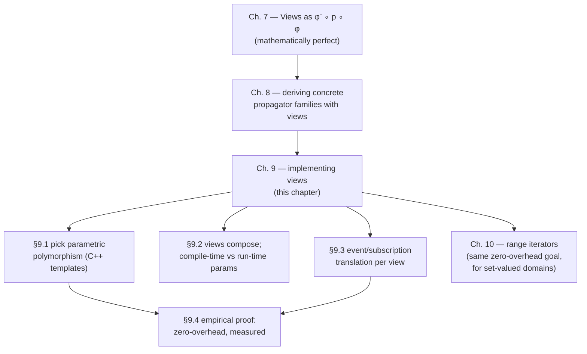

[[book-guidelines|↩ Back to guidelines]]

# Implementing Views Efficiently

## The problem this chapter has to answer

[[Views-and-Derived-Propagators|The previous chapter]] proved something strong on paper: a view-derived propagator $\hat\varphi(p) = \varphi^- \circ p \circ \varphi$ is *perfect* — a well-defined propagator, sound and contracting, that induces exactly the constraint you wanted, and under the right conditions inherits its parent's full propagation strength. That's a mathematical guarantee. It says nothing about what happens when $\hat\varphi(p)$ actually runs.

And there's an obvious reason to worry. $\hat\varphi(p) = \varphi^- \circ p \circ \varphi$ is, read operationally, three function calls where a hand-written propagator would make one: transform the domain into the parent's coordinate system, run the parent's algorithm, transform the result back. If every domain read and write through a view costs an extra function call — extra stack frames, extra indirection, extra cache misses — then views have traded an engineering problem (combinatorial code explosion) for a performance problem (every derived propagator is slower than the one you'd have hand-written). A solver that is comprehensive but slow is not the dissertation's thesis; the thesis is *comprehensive and fast simultaneously*. So this chapter has one job: show that $\varphi$ and $\varphi^-$ compile away to nothing, and that "perfect" (Chapter 7's word, applied to the mathematics) survives, unmodified, as "perfect" applied to the machine code.

**[[The-Denotational-and-Operational-Model-of-Constraint-Propagation#What breaks without this|What breaks without this]] chapter:** without an answer here, views would be a nice abstraction with an asterisk — theoretically clean, practically a tax on every propagation step, and every solver author would have to personally verify, propagator by propagator, whether that tax was worth paying. The chapter's job is to make the asterisk disappear.

## Three ways to be parametric

Before getting to the answer, Tack sets up the design space. A derived propagator needs to be *parametric* over the view it's built with — the same equality algorithm has to work whether it's handed a plain variable or an offset view or a minus view wrapping that variable. "Parametric" is not one thing; Tack identifies three mechanisms a language might offer (§9.1), and works through the same running example — deriving a propagator for $x = y + 2$ from a propagator for $x = y$ and an offset view — in each one.

**Functional parametricity.** In a language with higher-order functions (ML, Haskell), the propagator is just a function that takes *records of operations* as arguments, not concrete variable types:

```
type variable = { min : unit -> int, max : unit -> int,
                   adjmin : int -> unit, adjmax : int -> unit }

fun equal (x : variable, y : variable) =
  ( #adjmin x (#min y ());
    #adjmax x (#max y ());
    #adjmin y (#min x ());
    #adjmax y (#max x ()) )

fun mkOffsetView (x : variable, offset) =
  { min = fn () => offset + #min x (),
    max = fn () => offset + #max x (),
    adjmin = fn newMin => #adjmin x (newMin - offset),
    adjmax = fn newMax => #adjmax x (newMax - offset) }
```

Calling `equal(x, mkOffsetView(y, 2))` derives the $x = y+2$ propagator with no new code — `mkOffsetView` builds a fresh record whose closures capture `y` and `2`, and `equal` never knows it isn't talking to a bare variable.

**Dynamic binding.** In an OO language with inheritance (Java), the view is a class implementing the same interface as a variable, and *delegates*: it wraps a variable object and forwards each call through its own transformation.

```java
interface IntVar {
  public int min(void);       public int max(void);
  public void adjmin(int);    public void adjmax(int);
}

class OffsetView implements IntVar {
  protected IntVar v; protected int offset;
  public OffsetView(IntVar v0, int o0) { v = v0; offset = o0; }
  public int min() { return v.min()+offset; }
  public int max() { return v.max()+offset; }
  public void adjmin(int newMin) { v.adjmin(newMin-offset); }
  public void adjmax(int newMax) { v.adjmax(newMax-offset); }
}

class Eq extends Propagator {
  protected IntVar x; protected IntVar y;
  public Eq(IntVar x0, IntVar y0) { x = x0; y = y0; }
  public void propagate() {
    x.adjmin(y.min()); x.adjmax(y.max());
    y.adjmin(x.min()); y.adjmax(x.max());
  }
}
```

`new Eq(x, new OffsetView(y, 2))` derives the same propagator. The propagator's calls to `y.min()` are resolved at run time via the vtable — dynamic binding.

**Parametric polymorphism.** In C++, the propagator is a class template, parametric over the *types* of its views rather than over values or vtable slots:

```cpp
template <class View0, class View1>
class Eq : public Propagator {
protected: View0* x; View1* y;
public:    Eq(View0* x0, View1* y0) : x(x0), y(y0) {}
           virtual void propagate(void) {
             x->adjmin(y->min()); x->adjmax(y->max());
             y->adjmin(x->min()); y->adjmax(x->max());
           }
};
```

`new Eq<IntVar,OffsetView>(x, new OffsetView(y,2))` derives $x=y+2$ one more time. The crucial difference from the Java version: `OffsetView` here does **not** inherit from any `IntVar` interface. It just happens to expose the same four method names — there is no shared vtable, no common base class, nothing dynamic about the dispatch at all. The compiler resolves every call at compile time because it knows the concrete types `View0` and `View1` the moment `Eq<IntVar,OffsetView>` is instantiated.

All three examples derive the *identical* propagator. That's Tack's point about **orthogonality**: views are independent of which solver, and even which language, hosts them. Wherever a language gives you some notion of parametricity and variable domains are accessed through variable-like objects, you can build views on top. The interesting question is only which flavor of parametricity to pick, and that's a performance question, not a correctness one.

### Rust's version of the same choice

Rust actually offers a close analogue of exactly this three-way split, and it makes the trade-off unusually visible because Rust makes you choose explicitly.

```rust
trait IntVar {
    fn min(&self) -> i32;
    fn max(&self) -> i32;
    fn adjmin(&mut self, new_min: i32);
    fn adjmax(&mut self, new_max: i32);
}

struct OffsetView<'a, V: IntVar> {
    v: &'a mut V,
    offset: i32,
}

impl<'a, V: IntVar> IntVar for OffsetView<'a, V> {
    fn min(&self) -> i32 { self.v.min() + self.offset }
    fn max(&self) -> i32 { self.v.max() + self.offset }
    fn adjmin(&mut self, new_min: i32) { self.v.adjmin(new_min - self.offset) }
    fn adjmax(&mut self, new_max: i32) { self.v.adjmax(new_max - self.offset) }
}

// Static dispatch — this is the C++-template analogue:
// monomorphized, inlined, zero indirection.
fn equal<X: IntVar, Y: IntVar>(x: &mut X, y: &mut Y) {
    let (ymin, ymax) = (y.min(), y.max());
    x.adjmin(ymin);
    x.adjmax(ymax);
    let (xmin, xmax) = (x.min(), x.max());
    y.adjmin(xmin);
    y.adjmax(xmax);
}

// Dynamic dispatch — this is the Java-vtable analogue:
// one concrete `equal_dyn`, callable with any mix of view types
// at run time, at the cost of a vtable indirection per call.
fn equal_dyn(x: &mut dyn IntVar, y: &mut dyn IntVar) {
    let (ymin, ymax) = (y.min(), y.max());
    x.adjmin(ymin);
    x.adjmax(ymax);
}
```

`equal::<IntVarImpl, OffsetView<IntVarImpl>>(&mut x, &mut y)` is Rust's version of the C++ template instantiation — the compiler generates a specialized `equal` for that exact pair of types, and (as in C++) is free to inline `OffsetView`'s bodies straight into it. `equal_dyn(&mut x, &mut offset_view)` is Rust's version of the Java path — one function, `dyn IntVar` trait objects, a vtable call per `min`/`max`/`adjmin`/`adjmax`. Rust's `fn foo<T: Trait>(...)` versus `fn foo(x: &dyn Trait)` is, almost verbatim, Tack's "parametric polymorphism versus dynamic binding" distinction — the language just forces you to write `dyn` or not, rather than leaving the choice implicit in whether you used templates or virtual methods.

## Which kind of parametricity to choose

Tack narrows to the two options a language like C++ actually offers side by side — dynamic binding and parametric polymorphism — and lays out the trade-off precisely.

**Parametric polymorphism is compiled by monomorphization**: the compiler replicates the generic code once per concrete instantiation and compiles each copy separately, as an ordinary (non-generic) function. Because each copy has fully concrete types, the compiler can optimize it like any other function — in particular, it can *inline* the view's transformations directly into the propagator body. A parametric propagator built this way pays nothing extra for using a view: there is no function call left to pay for, because there's no polymorphism left at run time. All C++ compilers do this (and some SML implementations, e.g. MLton).

The price is **expressiveness**. Templates instantiate only at compile time. Either the whole model has to be fixed in C++ at compile time, or every propagator variant that might ever be needed has to be explicitly instantiated in advance. And for $n$-ary constraints this bites specifically: an array of views passed to an $n$-ary propagator must be *monomorphic* — every element the same concrete view type — because the array's element type has to be one concrete type. You cannot mix scale views and minus views in the same array for a linear constraint, or mix constant views with ordinary views in an $n$-ary set constraint. Gecode's workaround, where it matters, is to give a propagator *two* separate monomorphic arrays instead of one heterogeneous one — e.g. one array of identity views and a second array of minus views for a linear constraint that needs both.

**Dynamic binding's advantage is exactly the flexibility templates give up**: instantiation happens at run time, so arrays can hold arbitrarily different view types side by side, decided by data the solver only sees while modeling, not by the compiler. The cost is that view transformations can no longer be inlined — each becomes a genuine virtual method call.

Gecode is built on C++ templates. Section 9.4 is Tack's evidence that this was the right call.

```rust
// The n-ary monomorphism constraint, made concrete: this compiles —
fn linear_eq<V: IntVar>(views: &mut [V], k: i32) { /* ... */ }
// but this array can't exist as written — OffsetView<X> and MinusView<X>
// are different concrete types, so `Vec<_>` has no single element type:
//
//   let views: Vec<???> = vec![OffsetView::new(&mut x, 2), MinusView::new(&mut z)];
//
// Gecode's actual fix generalizes: pass two monomorphic arrays instead of one
// heterogeneous one — exactly like keeping a Vec<OffsetView<_>> and a
// separate Vec<MinusView<_>> rather than trying to unify them.
```

## Views can themselves be parametric

Section 9.2 makes a point that's easy to miss: nothing forces a view to be defined directly over a bare variable. A view can wrap another view, and this is exactly the *composition* $\hat\varphi \circ \hat{\varphi'}$ argued for abstractly in [[Views-and-Derived-Propagators|Chapter 7, Section 7.5]] — here it becomes a concrete C++ template parametric over the thing it wraps:

```cpp
template <class View>
class MinusView {
protected: View* v;
public:     MinusView(View* v0) : v(v0) {}
            int min(void) { return -v->max(); }
            int max(void) { return -v->min(); }
            void adjmin(int newMin) { v->adjmax(-newMin); }
            void adjmax(int newMax) { v->adjmin(-newMax); }
};
```

And a **constant view** — introduced back in Chapter 8 as $\varphi^-(c) = \{a \mid X \mapsto a \in c\}$, used to specialize a propagator by fixing one of its variables to a literal value — becomes, concretely, a "variable" whose bounds never move and whose adjustment methods double as bounds checks:

```cpp
class ConstantIntView {
protected: int k;
public:     ConstantIntView(int k0) : k(k0) {}
            int min(void) { return k; }
            int max(void) { return k; }
            void adjmin(int newMin) { if (newMin>k) fail(); }
            void adjmax(int newMax) { if (newMax<k) fail(); }
};
```

If a propagator ever tries to tighten a constant view's bound past `k`, `adjmin`/`adjmax` reports failure instead — the empty-domain outcome the abstract $\varphi^-(c)$ was defined to produce.

There's a second axis hiding inside all of this: a view's own parameter — the offset in `OffsetView`, the coefficient in a scale view, the `k` in `ConstantIntView` — can itself be fixed at **compile time** or only known at **run time**. A minus view is literally nothing but a scale view specialized to coefficient $-1$ at compile time; a "zero view" or "one view" is `ConstantIntView` specialized the same way. Fixing the parameter at compile time buys the compiler more constant-folding opportunity — the same trade Section 9.1 already made at the level of which-parametricity-mechanism, replayed one level down at the level of which-parameter-values.

```rust
// Compile-time-specialized "minus view" as literally a scale view at -1 —
// the type itself encodes the constant, so the compiler can constant-fold
// every multiplication by -1 away entirely.
struct ScaleView<'a, V: IntVar, const A: i32> { v: &'a mut V }
type MinusView<'a, V> = ScaleView<'a, V, -1>;

// versus a run-time-parametrized scale view, where `a` is a field:
struct ScaleViewDyn<'a, V: IntVar> { v: &'a mut V, a: i32 }
```

## Event handling under a view

[[Efficient-Propagator-Scheduling|Chapter 5's propagation-condition and event machinery]] and [[Implementation-Architecture-of-a-Propagation-Kernel|Chapter 6's subscribe/cancel/modification-event-delta implementation]] were both built assuming propagators talk directly to variables. A view sits between them, and Section 9.3 is about what has to change so that machinery still works correctly when a propagator is actually watching a *view* of a variable.

The concrete example is the minus view again, and it's a genuinely different failure mode than "extra function call": get this wrong and propagators don't just run slower, they run *incorrectly*, because they'll interpret an event under the wrong meaning. A lower-bound-changed ($\mathrm{lbc}$) event on the underlying variable $y$ is an *upper*-bound-changed event as seen through $-y$ — negation flips which end of the interval moved. So a minus view's `subscribe` method has to swap $\mathrm{lbc} \leftrightarrow \mathrm{ubc}$ on the way through:

```cpp
void subscribe(Propagator& p, PropagationCondition pc) {
  switch (pc) { case {asn, lbc}: v->subscribe(p, {asn, ubc}); break;
                case {asn, ubc}: v->subscribe(p, {asn, lbc}); break;
                default: v->subscribe(p, pc); }
}
```

`cancel` needs the same swap. And it isn't only subscription that needs translating — the **modification event delta** from Chapter 6, the record of "which events fired since I last ran" that lets a propagator stage its own work cheaply, has to be reinterpreted through the view too: the propagator must read an $\mathrm{lbc}$ bit on the underlying variable as a $\mathrm{ubc}$ bit if it's looking at that variable through a minus view. The assignment event $\mathrm{me_{asn}}$ is invariant under any view (once a variable is assigned, "assigned" doesn't depend on which direction you're looking at it from) — but bound-direction events are not, in general.

```rust
enum Event { Assigned, LowerBoundChanged, UpperBoundChanged, DomainChanged }

trait EventView {
    /// Translate an event as reported by the underlying variable into the
    /// event the propagator should see through this view.
    fn translate(&self, e: Event) -> Event;
}

impl EventView for MinusViewTag {
    fn translate(&self, e: Event) -> Event {
        match e {
            Event::LowerBoundChanged => Event::UpperBoundChanged,
            Event::UpperBoundChanged => Event::LowerBoundChanged,
            other => other, // Assigned and DomainChanged pass through unchanged
        }
    }
}
```

This is the operational payoff of Chapter 7's abstract claim that views transport propagation strength correctly: it only holds if the *event* bookkeeping is transported correctly too, and that has to be implemented, propagator by propagator's-eye-view, not just proved once in the model.

## Does it actually cost nothing? — the evidence

Section 9.4 is where the chapter delivers on its opening promise, in three independent kinds of evidence.

**Scale.** Table 9.1 counts how heavily Gecode actually leans on this mechanism:

| Variable type | Parametric propagators | Derived propagators | Ratio |
|---|---|---|---|
| Integer | 78 | 304 | 3.90 |
| Boolean | 25 | 84 | 3.36 |
| Set | 24 | 126 | 5.25 |
| **Overall** | **127** | **514** | **4.05** |

Every parametric propagator yields, on average, four usable instances "for free." Gecode's propagators alone are 40,000+ lines of code and documentation; extrapolating that per-instance cost to 514 hand-written variants puts the *avoided* cost around 120,000 lines — against roughly 8,000 lines of view code actually written. Tack's own framing: a 1500% return on investment. This is the chapter's answer to "was the code-reuse problem from Chapter 7 solved for real" — not "it's theoretically possible to reuse code" but "it was reused, at this measured ratio, in a production solver."

**Compiled code inspection.** Table-counting shows views get *used*; it doesn't show they're *free*. For that, Tack goes to the assembly. Instantiate the templated equality propagator from Section 9.1 with a plain `IntVar` for $x$ and an `OffsetView` for $y$, compile with GCC for x86, and disassemble `propagate`:

```
P<IntVar,OffsetView>::propagate:
1       pushl   %ebp
2       movl    %esp,    %ebp
3       movl    8(%ebp), %eax
4       movl    8(%eax), %edx
5       movl    4(%eax), %eax
6       movl    (%eax), %eax
7       subl    4(%edx), %eax
8       movl    (%edx), %edx
9       cmpl    (%edx), %eax
10      jle     L4
11      movl    %eax,    (%edx)
    L4:
12      leave
13      ret
```

There is exactly one function call in this listing, and it's the call to `propagate` itself (implicit in the `ret`). The offset subtraction that `OffsetView::min()` was supposed to perform (line 7) happens as a single inline `subl`, indistinguishable in the machine code from an ordinary field access — there is no separate call frame for `OffsetView::min()`, because monomorphization deleted the abstraction boundary before code generation ever started. This is the concrete cash-out of Section 9.1's claim: templates plus inlining plus constant folding really do erase the view at compile time, not just in principle but in the object code Tack actually inspected.

**Benchmarks.** The third kind of evidence asks two separate empirical questions, each isolating one variable:

*Views versus decomposition* (Table 9.2): replace several view-derived propagators with the "just introduce auxiliary variables and extra propagators" decomposition from Chapter 7's original bad-options framing, and measure the damage. Some integer examples (linear equations with coefficients) lose up to roughly 7× the run-time and memory. Set examples fare better — often because the complement/negation variable the decomposition needs was already present in the model anyway, so it's not pure overhead. One example (100 Queens) shows 23× more propagation steps under decomposition but only 41% more run-time, because the extra steps are cheap ($x=y+i$-shaped) propagators — a reminder that propagation-step count and wall-clock cost are not the same measurement.

*Templates versus virtual methods* (Table 9.3): hold the *view logic* fixed and vary only the dispatch mechanism, by making integer-variable operations virtual (a conservative stand-in for "what if Gecode had chosen dynamic binding in Section 9.1"). Overhead runs 3%–123% for integer examples and 11%–31% for set examples. This isolates exactly the cost Section 9.1 predicted dynamic binding would carry — and confirms templates avoid it.

Together, the three pieces of evidence answer three different questions the chapter needed to close: *is the mechanism actually load-bearing in a real system* (Table 9.1), *is the abstraction actually erased at the machine-code level* (Example 9.4), and *does the alternative design actually cost what the theory predicted* (Tables 9.2–9.3).

## Where this leads



Chapter 9 closes the loop the dissertation opened when it first proposed views: Chapter 7 showed derivation is *mathematically* free (perfect propagators), and this chapter shows it can be made *computationally* free too, at least in a language offering true compile-time parametric polymorphism. The next chapter (10, Range Iterators) is the same zero-overhead ambition applied to a harder case — set-valued domain operations, where compiler optimization alone turns out not to be enough, motivating the specification-based technique of Chapter 11.

For the `sat-smt-csp` focus area, this chapter is the concrete engineering argument for why a *general-purpose CSP kernel* doesn't have to trade comprehensiveness for speed: the same design pattern — a small algorithmic core, parametrized over a zero-cost abstraction layer, monomorphized at compile time — is exactly the shape you'd want from any solver backend that has to stay both broad (many constraint/theory variants) and fast (feeding tight verification-condition or search loops). The empirical discipline here is worth carrying forward too: "the abstraction is free" is a claim this chapter never leaves at the theoretical level — it's checked against disassembly and against wall-clock benchmarks, which is the same standard any downstream over-approximating analysis pass built on this kind of solver should be held to.
