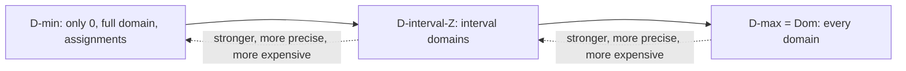

# Propagation Strength and Domain Approximations

[[book-guidelines|↩ Back to guidelines]]

## The problem: "correct" is not enough — how do we compare two propagators?

[[Constraint-Satisfaction-and-Propagation-Based-Solving|Chapter 3's model]] (see [[The-Denotational-and-Operational-Model-of-Constraint-Propagation]]) nailed down what a **propagator** *is*: a function $p$ on domains that is **contracting** ($p(d) \subseteq d$ — it only ever removes values, never adds them) and **sound** (it never removes a value that participates in an actual solution). That definition is deliberately permissive. It rules out *incorrect* propagators, but it says nothing about *how much* pruning a propagator has to do. The all-different constraint on three variables has an entire spectrum of legal propagators: one that does nothing until every variable is assigned and only then checks for repeats, one that removes a handful of obviously-doomed values, and one that removes every single value that cannot appear in any solution. All three are propagators in Chapter 3's sense. None of them is "wrong." They just differ in **strength**.

Chapter 3 already proved something sharp about this spectrum: for any constraint $c$, there is a *unique* weakest propagator $p^{\min}_c$ and a *unique* strongest propagator $p^{\max}_c$ that induce $c$ (uniqueness follows from the propagator lattice being closed under union and intersection). This chapter's job is to fill in the space *between* those two extremes with a precise vocabulary, because "somewhere between the weakest and the strongest" is exactly where every practical propagator lives — and where it lives determines both how much it prunes and how expensive it is to compute.

**[[The-Denotational-and-Operational-Model-of-Constraint-Propagation#What breaks without this|What breaks without this]]:** without a principled notion of propagation strength, "consistency" becomes folklore — a grab-bag of ad hoc named properties (bounds consistency, range consistency, arc consistency, hyperarc consistency...) each defined separately for each constraint family, with no shared vocabulary for comparing them or for stating precisely what a new algorithm achieves. Tack's whole point in this chapter is to derive all of those classical notions as *instances of one general construction* — domain approximation — rather than as an unrelated pile of definitions.

## 4.1 Making $p^{\min}_c$ and $p^{\max}_c$ concrete

The weakest propagator for $c$ is almost a non-propagator: it only ever fires the decision procedure for $c$, and only when the domain is already a single assignment $\{a\}$.

$$p^{\min}_c(d) := \text{if } d = \{a\} \text{ and } a \notin c \text{ then } 0 \text{ else } d$$

Here $0$ denotes the unique failed domain (all variables mapped to $\emptyset$). $p^{\min}_c$ is idempotent and monotonic and induces exactly $c$ — it just never prunes anything short of outright rejecting a fully-assigned, constraint-violating tuple.

The strongest propagator is the opposite extreme, and its definition needs one new piece of machinery: the **domain relaxation** of a constraint.

$$\llbracket c \rrbracket := \bigcap \{d \in \mathrm{Dom} \mid c \subseteq \mathrm{con}(d)\}$$

In words: among *all* domains that are loose enough to still license every solution of $c$, take the tightest one. Because the set of domains $\mathrm{Dom}$ is closed under intersection, this intersection is itself a domain, and it is provably the *strongest* domain consistent with $c$. The strongest propagator then simply relaxes $c \cap d$:

$$p^{\max}_c(d) := \llbracket c \cap d \rrbracket$$

$p^{\max}_c$ is monotonic, idempotent, induces $c$, and — this is the property this whole chapter will now generalize — it is **domain-complete**: on every input domain, it returns the tightest domain any propagator inducing $c$ could possibly return.

**Worked example (linear constraint, Tack's Example 4.4/4.22).** Take $c := \llbracket x = 3y + 5z \rrbracket$ and the domain $d(x) = \{3,\dots,7\}$, $d(y) = \{0,1,2\}$, $d(z) = \{0,1\}$. $p^{\min}_c$ does nothing to $d$ (it's not assigned). $p^{\max}_c$ removes every value that cannot participate in a solution: $p^{\max}_c(d)(x) = \{3,5,6\}$ — it strips out $4$ and $7$, because no combination of $y \in \{0,1,2\}, z \in \{0,1\}$ produces $x=4$ or $x=7$. Keep this concrete example in your head; it will be the yardstick for every weaker notion of strength introduced below.

**What breaks without unique bounds:** if $p^{\min}_c$ or $p^{\max}_c$ weren't unique, "the strength of a propagator for $c$" wouldn't even have well-defined endpoints to measure against — you'd be comparing propagators against a moving target. Uniqueness is what makes "propagation strength" a coherent axis at all, rather than a vague quality judgment.

## 4.2 Why domain-completeness alone isn't a usable target

Here is the practical problem with $p^{\max}_c$: actually **computing** it can be intractable. Choi et al. (2004) show that deciding whether $\llbracket c \cap d \rrbracket \subset d$ — exactly the test a domain-complete propagator for a linear equation constraint would need to perform — is **NP-complete**. Demanding domain-completeness from every propagator in your solver would mean routinely solving NP-hard problems just to prune.

In practice, solvers sidestep this by pruning *less* than $p^{\max}_c$ would, in a structured way: for integer variables, most propagators only track and prune the **bounds** of a domain's interval, ignoring holes in the middle. A domain-complete all-different propagator (Régin, 1994) costs $O(n^{2.5})$; the weaker interval-reasoning version (Puget, 1998) costs $O(n \log n)$. For set variables, the story is even more dramatic: a set variable's domain is a set of *sets*, so its size is exponential in the universe size — no solver actually materializes it. Instead, every practical set solver stores and prunes only a **lower and upper bound**, treating the domain as an *interval of sets* under the subset order.

Both of these — integer interval reasoning and set interval reasoning — are instances of the same underlying idea: **approximate the domain lattice by a smaller, tractable sub-lattice, and define propagation strength relative to that approximation instead of relative to the full lattice.** That idea is formalized next.

## 4.3 Domain systems: the formal notion of "a tractable sub-lattice"

A **domain system** $\mathcal D$ is a subset of $\mathrm{Dom}$ — a restricted vocabulary of domains a propagator is allowed to traffic in — satisfying three closure requirements (Definition 4.5):

- $\mathcal D$ is closed under intersection.
- $\mathcal D$ contains the full domain $\lambda x.V$ (every variable ranges over everything).
- $\mathcal D$ contains every assigned domain $\{a\}$ (so solutions are always representable).

Closure under intersection is what makes the failed domain $0$ automatically a member of any domain system (intersect two distinct assigned domains and you get $0$ for free), and — more importantly — it's exactly what's needed to make the next definition well-formed.

**The interval domain system, concretely.** $\mathcal D^{[\mathbb Z]} := \{X \to \mathcal P_{\mathrm{int}}(V) \mid \dots\}$, the set of domains where every variable's value set is an interval $[i,j]$. All singleton intervals, the full interval, and the empty interval $[1,0]$ are present, and intervals are closed under intersection — so $\mathcal D^{[\mathbb Z]}$ is a genuine domain system. This is the formal object underneath "bounds propagation."

Given a domain system, the **$\mathcal D$-relaxation** of a constraint generalizes $\llbracket \cdot \rrbracket$ by restricting the intersection to $\mathcal D$ instead of all of $\mathrm{Dom}$:

$$\llbracket c \rrbracket_{\mathcal D} := \bigcap \{d \in \mathcal D \mid c \subseteq d\}$$

For $\mathcal D^{[\mathbb Z]}$ this works out to the obvious thing: $\llbracket c \rrbracket_{\mathcal D^{[\mathbb Z]}} = \lambda x.[\min(\llbracket c \rrbracket(x)), \max(\llbracket c \rrbracket(x))]$ — take the exact relaxation, then just keep its bounds and throw away the holes.

**Domain systems form their own lattice, ordered backwards from what you'd first guess.** Definition 4.8 calls $\mathcal D_1$ *stronger* than $\mathcal D_2$ when $\llbracket c \rrbracket_{\mathcal D_1} \subseteq \llbracket c \rrbracket_{\mathcal D_2}$ for every constraint $c$ — i.e., $\mathcal D_1$'s relaxations are always at least as tight. Proposition 4.9 proves this is equivalent to plain set inclusion: $\mathcal D_1$ is stronger than $\mathcal D_2$ **iff $\mathcal D_1 \supseteq \mathcal D_2$** — the *bigger* set of representable domains gives the *stronger* (tighter) approximations, because a bigger vocabulary of domains lets you carve closer to the true relaxation. The two extremes are $\mathcal D^{\max} := \mathrm{Dom}$ (everything representable — domain completeness) and $\mathcal D^{\min} := \{0, \lambda x.V\} \cup \{\{a\} \mid a \in \mathrm{Asn}\}$ (only failure, the full domain, and full assignments — nothing in between). $\mathcal D^{[\mathbb Z]}$ sits strictly between them: richer than $\mathcal D^{\min}$, coarser than $\mathcal D^{\max}$.

**This is a Galois connection, named plainly.** If you've done abstract interpretation, this should feel exactly like the abstraction/concretization machinery of Cousot & Cousot. Read $\mathrm{Dom}$ as the *concrete* lattice (ordered by $\subseteq$, "stronger domain" = more information), and a domain system $\mathcal D \subseteq \mathrm{Dom}$ as an *abstract* domain living inside it — not a separate structure, but a distinguished sub-lattice closed under meet ($\cap$). The relaxation operator $\llbracket \cdot \rrbracket_{\mathcal D}: \mathrm{Con} \to \mathcal D$ plays the role of the **abstraction function $\alpha$** (it takes an arbitrary set of assignments and rounds it up to the best-representable approximation in $\mathcal D$); the inclusion $\mathcal D \hookrightarrow \mathrm{Dom}$ plays the role of the **concretization function $\gamma$** (trivial here, since $\mathcal D$'s elements already *are* domains). The requirement that $\mathcal D$ be closed under intersection is precisely the condition that makes $\alpha$ well-defined as "best over-approximation" — exactly the role meet-closure plays for an abstract domain's Galois connection in a standard abstract-interpretation framework. Interval integer domains ($\mathcal D^{[\mathbb Z]}$) are the CSP-world's interval abstract domain; set-interval domains (Section 4.5 below) are its Cartesian-product-of-intervals-under-a-different-order sibling. **This is arguably the single most direct, textbook-shaped instance of abstract interpretation anywhere in this dissertation** — not a loose analogy, but the same mathematical object (a meet-closed sub-lattice standing in for a Galois-connected abstraction) doing the same job (trading precision for tractability) under a different name.



**Rust [[The-Denotational-and-Operational-Model-of-Constraint-Propagation#Grounding|grounding]].** A domain system is naturally a *type* of domain representation, not a value — the type itself is the sub-lattice:

```rust
/// A domain system D, reified as a trait: implementors are exactly the
/// representable domains of D. Different implementors = different D's.
trait DomainRepr: Clone + PartialEq {
    fn full(vars: &[VarId]) -> Self;      // D contains the full domain
    fn singleton(a: &Assignment) -> Self; // D contains all assigned domains
    fn meet(&self, other: &Self) -> Self; // D is closed under intersection
    fn is_failed(&self) -> bool;          // meet of two disjoint singletons
}

/// D^[Z]: only interval-shaped domains are representable at all — you
/// cannot even *express* "{1,3,5}", only "[1,5]".
#[derive(Clone, PartialEq)]
struct IntervalDomain { lo: i64, hi: i64 } // hi < lo encodes the empty interval

impl DomainRepr for IntervalDomain {
    fn full(_: &[VarId]) -> Self { IntervalDomain { lo: i64::MIN, hi: i64::MAX } }
    fn singleton(a: &Assignment) -> Self { let v = a.value(); IntervalDomain { lo: v, hi: v } }
    fn meet(&self, o: &Self) -> Self {
        IntervalDomain { lo: self.lo.max(o.lo), hi: self.hi.min(o.hi) }
    }
    fn is_failed(&self) -> bool { self.hi < self.lo }
}
```

The point of writing it this way: `IntervalDomain` is *structurally incapable* of representing `{1, 3, 5}` — there is no bitset hiding inside it. That's not a missing feature, it's the entire mechanism. A propagator written against `IntervalDomain` can only ever return interval-shaped results, no matter how clever its algorithm — the domain *system* is what bounds the strength, before you even get to how good the propagation algorithm is.

**Lean grounding.** The Galois-connection reading above is worth making literal:

```lean
-- A domain system as a meet-closed subset of the domain lattice.
structure DomainSystem (Dom : Type) [Lattice Dom] where
  mem      : Dom → Prop
  full_mem : mem ⊤
  meet_closed : ∀ d₁ d₂, mem d₁ → mem d₂ → mem (d₁ ⊓ d₂)

-- The D-relaxation of a constraint is the best D-representable
-- over-approximation — literally an abstraction map α into D.
def relax (D : DomainSystem Dom) (c : Con) : Dom := sInf {d | D.mem d ∧ c ⊆ con d}
```

`relax D` is exactly an $\alpha$ function into the abstract domain `D.mem`; the fact that Tack proves `Vc W_D` well-defined by appeal to `D` being meet-closed is the same proof obligation Lean's `GaloisConnection`/`CompleteLattice` infrastructure would demand of an `sInf`-based abstraction map — the two developments are doing the identical piece of order theory.

**What breaks without domain systems:** without a formal, closed vocabulary of "representable" domains, you can't even *state* what a bounds-propagator promises — "propagates bounds" would remain an informal description of an algorithm's behavior rather than a checkable specification the algorithm is proven to meet.

## 4.4 Completeness with respect to $\mathcal D$: turning an approximation into a strength class

Domain-completeness said "$p(d) \subseteq \llbracket c_p \cap d \rrbracket$" — every possible pruning that respects the *exact* solutions of $c_p \cap d$ must have been done. The generalization (Definition 4.10) simply routes both the demand and the excuse for not pruning further through $\mathcal D$:

$$p \text{ is } \mathcal D\text{-complete} \iff \forall d.\ p(d) \subseteq \llbracket c_p \cap \llbracket d \rrbracket_{\mathcal D} \rrbracket_{\mathcal D}$$

Read this carefully, because the two occurrences of $\llbracket\cdot\rrbracket_{\mathcal D}$ are doing different jobs. The **inner** one says: you're only obligated to find solutions consistent with the *rounded-up* domain $\llbracket d \rrbracket_{\mathcal D}$, not the literal (possibly hole-riddled) $d$ — you're allowed to reason as if the holes weren't there. The **outer** one says: your result only has to be *at least as coarse as a $\mathcal D$-domain* — you're never required to produce a result more precise than $\mathcal D$ can represent. Setting $\mathcal D = \mathrm{Dom}$ collapses both relaxations back to $\llbracket\cdot\rrbracket$ and recovers ordinary domain completeness exactly.

Crucially, $\mathcal D$-completeness is defined as a **lower bound only** — a floor on how much pruning is required, not a ceiling on how much is allowed. This has an immediate, slightly surprising consequence: **every domain-complete propagator is automatically $\mathcal D$-complete for every domain system $\mathcal D$.** Being maximally strong trivially satisfies any weaker floor.

For every constraint $c$ there is a unique *weakest* $\mathcal D$-complete propagator, the **$\mathcal D$-canonical** propagator:

$$p(d) := \llbracket c \cap \llbracket d \rrbracket_{\mathcal D} \rrbracket_{\mathcal D} \cap d$$

**Worked example (Tack's Example 4.12).** Take all-different on three variables, $c_p = \llbracket x \ne y \wedge x \ne z \wedge y \ne z \rrbracket$, and $d(x)=d(y)=d(z)=\{1,3\}$. Rounding up to $\mathcal D^{[\mathbb Z]}$ gives $\llbracket d \rrbracket_{\mathcal D^{[\mathbb Z]}} = \{1,2,3\}$ for every variable, and $c_p \cap \{1,2,3\}^3$ still contains solutions using every value, so a $\mathcal D^{[\mathbb Z]}$-complete propagator is **not obligated to prune $d$ at all** — even though $d$ itself has no solution ($\{1,3\}$ can't supply three distinct values to three variables)! Change the domain to $d'(x)=d'(y)=d'(z)=\{1,2\}$, though, and $\llbracket d' \rrbracket_{\mathcal D^{[\mathbb Z]}} = d'$ exactly (already an interval), so the propagator *must* detect failure. This is a genuinely important lesson: a $\mathcal D$-complete propagator's obligations are computed *after* rounding the input up into $\mathcal D$'s vocabulary — it can be blind to structure that only exists once you see through the approximation.

**What breaks without the lower-bound framing:** if $\mathcal D$-completeness instead pinned down an *exact* amount of pruning (a two-sided bound), you couldn't have both a cheap $\mathcal D^{[\mathbb Z]}$-complete bounds-propagator *and* a domain-complete propagator coexist as both being "correct at their respective strengths" — you'd need entirely separate, non-comparable correctness notions for every strength level, defeating the point of a unified framework.

## 4.5 Consistency versus completeness — and why idempotency isn't free

Historically, the constraint-programming literature talks about **consistency of a domain**, not completeness of a propagator. Tack reconciles the two vocabularies. **Domain-consistency** (Definition 4.13) is a property of a *domain*, not a propagator: $d$ is domain-consistent for $c$ iff $d = \llbracket c \cap d \rrbracket$ — $d$ is already a fixed point of the exact relaxation. A propagator "establishes" domain consistency when its output is always such a fixed point. Since domain-complete propagators are idempotent, they automatically establish domain consistency:

$$p(d) = p(p(d)) = \llbracket c_p \cap p(d) \rrbracket$$

Generalizing to a domain system gives $\mathcal D$-consistency (Definition 4.14): $d \subseteq \llbracket c \cap \llbracket d \rrbracket_{\mathcal D} \rrbracket_{\mathcal D}$.

Here is the trap: **$\mathcal D$-completeness of $p$ does *not* imply that $p$'s output is $\mathcal D$-consistent.** Because $\mathcal D$-completeness is only a lower bound, a propagator can satisfy it while being *either too weak or too strong* to reach a fixed point that is itself $\mathcal D$-consistent:

- **Too weak (Example 4.15).** A $\mathcal D^{[\mathbb Z]}$-complete propagator for $x=y$ defined as $p(d) = (x \mapsto d(x) \cap \llbracket d\rrbracket_{\mathcal D^{[\mathbb Z]}}(y),\ y \mapsto d(y) \cap \llbracket d\rrbracket_{\mathcal D^{[\mathbb Z]}}(x))$ turns $d=(x{\mapsto}\{0,2,3\}, y{\mapsto}\{1,2,3\})$ into $p(d)=(x{\mapsto}\{2,3\}, y{\mapsto}\{1,2,3\})$ — legally $\mathcal D^{[\mathbb Z]}$-complete, but not a fixed point, and not $\mathcal D^{[\mathbb Z]}$-consistent: you'd have to run it again to make further progress.
- **Too strong (Example 4.16).** A propagator between $\mathcal D^{[\mathbb Z]}$-complete and domain-complete for all-different on $d(x_1)=d(x_2)=d(x_3)=\{1,3\}$ might remove just the $1$ from $x_1$'s domain — legal, but not $\mathcal D^{[\mathbb Z]}$-consistent either, because it did *more* than $\mathcal D^{[\mathbb Z]}$-completeness required without reaching a genuine fixed point of the approximation.

What *does* hold unconditionally is Proposition 4.17: **at a fixed point**, any $\mathcal D$-complete propagator is guaranteed $\mathcal D$-consistent. If $d$ is a fixed point ($p(d)=d$), substitute into the $\mathcal D$-completeness inequality and you get $p(d) \subseteq \llbracket c_p \cap \llbracket p(d) \rrbracket_{\mathcal D} \rrbracket_{\mathcal D}$ directly — which *is* $\mathcal D$-consistency of $d$. This is exactly the property a propagation-based solver relies on operationally: whatever fixed point the solver settles on, it will be $\mathcal D$-consistent for the propagator's induced constraint, even though intermediate, non-fixed-point states along the way carry no such guarantee.

**What breaks without this distinction:** conflating "$\mathcal D$-complete" with "$\mathcal D$-consistent output" would make it look like running a $\mathcal D$-complete propagator once is always enough — but Examples 4.15/4.16 show that's false mid-computation. The solver's correctness argument needs the *weaker*, always-true statement (Prop 4.17, true only at fixed points) rather than the stronger, false one.

## 4.6 Two ways to be "in between": $\mathcal D$-Dom and Dom-$\mathcal D$ completeness

The generic $\mathcal D$-completeness inequality has *two* relaxation operators, and the interesting classical consistency notions turn out to correspond to strengthening exactly *one* of the two back to the full, exact relaxation while leaving the other approximated. This is the essential difference the chapter's own Key Question asks about, and it's worth sitting with the two definitions side by side (Definition 4.20):

$$d \text{ is } \mathcal D\text{-Dom-consistent} \iff d \subseteq \llbracket c \cap d \rrbracket_{\mathcal D} \qquad\qquad d \text{ is Dom-}\mathcal D\text{-consistent} \iff d \subseteq \llbracket c \cap \llbracket d \rrbracket_{\mathcal D} \rrbracket$$

- **$\mathcal D$-Dom**: intersect $c$ with the *literal, unrounded* domain $d$ — no rounding on the way in — but only demand the *result* be a $\mathcal D$-domain. For $\mathcal D = \mathcal D^{[\mathbb Z]}$ this is exactly **bounds(D)-consistency** (Definition 4.19): for each variable $x$, there must exist a *genuine* solution $a \in c$ hitting $a(x)=\min(d(x))$ with every other variable's value drawn from its *actual* (possibly hole-riddled) domain $d(y)$ — not merely between its bounds.
- **Dom-$\mathcal D$**: round $d$ up to $\mathcal D$ on the way in, but demand the exact, unrounded relaxation on the way out. For $\mathcal D = \mathcal D^{[\mathbb Z]}$ this is **range-consistency**: for every value $v$ in $x$'s domain (not just its bounds!), there must be a solution using $v$ for $x$, with the *other* variables' values merely required to lie between their bounds.

So: bounds(D) tightens the *witness requirement* (real domain membership instead of interval membership) while still only checking the extreme values of $x$'s interval; range consistency tightens the *coverage requirement* (check every value of $x$, not just its bounds) while still being lenient about the other variables' witnesses. Neither dominates the other in general effort, but both are strictly stronger than plain bounds(Z) consistency and strictly weaker than domain consistency:

$$\mathcal D\text{-complete} \;\preceq\; \{\mathcal D\text{-Dom-complete},\ \mathrm{Dom}\text{-}\mathcal D\text{-complete}\} \;\preceq\; \text{domain-complete}$$

The two classes also differ in a structural way that matters for implementers: the **$\mathcal D$-Dom-canonical** propagator ($p(d) := \llbracket c \cap d \rrbracket_{\mathcal D} \cap d$) is provably **both monotonic and idempotent** (Proposition 4.21) — it can only ever be "too strong," never "too weak," for reaching $\mathcal D$-Dom-consistency. **Dom-$\mathcal D$-complete** propagators, in contrast, behave like plain $\mathcal D$-complete ones: they can be too weak *or* too strong, exactly the Example 4.15/4.16 pathology all over again. This is why, as Tack notes, $\mathcal D^{[\mathbb Z]}$-Dom-complete algorithms are rare in practice (bounds(D) is awkward to compute and doesn't buy idempotency for free the way its cousin does) while $\mathcal D^{[\mathbb Z]}$-complete and Dom-$\mathcal D^{[\mathbb Z]}$-complete algorithms (plain bounds(Z) and range consistency) are common.

Putting the whole hierarchy together (a redrawing of Tack's Figure 4.1, oriented by strength rather than by his original page layout):

<svg viewBox="0 0 640 420" xmlns="http://www.w3.org/2000/svg" font-family="sans-serif" font-size="14">
  <defs>
    <marker id="arrow" markerWidth="8" markerHeight="8" refX="6" refY="3" orient="auto">
      <path d="M0,0 L6,3 L0,6 Z" fill="#888888"/>
    </marker>
  </defs>
  <!-- edges -->
  <line x1="320" y1="55" x2="180" y2="180" stroke="#888888" stroke-width="1.5" marker-end="url(#arrow)"/>
  <line x1="320" y1="55" x2="460" y2="180" stroke="#888888" stroke-width="1.5" marker-end="url(#arrow)"/>
  <line x1="180" y1="200" x2="320" y2="330" stroke="#888888" stroke-width="1.5" marker-end="url(#arrow)"/>
  <line x1="460" y1="200" x2="320" y2="330" stroke="#888888" stroke-width="1.5" marker-end="url(#arrow)"/>
  <!-- top node: domain-complete -->
  <rect x="220" y="15" width="200" height="42" rx="6" fill="#2f6f4f" stroke="#1c4230" stroke-width="1.5"/>
  <text x="320" y="41" fill="#ffffff" text-anchor="middle">domain-complete (= D-max)</text>
  <!-- left node: D-Dom-complete -->
  <rect x="30" y="160" width="230" height="55" rx="6" fill="#3a6ea5" stroke="#254a70" stroke-width="1.5"/>
  <text x="145" y="182" fill="#ffffff" text-anchor="middle">D-Dom-complete</text>
  <text x="145" y="200" fill="#dbe9f7" text-anchor="middle" font-size="12">(bounds(D); idempotent + monotonic)</text>
  <!-- right node: Dom-D-complete -->
  <rect x="360" y="160" width="250" height="55" rx="6" fill="#3a6ea5" stroke="#254a70" stroke-width="1.5"/>
  <text x="485" y="182" fill="#ffffff" text-anchor="middle">Dom-D-complete</text>
  <text x="485" y="200" fill="#dbe9f7" text-anchor="middle" font-size="12">(range; can be too weak or strong)</text>
  <!-- bottom node: D-complete -->
  <rect x="220" y="330" width="200" height="55" rx="6" fill="#7a5230" stroke="#553a20" stroke-width="1.5"/>
  <text x="320" y="352" fill="#ffffff" text-anchor="middle">D-complete</text>
  <text x="320" y="370" fill="#f0e2d0" text-anchor="middle" font-size="12">(bounds(Z); can be too weak or strong)</text>
  <!-- edge labels -->
  <text x="205" y="105" fill="#6b6b6b" text-anchor="middle" font-size="12">strengthen the</text>
  <text x="205" y="120" fill="#6b6b6b" text-anchor="middle" font-size="12">inner relaxation</text>
  <text x="440" y="105" fill="#6b6b6b" text-anchor="middle" font-size="12">strengthen the</text>
  <text x="440" y="120" fill="#6b6b6b" text-anchor="middle" font-size="12">outer relaxation</text>
</svg>

**What breaks without separating these two classes:** if you only had one generic "$\mathcal D$-complete" bucket, you would have no way to say *which* algorithms in the literature (bounds(D)-consistency algorithms vs. range-consistency algorithms) are comparable to which, nor explain why one family of algorithms is idempotent almost by construction while the other needs explicit fixed-point iteration — a distinction that matters enormously for the propagator-scheduling machinery of the next chapter.

## 4.7 Bounds(R): approximating over the reals when even bounds(Z) is too hard

For linear equation constraints specifically, even **bounds(Z)-completeness is NP-complete** — deciding whether $\llbracket c \cap \llbracket d \rrbracket_{\mathcal D^{[\mathbb Z]}} \rrbracket_{\mathcal D^{[\mathbb Z]}} \subset d$ for a constraint $\llbracket \sum_i a_i x_i = k \rrbracket$ is exactly the hard problem Choi et al. (2004) identify. So there's a further approximation available: relax not just which *sets of values* are representable (intervals instead of arbitrary subsets), but which *universe of values* you're solving over — real numbers $\mathbb R$ instead of integers $\mathbb Z$. The domain system $\mathcal D^{[\mathbb R]} := \{X \to [i,j] \subseteq \mathbb R\}$, and $d$ is bounds(R)-consistent iff $d \subseteq \llbracket c^{\mathbb R} \cap \llbracket d \rrbracket_{\mathcal D^{[\mathbb R]}} \rrbracket_{\mathcal D^{[\mathbb R]}}$, where $c^{\mathbb R}$ is $c$ relaxed to real-valued assignments. This is precisely the same move as solving a **linear relaxation** in integer linear programming — replace an integer program with its LP relaxation, solve the easy continuous problem, and read off new integer bounds from the (cheaper) continuous answer.

**Worked example, continuing $x = 3y+5z$.** For $d(x)=\{3,\dots,7\}$, $d(y)=\{0,1,2\}$, $d(z)=\{0,1\}$: a bounds(R)-complete propagator does *nothing at all* to $x$, because even $x=7$ has a real-valued witness $y=2/3, z=1$. Compare this to bounds(Z), which likewise cannot remove the $4$ from $x$'s domain (recall Example 4.4: only domain-completeness removes $4$ and $7$) — bounds(R) is even weaker than bounds(Z) on this example, but it buys polynomial-time algorithmic tractability where bounds(Z)-completeness for linear equations does not have one.

**A quick Python sketch of the family, to make the strength gradient tangible:**

```python
def bounds_z(dom, a, b):        # {x: [lo,hi]}, x = a*y + b*z, all in Z
    lo = a * dom['y'][0] + b * dom['z'][0]
    hi = a * dom['y'][1] + b * dom['z'][1]
    return {'x': (max(dom['x'][0], lo), min(dom['x'][1], hi)), 'y': dom['y'], 'z': dom['z']}
    # note: computes bounds over the *interval* of y, z — this is bounds(R)-shaped
    # reasoning smuggled into an integer bounds propagator; genuine bounds(Z) would
    # also have to re-derive tighter bounds for y and z from x's new bound, and a
    # bounds(D)/range propagator would additionally consult y's and z's *actual*
    # (possibly non-interval) domains rather than just their endpoints.
```

**Why bounds(R) is useful for linear equalities but useless for all-different (Key Question 3):** bounds(R) completeness is only meaningful when the *real relaxation* of the constraint is genuinely more restrictive than "any value in range" — true for a linear equation, where the coefficients create real dependencies between variables' feasible ranges. For all-different relaxed to the reals, though, the constraint becomes almost vacuous: as long as no two variables are *assigned* to the same value, you can always slide unassigned variables to distinct nearby real numbers between their integer bounds — the discreteness of $\mathbb Z$ is precisely what makes all-different bite, and relaxing to $\mathbb R$ throws away exactly the structure the constraint depends on.

## 4.8 The set-interval approximation, formalized

[[Constraint-Satisfaction-and-Propagation-Based-Solving|The earlier chapter]] previewed set variable domains being stored as an interval $[l,u]$ rather than explicitly. This section gives that preview its precise mathematical form. With $V = \mathcal P(U)$ (the value set for a set variable is the powerset of some finite universe $U$), define:

$$[l,u] := \{s \subseteq U \mid l \subseteq s \wedge s \subseteq u\}$$

$l$ (the **greatest lower bound**, `glb`) contains every element common to *all* sets currently in the domain — elements guaranteed to be part of any eventual solution. $u$ (the **least upper bound**, `lub`) is the union of every set in the domain — elements that *could still* be part of a solution. The domain system $\mathcal D^{[\mathcal P(U)]}$ collects exactly the domains where every variable maps to such an interval, and it satisfies all three domain-system axioms: closed under intersection (intervals of sets intersect to intervals of sets, with $[l_1,u_1] \cap [l_2,u_2] = [l_1 \cup l_2,\ u_1 \cap u_2]$), contains the full domain ($[\emptyset, U]$), and contains all assignments ($[a(x), a(x)]$).

The payoff is representational, not just conceptual: representing all subsets of $\{1,\dots,n\}$ exactly costs $O(2^n)$; representing the same domain as $[\emptyset, \{1,\dots,n\}]$ costs $O(n)$. This is *why* solvers don't merely *use* set-interval-complete propagation algorithms — they store set-variable domains as intervals internally, unlike integer variables (which are often stored exactly, with only certain propagators choosing to reason about bounds). An equivalent, and for later purposes more useful, characterization: the bounds of a $\mathcal D^{[\mathcal P(U)]}$-domain's variable $x$ are exactly the intersection and union over all assignments $a$ currently in the domain, $d(x) = [\bigcap_{a \in d} a(x),\ \bigcup_{a\in d} a(x)]$. [[Constraint-Satisfaction-and-Propagation-Based-Solving]] flagged this as the device underlying the Social Golfer Problem's symmetry-avoiding set variables; Chapters 10 and 11 (range iterators, and deriving set-interval-complete propagators directly from a Boolean-set-constraint specification) build the rest of the dissertation's set-constraint machinery on top of exactly this domain system.

**Rust grounding**, contrasting the two "interval" domain systems side by side to make explicit that they are the *same construction* over two different orders:

```rust
// D^[Z]: interval under the natural order on integers.
struct IntInterval { lo: i64, hi: i64 }

// D^[P(U)]: interval under the *subset* order on sets — same shape,
// different partial order, same two-endpoint representation.
struct SetInterval { glb: BitSet, lub: BitSet } // invariant: glb ⊆ lub

impl SetInterval {
    fn meet(&self, other: &Self) -> Self {
        SetInterval { glb: self.glb.union(&other.glb), lub: self.lub.intersect(&other.lub) }
    }
    fn is_failed(&self) -> bool { !self.glb.is_subset_of(&self.lub) }
}
```

Note the meet operation's asymmetry versus `IntInterval`: intersecting two set-interval domains **unions** the lower bounds (both constraints' "must-contain" sets both still must be contained) and **intersects** the upper bounds — a direct consequence of ordering by $\subseteq$ instead of $\le$, but structurally the same "narrow the interval on both ends" idea.

## 4.9 The trade-off, stated plainly

Pull the chapter's thread all the way through and a single trade-off curve emerges:

| Strength class | Guarantee | Typical cost |
|---|---|---|
| $p^{\min}_c$ | decides fully-assigned tuples only | $O(1)$ per call |
| $\mathcal D^{[\mathbb Z]}$-complete (bounds(Z)) | interval bounds correct | usually low-polynomial |
| $\mathcal D^{[\mathbb Z]}$-Dom-complete (bounds(D)) | bounds correct against *real* domain membership | often awkward, rare in practice |
| Dom-$\mathcal D^{[\mathbb Z]}$-complete (range) | every value individually supported (not just bounds) | higher than bounds(Z), still tractable for many constraints |
| $\mathcal D^{[\mathbb R]}$-complete (bounds(R)) | bounds correct against a linear-relaxation witness | LP-relaxation cost; polynomial even where bounds(Z) is NP-hard |
| domain-complete ($p^{\max}_c$) | every remaining value has an exact witness | often NP-hard for interesting constraint families |

The reason this matters beyond raw per-call cost: stronger propagation shrinks domains more per call, which can shrink the *search tree* dramatically — but only when the extra pruning actually removes branches that would otherwise be explored. Schulte and Stuckey (2005, 2008a), cited in the chapter's related-work section, identify conditions under which domain-complete propagation provably does **not** produce smaller search trees than a cheaper approximation — meaning the extra per-call cost buys nothing. This is the sharpest form of the trade-off: propagation strength is not a free dial to turn up; past a certain point for a given constraint and problem class, more precision is pure waste. Régin's $O(n^{2.5})$ domain-complete all-different versus Puget's $O(n\log n)$ bounds-consistent version is the canonical worked instance — and which one wins depends on the problem instance, not on an abstract "stronger is always better" intuition.

**What breaks without a comparability framework:** without $\mathcal D$-completeness as a common yardstick, "is algorithm A stronger than algorithm B" would have to be answered constraint-by-constraint, by direct comparison of outputs on test cases — there'd be no way to prove, once and for all, that (say) every range-consistent propagator dominates every bounds(Z)-consistent one for the same constraint, the kind of structural guarantee Chapter 7's views later depend on being able to state and preserve.

## Where this leads

This chapter turns "how strong is a propagator" from an intuition into a lattice of provable classes — domain-complete at the top, $\mathcal D$-complete for a chosen approximation $\mathcal D$ at the bottom, $\mathcal D$-Dom- and Dom-$\mathcal D$-complete in between — with each class's idempotency/monotonicity behavior explicitly characterized rather than assumed. Three concrete threads carry directly forward:

- **[[Efficient-Propagator-Scheduling]] (Chapter 5)** needs to know, for each propagator it schedules, what strength class it belongs to and whether it's guaranteed idempotent — a $\mathcal D$-Dom-complete propagator (always idempotent) can be scheduled differently than a plain $\mathcal D$-complete one that might need re-triggering even at what looks like a fixed point.
- **Views (Chapters 6–8)** are explicitly required to *preserve* propagation strength: a view that derives a new propagator from an existing one is only "perfect" (Chapter 7's word) if it transports $\mathcal D$-completeness from the source propagator to the derived one — the $\mathcal D$-bijective/injective/surjective conditions in that chapter exist precisely to make this domain-approximation machinery compositional. None of that later proof is possible without this chapter's vocabulary already in place.
- **Chapter 11's** entire propagator-generation technique for Boolean set constraints is a single, large-scale application of Section 4.5: it proves its generated propagators are $\mathcal D^{[\mathcal P(U)]}$-complete (set-interval-complete) using exactly the equivalent bound-as-intersection/union characterization derived here.

For the `sat-smt-csp` focus area, this is the theory that tells you *why* a CSP kernel searching for counterexamples has knobs to turn between cheap-and-approximate and expensive-and-exact propagation — and gives you the vocabulary (bounds(Z)/bounds(D)/range/domain-complete) to describe precisely which knob a given propagation algorithm sits at.

For the `static-analysis` focus area, though, this chapter deserves to be called out as **the single most load-bearing topic in this book**: a domain system closed under meet, a relaxation operator computing the best representable over-approximation, and an explicit strength hierarchy trading precision against tractability *is* the Galois-connection/abstract-lattice machinery of abstract interpretation — not analogous to it, structurally identical to it. Every "specific thread to keep surfacing" the static-analysis focus area asks for — Galois connections, abstract lattices, domain propagation — has a direct, named counterpart here: $\mathcal D$ is the abstract domain, $\llbracket \cdot \rrbracket_{\mathcal D}$ is $\alpha$, the domain-system ordering (Proposition 4.9) is precision ordering on abstract domains, and the strength-vs-tractability trade-off of Section 4.9 is exactly the precision/cost trade-off that governs choosing an abstract domain for a static analyzer. Anyone building the invariant-generation half of the compiler this vault is aimed at should treat this chapter as a worked, self-contained case study of that trade-off before ever opening a book titled "Abstract Interpretation."
