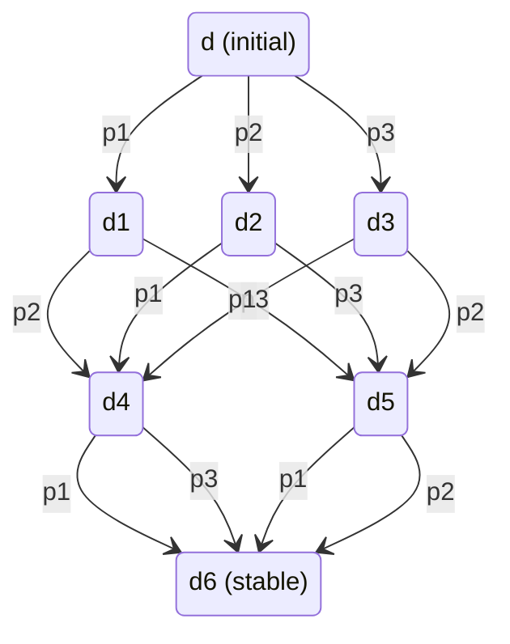
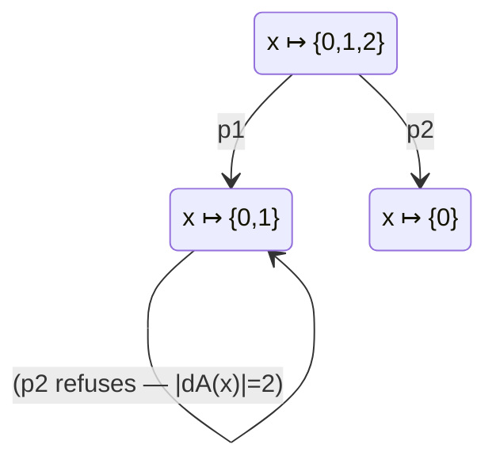
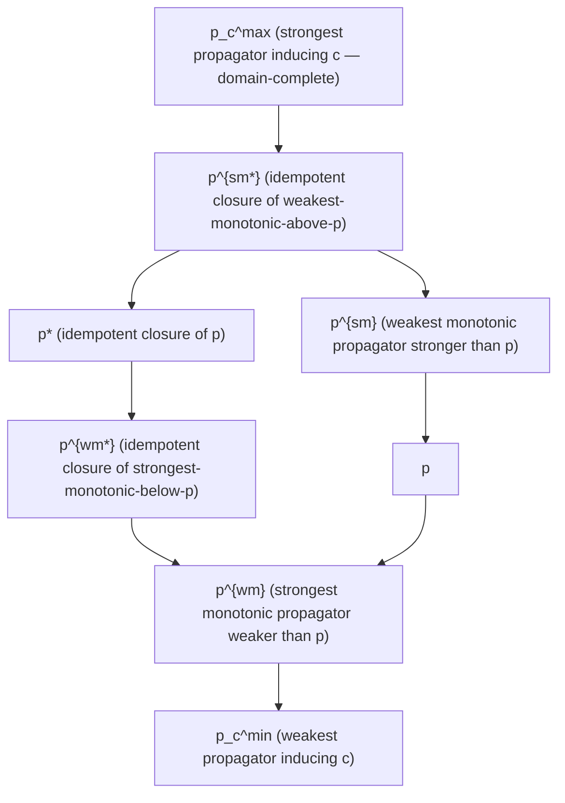

[[book-guidelines|↩ Back to guidelines]]

## Why bother formalizing "removes bad values"?

Chapter 2 of the dissertation left "propagator" at the informal level: a propagator is
the thing that looks at a Sudoku block and crosses out numbers that can't possibly
go in a cell. That description is enough to *use* a solver, but it is nowhere near
enough to *build* one, or to prove anything about one. Three questions immediately
expose the gap:

1. **What exactly is a propagator allowed to do?** If it can only "remove bad
   values," who checks that it never removes a *good* one? Nothing in "removes bad
   values" prevents a buggy propagator from silently deleting a solution.
2. **What does it mean to combine propagators?** A Sudoku model has 27 all-different
   propagators running against a shared domain. What guarantees that running them in
   some interleaved order, forever, actually terminates, and that whatever domain you
   stop at means anything?
3. **What does it mean for two different propagators to "be" the same constraint?**
   You might write a slow, obviously-correct less-than propagator and later replace
   it with a fast, clever one. What has to be true of both implementations so that
   swapping them can never turn a correct solver into an incorrect one?

None of these questions can be answered from the informal picture. You need: (a) a
precise notion of what a constraint *means*, independent of any algorithm that
enforces it — this is the **denotational model** — and (b) a precise notion of what a
propagator is allowed to *do* to a domain, and how repeated propagator applications
are guaranteed to settle down — this is the **operational model**. Chapter 3 builds
both, and this article follows it in the same order: first pin down *what* a CSP is
(§3.1), then pin down *how* propagation solves it (§3.2–§3.5).

**Grounding note.** This chapter is the dissertation's mathematical core — definitions,
fixed points, lattices, transition systems. Lean is promoted to a co-primary grounding
language here alongside Rust: the chapter's own machinery (dependent products for the
many-sorted extension, propositions like "contracting" and "sound" as proof
obligations, fixed points as theorems) maps almost verbatim onto Lean's own idioms.
Rust carries the "how would I actually build this" reading; Python appears only for a
short illustrative sketch where it clarifies rather than obscures.

---

## 1. Assignments, constraints, and domains

### The book's definitions

Fix a finite set of variables $X$ (elements written $x, y, z$) and a finite set of
values $V$ (elements written $v, w$).

- **Definition 3.1.** An *assignment* $a$ is a function from variables to values:
  $a \in \mathrm{Asn} := X \to V$. A *constraint* $c$ is a **set of assignments**:
  $c \in \mathrm{Con} := \mathcal{P}(\mathrm{Asn})$ — literally the power set of all
  assignments, i.e. a constraint just *is* the relation it describes, spelled out
  extensionally as the set of assignments that satisfy it. An assignment $a \in c$ is
  a *solution* of $c$. The *significant variables* of $c$, written $\mathrm{vars}(c)$,
  are the ones $c$ actually constrains — formally, $x$ is significant for $c$ iff
  changing $a(x)$ can move an assignment into or out of $c$.
- **Definition 3.3.** A *domain* $d$ is a function from variables to **sets** of
  values: $d \in \mathrm{Dom} := X \to \mathcal{P}(V)$. Applying $d$ to a variable $x$
  gives the *variable domain* $d(x) \subseteq V$ — the values still considered
  possible for $x$. A domain represents the constraint of all assignments it licenses:
  $$\mathrm{con}(d) := \{a \in \mathrm{Asn} \mid \forall x \in X : a(x) \in d(x)\}.$$
  An assignment $a \in \mathrm{con}(d)$ is *licensed* by $d$.
- **Definition 3.4.** A **constraint satisfaction problem (CSP)** is a pair
  $\langle d, C \rangle$ of a domain and a *set of constraints* $C$ (interpreted
  conjunctively). Its solutions are
  $\mathrm{sol}(\langle d, C\rangle) := \{a \in \mathrm{con}(d) \mid \forall c \in C : a \in c\}$.

This is the whole denotational layer: a CSP's *meaning* — what counts as a solution —
is fixed the moment you write down $d$ and $C$, entirely independently of any solving
algorithm. Note the crucial asymmetry already baked in: a *constraint* can be an
arbitrary set of assignments (it can correlate variables in any way — think
$\llbracket x = y + z\rrbracket$), but a *domain* is restricted to a **Cartesian
product** of per-variable sets: it can only express independent, unary restrictions on
each variable. The book states this precisely:
$\{\mathrm{con}(d) \mid d \in \mathrm{Dom}\} \subset \mathrm{Con}$ — domains are a
strict subset of constraints. This restriction is exactly what makes a domain a
practical thing to store and manipulate: $|X|$ separate sets, not one giant relation.

Two domain notions matter throughout the rest of the chapter:

- $d = 0$ (a **failed** domain) whenever some $d(x) = \emptyset$; all failed domains
  are deliberately identified as *the* single bottom element $0$, since $\mathrm{con}(d) = \emptyset$
  regardless of which variable domain emptied out.
- $d$ is **assigned** when $\mathrm{con}(d) = \{a\}$ for a single assignment $a$.

And the domain order — the single most important piece of structure in the whole
chapter:
$$d \subseteq d' :\iff \forall x \in X : d(x) \subseteq d'(x),$$
read "$d$ is *stronger* than $d'$" (fewer candidate values, more information). This is
just the pointwise lift of the subset order on values. It is a genuine partial order,
and — because $X$ and $V$ are both finite — it is a finite lattice: meets and joins
exist for every pair of domains (pointwise intersection and union of the value sets).

### What breaks without this

Without $\mathrm{con}(d)$ as the bridge from "domain" (a syntactic, per-variable
object) to "constraint" (a semantic set of assignments), you cannot compare a domain
to a constraint at all — you couldn't even *state* "propagator $p$ shrinks $d$ without
losing solutions of $c$," because $d$ and $c$ would live in unrelated worlds. And
without fixing the domain order $\subseteq$ as *the* measure of "more pruned," there
is no shared yardstick for saying one propagator is stronger than another (§2 below)
or for proving that propagation terminates (§4 below) — termination arguments in this
chapter are literally "the order is well-founded and finite, so you can't get stronger
forever."

### Grounding

**Rust.** The distinction domain-vs-constraint maps directly onto a distinction
between a cheap, structured representation and an expensive, general one:

```rust
use std::collections::HashSet;
use std::collections::HashMap;

type Var = usize;
type Value = i64;

/// A domain: one set of candidate values per variable (Cartesian, cheap to store).
#[derive(Clone, PartialEq, Eq)]
struct Domain(HashMap<Var, HashSet<Value>>);

impl Domain {
    /// con(d): the (astronomically large, never materialized) set of assignments
    /// licensed by this domain. We never actually build this set — it exists
    /// only conceptually, as the domain's *meaning*.
    fn licenses(&self, a: &HashMap<Var, Value>) -> bool {
        self.0.iter().all(|(x, vals)| a.get(x).is_some_and(|v| vals.contains(v)))
    }

    /// The domain order: `self` is stronger than `other`.
    fn is_stronger_than(&self, other: &Domain) -> bool {
        self.0.iter().all(|(x, vals)| {
            other.0.get(x).is_some_and(|ovals| vals.is_subset(ovals))
        })
    }

    fn is_failed(&self) -> bool {
        self.0.values().any(|vals| vals.is_empty())
    }
}
```

A general `Constraint` — an arbitrary predicate or explicit assignment set — has no
such structure; you cannot ask "what is `constraint.get(x)`" the way you can ask
`domain.0.get(x)`. That's precisely why Example 3.5's Sudoku row constraint (`9!`
assignments, times `9^72` for the unconstrained rest) is unusable directly: it is a
`Con`, not a `Dom`.

**Lean.** The book's own notation is already close to a dependent type theory
signature — this is the cleanest case in the chapter for a literal transcription:

```lean
variable (X V : Type) [DecidableEq X] [Fintype X]

def Asn := X → V
def Con := Set Asn
def Dom := X → Set V

def con (d : Dom X V) : Con X V :=
  {a | ∀ x, a x ∈ d x}

-- domain order, pointwise
def domLE (d d' : Dom X V) : Prop := ∀ x, d x ⊆ d' x
```

`Asn := X → V` in the book is literally Lean's function type `X → V`; `Con := P(Asn)`
is `Set Asn` (Lean's `Set` already *is* a characteristic-predicate-style power set).
The domain order is a `Prop`-valued relation, and proving it's a partial order —
reflexive, antisymmetric, transitive — is `rfl`/`Set.Subset` lemmas away, because it's
literally `Pi.le` lifted from `Set.le` on each factor.

**Python** (sketch only): `con(d)` as a generator is a fine five-line illustration of
*why* you'd never materialize it —

```python
from itertools import product

def con(domain: dict, variables: list) -> "Iterable[dict]":
    # NEVER call len(list(con(d))) on a real CSP — this is illustrative only.
    for combo in product(*(domain[x] for x in variables)):
        yield dict(zip(variables, combo))
```

— but this is exactly the object the chapter tells you never to build.

---

## 2. CSPs versus propagation problems

The denotational model (§1) says *what* a solution is. It says nothing about *how* to
find one — a CSP $\langle d, C\rangle$ is a specification, not a procedure. Section 3.2
introduces the operational counterpart.

A **propagator** is going to be a function that refines a domain. A **propagation
problem (PP)**, Definition 3.8, is then defined by direct analogy with a CSP:

$$\langle d, P\rangle \text{ is a PP} \quad\text{with}\quad \mathrm{sol}(\langle d, P\rangle) := \mathrm{sol}(\langle d, \{c_p \mid p \in P\}\rangle),$$

i.e. a PP's solutions are defined by handing off to the CSP induced by treating each
propagator's induced constraint (defined below) as a plain constraint. A PP is the
*executable* analogue of a CSP: the propagators $P$ are algorithms; the induced
constraints $\{c_p \mid p \in P\}$ are what those algorithms compute the meaning of.
Every technique in the rest of the dissertation targets propagation problems, not CSPs
directly — CSPs exist purely to pin down what "correct" means for a PP.

### What breaks without this

If you skip straight to "here are some propagator functions" without first fixing
$\mathrm{sol}(\langle d,P\rangle) := \mathrm{sol}(\langle d, \{c_p\}\rangle)$, you have
no independent notion of correctness to check a propagator implementation against —
"is this propagator right?" becomes unanswerable, because there is no separate
specification (the CSP) to compare it to. The whole soundness/completeness argument in
§4 below depends on this indirection existing.

---

## 3. Propagators as contracting and sound functions on domains

This is the chapter's central definition, and deliberately the weakest one that still
works.

**Definition 3.6.** A propagator is a function $p \in \mathrm{Dom} \to \mathrm{Dom}$
that is:

- **contracting**: $p(d) \subseteq d$ for any domain $d$ — a propagator may only ever
  shrink (or leave unchanged) a domain, never grow it;
- **sound**: for any domain $d$ and assignment $a$, if $\{a\} \subseteq d$ then
  $p(\{a\}) \subseteq p(d)$ — informally, whatever the propagator decides about a
  single assignment in isolation, it must not contradict when that assignment sits
  inside a larger domain.

Read soundness very literally: $p(\{a\})$ is either $\{a\}$ (propagator *accepts* $a$)
or $0$ (propagator *rejects* $a$) — those are the only two possibilities when the
input is already a single-assignment domain, because $p$ is contracting. Soundness
then says: if $p$ accepts $a$ in isolation, it can never be the case that $a \notin p(d)$
for some larger $d$ containing $a$ — i.e. the propagator can never prune away an
assignment it would itself accept. This is what makes "decision procedure" and
"pruning procedure" *the same function* rather than two functions that might disagree.

Crucially — and this is one of the chapter's own emphasized contributions — **this is
it**. No idempotency ($p(p(d)) = p(d)$) and no monotonicity ($d_1 \subseteq d_2
\Rightarrow p(d_1) \subseteq p(d_2)$) are required. Both are traditionally imposed in
the literature (the book cites Saraswat et al. 1991, who require both, modeling
propagators as Tarski-style consequence operators), but Tack shows the solver built on
top of just contracting+sound propagators is still sound and complete — see §5 below.
This minimality is a genuine design decision, not laziness: it is exactly what lets
Chapter 5 admit *non-monotonic* propagation algorithms that are faster in practice
(e.g. non-monotonic edge-finding for scheduling) without giving up correctness.

### What breaks without contraction, and without soundness, separately

- **Drop contraction** ($p(d) \subseteq d$): a "propagator" could add candidate values
  back to a domain, and then propagation could *un-derive* an already-proven-impossible
  value. Termination (§6) would be lost immediately — there would be no guarantee the
  domain order only moves one direction.
- **Drop soundness**: a propagator could accept an assignment $a$ in isolation
  ($p(\{a\}) = \{a\}$) but then delete $a$ from some larger domain containing it
  ($a \notin p(d)$). That propagator would silently discard solutions — the resulting
  solver would be *unsound*: it could report "no solution" or simply never produce a
  solution that genuinely exists. This is precisely the bug class the informal
  Chapter 2 description ("removes bad values") gives you no way to rule out.

### Grounding

**Rust.** A propagator is naturally a trait, and — importantly — the trait's contract
(contracting, sound) is a *proof obligation* Rust's type system cannot check for you;
it has to be documented and, ideally, tested:

```rust
/// # Contract (not enforced by the type system — verify by proof or test!)
/// - `prune(d)` must be a subset of `d`, pointwise (contracting).
/// - if {a} ⊆ d, then `prune({a})` must be a subset of `prune(d)` (sound).
trait Propagator {
    fn prune(&self, d: &Domain) -> Domain;
}

struct LessThan { x: Var, y: Var }

impl Propagator for LessThan {
    fn prune(&self, d: &Domain) -> Domain {
        let mut out = d.clone();
        let max_y = *d.0[&self.y].iter().max().unwrap();
        let min_x = *d.0[&self.x].iter().min().unwrap();
        out.0.get_mut(&self.x).unwrap().retain(|&v| v < max_y);
        out.0.get_mut(&self.y).unwrap().retain(|&v| v > min_x);
        out
    }
}
```

The comment block matters more than the code: this is the recurring shape you'll see
in any Rust CSP/verification kernel — a trait whose real specification lives in a
proof, not in `fn` signatures, because Rust (unlike Lean) cannot express "this
function is monotonic" as a type.

**Lean.** This is where promoting Lean to primary really pays off: in Lean you *can*
put the proof obligations directly into the type.

```lean
structure Propagator (X V : Type) [Fintype X] where
  apply : Dom X V → Dom X V
  contracting : ∀ d, ∀ x, apply d x ⊆ d x
  sound : ∀ (d : Dom X V) (a : Asn X V),
    (∀ x, a x ∈ d x) → -- {a} ⊆ d, unfolded
    ∀ x, (apply ({a}' : Dom X V)) x ⊆ (apply d) x  -- schematic; {a}' = singleton domain
```

A `Propagator` bundle is not just a function — it *carries its correctness proof with
it*. This is the exact shape you want for the compiler project's propagator/domain
kernel: a Rust implementation gives you speed and no static guarantee; a Lean
`structure` like this gives you a certificate that a *reference* implementation
actually satisfies Definition 3.6, against which the Rust code can be tested or
(eventually) verified.

**Induced constraint.** Definition 3.6 closes with
$$c_p := \{a \in \mathrm{Asn} \mid p(\{a\}) = \{a\}\}$$
— the constraint that $p$ *actually* realizes is *read off of $p$ itself*, not fixed
in advance. This inverts the usual textbook order (fix a target constraint, then
write a propagator *for* it) and is one of the chapter's flagged novel contributions.
Proposition 3.7 makes the connection airtight: $c_p \cap d = c_p \cap p(d)$ — a
propagator never removes any assignment satisfying its own induced constraint, for
*any* domain $d$, which is exactly soundness restated in terms of $c_p$ rather than
single assignments.

---

## 4. The propagator lattice, and unique weakest/strongest propagators

Because many different pruning strategies can realize the *same* decision procedure
(the same $c_p$), propagators for one constraint form their own order:

**Definition 3.9.** If $p_1, p_2$ induce the same constraint, $p_1$ is *stronger* than
$p_2$ (written $p_1 \sqsubseteq p_2$, reusing $\subseteq$-style notation pointwise on
outputs) iff $p_1(d) \subseteq p_2(d)$ for every domain $d$.

**Proposition 3.10.** The set of all propagators is closed under composition
($p_1 \circ p_2$), pointwise intersection ($p_1 \cap p_2 := \lambda d.\, p_1(d) \cap p_2(d)$),
and pointwise union ($p_1 \cup p_2$). Composition and intersection both induce
$c_{p_1} \cap c_{p_2}$ (either one rejecting $a$ rejects the combination); union
induces $c_{p_1} \cup c_{p_2}$ (either one accepting $a$ accepts the combination).

Since the domain order is a finite lattice and the propagator order is just this
lattice lifted pointwise, **the set of all propagators, $\mathrm{Prop}$, is itself a
finite, complete lattice**: $p_1 \cap p_2$ is the meet (the weakest propagator
stronger than both), $p_1 \cup p_2$ is the join. Complete lattices guarantee unique
suprema/infima, so:

> For every constraint $c$, there is a **unique strongest propagator** $p^{\max}_c$
> (the one doing maximal pruning — call a propagator *domain-complete* when it equals
> $p^{\max}_{c_p}$) and a **unique weakest propagator** $p^{\min}_c$.

$p^{\max}_c$ matters practically: it is the ceiling on how much pruning is even
*possible* for $c$ — Chapter 4 spends its entirety characterizing how close a
realistic, tractable propagator can get to it. A subtlety worth flagging now because
it recurs constantly: **domain completeness is not compositional**. If $p_1, p_2$ are
each domain-complete for their own constraints, $p_1 \circ p_2$ (even iterated to a
fixed point) is in general *not* domain-complete for $c_{p_1} \cap c_{p_2}$ — pruning
constraint-by-constraint can lose pruning power that would only be visible by
reasoning about both constraints jointly. This is exactly why "just run each
constraint's best propagator and interleave" doesn't automatically give you the
strongest possible solver for the conjunction.

### What breaks without a lattice structure on propagators

Without $\mathrm{Prop}$ being a complete lattice, "the strongest propagator for $c$"
would be a claim requiring separate proof for every individual constraint — you'd have
no generic argument that such a thing even exists, let alone is unique. The lattice
argument is what lets Chapter 4 talk about *domain systems* as sublattices without
re-deriving existence and uniqueness from scratch each time.

### Grounding

**Rust** doesn't have a clean way to express "the set of all functions satisfying
property P forms a lattice" — this is inherently a mathematical, not an
implementation-level, fact. What *does* transfer directly to Rust is composition and
combination as combinators:

```rust
fn compose(p1: &dyn Propagator, p2: &dyn Propagator, d: &Domain) -> Domain {
    p1.prune(&p2.prune(d))
}

fn intersect(p1: &dyn Propagator, p2: &dyn Propagator, d: &Domain) -> Domain {
    let d1 = p1.prune(d);
    let d2 = p2.prune(d);
    // pointwise intersection of the two resulting domains
    Domain(d1.0.into_iter().map(|(x, vs)| {
        let other = &d2.0[&x];
        (x, vs.intersection(other).cloned().collect())
    }).collect())
}
```

**Lean** is the natural home for the lattice claim itself: `Dom X V` is literally
`X → Set V`, and `Set V` is already a `CompleteLattice` in Mathlib, so
`X → Set V` inherits a `CompleteLattice` instance for free via `Pi.instCompleteLattice`.
Proving `Prop`ositions about `p_1 ⊓ p_2` being a propagator is then reduced to showing
the meet operation preserves the two defining properties — almost exactly
Proposition 3.10's proof, transcribed.

---

## 5. Propagation as a non-deterministic transition system

Definitions 3.6–3.9 tell you what a *single* propagator does. Section 3.3 asks: what
happens when you have a whole *set* of propagators $P$ and let them fire in any order?

**Definition 3.11.** Given a propagation problem $\langle d, P\rangle$: a transition
$d \vdash^p\to d'$ is possible iff $d' = p(d)$ and $d' \subset d$ (strictly stronger —
so a propagator that doesn't prune anything yields no transition). A domain with no
outgoing transitions is **stable**. We write $d \Rightarrow d'$ for "some finite chain
of transitions turns $d$ into the stable domain $d'$."

Note immediately that **any failed domain is stable** by definition (strict
inequality $\subset$ requires the weaker side to be non-failed), which is exactly why
the book insists on identifying all failed domains as one bottom element $0$: it
guarantees failure is a single, unambiguous terminal state rather than a family of
distinguishable dead ends.

The system is explicitly **non-deterministic**: at any non-stable domain, multiple
propagators might be able to fire, in any order, and different orders can pass through
different intermediate domains. Figure 3.1 in the book depicts exactly this branching.
Here is the same shape as a state diagram, generalizing the book's Example 3.12
(three propagators $p_1 : x<y$, $p_2 : x+y=z$, $p_3 : y<z$ over
$d(x)=d(y)=d(z)=\{1,2,3,4\}$, each domain-complete):



Every path from $d$ reaches the *same* stable domain $d_6$ here — but that's a fact
about *this particular* propagation problem (its propagators happen to be monotonic,
per §6 below), not a general guarantee; §7 shows a case where it fails.

**Theorem 3.13 (termination).** The transition system of any $\langle d,P\rangle$ is
finite and terminating: any sequence $d \Rightarrow d'$ takes at most
$k = 1 + \sum_{x \in X}(|d(x)| - 1)$ steps. The proof is a direct well-foundedness
argument: every transition strictly shrinks some variable's domain by at least one
value, $d$ is finite, so you can only do this finitely often before nothing can shrink
further.

This is the payoff that makes the whole model *usable*: whatever order you run
propagators in, you are guaranteed to reach a stable domain — a **mutual fixed
point** of every propagator in $P$ — in finitely many steps, and moreover the step
bound is computable in advance from the initial domain size alone.

### What breaks without termination

Without Theorem 3.13, an implementation would have to detect "we're stuck in a cycle"
some other way — impossible in general, since cycles are provably ruled out here by
strict shrinking rather than detected at runtime. Every scheduling technique in
Chapter 5 (agendas, priority queues, event-driven wake-up) is only sound because it's
scheduling a process that is *already* guaranteed to terminate; the scheduler's job is
purely to reach the fixed point *efficiently*, never to check whether one exists.

### A simple propagation-based solver

Figure 3.2's pseudocode packages this into `solve`:

```
solve(⟨d, P⟩):
  d' ← propagate(⟨d, P⟩)      -- run transitions to a stable domain
  if d' = 0: return ∅          -- failed
  if d' = {a}: return {a}      -- solved outright by propagation alone
  ⟨d1, d2⟩ ← branch(d')        -- split into two smaller, non-empty domains
  return solve(⟨d1, P⟩) ∪ solve(⟨d2, P⟩)
```

The soundness/completeness argument is genuinely elegant, and worth stating exactly as
the book frames it, because the duality is easy to miss: a *solver* is sound if it
returns only solutions and complete if it returns all of them; a *propagator* is sound
if it prunes only non-solutions (this chapter's Definition 3.6) and — not defined
until Chapter 4 — *complete* if it prunes *all* non-solutions it could. The
propagation-based solver above is:

- **sound**, because each propagator is a full decision procedure on single
  assignments ($p(\{a\}) \in \{\{a\}, 0\}$), so nothing that isn't a solution can slip
  through when `branch` finally hits an assigned domain;
- **complete**, because `branch` is required to satisfy
  $\mathrm{sol}(\langle d_1,P\rangle) \cup \mathrm{sol}(\langle d_2,P\rangle) = \mathrm{sol}(\langle d',P\rangle)$,
  so no solution is ever lost by splitting, and because each propagator's soundness
  (Definition 3.6) guarantees `propagate` never discards a solution either.

Notice this holds with *no* requirement that propagators be idempotent or monotonic —
this is the payoff of choosing the minimal Definition 3.6 in the first place.

### Grounding

**Rust.** The transition system's non-determinism is naturally modeled as "keep
scanning the propagator list until nobody can prune anymore" — the simplest possible
scheduler, deliberately not the efficient event-driven one from Chapter 5:

```rust
fn propagate(mut d: Domain, propagators: &[Box<dyn Propagator>]) -> Domain {
    loop {
        let mut changed = false;
        for p in propagators {
            let d2 = p.prune(&d);
            if d2.is_stronger_than(&d) && d2 != d {
                d = d2;
                changed = true;
            }
        }
        if !changed { return d; } // stable: no propagator can fire
    }
}
```

Theorem 3.13 is exactly the argument that this `loop` terminates: `d` strictly shrinks
(by domain-set cardinality) on every `changed = true` iteration, and set cardinalities
are bounded below by zero.

**Lean.** Termination arguments like Theorem 3.13 are Lean's home turf —
well-founded recursion on a strictly-decreasing finite measure is exactly what
`termination_by` / `decreasing_by` are built for:

```lean
def propagate (d : Dom X V) (P : List (Propagator X V))
    : Dom X V :=
  match step d P with
  | some d' => propagate d' P   -- d' is strictly stronger than d
  | none    => d
termination_by (measure d)  -- e.g. ∑ x, (Fintype.card (d x))
decreasing_by
  -- obligation: applying `step` strictly decreases the measure,
  -- which is exactly the content of Theorem 3.13's proof.
  sorry
```

The `decreasing_by` obligation *is* Theorem 3.13, stated as a proof Lean will not let
you skip (modulo the placeholder `sorry` above, which stands in for the actual
cardinality argument the book gives in prose).

---

## 6. Idempotency and monotonicity

**Definition 3.14.** $p$ is *idempotent* iff $p(p(d)) = p(d)$ for all $d$ (applying it
twice does nothing more than applying it once). $p$ is *monotonic* iff
$d_1 \subseteq d_2 \Rightarrow p(d_1) \subseteq p(d_2)$ (stronger input never yields
weaker output).

Neither is required by Definition 3.6. The chapter argues both are *dispensable*, in
different ways:

- **Idempotency** is not needed because the *transition system as a whole* already
  produces mutual fixed points (Theorem 3.13), regardless of whether any single
  propagator, run alone, is at a fixed point of itself. And idempotency can always be
  *manufactured*: **Proposition 3.15** shows for any propagator $p$ there is some
  $n>0$ such that $p^n$ (n-fold self-composition) is idempotent — call it $p^*$, the
  **idempotent closure** of $p$. The proof is the same well-founded-shrinking argument
  as Theorem 3.13, just applied to a single propagator's repeated self-application.
- **Monotonicity** is where the interesting trade-off lives (next section).

### What breaks without idempotency (in practice, not correctness)

Nothing breaks correctness-wise — Proposition 3.15 already tells you $p^*$ always
exists. What you lose is *efficiency*: if you don't know $p$ is already idempotent,
you may re-invoke it on a domain it has already stabilized, wasting work. Section 5.4
of the dissertation (Chapter 5) exploits *known* idempotency to skip redundant
re-scheduling — this is a genuine engineering payoff of a purely mathematical
property.

### Grounding

**Lean** states Proposition 3.15 almost as written:

```lean
theorem idempotent_closure_exists (p : Propagator X V) :
    ∃ n > 0, ∀ d, p.apply^[n] (p.apply^[n] d) = p.apply^[n] d := by
  sorry -- well-founded induction on domain cardinality, mirroring Theorem 3.13
```

**Rust** — computing $p^*$ directly, by iterating to a fixed point:

```rust
fn idempotent_closure(p: &dyn Propagator, d: &Domain) -> Domain {
    let mut cur = d.clone();
    loop {
        let next = p.prune(&cur);
        if next == cur { return next; }
        cur = next;
    }
}
```

This function *is* $p^*(d)$ for the particular $d$ passed in — note $p^*$ as defined
in the book is a fixed *number of iterations* $n$ that works for every domain
simultaneously (finiteness of $\mathrm{Dom}$ guarantees such an $n$ exists), whereas
this Rust function recomputes convergence per-call; both compute the same output.

---

## 7. Confluence and non-confluence of non-monotonic propagation

Stable domains reached by the transition system are always mutual fixed points — but
**not necessarily unique ones**. Whether they're unique (the transition system is
*confluent*) turns out to hinge exactly on monotonicity.

**Example 3.16 (the book's own non-confluence witness).** Let $d(x) = \{0,1,2\}$,
with $c_{p_1} = \llbracket x \in \{0,1\}\rrbracket$ and $c_{p_2} = \llbracket x=0\rrbracket$.
Define $p_2$ deliberately weirdly:
$$p_2(d)(x) = \begin{cases} d(x) \cap \{0\} & \text{if } |d(x)|=1 \text{ or } |d(x)|>2 \\ d(x) & \text{otherwise} \end{cases}$$
— i.e. $p_2$ *refuses to prune* when $|d(x)|$ is exactly $2$. Then:



Running $p_2$ first reaches $x \mapsto \{0\}$ (stable, since it's a fixed point of
$p_1$ too). Running $p_1$ first reaches $x \mapsto \{0,1\}$ — and now $p_2$ *also*
refuses to fire, because $|\{0,1\}| = 2$ triggers $p_2$'s special-cased laziness. So
$x \mapsto \{0,1\}$ is *also* stable. **Two different stable domains, from the same
propagation problem, depending purely on propagator order.** The culprit is
non-monotonicity of $p_2$: $x\mapsto\{0,1\}$ is stronger than $x\mapsto\{0,1,2\}$, yet
$p_2(x\mapsto\{0,1\}) \supset p_2(x\mapsto\{0,1,2\})$ — a *stronger* input produced a
*weaker* (well, incomparable-but-effectively-weaker-here) output, the literal negation
of Definition 3.14's monotonicity clause.

**Theorem 3.17.** If every $p \in P$ is monotonic, the transition system of
$\langle d,P\rangle$ *is* confluent, and its unique stable domain is the **weakest
mutual fixed point** of all propagators in $P$ that is still stronger than $d$. The
proof is a clean induction along any transition sequence
$d \vdash^{p_1}\to d_1 \vdash^{p_2}\to \cdots \to d'$: for *any* mutual fixed point
$d'' \subseteq d$, monotonicity lets you push $d'' \subseteq d_i$ forward one step at a
time to $d'' \subseteq d_{i+1}$, ending at $d'' \subseteq d'$ — every fixed point is
weaker than the one the transitions actually reach, and since $d'$ is *itself* a
mutual fixed point, $d'$ must be the unique weakest one.

Also worth naming explicitly: **monotonicity subsumes soundness** — if $f$ is
monotonic and $\{a\} \subseteq d$, then $f(\{a\}) \subseteq f(d)$ follows immediately,
which is exactly Definition 3.6's soundness clause. So the containment picture (the
book's Figure 3.3) is: propagators = contracting ∩ sound; a propagator can
*additionally* be idempotent and/or monotonic, and monotonic propagators are a strict
sub-region within "sound."

### Practical consequence of allowing non-monotonic propagators

Non-monotonicity doesn't threaten *correctness* (soundness/completeness of the overall
solver survive regardless — every propagator individually is still sound). What it
costs you is **confluence**: the shape and size of the search tree, and the order
solutions are discovered in, become dependent on scheduling order. Debugging a model
gets harder, because the intuitive rule "adding a propagator only shrinks the search
space" can fail — a badly-timed non-monotonic propagator can *block* another
propagator from pruning, growing the search space instead. The book's real-world
example is edge-finding for scheduling (Baptiste 1994): restricting to quadratically
many task-interval subsets instead of exponentially many makes the algorithm fast, at
the cost of the result depending on which domain you evaluated it against — genuine
non-monotonicity accepted deliberately for tractability.

### The propagator lattice, completed

Section 3.4 closes by placing every propagator-derived object from this chapter into
one lattice diagram. Given an arbitrary propagator $p$: its idempotent closure $p^*$
is stronger than $p$; write $p^{sm}$ for the weakest *monotonic* propagator stronger
than $p$, and $p^{wm}$ for the strongest monotonic propagator weaker than $p$ (these
exist by **Proposition 3.18**: monotonic propagators are themselves closed under
intersection and union, so they form a sub-lattice). The full ordering, from
strongest to weakest:



(Arrows read "is stronger than.") The book notes the pleasant degenerate case: **if
$p$ is already monotonic, all of these collapse** — $p^{sm}=p^*{}^{sm}$-type
distinctions vanish and you're left with just $p^{\min}_{c_p} \sqsubseteq p \sqsubseteq p^* \sqsubseteq p^{\max}_{c_p}$.
The extra structure in the diagram exists *specifically* to accommodate
non-monotonic propagators — another way of seeing that relaxing Definition 3.6 to
drop monotonicity was a deliberate, structurally-costed decision, not a free lunch.

### Grounding

**Lean** is the right place to state Proposition 3.18 and Theorem 3.17 as actual
theorems with the induction spelled out — the informal "push $d'' \subseteq d_i$
forward one step" argument in the book is exactly an `induction` tactic on the length
of the transition list, each step invoking the `monotonic` field of the `Propagator`
structure from §3 above.

**Rust** has no static way to track "this trait object happens to be monotonic" — that
information lives only in a comment or a marker trait:

```rust
/// Marker: implementors additionally guarantee monotonicity.
/// (Rust cannot check this — it is a proof obligation on the implementor.)
trait MonotonicPropagator: Propagator {}
```

which is a realistic preview of the kind of unchecked contract a Rust CSP kernel has
to live with, versus the Lean structure that can carry the proof as data.

---

## 8. The many-sorted extension

Section 3.5 generalizes away the single shared value set $V$. Real solvers have
integer variables, Boolean variables, set variables — each variable $x$ needs its own
*sort* $V_x$. The fix is minimal: replace the plain function types with **dependent
products**,
$$\mathrm{Asn} := \prod_{x \in X} V_x, \qquad \mathrm{Dom} := \prod_{x \in X} \mathcal{P}(V_x),$$
using $\prod_{x\in X} Y_x$ for "a mapping from each $x$ to some element of the
family $Y_x$" — precisely because a plain function type $X \to V$ cannot express "the
codomain depends on which $x$ you're looking at." Every other definition — constraints
as sets of assignments, propagators as functions $\mathrm{Dom}\to\mathrm{Dom}$,
$\mathrm{con}(\cdot)$ — is untouched syntactically; the book states that none of the
chapter's proofs exploit two variables sharing a value set, so everything transfers by
"simple textual replacement of the relevant types."

This section is the chapter's most direct advertisement for Lean as grounding
language, because $\prod_{x \in X} Y_x$ *is*, verbatim, Lean's dependent function type:

```lean
-- single-sorted version:
def Asn := X → V

-- many-sorted version — this is a genuine dependent type,
-- since the codomain V x depends on the input x:
def AsnMS (V : X → Type) := (x : X) → V x
def DomMS (V : X → Type) := (x : X) → Set (V x)
```

The move from `Asn := X → V` to `AsnMS (V : X → Type) := (x : X) → V x` is *the same
move* a compiler makes going from simple function types to dependent products (Π-types) —
this is a genuinely load-bearing instance of a `Π`-type doing real work rather than a
toy example: it is exactly what lets a single variable-domain abstraction host
integer, Boolean, and set-valued variables side by side without three separate copies
of every theorem in this chapter.

**Rust**, lacking dependent types, has to fake this with an enum or trait-object sum
type instead of a genuine per-key type family:

```rust
enum Value { Int(i64), Bool(bool), Set(std::collections::BTreeSet<i64>) }
// Dom becomes HashMap<Var, HashSet<Value>>, but nothing in the type system
// prevents mixing sorts for one variable — that invariant has to be
// maintained by convention, exactly where Lean's Π-type enforces it statically.
```

This gap is worth naming plainly, per the style guidance of not forcing a strained
fit: many-sorted domains are a case where Rust's type system is genuinely weaker than
the book's own formalism, and Lean is the more faithful target.

---

## Where this leads

This chapter is the foundation the next two chapters of Part I build on directly:

- **Chapter 4, "[[Propagation-Strength-and-Domain-Approximations|Propagation Strength and Domain Approximations]],"** takes the
  $p^{\max}_c$/$p^{\min}_c$ pair from §4 above and asks the question this chapter
  deliberately leaves open: *how close to $p^{\max}_c$ can a tractable algorithm get?*
  It does this by replacing the full domain lattice $\mathrm{Dom}$ with coarser
  **domain systems** — sublattices closed under intersection — recovering bounds
  consistency, range consistency, and set-interval consistency as instances of one
  parametrized completeness notion. Every one of those notions is a statement about
  *where a propagator sits inside the propagator lattice of §4/§7 above*, just
  measured against a restricted target sublattice instead of all of $\mathrm{Dom}$.
- **Chapter 5, "[[Efficient-Propagator-Scheduling|Efficient Propagator Scheduling]],"** takes the non-deterministic,
  "try any propagator that can fire" transition system of §5 above and refines it into
  a concrete, implementable scheduling discipline — an *agenda* of propagators,
  event-directed wake-up, dynamic dependency tracking. Theorem 3.13's termination
  guarantee is exactly what licenses treating scheduling as a pure efficiency problem:
  Chapter 5 never has to ask "will this scheduling strategy converge," because
  convergence is already proved here, independent of the strategy chosen. And the
  idempotency/self-signaling discussion of Section 5.4 (propagators reporting `fix` to
  skip redundant re-invocation) is a direct engineering payoff of Proposition 3.15's
  idempotent closure.

**On the Focus Areas.** This topic is the mathematical spine of the `sat-smt-csp`
thread: propagators-as-contracting-sound-functions and the propagation-problem
transition system are the precise formal object your compiler's planned CSP kernel
needs to implement and reason about when it searches for counterexamples to type
invariants — Definition 3.6 *is* the contract that kernel's domain-reduction routines
must satisfy for the counterexample search to remain sound. It also earns its
`static-analysis` tag directly: $\mathrm{con} : \mathrm{Dom} \to \mathrm{Con}$ is
functioning exactly as a **concretization map** in the Galois-connection sense familiar
from abstract interpretation — $\mathrm{Dom}$ is an abstract lattice approximating the
concrete lattice of assignment sets, propagators are (contracting, sound) abstract
transformers over that lattice, and a stable domain is an abstract fixed point exactly
in the sense a dataflow analysis computes one. The book never uses Galois-connection
vocabulary, but the structure — an abstract domain ordered by "more precise," a
concretization function into the concrete semantics, monotonic transformers whose
fixed points soundly approximate concrete behavior — is the same shape your
over-approximating invariant-generation passes will need, and Chapter 4's domain
*systems* (coarser sublattices of $\mathrm{Dom}$) will make the analogy to abstract
interpretation's "choice of abstract domain" essentially exact.
