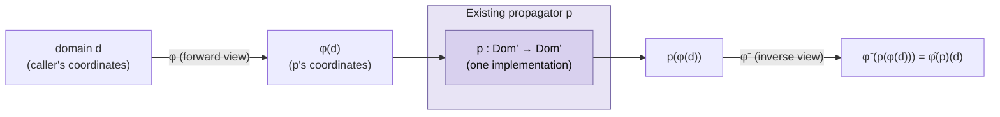

[[book-guidelines|↩ Back to guidelines]]

# Views and Derived Propagators

## The problem: every constraint has variants

Go back to [[The-Denotational-and-Operational-Model-of-Constraint-Propagation|the propagator model]] for a moment. A propagator is just a contracting, sound function $p \in \mathrm{Dom} \to \mathrm{Dom}$ that prunes a domain toward a constraint. Fine — but real constraint libraries don't need *one* propagator per constraint *idea*, they need one per constraint *variant*, and variants multiply fast:

- $\llbracket \max\{x_1,\dots,x_n\}=y\rrbracket$ and $\llbracket \min\{x_1,\dots,x_n\}=y\rrbracket$ are the same algorithm with signs flipped.
- $\llbracket \sum_i a_i x_i = k\rrbracket$ (general linear equation) and $\llbracket \sum_i x_i = k\rrbracket$ (unit-coefficient special case) are the same algorithm, one of them just skipping a multiplication.
- $\llbracket \sum_i x_i = c \leftrightarrow b\rrbracket$ and $\llbracket \sum_i x_i \neq c \leftrightarrow b\rrbracket$ differ only in the sign of one control variable.

You have two bad options. **Hand-write every variant**: correct and fast, but code and documentation explode combinatorially, and some variants (say, minimum/maximum specialized for exactly two variables) never get written at all because the payoff doesn't justify the engineering effort. **Decompose**: introduce auxiliary variables and extra propagators to express the variant in terms of the original constraint — simple, but it costs extra memory, extra run-time, and (as Tack shows empirically in Chapter 9) measurably worse performance than a dedicated implementation.

Tack's answer is a third option: keep exactly one implementation of the propagator, and **transform its inputs and outputs** to get every variant for free. That transformation is a *view*. This chapter is the dissertation's proof that this transformation is not just convenient but *free* in a strong sense — a view-derived propagator is, in the book's own word, "perfect": it's a well-defined propagator, it induces exactly the constraint you wanted, and — under conditions this chapter pins down precisely — it inherits its parent's propagation strength as measured by the [[Propagation-Strength-and-Domain-Approximations|$\mathcal D$-completeness framework]].

**[[The-Denotational-and-Operational-Model-of-Constraint-Propagation#What breaks without this|What breaks without this]]:** without views, a solver author faces a permanent trade-off between library breadth (implement every useful variant, at unbounded engineering cost) and library depth (implement only canonical forms, and force users into slow decompositions for everything else). Neither is acceptable for a solver meant to be simultaneously comprehensive and fast — which is exactly the dissertation's stated thesis.

## Views as input/output transformations

Formally, a view is a pair of functions that sandwich an existing propagator.

**Definition 7.5 (variable view).** A variable view $\varphi_x \in V \to V'$ for a variable $x$ is an **injective** function mapping values to values. ($V'$ can differ from $V$ — the corresponding assignments/domains/constraints/propagators over $V'$ are written $\mathrm{Asn}', \mathrm{Dom}', \mathrm{Con}', \mathrm{Prop}'$.)

A family of variable views $\varphi_x$ for every $x \in X$ lifts point-wise to assignments, $\varphi_{\mathrm{Asn}}(a) := \lambda x.\varphi_x(a(x))$, and then to constraints, $\varphi(c) := \{\varphi_{\mathrm{Asn}}(a) \mid a \in c\}$, with inverse $\varphi^-(c) := \{a \in \mathrm{Asn} \mid \varphi_{\mathrm{Asn}}(a) \in c\}$.

**Definition 7.6 (derived propagator).** Given a propagator $p \in \mathrm{Prop}'$ and a view $\varphi$, the **derived propagator** is
$$
\hat\varphi(p) := \varphi^- \circ p \circ \varphi .
$$
The corresponding **derived constraint** is $\varphi^-(c) \in \mathrm{Con}$ for $c \in \mathrm{Con}'$.

Read it operationally: to run $\hat\varphi(p)$ on a domain $d$, first transform $d$ into the parent propagator's coordinate system with $\varphi$, run $p$, then transform the result back with $\varphi^-$. Rust's generics are the most literal way to see this: a view is a *generic wrapper* around a propagator's *variable accessor*, not around the propagator's algorithm at all — the algorithm never changes.

```rust
// A "view" is a transformation on how a variable's domain is read/written,
// not a transformation on propagator logic.
trait IntView {
    fn min(&self) -> i64;
    fn max(&self) -> i64;
    fn adjust_min(&mut self, v: i64) -> PropResult; // = tighten lower bound
    fn adjust_max(&mut self, v: i64) -> PropResult;
}

// The base case: a view straight onto a real variable.
struct IdentityView<'a>(&'a mut IntVar);
impl<'a> IntView for IdentityView<'a> {
    fn min(&self) -> i64 { self.0.min() }
    fn max(&self) -> i64 { self.0.max() }
    fn adjust_min(&mut self, v: i64) -> PropResult { self.0.adjust_min(v) }
    fn adjust_max(&mut self, v: i64) -> PropResult { self.0.adjust_max(v) }
}

// phi_x(v) = -v : a minus view, generic over ANY underlying view.
struct MinusView<V: IntView>(V);
impl<V: IntView> IntView for MinusView<V> {
    fn min(&self) -> i64 { -self.0.max() }         // note the swap: max <-> min
    fn max(&self) -> i64 { -self.0.min() }
    fn adjust_min(&mut self, v: i64) -> PropResult { self.0.adjust_max(-v) }
    fn adjust_max(&mut self, v: i64) -> PropResult { self.0.adjust_min(-v) }
}

// A propagator written once, generic over the *view type*, works unchanged
// whether it's handed real variables or transformed ones:
fn propagate_max<X: IntView, Y: IntView, Z: IntView>(x: &mut X, y: &mut Y, z: &mut Z) {
    // ... same algorithm regardless of what X, Y, Z actually wrap ...
}
```
`propagate_max` instantiated with `MinusView` on all three arguments *is* a minimum propagator — Tack's Example 7.4 exactly. Nothing about `propagate_max`'s body changed; only the trait implementation it's generic over.

**Worked example (Example 7.7, book's own).** Given a propagator $p$ for $c = \llbracket x=y\rrbracket$, derive one for $c' = \llbracket x = 2y\rrbracket$. Define $\varphi_x(v)=v$ (identity), $\varphi_y(v) = 2v$ (a *scale view*). Then $\hat\varphi(p) = \varphi^- \circ p \circ \varphi$ induces exactly $c'$. Tracing an assignment: $a=(x{\mapsto}2, y{\mapsto}1)$ maps under $\varphi$ to $(x{\mapsto}2,y{\mapsto}2)$, which $p$ accepts unchanged, and $\varphi^-$ maps it straight back to $a$ — consistent with $2 = 2\cdot 1$.

## What "correctness-preserving" requires of a view

Before asking about propagation strength, Tack asks the more basic question: is $\hat\varphi(p)$ even a legitimate propagator, and does it compute what you think it computes? The proofs lean on four structural facts about any view, listed as **P1–P4**:

- **P1.** $\varphi$ and $\varphi^-$ are monotonic (they're defined point-wise).
- **P2.** $\varphi^- \circ \varphi = \mathrm{id}$.
- **P3.** $|\varphi(\{a\})| = 1$ and $\varphi(\emptyset) = \emptyset$ (views send singletons to singletons, and preserve failure).
- **P4.** $\varphi(d) \in \mathrm{Dom}$ and $\varphi^-(d) \in \mathrm{Dom}$ for any domain $d$ (views map domains to domains, i.e. stay within the Cartesian-product representation).

From these, three theorems fall out:

- **Proposition 7.8.** $\hat\varphi(p)$ is a propagator (contracting and sound) for *every* $p$ and *every* view $\varphi$; and it's monotonic whenever $p$ is. Contraction follows from monotonicity of $\varphi^-$ plus $\varphi^-\circ\varphi=\mathrm{id}$; soundness follows from P1 and P3 applied to singleton assignments.
- **Proposition 7.9.** $\hat\varphi(p)$ induces exactly the constraint $\varphi^-(c_p)$ — the derivation gives you the constraint you asked for, not some accidental relative of it.
- **Proposition 7.10.** Views **preserve contraction**: if $p$ actually prunes ($p(\varphi(d)) \subset \varphi(d)$), then $\hat\varphi(p)(d) \subset d$ too. Pruning done in the parent's coordinate system is never silently lost in translation back.

**What breaks without injectivity (P3 depends on it):** injectivity of $\varphi_x$ is what guarantees $|\varphi(\{a\})|=1$ — a single assignment maps to a single transformed assignment, never to an ambiguous set of them. Drop injectivity (e.g. try to build a view around $\varphi_x(v) = |v|$, absolute value) and the *correctness* proofs above still technically survive — Tack notes explicitly in Section 8.5 that none of the basic proofs actually use injectivity — but something else breaks: **event reliability** (see below). So injectivity isn't required for soundness, it's required for the event-scheduling machinery from [[Efficient-Propagator-Scheduling|Chapter 5]] to stay trustworthy.

## The injective/surjective/bijective taxonomy: making completeness provable

Correctness alone (Section 7.3) says $\hat\varphi(p)$ is a legitimate propagator for the right constraint. It says nothing about *how strong* it is. Given a $\mathcal D$-complete $p$ — complete with respect to some [[Propagation-Strength-and-Domain-Approximations|domain approximation $\mathcal D$]] — is $\hat\varphi(p)$ also $\mathcal D$-complete? **Not automatically.** It depends on whether $\varphi$ and $\varphi^-$ *commute with the $\mathcal D$-relaxation operator* $\llbracket\cdot\rrbracket_{\mathcal D}$. That's exactly what Definition 7.11 pins down.

**Definition 7.11.** A constraint $c$ is a $\varphi$-constraint if every $a \in c$ is the image of some assignment under $\varphi_{\mathrm{Asn}}$.
- $\varphi$ is $\mathcal D$-**injective** iff $\varphi^-(\llbracket c\rrbracket_{\mathcal D}) = \llbracket \varphi^-(c)\rrbracket_{\mathcal D}$ for all $\varphi$-constraints $c$.
- $\varphi$ is $\mathcal D$-**surjective** iff $\varphi(\llbracket d\rrbracket_{\mathcal D}) = \llbracket\varphi(d)\rrbracket_{\mathcal D}$ for all domains $d$.
- $\varphi$ is $\mathcal D$-**bijective** iff it is both.

These are exactly the conditions under which the relaxation operator "doesn't care" whether you apply it before or after transforming coordinates — surjectivity handles relaxing-then-transforming-forward, injectivity handles transforming-backward-then-relaxing.

**Theorem 7.13 (the main completeness-transport result).** If $p$ is $\mathcal D$-complete and $\varphi$ is $\mathcal D$-bijective, then $\hat\varphi(p)$ is $\mathcal D$-complete. The proof is a clean equational chase: starting from $\varphi^- \circ p \circ \varphi(d) \subseteq \varphi^-(\llbracket c_p \cap \llbracket\varphi(d)\rrbracket_{\mathcal D}\rrbracket_{\mathcal D})$ (monotonicity of $\varphi^-$ plus $\mathcal D$-completeness of $p$), it uses $\mathcal D$-surjectivity to rewrite $\llbracket\varphi(d)\rrbracket_{\mathcal D}$ as $\varphi(\llbracket d\rrbracket_{\mathcal D})$, then $\mathcal D$-injectivity plus Lemma 7.12 (views commute with intersection, $\varphi^-(c_1\cap c_2)=\varphi^-(c_1)\cap\varphi^-(c_2)$) to pull $\varphi^-$ all the way inside, landing exactly on the definition of $\hat\varphi(p)$ being $\mathcal D$-complete.

Two supporting facts extend this beyond the single approximation $\mathcal D$:

- **Lemma 7.14.** The domain relaxation of a constraint $c$, $d=\llbracket c\rrbracket$, satisfies $v \in d(x) \Leftrightarrow \exists a \in c: a(x)=v$ — the domain relaxation of a constraint records exactly the per-variable values that *some* solution assignment uses.
- **Lemma 7.15.** *Every* view is Dom-injective and Dom-surjective (unconditionally — this uses no injectivity/surjectivity assumption on $\varphi$ beyond being a view at all). This is what lets Theorems 7.16–7.18 extend Theorem 7.13's pattern to **$\mathcal D$-Dom-completeness** (any $\mathcal D$-injective view preserves it), **Dom-$\mathcal D$-completeness** (any $\mathcal D$-surjective view preserves it), and plain **domain completeness** (*any* view at all preserves it, unconditionally).

**What breaks without $\mathcal D$-bijectivity.** This is not a technicality — it's the precise reason scale views by a coefficient other than $\pm 1$ cost you propagation strength (worked out concretely below in Generalization). A view that is only $\mathcal D$-injective, not $\mathcal D$-surjective, transports the *weaker* completeness notions but not full $\mathcal D$-completeness — the derived propagator is real, sound, and correct, but strictly weaker at pruning than a hand-written $\mathcal D$-complete propagator for the same target constraint would be.

**Lean framing.** This is precisely the shape of a *preservation lemma* in a trusted kernel: "transformation $\varphi$ preserves property $P$ of the object it's applied to, provided precondition $Q$ on $\varphi$." In Lean you'd state Theorem 7.13 almost verbatim:

```lean
-- sketch: not the book's own formalization, but a direct transcription of its structure
theorem derived_dcomplete
    {D : DomainSystem} {p : Propagator} {φ : View}
    (hp : DComplete D p) (hφ : DBijective D φ) :
    DComplete D (derive φ p) := by
  -- unfold derive, φ⁻ ∘ p ∘ φ, then rewrite using
  -- hφ.surjective, hφ.injective, and commute_with_inter
  sorry
```
The interesting design point — worth naming explicitly for readers building an elaborator or a verified compiler pass — is that Tack's proof is a genuine *composition-preserves-property* argument of exactly the kind you write when proving that, say, a program transformation preserves a type-safety invariant, or that an optimization pass preserves observational equivalence. The $\mathcal D$-bijectivity hypothesis is doing the same job a "the transformation is invertible on the relevant domain" hypothesis does in a compiler-correctness proof: without it, the theorem is false, and the counterexample (scale-by-2) is instructive precisely because it's not pathological — it's a view you'd actually want to use.

## Composability, fixed points, subsumption

Three more properties make derived propagators genuinely first-class citizens rather than a one-shot trick.

**Composability.** A derived propagator can itself be the input to a further derivation: $\hat{\varphi'}(\hat\varphi(p))$ is a perfectly good derived propagator, and correctness/completeness transport transitively. Tack's example: derive a propagator for $\llbracket x - y = c\rrbracket$ from one for $\llbracket x+y=0\rrbracket$ by composing an offset view ($\varphi_y(v)=v+c$) with a minus view ($\varphi_y'(v) = -v$) on $y$ — giving $\llbracket x + (-(y+c)) = 0\rrbracket = \llbracket x - y = c\rrbracket$. In Rust, this is just `MinusView<OffsetView<V>>` — views nest as generic type parameters, no new code required at either layer.

**Fixed-point preservation (Proposition 7.19).** If $\varphi(d)$ is a fixed point of $p$, then $d$ is a fixed point of $\hat\varphi(p)$. This matters operationally: [[Efficient-Propagator-Scheduling|Chapter 5's]] `fix`/`nofix` self-rescheduling optimization, which lets a propagator tell the kernel "don't bother re-invoking me, I'm stable," transfers automatically to every derived propagator — you don't reimplement fixed-point detection per variant.

**[[Efficient-Propagator-Scheduling#Subsumption|Subsumption]] preservation (Proposition 7.20).** $\hat\varphi(p)$ is subsumed by domain $d$ iff $p$ is subsumed by $\varphi(d)$. Subsumption detection (deciding a propagator can never prune again in this subtree, from Chapter 5) is coNP-complete in general but cheap for many concrete propagators — and this proposition says that cheap approximate test transfers unchanged to the derived propagator, so you don't need a *separate* subsumption test per variant either. (This is also exactly the property that breaks for multi-variable views — see Limitations, below.)

**Events and propagation conditions (Section 7.5, last topic).** A propagator subscribes to a variable with a *propagation condition* (from Chapter 5's [[Efficient-Propagator-Scheduling#Event-directed scheduling|event-directed scheduling]]) — the coarsest event set it actually needs to be woken up for. Deriving a propagator via a view means translating that subscription too. The rule: `asn` events transfer unchanged (injectivity of $\varphi_x$ guarantees $|d(x)|=1 \Leftrightarrow |\varphi_x(d(x))|=1$ — a variable is assigned iff its view is assigned). Bounds events (`lbc`/`ubc`) transfer straight across if $\varphi_x$ is monotonic with respect to the value order, but **swap** (`lbc` ↔ `ubc`) if $\varphi_x$ is anti-monotonic. Example 7.21 works this out concretely for a propagator on $\llbracket x \le \max(y_1,y_2)\rrbracket$ subscribed to $y_1,y_2$ with condition $\{\mathrm{ubc}\}$: deriving $\llbracket x \ge \min(y_1,y_2)\rrbracket$ via minus views (anti-monotonic) means the derived propagator must subscribe with $\{\mathrm{lbc}\}$ instead — get this swap wrong and the derived propagator simply never gets woken up when it needs to be, a silent completeness bug rather than a crash.



## The view catalogue: transformation, generalization, specialization, type conversion

Chapter 8 is where the abstract machinery becomes a genuine reuse strategy — Tack organizes it around four *purposes* a view can serve.

### Transformation: negation, minus, complement

For Boolean variables ($V=\{0,1\}$), the only non-identity view is **negation**: $\varphi_x(v) = 1-v$. From a single implementation of disjunction $\llbracket x\lor y = z\rrbracket$, negation views on $x,y,z$ derive conjunction $\llbracket x\land y=z\rrbracket$; a negation view just on $x$ turns it into implication $\llbracket x\to y=z\rrbracket$; a negation view on $z$ turns equivalence $\llbracket x\leftrightarrow y=z\rrbracket$ into exclusive-or. Practically important: the $n$-ary disjunction-equals-true propagator $\llbracket\bigvee_i x_i = 1\rrbracket$ is hand-optimized with watched literals (cheap incremental scheduling) — negation views hand you the equally-optimized conjunction propagator *for free*, and more generally, the Boolean cardinality constraint $\sum_i x_i \le c$ derives from $\sum_i x_i \ge c$ via:
$$
\sum_{i=1}^n x_i \le c \iff n - \sum_{i=1}^n x_i \ge n-c \iff \sum_{i=1}^n (1-x_i) \ge n-c \iff \sum_{i=1}^n \neg x_i \ge n-c .
$$
For integers, the analogue is the **minus view**, $\varphi_x(v) = -v$: it turns $\max(x,y)=z$ into $\min(x,y)=z$ (Example 7.4, finally cashed in). More subtly, it lets a $\text{bounds}(\mathbb Z)$-complete multiplication propagator $x\times y=z$ — whose algorithm branches expensively on whether zero is still in each domain — be implemented *once*, assuming all three variables are strictly positive, with the "$x$ or $y$ negative," "only $z$ negative" etc. variants all derived via minus views rather than hand-written as separate zero-testing branches. For sets, the **complement view** plays the same negation role: a propagator for $x\cap y=z$ derives $x\cup y=z$ (complement all three) and $x\setminus y = z$ (complement only $y$).

**What breaks without this:** without transformation views, every one of these dual pairs is a second hand-maintained implementation, doubling the surface area for bugs in exactly the propagators most performance-sensitive code depends on (watched-literal disjunction/conjunction, multiplication's sign-case explosion).

### Generalization: offset and scale

An **offset view**, $\varphi_x(v) = v+o$, and a **scale view**, $\varphi_x(v) = a\times v$, turn a *specialized* propagator into a *general* one. A unit-coefficient linear-equality propagator for $\sum_i x_i = c$ generalizes via scale views on each $x_i$ to $\sum_i a_i x_i = c$; an `all-different` propagator generalizes via offset views to `all-different`$(c_1+x_1,\dots,c_n+x_n)$; an `element` propagator $a_x=y$ generalizes via an offset view on the index variable to $a_{x+o}=y$.

Here the injective/surjective taxonomy earns its keep concretely: **minus and offset views are $\mathcal D^{[\mathbb Z]}$-bijective**, but **a scale view by $a$ is only $\mathcal D^{[\mathbb Z]}$-injective**, and bijective only in the degenerate cases $a=\pm 1$ (where it coincides with identity or minus). Tack works the consequence out as **Example 8.1**: you can implement an efficient $\text{bounds}(\mathbb Z)$-complete propagator for $\sum_i x_i = c$; deriving $\sum_i a_i x_i = c$ from it via scale views gives you only a $\text{bounds}(\mathbb R)$-complete propagator — *not* $\text{bounds}(\mathbb Z)$-complete — because the scale view isn't $\mathcal D^{[\mathbb Z]}$-surjective. This isn't a defect in the derivation technique: Choi et al. (2004), cited back to [[Propagation-Strength-and-Domain-Approximations|Chapter 4]], proved $\text{bounds}(\mathbb Z)$-complete propagation for general linear equations is NP-hard, so the derived propagator has *exactly* the strength a hand-written one would be forced to settle for anyway. The view technique doesn't cost you anything here — it just makes visible, via the injective/bijective distinction, a strength boundary that was always going to be there.

**What breaks without this distinction:** if you didn't track $\mathcal D$-bijectivity precisely, you'd either falsely assume the scaled propagator is as strong as the original (a silent completeness regression a user would eventually notice as unexplained slow search) or you'd over-conservatively refuse to derive it at all, forcing a redundant hand-written NP-hard-complete implementation nobody actually needs.

### Specialization: constant views

A **constant view** makes a propagator behave as though one of its arguments is an already-assigned variable — a form of *restricting* the variable set. This requires extending the model slightly: propagators are now defined over a superset $X' \supseteq X$ of variables, and a constant view for value $k$ on $z \in X'\setminus X$ is
$$
\varphi(c) = \{a[k/z] \mid a \in c\}, \qquad \varphi^-(c) = \{a|_X \mid a \in c\},
$$
where $a[k/z]$ augments $a$ to map $z\mapsto k$, and $a|_X$ restricts $a$ to $X$. Concretely: a binary $\llbracket x+y\le c\rrbracket$ derives from ternary $\llbracket x+y+z\le c\rrbracket$ with $z$ fixed to $0$; a reified $\llbracket(x=c)\leftrightarrow b\rrbracket$ derives from $\llbracket(x=y)\leftrightarrow b\rrbracket$ with $y$ fixed to $c$; set disjointness derives from $\llbracket x\cap y=z\rrbracket$ with $z$ fixed to $\emptyset$. This construction "preserves failure": if $p$ returns a domain mapping $z$ to $\emptyset$, $\varphi^-$ of that is the empty constraint too. The practical payoff is dual — fewer live variables (memory) and, when the constant is known at compile time, code that a compiler can constant-fold (performance, cashed in concretely in Chapter 9).

### Type conversion: crossing variable representations

Type-conversion views translate *between representations*, not just between values of the same type. Because a view is fundamentally a map $\varphi_x \in V \to V'$, nothing in the model actually requires $V$ and $V'$ to be "the same kind" of set. Two examples the book gives:

- Wrapping a Boolean variable ($V=\{0,1\}$) as an integer view — every integer-constraint propagator becomes directly usable on Boolean variables with no new code.
- The **singleton view**, $\varphi_x(v) = \{v\}$, presents an integer variable as a set variable. This makes membership $x \in y$ expressible as $\{x\}\subseteq y$ using an existing subset propagator — and its negated and reified variants come along for free too. More strikingly, it lets you derive a pure integer constraint from a set propagator: `same`$([x_1,\dots,x_n],[y_1,\dots,y_m])$ (two integer sequences take the same set of values) becomes $\bigcup_i\{x_i\} = \bigcup_j\{y_j\}$, computed entirely by set-union machinery.
- Between *domain implementations* of the same variable type: type-conversion views can translate between the standard set-interval representation and Hawkins et al.'s ROBDD-based complete representation for sets, letting an ROBDD-based propagator reuse an interval-based implementation where no efficient ROBDD version exists.

In Rust, type conversion is the natural home for the `View` trait pattern generalized beyond "same underlying numeric type": a `SingletonView<IntVar>` implementing a `SetView` trait, wrapping something that's fundamentally an `IntView`.

## Limitations: where views genuinely can't help

Section 8.5 is unusually candid about where the technique stops working — worth taking as seriously as the positive results.

**Beyond injective views.** Nothing in the *correctness* proofs (Section 7.3) actually needs injectivity — a view for absolute value, $\varphi_x(v)=|v|$, or modulo would still yield a correct, complete derived propagator by those proofs alone. But event handling breaks concretely: removing $-1$ from $d(x)=\{-1,0,1\}$ is a `dmc` (domain-change) event on $x$, yet $\mathrm{abs}(x)$'s domain stays $\{0,1\}$ throughout — no event at all is warranted on the view. Removing $0$ instead collapses $d(x)$ to $\{-1,1\}$, which is again a mere `dmc` on $x$, but an `asn` (assignment) event on $\mathrm{abs}(x)$, since only one value ($1$) survives under the view. A scheduler that trusts the reported event type can be fooled into skipping a necessary re-invocation, or into treating a propagator as more settled than it is — an outright soundness risk, not just an efficiency one. This is why Definition 7.5 bakes injectivity in as a requirement rather than leaving it as a strength condition to check case by case: reliable events are treated as non-negotiable.

**Multi-variable views.** A view over a *sum* or *product* of several variables looks tempting (why not view $x+y$ as a single transformed "variable"?) but fails a structural requirement: removing one value through such a view would require removing a *tuple* of values from the underlying domain, and domains are restricted to Cartesian products — they cannot represent "remove this specific combination of $(x,y)$" without collapsing to something no longer expressible as independent per-variable domains. Concretely, such views don't preserve contraction, so Proposition 7.10 fails for them — and with it, Proposition 7.20 (subsumption transport) fails too: a propagator can no longer decide subsumption by looking at itself, it would have to decide subsumption of the *derived* propagator directly, defeating the whole point of cheap approximate subsumption tests from Chapter 5. Tack's response is a policy, not a proof: only *contraction-preserving* multi-variable views are allowed (a handful of examples exist, like a set view over a vector of Booleans $[b_1,\dots,b_n]$ behaving as $\{i \mid b_i=1\}$) — and even these, the book notes, are of limited practical use since decomposition works about as well for them anyway.

**Propagator invariants under type conversion.** A propagator often silently relies on invariants of the *specific* domain representation it was written against — e.g. a set-interval propagator can assume adjusting the lower bound never touches the upper bound. Swap in a type-conversion view onto an ROBDD-based set variable and that invariant can be violated: tightening the lower bound of $\{\{1,2\},\{3\}\}$ by adding $1$ also removes $3$ from the upper bound as a side effect of ROBDD semantics — an interaction the interval-based propagator never accounted for. If the propagator reports "fixed point" based on the false assumption that the upper bound didn't move, it may not actually be at a fixed point — a genuine correctness risk, since a subsequent run might have detected failure that got missed.

The throughline across all three limitations: views are a *purely input/output* transformation, and every failure mode above is a case where the transformation's assumptions (injectivity, Cartesian-product-preservation, representation-invariant-preservation) silently stop holding. The formal machinery of Sections 7.3–7.4 is airtight *given* those assumptions — the limitations chapter is really an inventory of where the assumptions themselves are the fragile part.

## Where this leads

Chapters 7–8 establish that views are mathematically free — correctness-preserving unconditionally, completeness-preserving under the precise $\mathcal D$-bijective condition, composable, and compatible with the scheduling optimizations (fixed points, subsumption, propagation conditions) from [[Efficient-Propagator-Scheduling]]. The natural next question the dissertation asks — and the one **explicitly out of scope here** — is whether this mathematical freedom survives contact with a real compiler: **Chapter 9, "[[Implementing-Views-Efficiently|Implementing Views Efficiently]],"** shows that C++ template-based parametric polymorphism (monomorphization) turns the composition $\varphi^-\circ p\circ\varphi$ into code with *zero* extra function-call overhead, quantified at roughly 120,000 lines of hand-written propagator code saved for about 8,000 lines of view code in Gecode. That is the natural next read if the question is "how do you actually get this for free at run time, not just on paper."

The dissertation's *other* propagator-derivation technique, **Chapter 11's Boolean set constraints**, is a different answer to the same underlying problem this chapter opens with — "don't hand-write every propagator variant" — but via specification-to-propagator compilation rather than transformation of an existing propagator. Worth noting side by side: views specialize/generalize/transform an *implementation you already have*; Chapter 11 *generates* an implementation directly from a declarative specification when no reusable base propagator exists at all. Both are instances of the same thesis-level claim — that principled derivation beats ad hoc hand-coding — realized by genuinely different mechanisms.

For the `sat-smt-csp` focus area, the load-bearing idea to keep surfacing is the $\mathcal D$-bijective (and weaker $\mathcal D$-injective/$\mathcal D$-surjective) taxonomy as a *general pattern* for reasoning about when a domain-approximating transformation preserves propagation strength — the same shape of question resurfaces whenever a CSP kernel needs to reason about propagation strength across a change of representation (e.g. integer-to-ROBDD set domains, as seen above), not just across a change of variable. And for the preservation-*proof* framing itself — Theorem 7.13's structure (a transformation preserves a semantic property, conditioned on a precise invertibility hypothesis) is worth carrying forward as a template the moment the reader's own compiler needs to prove that some pass (a normalization, an elaboration step, a metavariable substitution) preserves typing or definitional equality: the same "state the exact condition under which preservation holds, then prove it by an equational chase through the definitions" method applies directly.
