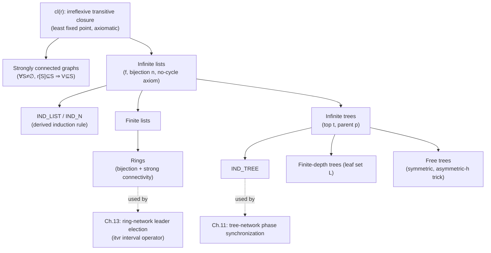

[[book-guidelines|↩ Back to guidelines]]

## Why the book needs data structures before it has any programs

By the end of [[The-Set-Theoretic-Mathematical-Language|the previous section]], you have sets, relations, and functions — enough machinery to state *any* mathematical fact. What you don't yet have is a *vocabulary* for the recurring shapes that the book's later case studies actually need: rings of communicating agents (Chapter 13's leader-election networks), trees of synchronizing nodes (Chapter 11), linked lists (Chapter 14's pointer derivations), and reachability arguments (deadlock-freedom proofs throughout). §9.7 closes that gap — and, true to the chapter's discipline, it does so **axiomatically within the existing language**, never by adding new primitive syntax. A "ring" is not a new kind of expression; it's a *set plus a relation on it* satisfying a handful of predicates already expressible in what you have. This is the same design stance a type-system implementer takes when representing a graph or a tree as ordinary data (an adjacency relation, a parent map) rather than inventing bespoke kernel-level constructs for each shape.

## What breaks without a shared, provable notion of "closure" and "no cycles"

Every one of these structures — lists, rings, trees — needs to rule out the same pathology: an infinite backward chain or a cycle that would let an inductive argument loop forever without terminating. If each data structure invented its own ad hoc "no cycles" condition, you'd have to reprove the associated induction principle from scratch every time, and worse, you'd have no guarantee the different "no cycles" conditions were even consistent with each other. Abrial's solution is to build one primitive — the **irreflexive transitive closure** — and derive every subsequent well-foundedness and induction argument from it. This is exactly the payoff of building your abstract-interpretation lattice operators (widening, closure) once and reusing them across every client analysis, rather than re-deriving termination arguments per-domain.

## Irreflexive transitive closure: the load-bearing primitive

Given a relation $r$ on a set $S$ ($r \in S \leftrightarrow S$), its irreflexive transitive closure $cl(r)$ is characterized by three properties, given as axioms rather than a rewrite (because, unlike the previous section's operators, this one cannot be defined by a single quantifier-free unfolding — it is genuinely a fixed-point notion):

$$r \subseteq cl(r) \qquad cl(r)\,;\,r \subseteq cl(r) \qquad \forall p \cdot r \subseteq p \wedge p\,;\,r \subseteq p \Rightarrow cl(r) \subseteq p$$

Read in order: $cl(r)$ contains $r$; it's closed under extending a path by one more $r$-step; and it is the *smallest* relation with these two properties (the third axiom is a universally-quantified minimality condition — instantiate $p$ with any candidate closure-like relation, and $cl(r)$ is contained in it). This is a **least fixed-point definition**, stated the classical mathematical way (a universally quantified "no smaller relation could possibly work" clause) rather than the way a functional programmer would state it (an explicit `lfp` operator over a monotone function on a lattice). If you've worked with Galois connections and abstract-interpretation fixed points, this axm_5 is doing exactly the job that $\mathrm{lfp}(F) = \bigsqcup \{X \mid F(X) \subseteq X\}$ does in that setting — $cl(r)$ *is* the least fixed point of $X \mapsto r \cup (X \,;\, r)$.

```rust
// Concretely, closure is what you'd compute with a fixed-point iteration
// over a relation represented as an adjacency set — this is the operational
// content behind the axiomatic characterization above.
fn transitive_closure(r: &HashSet<(u32, u32)>) -> HashSet<(u32, u32)> {
    let mut closure = r.clone();
    loop {
        let mut extended = closure.clone();
        for &(a, b) in &closure {
            for &(c, d) in r {
                if b == c { extended.insert((a, d)); }
            }
        }
        if extended.len() == closure.len() { return closure; }
        closure = extended;
    }
}
```

Two theorems the book proves from these axioms are worth internalizing because they recur constantly in later reachability arguments: $cl(r) = r \cup r\,;\,cl(r)$ (unfold-from-the-front) and $cl(r) = r \cup cl(r)\,;\,r$ (unfold-from-the-back) — two equivalent recursive characterizations of the same closure, the algebraic analogue of "BFS from the source" vs. "BFS to the target" in an ordinary reachability computation.

## Strongly connected graphs: reachability as a single quantified condition

A graph $r$ on $V$ is **strongly connected** if every two distinct points are mutually reachable via $r$-paths — formally, $(V \times V) \setminus id \subseteq cl(r)$ (every non-identity pair is in the closure). But the book immediately gives a second, *more useful for proof*, characterization:

$$\forall S \cdot S \ne \emptyset \wedge r[S] \subseteq S \Rightarrow V \subseteq S$$

This says: the only non-empty set closed under following $r$-edges is $V$ itself. It's worth sitting with the two worked mini-examples the book gives, because they show exactly what this condition is *for*: with $r = \{a \to b\}$, the set $\{b\}$ is non-empty and $r[\{b\}] = \emptyset \subseteq \{b\}$, yet $\{b\} \ne V$ — so the graph fails to be strongly connected, correctly, because there's no edge back from $b$ to $a$. Add the reverse edge and no proper non-empty subset stays closed anymore.

This "no proper non-empty invariant subset" formulation is precisely the shape of an **irreducibility / strong-connectivity check** you'd implement algorithmically via Tarjan's or Kosaraju's SCC algorithm, and it's also directly relevant to the standing project's interest in **algebraic graph theory** and **structural tractability**: treewidth- and SCC-based decompositions of a constraint graph are exactly what make certain CSP/CHC solving strategies tractable, and this quantified-invariant-subset framing is the natural high-level specification against which you'd verify an SCC-decomposition implementation.

## Infinite lists: three axioms, one induction principle

An infinite list on $V$ is a starting point $f \in V$ and a bijection $n \in V \rightarrowtail\!\!\rightarrowtail V \setminus \{f\}$ (every non-first element has a unique predecessor via $n$). Two axioms alone (a start point, a "next" bijection into everything-but-the-start) are *not* enough — they don't rule out a stray cycle or an infinite backward chain disconnected from $f$, illustrated concretely in the book's Fig. 9.9. The third axiom closes that gap:

$$\forall S \cdot S \subseteq n[S] \Rightarrow S = \emptyset$$

"The only set that is entirely contained in its own image under $n$ is the empty set" — i.e., there's no non-empty $S$ you could walk forward through forever and never leave; no cycle, no infinite backward chain feeding into it. This is worth pausing on because it is derived from the **same shape of invariant-subset condition** as strong connectivity above, just phrased for a single-successor function rather than an arbitrary relation, and the book proves it's *equivalent* to the last Peano axiom (mathematical induction) when specialized to $V = \mathbb{N}$, $f = 0$, $n = \mathrm{succ}$:

$$\forall T \cdot f \in T \wedge n[T] \subseteq T \Rightarrow V \subseteq T$$

This is genuinely the moment where the book proves, in its own bare-metal set-theoretic terms, that the third infinite-list axiom *is* induction. The derivation then produces a proper inference rule — **list induction**:

$$\dfrac{H \vdash P(f) \qquad H, x \in V, P(x) \vdash P(n(x))}{H, x \in V \vdash P(x)}\;\text{IND\_LIST}\;\;(x \text{ not free in } H)$$

specialized to natural numbers as ordinary mathematical induction (`IND_N`). What's illuminating here for the compiler project is *watching the derivation happen* rather than just citing the rule: the book gets IND_LIST by instantiating the generic set-closure theorem with the concrete set $\{x \mid x \in V \wedge P(x)\}$ — proving $P$ everywhere is *literally* proving that this "set of good elements" equals all of $V$, which reduces to the invariant-subset condition from three paragraphs above. This is precisely the technique behind proving a **loop invariant** or a **program-wide safety invariant** by well-founded/structural induction: define the "good states" set, show it's forward-closed under the transition relation and contains the start state, and closure gives you universality for free. It's also, not coincidentally, the exact mechanism by which a dependently-typed kernel's built-in recursor (`Nat.rec`, `List.rec`) discharges an inductive proof obligation — the recursor *is* a packaged, type-safe version of this instantiate-the-generic-closure-theorem move, done once per inductive type definition instead of by hand every time.

## Finite lists, rings: the same skeleton, symmetrized or closed

A finite list adds a distinguished last point $l$ and drops the requirement that $n$ be total over all of $V \setminus \{f\}$ in the *backward* direction only — $n \in V \setminus \{l\} \rightarrowtail\!\!\rightarrowtail V \setminus \{f\}$ — with the same no-cycle axiom. The book notes the asymmetry explicitly (the axiom rules out backward cycles from $f$'s side but the *dual* fact — no forward-runaway from $l$ — has to be proved, not assumed) and derives it as a theorem, plus finiteness of $V$ itself as a consequence.

A **ring** is even more elegant: drop $f$ and $l$ altogether, make $n$ a full bijection $V \rightarrowtail\!\!\rightarrowtail V$, and *replace* the no-cycle axiom with strong connectivity — a ring is precisely a bijection whose graph is strongly connected. The book proves you can "cut" a ring at any point $x$ (remove the single edge from $n^{-1}(x)$ to $x$) to get back a finite list from $x$ to $n^{-1}(x)$ — an elegant reduction of the ring case to the already-proved finite-list case, and a preview of the technique Chapter 13's ring-network leader-election proofs lean on directly (the interval operator $\texttt{itvr}(x)(y)$ defined here via $cl(\{x\} \mathbin{\lhd\!-} n^{-1})[\{y\}] \cup \{y\}$ is used verbatim in the leader-election correctness argument).

## Infinite and finite trees, free trees: induction generalizes cleanly

Trees replace the single "next" function $n$ with a **parent** function $p$ (running the other direction — from child to parent, so $p \in V \setminus \{t\} \rightarrowtail V$, not necessarily injective, since multiple children can share a parent). The same "no backward-infinite-chain" axiom, now on $p^{-1}$, and the same instantiate-the-closure-theorem derivation, produces **tree induction**:

$$\dfrac{H \vdash P(t) \qquad H, x \in V \setminus \{t\}, P(p(x)) \vdash P(x)}{H, x \in V \vdash P(x)}\;\text{IND\_TREE}\;\;(x \text{ not free in } H)$$

— prove the base case at the top $t$, then prove each node's property assuming its *parent's* property already holds. This is exactly **structural induction over a tree-shaped inductive type** (think `Tree<T> = Leaf | Node(Tree<T>, T, Tree<T>)` in Rust, or an inductive family in Lean): the recursor for a tree type always has this "base case at the leaves/root plus an inductive step relating a node to its immediate structural children/parent" shape. Seeing it derived from a bare set-and-function axiomatization, rather than handed down by a type system's built-in eliminator, is a genuinely useful "view from below" for anyone who will eventually *implement* such an eliminator: this derivation is the soundness argument your kernel's recursor-elaboration code has to get right, once, for every inductively-defined type a user declares.

**Finite-depth trees** replace the single last point $l$ with a whole *set* $L$ of leaves (the natural generalization from list to tree of "where you're allowed to stop"), with a symmetric adaptation of every theorem. **Free trees** are the most structurally interesting case: an *undirected* tree, represented as a symmetric ($g \subseteq g^{-1}$), irreflexive, strongly-connected graph that is nonetheless acyclic "in spite of the symmetry." The trick in `axm_6` — quantifying over an auxiliary *asymmetric* sub-relation $h \subseteq g$ with $h \cap h^{-1} = \emptyset$ and demanding the closure-invariant property hold for $h$ — exists precisely because symmetry alone would make *every* non-trivial graph trivially "cyclic" (an edge and its reverse look like a 2-cycle unless you first pick a canonical orientation). This is a genuinely subtle bit of relational engineering worth remembering: whenever you need to state "no cycles" over an *undirected* structure using purely relational vocabulary, you generally need to existentially quantify over an implicit orientation/direction-choice the way $h$ does here, rather than trying to state acyclicity directly on the symmetric relation.

## Where this leads



This section is the book's toolbox for every case study built on a network topology — rings (Chapter 13), trees (Chapter 11), and reachability-style deadlock-freedom arguments throughout. The pattern to take away for the standing compiler project is the *method*, not just the results: characterize a structural property as "the only invariant subset under this transition/edge relation is the whole carrier set (or the empty set)," and induction/well-foundedness proofs fall out as instantiations of one generic closure theorem. That is the same fixed-point discipline underlying termination-checking for recursive functions, well-founded recursion in Lean's `termination_by`, and reachability-based invariant generation in abstract interpretation — [[Refinement-Theory|Refinement Theory]], the book's next major topic, is where these same well-founded arguments get reused to prove that an *event's* recurring execution (via a decreasing variant) must eventually terminate, rather than a static graph's traversal.
