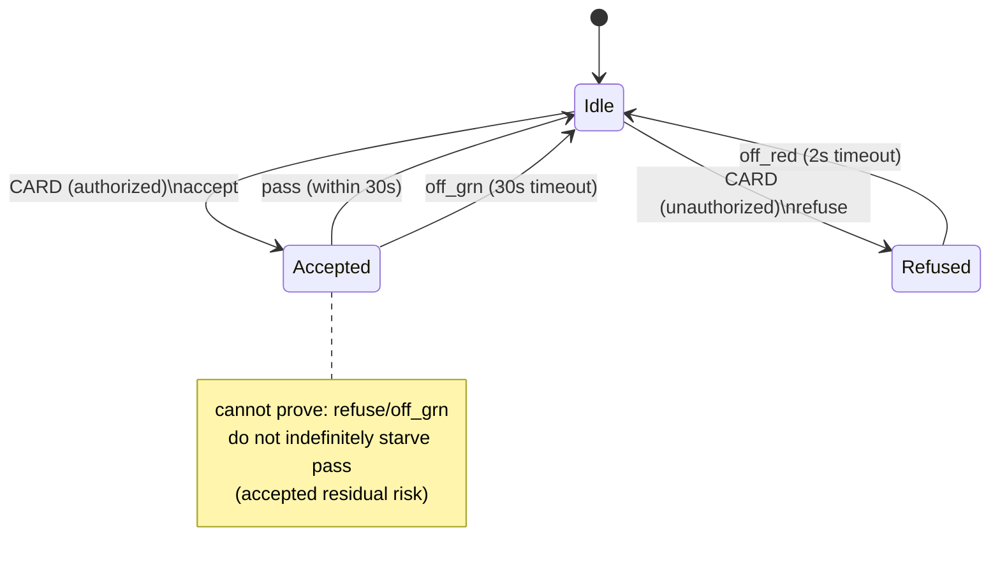
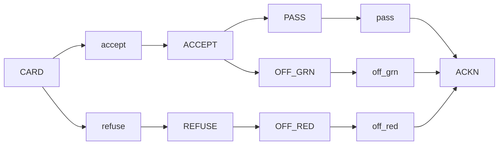
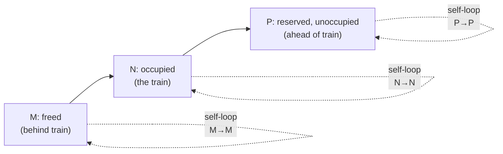
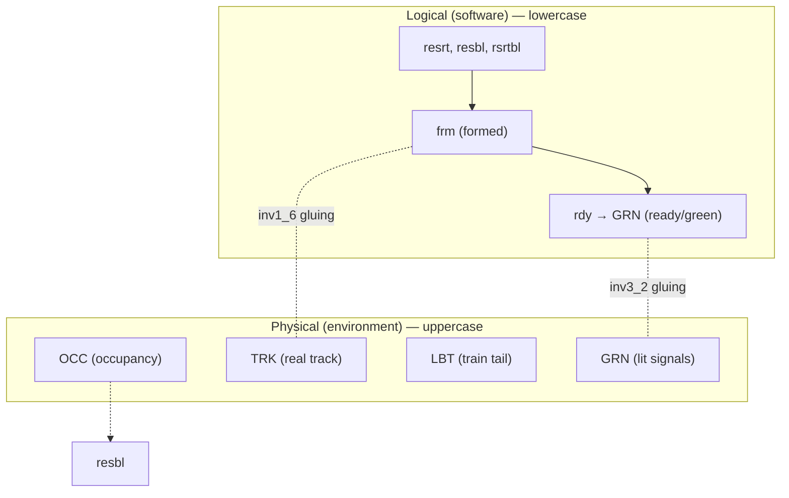

# Case Study: Access Control and Train Systems

[[book-guidelines|↩ Back to guidelines]]

## Why these two case studies belong together

Chapters 16 and 17 are the book's two largest worked examples, and Abrial places them back-to-back deliberately. Both are "controller + physical world" systems: a piece of software (turnstile controller, train-network controller) sitting on top of hardware it does not fully control (card readers, doors, track circuits, points, signals) and people it cannot control at all (badge holders, train drivers). Both case studies exist to teach the same two lessons, at different scales:

1. **A failed proof is a diagnostic instrument, not a bug in your model.** In the access controller, an attempt to prove deadlock-freedom simply fails — and the *reason* it fails, read off the unprovable sequent, is a missing safety requirement nobody wrote down. This is the sharpest, most self-contained illustration in the whole book of the idea introduced abstractly back in Chapter 1: proof failure as requirements discovery.
2. **A controller and its environment must be modeled — and proved — together, but kept notationally and causally separate.** Both chapters enforce a strict lowercase/uppercase discipline: lowercase variables and events belong to the *logical* controller (the software you're going to build), uppercase variables and events belong to the *physical* world (hardware, people, trains) that the controller can only observe and influence indirectly, through messages and physical events whose guards must eventually depend on physical state alone.

If you are building a verifier with a trusted kernel, this second point is worth pausing on before diving in: Abrial's physical/logical separation is a discipline for keeping your model honest about what a component can actually observe, and it maps cleanly onto the trusted-computing-base question of what a kernel is allowed to assume versus what it must derive from checked evidence. We'll come back to this explicitly in the closing [[Case-Study-Bridge-and-Press-Controllers#Synthesis|synthesis]].

---

# Part I — The location access controller (Chapter 16)

## 1. The requirements document: FUN and EQP

Abrial opens, as always, with a numbered, traceable requirements document — deliberately informal English sentences, each boxed and labeled, that the formal model will later be checked against sentence by sentence. Two taxonomies appear: **FUN** (functional) and **EQP** (equipment).

The functional core:

- **FUN-1**: the system concerns people and locations.
- **FUN-2**: people are *permanently* assigned authorization to access certain locations (authorizations don't change during normal operation — this matters later, because it lets the model treat `aut` as a constant rather than a variable).
- **FUN-3**: a person who is in a location must be authorized to be there.
- **FUN-4**: turnstiles are normally blocked.
- **FUN-5**–**FUN-9**: the pass protocol itself — insert card (FUN-5); if accepted, green light for ≤30s (FUN-6); if refused, red light for 2s, turnstile stays blocked (FUN-7); pass within the window extinguishes green and re-blocks (FUN-8); timeout with no pass also extinguishes green and re-blocks (FUN-9).

Equipment: **EQP-1** (personal magnetic card), **EQP-2** (card reader at every entrance/exit), **EQP-3** (each reader has a red and a green light), **EQP-4** (each light is on/off), **EQP-5** (locations communicate via one-way turnstiles), **EQP-6** (a sensor detects passage through a turnstile).

**[[Discrete-Transition-Systems#What breaks without this|What breaks without this]]:** without the FUN-5..9 timing protocol spelled out as its own labeled requirements — separate from the static FUN-1..4 facts about people and authorization — there would be nothing later to point a failed proof obligation *back at*. The traceability labels are what let Section 16.4.2's discovery ("the proof of deadlock-freedom fails") turn into "therefore we need SAF-1" instead of just "the model is wrong somehow."

## 2. The discussion section: questions the requirements didn't ask

Before touching the formal model, §16.2 explicitly lists the *un*-asked questions that the informal prose glossed over: how much control is centralized vs. decentralized across the readers (§16.2.1); what behavioral assumptions about the hardware the model will need to state as hypotheses (§16.2.3); and, most importantly for what follows, §16.2.4 **"Tackling safety questions"** — verbatim: *"can people be blocked for ever in a location? How can we guarantee the contrary?"* This question is asked and left open. Nothing in FUN-1..9 or EQP-1..6 answers it. The formal development is what answers it — by failing to prove something, not by anyone thinking of it up front.

## 3. Initial model: the abstract `pass` event

The first model deliberately elides the "geometry" of the workplace — there's no notion yet of which locations can reach which others. Carrier sets $P$ (people) and $L$ (locations), plus a distinguished location $out$:

$$\text{axm0\_1: } aut \in P \leftrightarrow L \qquad \text{axm0\_2: } out \in L \qquad \text{axm0\_3: } P \times \{out\} \subseteq aut$$

`aut` is the permanent authorization relation (FUN-2); axm0_3 says everyone is always authorized to be outside. The one variable, `sit` (where each person currently is), is constrained by:

$$\text{inv0\_1: } sit \in P \to L \qquad \text{inv0\_2: } sit \subseteq aut$$

`inv0_2` is literally FUN-3 rendered as an invariant: wherever `sit` says someone is, `aut` says they're allowed to be. The single event:

```
pass
  any p, l where
    p ↦ l ∈ aut
    sit(p) ≠ l
  then
    sit(p) := l
  end
```

This is intentionally under-specified — it says a person *can* move to any location they're authorized for, with no notion of whether that location is physically reachable from where they are. That's the point: **inv0_2 is the only property this model is responsible for**, and the proof that `pass` preserves it is essentially "if `p ↦ l ∈ aut` then after `sit(p) := l`, `sit ⊆ aut` still holds" — one line.

**Rust grounding.** Think of `pass` at this stage as a trait method with an almost-vacuous precondition:

```rust
struct AccessState { sit: HashMap<Person, Location> }

impl AccessState {
    // guard: aut.contains(&(p, l))  &&  self.sit[&p] != l
    // invariant to preserve: sit ⊆ aut (every recorded location is authorized)
    fn pass(&mut self, p: Person, l: Location, aut: &Relation<Person, Location>) {
        debug_assert!(aut.contains(&(p, l)));
        self.sit.insert(p, l);
    }
}
```

At this level of abstraction there is no `com` (adjacency) check yet — exactly analogous to writing the *type-safety* invariant of a type checker before you've committed to any particular elaboration or scheduling strategy. You're pinning down the property you must never violate before you pin down how execution actually proceeds.

## 4. First refinement: `com`, and the deadlock-freedom proof that discovers SAF-1

This is the chapter's central episode, and it's worth walking through exactly the way Abrial does, because the *shape* of the argument — a failed sequent, read for its counterexample, converted into a new hypothesis — is exactly CEGAR (counterexample-guided abstraction refinement) performed by hand on paper.

A new constant `com ∈ L ↔ L` records which locations directly communicate (axm1_1), irreflexively (axm1_2: `com ∩ id = ∅`). `pass` is refined by strengthening its guard:

```
pass
  any p, l where
    p ↦ l ∈ aut
    sit(p) ↦ l ∈ com
  then
    sit(p) := l
  end
```

This refines the abstraction cleanly (`sit(p) ↦ l ∈ com ⇒ sit(p) ≠ l`, by irreflexivity — GRD is trivial). But the book now asks the refinement-theory question that *must* be asked at every refinement: does the concrete `pass` fire **at least as often** as the abstract one (relative deadlock-freedom, "no less often" — see [[Refinement-Theory]])? The proof obligation is:

$$\exists p, l \cdot p{\to}l \in aut \land sit(p) \ne l \;\vdash\; \exists p, l \cdot p{\to}l \in aut \land sit(p){\to}l \in com$$

**This does not go through**, and the book gives the exact counterexample by hand: one person `p`, sitting in a location with authorization to be elsewhere, but where none of the *authorized* destinations happen to be `com`-adjacent to where `p` currently is. The abstract model allowed `p` to teleport there; the concrete model, once it has a real notion of adjacency, doesn't. `p` is stuck — forever, as far as this model can tell.

The failed proof is then read backwards into a new labeled requirement:

> **SAF-1**: No person must remain blocked in a location.

Abrial is explicit that SAF-1 is *stronger* than strictly necessary to patch the failed proof (a weaker statement — "the geometry adds no *new* blockage beyond what authorization alone would already cause" — would have sufficed) but chooses the stronger, more meaningful safety property because *that's what the failed proof actually revealed about the system's real risk*, not just about this particular proof obligation.

From there the chapter derives, by direct calculation on the failed sequent, a sufficient condition:
$$sit \subseteq (aut\,;\,com^{-1})$$
and shows it's implied by a condition on the *constant* `aut` alone (independent of the current `sit`, which is preferable because it doesn't need to be re-checked at runtime):
$$aut \subseteq aut\,;\,com^{-1}$$
which reads in English as: *whenever a person is authorized to be in $l$, there's some $m$ they're also authorized to enter, such that $l$ communicates with $m$.* This becomes the promoted requirement:

> **SAF-2**: Any person authorized to be in a location must also be authorized to go in another location which communicates with the first one.

SAF-2 only guarantees a *next* step, not eventual escape to `out`. §16.4.4 tightens this with a new constant `exit : L\{out} → L` forming a *tree* (using exactly the tree axioms of Chapter 9 §9.7.7 — see [[Advanced-Data-Structures]]), giving:

> **SAF-3**: Any person authorized to be in a location which is not "outside" must also be authorized to be in another location communicating with the former and leading towards outside.

And finally the *dual* deadlock check is revisited (§16.4.5): can people get **in**? A fresh axiom, axm1_7, is added asserting every person has some entry point reachable from `out`.

**What breaks without this:** if the book had simply *stated* SAF-1/2/3 up front as part of the informal requirements document, the reader would see three more boxed sentences and shrug. What actually happened — a routine refinement proof obligation that silently fails, and turns out to encode a real safety hazard nobody had thought to write down — is the entire argument for why formal modeling precedes (and improves) requirements engineering rather than merely implementing it. This is also precisely the shape of reasoning your CSP/abstract-interpretation kernel will need to automate: propose an invariant candidate (here, `inv0_2`/reachability-to-`out`), attempt the inductive step, extract a concrete counterexample from the failed proof, and either strengthen the invariant or add a guard — mechanically, not by an author noticing something in prose.

## 5. Second refinement: doors, and the *unprovable* obligation

§16.5 introduces physical doors (carrier set $D$, `org`/`dst` functions), and three new variables: `dap` (person currently "connected" to a door, mid-transaction), and the door-light sets `grn`/`red`. Two new events `accept`/`refuse` decide, on card insertion, whether to light green or red; `off_grn`/`off_red` model the 30s/2s timeouts; `pass` is re-derived to fire only when a door is green.

$$\text{inv2\_1: } dap \in P \rightarrowtail D \qquad \text{inv2\_6: } grn = ran(dap) \qquad \text{inv2\_7: } grn \cap red = \emptyset$$

Now the refinement has **new events** (`accept`, `refuse`, `off_grn`, `off_red`) alongside the old `pass`, and two proof obligations are due:

1. **`pass` still fires no less often than its abstraction** — proved without difficulty.
2. **The new events cannot indefinitely block `pass`** — and here the book states, in so many words: *"the proof of (1) is relatively easy; however that of (2) is quite simply impossible."*

This is not a temporary gap to be patched by a cleverer invariant, the way SAF-1/2/3 were. It is a genuine, permanent obstruction risk: nothing stops a person from repeatedly inserting an unauthorized card (`refuse` fires forever) or repeatedly abandoning the attempt just before passing (`accept` then `off_grn`, forever), each time re-blocking the door and starving `pass`. §16.5.5 considers two fixes and **rejects both**:

- Forcing compliance (mandating people not misbehave) — rejected as outside the system's actual authority.
- Confiscating a misbehaving person's card, as ATMs do after repeated failures — rejected because it creates a *new* safety problem: a person stripped of all authorization is now permanently trapped wherever they happen to be standing, which directly violates SAF-1.

§16.5.6, "Final decision," accepts the residual risk explicitly, in the book's own words: *"we accept, for financial (and safety) reasons, a risk of indefinite obstruction, which, despite everything, will probably never happen in reality... Clearly, the system we are going to construct is thus not totally correct according to our theoretical criteria. We accept this, but... we have taken great care to make it known."*

**Why this matters, and what breaks without it:** this is Abrial explicitly documenting the boundary of what formal proof buys you. An unprovable obligation is not automatically a design flaw to be engineered away at any cost — sometimes the "fix" (confiscating cards) introduces a *worse*, provable safety violation, and the right engineering call is to accept, characterize, and *record* the unprovable risk rather than force a proof through a bad design change. If your CSP/abstract-interpretation kernel ever reports "cannot discharge this obligation, and no counterexample search terminates either," this section is the canonical worked example of what a *responsible* human response to that report looks like — not silence, and not brute-forcing a fix, but a documented, justified risk acceptance became part of the specification itself.



## 6. Third refinement: card readers as real physical devices

§16.6 introduces the reader hardware itself. The key behavioral decision: **a reader's slot stays physically blocked from the moment it sends a card message until it receives the corresponding acknowledgement** — this is what prevents a second card from being inserted mid-transaction. `BLR ⊆ D` (blocked readers), and two message channels: `mCard ∈ D ⇸ P` (reader → controller) and `mAckn ⊆ D` (controller → reader). A new **physical event** `CARD` fires when a card is inserted into an unblocked reader:

```
CARD
  any p, d where
    p ∈ P
    d ∈ D \ BLR
  then
    BLR := BLR ∪ {d}
    mCard := mCard ∪ {d ↦ p}
  end
```

The book flags the guard `d ∈ D\BLR` explicitly as "a physical guard" — it depends only on physical state. `accept`/`refuse`/`pass`/`off_grn`/`off_red` are all re-derived to consume from `mCard` and produce into `mAckn`, and a final physical event `ACKN` unblocks the reader on receipt of the acknowledgement. Four invariants (inv3_4–inv3_6, plus inv2_7 reused) establish that `dom(mCard)`, `grn`, `red`, `mAckn` **partition** `BLR` — i.e. a blocked reader is in exactly one of four well-defined progress states at any time.

## 7. Fourth refinement: the green/red hardware chains, and the physical/logical gap made explicit

The final refinement (§16.7) splits the software's `grn`/`red` into full physical chains, one per light, each modeling the causal gap between a *logical* decision and its *physical* enactment:

**Green chain**: `mAccept` (message: software → door, "accept") → `GRN` (physically lit) → `mPass` (message: door → software, "cleared") *or* `mOff_grn` (message: door → software, "auto-reblocked after 30s").
**Red chain**: `mRefuse` → `RED` (physically lit) → `mOff_red` (auto-off after 2s).

$$\text{inv4\_1: } mAccept \cup mPass \cup mOff\_grn = grn \qquad \text{inv4\_4: } GRN \subseteq mAccept$$

Physical events `ACCEPT`, `PASS`, `OFF_GRN`, `REFUSE`, `OFF_RED` each react purely to physical/message state:

```
ACCEPT                        PASS
  any d where                   any d where
    d ∈ mAccept                   d ∈ GRN
  then                         then
    GRN := GRN ∪ {d}              GRN := GRN \ {d}
  end                            mPass := mPass ∪ {d}
                                 mAccept := mAccept \ {d}
                               end
```

Abrial calls out explicitly: *"it is interesting to remark on the gap between the logical acceptance of the door (`accept` event in the software) and the physical acceptance (event `ACCEPT` of the hardware). This gap evokes a major problem of distributed systems: distinguishing between the intention (software) and the real action (hardware)."* Note too that the *door itself* "does not know" who is clearing it — `PASS`'s guard and action never mention `p`, only `d`. The final synchronization diagram for the whole controller:



**What breaks without this:** if the model let a logical event's guard reference a physical variable directly (say, `accept`'s guard checking `d ∈ GRN` instead of routing through the message channel `mAccept`/`ACCEPT`), the model would be silently claiming the software can observe hardware state *instantaneously and without possibility of message loss or reordering* — which is exactly the false assumption that produces real distributed-systems bugs. Keeping physical events' guards restricted to physical variables (a discipline the book flags as an "important remark" already in Chapter 17, reused here) forces every cross-boundary fact to be *earned* via an explicit message and its own event, which is the only way the resulting model can be trusted to say anything true about the real deployed system.

---

# Part II — The train network safety system (Chapter 17)

## 8. The requirements taxonomy: six categories, 39 requirements

Chapter 17 uses a richer taxonomy than Chapter 16's FUN/EQP — six categories, all boxed and numbered:

| Label | Meaning | Count |
|---|---|---|
| **ENV** | structure of the track network and its components | 15 |
| **FUN** | main functions of the system | 8 |
| **SAF** | properties preventing classical accidents | 4 |
| **MVT** | conditions letting many trains cross concurrently | 3 |
| **TRN** | implicit assumptions about train behavior | 4 |
| **FLR** | failures the system must react to | 5 |

**Environment (ENV).** A network has **points** (left/right/unknown in reality, simplified here to just left/right — ENV-1, ENV-2) and **crossings** (static, no state). It's divided into fixed **blocks** (ENV-3), each with at most one special component (ENV-4), each with a track circuit reporting occupied/unoccupied (ENV-5). **Routes** are ordered sequences of adjacent blocks (ENV-6), each also characterized by required point positions (ENV-7). Two structural constraints prevent one route starting or ending inside another: **ENV-8** ("the first block of a route cannot be part of another route unless it is also the first or last block of that route") and its mirror **ENV-9** for the last block; **ENV-10**/**ENV-11** require continuity and no cycles. **ENV-12**–**ENV-15** define signals: each route has a signal before its first block (ENV-12), red forbids entry (ENV-13), routes sharing a first block share a signal (ENV-14), and a green signal auto-resets to red the instant its first block becomes occupied (ENV-15) — this last one is the key liveness/safety coupling that later refinements exploit.

**Functional (FUN).** FUN-2: a route can be reserved; the software controls reservation. Reservation is a three-phase protocol: (i) **block reservation** (FUN-3, FUN-4, FUN-5 — a block is reserved/free; an occupied block is *always* reserved; reserving all of a route's blocks reserves the route), (ii) **point positioning** to make the route *formed* (FUN-6, FUN-7 — a formed route is always reserved), (iii) turning the signal green (FUN-8).

**Safety (SAF)** — the four load-bearing invariants:

- **SAF-1**: a block can be reserved for at most one route.
- **SAF-2**: a route's signal is green only when all its blocks are reserved-for-it *and* unoccupied *and* all its points are properly positioned.
- **SAF-3**: a point can only be repositioned if it belongs to a block of a route that is reserved but *not yet formed*.
- **SAF-4**: no blocks of a reserved-but-not-yet-formed route are occupied.

**Movement (MVT)**: MVT-1 (a block frees itself the instant it's unoccupied, within a formed route), MVT-2 (a route stays formed as long as it has any reserved blocks), MVT-3 (a route frees itself once it has none).

**Train assumptions (TRN)**: TRN-1 (no splitting), TRN-2 (no backward movement), TRN-3 (can't enter mid-route), TRN-4 (can't vanish mid-route) — these are *assumptions about physical trains*, not properties the software enforces; they justify why a freed block can safely be reused.

**Failure (FLR)**: FLR-1/FLR-3 are mitigated by the Automatic Train Protection system (emergency braking on red-signal violation or backward movement, the latter aided by a deliberate reporting *delay* on track-circuit occupancy release — see below); FLR-2 by mechanical train bindings; **FLR-4** (spurious block-occupancy detection) and **FLR-5** (a short train physically leaving a block without going through the freeing protocol) are explicitly **accepted as untreated risks**, exactly in the spirit of Chapter 16's residual-risk decision — the book doesn't pretend every failure mode is solved, it labels which ones are out of scope and why.

**What breaks without this:** the FLR-3 mitigation is worth dwelling on because it's a lovely example of a *physical* design decision compensating for a *logical* one. TRN-2 assumes no backward motion, but real trains can jitter backward slightly. If the track circuit reported "unoccupied" the instant the physical train's rear left the block, a backward jitter could make a freed block look re-occupied in a way that fools the reservation logic. The fix isn't a software guard — it's a *hardware* delay in how occupancy-release gets reported, deliberately built into the physical layer so that the logical model's TRN-2 assumption remains safe to build on. This is the physical/logical boundary being actively engineered, not just documented.

## 9. Initial model: blocks, routes, and the M/N/P partition invariant

Carrier sets $B$ (blocks), $R$ (routes). Constants: `rtbl ∈ B ↔ R` (total, surjective — every route has blocks, every block belongs to some route; axm0_1), and `nxt ∈ R → (B ⇸ B)` (per-route block succession, an injective partial function — axm0_2). `fst`/`lst` give each route's first/last block (axm0_3–axm0_7, with `fst(r) ≠ lst(r)`). Two structural axioms encode ENV-10/ENV-11 precisely:

$$\text{axm0\_8: } \forall r \cdot nxt(r) \in (s\setminus\{lst(r)\}) \rightarrowtail (s\setminus\{fst(r)\}), \text{ where } s = rtbl^{-1}[\{r\}]$$
$$\text{axm0\_9: } \forall r \cdot (\forall S \cdot S \subseteq nxt(r)[S] \Rightarrow S = \emptyset) \quad \text{(no cycles)}$$

and ENV-8/ENV-9 as axm0_10/axm0_11 (a route's first/last block can't sit in the *middle* of a different route).

Four variables, and the book is explicit about a naming convention it will hold to for the rest of the chapter: **physical variables use uppercase, logical (controller) variables use lowercase**.

$$\text{inv0\_1: } resrt \subseteq R \quad \text{inv0\_2: } resbl \subseteq B \quad \text{inv0\_3: } rsrtbl \in resbl \to resrt \quad \text{inv0\_4: } rsrtbl \subseteq rtbl \quad \text{inv0\_5: } OCC \subseteq resbl$$

`rsrtbl`'s being a genuine *function* from reserved blocks to reserved routes is literally SAF-1 encoded as a typing constraint — a block can't map to two routes because `rsrtbl` is single-valued by construction. `inv0_5` is FUN-4 (occupied ⟹ reserved).

The chapter's richest invariant partitions each reserved route's blocks into three zones, tracking exactly where the train's occupied span sits relative to the route:

- $M = rtbl^{-1}[\{r\}] \setminus rsrtbl^{-1}[\{r\}]$ — blocks *freed* already (behind the train, reusable).
- $N = rsrtbl^{-1}[\{r\}] \cap OCC$ — blocks *reserved and occupied* (the train itself).
- $P = rsrtbl^{-1}[\{r\}] \setminus OCC$ — blocks *reserved but not yet occupied* (ahead of the train).

and the only transitions the physical events are allowed to realize are $M \to M$, $M \to N$, $N \to N$, $N \to P$, $P \to P$ — a train can only advance the M/N/P frontier forward, never skip zones or reverse. Formalized as three set-inclusion invariants (inv0_6–inv0_8) rather than an explicit automaton, this is the mathematical core of what makes TRN-1..4 sufficient: any single-block-at-a-time, no-splitting, no-backward-motion, must-enter-at-the-front train motion is *forced* into this M→N→P chain, and nothing else is.



Five events realize this. `route_reservation` reserves an unreserved route whose blocks are free; `route_freeing` frees a reserved route once no blocks remain reserved for it. `FRONT_MOVE_1` occupies a route's first block (front of train entering); `FRONT_MOVE_2` occupies the next unoccupied block once its physical predecessor (per the *route's* `rsrtbl`-associated succession) is occupied; `BACK_MOVE` frees the trailing block once its successor is confirmed occupied-or-not-reserved-for-the-same-route, and its predecessor (if reserved) is occupied — encoding "don't let the train appear to break in two."

The book flags, immediately after presenting these events, exactly the physical/logical discipline Part I ended on: *"it might seem strange... to have physical events such as FRONT_MOVE_1... using non-physical variables in their guards"* (`FRONT_MOVE_1`'s guard mentions `resbl`, `rsrtbl` — logical state). At the initial-model level this is tolerated because the model is still abstract; the remark is an explicit promissory note that later refinements must eliminate it — which they do, refinement by refinement.

## 10. First refinement: physical tracks, and the logical/physical `nxt`/`TRK` gluing invariant

§17.4 introduces the actual track hardware: `TRK ∈ B ⇸ B` (physical succession — what's really wired together on the ground right now, inv1_1), `frm ⊆ resrt` (formed routes, inv1_3), and `LBT` (blocks occupied by the *back* of a train, inv1_7 — a genuinely new physical observable). The chapter's central gluing invariant of this refinement:

$$\text{inv1\_6: } \forall r \cdot r \in frm \Rightarrow rsrtbl^{-1}[\{r\}] \lhd nxt(r) = rsrtbl^{-1}[\{r\}] \lhd TRK$$

Read this as: *for every formed route, the logical succession the controller believes in (`nxt(r)`, restricted to blocks currently reserved for `r`) exactly matches what the physical points on the ground actually connect (`TRK`, same restriction).* This is a refinement-theoretic gluing invariant in the [[Refinement-Theory]] sense — it's the one condition tying the abstract book-keeping variable to the concrete physical one, and every later proof that a physical `FRONT_MOVE`/`BACK_MOVE` event correctly refines its abstract counterpart routes through it.

Two new events appear: `point_positioning` (moves `TRK` to match `nxt(r)` for a route being formed — realizing SAF-3, since its guard `r ∈ resrt \ frm` requires reserved-but-not-formed) and `route_formation` (marks a route formed once `TRK` and `nxt(r)` already agree on its blocks — this is where inv1_6 gets *established*, not just preserved).

`FRONT_MOVE_2`/`BACK_MOVE_1`/`BACK_MOVE_2` (the abstract `BACK_MOVE` splits in two: leaving-the-route vs. progressing-within-it) are rewritten to reference only `TRK`, `OCC`, `LBT` — pure physical state — while `FRONT_MOVE_1` remains stubbornly stuck referencing `resbl`/`rsrtbl` (the book says outright: *"wait until refinement 3... where we shall see that `FRONT_MOVE_1` will be enabled as a consequence of a green signal, which clearly is a physical condition"*). Three explicit remarks close the section, walking through exactly which events still touch non-physical state in their guards versus their actions, and why that's still acceptable *at this refinement level* — a candid, section-by-section audit of the physical/logical boundary the model hasn't fully closed yet.

## 11. Second and third refinements: readiness, then real signals

§17.5 introduces `rdy ⊆ frm` — an abstract notion of "ready to accept a train" — with:

$$\text{inv2\_1: } rdy \subseteq frm \qquad \text{inv2\_2: } \forall r \in rdy \cdot rtbl\rhd\{r\} \subseteq rsrtbl\rhd\{r\} \qquad \text{inv2\_3: } \forall r \in rdy \cdot dom(rtbl\rhd\{r\}) \cap OCC = \emptyset$$

i.e. ready ⟹ formed, fully reserved, fully unoccupied. `route_formation` is extended to also add the route to `rdy`; `FRONT_MOVE_1`'s guard tightens from `r ∈ frm` to `r ∈ rdy` — closer to a real signal, but still an abstraction of one.

§17.6 makes it real: a new carrier set $S$ (signals) and a bijective constant `SIG ∈ ran(fst) ⤖ S` (each route's first block has exactly one signal — ENV-12/ENV-14). `rdy` is **data-refined away entirely**, replaced by `GRN ⊆ S` with the linking invariant

$$\text{inv3\_2: } SIG[fst[rdy]] = GRN$$

`route_formation` now turns on a physical light (`GRN := GRN ∪ {SIG(fst(r))}`) instead of touching an abstract flag, and — the payoff — `FRONT_MOVE_1` is rewritten to depend *only* on physical state:

```
FRONT_MOVE_1
  any b where
    b ∈ dom(SIG)
    SIG(b) ∈ GRN
  then
    OCC := OCC ∪ {b}
    LBT := LBT ∪ {b}
    GRN := GRN \ {SIG(b)}
  end
```

The promissory note from refinement 1 is finally discharged: `FRONT_MOVE_1`'s guard now mentions only `SIG` (a constant) and `GRN` (physical), matching ENV-13 exactly ("trains are supposed to stop at red signals" ⟺ they only *can* move on green), and its action clearing `GRN` in the same step realizes ENV-15's auto-reset. Notice the proof burden this data refinement discharges: SAF-2 ("green only when reserved, unoccupied, and points positioned") is now a *consequence* of inv3_2 plus inv2_2/inv2_3, not something asserted separately — the book gets to point at exactly which invariants jointly imply it.

## 12. Fourth refinement: points, closing the loop

§17.7 introduces points properly: `blpt ⊆ B` (blocks containing a point), and total functions `lft`, `rht : blpt → B` giving the two connections out of a point-block, disjoint by construction (axm4_4 — a block can't be simultaneously "to the left" and "to the right"). axm4_5 pins down, per route, that the point's position relative to that route is single-valued; axm4_6/axm4_7 forbid points on a route's first/last block (consistent with why a point needs a *formed* route to sit safely inside, not at its boundary). The single new invariant simply asserts that the same functionality holds of the real track:

$$\text{inv4\_1: } (lft \cup rht) \cap (TRK \cup TRK^{-1}) \in blpt \rightharpoonup B$$

— i.e., `point_positioning` (unchanged from refinement 1, since it already just overwrites `TRK` with `nxt(r)`) is proved to *maintain* this new invariant essentially for free, because it was already establishing the stronger inv1_6. The chapter ends candidly, noting that a full development would still need to decompose `route_reservation`, `route_formation`, and `point_positioning` into per-block/per-point atomic events (to model them as real control loops rather than instantaneous whole-route actions) — left as future work, not hidden as already solved.



## 13. The training example: reading the M/N/P transitions on the network

§17.1.12 walks through a running example on a 14-block network (blocks `A`–`N`, routes `R1`–`R10`) with three trains threading through simultaneously — reserving `R3`, forming it, entering, freeing blocks behind, another train reserving the now-conflict-free remainder of the network, and so on. It's worth internalizing this diagram once, because it's the concrete picture behind every invariant above: reserved-but-unoccupied blocks (dashed), reserved-and-occupied (solid), and freed blocks all coexist on the same route at once, and the M/N/P partition is precisely what's being drawn.

---

## 14. Where the two case studies meet: physical/logical duality as a trusted-boundary discipline

Both chapters enforce the same rule, worded almost identically in each: **a physical event's guard (and, per Chapter 17's Remark 2, ideally its action too) must depend only on physical variables.** In Chapter 16 this is what forces `accept`/`ACCEPT`, `pass`/`PASS`, `refuse`/`REFUSE` into distinct logical/physical event pairs connected only by message channels (`mAccept`, `mPass`, `mRefuse`, ...). In Chapter 17 it's what drives the whole refinement sequence — `FRONT_MOVE_1` starts out cheating (referencing `resbl`/`rsrtbl` directly) and is refinement-by-refinement forced to depend only on `SIG`/`GRN`, exactly tracking the gluing invariants (inv1_6, inv3_2) that certify the logical and physical pictures agree.

If you map this onto a proof-producing compiler's trusted computing base: the *logical* side is your elaborator/checker's internal model of the world (what it believes has been verified); the *physical* side is the actual artifact being checked (bytecode, a certificate, an external oracle's answer). The discipline "a physical-facing check may only consult physical evidence, never the checker's own beliefs about that evidence" is precisely the rule that keeps a trusted kernel from silently begging the question — from accepting something *because the elaborator already assumed it*, rather than because the kernel independently re-derived it from what's actually on the wire. Abrial's gluing invariants (inv1_6, inv3_2) are the formal contract asserting the two sides are kept honestly synchronized, exactly the role a proof-certificate format plays between an untrusted elaborator and a small trusted checker.

The Chapter 16 deadlock-freedom episode, meanwhile, is CEGAR done by hand: propose an abstraction (the very first `pass` event, with no adjacency structure at all), refine it (introduce `com`), attempt to re-verify a property that held in the abstraction (relative deadlock-freedom), fail, extract a concrete counterexample from the failed sequent, and turn that counterexample into a *new hypothesis* (SAF-1, then SAF-2, then SAF-3) rather than a patch to the code. An automated CEGAR loop in an abstract-interpretation kernel does exactly this mechanically — propose an invariant, attempt the inductive step, extract a counterexample when it fails, refine the abstract domain (or, here, refine the requirements) and retry. The train system's SAF-1..4 and the M/N/P partition invariant are worth keeping as a concrete stress-test for such a kernel: they are genuinely relational (an occupied block must be reserved *for a specific route*, via a *function* `rsrtbl`, not just "reserved"), and they hold over a non-trivial structure (routes as distinguished, ordered, cycle-free sequences of blocks) — closer to what your kernel will need to propagate over real data structures than the single-counter invariants of earlier bridge/press examples in the book.

## Where this leads

Chapter 18 closes the book with exercises that explicitly ask readers to reproduce this exact discipline unaided — including, by name, "a simple access control system" as an exercise mirroring Chapter 16. There is no further chapter that builds on 16/17 formally; they are capstones, meant to demonstrate that everything taught earlier (refinement, invariants, deadlock-freedom, superposition, closed-model construction from [[Design-Patterns-for-Reactive-Controllers]], [[Discrete-Transition-Systems]]) composes into genuinely large, realistic developments — and that the payoff of the whole method is precisely the kind of episode Chapter 16 stages on purpose: a proof failure that hands you a requirement you didn't know you were missing.
