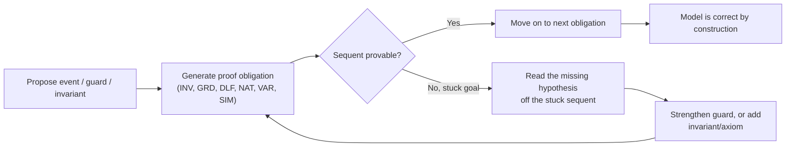
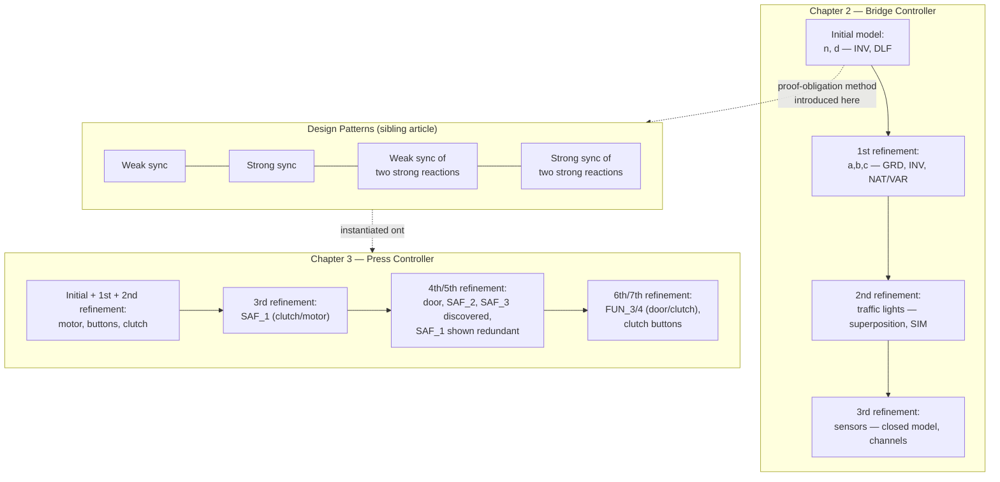

[[book-guidelines|↩ Back to guidelines]]

# Case Study: Bridge and Press Controllers

## Why two case studies, back to back

Chapters 2 and 3 of *Modeling in Event-B* are the book's proving ground. Everything abstract in [[The-Event-B-Notation|The Event-B Notation]], [[Proof-Obligation-Rules|Proof Obligation Rules]], and [[The-Sequent-Calculus-and-Logical-Inference|The Sequent Calculus and Logical Inference]] gets *introduced for the first time*, from nothing, inside the bridge controller of Chapter 2 — Abrial deliberately withholds the general machinery and builds it up rule by rule, exactly when the bridge model first needs it. Chapter 3's mechanical press then reuses that machinery at a higher level: instead of hand-deriving guards and invariants from scratch, it builds two reusable *design patterns* (covered in the sibling article [[Design-Patterns-for-Reactive-Controllers|Design Patterns for Reactive Controllers]]) and *instantiates* them against concrete equipment — motor, clutch, door — the way you'd instantiate a generic function or unify a schema against a concrete signature.

Both studies run on the same engine, and it is worth naming that engine up front, because it is the single most important methodological idea in the book:

> **A proof obligation doesn't just get discharged or not — when it fails, the shape of its failure tells you what was missing from the model.** You add exactly the guard, invariant, or axiom the failed sequent was missing, and re-prove. Nothing is guessed; the proof failure *is* the specification process.

This is CEGAR (counterexample-guided abstraction refinement) with the roles inverted: instead of a model checker producing a concrete counterexample trace that you use to refine an abstraction, here a *symbolic* proof attempt gets stuck on an under-constrained sequent, and the missing hypothesis needed to close that sequent is read off directly from the stuck goal. If you are building an invariant-generation loop for a refinement-type checker — propose an invariant, try to prove it inductive, and when the inductive step fails, look at exactly which conjunct of the goal remains unproved and strengthen the invariant with it — this chapter is that algorithm, worked by hand, on paper, forty times in a row. Keep this loop in mind; it recurs at nearly every subsection below, and the synthesis at the end names each occurrence explicitly.



**[[Discrete-Transition-Systems#What breaks without this|What breaks without this]] discipline:** without a systematic, named catalogue of proof obligations, "the model is correct" degenerates into "I tested it and nothing broke." The value of INV, GRD, DLF, SIM, NAT, VAR isn't the mathematics per se — Peano arithmetic and propositional logic are not deep — it's that every one of the requirements documents' safety and functional properties gets *traced* to a specific, re-checkable sequent. When a requirement changes, you know exactly which proofs to redo.

---

## Part I — Controlling cars on a bridge (Chapter 2)

### The requirements: FUN and ENV, with two more discovered along the way

The chapter opens with a habit carried over from [[Formal-Methods-and-the-Modeling-Philosophy|Formal Methods and the Modeling Philosophy]]: a numbered requirements document, split into **FUN** (controller functionality) and **ENV** (environment) fragments, built for a controller managing cars on a one-way bridge linking an island to the mainland:

- **FUN-1** — the system controls cars on a bridge connecting the mainland to an island.
- **FUN-2** — the number of cars on bridge and island is limited (later strengthened to "limited but positive," see below).
- **FUN-3** — the bridge is one-way or the other, not both at the same time.
- **ENV-1** — two traffic lights, two colors: green and red.
- **ENV-2** — the traffic lights control the entrance to the bridge at both ends.
- **ENV-3** — cars are not supposed to pass on a red light, only on a green one.
- **ENV-4** — four sensors, each with two states: on or off.
- **ENV-5** — sensors detect a car entering or leaving the bridge.

Two more requirements get discovered mid-development, exactly because a proof fails: **FUN-4** ("once started, the system should work for ever" — non-blocking/liveness, discovered while proving deadlock freedom of the initial model) and **FUN-5** ("the controller must be fast enough to treat all information coming from the environment," discovered while stating the invariants of the third refinement). This is the book's thesis in miniature: *the requirements document is not finished until the model is finished* — proof attempts are also a requirements-elicitation tool, not just a correctness check.

The refinement strategy assigns each requirement to one of four development stages: initial model → FUN-2; first refinement → FUN-3 (the bridge itself); second refinement → ENV-1/2/3 (traffic lights); third refinement → ENV-4/5 (sensors), plus the closed-model architecture of controller + environment + channels.

### Initial model: limiting the number of cars

**The abstraction.** Abrial's opening move is to throw away almost everything real about the system. There is no bridge yet — just an island-and-bridge compound seen "from high in the sky," with a single natural-number variable $n$ counting cars in the compound, bounded by a constant $d$:

$$
\texttt{constant: } d \qquad \texttt{axm0\_1: } d \in \mathbb{N} \qquad\qquad \texttt{variable: } n \qquad \texttt{inv0\_1: } n \in \mathbb{N} \qquad \texttt{inv0\_2: } n \le d
$$

Two events, `ML_out` (a car leaves the mainland, entering the compound: $n := n+1$) and `ML_in` (a car leaves the compound onto the mainland: $n := n-1$), are proposed with **no guards at all** — first approximations, in the book's own words, precisely because "we are not yet sure that these elements are consistent."

**The before-after predicate.** Every action gets a formal counterpart: prime the assigned variable, replace `:=` with `=`, keep the right-hand side. $n := n+1$ becomes $n' = n+1$. This is the bridge to logic — actions are *statements about programs*, before-after predicates are *predicates a prover can manipulate*.

**Rule INV and the sequent calculus, built from zero.** With constants $c$, axioms $A(c)$, variables $v$, invariants $I(c,v)$, and an event's before-after predicate $v' = E(c,v)$, invariant preservation for invariant $I_i(c,v)$ is:

$$
A(c), \; I(c,v) \; \vdash \; I_i(c, E(c,v)) \qquad \text{(INV)}
$$

This is where the book introduces the **sequent** $H \vdash G$ (hypotheses $H$ entail goal $G$, $\vdash$ read as "entail" or "yield") and a first library of inference rules: `MON` (weakening — drop hypotheses), `P1`/`P2`/`P2'` (Peano axioms: $0 \in \mathbb{N}$, $n \in \mathbb{N} \vdash n+1 \in \mathbb{N}$, $0 < n \vdash n-1 \in \mathbb{N}$), `P3` ($n \in \mathbb{N} \vdash 0 \le n$), `INC`/`DEC` for inequality arithmetic, `OR_L`/`OR_R1`/`OR_R2`, `HYP` (goal already a hypothesis), `FALSE_L` (a false hypothesis proves anything), and the equality rules `EQ_LR`/`EQ_RL`/`EQL`.

**The proof failure that discovers the guards.** Applying `INV` to the four proof obligations `ML_out/inv0_1/INV`, `ML_out/inv0_2/INV`, `ML_in/inv0_1/INV`, `ML_in/inv0_2/INV`, two succeed immediately and two get stuck — `ML_out/inv0_2/INV` needs $n < d$ (only $n \le d$ is available) and `ML_in/inv0_1/INV` needs $0 < n$ (only $n \in \mathbb{N}$ is available). The book is explicit about the moral: *"we figure out that proving has the same effect as debugging. In other words, a failed proof reveals a bug."* The missing hypotheses are added verbatim as **guards**:

$$
\texttt{ML\_out} \;\; \textbf{when } n<d \textbf{ then } n:=n+1 \textbf{ end} \qquad\qquad \texttt{ML\_in} \;\; \textbf{when } 0<n \textbf{ then } n:=n-1 \textbf{ end}
$$

and the previously-stuck sequents close immediately by `MON` + `INC`/`P2'`. This is the chapter's first and cleanest instance of the CEGAR-style loop above: *the guard is not designed, it is read off the stuck goal.*

**`init` and invariant establishment.** The initializing event `init` ($n := 0$) is special: it has no "before" state to reason from, so its proof obligation drops the invariants from the hypotheses — $A(c) \vdash I_i(c, K(c))$ — and, by convention, `init` is never allowed a guard (initialization must always be possible).

**Deadlock freedom (`DLF`) discovers a second missing axiom.** Once guarded, the model can now deadlock — both guards false simultaneously — which the book flags as undesirable and formalizes as new requirement FUN-4. The `DLF` rule demands the guards' disjunction is a theorem: $A(c), I(c,v) \vdash G_1(c,v) \lor \dots \lor G_m(c,v)$. Attempting to prove $n < d \lor 0 < n$ under $n \le d$ needs a case split on $n \le d \equiv n < d \lor n = d$ (rule `OR_L`), and the $n=d$ branch gets stuck at $d < d \lor 0 < d$ — unprovable when $d = 0$. The fix is a second constant axiom, `axm0_2: $0 < d$`, which simultaneously repairs FUN-2's wording to "limited *but positive*." Two failed proofs, two discovered facts about the requirements document, from a model with one variable.

> **What breaks without proof-driven guard discovery:** if you write guards by "thinking hard about what seems right" instead of deriving them from stuck sequents, you get *plausible* guards that are silently too weak, too strong, or simply the wrong shape — bugs indistinguishable from correct code until an adversarial input finds them. The sequent tells you the *exact* missing conjunct; guessing tells you nothing about completeness.

### First refinement: introducing the one-way bridge (§2.5)

**Splitting the abstract variable.** The single counter $n$ is replaced by three concrete variables: $a$ (cars on the bridge heading to the island), $b$ (cars on the island), $c$ (cars on the bridge heading to the mainland) — natural numbers related to the old abstraction by a **gluing invariant** $\texttt{inv1\_4}: a+b+c=n$, plus the one-way constraint $\texttt{inv1\_5}: a=0 \lor c=0$ (FUN-3, formalized).

The vocabulary introduced here is load-bearing for everything that follows: the old state $n$ is the **abstract state/variable**, the new $(a,b,c)$ is the **concrete state/variables**, and a refinement must be *more precise but not contradictory*.

**Refining events — two proof obligations, `GRD` and `INV`.** A concrete event refines an abstract one by satisfying:

$$
\text{Guard strengthening (GRD):} \quad A(c), I(c,v), J(c,v,w), H(c,w) \; \vdash \; G_i(c,v)
$$
$$
\text{Correct refinement (INV, refinement form):} \quad A(c), I(c,v), J(c,v,w), H(c,w) \; \vdash \; J_j\big(c,\, E(c,v),\, F(c,w)\big)
$$

`GRD` says: whenever the concrete event is enabled, so is the abstraction (the concrete guard must *imply* the abstract one — it cannot be enabled in strictly more situations than its abstraction permits). `INV` (in this refinement form) says: the abstract transition and the concrete transition land in states that are still related by the gluing invariant. The two together are exactly the classical **forward-simulation** conditions for a refinement relation — the same shape of obligation a compiler-correctness proof discharges when showing that a lowered IR instruction simulates the source-level operation it replaces.

`ML_out` refines to `when a+b<d, c=0 then a:=a+1 end`; concretely, $a+b<d \land c=0 \implies a+b+c<d \equiv n<d$ via `inv1_4`, closing `GRD` by `EQ_LR` and simple arithmetic (the book names this generic justification step **`ARI`** rather than deriving individual arithmetic lemmas).

**New events need `skip`, and a new pair of obligations — `NAT`/`VAR` for non-divergence.** `IL_in`/`IL_out` (cars crossing between bridge and island) are *invisible* in the abstraction — refinement is described as "looking at the system through a microscope." Formally, they refine a **non-guarded abstract event with the empty action `skip`**, whose before-after predicate in the concrete state ($a,b,c$) is $a'=a \land b'=b \land c'=c$. But new events threaten a subtler failure mode than invariant violation: if they can fire *forever*, the old events they're meant to refine could be postponed indefinitely — the concrete model would exhibit behavior (infinite `IL_in`/`IL_out` chatter) that has no counterpart in the abstraction at all. Two proof obligations forbid this, keyed to a hand-picked **variant** $V(c,w)$, here $\texttt{variant\_1}: 2a+b$:

$$
\text{NAT:} \quad A(c),I(c,v),J(c,v,w),H(c,w) \vdash V(c,w)\in\mathbb{N} \qquad\qquad
\text{VAR:} \quad A(c),I(c,v),J(c,v,w),H(c,w) \vdash V(c,F(c,w)) < V(c,w)
$$

Every new event must strictly decrease the *same* variant. Note the shape: this is precisely a **well-founded termination measure** for a program-refinement obligation, structurally identical to the ranking function you'd supply to prove a `while`-loop terminates under Hoare logic, or the decreasing-measure obligation Lean's termination checker discharges for a recursive definition. `VAR` applied to `IL_in` ($0<a$, action $a:=a-1,\,b:=b+1$) needs $2(a-1)+(b+1) < 2a+b$, i.e. $-1<0$ — trivial arithmetic once the right measure is in hand; the *hard* part, as always in termination proofs, was choosing $2a+b$ (weighted so that an island-bound car "counts less" toward the measure than a bridge car, since two `IL` events are needed to fully absorb one bridge car's contribution).

**Relative deadlock freedom.** `DLF` for a refinement compares *disjunctions*: the abstract guards' disjunction must imply the concrete guards' disjunction — the refinement is allowed to be enabled in fewer situations than the "or of everything" the abstraction permitted only insofar as it isn't allowed to introduce *new* deadlocks the abstraction didn't have. New inference rules `OR_R` (move a negated disjunct into hypotheses), `AND_L`, `AND_R` round out the propositional toolkit needed for this and later proofs.

**What breaks without variant-based non-divergence checking:** a refinement can trivially "satisfy" every invariant while permanently starving the events it's supposed to be refining — a livelock the invariant-only view is blind to, because invariants are properties of *states*, not properties of the *event schedule*. `NAT`/`VAR` is the missing ingredient that turns "state-safe" into "behaviorally faithful," and it is the direct forerunner of the ranking-function obligations covered in full generality in [[Refinement-Theory|Refinement Theory]].

### Second refinement: introducing the traffic lights (§2.6)

**Superposition, not variable replacement.** Unlike the first refinement (where $n$ vanished, replaced by $a,b,c$), here the concrete state *keeps* $a,b,c$ and merely *adds* two new variables, $\texttt{ml\_tl}, \texttt{il\_tl} \in \texttt{COLOR} = \{\texttt{green},\texttt{red}\}$. This scheme is called **superposition**, and the book derives, from first principles, why it needs its own proof obligation rather than reusing plain `INV`. Treating a common variable $v$ as if it were disjoint abstract/concrete state and then folding the resulting equality hypothesis $v_1 = v$ back in yields a genuinely new obligation, **`SIM`** ("simulation"):

$$
\text{SIM:} \quad A(c), I(c,u,v), J(c,u,v,w), H(c,v,w) \; \vdash \; M(c,u,v) = N(c,v,w)
$$

i.e., the abstract and concrete expressions assigned to a *shared* variable must agree. This is worth flagging explicitly for anyone building an elaborator: `SIM` is doing exactly the job of a **definitional-equality check on the shared part of two typing derivations** — two independently-written pieces of the model (the "old" and "new" refinement layers) each propose a value for the same variable, and `SIM` is the compatibility check that they don't silently diverge, the same discipline `isDefEq` enforces when two elaboration paths must agree on a metavariable's instantiation.

The [[Discrete-Transition-Systems#Conditional invariants|conditional invariants]] tying colors to safety are introduced directly:
$$
\texttt{inv2\_3}: \texttt{ml\_tl}=\texttt{green} \Rightarrow a+b<d \land c=0 \qquad\qquad \texttt{inv2\_4}: \texttt{il\_tl}=\texttt{green} \Rightarrow 0<b \land a=0
$$
and new inference rules for implication (`IMP_L`, `IMP_R`) and negation (`NOT_L`) enter the toolkit.

**Three separate proof failures, three separate discoveries.** This subsection is the richest illustration in the whole chapter of the "stuck sequent tells you what's missing" method — three distinct failures, three distinct fixes:

1. *Both lights green simultaneously.* Proving `ML_out/inv2_4/INV` and `IL_out/inv2_3/INV` both get stuck on the same unprovable residual sequent $\texttt{green}=\texttt{red}, \texttt{il\_tl}=\texttt{green}, \texttt{ml\_tl}=\texttt{green} \vdash 1=0$ — i.e., the model never says the two lights can't *both* be green, an obvious physical fact nobody bothered to state. Fix: add $\texttt{inv2\_5}: \texttt{ml\_tl}=\texttt{red} \lor \texttt{il\_tl}=\texttt{red}$, and correspondingly make `ML_tl_green`/`IL_tl_green` turn the *other* light red as they fire.
2. *The boundary car.* Proving `ML_out` preserves `inv2_3` fails exactly when $a+1+b=d$ — the entering car is the *last* one the bridge can hold, so the light must turn red as part of the same transition, not on some later event. `ML_out` is **split into two events**, `ML_out_1` (ordinary case) and `ML_out_2` (guard $ml\_tl=\texttt{green} \land a+b+1=d$, action sets $\texttt{ml\_tl}:=\texttt{red}$ in addition to $a:=a+1$) — a proof failure driving not just a guard change but a *change to the event structure itself*. `IL_out` is split symmetrically at $b=1$.
3. *Unbounded light-flickering.* Attempting `NAT`/`VAR` on the color-changing events discovers there is **no** variant that decreases them — when $a=c=0$, `ML_tl_green` and `IL_tl_green` could alternate forever, changing colors so fast that no driver could ever act on them. The fix introduces two Boolean bookkeeping variables, $\texttt{ml\_pass}, \texttt{il\_pass} \in \texttt{BOOL}$, set to `TRUE` by the corresponding `xxx_out` events and required as an extra guard on the *opposite* light's green-turning event, plus a numeric encoding $\texttt{b\_2\_n}: \texttt{BOOL} \to \{0,1\}$ so a valid natural-number variant ($\texttt{b\_2\_n}(\texttt{ml\_pass}) + \texttt{b\_2\_n}(\texttt{il\_pass})$) can even be *stated*. Even *that* variant's decrease proof gets stuck without two more invariants, $\texttt{inv2\_8}/\texttt{inv2\_9}$, tying `red` colors back to the pass-flags.

Four discovered errors, several new invariants, two new variables, two split events — all from the same mechanical procedure: attempt the proof, read the stuck goal, patch the model with exactly what's missing.

**What breaks without superposition's `SIM` obligation:** treating "keep the old variables, add new ones" as if it were an ordinary disjoint-state refinement silently drops the requirement that the shared variables' meaning hasn't quietly changed underneath the new layer — you'd be free to write a "refinement" that redefines $a$'s update rule inconsistently between old and new events, and nothing in plain `INV`/`GRD` would catch it.

### Third refinement: introducing car sensors (§2.7)

**The closed-model architecture.** This refinement finally separates the software **controller** from its physical **environment**, connected by **output channels** ($\texttt{ml\_tl}, \texttt{il\_tl}$, controller → environment) and **input channels** ($\texttt{ml\_out\_io}, \texttt{ml\_in\_io}, \texttt{il\_in\_io}, \texttt{il\_out\_io}$, environment → controller, all Booleans). This is the book's answer to "how do you *formally* model a controller together with the physical world it doesn't fully observe": build one closed system containing both, related by explicit channel variables, and prove properties of the *pair*.

**The controller's model of reality is deliberately stale, and that staleness is proved safe.** The controller keeps $(a,b,c)$ as before; the environment gets *its own*, physically accurate counters $A, B, C$ plus four sensor-state variables ($\texttt{ML\_OUT\_SR}$, etc. $\in \{\texttt{on},\texttt{off}\}$). Sixteen invariants ($\texttt{inv3\_21}$–$\texttt{inv3\_32}$) relate the controller's lagging view to physical reality via the pending-message channels, e.g.:

$$
\texttt{inv3\_21}: \texttt{il\_in\_io}=\texttt{TRUE} \land \texttt{ml\_out\_io}=\texttt{TRUE} \Rightarrow A=a \qquad \texttt{inv3\_22}: \texttt{il\_in\_io}=\texttt{FALSE} \land \texttt{ml\_out\_io}=\texttt{TRUE} \Rightarrow A=a+1
$$

— i.e., $A$ and $a$ agree exactly when no message about $A$'s territory is currently pending; otherwise the discrepancy is *pinned down exactly* by which channel is pending. This is the key move the whole refinement is building toward: the controller's abstraction of reality is allowed to be wrong by a bounded, precisely characterized amount, and the model proves the two most important physical safety facts — $\texttt{inv3\_33}: A=0 \lor C=0$ (still one-way) and $\texttt{inv3\_34}: A+B+C \le d$ (still bounded) — **about the physical variables**, not the controller's approximations, closing the loop that the controller's necessarily-stale information is nonetheless sufficient to guarantee the real, physical safety property.

**FUN-5, discovered from the invariant, not from a failed proof.** Invariants `inv3_17`–`inv3_20` (e.g. $\texttt{IL\_IN\_SR}=\texttt{on} \Rightarrow \texttt{il\_in\_io}=\texttt{FALSE}$) say a sensor can only be occupied if the *previous* message from it has already been consumed. Abrial is candid that there are two readings of this: either (A) cars must physically wait until the controller is ready, or (B) the controller is always fast enough that a car never has to wait. (A) is unacceptable, so (B) is adopted — but (B) is an assumption about controller *speed*, which the formal model has no way to check (this is a real-time property outside the discrete-event vocabulary), so it is written down explicitly as new requirement **FUN-5**: *"the controller must be fast enough to treat all the information coming from the environment."* This is a case where the formalism itself flags the boundary of what it can prove, and forces an explicit, checkable-only-at-deployment-time requirement into existence.

**What breaks without the input/output channel separation:** without explicit channels, you'd have to model the controller as instantaneously and infallibly aware of the environment's true state — which is exactly the "magical" property the book calls out at the start of §2.6 (drivers who can "count cars"). Channels are what make staleness a first-class, provable-about phenomenon instead of an unmodeled assumption.

---

## Part II — The mechanical press controller (Chapter 3)

### From bridge to press: reusing a method as reusable patterns

Chapter 3's press — motor, connecting rod, slide, clutch, plus a safety door — is introduced (§3.1) with the same *danger-first* narrative structure the book favors: users manipulate tools and parts directly under a fast-moving slide, so a naive direct-wiring of buttons to equipment is unsafe, motivating first a controller and then a door interlock (§3.1.5–3.1.6). But rather than re-deriving guards from scratch the way Chapter 2 did event by event, Chapter 3 first *abstracts the repeating idiom* — "user depresses a button, eventually the equipment reacts" — into two general, formally verified **design patterns** (§3.2, covered in full in [[Design-Patterns-for-Reactive-Controllers|Design Patterns for Reactive Controllers]]):

- **Weak synchronization** — a reaction $r$ tracks an action $a$ but may lag arbitrarily (a button pressed and released too fast for the controller to notice never gets a reaction), formalized with counters $ca \ge cr$ and the key invariant $a=1 \land r=0 \Rightarrow cr<ca$.
- **Strong synchronization** — $r$ tracks $a$ tightly, formalized with $ca \le cr+1$ and the derived invariant $a=0 \lor r=1 \Rightarrow ca=cr$.

Both patterns are themselves discovered by the same failed-proof method used throughout Chapter 2 — the sibling article covers that derivation. Here the point is different and worth stating plainly, because it is the chapter's real methodological contribution: **once a pattern's invariants and guard-strengthenings are proved correct once, in the abstract, they can be *instantiated* — by a pure renaming substitution — onto any concrete pair of components, and the instantiated model inherits the proof for free.** This is the book's most direct analogue of **generic function instantiation** in a type-theoretic sense: a pattern's variables ($a, r, ca, cr,\dots$) are metavariables standing for a schema; instantiating the pattern is substituting concrete names for those metavariables, and the correctness proof — done once, generically — transports along the substitution exactly the way a proved-generic library function's correctness transports to every concrete instantiation without re-proving it. If you are building a metaprogramming elaborator that resolves implicit arguments by unifying against a schema, this instantiation-by-substitution move (spelled out explicitly as a table, e.g. "$a ; \texttt{motor\_actuator}$, $r ; \texttt{motor\_sensor}$, ...") is worth reading as a hand-written unification problem: match the concrete equipment's shape against the pattern's variable slots, then discharge nothing further — the pattern's proof already covers every instance.

### Requirements: EQP, FUN, and the two safety properties that drive everything

$$
\begin{aligned}
&\texttt{EQP\_1}\text{: motor, clutch, door} \qquad \texttt{EQP\_2}\text{: four buttons B1–B4} \qquad \texttt{EQP\_3}\text{: a controller manages the equipment}\\
&\texttt{FUN\_1}\text{: buttons}\leftrightarrow\text{controller are weakly synchronized} \qquad \texttt{FUN\_2}\text{: controller}\leftrightarrow\text{equipment are strongly synchronized}\\
&\texttt{SAF\_1}\text{: clutch engaged}\Rightarrow\text{motor works} \qquad\qquad\qquad\;\; \texttt{SAF\_2}\text{: clutch engaged}\Rightarrow\text{door closed}\\
&\texttt{FUN\_3}\text{: clutch disengaged}\Rightarrow\text{door cannot close repeatedly (only once)}\\
&\texttt{FUN\_4}\text{: door closed}\Rightarrow\text{clutch cannot disengage repeatedly (only once)}\\
&\texttt{FUN\_5}\text{: opening/closing the door must be synchronized with disengaging/engaging the clutch}
\end{aligned}
$$

The planned refinement strategy (§3.4) is seven steps: connect motor → connect motor button → connect clutch → constrain clutch/motor (SAF_1) → connect door → constrain clutch/door (SAF_2, and — surprise — SAF_3) → more clutch/door constraints (FUN_3/4) → connect clutch button. As with the bridge, the strategy gets revised mid-development once a proof reveals a redundancy (below).

### Initial model and first two refinements: instantiating strong and weak synchronization (§3.5–3.7)

**Motor (§3.5) — the strong pattern.** The instantiation table is direct: $a ; \texttt{motor\_actuator}$, $r ; \texttt{motor\_sensor}$, $0 ; \texttt{stopped}$, $1 ; \texttt{working}$, $a\_on ; \texttt{treat\_start\_motor}$, $r\_on ; \texttt{Motor\_start}$, etc. The controller's `treat_start_motor` event becomes the action side of the pattern; the physical motor's own `Motor_start`/`Motor_stop` events (no `treat_` prefix — the book's naming convention distinguishes controller events, prefixed `treat_`, from physical environment events) become the reaction side, strongly synchronized by construction.

**Motor buttons (§3.6) — the weak pattern, and a superposition wrinkle.** Buttons B1/B2 connect to the controller via the *weak* pattern: $a ; \texttt{start\_motor\_button}$ (the physical button), $r ; \texttt{start\_motor\_impulse}$ (the controller's internal knowledge of it). The interesting subtlety: `treat_start_motor` — previously the *action* half of the motor's strong pattern — becomes, in this refinement, the **reaction** half of the button's weak pattern, renamed `treat_push_start_motor_button` and refined to carry both patterns' guards simultaneously (superposed):

```
treat_push_start_motor_button
  refines treat_start_motor
  when
    start_motor_impulse = FALSE
    start_motor_button  = TRUE
    motor_actuator = stopped
    motor_sensor   = stopped
  then
    start_motor_impulse := TRUE
    motor_actuator := working
  end
```

This "same event, two roles" structure — action of one pattern, reaction of another — is exactly how the press's three-tier chain (button → controller → equipment) gets assembled out of two-tier patterns without a third pattern being invented.

**"False" events — a superposition guard-strengthening residue.** When a button is pressed but the *underlying* condition (e.g. `motor_actuator = stopped`) is false, the impulse must still be recorded — the controller has to remember the button-press even though it can't yet act on it. Since the refined event's combined guard can't fire in that case, a companion `treat_push_start_motor_button_false` event is added, guarded by the negation of the equipment-readiness conjunct, whose only action is to still set `start_motor_impulse := TRUE`. This pattern — split an event into a "does the full job" version and a "records the impulse but defers the reaction" version whenever superposition tightens a guard past what the weak pattern alone required — recurs for every button in the chapter (and is exactly the situation Chapter 2's `ML_out_1`/`ML_out_2` split anticipated, though for a different underlying reason: there the split was driven by an unprovable invariant, here it's driven by a strictly-stronger combined guard needing an escape hatch).

**Clutch (§3.7).** A pure copy of §3.5–3.6 with "motor" renamed to "clutch" — the book states this outright ("we simply copy... what has been done"), underscoring that once a pattern instantiation is proved once, a second, structurally identical instantiation needs no new proof effort at all.

### Third refinement: constraining clutch and motor — SAF_1 as an instance of weak-synchronization-of-two-strong-reactions (§3.9)

SAF_1 ("clutch engaged $\Rightarrow$ motor works") is an instance of the *third* pattern from the sibling article — synchronizing two independently-strong action/reaction pairs so that $s=1 \Rightarrow r=1$ without touching the reacting events $s\_on$/$r\_off$ themselves. The instantiation:

$$
a ; \texttt{motor\_actuator}, \; r ; \texttt{motor\_sensor}, \; b ; \texttt{clutch\_actuator}, \; s ; \texttt{clutch\_sensor}
$$

directly gives $\texttt{inv3\_1}: \texttt{clutch\_sensor}=\texttt{engaged} \Rightarrow \texttt{motor\_sensor}=\texttt{working}$ as the concrete reading of the pattern's abstract $s=1\Rightarrow r=1$, and the pattern's already-proved guard-strengthenings land as concrete modifications: `treat_start_clutch` (instance of $b\_on$) picks up guards $\texttt{motor\_sensor}=\texttt{working} \land \texttt{motor\_actuator}=\texttt{working}$, and `treat_stop_motor` (instance of $a\_off$) picks up $\texttt{clutch\_sensor}=\texttt{disengaged} \land \texttt{clutch\_actuator}=\texttt{disengaged}$ — the clutch can't be engaged unless the motor is confirmed running, and the motor can't be stopped unless the clutch is confirmed released. Nothing here is re-derived; every guard is a rename of a guard already proved sufficient in the abstract pattern.

### Fourth and fifth refinements: the door, and a discovery that collapses a whole planned refinement (§3.10–3.11)

**Door (§3.10)** is connected exactly like the motor and clutch (again, "copy, after renaming"). **§3.11** applies the same weak-synchronization-of-two-strong-reactions pattern used for SAF_1, this time between clutch and door, to get SAF_2 ("clutch engaged $\Rightarrow$ door closed"). But partway through, the book catches something the requirements document never said explicitly: the door should also be open whenever the motor is stopped, so a user can safely change tools or parts. That's a *third* safety requirement, discovered from the model, not from re-reading the original document:

$$
\texttt{SAF\_3}\text{: motor stopped} \Rightarrow \text{door open} \qquad \text{equivalently (contrapositive)} \qquad \texttt{SAF\_3'}\text{: door closed} \Rightarrow \text{motor works}
$$

SAF_3' is obtained by a second application of the same pattern (motor/door this time). And then a genuinely striking observation: putting SAF_1, SAF_2, and SAF_3' side by side —

$$
\texttt{SAF\_1: clutch engaged} \Rightarrow \text{motor works} \qquad \texttt{SAF\_2: clutch engaged} \Rightarrow \text{door closed} \qquad \texttt{SAF\_3': door closed} \Rightarrow \text{motor works}
$$

— shows **SAF_1 is logically redundant**: it is exactly the transitive composition of SAF_2 and SAF_3'. The third refinement (§3.9, which had built SAF_1 from scratch) can therefore be *deleted entirely* from the development plan, and the seven-step refinement strategy collapses to six. This is a second, distinct flavor of "proof drives discovery," worth separating cleanly from the guard-strengthening flavor seen throughout Chapter 2: there, a *failed* proof revealed a missing hypothesis; here, a *successful*, independently-noticed logical relationship among already-proved facts reveals that an entire prior development step was unnecessary. Both are proof-theoretic payoffs the requirements document alone could never have surfaced — the first is a soundness gap, the second is an economy/redundancy gap, and a mature invariant-generation pipeline should be watching for both: failed obligations that demand strengthening, and *proved* obligations whose consequences subsume other, separately-maintained obligations (a candidate for the kind of clause-subsumption or interpolation-based simplification a Craig-interpolation-driven CEGAR loop would want to perform automatically).

### Sixth and seventh refinements: strong synchronization of two strong reactions, instantiated on clutch and door (§3.12–3.14)

FUN_3/FUN_4 ("clutch disengaged $\Rightarrow$ door can't close repeatedly," "door closed $\Rightarrow$ clutch can't disengage repeatedly") need the *fourth*, strictly stronger pattern from the sibling article — weak synchronization of two strong pairs isn't tight enough here; a mediating variable $m \in \{0,1\}$ is required to disambiguate which of two counter-relationships ($ca=cb$ vs. $ca=cb+1$) currently holds, since — as the book's own sequence of wrong guesses in §3.12.2 shows — the naive guard $a=1\land b=0$ alone doesn't pin this down.

The instantiation onto door/clutch (§3.13) is, again, a pure substitution:

$$
a ; \texttt{door\_actuator}, \;\; r ; \texttt{door\_sensor}, \;\; b ; \texttt{clutch\_actuator}, \;\; s ; \texttt{clutch\_sensor}, \;\; a\_on ; \texttt{treat\_close\_door}, \;\; b\_on ; \texttt{treat\_start\_clutch}, \;\; a\_off ; \texttt{treat\_open\_door}
$$

with the mediating variable $m$ carried straight over. The resulting `treat_start_clutch` picks up the full chain of guards discovered across every prior refinement — motor confirmed working, clutch confirmed disengaged, door confirmed closed, *and* $m=1$ — the accreted safety case of the entire chapter compressed into one event's guard list:

```
treat_start_clutch
  when
    motor_actuator = working    motor_sensor = working
    clutch_actuator = disengaged  clutch_sensor = disengaged
    door_sensor = closed        door_actuator = closed
    m = 1
  then
    clutch_actuator := engaged
    m := 0
  end
```

**Seventh refinement (§3.14)** is the final, mechanical step: connect button B3 to `treat_close_door` and B4 to `treat_stop_clutch`, closing the loop from physical button to fully-safety-checked equipment command, and completing the buttons-controller-equipment three-tier chain sketched back in §3.1.6's door narrative.

**What breaks without pattern instantiation as a reuse mechanism:** without it, each of the six pairwise synchronization requirements in this chapter (motor/button, clutch/button, door/button, clutch/motor, door/clutch, door/motor) would need its own from-scratch derivation of guards and invariants via the failed-proof method — Chapter 2's whole apparatus, six more times, with six more chances to introduce an inconsistency between two structurally-identical-but-independently-derived pieces of the same controller. Proving a pattern once, generically, and *substituting* is what makes a controller this size tractable at all — the same economy a type-checker gets from proving a generic function once instead of re-checking every monomorphic instantiation from scratch.

---

## Synthesis

### The structural map



### Where this leads

Both case studies feed directly into [[Refinement-Theory|Refinement Theory]] (Chapter 14), which retroactively *justifies* the informal `GRD`/`INV`/`SIM`/`DLF` rules used throughout by proving them sufficient for genuine trace inclusion — everything in this article is the worked practice that chapter's soundness proof is written to underwrite. The full catalogue of proof obligation rule *schemas* used here (`INV`, `GRD`, `DLF`, `NAT`, `VAR`, `SIM`, plus `FIS`/well-definedness obligations not needed in these two deterministic case studies) is stated in general form in [[Proof-Obligation-Rules|Proof Obligation Rules]]. The two design patterns instantiated throughout Chapter 3 — weak/strong synchronization and their two- component compositions — are derived from scratch in [[Design-Patterns-for-Reactive-Controllers|Design Patterns for Reactive Controllers]].

For the standing compiler/elaborator/CSP project, three threads from this material are directly load-bearing, worth naming explicitly rather than leaving implicit in the Rust/Lean framing above:

- **The stuck-sequent-reveals-the-missing-hypothesis loop, repeated at every scale** (missing guard in §2.4, missing axiom in §2.4.21–24, missing invariant `inv2_5`/`inv2_8`/`inv2_9` in §2.6, missing requirement `SAF_3` in §3.11) *is* the CEGAR loop your abstract-interpretation/CSP kernel needs for automated invariant generation: propose a candidate invariant, attempt the inductive-preservation proof, and when it fails, the failing conjunct of the stuck goal is a **generalization hint**, not noise to discard — read literally, it names the missing precondition, exactly the way `ML_out/inv0_2/INV`'s stuck goal $n+1 \le d$ named the missing guard $n<d$. A CEGAR-style invariant synthesizer that throws away the shape of a failed Horn-clause check and just tries a different random strengthening is discarding the single most useful signal the failure produced.
- **`NAT`/`VAR`'s well-founded variant obligation** is the same termination-measure discipline your elaborator or verifier will need whenever it must prove a recursive elaboration step, a unification loop, or a CSP propagation pass actually terminates — and the bridge's variant_1 $=2a+b$ is a good concrete reminder that *finding* the right measure (not just checking a proposed one is decreasing) is usually the actual difficulty, exactly as it is for a Lean `termination_by` clause.
- **Superposition's `SIM` obligation and pattern instantiation-by-substitution** both model a discipline your unification/elaboration machinery needs constantly: `SIM` is a compatibility (definitional-equality-style) check between two independently-extended views of shared state, and pattern instantiation is metavariable substitution against a proved-once generic schema whose correctness transports along the substitution — the same guarantee that lets a type-checker trust a generic function's proof at every monomorphic call site without re-checking it.
