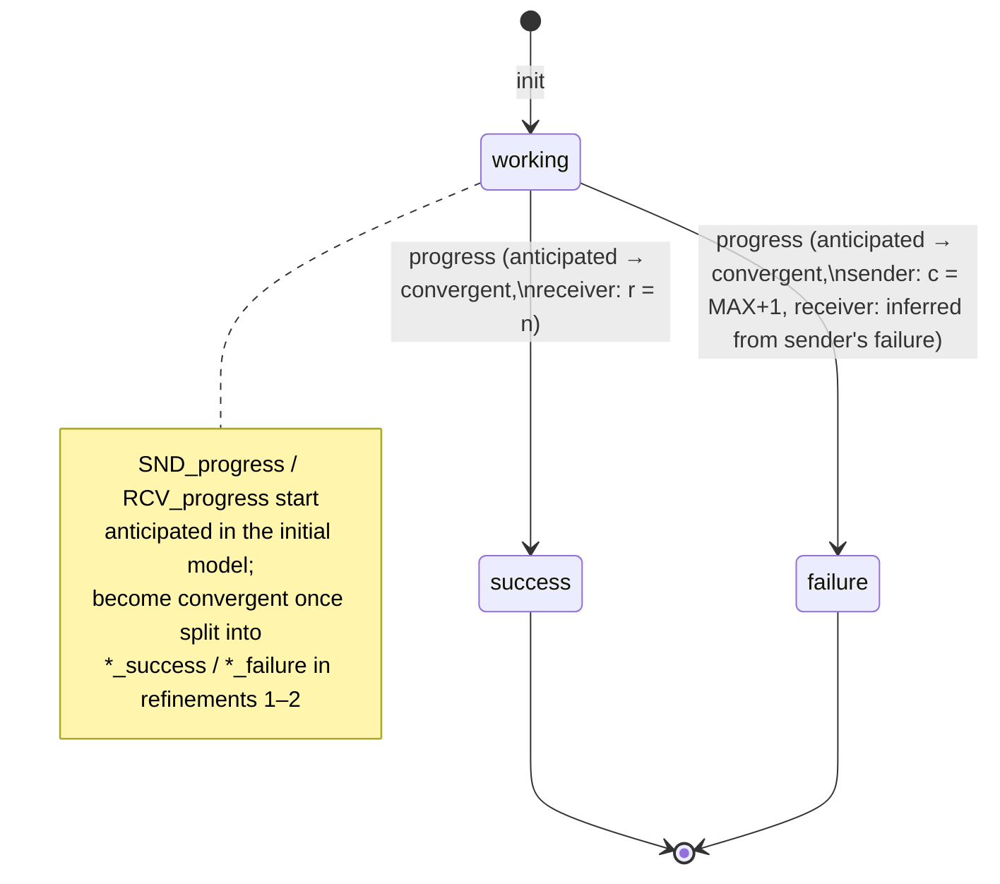

# Case Study: Communication Protocols

[[book-guidelines|↩ Back to guidelines]]

## Why protocols, and why here

A communication protocol is a strange kind of program to specify: it isn't one program, it's two — a sender and a receiver — running on different machines, unable to see each other's memory, coordinating only by exchanging messages that can arrive, get lost, or (in the fault-tolerant case) be delayed indefinitely. There's no shared state to write an invariant over unless you build it. That's exactly why Abrial picks it as a case study for refinement: the "obvious" implementation (send, wait, ack, repeat) is not obviously *correct*, and pseudocode won't tell you it's correct — it will just tell you what it does.

The chapter's method is to refuse to write that pseudocode first. Instead: state what a correct execution looks like from the outside (the **initial model**), then refine toward the distributed implementation in stages, each stage discharging a specific batch of proof obligations that guarantee the stage doesn't break what the previous stage already established. Chapter 4 does this for a *reliable* two-phase handshake file transfer. Chapter 6 takes the same skeleton and asks: what if the channels can lose messages? The answer — the bounded retransmission protocol (BRP) — is not a new protocol bolted onto the old one; it's the old one's refinement chain extended with three more concerns (timers, retry bounds, alternating bits) that turn out to compose cleanly with everything already proved. Treat this article as one continuous refinement story in two acts, not two unrelated protocols.

Both case studies also serve a second purpose in the book: introducing vocabulary. Chapter 4 is where Event-B's relational algebra (domain/range restriction and subtraction, partial vs. total functions) and its first-order quantifier rules (`ALL_L`, `ALL_R`) get introduced, motivated by a use as concrete as "should I send the whole counter or just its parity bit?" Chapter 6 reuses all of that machinery essentially without comment, which is itself evidence that the abstractions from Chapter 4 pull their weight.

---

## Part I — The two-phase handshake file transfer protocol (Chapter 4)

### The requirements, stated as inviolable text, before any model

Abrial's requirements documents are short and are treated as load-bearing artifacts, not throwaway prose — every later invariant has to be traceable back to one of these tagged sentences:

- **FUN-1**: The protocol ensures the copy of a file from one site to another one.
- **FUN-2**: The file is supposed to be made of a sequence of items.
- **FUN-3**: The file is sent piece by piece between the two sites.

FUN-3 is the one that forces distribution — without it, "copy a file" is just `g := f`, a one-line assignment with no protocol at all. The entire refinement chain exists to get from that one-line assignment to something that respects FUN-3 while never violating FUN-1.

**[[Discrete-Transition-Systems#What breaks without this|What breaks without this]]:** if you skip the requirements-first step and start from the pseudocode of `send`/`receive` events, you have no independent standard to check the pseudocode against — "does the protocol work?" degenerates into "does the protocol do what the pseudocode says," which is circular. The initial model is the independent standard.

### The initial model: a "magic copy" that cheats on purpose

The state is intentionally almost nothing:

- A carrier set $D$ (data items) — a *set*, deliberately left uninterpreted, so the whole development is generic over what's in the file.
- Constants $n$ (file length) and $f \in 1\,..\,n \rightarrow D$, a **total function** — this is the book's chosen encoding of "a finite sequence": index $\rightarrow$ item.
- A variable $g$, a **partial function** $1\,..\,n \nrightarrow D$, and a boolean $b$.

$$
\text{inv0\_1: } g \in 1\,..\,n \nrightarrow D \qquad
\text{inv0\_2: } b = \mathrm{FALSE} \Rightarrow g = \varnothing \qquad
\text{inv0\_3: } b = \mathrm{TRUE} \Rightarrow g = f
$$

There are exactly two events:

```
init                          final
  g := ∅                        when  b = FALSE
  b := FALSE                    then  g := f
                                       b := TRUE
                               end
```

`final` is not a step of any real protocol — it's a *snapshot* the model claims is observable at the end. Nothing about this model says the copy happens in one atomic action on real hardware; it says only: *whatever the real protocol does, when it's done, `g = f` must hold and the model must be able to witness that.* This is the entire point of an initial model in Event-B: pin down the observable postcondition abstractly, generically, before committing to any mechanism.

The proofs at this level are almost all `INV` (invariant preservation) discharged by an informal `SET` rule — e.g., proving $f \in 1\,..\,n \nrightarrow D$ (partial) from $f \in 1\,..\,n \rightarrow D$ (total) is just "a total function is a partial function," formalized loosely because the book hasn't yet built out a full theory of sets. This matters for calibration: even in a book this rigorous, not every low-level set fact gets a named inference rule — some are discharged by appeal to a black-box `SET` justification, the way a real prover might dispatch a decidable arithmetic goal to an automatic tactic rather than hand-deriving it.

### First refinement: splitting the transfer into pieces (the receiver still cheats)

Now FUN-3 gets teeth. A new event `receive` appears, and it's given **status `convergent`** — meaning: it must not be allowed to fire forever, because if it could, `final` might never become enabled and the protocol would live-lock.

```
receive
  status convergent
  when   r ≤ n
  then   h := h ∪ {r ↦ f(r)}
         r := r + 1
  end
```

Here `h` is a new variable replacing `g`, and `r` is a progress index with invariant $r \in 1\,..\,n+1$, related to `h` by $h = (1\,..\,r-1) \lhd f$. This is the first real use of Event-B's relational-algebra vocabulary, introduced precisely because it's needed here:

| Operator | Name | Meaning |
|---|---|---|
| $s \lhd r$ | domain restriction | pairs of $r$ whose first component is in $s$ |
| $s \mathbin{\lhd\!-} r$ | domain subtraction | pairs of $r$ whose first component is *not* in $s$ |
| $r \rhd t$ | range restriction | pairs of $r$ whose second component is in $t$ |
| $r \mathbin{\rhd\!-} t$ | range subtraction | pairs of $r$ whose second component is *not* in $t$ |

$(1\,..\,r-1) \lhd f$ is "the prefix of $f$ up to index $r-1$" — exactly the growing file the receiver has assembled so far. Note the deliberate cheat: `receive`'s action reads $f(r)$ directly, as if the receiver had the sender's memory in hand. That's intentional and named explicitly in the text — "we simplify our task by allowing separate participants to 'cheat' by looking directly into other participants' private memories." The cheat gets removed in the *next* refinement, not this one. Splitting "what does the protocol accomplish, piece by piece" from "how do two physically separate agents accomplish it" into two separate refinement steps is the load-bearing modeling move of this whole chapter — collapsing them would force you to prove distributed-communication correctness and piecewise-progress correctness simultaneously.

Because `receive` is convergent, it comes with a **variant proof obligation**: exhibit a natural-number expression, prove `NAT` (it's always a natural number under the event's guard) and `VAR` (the event strictly decreases it). Abrial's variant is the obvious one:

$$
\text{variant1: } n + 1 - r
$$

`receive`'s guard $r \le n$ guarantees the variant is a natural number, and the action $r := r+1$ strictly decreases it. This is important beyond bookkeeping: **the variant proof is what makes the initial model's postcondition reachable at all** — it shows `receive` can't spin forever and starve `final`. A separate `DLF` (deadlock-freedom) proof then shows the disjunction of `receive`'s and `final`'s guards is always true — the system is always either mid-transfer or done, never stuck.

**What breaks without convergence:** without the `VAR` obligation, nothing stops a refinement from introducing a new event that fires infinitely often instead of the one atomic step it's supposed to be splitting into pieces — you'd have "refined" the model into something that never reaches the behavior it claims to refine.

### Second refinement: real channels, no more cheating

Now the receiver loses its illegal read access. The state gains a sender counter $s$, a receiver counter $r$, a data item $d$, with the crucial coupling invariant

$$
\text{inv2\_2: } s \in r\,..\,r+1
$$

— the sender is never more than one step ahead of the receiver's last acknowledgment. The protocol becomes a genuine two-channel handshake:

```mermaid
sequenceDiagram
    participant Sender
    participant DataCh as Data channel
    participant AckCh as Ack channel
    participant Receiver

    Note over Sender,Receiver: invariant: s ∈ {r, r+1}
    Sender->>DataCh: send (s, d = f(s)); s := s+1
    DataCh->>Receiver: receive (s, d)
    alt s ≠ r  (new item)
        Receiver->>Receiver: h := h ∪ {r ↦ d}; r := r+1
        Receiver->>AckCh: send r
        AckCh->>Sender: receive r
        Note over Sender: if r = s, proceed to next item
    end
```

The `send` event now carries **status convergent** as well (it must not out-pace the receiver forever without the receiver catching up), and `receive`/`final` are re-proved as genuine refinements of their first-refinement counterparts. Abrial leaves these proofs as an exercise, but flags the proof obligations by name — `INV` for `init`, `SIM`-style simulation for `receive`/`final`, a fresh `VAR` for `send`'s convergence, and `DLF` again. This is the point in the development where the model has become a faithful *specification* of the real two-phase handshake: a data channel carrying $(s, d)$, an acknowledgment channel carrying $r$, and the $s \in r\,..\,r+1$ invariant as the thing that makes "wait for the ack before sending the next item" provably safe rather than just intuitively safe.

### Third refinement: replace the counters with a single parity bit

This is the chapter's cleanest payoff, and its motivation is entirely mechanical, not hand-wavy: look at how $s$ and $r$ are actually *used*. They're compared only for equality ($s = r$ or $s = r+1$), incremented only by one, and the invariant bounds their difference to at most 1. None of that requires transmitting the full counter value — the *parity* of the counter carries exactly the information the equality tests need.

$$
\text{axm3\_2: } \mathrm{parity}(0) = 0 \qquad
\text{axm3\_3: } \forall x \cdot x \in \mathbb{N} \Rightarrow \mathrm{parity}(x+1) = 1 - \mathrm{parity}(x)
$$

The soundness of the optimization is a genuine **theorem**, not an assumption:

$$
\text{thm3\_1: } \forall x, y \cdot x \in \mathbb{N} \land y \in \mathbb{N} \land x \in y\,..\,y+1 \land \mathrm{parity}(x) = \mathrm{parity}(y) \Rightarrow x = y
$$

In words: if two naturals differ by at most 1, their parities agree *only* when the naturals are equal. Given inv2_2 ($s \in r\,..\,r+1$), this is exactly the fact needed to justify replacing every $s = r$ / $s = r+1$ test with a comparison of parity bits $p = \mathrm{parity}(s)$, $q = \mathrm{parity}(r)$ — the invariant is what shrinks the "difference at most 1" precondition down to something the theorem can bite on. Proving thm3_1 is where the book introduces its two quantifier rules:

$$
\dfrac{H,\ \forall x \cdot P(x),\ P(E) \vdash Q}{H,\ \forall x \cdot P(x) \vdash Q} \; \text{ALL\_L} \qquad\qquad
\dfrac{H \vdash P(x)}{H \vdash \forall x \cdot P(x)} \; \text{ALL\_R} \; (x \text{ not free in } H)
$$

`ALL_L` lets you instantiate a universally-quantified hypothesis at any expression $E$ you like — cheap, always sound. `ALL_R` is the harder direction: you may only conclude $\forall x \cdot P(x)$ by proving $P(x)$ for an *arbitrary, unconstrained* $x$ — arbitrary meaning $x$ must not already appear free in the surrounding hypotheses, or you'd secretly be proving a specific instance and mislabeling it universal. That side condition is the standard "eigenvariable"/freshness condition that shows up everywhere generalization does — the same discipline that keeps a universally-quantified type variable from silently unifying with something already fixed in context.

**What breaks without the invariant:** the parity optimization is *only* sound because inv2_2 bounds $|s - r| \le 1$. If the protocol allowed the sender to run arbitrarily far ahead, two different counter values could share a parity while genuinely differing, and the receiver would misinterpret a stale re-send as a new item (exactly the ambiguity BRP's alternating bit exists to resolve on unreliable channels — see Part II). Parity-as-optimization here is a **data refinement**: it replaces a concrete representation ($s, r \in \mathbb{N}$) with an abstracted one ($p, q \in \{0,1\}$) that is *observationally indistinguishable* for every operation the protocol actually performs, precisely because the invariant restricts the input domain on which the two representations could disagree. This is worth sitting with if you're building an abstract-interpretation kernel: it's a textbook instance of choosing an abstraction map ($\alpha(x) = \mathrm{parity}(x)$) that is *not* injective in general but *is* injective on the reachable state space cut out by the invariant — soundness of the abstraction is local to the invariant, not global over all of $\mathbb{N}$. A Galois connection between $(\mathbb{N}, \le)$ and $(\{0,1\}, =)$ would be unsound for arbitrary pairs; it's sound here only because the concretization is constrained by inv2_2 to a two-element neighborhood.

### Section 4.7: doing it over, with `receive` anticipated from the start

Here the book turns self-critical. Look back at what actually happened across the first three sections: the initial model used variable $g$; the first refinement had to introduce a *different* variable $h$ (because `receive` needed to modify something, and every new event introduced in a refinement must refine `skip` on the variables it doesn't touch — but `receive` *does* touch the file variable, so it couldn't share $g$ without violating that rule). To glue $h$ back to $g$, the development needed the auxiliary boolean $b$ and two gluing invariants (inv0_2, inv0_3). All of that plumbing was pure infrastructure, forced by a technicality — not something intrinsic to the protocol.

The fix is the chapter's other named concept: an **anticipated event**.

> If a new anticipated event is introduced in a refinement, it does not need to decrease a variant; it will do that only when it becomes convergent in a further refinement. However, an anticipated event must not increment the current variant (if any).

Concretely: put `receive` into the *initial* model itself, marked `status anticipated`, non-deterministically scrambling $g$:

```
receive
  status anticipated
  when   g = f          (unreachable at this stage — no variant to violate)
  then   g :∈ ℕ ↔ D
  end
```

Then, in the first refinement, `receive` is promoted to `status convergent` with its real action and its variant $n+1-r$ — at that point, and only that point, does `VAR` need to be discharged. Because `receive` was present (if inert) from the start, there was never a moment where the file variable needed a second name — $g$ persists across every refinement, no $h$, no $b$. This reworked development (§4.7.2–4.7.5) reproduces the same four models with visibly less bookkeeping.

**The proof-obligation asymmetry, stated precisely** (this is Chapter 5's `NAT`/`VAR` rule, but it's introduced here as a payoff, so it's worth stating now): for a numeric variant $n(v)$,

- an **anticipated** event only has to satisfy $n(v') \le n(v)$ — it must not make things worse;
- a **convergent** event must satisfy the strict $n(v') < n(v)$ — it must make things provably closer to done.

An anticipated event is, formally, a *placeholder with a non-regression guarantee but no progress obligation yet* — a slot reserved in the model's proof structure for behavior whose full justification is deferred to a later refinement, while the model still commits, right now, to that behavior never undermining termination once a variant does exist. This is the single most reusable idea in this case study, and Chapter 6 leans on it immediately.

---

## Part II — The bounded retransmission protocol (Chapter 6): the same skeleton, fault-tolerant

### From reliable to unreliable channels: what actually changes

Chapter 6 opens by keeping Chapter 4's normal-behavior loop intact — `SND_snd → RCV_rcv → RCV_snd → SND_rcv`, data channel one way, acknowledgment channel the other — and then adding exactly three new failure-handling mechanisms on top, each motivated by a specific way the reliable-channel assumption can fail:

1. **Timers.** The sender starts a timer, $dl$, on every send; if it wakes with no ack received, a message (data *or* ack — the sender can't tell which) was lost, so it re-sends the *same* item. This is why the protocol is called a re-*transmission* protocol.
2. **A retry bound.** Successive losses increment a retry counter; hitting a fixed limit $M$ makes the sender give up — abort — because retrying forever isn't acceptable behavior either.
3. **A receiver-side timer for indirect synchronization.** The receiver can't be *told* the sender aborted (the channel that would carry that message is the one that's broken). Instead, the receiver runs its own timer, set to at least $(M+1) \times dl$ — long enough that if it fires, the sender *must* already have exhausted its own retries and aborted. This is a beautiful piece of protocol design entirely by inference: the receiver doesn't observe the sender's abortion, it *derives* it from a timing bound.
4. **The alternating bit.** A re-sent item is indistinguishable from a coincidentally-identical new item unless something external marks it. Each data item now carries a bit that flips on each new item, so the receiver can tell "same bit as last time" (retransmission — discard, re-acknowledge) from "different bit" (new item — accept).

Given these mechanisms, the protocol's outcome space has exactly **three** reachable final situations, and the book flags a fourth as *provably impossible*, which is a genuine correctness claim worth proving rather than assuming:

(i) both sites succeed; (ii) the sender aborts but the receiver actually succeeded (the last ack was lost, but the last data got through); (iii) both sites abort. The impossible fourth case — receiver aborts while sender does not — cannot happen because of the timing invariant above: the receiver's timer can only fire after the sender has certainly already aborted.

### The requirements document: now with beliefs, not just outcomes

This is the chapter's most interesting shift in vocabulary. Because the protocol can genuinely fail to deliver the file, "correctness" can no longer mean "the file always arrives." It has to be phrased in terms of what each site is entitled to *believe*, and which of those beliefs are guaranteed *true*:

- **FUN-1–3**: the protocol's goal is a total or partial transfer; total = exact copy; partial = a prefix of the original.
- **FUN-4**: each site ends up either believing "terminated successfully" or believing "aborted."
- **FUN-5**: sender-believes-success $\Rightarrow$ receiver-believes-success; and (contrapositive-flavored but stated as its own clause) receiver-believes-abort $\Rightarrow$ sender-believes-abort.
- **FUN-6**: the asymmetric case is allowed — sender may believe abort while the receiver believes success (case (ii) above).
- **FUN-7/8**: the receiver's belief is always *true* — when it believes success, the file really is fully copied; when it believes abort, the file really is *not* fully copied.

Notice what's *not* required: the sender's belief is never asserted to be true. That's structurally forced — the sender can never be sure the last ack wasn't just lost, only that its own retry budget ran out. The requirements document is honest about that asymmetry instead of specifying something unimplementable.

### Initial model: `STATUS` and two anticipated events, straight from Chapter 4 §7

The BRP's initial model is deliberately thin, dealing only with FUN-4. It introduces a carrier set explicitly enumerated (not left abstract, since the point here *is* the enumeration):

$$
STATUS = \{working, success, failure\}
$$

with variables $s\_st, r\_st \in STATUS$ and one observer event:

```
brp
  when  s_st = working
        r_st = working
  then  skip
  end
```

This is a direct echo of Chapter 4's `final`: a pure observer event, no mechanism of its own, just a snapshot claiming "both sites have left `working`" is reachable. The two mechanisms that actually move $s\_st$ and $r\_st$ out of `working` are declared immediately after — and, in the direct reuse of §4.7's technique, **as anticipated events from the very first model**:

```
SND_progress                          RCV_progress
  status anticipated                    status anticipated
  when   s_st = working                 when   r_st = working
  then   s_st :∈ {success, failure}     then   r_st :∈ {success, failure}
  end                                    end
```

The book is explicit that this is the same technique, cited by name back to Chapter 4 §7: reserve the eventual state-transition as a non-deterministic placeholder now, obligated only not to regress a not-yet-existing variant, and defer the actual mechanism (and its convergence proof) to later refinements. This is a strong signal that "anticipated event" is not a one-off trick specific to file transfer — it's Abrial's general answer to "how do I introduce a piece of eventual behavior before I'm ready to commit to *how* it happens."

### First and second refinements: splitting progress into success/failure, and "cheating" on purpose again

`SND_progress` splits into `SND_success` / `SND_failure`; `RCV_progress` splits into `RCV_success` / `RCV_failure`. FUN-5's asymmetric implication gets encoded as:

$$
\text{inv1\_1: } s\_st = success \Rightarrow r\_st = success
$$

— note carefully that this is an implication, not a biconditional, which is precisely what leaves room for FUN-6's asymmetric case. The refinement proves this invariant is preserved by making `SND_success` and `RCV_failure` explicitly reference the *other* participant's status in their guards:

```
SND_success                    RCV_failure
  refines SND_progress           refines RCV_progress
  status convergent              status convergent
  when   s_st = working          when   r_st = working
         r_st = success                 s_st = failure
  then   s_st := success         then   r_st := failure
  end                            end
```

The book flags this as "cheating" — same word, same move as Chapter 4's first refinement letting the receiver peek at the sender's file — and legitimizes it the same way: with a convergence proof. The variants are **set-valued**, not numeric, which is the book's other flavor of `VAR` obligation:

$$
\text{variant1: } \{success, failure\} \setminus \{s\_st\} \qquad
\text{variant2: } \{success, failure\} \setminus \{r\_st\}
$$

For a set variant $t(v)$, the `VAR` obligation for a convergent event is strict subset shrinkage, $t(v') \subset t(v)$: before `SND_success` fires, $s\_st = working$, so $\{success,failure\}\setminus\{s\_st\} = \{success,failure\}$ (2 elements); after, $s\_st = success$, so the set shrinks to $\{failure\}$ (1 element) — strictly smaller, done, never fireable again on that branch. This is a clean example of using set cardinality as an ad hoc well-founded order when there's no natural "counts down" quantity in sight — a technique directly transferable to any termination argument over a small finite status lattice, which is exactly the shape of many verification-condition solvers' internal state machines (a proof obligation moves monotonically through `open → discharged` / `open → refuted`, never backward).

### Third refinement: the file finally enters, and the receiver still cheats

Only now does the actual file show up — FUN-1–3 and FUN-7/8. Context gains $D$, $n$, $f \in 1\,..\,n \rightarrow D$ exactly as in Chapter 4. State gains $r \in 0\,..\,n$ and $g$, with:

$$
\text{inv3\_2: } g = 1\,..\,r \lhd f \qquad
\text{inv3\_3: } r\_st = success \Leftrightarrow r = n
$$

inv3_3 is doing real work: it's the formal cash-out of FUN-7 — "receiver believes success" is now *defined* to coincide with "the prefix received has length $n$," i.e. the whole file, so the belief can never be true and wrong by construction, not merely by informal argument. `RCV_rcv_current_data` and `RCV_success` still cheat (they compare against $n$ and read $f$ directly, sender-side information), with variant $n - r$ for the ongoing convergence proof. This cheat is scheduled for removal in the very next refinement — the same two-step "introduce the abstraction cheating, then remove the cheat" pattern from Chapter 4, run twice now instead of once.

### Fourth refinement: the sender arrives, real channels, no more direct file access

The sender enters with pointer $s \in 0\,..\,n-1$, activation bit $w$, and data container $d$, coupled to the receiver's progress by

$$
\text{inv4\_2: } r \in s\,..\,s+1
$$

— structurally the *exact same* shape as Chapter 4's inv2_2 ($s \in r\,..\,r+1$), just with roles renamed. This is the clearest textual evidence that BRP genuinely is Chapter 4's protocol wearing a fault-tolerance layer: strip the timers, the retry counter, and the alternating bit back out, and what's left is isomorphic to the reliable handshake's second refinement. `SND_snd_data`, `RCV_rcv_current_data` / `RCV_success`, and `SND_rcv_current_ack` / `SND_success` implement the message exchange with $w$ as the "is a send currently in flight" flag — but there's still no unreliability yet; that's the next step, deliberately kept separate.

### Fifth refinement: unreliability, daemons, and the retry bound — the payoff refinement

This is where BRP actually earns its name. Three new activation bits — $db$ (data channel), $ab$ (ack channel), $v$ (receiver-side ack-pending) — join $w$, with mutual-exclusion invariants (inv5_1–inv5_6) ensuring at most one is set at a time, matching the physical picture of "a message is in flight on at most one channel slot." A last-item indicator $l$ replaces the earlier cheating comparisons against $n$:

$$
\text{inv5_7: } db = \mathrm{TRUE} \land r = s \land l = \mathrm{FALSE} \Rightarrow r+1 < n \qquad
\text{inv5_8: } db = \mathrm{TRUE} \land r = s \land l = \mathrm{TRUE} \Rightarrow r+1 = n
$$

— this is exactly the same "cheat, then justify removing the cheat via an invariant" move as inv3_11/inv3_12 do for the acknowledgment side just below it. The retry mechanism proper:

$$
\text{axm3\_1: } MAX \in \mathbb{N} \qquad
\text{inv3\_9: } c \in 0\,..\,MAX+1 \qquad
\text{inv3\_10: } c = MAX+1 \Leftrightarrow s\_st = failure
$$

Message loss itself is modeled by two **daemon events** — events with no useful action beyond clobbering an activation bit back to `FALSE`, representing an adversarial environment nondeterministically dropping messages:

```
DMN_data_channel                DMN_ack_channel
  when  db = TRUE                 when  ab = TRUE
  then  db := FALSE                then  ab := FALSE
  end                              end
```

This is worth pausing on: the book models "the channel might lose the message" not as a probability, not as a special error value, but as an ordinary nondeterministic Event-B event that any refinement has to remain correct *under*, no matter when the scheduler chooses to fire it. Anything the sender or receiver does has to tolerate the daemon firing at any point where its guard holds — which is precisely how one models an adversary in a reachability/counterexample-search setting: as an extra transition relation the safety proof has to be closed under, not as a special case bolted onto the happy path. `SND_time_out_current` / `SND_failure` and `RCV_failure` complete the picture: retry while $c < MAX$, fail exactly at $c = MAX$, and the receiver fails only once inv3_10 already certifies the sender has failed — the same indirect-inference structure the informal presentation promised in §6.1.3, now made a provable consequence of the invariant rather than an argument in prose.

**What breaks without the mutual-exclusion invariants:** without inv5_1–inv5_6 pinning "at most one channel bit active," nothing would stop the model from representing physically impossible states — data and ack both in flight from the same "turn," or a daemon dropping a message that was never sent — and any safety proof built on top would be proving something about a model with more reachable states than the real system, which is the formal-methods equivalent of a false positive: a spurious counterexample generated from an over-permissive abstraction.

### Sixth refinement: parity, again — left as an exercise, but the theorem already exists

The final refinement mirrors Chapter 4 §4.6 almost exactly: transmit $\mathrm{parity}(s)$ and $\mathrm{parity}(r)$ instead of the full pointers. The book explicitly delegates the proof to the reader with "the technique to be used is the one used in Section 6 of this chapter [4]" — i.e., thm3_1 is directly reusable, because the coupling invariant justifying it (inv4_2: $r \in s\,..\,s+1$) has exactly the same "differ by at most 1" shape as inv2_2 did in Chapter 4. This is the strongest piece of evidence in the whole case study that the two protocols really are one refinement lineage: the *same soundness theorem*, unmodified, discharges the *same optimization*, in a completely different chapter, because the invariant it depends on was re-derived (not re-invented) in the fault-tolerant setting.

### The synchronization structure, end to end



---

## Synthesis: what this case study is really teaching

### Anticipated events as staged obligation discharge

The mechanism worth carrying forward is not "file transfer protocols" — it's the anticipated/convergent status split itself, and it generalizes past protocols entirely. An anticipated event is a model of **deferred commitment under a non-regression guarantee**: you introduce a placeholder for behavior you know must eventually happen, you constrain it just enough that it can't undermine a termination argument that doesn't exist yet, and you discharge the actual progress obligation only once a later refinement gives you enough structure to state it precisely.

If you're building a system that does incremental/staged constraint refinement — narrowing an abstract domain, tightening a refinement type, resolving a metavariable through successive elaboration passes — this is a directly transferable discipline, not just an analogy:

- **Anticipated $\approx$ a constraint or metavariable placeholder admitted into the store before its solving strategy is fixed** — you commit to *some* future resolution existing, and you can enforce monotonicity (the placeholder's possible instantiations only shrink, never grow, as more constraints accumulate — the "must not increase the variant" half), without yet being able to prove convergence (a specific unification or solving procedure terminates on it).
- **Convergent $\approx$ the point where you've committed to a concrete solving procedure and can now prove it terminates** — e.g., once pattern-unification's Miller-pattern restriction applies to a metavariable, you can point to a decreasing measure (occurs check depth, or spine length) the way `receive` points to $n+1-r$.
- The **status upgrade happening at a specific refinement, not at the object's introduction**, mirrors exactly how a CEGAR loop or an abstract-interpretation widening operator often introduces a *placeholder* abstract value early (a widened interval, an unresolved Horn-clause template) that is provably sound (doesn't regress the invariant lattice) well before the refinement loop is provably guaranteed to terminate on it. The non-regression / eventual-progress split is the same two-phase commitment structure.

### Parity optimization as data refinement / abstraction soundness

Both parity refinements (Chapter 4 §4.6, Chapter 6 §6.9) are worked examples of a **sound abstraction that is not injective in general but is injective on the reachable state space**, with the coupling invariant ($s \in r\,..\,r+1$, later $r \in s\,..\,s+1$) doing all the work of shrinking "reachable" down to a neighborhood where $\alpha = \mathrm{parity}$ happens to be distinguishing. This is precisely the shape of a Galois-connection-style abstraction map you'd design for an abstract-interpretation domain: the abstraction is chosen for the *operations actually performed* (equality tests, unit increments) rather than for generic fidelity, and its soundness proof is *local* — it cites a specific invariant, not a global property of $\mathbb{N}$. If your CSP/abstract-interpretation kernel ever needs to justify replacing a wide integer domain with a small finite abstraction (parity, sign, a bounded interval) for a specific analysis, thm3_1's proof pattern — state the theorem, cite the coupling invariant that makes the concrete pre-image small enough to be recoverable, discharge with the quantifier rules — is the right template to imitate.

### What this depends on, and what depends on it

This case study leans entirely on Chapter 2's sequent calculus (`INV`, `SET`, `AND_L/R`, `ARI`) and previews Chapter 5's systematic statement of the `NAT`/`FIN`/`VAR` rules for anticipated vs. convergent variants — reading this chapter *before* Chapter 5's formal rule tables (as the book's own chapter order does) means you meet the rules operationally, worked out on a concrete protocol, before meeting them as an abstract schema. It also sets up the *next* case study directly: Chapter 7's concurrent-program development (Simpson's four-slot mechanism) reuses "split one variable's role across a refinement chain, cheat, then remove the cheat" as its default modeling reflex, and Chapter 14's "[[Sequential-Program-Derivation|Sequential Program Derivation]]" returns to anticipated/convergent status explicitly as a general derivation technique for while-loops, generalizing what was introduced here as a protocol-specific trick into the book's standard tool for deriving any terminating loop from a specification.

---

*Pages used: Chapter 4, "A simple file transfer protocol," pp. 149–175 (book PDF pp. 177–203); Chapter 6, "Bounded re-transmission protocol," pp. 204–226 (book PDF pp. 232–254).*
