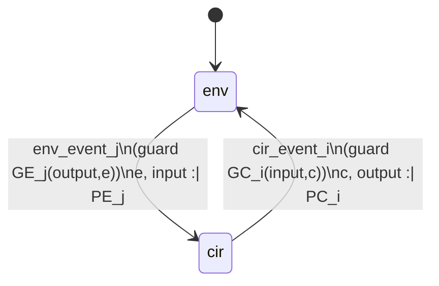
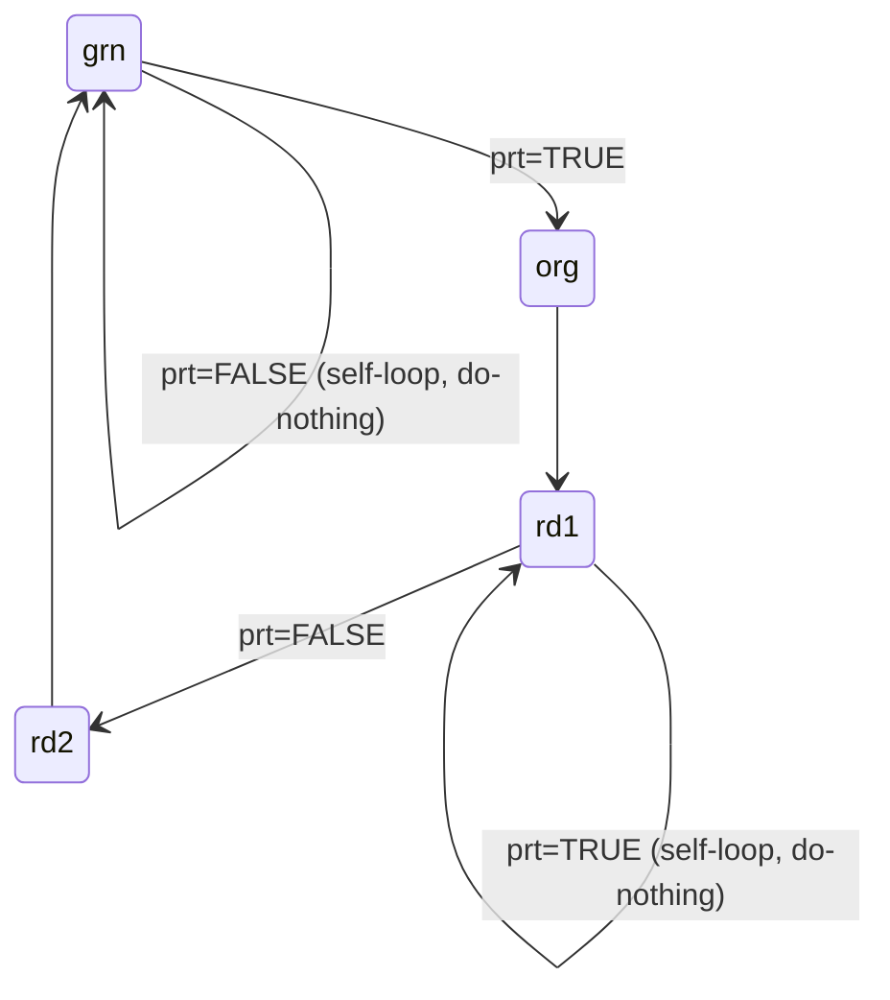

[[book-guidelines|↩ Back to guidelines]]

## Two case studies, one method

Chapters 7 and 8 look, on the surface, like a detour — a lock-free shared-memory protocol, then three toy hardware circuits — sandwiched between the book's distributed-protocol case studies. But they're doing the same methodological work as everything before them, applied to a harder problem: **systems whose components can interleave or race in ways that make "just check all the cases" mathematically infeasible.** Chapter 7 proves this infeasibility outright (a counting argument that overflows 32-bit integers almost immediately), then shows how to specify and refine a concurrent program correctly *without ever enumerating an interleaving*. Chapter 8 takes the same insight to synchronous hardware: instead of case-splitting on every combination of guard conditions by hand, it builds a small, reusable operator ($bool$) and a discharge-once proof obligation that lets you merge deterministic branches mechanically. Both chapters are worked answers to the same question: **what do you do when the state space of interest is defined by *interaction* rather than by a single sequential program?**

This is the chapter to read closely if you're building a CSP/abstract-interpretation kernel that reasons about concurrent or reactive systems, because Abrial's answer — replace enumeration with an *invariant relating traces* — is precisely the move that separates a model checker that explodes on real programs from one that scales via inductive invariants.

---

## Part I — Simpson's four-slot mechanism (Chapter 7)

### Distributed vs. concurrent: why atomicity is the crux

Chapter 7 opens by pinning down a distinction the rest of the book has left implicit. A **distributed program** has independent agents on independent machines that *cooperate* toward a shared goal via explicit, well-defined communication — nothing forces them to interleave at any particular granularity because there's no shared memory to race on. A **concurrent program** has agents *competing* for a shared resource on the *same* machine, and — critically — the hardware itself decides where one agent's execution can be interrupted by another's. That interruption granularity is called **atomicity**: the instructions of each sequential program are treated as indivisible; interleaving can only happen *between* instructions, never inside one.

This is the same distinction Rust's ownership system exists to make static: a `Mutex<T>` or channel-based `mpsc` design is the distributed style (communicate, don't share); raw `AtomicUsize`/`AtomicBool` manipulation under `Ordering` constraints is the concurrent style Chapter 7 is actually modeling — you own no exclusive lock, you're relying on carefully chosen atomic reads/writes to avoid torn or stale data.

### The mechanism: two writer slots, two reader slots, no locks

H.R. Simpson's **Four-slot Fully Asynchronous Mechanism** lets one writer and one reader exchange data through shared memory with *no blocking whatsoever* — the writer never waits for the reader and vice versa. The shared state:

$$data \in \{0,1\} \to (\{0,1\} \to D) \qquad reading \in \{0,1\} \qquad latest \in \{0,1\} \qquad slot \in \{0,1\} \to \{0,1\}$$

Think of `data` as a $2\times 2$ grid of slots: a *pair* dimension (which "generation" of data) and a *slot* dimension (which of two double-buffered cells within that generation). `reading` says which pair the reader is using; the writer always uses the other pair, $1-reading$. `latest` records which pair the writer *finished* most recently, and `slot(p)` records which of the two cells within pair $p$ was written last.

The writer's pidgin program (parameter $x$, the value to publish):

```
Writer(x)
  pair_w := 1 − reading            // pick the pair the reader isn't using
  indx_w := 1 − slot(pair_w)       // pick the other slot in that pair
  data(pair_w)(indx_w) := x        // write
  slot(pair_w) := indx_w           // record where we wrote
  latest := pair_w                 // publish this pair as the newest
```

The reader's pidgin program (result $y$):

```
Reader
  reading := latest                // adopt the newest published pair
  indx_r := slot(reading)          // find the last-written slot in it
  y := data(reading)(indx_r)       // read
```

This is essentially a lock-free, wait-free single-producer/single-consumer double-buffer — the kind of primitive you'd reach for in avionics or real-time control software, where a `Mutex` is unacceptable because a reader must never be able to block a writer (a stalled reader could otherwise stall the physical control loop). A Rust sketch of the same shape, using `AtomicU8`/`AtomicBool` for the coordination fields and plain (non-atomic, since accesses are already partitioned by the protocol) cells for `data`, would use exactly Simpson's five/three-instruction structure — and would be just as hard to argue correct by staring at the code, which is the entire point of the chapter.

**Non-concurrent animation** (§7.2.2) walks through a few writes and reads assuming *no* interleaving, and already reveals the mechanism's essential looseness: the reader always sees the *last* value written before it started reading, it can read the same value twice, and it can miss values entirely if it doesn't poll often enough. None of that is a bug — it's the specification. The real question the chapter has to answer is what happens once interleaving is allowed.

**Atomicity condition** (§7.2.3): the one hardware guarantee assumed is that the writer and reader are never simultaneously touching the *same physical slot*:

$$pair\_w = reading \Rightarrow indx\_w \neq indx\_r$$

This is the *entire* hardware contract Simpson's algorithm needs — everything else about correctness has to be derived from it, purely by reasoning about the trace of writes and reads.

### What breaks without a combinatorial-explosion argument: why you can't just enumerate

Before specifying anything, §7.3 asks the obvious operational question: could you just verify correctness by exhaustively checking every possible interleaving of the Writer's five instructions and the Reader's three? The chapter answers with a clean piece of combinatorics. Let $U(m,n)$ be the number of ways to interleave two sequential programs of $m$ and $n$ instructions respectively:

$$U(m,0) = U(0,n) = 1 \qquad U(m,n) = U(m-1,n) + U(m,n-1) \quad (m,n>0)$$

— the same recurrence as binomial coefficients / lattice paths, computed via a $O(mn)$ dynamic-programming table (the book gives a literal C implementation). Plugging in the actual instruction counts (writer = 5, reader = 3) and scaling to $i$ concurrent rounds each:

```
U(0,0)    = 1
U(5,3)    = 56
U(10,6)   = 8,008
U(15,9)   = 1,307,504
U(20,12)  = 225,792,840
U(25,15)  = OVERFLOW   (exceeds INT_MAX = 2,147,483,647)
```

Five writes and five reads is already enough to overflow a 32-bit counter of interleavings — and that's just *counting* them, before you've even begun checking each one against a correctness property. Abrial's conclusion is blunt: **"it is clearly out of the question to reason on concurrent programs by checking all possible cases on a significant number of successive executions."**

This is the load-bearing paragraph of the chapter for the standing project. It's a concrete, worked instance of why a CSP/abstract-interpretation kernel that tries to prove program properties by *enumerating interleavings or execution traces* is doomed the moment the program isn't trivial — the state space (or here, the trace space) grows combinatorially in the number of atomic steps, not linearly. This is exactly the argument for why reachability analysis needs **inductive invariants and abstract domains that summarize unboundedly many concrete traces**, rather than symbolic-execution-style path enumeration: an invariant proved once, by induction over a single step, covers every interleaving simultaneously, at $O(1)$ proof cost per event regardless of how many rounds the writer and reader eventually run. If your CSP kernel is going to handle automata-like abstract domains for concurrent components, Chapter 7's $U(m,n)$ blowup is the reason a "generate-and-check every interleaving" backend is a non-starter and a fixpoint/invariant-based backend (Galois-connection-flavored abstraction over the *set* of reachable trace-relationships, not the set of traces) is not optional — it's the only thing that scales.

### Specifying without interleaving: writing and reading traces

Section 7.4 replaces "reason about interleavings" with an entirely different move: **define correctness as a relationship between two traces**, without ever mentioning how the writer and reader's instructions might interleave. This is the specification-first alternative to enumeration promised above.

Two growing sequences record everything written and everything read so far:

$$w \in \mathbb{N}_1 \qquad r \in \mathbb{N}_1 \qquad wt \in 1..w \to D \qquad rd \in 1..r \to D$$

A total function $f \in 1..r \to 1..w$ says, for each reading, which writing produced it: $rd = f\,;\,wt$ (inv0_6) — the reading trace is exactly the writing trace indexed through $f$. This alone doesn't say enough: a Reader that always echoes back $wt(1)$ trivially satisfies it. A second function $g \in 1..r \to 1..w$ (inv0_7) tags, for each reading index $i$, *the last writing-trace position that existed just before that reading finished* — a bookkeeping device with no runtime counterpart, purely there to constrain $f$. Two invariants pin the reader's behavior down to "reads something written no earlier than the last thing written just before it started, and makes progress across successive reads":

$$inv0\_8:\; \forall i \in 1..r \cdot f(i) \le g(i) \qquad\qquad inv0\_9:\; \forall i \in 1..r{-}1 \cdot g(i) \le f(i+1)$$

Together these give $f(i{+}1) \in g(i)..g(i{+}1)$: whatever gets read at step $i{+}1$ must lie between what was already known-written before reading $i$ and what's known-written before reading $i{+}1$ — the reader can lag, repeat, or skip, but it can never read something written *after* it started reading, nor something older than what it already knew about at the previous read. This precisely formalizes the loose "last written value" behavior the non-concurrent animation demonstrated informally.

The initial events are then almost embarrassingly simple compared to the combinatorics they replace:

```
write                          read
  any d where                    any v where
    d ∈ D                          v ∈ g(r) .. w
  then                          then
    w := w + 1                    r := r + 1
    wt(w+1) := d                  f(r+1) := v
  end                            g(r+1) := w
                                 rd(r+1) := wt(v)
                               end
```

The guard $v \in g(r)..w$ on `read` is doing *all* the correctness work that would otherwise require case-splitting on interleavings: it says "the value about to be read must have been written no earlier than the last write known before the previous read, and no later than the current write pointer" — a single non-deterministic choice that legally captures every interleaving outcome at once, instead of enumerating them.

### Refinement strategy: from one-shot events to one event per atomic instruction

Section 7.5 states the endpoint explicitly: the final refinement must have exactly one event per instruction of the Writer(5 instructions) and Reader(3 instructions) pidgin programs, distinguished by address counters $adr\_w \in 1..5$ and $adr\_r \in 1..3$ — literally a program counter per agent, the standard way an operational semantics models interleaving concurrency. The four refinements get there incrementally:

1. **First refinement** (§7.6): introduce the address counters; split `write`/`read` into per-instruction dummy events plus one real event each. The key design decision — and the chapter is explicit that it required *thinking*, not just following a template — is *which* concrete instruction refines the abstract `read`/`write`. For the reader, it's `Reader_2` (`indx_r := slot(reading)`), not `Reader_3` (the actual load `y := data(reading)(indx_r)`) — because after `Reader_2` runs, the value that *will* be read is already pinned down (nothing subsequent can change what `data(reading)(indx_r)` denotes), so the moment of "reading," formally, is the moment that value becomes determined, not the moment it's physically fetched. This is a genuinely subtle point: it says the specification-level "instant of reading" is a *semantic* fact about when non-determinism resolves, which need not coincide with which line of code looks like the read.
2. **Second refinement** (§7.7): introduce Simpson's actual data structures (`reading`, `pair_w`, `latest`, `indx_r`, `indx_wp`, `slot`, and an index-valued `idata`); split the reader once more (`Reader_1/2/3`).
3. **Third refinement** (§7.8): remove the writing trace `wtp` entirely, replacing the index-into-history `idata` with a variable `Data` holding actual values directly — collapsing what had been "an index into the append-only log" into "the live shared array," which is what real hardware actually has.
4. **Fourth refinement** (§7.9): final polish — rename `Data`/`indx_wp` to the real `data`/`indx_w`, split the writer's first instruction, and state the atomicity condition from §7.2.3 as invariant `inv4_7`, now provable rather than assumed:

$$adr\_w = 3 \wedge adr\_r = 3 \wedge pair\_w = reading \implies indx\_r = indx\_wp$$

By this final step, the machine's events are byte-for-byte the five Writer and three Reader instructions from §7.2.1, and every invariant preserved along the way is a proof, discharged once per event, that holds regardless of how many times the scheduler interleaves the two programs. **This is the payoff of the trace-invariant method over enumeration**: correctness for *all* $U(5i, 3i)$ interleavings at round $i$, for every $i$, was established with a bounded number of proof obligations, not a blow-up in the number of cases.

---

## Part II — Synchronous electronic circuits (Chapter 8)

### The env/cir alternation: coupling a circuit to its environment

Chapter 8 develops a second, independent case study — but its structuring idea (make the interacting parties' *interface* the object of specification, rather than trying to verify a circuit "in isolation") rhymes with Chapter 7's traces. A **synchronous circuit** is a box with internal state $cir\_state$, boolean input/output lines, and a clock alternating low/high. Abrial abstracts the clock away entirely and instead models two alternating **observation modes**:

$$mode \in \{env, cir\}$$

— `env` mode: only the environment's state and the input line may change (circuit and output are idle); `cir` mode: only the circuit's state and output line may change (environment and input are idle). Crucially, **the circuit is never developed in isolation** — it's always specified together with its environment, because a circuit's correctness is meaningless without a description of what it's plugged into.



The dynamic view formalizes both sides as guarded events with exactly the shape you'd expect from Chapter 2's transition-system vocabulary:

```
cir_event_i                          env_event_j
  when                                 when
    mode = cir                           mode = env
    GC_i(input, c)                       GE_j(output, e)
  then                                 then
    mode := env                          mode := cir
    c, output :| PC_i(input,c,c',output')  e, input :| PE_j(output,e,e',input')
  end                                  end
```

with a hard access-control rule: the environment may read the output but never write circuit state $c$; the circuit may read the input but never write environment state $e$. This is a **module boundary enforced at the specification level**, not just by convention — the same discipline a Rust crate boundary enforces with `pub`/private fields, except here it's a proof obligation, not a compiler check.

Alongside the dynamics, a **static view** states conditions $C(e,input,c,output)$ and $D(e,input,c,output)$ describing the *permanent* relationship the two sides maintain: $mode=env \Rightarrow C$, $mode=cir \Rightarrow D$. The **consistency proof obligation** ties statics to dynamics: whenever $D$ holds and a circuit event's guard $GC_i$ fires, the resulting state must re-establish $C$; symmetrically for the environment re-establishing $D$. This is exactly the discipline of a Hoare-style protocol invariant maintained across a handshake — $C$ and $D$ play the role of pre/postconditions that the two parties are jointly obligated to preserve, one alternation at a time.

### Final construction conditions and the $bool$ operator

Section 8.1.7 lists the conditions a machine must satisfy before it counts as an actual circuit, not just an abstract specification of one: every circuit/input/output variable must be Boolean; the circuit must be deadlock-free; **internally deterministic** (each event's action is a function of the pre-state, no non-deterministic choice left); and **externally deterministic**, meaning circuit guards are pairwise mutually exclusive — $GC_i \Rightarrow \neg GC_j$ for $i \ne j$ — so at most one circuit event can ever fire at a time.

Once guards are mutually exclusive, all the circuit events can be collapsed into a *single* merged event, and this merge is where the chapter introduces its one genuinely novel piece of notation, the **$bool$ operator**, converting a predicate into a Boolean-valued expression:

$$E = bool(P) \iff (P \Rightarrow E = TRUE) \wedge (\neg P \Rightarrow E = FALSE)$$

If you've worked with Lean or any dependently-typed language with `Decidable`, this is exactly the shape of `Bool.decide`/`ite` reflection: `bool(P)` is a total function reifying a proposition into a two-valued classical witness, definitionally characterized by the same case split a `Decidable P → Bool` instance would produce (`if h : P then true else false`), with the biconditional in the definition playing the role of `decide_eq_true_iff`. The reason it earns its own operator here rather than being spelled out with an if-then-else each time is that a *merged* circuit event needs to compute one new value for `c`/`output` out of finitely many mutually-exclusive branches at once, and $bool$ is exactly the right shape to write "OR over disjoint guarded cases, each contributing its own value."

**The merge proof, worked concretely (§8.1.7–8.1.8):** given $n$ mutually exclusive circuit events, each with action $c := C_i(input,c)$, a single merged event can instead compute

$$c := bool\Big(\big(GC_1 \wedge C_1(input,c){=}TRUE\big) \vee \cdots \vee \big(GC_n \wedge C_n(input,c){=}TRUE\big)\Big)$$

Correctness reduces, via the definition of $bool$, to two implications, and *both* collapse to trivialities the moment you use guard mutual exclusion: under $GC_i$, none of the other disjuncts $GC_j \wedge \ldots$ ($j\ne i$) can hold, so the whole disjunction reduces exactly to $C_i(input,c)=TRUE$, which is what you needed to show either way. **Mutual exclusion of guards is precisely what licenses collapsing $n$ separate deterministic transitions into one big disjunctive assignment without introducing new non-determinism** — this is the same reasoning a constraint/domain-propagation engine needs whenever it partitions a domain into disjoint cases and wants to justify replacing a case-split computation with a single closed-form expression over indicator predicates: soundness of the merge is *exactly* guard-disjointness, checked once, not per pair of executions.

A four-line illustrative example (§8.1.8) shows the mechanics end to end: four environment events differing only by `(input_1, input_2)` combinations and their resulting `output`, merged via $bool$, reduce — after removing trivially-true/false disjuncts — to a plain OR-gate: `output := bool(input_1 = TRUE ∨ input_2 = TRUE)`. That "reduce after removing trivial disjuncts" step is exactly circuit minimization performed as propositional simplification on the merged guard expression.

### Worked example 1 — the Single Pulser

**Informal spec:** given a debounced push-button (`on` when depressed), produce one output pulse per button-press, and refuse to fire a second pulse until the button is released. The book deliberately avoids specifying this directly against the button/lamp wires; instead it counts events abstractly:

$$push, pop, flash \in \mathbb{N} \qquad pop \le push \le pop+1 \qquad flash \le push \le flash+1$$

— `push`/`pop` count button depressions/releases (environment), `flash` counts lamp flashes (circuit). The environment events (`env1` depress, `env2` release, `env3` idle) and circuit events (`cir1` flash, `cir2` idle) are non-deterministic on purpose: the specification only pins down that a flash must eventually follow a press and precede the *next* press, leaving open exactly *when* within that window it happens — Fig. 8.7/8.8 in the book enumerate three legal timing cases (immediately, mid-press, or just before release).

**Refining away non-determinism (§8.2.3)** turns this looseness into two distinct, equally valid, internally-deterministic circuits by strengthening guards in two different ways — a textbook illustration that *a non-deterministic spec can have multiple, mutually incompatible-looking, correct deterministic implementations*:

- **PULSER1** (flash as early as possible): `cir1` fires whenever $push \ne flash$; proved invariant $pop{=}push \wedge mode{=}env \Rightarrow flash{=}pop$.
- **PULSER2** (flash as late as possible): `cir1` fires only when $push{=}pop \wedge push \ne flash$ (i.e., wait until release is imminent); proved invariant $pop{=}push \Rightarrow flash{=}push$.

**Data refinement (§8.2.4)** then replaces the counters with real Boolean wires — `input`, `output`, and an internal register `reg` remembering the previous `input` (needed because the circuit, unlike the abstraction, cannot see history, only the current input and its own state). PULSER1's implementation:

```
cir1_PULSER1: when mode=cir, input=TRUE, reg=FALSE then output:=TRUE; reg:=input end
cir2_PULSER1: when mode=cir, input=FALSE ∨ reg=TRUE then output:=FALSE; reg:=input end
```

**Merging (§8.2.5)** — guards are mutually exclusive by construction, so the $bool$ technique collapses these into the finished circuit:

$$\texttt{PULSER1}:\quad output := bool(input{=}TRUE \wedge reg{=}FALSE) \qquad reg := bool(input{=}TRUE)$$

PULSER2 goes through the identical derivation with its guards swapped, landing on $output := bool(input{=}FALSE \wedge reg{=}TRUE)$. Two lines of Boolean logic and a one-bit register — that's the entire compiled artifact, and every step from the loose counters down to these two lines is a checked refinement, not a leap of faith.

### Worked example 2 — the arbiter

**Requirements (FUN-1 through FUN-8, §8.3.1):** two Boolean request lines $i_1, i_2$, two Boolean grant lines $o_1, o_2$; a grant may only be TRUE when the matching request is TRUE (FUN-3); at most one grant at a time (FUN-4, mutual exclusion — the actual point of the circuit); a requester that isn't served immediately must be served within one more clock pulse (FUN-6, a **bounded-wait fairness property**, not just safety); a requester keeps asking until served (FUN-7); no grant without a request (FUN-8).

**Initial model:** request/acknowledge counters $r_1,r_2,a_1,a_2 \in \mathbb{N}$ with $a_i \le r_i \le a_i+1$, plus pending flags $p_1, p_2 \in BOOL$ recording "this requester has waited one pulse already," constrained by mutual exclusion $p_1{=}FALSE \vee p_2{=}FALSE$ — the pending flags are exactly the state needed to make FUN-6's *bound* on unfairness checkable as an invariant rather than a temporal-logic liveness claim. `cir1`/`cir2` grant a request only if the *other* user isn't already in its one-pulse grace window (`p2=FALSE`/`p1=FALSE` respectively); a **deadlock-freedom theorem**

$$thm0\_1:\; mode{=}cir \Rightarrow (r_1{=}a_1 \wedge p_2{=}FALSE) \vee (r_2{=}a_2 \wedge p_1{=}FALSE) \vee (r_1{\ne}a_1 \wedge r_2{\ne}a_2)$$

is proved (needing two extra invariants) to guarantee some circuit event can always fire.

**Three data/determinism refinements** track the same pattern as the Pulser: (1) replace the acknowledge counters with time-shifted counters $b_1, b_2$ plus Boolean outputs $o_1, o_2$, using a constant coercion $b\_2\_01: BOOL \to \{0,1\}$; (2) replace the counter-difference tests with proper Boolean input lines $i_1, i_2$; (3) **remove the residual non-determinism** — when both $i_1{=}TRUE$ and $i_2{=}TRUE$ with neither pending, the un-refined circuit could grant either user, so the third refinement picks a fixed tie-breaker ($o_1$ always wins ties), discharging a new deadlock-freedom theorem `thm3_1` over the now-asymmetric guard $\neg(i_1{=}TRUE \wedge p_2{=}FALSE)$ for `cir2`.

The final merged circuit, after the trivial-disjunct cleanup:

$$o_1 := bool(i_1{=}TRUE \wedge p_2{=}FALSE) \qquad o_2 := bool(i_2{=}TRUE \wedge \neg(i_1{=}TRUE \wedge p_2{=}FALSE)) \qquad p_2 := bool(i_1{=}TRUE \wedge p_2{=}FALSE \wedge i_2{=}TRUE)$$

Notice the shape: this is a **priority encoder with one bit of fairness memory**, and every line of it traces back through a checked refinement to FUN-1–FUN-8. Nothing here was designed by intuition and verified after the fact — each design decision (which user wins ties, how long the grace window is) shows up as exactly the point where a refinement proof forced a choice.

### Worked example 3 — the road traffic light

The last example demonstrates **decomposition**: rather than one monolithic circuit, the specification is explicitly split along a separation-of-concerns line into a **Priority** circuit (decides *when* priority shifts between the main and small road) and a **Light** circuit (translates a priority signal into the classic green→orange→red color sequence, with mutual-exclusion safety between both roads' lights) — two independently developed, independently verified sub-circuits later connected via a shared line.

**Priority circuit:** inputs $car, clk \in BOOL$ (cars waiting; long-delay timer expired), outputs $chg, prt \in BOOL$ (priority changed this pulse; current priority owner). Rules 1–4 of the informal spec translate directly into two firing events and two do-nothing events:

```
main_to_small: when prt=FALSE, car=TRUE,  clk=TRUE  then prt:=TRUE;  chg:=TRUE end
small_to_main: when prt=TRUE,  car=FALSE ∨ clk=TRUE then prt:=FALSE; chg:=TRUE end
```

merging (after simplification, and after factoring out a repeated subexpression $\big((car{=}TRUE \wedge clk{=}TRUE) \vee (car{=}FALSE \wedge prt{=}TRUE)\big)$ that appears three times) into a circuit built from **IF-gates** — the book's shorthand for the recurring shape $(P \wedge Q) \vee (\neg P \wedge R)$, exactly a hardware `mux`/ternary-select, drawn as its own atomic gate symbol precisely because it shows up so often once you start simplifying merged $bool$ expressions.

**Light circuit:** starts as an "Upper" abstraction sequencing a *single* light through four colors $grn \to org \to rd1 \to rd2 \to grn$ (splitting red into two symmetric sub-states purely for later symmetry with the second road), driven by the shared `prt` signal —



then a refinement adds the **Lower** circuit's six real output wires ($grn\_MR, org\_MR, red\_MR, grn\_SR, org\_SR, red\_SR$) via a gluing invariant mapping the abstract four colors onto both roads simultaneously (e.g. $red\_MR \iff rd1 \vee rd2$; $grn\_SR = rd1$). This refinement discharges two genuine **safety theorems**, not mere bookkeeping facts:

$$thm1\_1:\; red\_MR{=}TRUE \iff (grn\_SR{=}TRUE \vee org\_SR{=}TRUE) \qquad thm1\_2:\; red\_SR{=}TRUE \iff (grn\_MR{=}TRUE \vee org\_MR{=}TRUE)$$

— exactly Rule 6 of the informal specification ("never green/orange on both roads at once"), now a provable consequence of the state-[[The-Event-B-Notation#Machine structure|machine structure]] rather than a property you'd have to re-check by hand on the final merged Boolean expressions.

---

## Where this leads

Both chapters cash out the same lesson the rest of the book teaches with sequential and distributed examples: **push the hard combinatorics into a proof obligation discharged once per event, rather than into a property you check once per execution.** Chapter 7's trace-relating invariants ($f$, $g$, and the two progress conditions) are the direct model for why the standing project's CSP/abstract-interpretation kernel needs invariant generation over abstract domains rather than concrete-trace enumeration — the $U(m,n)$ blow-up is not a pathological corner case, it is the *generic* behavior of interleaving concurrency, and any kernel meant to handle automata-like abstract domains for concurrent components has to be built around inductive reasoning from the start, not bolted on after an enumeration-based prototype hits a wall. Chapter 8's $bool$ operator and its accompanying mutual-exclusion proof obligation are a small, completely worked instance of **guard-disjointness reasoning**: the exact soundness argument a domain-propagation or constraint-solving engine needs whenever it wants to replace a case-split over disjoint guards with one closed-form expression, and a clean illustration of how far "prove the guards partition the space, once" gets you compared to re-verifying the partition at every use site.

Later chapters return to distributed algorithms (leader election, phase synchronization) where the *lack* of shared memory removes the interleaving-explosion problem but introduces its own combinatorics (message reordering, unbounded buffering) — see [[Refinement-Theory]] for the general machinery (forward simulation, gluing invariants) that both this chapter's trace-based specifications and those later network protocols are instances of, and [[Proof-Obligation-Rules]] for the GRD/SIM/DLF rules whose semantic justification this note's merge proofs and progress invariants exercise concretely.
