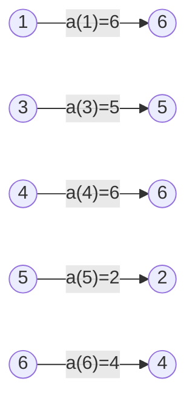
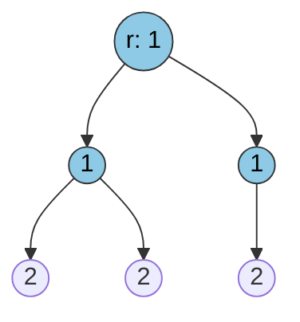
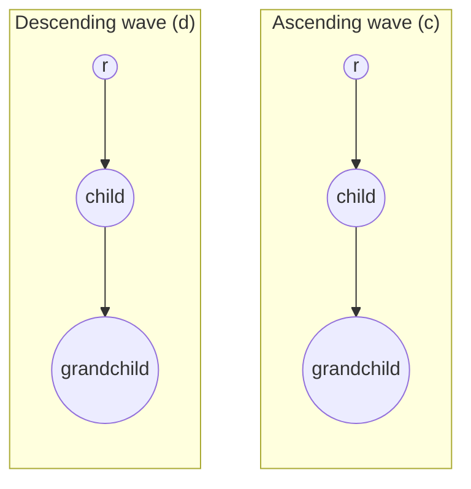
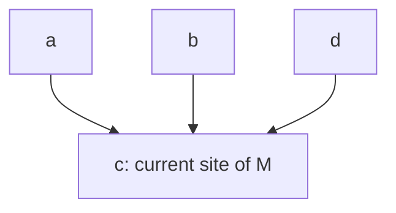
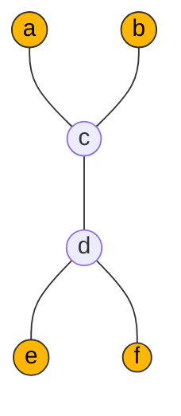
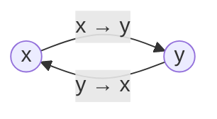

# Case Study: Distributed Network Algorithms

[[book-guidelines|↩ Back to guidelines]]

Chapters 10–13 are the payoff chapters of Abrial's book. Chapter 9 built a toolbox of "[[Advanced-Data-Structures|advanced data structures]]" — rings, infinite/finite trees, free trees — purely as set-theoretic axioms with no operational content. These four chapters put that toolbox to work on four real distributed algorithms, each with a genuinely different shape of problem:

- **Ring** (Ch. 10): symmetric, homogeneous processes with no central authority must agree on a leader using only comparisons of names.
- **Tree** (Ch. 11): a fixed network topology must maintain a *global* synchronization invariant using only *local* observations.
- **Dynamic tree** (Ch. 12): the topology itself changes over time, and messages can arrive out of order — the central hazard becomes routing *cycles* caused by stale information.
- **Free tree with contention** (Ch. 13): the "remove the loser" strategy that works for Chapters 10–12 breaks down at the very end, when exactly two symmetric candidates remain and deterministic tie-breaking is provably impossible — forcing a step outside pure invariant-based reasoning into randomization.

All four share a method: start from a wildly non-deterministic, almost trivial abstract model that is *obviously* correct (often a single one-shot event), then refine it in stages, each stage adding one piece of "distributed realism" — a topology axiom, a channel, a clock — while *proving* that the added realism doesn't break the abstract correctness property. What's interesting for a compiler/verifier engineer is less the algorithms themselves (all four are well known in distributed systems) and more the *invariant vocabulary* Event-B uses to glue an abstract global property to concrete local behavior: interval invariants, tree induction, and timestamp-monotonicity invariants are three different answers to the same underlying question your CSP/abstract-interpretation kernel will keep asking — *what local fact, checkable at one node/one program point, is strong enough to imply a global fact you actually care about?*

---

## 1. Leader Election on a Ring-Shaped Network (Chapter 10)

### 1.1 The problem, and why the "obvious" approaches fail

The requirement document (§10.1) is deliberately austere:

- **ENV-1**: a finite set of nodes forms an oriented ring.
- **ENV-2**: each node sends only to its right neighbor.
- **ENV-3 / ENV-4**: messages are buffered per node, *and those buffers can reorder messages*.
- **ENV-5**: every node runs the same code (homogeneity — no node is distinguished a priori).
- **ENV-6 / FUN-2**: nodes have distinct natural-number names; the leader is the node with the **largest name**.

The reordering clause (ENV-4) is not a throwaway detail — it is what kills the two naive strategies:

1. **"Forward everything, decide when your own name comes back."** Without reordering this works (your name completing a full lap proves you've seen everyone). *With* reordering it doesn't: your name can return before some other name has even finished its lap, so "I've seen my own name" no longer means "I've seen every name."
2. **"Count until you've seen $n$ distinct names."** Correct, but requires every node to know the ring size $n$ in advance — an assumption the informal spec explicitly wants to avoid (rings grow and shrink).

The strategy that actually works — **"forward a name only if it is strictly greater than your own; otherwise drop it; if a name equals your own, you're elected"** — is correct, but the proof needs a genuinely non-trivial invariant, not just intuition.

### 1.2 Initial model: specify the *result*, not the *mechanism*

As in every Event-B development, the starting point isn't an algorithm at all — it's a single one-shot event that states the desired outcome and nothing else:

```
constants: N                    axm0_1: N ⊆ ℕ
                                 axm0_2: finite(N)
                                 axm0_3: N ≠ ∅
variables: w                    inv0_1: w ∈ N

init                    elect
  w :∈ N                  w := max(N)
```

`elect` is well-defined only because `N` is finite and non-empty — this is exactly the kind of side-condition Event-B forces you to discharge as a proof obligation rather than assume; `max` is a partial operator on sets of naturals, total only under those axioms.

### 1.3 The informal proof: a buffer function

Before formalizing anything, Abrial builds the *informal* correctness argument that the refinement will later encode. Picture the state of the ring not as "messages in transit" but as a **partial function $a$**: for a name $x$ still circulating, $a(x)$ is the node currently holding it (about to forward it). $a$ must be a *function* — a name can't be in two buffers at once — and it's *partial* because names get eliminated (dropped) once a strictly larger name is seen ahead of them.

Example state: $a = \{1 \mapsto 6,\ 3 \mapsto 5,\ 4 \mapsto 6,\ 5 \mapsto 2,\ 6 \mapsto 4\}$.



*(Read each arrow as "name x is waiting to be transmitted by node a(x)".)*

The key informal lemma: **for every $x$ in the domain of $a$, $x$ is the maximum of the ring interval running from $x$ up to (and including) the node just before $a(x)$.** Once a name $x$ reaches the point where $a(x) = x$ — it's arrived back at a node bearing its own name — that interval has grown to cover the *entire* ring, so $x = \max(N)$ and $x$ is elected.

### 1.4 First refinement: formalizing the ring and the interval operator

**The ring.** A ring on a finite set $N$ is a bijection $n : N \rightarrowtail\!\!\twoheadrightarrow N$ ("next"), constrained so there's no proper non-empty subset closed under "predecessor":
$$\texttt{axm1\_2}:\ \forall S \cdot n^{-1}[S] \subseteq S \wedge S \neq \emptyset \Rightarrow N \subseteq S$$
This is Chapter 9's ring axiomatization (§9.7.5), reused verbatim — the book is disciplined about building a reusable structure library rather than re-deriving ring properties per example.

**The interval operator**, also imported from Chapter 9 (§9.7.5), is the crucial piece of borrowed machinery:
$$\texttt{itvr} \in N \to (N \to \mathbb{P}(N)), \qquad \texttt{itvr}(x)(y) = \texttt{cl}(\{x\} \mathbin{\lhd\!\!-} n^{-1})[\{y\}] \cup \{y\}$$
Read $\texttt{itvr}(x)(y)$ as "the set of ring nodes walking forward from $x$ to $y$ inclusive" — built from the irreflexive transitive closure $\texttt{cl}$ of the "next" relation with $x$'s own outgoing edge removed by domain subtraction ($\lhd\!\!-$), so the walk can't wrap past $x$ again. Two facts about it do all the proof work later:
$$\texttt{itvr}(x)(y) = \texttt{itvr}(x)(n^{-1}(y)) \cup \{y\} \qquad \texttt{itvr}(x)(n^{-1}(x)) = N$$
— i.e., you can peel one element off the far end of an interval, and the interval from $x$ all the way around back to $x$ is the whole ring.

**The state.** The buffer function $a$ from §1.3 becomes a genuine variable, and the informal lemma becomes the *invariant that carries the entire correctness argument*:
$$\texttt{inv1\_1}:\ a \in N \to N \qquad \texttt{inv1\_2}:\ \forall f \cdot f \in \text{dom}(a) \Rightarrow f = \max(\texttt{itvr}(f)(n^{-1}(a(f))))$$

**The events.**

```
elect                    accept                     reject
  any x where              any x where                any x where
    x ∈ dom(a)                x ∈ dom(a)                 x ∈ dom(a)
    x = a(x)                  a(x) < x                   x < a(x)
  then                     then                       then
    w := x                    a(x) := n(a(x))            a := {x} ⩤ a
  end                      end                        end
```

`accept` is the "forward" step (only when the pending name is still ahead of the holder's own name); `reject` is the "drop" step; `elect` fires exactly when a name has caught up with its own holder.

### 1.5 The proofs: SIM, INV, and a set-based variant

The **SIM** proof for `elect` (refining `w := max(N)`) reduces, after instantiating the universally quantified variables with $x$, to showing $x = \max(N)$ from $\texttt{itvr}(x)(n^{-1}(x)) = N$ (axm1\_5), $\texttt{inv1\_2}$, and the guard $x = a(x)$ — a short chain of substitutions.

The **INV** proof that `accept` preserves $\texttt{inv1\_2}$ is the meatier one, and it's a template you'll see repeatedly with the overriding operator ($\overline{\lhd}$, here written $\rlap{}\;\,\lhd\!\!-$/override): whenever an event's action modifies a function at one point via override, the invariant proof splits into a **case for the modified point** and a **case for everywhere else**:

- **Case $f = x$:** using $n^{-1}(n(a(x))) = a(x)$ (since $n$ is a bijection) and the interval-peeling theorem, the goal collapses to $x = \max(\{x, a(x)\})$, true because $a(x) < x$ by the guard.
- **Case $f \neq x$:** the goal is exactly the unmodified $\texttt{inv1\_2}$ instantiated at $f$ — discharged by `HYP` (the modification at $x$ is irrelevant to $f$'s own entry).

**Convergence.** `reject` obviously shrinks $\text{dom}(a)$. `accept` doesn't shrink that set at all — it just moves $x$ one hop forward — so the book picks a variant that decreases under *both* events: the sum of interval cardinalities
$$\texttt{variant1} = \sum_{x \in \text{dom}(a)} \texttt{card}(\texttt{itvr}(a(x))(x))$$
Rather than reasoning about the cardinal directly, the book proves decrease at the level of the underlying *set* $\{x \mapsto y \mid x \in \text{dom}(a) \wedge y \in \texttt{itvr}(a(x))(x)\}$ getting strictly smaller — a recurring technique: replacing a numeric-variant argument with a strict-subset argument is usually easier to discharge mechanically.

**Deadlock freedom** needs one more invariant, $\texttt{inv1\_3}: \text{dom}(a) \neq \emptyset$ — without it, the disjunction of the three event guards isn't guaranteed true, and the system could simply halt.

### 1.6 What breaks without inv1_2

Drop $\texttt{inv1\_2}$ and `accept`/`reject` are just "move forward if greater, drop if smaller" with no proof obligation connecting local comparisons to the global maximum — the algorithm would *still run* (nothing in its execution semantics depends on the invariant), but nothing would justify that whichever name eventually satisfies $x = a(x)$ is actually $\max(N)$. This is the general shape of the danger your CSP/abstract-interpretation kernel needs to guard against: an operationally-plausible-looking transition system with no invariant strong enough to relate a local guard ($a(x) < x$) to the global specification (`w = max(N)`) is unsound by construction, even if it happens to terminate correctly on every test case you throw at it.

### 1.7 Grounding: relational invariants as CSP-kernel material

$\texttt{inv1\_2}$ is precisely the shape of *relational/gluing invariant* your refinement-type verifier's invariant-generation pass needs to propagate across a data structure: a property indexed by a partial function ($a$), quantified over its domain, referencing both the function's own value and a derived structural query (`itvr`, built from the ring's transitive closure). In Rust terms, if `a: HashMap<Name, Name>` is the buffer map, `inv1_2` is a class invariant you'd want your abstract domain to carry as a *relational fact between map entries and ring order* — not decomposable into independent per-key facts, since $\texttt{itvr}(f)(n^{-1}(a(f)))$ depends on both the ring structure and the specific value $a(f)$. This is a small but genuine instance of the "gluing invariant" pattern (relating an abstract quantity, here "$x$ is globally maximal," to concrete local state) your Horn-clause / CHC-style invariant search will need to discover automatically rather than have handed to it, since a purely per-variable interval-domain abstraction (plain integer bounds) cannot express it — you need a relational domain over ring positions.

---

## 2. Phase Synchronization on a Tree-Shaped Network (Chapter 11)

### 2.1 The problem: a global property from local observations

- **ENV-1**: the network is a finite tree.
- **FUN-1**: every node has a natural-number **counter** — its "phase."
- **FUN-2**: any two counters differ by at most 1 (they stay synchronized).
- **FUN-3**: a node may read only its *immediate neighbors'* counters.
- **FUN-4**: a node may modify only its *own* counter.

FUN-3/FUN-4 are the whole difficulty. It's trivial to keep counters within 1 of each other if every node can see every other counter (a global guard); the entire refinement chain exists to *localize* that global guard down to neighbor comparisons, while never breaking the synchronization invariant along the way. Abrial is explicit that early models are allowed to violate FUN-3 — the point of refinement is to *earn* locality through proof, not assume it from the start.

### 2.2 Initial model: one counter, one global guard

$$\texttt{inv0\_2}:\ \forall x, y \cdot x \in N \wedge y \in N \Rightarrow c(x) \leq c(y) + 1$$

(equivalent to "any two counters differ by at most 1" — a small algebraic manipulation shows $b \le a+1 \Leftrightarrow (a \le b \Rightarrow b - a \in 0..1)$).

```
increment
  any n where
    n ∈ N
    ∀m · m ∈ N ⇒ c(n) ≤ c(m)     -- n is a *global* minimum
  then
    c(n) := c(n) + 1
  end
```

Incrementing a global minimum can never violate $\texttt{inv0\_2}$: the proof is a routine four-case split on the overriding operator (both compared indices equal $n$; one equal; the other equal; neither).

### 2.3 First refinement: the ascending wave and IND_TREE

The tree structure is imported wholesale from Chapter 9 §9.7.7 (finite-depth trees): root $r$, leaves $L$, parent function $f \in N \setminus \{r\} \rightarrowtail N \setminus L$, plus the no-infinite-backward-chain axiom $\texttt{axm1\_4}: \forall T \cdot r \in T \wedge f^{-1}[T] \subseteq T \Rightarrow N \subseteq T$.

The refinement's central invariant states only a *parent-child* fact:
$$\texttt{inv1\_1}:\ \forall m \cdot m \in N \setminus \{r\} \Rightarrow c(f(m)) \leq c(m)$$

— every node's counter is at least its parent's counter. From this **purely local, one-hop invariant**, the book proves the **global** theorem
$$\texttt{thm1\_1}:\ \forall m \cdot m \in N \Rightarrow c(r) \leq c(m)$$
using **tree induction**, imported from Chapter 9 §9.7.6. The general rule, instantiated for this tree ($V \mapsto N$, $t \mapsto r$, $p \mapsto f$):

$$\frac{H \vdash P(r) \qquad H,\ m \in N \setminus \{r\},\ P(f(m)) \vdash P(m)}{H,\ m \in N \vdash P(m)} \quad \texttt{IND\_TREE} \ (m \text{ not free in } H)$$

with $P(m) \equiv c(r) \leq c(m)$: prove the property holds at the root, and that it's preserved going from a parent to a child, and it holds everywhere. This is exactly structural induction over a single-parent tree — no different in kind from proving a property of every node of an inductively-defined tree type by induction on its constructors.

With $\texttt{thm1\_1}$ and the auxiliary bound $\texttt{thm1\_2}: \forall n \cdot n \in N \Rightarrow c(n) \in c(r)..c(r)+1$ (a corollary of $\texttt{inv1\_1}$ and $\texttt{thm1\_1}$ together), event `ascending` (renamed from `increment`) can localize its guard's *child* comparisons to actual neighbors — but it still needs $c(n) = c(r)$, a comparison against the *root*, which is not adjacent to $n$ in general. FUN-3 is only half-satisfied.


*An ascending wave: children never exceed their parent's counter value by more than the invariant allows; the wave of increments moves outward from the root.*

### 2.4 Second and third refinements: the descending wave, and the connecting invariant inv3_3

To eliminate the remaining root-comparison, the book introduces a **second counter** $d$, mirroring $c$'s structure exactly but flowing the other direction: $\texttt{inv3\_1}: \forall m \cdot m \in N\setminus\{r\} \Rightarrow d(m) \le d(f(m))$ (children never exceed their parent's $d$-value — a *descending* wave, proved by the same tree-induction pattern to satisfy $\texttt{thm3\_1}: \forall n \cdot d(n) \le d(r)$).

The single invariant that ties the two waves together — and makes the whole localization sound — is:
$$\texttt{inv3\_3}:\ \forall n \cdot n \in N \Rightarrow c(n) \in d(n)\,..\,d(n)+1$$

This is the connecting/gluing invariant of the chapter: it lets the proof convert freely between statements about $c$ (which the ascending wave modifies) and statements about $d$ (which the descending wave modifies), without either wave needing global visibility. Concretely, it lets `ascending`'s guard become

$$c(n) = d(n)$$

fully local (compares $n$'s own two counters, both readable by $n$ itself), while still *implying* the abstract guard $c(n) = c(r)$ — the derivation chains through $d(n) \le d(r) \le c(r) \le c(n)$ (the middle step is $\texttt{inv3\_2}: d(r) \le c(r)$, itself a corollary of $\texttt{inv3\_3}$ once you have it). Symmetrically, the abstract `descending` event splits into `descending_1` (non-root, guard $d(n) = d(f(n))$, comparing only to the parent) and `descending_2` (root only, guard $d(r) = c(r)$) — the split is *forced* by FUN-3: the root has no parent to compare against, so it needs its own event with its own local guard.


*Two counters per node, two independently-driven waves, glued together by `inv3_3` so that a node comparing only $c(n)$ and $d(n)$ to itself can locally infer a fact about the global root value $c(r)$.*

### 2.5 Fourth refinement: parity — bounding the state

A sharp observation closes the chapter: every comparison anywhere in the three final events (ascending's $c(n)$ vs. $d(n)$, ascending's $c(m)$ vs. $c(f(m))$, descending_1's $d(n)$ vs. $d(f(n))$, descending_2's $d(r)$ vs. $c(r)$) is between two values that provably differ by **at most 1** (justified respectively by inv3_3, thm1_3, thm3_2, thm3_4). Whenever a comparison only ever needs to distinguish "equal" from "off by exactly one," the actual magnitude of the counter is irrelevant — only its **parity** matters. So $c$ and $d$ are replaced by bounded functions $p, q \in N \to \{0,1\}$ (`parity(c(n))`, `parity(d(n))`), using the fact $\forall x,y \cdot x,y \in N \wedge x \in y..y+1 \wedge \texttt{parity}(x)=\texttt{parity}(y) \Rightarrow x = y$ (a same-parity, off-by-at-most-one pair must be equal) — echoing exactly the same "unbounded counter → parity bit" trick the book used for the bounded-retransmission protocol in Chapters 4/6.

### 2.6 What breaks without inv3_3

Without the connecting invariant, the ascending and descending waves are just two independent counters with no relationship — nothing licenses replacing the *global* guard $c(n) = c(r)$ with the *local* guard $c(n) = d(n)$. You'd either have to keep the non-local root comparison (violating FUN-3), or you'd get a guard-strengthening proof obligation that simply doesn't discharge, meaning the concrete algorithm could deadlock or misbehave in situations the abstract model rules out.

### 2.7 Grounding: tree induction as your elaborator's recursion principle

**IND_TREE is, almost verbatim, the structural induction principle you get for free from an inductively-defined tree type.** If a Rust/Lean-style dependent kernel defines
```rust
enum Tree<T> { Leaf, Node(T, Box<Tree<T>>, Box<Tree<T>>) }
```
its derived induction principle is exactly "prove `P` at `Leaf`; prove `P(Node(x, l, r))` assuming `P(l)` and `P(r)`; conclude `P` holds for all trees" — the same base-case/inductive-step shape as IND_TREE's $P(r)$ / "$P(f(m)) \vdash P(m)$" split, just with the parent/child edge direction reversed (Event-B's tree points *up* toward the root via $f$; a typical inductive data type points *down* toward leaves via constructors). The freedom-from-cycles axiom ($\texttt{axm1\_4}$, no infinite backward chain) is doing the same job that well-foundedness of the constructor relation does for a Lean `inductive` — it's what makes the induction principle sound rather than just a vacuous rule you could apply to a graph with cycles. For your invariant-generation kernel, `inv1_1` → `thm1_1` via IND_TREE is the template for **any** local-invariant-implies-global-property lemma over a recursively-defined data domain (e.g., "every node of this abstract-syntax tree satisfies a well-formedness predicate, given by structural recursion on children") — precisely the shape of soundness lemma a type checker proves about its own recursive traversal.

---

## 3. Routing Algorithm for a Mobile Agent (Chapter 12)

### 3.1 The problem: a tree that moves, and messages that lie

A mobile agent $M$ (think: a roaming process, or literally a mobile phone) travels between sites. Fixed sites want to send it messages. The chapter walks through four successively more realistic informal models (§12.1):

1. **Instant knowledge.** Every site always knows exactly where $M$ is. (Trivial, unrealistic.)
2. **Only the previous site knows.** When $M$ moves, only the site it *just left* learns the new location; other sites still send toward the old location and rely on forwarding. The communication channels form a **dynamic tree rooted at $M$'s current site**.
3. **Non-instantaneous service messages — a cycle hazard appears.** $M$'s move is no longer instant either: $M$ arrives, *then* sends a "service message" back to tell its previous site where it went. Service messages can be delayed and **arrive out of order**. If a *stale* service message arrives after a *fresher* one, it can silently overwrite a site's forwarding pointer with outdated information — and because pointers can now point in a way inconsistent with $M$'s true current location, this can create an actual **routing cycle**: a message stuck forwarding forever between sites that each believe the other is closer to $M$.
4. **The fix: logical clocks.** $M$ carries an incrementing clock $k$. Each time $M$ arrives somewhere, it stamps the outgoing service message to its previous site with the *new*, incremented value of $k$. A site receiving a service message **discards it if the stamp is not strictly greater than the last stamp it has already accepted.** Because stamps are strictly increasing along $M$'s trajectory, "discard anything not newer than what I've already seen" is enough to guarantee a site never adopts stale routing information — this is the same idea as a Lamport logical clock used to establish a happens-before order sufficient to filter out-of-order delivery.


*A forwarding-pointer tree: every fixed site's channel points, possibly through several hops, toward $M$'s current site — the root of the tree is wherever $M$ currently is, and the tree re-roots every time $M$ moves.*

### 3.2 Initial model: instantaneous, tree-shaped, unproven yet

Carrier sets $S$ (sites) and $M$ (messages, treated abstractly — their content doesn't matter, only their identity). State: $l \in S$ (current location), $c \in S \setminus \{l\} \to S$ (forwarding channel — every site but $M$'s current one has a "next hop"), $p \in M \rightharpoonup S$ (message pool, tracking where each in-flight message currently sits).

The crucial structural invariant — stated here as an *invariant to be proved*, not (as in Chapter 11) an *axiom assumed from the start*, since the tree is dynamic:
$$\texttt{inv0\_4}:\ \forall T \cdot T \subseteq c^{-1}[T] \Rightarrow T = \emptyset$$
("no non-empty subset of sites is closed under following channels backward" — i.e., no cycles). Proving this preserved by `rcv_agt` (the event where $M$ instantaneously moves and $c$ is updated by override, $c := (\{s\} \mathbin{\lhd\!\!-} c) \cup \{l \to s\}$) is the chapter's first real proof, and it's a genuinely delicate case split on whether the moving node $s$ was itself in the candidate cycle set $T$.

### 3.3 First refinement: the "magic" service channel

Splitting $M$'s move into `leave_agt` / `rcv_agt` introduces a gap during which the previous site doesn't yet know where $M$ went. The book models this with an **abstract service channel** $a \in S \setminus \{l\} \rightharpoonup S$ — a partial function from "a site $M$ just left" to "where $M$ went" — with a genuinely subtle behavior the text calls **magic**:

> when putting a new pair $\{l \to s\}$ into $a$, we *silently remove* any prior pending pair with the same first component $l$.

That is, $a$ enforces "at most one pending service message per destination, and it's always the most recent one" *by construction*, at the abstract level — sidestepping the entire reordering problem by fiat. This is deliberate: the abstraction states the *property you want* (only the freshest update ever matters) before committing to *how* you'll achieve it concretely. The connecting invariant is:
$$\texttt{inv1\_3}:\ c = d \mathbin{\lhd\!\!-} a$$
(the visible communication channel $c$ equals the "settled" channel $d$, overridden wherever a pending service message $a$ says otherwise) — another instance of the "abstract quantity = concrete quantity, adjusted by a delta structure" gluing pattern from §1.7/§2.4.

### 3.4 Second refinement: implementing the magic with logical clocks

This is the heart of the chapter. The abstract single-pending-message-per-site channel $a$ is replaced by a **concrete, richer channel** $b \in S \to (\mathbb{N} \to S)$ that can hold *several* stamped pending messages per site simultaneously — e.g. $s \mapsto \{3 \mapsto s_1,\ 5 \mapsto s_2,\ 9 \mapsto s_3\}$ means three service messages to $s$, timestamped 3, 5, 9. Plus a **logical clock** $k \in \mathbb{N}$ traveling with $M$, and a per-site **last-visit time** $t \in S \to \mathbb{N}$.

The connecting invariant says the abstract $a(s)$, when defined, is the entry of $b(s)$ with the *largest* timestamp:
$$\texttt{inv2\_4}:\ \forall s \cdot s \in \text{dom}(a) \Rightarrow \text{dom}(b(s)) \neq \emptyset \wedge a(s) = b(s)(\max(\text{dom}(b(s))))$$

But a receiving site doesn't get to inspect the whole set $\text{dom}(b(s))$ and pick the maximum — it only ever sees *one arriving message at a time* with *one* timestamp $n$. The invariant that makes local, per-message filtering sound is the key result of the whole chapter:
$$\texttt{inv2\_9}:\ \forall s, n \cdot s \in S \wedge n \in \text{dom}(b(s)) \wedge t(s) < n \Rightarrow n = \max(\text{dom}(b(s)))$$

In words: **if an arriving stamp is strictly greater than the site's own last-recorded time, then that stamp is *guaranteed* to be the largest pending one — without the site ever needing to see the others.** The informal justification (worth internalizing, since it's a genuinely non-obvious fact about clocks): every time $M$ visits $s$ and later leaves, it stamps the outgoing service message with a value one greater than $t(s)$ *as it stood at that visit* — and each subsequent visit only raises $t(s)$ further. So any *earlier*, still-pending service message to $s$ necessarily carries a *smaller* stamp than any *later* one; the only way $n > t(s)$ can happen is if $n$ is the freshest pending stamp. This is exactly the correctness argument behind Lamport-clock-style staleness filters: **strictly-increasing local timestamps + "reject anything not exceeding what you've already accepted" is enough to guarantee you never process an out-of-order update, with no need for global coordination or full-history comparison.**

The resulting event:
```
rcv_srv
  any s, n where
    s ∈ S
    n ∈ dom(b(s))
    t(s) < n            -- the ENTIRE staleness filter
  then
    d(s) := b(s)(n)
    t(s) := n
  end
```

### 3.5 Third refinement: pure data refinement

The last refinement (§12.5) simply replaces the set $da$ (sites currently "awaiting a service message," hence unable to forward) with a boolean function $dab \in S \to \texttt{BOOL}$, characterized by $\texttt{inv3\_2}: \forall x \cdot x \in S \Rightarrow (x \in da \Leftrightarrow dab(x) = \texttt{TRUE})$ — pure representation change, no new proof content, included mainly to show what a "boring but necessary" data refinement step looks like once all the interesting invariants are already in place.

### 3.6 What breaks without inv2_9

Drop $\texttt{inv2\_9}$ and the filter $t(s) < n$ is just a heuristic — it happens to look plausible, but nothing proves that a stamp clearing the filter is actually the freshest one. Concretely: with unbounded reordering and no invariant tying timestamps to visit order, exactly the failure scenario the chapter opens with (Fig. 12.6: a late, stale service message $sm_1$ arriving *after* a fresher one $sm_2$ has already updated the routing pointer) can silently corrupt $d$, producing precisely the routing-cycle bug the whole chapter exists to prevent.

### 3.7 Grounding: timestamp monotonicity as an abstract-domain fact

This chapter is a clean worked example of a **staleness/happens-before invariant** — exactly the kind of fact a CSP kernel doing reachability analysis over a message-passing system needs to track as an abstract domain element, not just a per-variable interval. $\texttt{inv2\_9}$ is a relational invariant over three quantities at once (a site's local clock, an incoming stamp, and the *unseen* set of other pending stamps) that nonetheless licenses a purely local decision rule. If you're building a CHC-based invariant synthesizer for message-passing protocols, this is worth flagging as a target invariant *shape*: "local monotone counter + reject-if-not-strictly-greater" is a recurring idiom (session tokens, cache invalidation, optimistic concurrency version numbers, Raft/Lamport-style logical clocks) and a solver that can recognize and propose invariants of this shape — rather than only interval or octagon facts — will catch a large class of real distributed-systems bugs that pure numeric abstract interpretation misses.

---

## 4. Leader Election on a Connected Graph Network (Chapter 13)

### 4.1 The problem: IEEE-1394 on a free tree

This is the IEEE-1394 (FireWire) bus's actual leader-election protocol, modeled on a **free tree**: a finite, symmetric, irreflexive, connected, acyclic graph $g$ (imported from Chapter 9 §9.7.8):
$$g \in N \leftrightarrow N \quad g = g^{-1} \quad g \cap \text{id}(N) = \emptyset \quad \forall S \cdot S \neq \emptyset \wedge g[S] \subseteq S \Rightarrow N \subseteq S \quad \forall h, S \cdot h \subseteq g \wedge h \cap h^{-1} = \emptyset \wedge S \subseteq h[S] \Rightarrow S = \emptyset$$
(the last axiom, $\texttt{axm1\_5}$/$\texttt{axm\_6}$, is the acyclicity condition, phrased carefully so it survives the graph's symmetry — it quantifies over an *asymmetric* sub-relation $h \subseteq g$ that witnesses connectivity without needing to pick a direction on every edge).

**Outer nodes** are the leaves of the free tree — nodes connected to exactly one other node:
$$\{ x \mid x \in N \wedge \exists y \cdot g[\{x\}] = \{y\} \}$$
The key structural fact (imported thm_1, §9.7.8): **a non-empty free tree always has at least one outer node.** This existence guarantee is what makes the whole algorithm's progress argument work.


*A free tree: the highlighted leaves (a, b, e, f) are outer nodes — each connected to exactly one neighbor.*

### 4.2 Refinement 1–2: remove outer nodes, one message at a time

The idea (§13.2): shrink the "still competing" set $n$ by repeatedly removing an outer node from the induced sub-tree $n \lhd g \rhd n$, until one node remains — that's the leader.

```
progress
  status convergent
  any x, y where
    x ∈ n
    g[{x}] ∩ n = {y}     -- x is an outer node of the current sub-tree
  then
    n := n \ {x}
  end
```
The variant is simply $n$ itself (finite, strictly shrinking); deadlock-freedom follows directly from the imported outer-node existence theorem, applied to the sub-tree at each step.

The second refinement (§13.3) makes this a genuinely distributed message-passing protocol: $x$ doesn't just vanish — it *sends a message* to its sole remaining neighbor $y$ (event `send_msg`), and only when $y$ *receives* that message does it finalize the removal (`progress`, now guarded by $x \to y \in m \wedge y \notin \text{dom}(m)$ — the receiving node must not itself have already sent a message).

### 4.3 Refinement 3: contention — where determinism runs out

This is the chapter's payoff, and the reason it belongs in a book about *proof*. Once only two candidates $x, y$ remain, both are simultaneously outer nodes of each other, and **both send to each other**. Now $x \to y \in m$ *and* $y \to x \in m$ hold at once — `progress`'s guard ($y \notin \text{dom}(m)$) is false for *both* directions, since each has itself sent a message. The system is **stuck**: two symmetric, homogeneous nodes running identical code, each waiting for the other to yield, and there is *no local, deterministic rule* that can distinguish them — by ENV-5-style homogeneity (both nodes see the same shape of local state), any deterministic tie-breaking rule available to $x$ is equally available to $y$, so it can't produce different outcomes at the two nodes.


*Contention: both remaining candidates have sent to each other; both guards for `progress` are simultaneously false.*

The book's formal treatment (§13.4) is deliberately partial — it models the *bookkeeping* of contention (a virtual **contention channel** $c$, recording who has *discovered* the symmetric standoff, plus $bm = \text{dom}(m \cup c)$ tracking all "busy" nodes) via two new events:

```
discover_contention                      solve_contention
  any x, y where                           any x, y where
    x → y ∈ m                                c = {x → y, y → x}
    y ∈ bm                                 then
  then                                       c := ∅
    c := c ∪ {x → y}                         bm := bm \ {x, y}
    m := m \ {x → y}                       end
  end
```
`solve_contention` is explicitly flagged as **not part of the protocol proper** — "a daemon acting when the very short delay has just passed." The book then steps entirely *outside* Event-B's invariant machinery to describe, informally, how the real IEEE-1394 protocol actually breaks the tie: each node waits a short, bounded delay (long enough to be sure the other has also detected the contention), then **randomly chooses**, with probability $1/2$, one of two further delays ("short" or "long," differing by at least twice the message transfer time). If both choose the same delay, the standoff recurs; if they choose differently, whoever picked the longer delay wakes up, sees the other's message pending, and — since it hasn't yet sent its own — wins outright. By the law of large numbers, the probability both nodes indefinitely choose the same delay is zero, so termination holds **with probability 1**, not certainly.

### 4.4 Refinements 4–5: pure efficiency data refinements

The last two refinements are unrelated to contention — they're straightforward data refinements replacing the guard $g[\{x\}] \cap n = \{y\}$ first with a maintained neighbor-set function $d(x) = g[\{x\}] \cap n$ (§13.5), then with an integer counter $r(x) = \texttt{card}(d(x))$ so the guard becomes a cheap $r(x) = 1$ test rather than a set-comprehension check (§13.6) — worth noting mainly as a contrast: these steps are "mere routine" precisely because no new invariant content is needed, unlike the contention refinement.

### 4.5 What breaks without stepping outside invariants

This is the sharpest lesson of the whole case-study set, and it's worth stating precisely: **the contention scenario is not a modeling failure or a missing invariant** — it's a genuine impossibility result. Two homogeneous, deterministic processes with symmetric local state cannot deterministically break a symmetric tie using only their local state and message exchange (this is a classical result in distributed computing — anonymous, deterministic algorithms cannot solve leader election on a topology with a nontrivial automorphism, and a two-node contention is exactly such a symmetric configuration). No amount of additional invariant strengthening or guard refinement within the Event-B/CSP framework used everywhere else in the book can fix this, because the obstruction is *combinatorial symmetry*, not insufficient information.

### 4.6 Grounding: a genuine boundary case for deterministic constraint propagation

This is directly relevant to your CSP/abstract-interpretation kernel's design, and worth flagging explicitly as a **boundary case, not just an illustration**: constraint propagation (domain/lattice narrowing, CHC solving, deterministic invariant strengthening) is fundamentally a *deterministic* fixpoint process, and Chapter 13's contention scenario is a worked example of a problem where **no deterministic propagation strategy terminates**, by a symmetry argument independent of how clever the propagation rule is. Two takeaways for your solver's design:

- **Detecting symmetry as a first-class signal.** A verifier that notices "these two branches of the search are structurally isomorphic under a state permutation" can recognize a genuine symmetric-deadlock class of problem (not just this leader-election example — think two racing threads with identical code contending for a resource with no tie-breaking ID) rather than looping or timing out trying to find a witness that provably doesn't exist deterministically.
- **When nondeterministic search (or explicit randomization) is not a weakness but the correct escape hatch.** Where deterministic constraint propagation gets stuck, your CSP kernel's counterexample *search* component (as opposed to the invariant-generation/over-approximation component) is the right tool — but Chapter 13 goes one step further and shows a case where even unconstrained nondeterministic choice (Event-B's `any x :∈ S`) isn't enough either, and the real protocol needs an actual probabilistic/randomized mechanism with a "termination with probability 1" guarantee rather than a certain one. If your verifier ever needs to certify liveness for a protocol with a genuine symmetric-contention structure, plan for weaker-than-certain (probabilistic, fair-scheduling-assumption) liveness proof obligations as a distinct proof-obligation class from the deterministic invariant/variant proofs used everywhere else in this book.

---

## Where this leads

Structurally, these four chapters function as an extended proof of concept for everything the book built in Chapters 1–9: the requirement-document discipline, the refinement calculus (SIM/INV/GRD proof obligations, guard strengthening, variants), and the Chapter 9 data-structure library (rings, trees, free trees, tree induction) all get exercised together on real algorithms, rather than toy examples. Chapter 14 (bridge and press controllers) and the appendices go on to consolidate these same proof patterns for reactive/hybrid systems, but the four algorithms here are the last (and most demanding) place in the book where the *problem itself* is inherently distributed and symmetric.

For the compiler/verifier project specifically, the throughline across all four sections is that **"local implies global" is never free — it always costs a specific invariant shape**, and this case study catalogs three genuinely different ones side by side: an interval/order invariant tied to a ring structure (Ch. 10), a structural/inductive invariant tied to a tree recursion (Ch. 11's `inv3_3` plus `IND_TREE`), and a monotonicity/staleness invariant tied to a logical clock (Ch. 12's `inv2_9`). A CSP/abstract-interpretation kernel aiming to *synthesize* invariants automatically, rather than have them handed to it, needs template recognizers for roughly this taxonomy of relational-invariant shapes — and Chapter 13 marks the taxonomy's boundary, showing a problem shape (symmetric contention) that no invariant in this vocabulary can solve at all, because the obstruction is structural symmetry, not missing information. That distinction — between "this needs a cleverer invariant" and "this needs a different proof-obligation class entirely" — is worth carrying forward into how the solver's failure modes get diagnosed.
