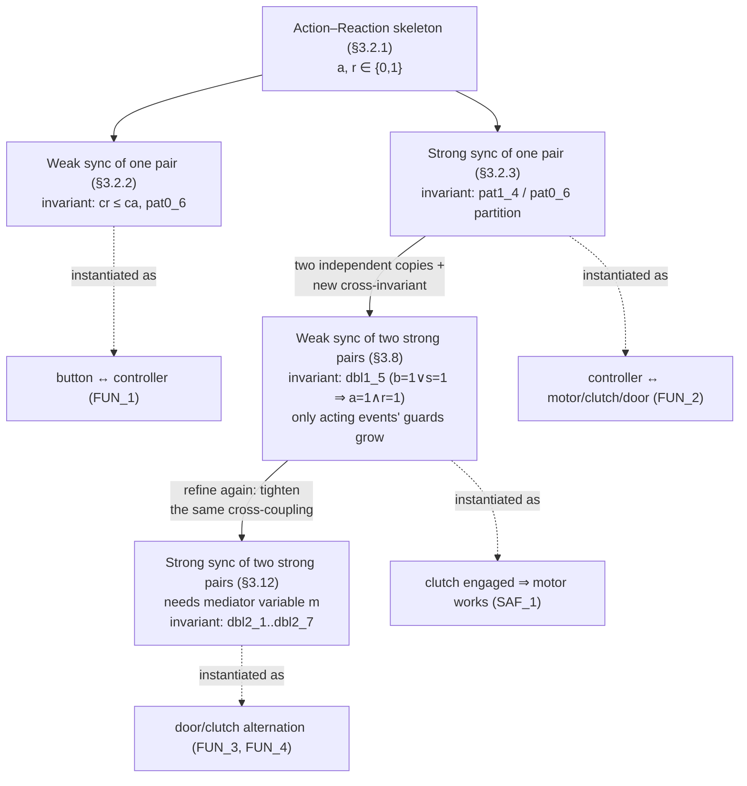

# Design Patterns for Reactive Controllers

[[book-guidelines|↩ Back to guidelines]]

## Why a reactive controller needs a *pattern*, not just a proof

A reactive controller — a piece of software mediating between a human pressing
buttons and a piece of equipment doing dangerous things — is fundamentally
a translation layer between two independently-timed worlds. The button doesn't
know when the equipment will respond; the equipment doesn't know when the
button was pressed. Abrial's mechanical press has four of these couplings
(start/stop motor, engage/disengage clutch, open/close door, plus the
button-to-controller link itself), and a full system has requirements that
cut *across* pairs of them (e.g. "the motor must be working whenever the
clutch is engaged"). If you model each coupling from scratch, you re-derive
the same case analysis — what happens if the user presses twice before the
equipment responds, what happens on the interleaving race between a button
press and an equipment acknowledgment — four separate times, and you get four
independent chances to get the guard conditions subtly wrong.

Abrial's move in Chapter 3 is to *first* solve the coupling problem once, in
the abstract, as a tiny two-variable system with no reference to presses,
motors, or buttons at all, and prove it correct. Once that abstract system
carries a machine-checked invariant, every concrete instantiation of it
(button↔controller, controller↔motor, controller↔clutch...) inherits the
proof for free — instantiation is just renaming. This is the same instinct
that makes you write a generic `Mutex<T>` once instead of re-deriving mutual
exclusion by hand at every call site. The chapter develops exactly two base
patterns (§3.2) and then two ways of *composing* two instances of them
(§3.8, §3.12) — which is precisely the vocabulary the press controller turns
out to need. (The press controller itself, and how each pattern gets
instantiated onto motor/clutch/door, is covered in the companion article
"Case Study: Bridge and Press Controllers" — this article stays at the level
of the reusable idiom.)

There is a second reason this chapter is worth reading closely even divorced
from the press: it is a compact, four-times-repeated demonstration of a
technique that generalizes far beyond Event-B — **using a failed proof
obligation to synthesize the missing hypothesis**. Every one of the four
patterns below is derived the same way: state a natural-looking invariant,
try to prove it's preserved by every event, watch one proof fail, read the
counterexample off the failed sequent, and either strengthen the invariant or
strengthen a guard until the proof goes through. This is invariant inference
by hand, and it is mechanically the same loop that CEGAR, Houdini, and
interpolation-based invariant generators run automatically — see the closing
section for why that connection is worth taking seriously.

---

## The action-reaction pattern (§3.2.1)

The shared abstraction underneath all four patterns is a pair of Boolean
signals:

- $a$ — the **action**: something one side of the interface *initiates* (a
  button is pressed, a controller issues a command).
- $r$ — the **reaction**: something the other side *does in response*, always
  strictly after the corresponding change in $a$.

Both live in $\{0,1\}$, and the book states the relationship they must
satisfy purely pictorially first (Fig. 3.6): $r$ rises only after $a$ has
risen, and $r$ falls only after $a$ has fallen. Everything else in this
article is about pinning down *how tightly* $r$ has to track $a$ — and the
answer turns out to have exactly two useful, formally distinct answers.

**[[Discrete-Transition-Systems#What breaks without this|What breaks without this]] abstraction layer:** if you skip straight to
modeling "button press → motor start," you conflate two orthogonal design
decisions — (1) how loosely can the response lag the stimulus, and (2) what
domain-specific thing the stimulus and response *are*. Keeping $a,r$ as bare
Booleans with no domain meaning is what makes the resulting invariants
reusable; the moment you write `motor_sensor = working` into the pattern's
own proof obligations, the proof stops being about synchronization in
general and starts being a one-off fact about presses.

---

## Weak synchronization of an action and a reaction (§3.2.2)

### The behavior being specified

Weak synchronization allows the reaction to *lag arbitrarily* behind the
action, in either direction of slack:

- $a$ can go up and down several times while $r$ stays down the whole time
  (the reaction hasn't caught up yet — Fig. 3.7).
- Symmetrically, once $r$ has gone up, $a$ can cycle down-then-up several
  times more before $r$ finally comes back down (Fig. 3.8).

In plain terms: **the reaction is allowed to miss transient pulses of the
action entirely.** This is the right model for "user presses button, keeps
pressing and releasing it while the controller is busy" — the controller is
not obligated to react to every single edge, only to *eventually* reflect the
current state.

### Modeling: ghost counters that never appear in a guard

To make "the reaction is behind" precise, Abrial introduces two counters,
$ca$ and $cr$, counting how many times $a$ and $r$ respectively have gone up:

```
variables: a, r, ca, cr

pat0_1: a ∈ {0,1}        pat0_2: r ∈ {0,1}
pat0_3: ca ∈ ℕ           pat0_4: cr ∈ ℕ
pat0_5: cr ≤ ca
```

Crucially, $ca$ and $cr$ are **ghost variables**: they exist purely to state
the invariant precisely, and Abrial explicitly rules them out of any event
guard — they may only appear in actions. This is a design discipline, not an
Event-B restriction: the final pattern (used to build real controllers) drops
the counters entirely, and the requirement they encode — "$r$ is never ahead
of $a$" — survives as invariants over $a$ and $r$ alone.

The four events are the obvious ones. The action side is completely
unconstrained by the reaction:

```
init                   a_on                    a_off
  a := 0                when                     when
  r := 0                  a = 0                    a = 1
  ca := 0              then                      then
  cr := 0                 a := 1                    a := 0
                           ca := ca + 1            end
                         end
```

The reaction side is where the synchronization actually lives, via the
guards `a = 1` / `a = 0`:

```
r_on                    r_off
  when                    when
    r = 0                   r = 1
    a = 1                   a = 0
  then                    then
    r := 1                  r := 0
    cr := cr + 1
  end                     end
```

### Deriving the missing invariant from a failed proof

This is the payoff of the whole exercise. Proving that `r_on` preserves
`pat0_5` ($cr \le ca$) fails:

$$
\underbrace{cr \le ca}_{\text{pat0\_5}},\; \underbrace{r=0,\ a=1}_{\text{guards}} \;\vdash\; cr+1 \le ca
$$

Nothing in the hypotheses rules out $cr = ca$, in which case `r_on` would
push $cr$ *past* $ca$. The cheap fix — add `cr < ca` directly to `r_on`'s
guard — is rejected on principle, because it reintroduces the ghost counter
into a guard, defeating the point of having "forgotten" it in the final
pattern. Instead Abrial goes looking for an invariant, tries
$a=1 \Rightarrow cr < ca$, watches *that* fail too (same proof, same
counterexample shape), and only settles on the strengthened form once the
proof actually closes:

$$
\texttt{pat0\_6}:\quad a = 1 \land r = 0 \;\Rightarrow\; cr < ca
$$

The extra conjunct $r=0$ is exactly the missing piece: once $r$ has caught
up ($r=1$), the strict gap must be gone, and pat0_5 alone (non-strict)
covers that case. Notice what happened here — the *guard* stayed untouched;
what changed was the invariant, because the counterexample revealed the
invariant was too weak, not that the event was too permissive. That
distinction (fix the invariant vs. fix the guard) recurs, and telling them
apart is the actual skill being taught.

**What breaks without pat0_6:** without it, nothing stops a model from
"proving" a controller correct that in fact lets a reaction race ahead of
its stimulus — silently violating the entire point of an action/reaction
coupling. The invariant is not decoration; it is the only thing standing
between "the proof passed" and "the model is meaningless."

### Grounding: weak sync as a bounded, order-preserving queue

In Rust terms, weak synchronization is exactly the invariant a bounded SPSC
(single-producer single-consumer) queue with capacity policy "never let the
consumer's count exceed the producer's" must uphold — except here the
"queue" only ever holds a difference of at most... well, unboundedly many
in-flight actions, since nothing bounds $ca - cr$. A typestate-flavored
sketch, keeping $ca,cr$ as debug-only ghost state exactly as the book does:

```rust
struct WeakSync {
    a: bool,
    r: bool,
    // ghost state — never read by any guard, only asserted in debug builds
    ca: u64,
    cr: u64,
}

impl WeakSync {
    fn a_on(&mut self) {
        debug_assert!(!self.a);
        self.a = true;
        self.ca += 1;
        self.check_invariant();
    }
    fn a_off(&mut self) {
        debug_assert!(self.a);
        self.a = false;
        self.check_invariant();
    }
    fn r_on(&mut self) {
        debug_assert!(!self.r && self.a); // guard: a = 1
        self.r = true;
        self.cr += 1;
        self.check_invariant();
    }
    fn r_off(&mut self) {
        debug_assert!(self.r && !self.a); // guard: a = 0
        self.r = false;
        self.check_invariant();
    }
    fn check_invariant(&self) {
        debug_assert!(self.cr <= self.ca);                          // pat0_5
        debug_assert!(!(self.a && !self.r) || self.cr < self.ca);   // pat0_6
    }
}
```

The `debug_assert!`s are the honest translation of proof obligations you
*chose not to prove statically* — Event-B's INV rule is exactly what would
have to hold for every one of these assertions to be provably unreachable.

---

## Strong synchronization of an action and a reaction (§3.2.3)

### The behavior being specified

Strong synchronization (also called *retro-acting* — the reaction constrains
the action back) forbids both slack scenarios above. The only legal
picture is Fig. 3.10: $r$ tracks $a$ up-and-down with at most one pulse of
lag, and crucially **the next `a_on` cannot fire until the previous
`r_on`/`r_off` cycle has fully caught up**. This is the right model for a
controller talking to real equipment, where you genuinely cannot issue a
second command before the first one's acknowledgment has arrived — the
"race condition" scenario from Fig. 3.5 (start-motor / motor-ack /
stop-motor racing) is precisely what strong synchronization is built to rule
out at the model level.

### Modeling: same variables, new invariant, guards discovered by proof failure

The starting invariant is the mirror image of pat0_5 — now the *action*
counter cannot outrun the reaction counter by more than one:

$$
\texttt{pat1\_1}:\quad ca \le cr + 1
$$

The events are initially left completely unmodified from the weak pattern.
Abrial's method here is deliberately conservative: *don't guess at guards up
front — let the proof tell you exactly which guard is missing.* The chain of
failures runs like this:

1. `a_on`'s proof of `pat1_1` fails (nothing stops a second `a_on` before
   `r` catches up). The failed sequent, after simplification, reduces to
   needing `ca ≤ cr` under `a=0` — which is not derivable from `pat0_5` and
   `pat1_1` alone. This suggests
   $$\texttt{pat1\_2}:\quad a = 0 \;\Rightarrow\; ca = cr.$$
2. Now `a_off`'s proof of `pat1_2` fails — nothing says $r$ has actually
   turned on before `a` turns off. This suggests strengthening to
   $$\texttt{pat1\_3}:\quad a = 1 \land r = 1 \;\Rightarrow\; ca = cr,$$
   but that predicate is unprovable *unless* `a_off`'s guard actually forces
   $r=1$ — so the guard gets strengthened:
   ```
   a_off
     when
       a = 1
       r = 1        <- new guard, derived not guessed
     then
       a := 0
     end
   ```
3. That guard strengthening breaks `a_on`'s proof of `pat1_3` in turn (need
   a contradiction to discharge the case $r=1$ while $a$ is about to become
   1), which forces a *second* strengthened guard:
   ```
   a_on
     when
       a = 0
       r = 0        <- new guard, again derived, not guessed
     then
       a := 1
       ca := ca + 1
     end
   ```

After this second strengthening, every invariant preservation proof goes
through. The two invariants collapse into one:

$$
\texttt{pat1\_4}:\quad a = 0 \lor r = 1 \;\Rightarrow\; ca = cr
$$

and, laid next to the weak pattern's `pat0_6` ($a=1 \land r=0 \Rightarrow cr<ca$),
the two invariants turn out to be **exact negations of each other's
antecedent** — together they partition every reachable state into "in sync"
(`pat1_4` holds, gap is 0) or "one step of lag" (`pat0_6` holds, gap is
exactly 1), which is exactly Fig. 3.11's picture. The final pattern, with
counters dropped entirely:

```
a_on              a_off             r_on               r_off
  when              when              when               when
    a = 0             a = 1             r = 0              r = 1
    r = 0              r = 1             a = 1              a = 0
  then              then              then               then
    a := 1            a := 0            r := 1             r := 0
  end               end               end                end
```

Compare this to the weak pattern's `a_on`/`a_off`: strong synchronization is
*literally the same reaction events*, but the *action* events have grown a
guard on the reaction's current value. That asymmetry — "the acting side
gets constrained, the reacting side stays untouched" — is not incidental; it
is the load-bearing design rule the composition patterns below depend on.

**What breaks without pat1_2/pat1_3/pat1_4:** without the guard
strengthening on `a_on`/`a_off`, the "strong" pattern would be
indistinguishable from the weak one at the level of the four events — you'd
have the *variables* of strong synchronization but not the *guarantee*. Any
downstream requirement that assumes "at most one command outstanding"
(exactly SAF_1/SAF_2 in the press) would then rest on an unproved — and in
fact false — assumption.

### Grounding: strong sync as strict request/acknowledge handshaking

This is precisely the invariant a hardware request/acknowledge handshake (or
a Rust future that must not be polled again until the previous poll's
completion has been observed) needs. As a typestate machine, the extra
guards from the derivation collapse into forbidding `a_on` while an
acknowledgment is outstanding:

```rust
struct StrongSync { a: bool, r: bool }

impl StrongSync {
    fn a_on(&mut self) {
        debug_assert!(!self.a && !self.r); // both new guards, from the proof
        self.a = true;
    }
    fn a_off(&mut self) {
        debug_assert!(self.a && self.r);   // guard r=1, from the proof
        self.a = false;
    }
    fn r_on(&mut self) {
        debug_assert!(!self.r && self.a);
        self.r = true;
    }
    fn r_off(&mut self) {
        debug_assert!(self.r && !self.a);
        self.r = false;
    }
    fn check_invariant(&self) {
        // pat1_4, with pat0_6 as its exact negation on the other side:
        debug_assert!((self.a == false || self.r == true) || /* pat0_6 case */ (self.a && !self.r));
    }
}
```

Only four reachable states exist here ($(a,r) \in \{(0,0),(1,0),(1,1),(0,1)\}$
visited in that cyclic order), which is exactly why this pattern is
expressible as a genuine Rust `enum` typestate rather than needing runtime
assertions at all — see the closing [[Case-Study-Bridge-and-Press-Controllers#Synthesis|synthesis]].

---

## Composing synchronization patterns across two action-reaction pairs

The press controller doesn't just need isolated couplings — it needs
requirements that constrain *two* couplings against each other (e.g. "if the
clutch is engaged, the motor must be working" ties the motor's
action/reaction pair to the clutch's). Abrial develops two composition
patterns, weak and strong, each built as a *refinement* of two independent
copies of the strong pattern above.

### Weak synchronization of two strong reactions (§3.8)

**Setup.** Take two independent instances of the strong pattern — $(a,r)$
and $(b,s)$ — each already internally strongly synchronized, with their own
counters $ca,cr$ and $cb,cs$ satisfying the pat0/pat1-style invariants
(renamed `dbl0_1`–`dbl0_12`). The new cross-cutting requirement is:

$$
\texttt{dbl1\_1}:\quad s = 1 \;\Rightarrow\; r = 1
$$

i.e. the second reaction cannot fire *unless the first reaction has already
fired* — "the door cannot close before the motor has started," in the press
instantiation. Critically, this is stated as a **weak** cross-constraint:
$b$ (the second action) is still free to cycle several times before $s$
finally follows, exactly like the weak pattern within a single pair.

**The design rule that drives everything:** the events `s_on` (sets $s$) and
`r_off` (clears $r$) are declared off-limits for direct modification — they
are the two events whose guards would most obviously need `r=1` /`s=0` added
to enforce `dbl1_1` directly, and Abrial refuses to touch them. The whole
section is an exercise in achieving the same guarantee *indirectly*, by
tightening the guards of the corresponding **acting** events, `b_on` and
`a_off`, instead.

The derivation chases through four rounds, each one triggered by a proof
failure exactly like before:

1. To protect `dbl1_1`, you'd want `s_on`'s guard strengthened by `r=1` and
   `r_off`'s guard strengthened by `s=0` — but those events are forbidden.
   Instead, introduce two invariants that would make those guards
   *redundant*:
   $$\texttt{dbl1\_2}: b=1 \Rightarrow r=1 \qquad \texttt{dbl1\_3}: a=0 \Rightarrow s=0$$
2. Proving `dbl1_2` is preserved forces `b_on`'s guard to gain `r=1` (it's
   the only event that sets $b:=1$). Proving `dbl1_3` forces `a_off`'s guard
   to gain `s=0` (the only event that sets $a:=0$).
3. Those two guard additions in turn need their *own* justifying
   invariants — `r_off`'s guard now implicitly needs `b=0`, and `s_on`'s
   guard needs `a=1` — which again cannot be added directly to those
   forbidden events, so a further invariant is introduced:
   $$\texttt{dbl1\_4}: a=0 \Rightarrow b=0$$
   (its contrapositive, $b=1\Rightarrow a=1$, is exactly what `s_on`
   needed).
4. Finally `a_off` and `b_on` each pick up one more guard conjunct to make
   `dbl1_4` itself provable.

The end state: `r_on`, `r_off`, `s_on`, `s_off` are **byte-for-byte
unchanged** from the isolated strong pattern; only `a_off` and `b_on` have
grown guards:

```
a_off                   b_on
  when                    when
    a = 1                   b = 0
    r = 1                   s = 0
    s = 0                   r = 1
    b = 0                   a = 1
  then                    then
    a := 0                  b := 1
  end                     end
```

and all four accumulated invariants collapse into a single, readable
statement:

$$
\texttt{dbl1\_5}:\quad b = 1 \lor s = 1 \;\Rightarrow\; a = 1 \land r = 1
$$

— "if the second pair has started acting or reacting at all, the first pair
must already be fully engaged." This is the requirement the third
refinement of the press (§3.9) instantiates directly for SAF_1
("clutch engaged ⇒ motor works").

**What breaks without the "don't touch the reacting events" discipline:**
if you were allowed to add `r=1` straight to `s_on`'s guard, you'd get a
*correct* but *non-reusable* model — every new cross-pattern requirement
would again mean editing core reaction events, and two such requirements on
the same reaction would need their guards merged by hand, with no guarantee
the merge is even consistent. Routing every new constraint through the
*acting* event's guard means composition is achieved by *adding* invariants
and guard conjuncts, never by editing what already works — the same reason
you extend a trait via a blanket impl rather than editing the trait's
existing implementors.

### Strong synchronization of two strong reactions (§3.12)

**Setup.** FUN_3/FUN_4 in the press ("clutch disengaged ⇒ door cannot be
closed *repeatedly* without disengaging again" and its mirror) need a
tighter coupling than dbl1_5 provides: not just "$b$ can't run ahead of
$a$'s completion," but a genuine 1-for-1 alternation between the two pairs.
In counter terms, the target invariants are

$$
ca = cb \;\lor\; ca = cb+1 \qquad\qquad cr = cs \;\lor\; cr = cs+1.
$$

**The naive guess, and why it's wrong.** The obvious first attempt is to
make $ca = cb+1$ track the condition $a=1 \land b=0$ directly (Fig. 3.27).
Abrial shows this guess is wrong (Fig. 3.28) — the guard condition
$a=1\wedge b=0$ and the counter condition $ca=cb+1$ don't actually stay in
lockstep along every path through the state space; there are reachable
states where one holds without the other. This is worth pausing on, because
it's a real example of an invariant that is *plausible, natural, and false*
— exactly the kind of false lead a mechanical invariant-inference procedure
also has to reject, not just a human doing informal reasoning.

**The fix: an auxiliary mediating variable.** The actual solution
introduces a fresh Boolean $m$, whose sole job is to record *which side most
recently "claimed" the alternation slot* — a piece of state that has no
counterpart in either isolated pattern:

$$
\texttt{dbl2\_1}: m\in\{0,1\}\qquad
\texttt{dbl2\_2}: m=1\Rightarrow ca=cb+1\qquad
\texttt{dbl2\_3}: m=0\Rightarrow ca=cb
$$

The symmetric statement for $cr,cs$ needs two more invariants, discovered
by the identical guess-fails-fix cycle used everywhere else in the chapter
(Figs. 3.30–3.33: guess `r=1 ∧ s=0`, watch it fail, patch with `m` and `b`):

$$
\texttt{dbl2\_4}: r=1\land s=0\land(m=1\lor b=1)\Rightarrow cr=cs+1 \qquad
\texttt{dbl2\_5}: r=0\lor s=1\lor(m=0\land b=0)\Rightarrow cr=cs
$$

Two more invariants ($\texttt{dbl2\_6}$: $m=0\Rightarrow a=0\lor r=1$;
$\texttt{dbl2\_7}$: $m=1\Rightarrow b=0\land s=0\land a=1$) are needed before
every proof closes — a reminder that mediator-variable patterns tend to
need *more* invariants than they save in guard complexity, not fewer; the
payoff is that the guards themselves stay simple and legible:

```
a_on              b_on               a_off
  when              when               when
    a = 0             r = 1              a = 1
    r = 0             a = 1              r = 1
  then                b = 0              b = 0
    a := 1             s = 0             s = 0
    ca := ca+1         m = 1             m = 0
    m := 1           then               then
  end                 b := 1             a := 0
                       cb := cb+1      end
                       m := 0
                     end
```

Only three events change ($a\_on$, $b\_on$, $a\_off$); $a\_on$ sets $m:=1$
("first side has claimed the slot"), $b\_on$ requires $m=1$ and clears it
("second side has caught up, slot released"), and $a\_off$ requires $m=0$
("cannot disengage until the slot was properly released"). This is exactly
the alternation lock the press needs between the door and the clutch
(§3.13): the door cannot be re-closed, nor the clutch re-engaged, until the
other side has completed its half of the cycle.

**What breaks without $m$:** the counter-condition invariants
($ca=cb \lor ca=cb+1$) are, on their own, unprovable from any guard
expressible purely in terms of $a,b,r,s$ — the naive guess in Fig. 3.27
demonstrates this concretely. $m$ is not an artifact of Event-B's syntax; it
is *necessary extra state*, in the same sense that a mutual-exclusion
protocol built only from two flags (without a turn variable) cannot
implement strict alternation — this is essentially a miniature of the
classical result that Peterson's algorithm needs its `turn` variable for
exactly this reason.

---

## Synthesis: the pattern of the patterns

Structurally, the four patterns nest cleanly:



Every instantiation arrow on the right is developed in the case-study
article; what this article covers is everything on the left — the four
proofs that make those instantiations free.

### Where this leads

Within the book, these four patterns are the entire proof-theoretic payload
of the press controller's seven refinements (§3.5–§3.14): each refinement in
the case study is essentially "pick a pattern, rename $a,r$ (and $b,s$, $m$)
to the concrete signals, done." The genuinely interesting discovery buried
in §3.9–§3.11 — that requirement SAF_1 turns out to be *redundant*, provable
from SAF_2 and SAF_3′ — is itself only visible because the patterns kept the
proof obligations small and composable enough to notice the redundancy at
all; that would have been invisible in one monolithic proof of the whole
controller.

For the broader project of building a Rust verifier with an embedded prover
and abstract-interpretation kernel, this chapter is worth reading as a
worked, human-executed run of an algorithm you'll eventually automate:

- **The failed-proof-to-strengthened-invariant loop is CEGAR by hand.**
  Every derivation in this article follows the same shape: propose an
  invariant candidate, run the INV proof obligation, get a *counterexample*
  (the un-discharged sequent, e.g. "$cr \le ca$, $r=0$, $a=1$ but not
  $cr+1 < ca$"), and use that counterexample to either strengthen the
  invariant or strengthen a guard. That is exactly the counterexample-guided
  abstraction refinement loop your CSP/abstract-interpretation kernel needs
  to run automatically: over-approximate, try to prove the invariant,
  extract a concrete witness from the failure, refine, repeat. The one
  difference — Abrial's "counterexample" is a symbolic sequent he reads by
  hand, not a satisfying assignment from an SMT solver — is precisely the
  gap an automated CEGAR loop closes.
- **The wrong guess in §3.12 (Fig. 3.27–3.28) is a live example of why
  guard/invariant synthesis needs interpolation, not just guessing.** The
  "obvious" guard $a{=}1\wedge b{=}0$ turned out not to characterize
  $ca=cb+1$; the actual fix required inventing new state ($m$) not present
  in either original pattern. This is exactly the situation Craig
  interpolation (or predicate abduction, à la Houdini/SLAM) is built to
  handle mechanically: given a false Hoare triple, produce the weakest
  intermediate assertion (here, effectively "which side currently holds the
  alternation token") that makes the triple valid — rather than a human
  eyeballing pictures until the right auxiliary variable occurs to them.
- **The strong pattern's four-state cycle is a typestate, not a runtime
  check.** Because $(a,r)$ visits exactly four reachable states in a fixed
  cyclic order, a real verifier would want to *prove this once as a lattice
  fact* (finite, well-founded reachable-state set) and then check every
  instantiation against it structurally, rather than re-running INV/FIS on
  each renamed copy — the Event-B book does the renaming by hand precisely
  because Rodin has no generic/parametric-pattern mechanism; a
  refinement-type system with real polymorphism could type the pattern once
  and instantiate it for free.
- **Ghost counters that are forbidden in guards are exactly specification
  ghost state.** $ca, cr, cb, cs$ exist only to state and prove invariants,
  never to be observed by the running system — the same discipline enforced
  by ghost variables in Dafny/Creusot/Prusti-style verifiers, and directly
  relevant to how your compiler's Hoare-triple contracts should separate
  runtime state from proof-only auxiliary state.
