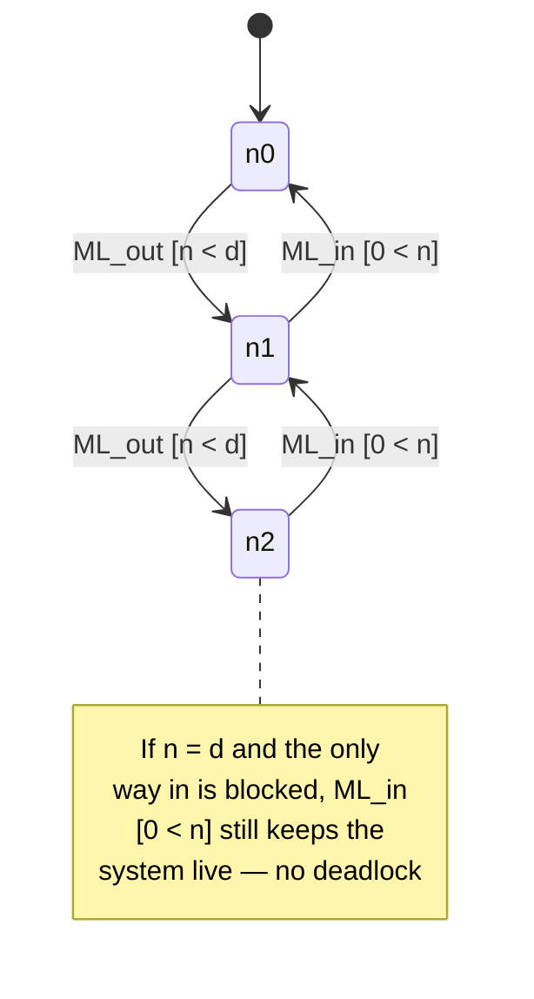
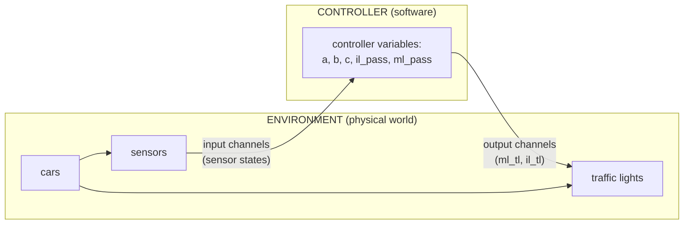

[[book-guidelines|↩ Back to guidelines]]

# Discrete Transition Systems

## What breaks without this

If you want to reason mathematically about "a system that runs" — a controller, a protocol, a circuit — you first need to decide what *kind* of mathematical object represents "a system that runs." Abrial's answer is deliberately minimal: a system, no matter how physically continuous its underlying reality (voltages ramping, cars accelerating, radio signals propagating), can be **faithfully abstracted as a succession of steady states punctuated by sudden jumps**. This single modeling decision is what makes proof tractable at all — you can't write a finite set of axioms about continuously-varying physical quantities, but you *can* write axioms about a state that only ever changes at discrete, nameable moments. Everything else in this topic (guards, actions, invariants, deadlock) is scaffolding built directly on top of that one abstraction choice.

If your reader has built compilers or interpreters, the shape here is instantly recognizable: a discrete transition system is an abstract machine — the same family as a CPU's fetch-decode-execute loop, or an operational-semantics small-step relation ($\langle e, \sigma \rangle \to \langle e', \sigma' \rangle$). Event-B's contribution is not the idea of a state machine (that's old), it's making the *proof obligations* about that machine systematic and mechanically generated — which is Topic 4's job. This topic is about getting the vocabulary and the informal semantics right first.

## State: constants and variables

A discrete model's state has two parts:

- A **static part** (the *context*): constants and the axioms that pin down their values or types. These never change during a run.
- A **dynamic part** (the *machine*): variables, which do change, plus **invariants** — predicates over the variables that must hold in every reachable state, forever.

Abrial's bridge-controller example (Chapter 2) makes this concrete before any of the formal Event-B keywords are introduced. The very first model of a controller limiting cars on an island-and-bridge compound has:

$$
\text{constant: } d \qquad \text{axm0\_1}: d \in \mathbb{N}
$$
$$
\text{variable: } n \qquad \text{inv0\_1}: n \in \mathbb{N} \qquad \text{inv0\_2}: n \le d
$$

Here $d$ is a fixed capacity and $n$ is the live car count. Note what's *not* in this model yet: no bridge, no traffic lights, no sensors — just the one quantity the first requirement (`FUN-2`: limit the number of cars) actually needs. This is a philosophy point as much as a technical one: **a discrete model starts as small as the property you're currently proving allows**, and grows only when a new requirement forces a new state component. You don't model "the whole system" up front — you model exactly enough to state and prove one property, then refine.

## Events: guards and actions

A transition is called an **event**. Every event has two parts:

- A **guard** — a predicate on the state that must hold for the event to be enabled. It states the *necessary condition* for the transition to happen, not a cause.
- An **action** — how the state changes when the event fires.

In the bridge example's first cut, before guards are even introduced, the two events are almost embarrassingly simple:

$$
\texttt{ML\_out}: \quad n := n + 1 \qquad\qquad \texttt{ML\_in}: \quad n := n - 1
$$

Abrial is careful to flag something easy to miss: writing $n := n+1$ is **not** writing a line of a program. A program statement *causes* something to happen when control reaches it; an Event-B action is a *formal description of an observation* — "when this transition is taken, this is how the state changes." The distinction matters because it licenses something a programming-language assignment can't offer: **non-determinism**. An action can be written as a before-after relation rather than a functional update, in which case *multiple* next states might be consistent with it, and the model is silent about which one occurs. This is what lets Event-B model, e.g., "the environment does something we don't control" or "any node in the network could be selected" without inventing a fictitious scheduler.

```rust
// A rough Rust sketch of the *idea*, not literal Event-B — deterministic case
struct State { n: u32 }

enum Event { MlOut, MlIn }

impl State {
    fn guard(&self, e: &Event, d: u32) -> bool {
        match e {
            Event::MlOut => self.n < d,   // enabling condition, added once deadlock analysis demands it
            Event::MlIn  => self.n > 0,
        }
    }
    fn fire(&mut self, e: &Event) {
        match e {
            Event::MlOut => self.n += 1,
            Event::MlIn  => self.n -= 1,
        }
    }
}
```

```python
# Non-deterministic action, Python sketch: x becomes SOME member of a set,
# mirroring Event-B's  x :| x ∈ A ∪ {y}  form — no single next value is picked here.
import random
def nondeterministic_action(x, A, y):
    return random.choice(list(A | {y}))  # any valid choice satisfies the before-after predicate
```

## Deterministic and non-deterministic actions, and before-after predicates

Every action, however it's written, has an associated **before-after predicate**: a relation between the variable's value just before the transition and its value just after. Primed variables ($n'$) denote after-values; unprimed ones ($n$) denote before-values. A deterministic assignment $n := n+1$ translates directly:

$$
n' = n + 1
$$

This is worth dwelling on because it's the seed of the book's later unifying move (formalized in Chapter 5): **every** Event-B action — deterministic assignment, non-deterministic `:|`, or non-deterministic membership `:∈` — is *defined* by reduction to a before-after predicate. Deterministic assignment isn't a separate primitive; it's the special case of a before-after predicate that happens to pin the after-value down to exactly one possibility. If your mental model is Hoare-logic weakest-preconditions or a small-step operational semantics, the before-after predicate *is* the transition relation — and it's exactly this relational (rather than functional) view that makes proof obligations like invariant preservation state cleanly as an entailment: "assuming the before-state satisfies the invariant and the guard, the before-after predicate implies the after-state does too."

## Invariants and gluing invariants

An **invariant** is a condition on state variables required to hold *permanently* — in the initial state, and after every event. This is the primary property Event-B lets you state and prove about a model; almost every other proof obligation exists to make invariant preservation checkable. $\text{inv0\_2}: n \le d$ above is a plain invariant: it constrains a single machine's own variables.

A **gluing invariant** is different in kind, not just in content: it's an invariant that mentions variables from *both* an abstract machine and the concrete machine that refines it — its job is literally to "glue" the two state spaces together, so that a proof about the concrete machine can be related back to a proof already done about the abstraction. You'll meet this properly under [[Refinement-Theory|Refinement Theory]], but it's worth flagging here because it's the mechanism that makes refinement more than just "add more variables": without a stated relationship (the gluing invariant) between old and new state, there would be no way to say the new model is *about the same system* as the old one, just observed more closely.

## Conditional invariants

Some invariants aren't unconditional facts about the state — they're implications, true only under a stated hypothesis. In the bridge example's second refinement, after traffic lights are introduced as variables `ml_tl`, `il_tl` ranging over `{green, red}`, two new invariants read:

$$
\text{inv2\_3}: \; ml\_tl = \text{green} \Rightarrow a + b < d \land c = 0
$$
$$
\text{inv2\_4}: \; il\_tl = \text{green} \Rightarrow 0 < b \land a = 0
$$

The point of `inv2_3` is to say: *whenever* the mainland light is green, the underlying safety condition that made it safe to let a car in (the abstract event's guard) had better actually hold. A conditional invariant is exactly the tool for saying "this stronger fact only needs to be true in this particular situation" — the moment you introduce a new observable (a light's color) that's *correlated* with, but not identical to, an existing safety condition, you need an implication to state that correlation as an invariant, rather than a flat conjunction that would be false whenever the light happens to be red. Read this the way you'd read a type-refinement predicate that's only load-bearing under a specific tag of a sum type — the shape is the same: a fact guarded by a discriminant.

## Deadlock and deadlock freedom

Once events acquire guards (rather than always being enabled), a new possibility opens up: **every guard could be false simultaneously**. When that happens, no event can fire, and the model is said to have **deadlocked** — it's stuck, permanently, by definition of the very simple operational reading Abrial gives discrete models (no event enabled ⇒ execution stops).

Deadlock is not automatically a bug — "note that the application of this rule is not mandatory; not all systems need to be deadlock free," as the book puts it. But for the bridge controller, it obviously *is* a bug: a controller that can get stuck with no car able to enter or leave is broken, and this is a case where the requirements document was initially **incomplete** — the non-blocking property (`FUN-4`: "once started, the system should work forever") wasn't written down until the deadlock-freedom proof obligation forced the modeler to notice it was needed. This is the topic's own worked instance of the diagnostic loop from [[Formal-Methods-and-the-Modeling-Philosophy|Formal Methods and the Modeling Philosophy]]: attempting to state and discharge deadlock freedom is what *surfaces* a missing requirement, not the other way around.

Deadlock freedom (formalized later as the `DLF` proof obligation) says: under the axioms and invariants, the disjunction of *all* event guards is always true — i.e., some event is always enabled. For the bridge's initial model this comes out to proving $n < d \lor 0 < n$ from $d \in \mathbb{N}$, $n \in \mathbb{N}$, $n \le d$ — true whenever $d > 0$, which is exactly the extra axiom the modeler has to add once the proof attempt reveals $d = 0$ as an edge case that breaks it.



## Closed models of a controller and its environment

The most structurally important idea in this topic is that a "system" in Abrial's sense is very often **not just the software** — it's the software *plus* the physical world it observes and acts on, modeled together as one **closed model**. The bridge controller's third refinement makes this architecture explicit:



Three distinct kinds of variables appear, and keeping them conceptually separate is the whole point:

- **Controller variables** ($a, b, c$) — the software's own approximate picture of car counts. Lower-case by convention.
- **Environment (physical) variables** ($A, B, C$, sensor states) — the actual physical quantities. Upper-case by convention, precisely to keep "what the controller believes" visually distinct from "what is physically true."
- **Channel variables** — the interface between the two: output channels carrying commands from controller to environment (e.g., traffic-light color), input channels carrying observations from environment to controller (sensor on/off).

The deep reason to bother with this architecture: the controller's internal state ($a,b,c$) is explicitly *not* required to equal the physical truth ($A,B,C$) at every instant — there's an unavoidable time lag between a sensor changing and the controller's picture updating. The interesting invariants of this refinement are exactly the ones bounding *how far* the controller's approximate picture is allowed to drift from physical reality while still guaranteeing safety. Modeling controller and environment jointly, with an explicit channel interface, is what makes it possible to state and prove "the controller is safe *given only what it can actually observe*," rather than smuggling in an unrealistic assumption that the controller has direct, instantaneous access to ground truth.

## Where this leads

Every case-study chapter (bridge, press, protocols, circuits, trains) is an instance of this same skeleton: state as constants+variables, events as guard+action, properties as invariants, deadlock freedom as a sanity check, and — whenever software meets a physical world — a closed model separating controller variables from environment variables via explicit channels. The formal notation for all of this (machines, contexts, the `where`/`then`/`with` clauses, event status) is systematized next in **The Event-B Notation**, and the informal proof sketches used here (INV, DLF) get their general, mechanically-generated form in **[[Proof-Obligation-Rules|Proof Obligation Rules]]**. **Refinement Theory** is the machinery that justifies *why* you're allowed to keep adding detail (traffic lights, sensors, a closed-model architecture) to what started as a one-variable model and still call the result "the same system, more precisely observed" — the gluing invariant introduced here is the load-bearing artifact that makes that claim provable.

**Bearing on the standing project:** the guard/action/before-after-predicate triple is exactly the shape a Hoare-triple verifier needs internally — a guard is a precondition-like enabling test, an action's before-after predicate is the transition relation your weakest-precondition calculus pushes properties backward through, and an invariant is precisely what abstract interpretation is trying to infer automatically rather than have a human write down (Event-B assumes the human writes `inv0_1`, `inv0_2`, ...; your invariant-generation engine is trying to *discover* those). Deadlock freedom is a reachability-style liveness property in exactly the sense your CSP/CEGAR kernel will need to search for counterexamples to — a "some guard is always true" claim is refuted by a single reachable state where every guard is false, which is precisely a satisfying assignment a CSP solver is built to find.
