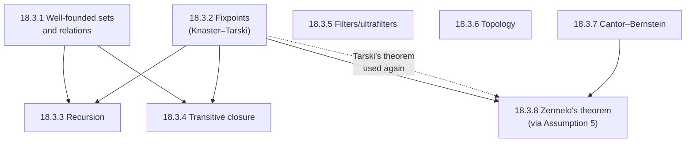

[[book-guidelines|↩ Back to guidelines]]

## Why the book ends with a problem set instead of another case study

Every other chapter in *Modeling in Event-B* hands you a finished development: a requirements document, a sequence of refinements, invariants stated and proved. Chapter 18 breaks that pattern deliberately. It is Abrial's closing move — seventeen chapters of *watching* proofs get built, and now one chapter of *building them yourself*, with the scaffolding removed. The chapter has three tiers, each stripping away a different kind of support:

- **§18.1 Exercises** — self-contained sequential-program and small-system developments. You get a problem statement and a suggested modeling strategy (which variables to introduce, which invariant shape to aim for), but no invariants, no proofs, no refinement chain.
- **§18.2 Projects** — larger case studies (parsers, pointer algorithms, distributed protocols) that in earlier chapters would each have received a full chapter of exposition. Here you get the informal specification and a short strategic outline; everything else — including the requirements document itself — is left to you.
- **§18.3 Mathematical developments** — a sequence of *pure* set-theory and order-theory problems, stated as numbered properties to be proved, that underlie every well-foundedness and fixpoint argument used earlier in the book. This is the only tier where the book gives you the full formal statement of what has to be proved; the proof itself is the exercise.

That structure matters for how you should read this article. §18.1 and §18.2 don't have "content" to explain in the way earlier chapters did — they're prompts. So this article treats them as a **catalog**: what's on offer, and which entries are worth your time given what you're building. §18.3 is different: it's the book's only place where Abrial states, with full formal precision, the machinery that makes well-founded induction, recursion, and fixpoint reasoning *work* — the machinery the rest of the book has been using since [[Advanced-Data-Structures|§9.7's irreflexive transitive closure]] without ever proving it correct. That's the section this article goes deep on.

---

## Part I — The exercises and projects, as a catalog

### §18.1 Exercises: small developments, full modeling arc

Eleven exercises, each compact enough to take through a complete requirements → context → machine → refinement arc in an afternoon or two. They span the same genres the book's earlier chapters modeled at length, compressed to problem-statement size:

| Exercise | What it drills |
|---|---|
| 18.1.1 Bank | Basic state machine: two carrier sets, an invariant relating clients to accounts, guarded state-changing events. The "hello world" of the chapter. |
| 18.1.2 Birthday book | Add/remove on an abstract relation, then a refinement into a paged, array-like representation — a first taste of data refinement (abstract relation → concrete indexed structure). |
| 18.1.3 Zero-row matrix search | Nondeterministic "does X exist" machine refined into a two-index scanning algorithm, with invariants stating what's *already been ruled out* by the indices scanned so far — the classic loop-invariant shape. |
| 18.1.4 Ordered-matrix search | Same shape as 18.1.3 but with a genuinely two-dimensional search-space invariant (Fig. 18.1: the surviving sub-matrix shrinks from two directions at once). |
| 18.1.5 Celebrity problem | A four-stage refinement chain (naive $O(n^2)$ elimination → indexed elimination) — good practice in refining a nondeterministic "remove any witness" event down to a deterministic index-walking one. |
| 18.1.6 Common element in two sets | Explicitly uses ordered bijections $f \in 1\mathinner{.\,.}m \rightarrowtail a$, $g \in 1\mathinner{.\,.}n \rightarrowtail b$ and asks you to prove $f(k) = \min(f[k\mathinner{.\,.}m])$ before refining — a rare case in this section where the book asks for a genuine *lemma*, not just an invariant. |
| 18.1.7 Access control | Requirements-document practice: labeling requirements EQP/FUN/SAF before any modeling starts — the discipline from [[Formal-Methods-and-the-Modeling-Philosophy]] applied cold. |
| 18.1.8 Library | State + queueing (waiting lists per book, FIFO service) — a light concurrency-adjacent exercise without needing actual concurrent events. |
| 18.1.9 Electronic circuit | Boolean combinational/sequential logic modeled as Event-B events, then explicitly refined using the environment/circuit event-merging technique from Chapter 8 — a direct callback exercise. |
| 18.1.10 Alarm clock | Two competing processes (user, clock) over a shared channel — a miniature of the interference reasoning in [[Case-Study-Communication-Protocols]]. |
| 18.1.11 Signal analysis | Continuous-to-step signal transformation with debounce timing — closest in spirit to the reactive controllers of [[Design-Patterns-for-Reactive-Controllers]], compressed to exercise size. |

None of these need new theory beyond what the book has already built by Chapter 17. They exist to test whether you can *drive* the method — invent your own invariant, not just verify one handed to you.

### §18.2 Projects: full case studies, informally scoped

Ten larger projects. Each is closer in weight to one of the book's Part III case-study chapters than to a homework problem — Abrial expects a full requirements document and an explicit refinement strategy, not just a machine.

| Project | Why it's worth doing (or not) |
|---|---|
| 18.2.1 Hotel key system | A clean access-control/security-invariant project (also treated by Jackson and Nipkow in the literature Abrial cites) — good if you want practice stating a *non-interference*-shaped safety property (no one but the current occupant can open the door) as an Event-B invariant. |
| 18.2.2 Earley parser | **High-value for a compiler-builder.** The book gives you the full formal machinery up front: a syntax as `left`, `right`, `size`, `axiom` functions over productions, a `match` relation defined by three closure axioms (base case + two matching rules), and an `item` relation invariant tying partial parses to prefixes of the `match` relation. The refinement goal is explicitly to derive the scanner/predictor/completer triad — i.e., to *re-derive* the Earley algorithm as a provably correct refinement of "does this input match the axiom," rather than take it as given. This is the project most directly relevant to a reader building a language front end: it's a worked template for turning a recognizer specification into an efficient parsing algorithm via refinement, the same move your elaborator's own parsing/recognition layer would need to justify. |
| 18.2.3 Schorr–Waite algorithm | **High-value for pointer/invariant-heavy work.** Marking algorithm for a general graph via $cl(g)[\{t\}]$ (irreflexive transitive closure, from [[Advanced-Data-Structures]]), refined stepwise: nondeterministic mark → depth-first mark with an explicit stack → binary-tree specialization (`left`, `right` partial functions) → the classic Schorr–Waite trick of encoding the stack *inside* the graph's own pointers by temporarily reversing edges. If your compiler's kernel ever needs to mark/traverse a term DAG in place (e.g. an occurs-check or a garbage-collected metavariable graph) without auxiliary storage, this project is a direct rehearsal of the invariant discipline needed to prove that safe. |
| 18.2.4 Linear list encapsulation | Insert/remove at arbitrary positions in a `next` partial function, first using `next⁻¹` freely, then refined to avoid it — practice in refining away an operation your target representation can't actually support efficiently (a recurring concern for any low-level data-structure encoding). |
| 18.2.5 Concurrent queue access | Enqueue/Dequeue/Adapt operations on a `Head`/`Tail`/`Next` linked queue with an explicit "degraded" state (`Head = Tail`) — the book flags this as reusing the atomicity-refinement technique of Chapter 7. Good concurrency practice, lower priority unless you're specifically working on lock-free structures. |
| 18.2.6 Almost-linear sorting | A sorting algorithm project pitched as harder than typical textbook sorts; useful general refinement practice, no special connection to the reader's stated goals. |
| 18.2.7 Dijkstra–Scholten termination detection | Classical distributed-termination-detection algorithm (weight/signal accounting over a computation graph) — relevant if you later touch distributed or actor-style evaluation, otherwise skippable. |
| 18.2.8 Distributed mutual exclusion | **Worth doing for concurrency practice.** Precedence relations over rings of processes, modeled the way Chapter 13's leader-election protocol was — good rehearsal for reasoning about safety (mutual exclusion) and liveness (no starvation) together under a message-passing model, which is the same flavor of reasoning a CSP-based concurrent-checker kernel would need. |
| 18.2.9 Lift/elevator controller | A reactive-controller project, same genre as [[Case-Study-Bridge-and-Press-Controllers]] compressed to project size. |
| 18.2.10 Business negotiation protocol | Design-patterns-over-unreliable-channels project, extending [[Design-Patterns-for-Reactive-Controllers]]'s vocabulary to a choreography setting. |

**What breaks if you skip straight to §18.3:** the mathematical developments below are stated at a level of abstraction (arbitrary sets, arbitrary well-founded relations) that only feels motivated once you've personally hit the wall they solve — e.g., proving a refinement terminates in 18.2.3's depth-first graph walk, or proving 18.1.5's celebrity-elimination loop actually shrinks $Q$ each iteration. The exercises are where "I need *some* decreasing quantity" turns into "I need the general theorem that guarantees such a quantity always exists for a well-founded relation" — which is exactly what §18.3.1–18.3.3 supplies.

---

## Part II — The mathematical developments (§18.3): the theory the rest of the book assumes

This is the one place in the entire book where Abrial steps outside Event-B modeling and states, as bare mathematics, the foundational results that every well-foundedness argument, every induction principle, and every recursive definition used elsewhere in the book ultimately rests on. Structurally, §18.3 is organized as a **dependency chain** — each subsection's result is used as a hint or lemma in a later one:



Two threads matter most for a dependent-type/refinement-type compiler and are treated in depth below: **well-founded induction and fixpoint theory** (§18.3.1–18.3.4), because they are literally the termination-checking and invariant-computation machinery your kernel needs; and **Cantor–Bernstein and Zermelo's theorem** (§18.3.7–18.3.8), because they are the classical cardinality/choice results a dependent type theorist keeps running into and should be able to state precisely rather than wave at.

A note on how the book presents this material: **every one of these subsections is a problem, not a solved development.** Abrial states the definitions and the properties to prove, sometimes with a one-line hint, and stops. There is no proof text anywhere in §18.3 — that is the whole point of the chapter. What follows preserves that honestly: definitions and statements are the book's own (translated into words where useful, but every formula is transcribed faithfully), and where a proof sketch is given below, it is marked as *not from the book* — an independent completion offered because leaving a bare, unmotivated formula on the page would defeat the purpose of a *teaching* note, even though the source text itself gives none.

### 18.3.1 Well-founded sets and relations

**The problem this solves.** Every inductive proof needs a base case and a way to guarantee you eventually reach one. On natural numbers this is obvious — "keep subtracting 1, you hit 0." On an arbitrary relation over an arbitrary set (a graph, a term-rewriting order, a subtyping relation) it's not obvious at all: what guarantees there's no infinite descending chain hiding somewhere? **[[Discrete-Transition-Systems#What breaks without this|What breaks without this]]:** if you can't rule out infinite descent, "induction" on your relation is unsound — you can "prove" a property of every element while some element sits inside an infinite backward chain that the induction never actually reaches, because there's no base case to anchor it. This is exactly the gap a dependent-type kernel's termination checker has to close for every recursive definition it accepts.

Abrial gives **two equivalent characterizations** of well-foundedness for a relation $r$ built on a set $S$.

**Definition 1 — no infinite descending path.** A subset $p \subseteq S$ "contains infinite paths" if every point in $p$ has an $r$-successor also in $p$:
$$\forall x \cdot x \in p \Rightarrow (\exists y \cdot y \in p \land x \mapsto y \in r)$$
which the book rewrites in image notation as $p \subseteq r^{-1}[p]$. Since $\emptyset$ trivially satisfies this, $r$ is **well-founded** iff $\emptyset$ is the *only* such set:
$$\forall p \cdot p \subseteq r^{-1}[p] \Rightarrow p = \emptyset \tag{1}$$

**Definition 2 — every nonempty subset has a minimal element.**
$$\forall p \cdot p \neq \emptyset \Rightarrow \exists x \cdot x \in p \land (\forall y \cdot y \in p \Rightarrow x \mapsto y \notin r) \tag{2}$$
i.e. some $x \in p$ has no $r$-successor still inside $p$.

The book asks you to prove $(1) \Leftrightarrow (2)$ — it states both but proves neither. *(Sketch, not from the book: $(2)\Rightarrow(1)$ is direct — if $p \subseteq r^{-1}[p]$ and $p \neq \emptyset$, take the minimal $x$ from (2); by definition $x$ has no successor in $p$, contradicting $x \in p \subseteq r^{-1}[p]$, which says $x$ does have one. $(1)\Rightarrow(2)$ needs the contrapositive plus excluded middle: if $p \neq \emptyset$ has no minimal element, every $x \in p$ has some $y \in p$ with $x \mapsto y \in r$, i.e. $p \subseteq r^{-1}[p]$, so by (1) $p = \emptyset$ — contradiction.)*

**Induction principle (3).** Given these, the book states the payoff — a *general* induction schema derivable from well-foundedness of $r$:
$$\forall q \cdot (\forall x \cdot r[\{x\}] \subseteq q \Rightarrow x \in q) \Rightarrow S = q \tag{3}$$
Read this carefully: it says if $q$ is closed under "all $r$-successors of $x$ are in $q$ implies $x \in q$," then $q$ is everything. This is the *strong induction* schema — no separate base case, because for an $r$-minimal $x$ the hypothesis $r[\{x\}] \subseteq q$ is vacuously true (empty successor set), so $x \in q$ falls out automatically. This is precisely the schema Chapter 9's [[Advanced-Data-Structures|tree-induction rule `IND_TREE`]] and list-induction rule `IND_LIST`] are *instances* of — this section is where those earlier, ad hoc induction rules get their general justification.

**Transport properties (4)–(8).** The remaining results in this subsection are about *proving* well-foundedness compositionally rather than from scratch each time — exactly the toolkit you want as a library, not a one-off proof per case:
- **(4)** any sub-relation of a well-founded relation is well-founded ($a \subseteq b$, $b$ well-founded $\Rightarrow$ $a$ well-founded);
- **(5)** well-foundedness transports backward across a total relation $v: S \leftrightarrow T$ satisfying $v^{-1};a \subseteq b;v^{-1}$ — a relational "simulation" condition;
- **(6)** the *functional* special case: if $v \in S \to T$ and $a$ maps to $b$ under $v$ (i.e. $x \mapsto y \in a \Rightarrow v(x)\mapsto v(y) \in b$), that simulation condition holds;
- **(7)** $<$ on $\mathbb{N}$ is well-founded (the base case everything else reduces to);
- **(8)**, combining (6) and (7): if you can exhibit **any** $v \in S \to \mathbb{N}$ such that $x \mapsto y \in a \Rightarrow v(y) < v(x)$, then $a$ is well-founded.

Property (8) is the one you already know under a different name: it is exactly a **ranking function / measure function** for termination proofs — precisely what a dependent-type checker's structural or well-founded recursion check has to synthesize (or accept a user-supplied `decreasing_by`/measure for) to admit a recursive definition. Lean's `termination_by`/`decreasing_by` machinery is a direct, automated instance of instantiating (8).

```rust
// (8) as a trait: "this relation is well-founded because I can rank it into ℕ"
trait WellFoundedBy<T> {
    // must satisfy: a_related(x, y) implies rank(y) < rank(x)
    fn rank(x: &T) -> u64;
}

// A termination checker's job, structurally, is exactly this:
// given a recursive call a -> b in the source, find *some* v satisfying
// property (8) — often the size of a structurally smaller sub-term.
fn check_terminates<T, R: WellFoundedBy<T>>(caller: &T, callee: &T) -> bool {
    R::rank(callee) < R::rank(caller)
}
```

### 18.3.2 Fixpoints — the Knaster–Tarski theorem

**The problem this solves.** Transitive closure, recursive function definitions, and (for your project specifically) abstract-interpretation invariant computation all have the same shape: "define $X$ as the smallest (or largest) set satisfying $X = f(X)$ for some monotone $f$." Nothing in first-order logic *hands* you such an $X$ — you need a theorem that guarantees one exists and tells you how to build it.

**Setup.** Given a set $S$ and a total function $f \in \mathbb{P}(S) \to \mathbb{P}(S)$, the book defines the **least fixpoint** directly, as an intersection:
$$\mathit{fix}(f) = \mathit{inter}(\{s \mid s \subseteq f(s)\}) \tag{9}$$
i.e. the intersection of every "$f$-closed-from-below" set (every $s$ with $s \subseteq f(s)$). This is well-defined for *any* $f$ — monotonicity isn't needed yet, just to intersect a nonempty family of subsets of $S$ (the book asks you to check this).

**Two lemmas, stated but not proved:**
$$\forall s \cdot f(s) \subseteq s \Rightarrow \mathit{fix}(f) \subseteq s \tag{10}$$
$\mathit{fix}(f)$ is a lower bound of $\{s \mid f(s) \subseteq s\}$ (note: a *different*, larger family than in (9) — every $f$-closed-from-above set), and
$$\forall v \cdot (\forall s \cdot f(s) \subseteq s \Rightarrow v \subseteq s) \Rightarrow v \subseteq \mathit{fix}(f) \tag{11}$$
$\mathit{fix}(f)$ is the *greatest* such lower bound.

**Knaster–Tarski, stated (12)–(13):** if $f$ is monotone ($a \subseteq b \Rightarrow f(a) \subseteq f(b)$), then $\mathit{fix}(f)$ actually *is* a fixpoint:
$$\mathit{fix}(f) = f(\mathit{fix}(f)) \tag{12}$$
and it is the **least** one:
$$\forall t \cdot t = f(t) \Rightarrow \mathit{fix}(f) \subseteq t \tag{13}$$

*(Sketch, not from the book, of why monotonicity is exactly what's needed for (12): (10) applied to $t = \mathit{fix}(f)$ candidates gives $\mathit{fix}(f) \subseteq f(\mathit{fix}(f))$ from one direction using monotonicity to push the definition through the intersection; the reverse inclusion $f(\mathit{fix}(f)) \subseteq \mathit{fix}(f)$ follows because $f(\mathit{fix}(f))$ satisfies the closure condition defining the family in (9), specifically because $f$ monotone and $\mathit{fix}(f) \subseteq f(\mathit{fix}(f))$ gives $f(\mathit{fix}(f)) \subseteq f(f(\mathit{fix}(f)))$, so $f(\mathit{fix}(f))$ is itself one of the $s$'s being intersected. This is the standard Knaster–Tarski argument; the book leaves it entirely as an exercise.)*

The **greatest fixpoint** $\mathit{FIX}(f)$ is defined dually as a union:
$$\mathit{FIX}(f) = \mathit{union}(\{s \mid f(s) \subseteq s\}) \tag{14}$$
and the book asks you to establish the least/greatest duality explicitly via a `dual` combinator:
$$\mathit{dual}(f)(x) = S \setminus f(S \setminus x), \qquad \mathit{FIX}(f) = S \setminus \mathit{fix}(\mathit{dual}(f))$$
— i.e. greatest fixpoint of $f$ is complement of least fixpoint of $f$'s De Morgan dual. This is the same duality your abstract-interpretation kernel needs between forward reachability (least fixpoint — "the set of states provably reachable") and invariant/safety computation (greatest fixpoint — "the largest set of states from which nothing bad is reachable"), and it is worth internalizing this pairing precisely because both directions show up in your CSP/abstract-interpretation kernel: **least fixpoints compute what is definitely true (reachable states, provable facts)**, **greatest fixpoints compute what is definitely safe (invariants, coinductive properties)**.

```rust
// Knaster–Tarski, concretely, as the iterative algorithm hiding inside
// abstract interpretation's fixpoint solvers: start from the bottom
// (or top) element and iterate a monotone transfer function to a fixpoint.
fn least_fixpoint<D: Lattice>(f: impl Fn(&D) -> D) -> D {
    let mut x = D::bottom();
    loop {
        let next = f(&x);
        if next <= x { return x; }   // (12): reached f(x) = x
        x = x.join(&next);           // monotone step, only grows (⊆ preserved)
    }
}
```
This *is* the invariant-generation loop your abstract-interpretation kernel runs: the "monotone $f$ on $\mathbb{P}(S)$" of §18.3.2 becomes "monotone abstract transformer on a lattice of program states," and Knaster–Tarski is exactly the theorem guaranteeing that iterating the transformer from $\bot$ converges to a well-defined least fixpoint — the invariant you're trying to compute — provided the lattice satisfies the ascending-chain condition (or you use widening when it doesn't).

### 18.3.3 Recursion — well-founded recursion as a fixpoint construction

This is the subsection that ties §18.3.1 and §18.3.2 together, and it is the single most load-bearing result in the chapter for a kernel-builder: **it constructs well-founded recursion itself as a special case of Knaster–Tarski**, which is precisely how a total dependent-type checker justifies accepting a recursive function.

**Setup.** Given sets $S, T$, a well-founded relation $r$ on $S$, and a function $g \in (S \to T) \to T$, we want a total $f \in S \to T$ satisfying:
$$\forall x \cdot x \in S \Rightarrow f(x) = g(r[\{x\}] \lhd f)$$
i.e. $f(x)$ is computed by $g$ from the *restriction of $f$ to $x$'s $r$-predecessors* ($r[\{x\}] \lhd f$, domain-restriction notation) — exactly the shape of a well-founded-recursive definition, where the recursive calls are only allowed on elements smaller than $x$ under $r$.

**Construction.** The book builds $f$ as a fixpoint of an auxiliary monotone operator, in three steps:
1. $\mathit{img}(x) = r[\{x\}]$ — the predecessor set of $x$.
2. $\mathit{res}(p) = \{a \mapsto h \mid h \in a \to T \land h \subseteq a \lhd p\}$ — given a partial relation $p$, produce the set of all *total functions on $a$* that restrict $p$ (i.e. all ways of extending a partial approximation to a genuine function on $a$).
3. $\mathit{genf}(p) = \mathit{img} \mathbin{;} \mathit{res}(p) \mathbin{;} g$ — the composite: from $x$, get predecessors, get candidate restrictions of $p$ to them, apply $g$.

The book asks you to prove $\mathit{genf}$ is **monotone** in $p$ — which licenses invoking §18.3.2 directly: define $f = \mathit{fix}(\mathit{genf})$. Then, using the **well-founded induction rule (3)** from §18.3.1 as the explicit hint, prove $\{z\} \lhd f \in \{z\} \to T$ for every $z$ (i.e. $f$ restricted to any single point is a genuine, well-defined function value — no ambiguity), hence $f \in S \to T$ globally, and finally recover the defining recursive equation itself.

This is the constructive core of what a dependent-type kernel's **well-founded recursion elaborator** has to implement: given a user's recursive definition and a proof (or synthesized measure, cf. property (8) above) that recursive calls only occur on $r$-smaller arguments, build the function as a fixpoint of the "one-step unfolding" operator and use well-founded induction to show that fixpoint is *single-valued* at every point — which is exactly what distinguishes a legitimate structural/well-founded recursive definition from an ill-founded one that would let the kernel derive `False` from unbounded unfolding. Lean's `WellFounded.fix` is a direct, machine-checked instance of this exact construction — `genf` here is essentially Lean's `F` argument to `WellFounded.fix`, and the well-founded induction step is `WellFounded.fixFEq`.

```lean
-- The Lean-side shape of exactly this construction: WellFounded.fix
-- takes a well-founded relation's accessibility proof and a step function
-- (the book's `g`, receiving access to strictly-smaller recursive calls)
-- and produces the total function `f`, together with the unfolding
-- equation `f x = g x (fun y _ => f y)` — this *is* property (13)-style
-- uniqueness plus the recursive equation the book asks you to derive.
def f (r : S → S → Prop) (hwf : WellFounded r) (g : (x : S) → (∀ y, r y x → T) → T) :
    S → T :=
  WellFounded.fix hwf g
```

### 18.3.4 Transitive closure, as a fixpoint

Short but pointed: this is the retroactive justification for the irreflexive transitive closure $cl(r)$ used throughout [[Advanced-Data-Structures|§9.7]] without proof. Given $r \in S \leftrightarrow S$, define
$$f(s) = r \cup (s \mathbin{;} r), \qquad \mathit{cl}(r) = \mathit{fix}(f)$$
The book asks you to check $f$ is monotone (immediate: relational composition and union both preserve $\subseteq$), then derive the closure laws algebraically from Knaster–Tarski rather than axiomatically: $r \subseteq cl(r)$, $cl(r);r \subseteq cl(r)$, minimality ($r \subseteq s \land s;r \subseteq s \Rightarrow cl(r) \subseteq s$), idempotence-like $cl(r);cl(r) \subseteq cl(r)$, the two unfolding identities $cl(r) = r \cup cl(r);r = r \cup r;cl(r)$, and $cl(r^{-1}) = cl(r)^{-1}$. Where §9.7 simply *asserted* these as axioms about a primitive, §18.3.4 shows they all fall out of one monotone fixpoint definition — the same relationship between "axiomatized primitive" and "derived fixpoint" that a real kernel implementation should prefer whenever possible, since a derived definition needs no separately-trusted axiom in the trusted computing base.

### 18.3.5 Filters and ultrafilters, 18.3.6 Topology — briefly

These two subsections are genuinely self-contained pure mathematics with no direct throughline to the reader's compiler/elaborator project, so they get lighter treatment here, matching the learning-goals guidance not to force a connection that isn't there.

- **Filters** on $S$: sets of subsets closed upward and under intersection, containing $S$, excluding $\emptyset$. **Ultrafilters** are maximal filters. The one property the book states and asks you to prove is the defining "prime" property: $f \in \mathit{ultra} \land M \cup N \in f \Rightarrow M \in f \lor N \in f$, with an explicit proof-by-contradiction hint (instantiate the maximality condition at $\{X \mid M \cup X \in f\}$). This is the set-theoretic ancestor of Boolean prime-ideal-type results that occasionally surface in constraint-propagation completeness arguments, but the book doesn't develop that connection and neither does this note.
- **Topology**: opens/closeds via the usual axioms, then interior/closure/border and continuity, all stated as chains of "prove these are equivalent" exercises. Notable only insofar as it's the same closure-operator pattern as $cl(r)$ recurring in a different mathematical register — closure-as-fixpoint is a genuinely universal idea, and seeing it show up a third time (after transitive closure and filters) is worth noticing, even without further development.

### 18.3.7 The Cantor–Bernstein theorem

**What the book actually states.** Given sets $S, T$ and two total injective functions
$$f \in S \rightarrowtail T, \qquad g \in T \rightarrowtail S,$$
the book does **not** ask for the theorem to be proved directly by a slick abstract argument. Instead it walks through the concrete construction underlying the classical back-and-forth proof, as three graduated steps:

**Step 1 — set up the partition.** Given subsets $x \subseteq S$, $y \subseteq T$ satisfying
$$f[x] = T \setminus y, \qquad g[y] = S \setminus x$$
(i.e. $x$ and $y$ are chosen so that $f$ maps $x$ onto exactly the part of $T$ that $y$ *isn't*, and symmetrically for $g$), prove that the "spliced" relation
$$(x \lhd f) \cup (y \lhd g)^{-1} \in S \rightarrowtail T$$
is itself a bijection. This is the heart of the classical Cantor–Bernstein construction: use $f$ on the $x$-part of $S$, and $g^{-1}$ (well-defined since $g$ is injective) on the rest — the two pieces fit together into one bijection precisely because of how $x$ and $y$ were chosen to partition $S$ and $T$ respectively.

**Step 2 — show the needed $x$, $y$ exist, via monotonicity.** Prove
$$\forall a, b \cdot a \subseteq b \Rightarrow S \setminus g[T \setminus f[a]] \subseteq S \setminus g[T \setminus f[b]]$$
— i.e. the map $a \mapsto S \setminus g[T \setminus f[a]]$ is monotone in $a$. *(This is not spelled out further in the book, but the connection to §18.3.2 is unmistakable and worth stating explicitly since the book leaves it implicit: this monotone map is exactly a Knaster–Tarski operator, and the $x$, $y$ needed for Step 1 are obtained as its fixpoint — $x = \mathit{fix}(\lambda a.\, S \setminus g[T \setminus f[a]])$, with $y = T \setminus f[x]$. Cantor–Bernstein is, structurally, another instance of §18.3.2's machinery, not an independent result — the book's ordering of subsections, fixpoints before Cantor–Bernstein, is doing real work here.)*

**Step 3 — conclude.** From the previous two properties, the book states the theorem itself:
$$\exists f \cdot f \in S \rightarrowtail T \;\land\; \exists g \cdot g \in T \rightarrowtail S \;\Rightarrow\; \exists h \cdot h \in S \bijmap T$$
(mutual injections in both directions imply a bijection exists) — the classical Cantor–Bernstein–Schröder theorem, stated exactly as it appears in any set theory text, but built here from an explicit fixpoint construction rather than asserted.

**Why this matters for a Lean-literate reader.** Lean's mathlib states this as `Function.Embedding.antisymm` (or historically `Schroeder_Bernstein`), taking two `Function.Embedding`s (injective functions bundled with their injectivity proof) and producing a genuine `Equiv` (bijection with two-sided inverse proof). The book's $x$/$y$-partition construction above is *exactly* the proof mathlib implements: the same fixpoint-defined partition, the same case-split bijection. Grounding the book's problem statement in `Function.Embedding` gives you the precise types to reproduce this construction:

```lean
-- The book's setup, typed:
variable {S T : Type*} (f : S ↪ T) (g : T ↪ S)  -- ↪ is Function.Embedding, i.e. injective total maps

-- The theorem the book derives via the x/y fixpoint construction:
-- mathlib's name (recent): Function.Embedding.antisymm
example : S ≃ T := Function.Embedding.antisymm f g
```
The mathlib proof's internal structure literally is the book's construction: it defines the same kind of alternating-preimage set (their `S \ g '' (T \ f '' x)`-style set, matching the book's $S \setminus g[T \setminus f[a]]$ exactly) as a least fixpoint and splices $f$ and $g^{-1}$ across it.

### 18.3.8 Zermelo's well-ordering theorem

**What the book actually states — and what it doesn't prove.** This is the chapter's capstone, and the book is explicit that one piece is assumed rather than derived: **Assumption 3, the existence of a choice function, is never proved — it's the axiom of choice, stated directly as a hypothesis.** Everything else is built from it. The book's own final sentence names this precisely: *"every set equipped with a choice function can be well-ordered."* That qualifier — "equipped with a choice function" — is doing real work; it is the book being honest that this is a conditional theorem whose unconditional form (every set has *some* well-order) requires accepting the axiom of choice as a background axiom of the set theory being used, not something Event-B's own logic derives.

The development proceeds in four stages, each adding one labeled assumption:

**Stage 1 — well-order transport.** First, an easy warm-up lemma used later: given a well-order $q$ on $T$ (defined by the book explicitly as a relation satisfying reflexivity $\mathit{id} \subseteq q$, antisymmetry $q \cap q^{-1} \subseteq \mathit{id}$, transitivity $q;q \subseteq q$, and totality-with-minimal-elements $\forall B \cdot B \neq \emptyset \Rightarrow \exists y \cdot y \in B \land B \subseteq q[y]$ — note this last clause is a *strengthening* of linearity: it says every nonempty subset has a least element under $q$, i.e. $q$ is a genuine well-order, not merely a total order), and a total injection $f \in S \rightarrowtail T$, prove that $f;q;f^{-1}$ well-orders $S$. This is the general principle "you can pull a well-order back along any injection into an already-well-ordered set" — the strategic backbone of everything that follows.

**Stage 2 — the strategy.** The book states the overall plan explicitly, in three bullets: define a set $T$, build a well-order $q$ on $T$, build a total injection $f: S \rightarrowtail T$; then Stage 1 finishes the job. $T$ is chosen to be a set of subsets of $S$ ($T \subseteq \mathbb{P}(S)$), with $q$ simply set inclusion:
$$\forall a, b \cdot a \in T \land b \in T \Rightarrow (a \mapsto b \in q \Leftrightarrow a \subseteq b)$$

**Stage 3 — making inclusion an actual well-order (Assumption 1) and building $f$.** For inclusion to be a well-order on $T$, the book adds
$$\forall A \cdot A \subseteq T \land A \neq \emptyset \Rightarrow \mathit{inter}(A) \in A \tag{Assumption 1}$$
(every nonempty family of members of $T$ has its intersection *also* a member — this is what forces "least element under $\subseteq$" to exist, since $\mathit{inter}(A)$ is a lower bound and Assumption 1 says it's actually attained inside $A$). Given this, $f \in S \to T$ is defined by
$$f(z) = \mathit{union}(\{x \mid x \in T \land z \notin x\})$$
— for each $z \in S$, collect every member of $T$ that *excludes* $z$, and union them. Proving $f$ is actually injective needs three more assumptions: **Assumption 2** ($T$ closed under arbitrary unions of its subsets), **Assumption 3** (the axiom of choice: a choice function $c \in \mathbb{P}_1(S) \to S$ picking an element from every nonempty subset of $S$ — used to define a "successor" function $n(A) = A \cup \{c(S\setminus A)\}$ that grows a proper subset $A \subsetneq S$ by one chosen element, with $n(S)=S$), and **Assumption 4** ($T$ closed under $n$).

**Stage 4 — discharging Assumptions 1, 2, 4 by construction, leaving only choice.** The book now *builds* $T$ concretely rather than merely assuming its properties, via another fixpoint: define $g(A) = n[A] \cup \mathit{Union}[\mathbb{P}(A)]$ on $\mathbb{P}(\mathbb{P}(S))$ and set $T = \mathit{fix}(g)$ — the **least fixpoint**, invoking Knaster–Tarski from §18.3.2 by name ("Tarski's theorem") to justify that this fixpoint exists once $g$ is shown monotone. With $T$ built this way, Assumptions 2 and 4 follow structurally from the fixpoint definition, and Assumption 1 follows using property **(10)** from §18.3.2 by name (least-fixpoint sets are lower bounds, applied to show $T$'s members are linearly ordered by inclusion via a chain argument the book cites but leaves as the reader's proof, labeled **Assumption 5**: $\forall x,y \cdot x \subseteq y \lor y \subseteq x$). Only **Assumption 3 — the choice function itself — is never discharged.** It is the theorem's genuine hypothesis, not an artifact of the proof strategy.

**Why this is worth grounding in Lean specifically.** This entire four-stage construction is the manual, from-scratch version of what Lean's `Classical.choice` plus mathlib's `WellOrderingTheorem` gives you as a single primitive. Zermelo's theorem in Lean is literally an instance derived from `Classical.choice` (which is Lean's axiom of choice, built into the core logic rather than optional) via `Cardinal`/`Ordinal` well-ordering machinery:

```lean
-- Lean's axiom of choice is built into the kernel, not assumed per-development:
#check @Classical.choice   -- {α : Sort u} → Nonempty α → α

-- mathlib derives the full well-ordering theorem from it:
#check @WellOrderingRel     -- gives *some* well-order on any type
example (α : Type*) : ∃ r : α → α → Prop, IsWellOrder α r :=
  ⟨WellOrderingRel, inferInstance⟩
```
The book's Stage 3/4 construction (the "next element" function $n$, the fixpoint-built $T$, the transport of the well-order via injection) is precisely what a from-scratch, choice-avoiding proof of this fact would have to reconstruct — seeing Abrial's explicit, elementary version is valuable exactly *because* Lean normally hides all of this behind one classical axiom. If your compiler's kernel ever needs to reason about "does this type admit a well-founded enumeration" (e.g. to justify a termination measure on an otherwise unordered domain, or to build a decidable-equality/choice-dependent construction), this is the concrete machinery being invoked, whether or not it's spelled out.

---

## Where this leads

This chapter is the book's own closing argument that the method scales past what it demonstrated: everything from Chapter 9's data structures to Chapter 17's train system used well-foundedness, induction, and (implicitly) fixpoint reasoning without ever proving those tools sound — §18.3 is where that debt finally gets paid, even if only as problem statements. For the specific project this vault is built around:

- **§18.3.1 and §18.3.3** are the direct blueprint for a dependent-type kernel's termination checker: property (8) *is* the ranking-function obligation your elaborator has to discharge (or accept from the user) before admitting a recursive definition, and the `genf`/fixpoint construction of §18.3.3 *is* the semantics `WellFounded.fix`-style constructs implement — read this as the spec for that part of your kernel, not just background theory.
- **§18.3.2's Knaster–Tarski theorem** is simultaneously the semantic foundation for inductive types (a least fixpoint of a positive functor) and the exact theorem your abstract-interpretation/CSP kernel's invariant-generation loop is an algorithmic instance of — the same theorem, two different faces of your own project.
- **§18.3.7 and §18.3.8** are classical results worth being able to state precisely (as the book does) rather than only cite — Cantor–Bernstein whenever you need to justify a type-level bijection or embedding argument, Zermelo's theorem as the sharp reminder that "every type can be well-ordered" is not free — it costs you the axiom of choice, exactly as Lean's `Classical.choice` makes explicit and Event-B's Assumption 3 makes explicit in its own idiom.

With this chapter, the book's arc closes: methodology (Parts I–II), applied case studies (Part III), and finally the raw mathematics the whole edifice was standing on, handed back to the reader to actually prove.
