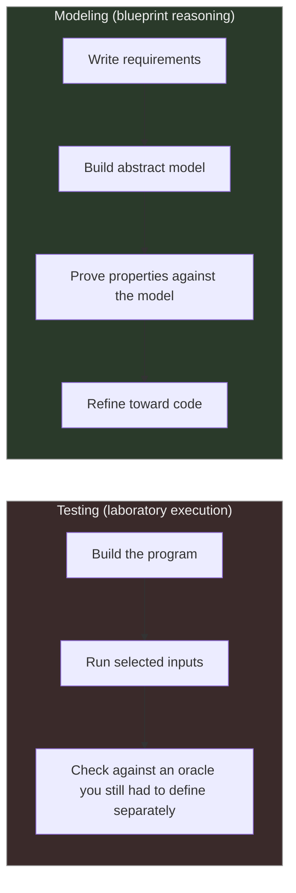
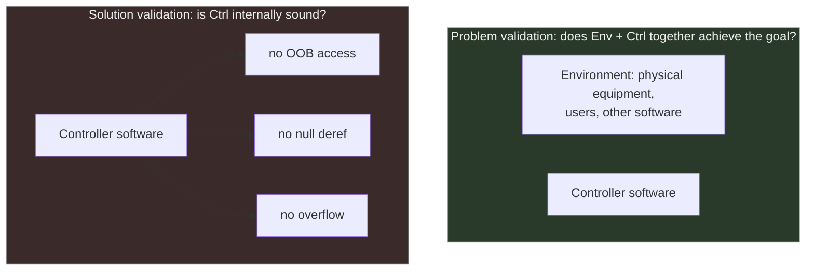

[[book-guidelines|↩ Back to guidelines]]

# Formal Methods and the Modeling Philosophy

## What breaks without this

Take the Ariane 5 maiden-flight crash: an arithmetic overflow in a piece of software that had been reused, unmodified, from Ariane 4. The code itself was not "buggy" in the usual sense — it did exactly what it was written to do. The catastrophe was a **mismatch between the software and the assumptions its environment now violated**, and nothing in the development process was positioned to catch that, because the process only ever asked "does the code do what the code says," never "does the *system* do what the *world* needs." Abrial opens the book by naming this gap directly, and the entire modeling philosophy is a response to it: you cannot test or verify your way to safety if the property you need was never written down as something to prove in the first place.

This is the thread that ties together requirements documents, blueprints, proof, and the testing-versus-proving debate. They are not four separate topics — they are four facets of one claim: **correctness has to be designed in before code exists, against a precisely stated target, using a method that can fail loudly when the target and the artifact disagree.**

## Formal methods versus testing

Abrial's case against testing-as-primary-validation is not "testing is unreliable" (though it is) — it's sharper than that. Testing is a *shortsighted operational view*: it only ever tells you about the specific executions you happened to run. It gives you no way to reason about the enormous or infinite space of behaviors you didn't test, and — critically — it gives you no oracle. To know whether a test passed, you need an independent statement of what "correct" means that doesn't itself come from running the program. Where does that statement come from, if not from a model built and reasoned about *before* the code exists?

Concretely, in his terms: testing is a "laboratory execution" performed on the final, already-built object. A formal model is reasoned about — via proof — *during construction*, the same way a civil engineer reasons about stresses on a bridge from its blueprint before pouring concrete. The engineer doesn't build the bridge first and then "test" whether it holds up.

This doesn't mean proof replaces testing outright for Abrial — later in the book he discusses **animation** (executing the model itself, not the final program) as a genuinely useful complement: a proof that can't be discharged tells you *something* is wrong, but staring at a failed sequent doesn't always tell you *what* went wrong at the level of your intent. Animating the model early — even at a very abstract refinement stage — lets you watch the model misbehave and connect that back to "oh, the requirements document didn't actually say what I meant." Proof and animation are doing different diagnostic jobs: proof finds internal inconsistency, animation finds a mismatch between the *proved* property and the *intended* one.

## Modeling as blueprint construction

The word "blueprint" is doing real conceptual work here, not just serving as a friendly metaphor. Abrial is explicit about what a blueprint *is not*: it's not a mock-up. You cannot drive the blueprint of a car — "the basis is lacking." A blueprint has no engine, no rubber tires; it is a **representation used to reason about a future artifact during its construction**, using dedicated background theories (strength of materials, fluid mechanics — in our case, classical logic and set theory).

Mature engineering disciplines (avionics, civil engineering, shipbuilding) treat blueprints as first-class deliverables, produced and refined *before* the physical build, and organized with three properties Abrial calls out specifically because Event-B mirrors all three structurally:

- **Sequenced, increasingly accurate versions.** A blueprint isn't drawn once — it's a sequence, each version adding detail invisible in the last. This is exactly Event-B's **refinement** (you'll meet it formally as its own topic, but the philosophical seed is planted right here: refinement isn't a nice-to-have technique, it's *how blueprinting has always worked* in every mature engineering discipline).
- **Decomposability**, for readability, when a single blueprint becomes too large to reason about as a whole.
- **Reusable libraries** of prior blueprints — the ancestor of Event-B's generic, instantiable developments (design patterns, later in the book).

The strong claim buried in this section is a *type distinction*, not a matter of degree: "in no way is the model of a program, the program itself." A model is not an under-specified or approximate program. It's a different kind of object, built to be reasoned about, not executed. This is worth sitting with because it's easy to slide into treating a formal spec as "pseudocode with extra rigor" — Abrial explicitly rejects that framing later, in Chapter 1's discussion of "pseudo-programming" (see below).

## Requirements document structure and traceability labels

Before any blueprint gets drawn, you need a statement of what the artifact is *for*. Abrial's diagnosis of why requirements documents fail in practice is specific: they are either "almost non-existent" or "far too verbose," and even when they're substantial, they conflate two things that need to stay separable:

- **Explanatory text** — prose that helps a first-time reader understand the intent, motivation, and context. Useful once, then increasingly a nuisance.
- **Reference text** — short, labeled, numbered, self-contained statements that *are* the actual requirements. These need to survive being read in isolation from all the explanation around them.

Abrial's own analogy for this split is a mathematics textbook: a numbered, specially-typeset theorem statement (the "requirement") versus the surrounding historical remarks and proof (the "explanation"). Once you know the material, you skip straight to the theorem statement; you don't re-read the historical preamble.

Practically, reference-text fragments get **labels by function** — the ones used throughout the book are:

| Label | Meaning |
|---|---|
| `FUN` | functional requirement |
| `ENV` | environment assumption |
| `SAF` | safety property |
| `DEG` | degraded-mode requirement |
| `DEL` | timing/delay requirement |

Each fragment is also numbered, and that number is the **traceability** key: the same `FUN-2`, `SAF-1`, etc. is expected to reappear, referenced by number, in the technical specification, the design, and eventually the implementation, so that at any later stage you can point at a line of reasoning (or a line of code) and say exactly which original requirement it discharges. This is the same discipline as a citation graph, or — if you think about it from the compiler side — the same discipline good static analyzers want from a *specification language*: an obligation that can be generated, and later discharged, and the discharge can be checked back against a specific labeled source. You'll see this idea return almost verbatim once **proof obligations** get formalized in Chapter 5: each proof obligation is itself a traceable, checkable "requirement" the model has to meet, generated mechanically rather than written by hand — the requirements-document discipline, replayed one level down at the level of individual model statements.

## Explanatory text versus reference text

This is really a corollary of the labeling discipline above, but it's worth isolating because it recurs as a design principle for *any* technical document a modeler produces — including, later, the models themselves. A well-formed Event-B development separates "here's why we're doing this" (explanatory) from "here's the actual invariant/guard/action" (reference) in exactly the same spirit: read the explanation once to build intuition, then work directly against the precise statement. The book's own worked-example chapters are structured this way — narrative motivation first, boxed formal machine/event text second — precisely because Abrial holds himself to the same separation he demands of a requirements author.

## Solution validation versus problem validation

This distinction, from the Prologue, is the sharpest formulation of "why do formal *modeling* at all, rather than just formally verifying the final code":

- **Solution validation** checks the constructed *software* against software-level properties — no out-of-bounds array access, no null-pointer dereference, no arithmetic overflow. This is what most static analysis and verification tooling targets, and it's valuable, but it is validating an artifact against internal-consistency properties of *itself*.
- **Problem validation** checks that the *overall system* — software, physical equipment, human operators, everything — achieves its actual purpose. For a train-control system, that purpose is "two trains never collide." No amount of solution validation (checking the train controller's code has no null-pointer bugs) gets you anywhere near proving that property, because the property isn't a fact about the code — it's a fact about a whole environment the code is embedded in.

The Ariane 5 failure is precisely a case where extensive solution-level rigor (the code was reused because it was trusted, well-tested software) coexisted with an absent problem-level property: nobody had modeled and proved the assumption the reused module depended on (bounded horizontal velocity) against the *new* rocket's actual flight profile.

Abrial flags a tempting shortcut here and rejects it: some practitioners try to smuggle problem-level reasoning into the solution by adding **ghost variables** — extra variables in the program purely to support a proof, stripped out before shipping. He calls this "a rather artificial afterthought": it keeps your attention fixed on the software when the property genuinely lives one level up, at the level of the system-plus-environment. His alternative is to model the *problem* — including an explicit model of the environment — first, prove the property there, and only then refine toward a program. Problem validation is a claim about a model of reality; it is therefore only ever as good as that environment model's own fidelity — Abrial is careful to call the resulting guarantee a **relative**, not absolute, faultlessness.

## Discovering requirements through failed proofs

This is the practical payoff of everything above, and it's the single idea Abrial calls "the heart of the modeling method." The claim: **a proof obligation that cannot be discharged is diagnostic information**, not just a dead end. When an automatic prover fails on a statement, there are exactly three possible reasons, and each one tells you something different to go fix:

1. The prover just isn't smart enough for this particular (true) statement → hand it to an interactive prover.
2. The statement is actually **false** → your model is wrong; something needs to change.
3. The statement can't be proved as it stands because the model is **too weak** — a hypothesis, guard, or invariant that should be there, isn't → the model needs to be *enriched*, not corrected.

Cases 2 and 3 are the interesting ones, and Abrial draws the analogy explicitly: proof plays the same role for a model that testing plays for a program — it's how you find the bugs. Except a proof failure doesn't just say "something's wrong somewhere," the way a failing test does; a specific stuck sequent points at a *specific missing fact*. You'll see this play out concretely once you reach the bridge-controller worked example (Chapter 2): a failed invariant-preservation proof there literally hands you the missing axiom or guard needed to fix the model — the proof failure *tells you the requirement you forgot to write down*. That is the mechanism this whole topic has been building toward: requirements discovery isn't a separate, earlier phase you finish before modeling starts — it's an activity that proof failure keeps performing for you throughout the modeling process. A weak requirements document isn't merely a documentation problem; it is exactly what a stuck proof obligation goes looking for.

There's a related trap worth naming explicitly, because Abrial does: confusing **modeling** with **pseudo-programming**. The initial model of a file-sorting routine should state what a sorted file *is* and how it relates to the unsorted input — it should not describe an algorithm for sorting. If your "model" already reads like an algorithm, you've skipped the step where proof could have told you something you didn't already know, because you never stated the property independently of a candidate solution.

## Where this leads

Every later topic in the book is a technical instrument built to serve this philosophy, not a free-standing formalism:

- **[[Discrete-Transition-Systems|Discrete Transition Systems]]** (state, events, guards, actions, invariants) is the concrete shape a "blueprint" takes once you commit to the state-and-transition view sketched informally at the end of Chapter 1.
- **The Event-B Notation** and **[[Proof-Obligation-Rules|Proof Obligation Rules]]** are how "prove the model against the requirements" gets made mechanical and repeatable, so that "a proof fails → the model is missing something" (this topic's central mechanism) becomes an automatable, per-statement, traceable process rather than an ad hoc argument.
- **[[Refinement-Theory|Refinement Theory]]** formalizes the "sequence of increasingly accurate blueprints" idea from this topic into a provable relationship between models.
- Every case-study chapter is, structurally, one long demonstration of requirements discovery via failed proofs, restaged in a new domain (bridges, protocols, circuits, trains).

**Bearing on the standing project:** the FUN/ENV/SAF/DEG/DEL traceability discipline, and the "proof failure ⇒ missing hypothesis" diagnostic loop, are the exact shape of what a Hoare-triple or refinement-type verifier needs to report back to a programmer — a *localized*, actionable reason a verification condition didn't discharge (missing precondition, missing loop invariant, missing case) rather than a bare "proof failed." The solution-validation/problem-validation split is also worth keeping in mind when scoping what your compiler's verifier can actually promise: type-and-contract checking against a spec is solution validation; whether the spec itself captures the real invariant a caller needs is a problem-validation question no type checker can answer for you.
