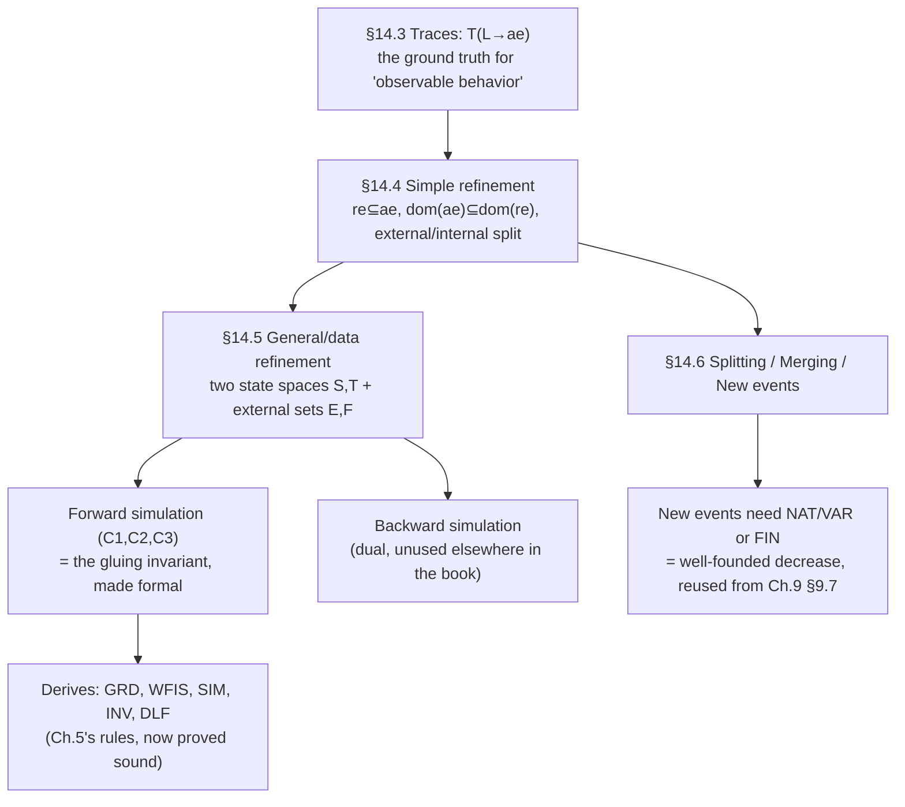

[[book-guidelines|↩ Back to guidelines]]

## Why "it looks the same from the outside" needs a theorem, not a slogan

Every case study in this book — the bridge controller, the file-transfer protocol, the leader-election ring — is built the same way: start with a wildly abstract, almost trivially-true model, then refine it, step by step, toward something concrete enough to implement. Chapters 2–13 use refinement constantly and justify each step with rules like GRD, SIM, and DLF applied informally, one worked example at a time. Chapter 14 is where the book stops trusting intuition and *proves* that those informal rules are sound — by going back to the one thing a user of a system can actually observe: **the sequence of states it passes through**, i.e., a trace. The whole chapter's ambition is captured in one sentence buried in §14.4.2: "acquiring a refined model instead of an abstraction must not be perceptible by the buyer." Everything else is that sentence, made precise enough to check mechanically.

This matters enormously for the standing compiler project. "Refinement" here is the direct proof-theoretic ancestor of **program refinement / stepwise data refinement** in the Hoare-logic tradition, and the machinery built in this chapter — projections onto an "external" observable interface, a gluing relation between abstract and concrete state, and simulation conditions that are *sufficient but not necessary* for full trace inclusion — is essentially the same machinery a refinement-type or contract-based verifier needs when checking that an optimized/lower-level implementation still satisfies a higher-level specification.

## What breaks without trace comparison as the yardstick

Why not just say "a refined model preserves the invariant" and stop there? Because invariant preservation alone says nothing about *behavior* — it doesn't rule out a "refinement" that satisfies its invariant by doing almost nothing (e.g., getting permanently stuck). Chapter 5's INV/GRD/SIM rules are enormously useful in practice, but their *justification* requires comparing what a user can actually witness across a run of the system — its trace — because that is the only thing "looks the same from the outside" can mean operationally. Skipping straight to invariant-based rules without ever grounding them in trace comparison would leave you unable to answer: sound with respect to *what*, exactly?

## Traces: giving "observable behavior" a mathematical shape

§14.3 formalizes a **trace** as a finite, non-empty sequence of observed states such that (i) it has length $\ge 1$, (ii) its first element lies in the system's initializing set $L$, and (iii) consecutive elements are related by the union of the events' before-after predicates. Given a carrier set $S$, initializing set $L \subseteq S$, and global transition relation $ae \in S \leftrightarrow S$ (the union of every individual event's relation $ae_i$), the set of traces is:

$$n \to t \in T(L \to ae) \iff n \in \mathbb{N}_1 \wedge t \in 1..n \to S \wedge t(1) \in L \wedge \forall i \in 1..n{-}1 \cdot t(i) \to t(i+1) \in ae$$

The worked example — the action/weak-reaction pattern from Chapter 3 — has a nice property the book flags explicitly: *every* non-empty prefix of a trace is itself a trace, and a system can be characterized by whether its traces are all extendable forever, all eventually stuck (deadlock), or a mix of both. This closed-form, purely relational definition of "everything a running program could ever be observed to do" is exactly the object a symbolic-execution or model-checking engine is trying to *approximate finitely* — a trace set is the full unrolled reachability tree, and every abstract-interpretation technique in the standing project's goals exists precisely because $T(L \to ae)$ is usually infinite and needs to be over-approximated soundly rather than enumerated.

## Simple refinement: "you can't tell them apart from the traces"

§14.4 introduces refinement via the companion action/**strong**-reaction example: same state, stronger guards, and — crucially — its transition graph turns out to be a strict subgraph of the weak-reaction system's graph, so *every* trace of the strong-reaction system is also a trace of the weak one. This is refinement in its rawest form: **the refined system's trace set is a subset of the abstraction's.**

But the book is careful to show this naive statement is too weak on its own: a model with an *empty* trace set (one that deadlocks immediately at initialization) trivially has all its traces be traces of any abstraction, yet calling that a valid refinement is absurd — a refinement that never runs is not "the same system, more concrete," it's a different, broken system. Two extra conditions repair this:

- **Non-emptiness of the initial set**: $M \ne \emptyset$.
- **Relative deadlock freedom**: if the abstraction *could* extend a given (shared) trace further, the refinement must be able to as well — a refined trace must not get stuck earlier than the corresponding abstract behavior would allow.

Putting this together yields the formal sufficient conditions (I), given a shared carrier $S$, abstract initial set $L$ and transition relation $ae$, and concrete initial set $M$ and transition relation $re$:

$$M \subseteq L \qquad M \ne \emptyset \qquad re \subseteq ae \qquad \mathrm{dom}(ae) \subseteq \mathrm{dom}(re)$$

Read the last condition carefully: it says *wherever the abstraction could still move, the refinement can still move too* — this is exactly **relative deadlock freedom**, generalized from a single-event obligation to a whole-system one, and it is the formal reason [[Discrete-Transition-Systems|Discrete Transition Systems]]' informal DLF discussion insists a refinement must not introduce *new* stuck states beyond what the abstraction already permitted.

Refining conditions (I) event-by-event (rather than only on the unioned relations) gives conditions (II) — $re_1 \subseteq ae_1, \ldots, re_n \subseteq ae_n$ plus the same domain condition on the *unions* — which is the shape you actually check in practice: **one refinement proof per event**, exactly matching how Rodin generates one GRD/SIM obligation per event rather than one monolithic obligation for the whole machine.

## External vs. internal variables: refinement is relative to what you agree to watch

§14.4.6–14.4.7 makes a subtle but essential move: the "state" a model manipulates is usually richer than what an observer is entitled to compare across refinement levels. The chapter's own example (borrowed from the action/reaction design patterns of Chapter 3) adds internal counters $ca, cr$ tracking *how many times* the action/reaction have fired — bookkeeping invisible to an external user who only sees the current on/off values $a, r$. **External variables** are the ones refinement is checked against; **internal variables** are free to change however the implementation likes, as long as the externally-visible behavior matches.

Formally, this is a projection $f \in S \to E$ onto an *external set* $E$, and the refinement conditions get re-stated not on the raw relations but on their **projections**: $f^{-1}\,;\,re_i\,;\,f \subseteq f^{-1}\,;\,ae_i\,;\,f$ (conditions III). This is precisely **behavioral/observational equivalence up to a chosen interface** — the same idea as a Rust trait's public API being the contract while private fields and helper methods are free to change between implementations, or a module's *observable effects* (its I/O, its return values) being what a specification constrains while its internal representation is unconstrained. If your compiler project ever needs to state "this optimized data structure is a valid refinement of this reference implementation," this external/internal split is exactly the right lens: the refinement proof obligation should only ever quantify over the externally observable projection, never over incidental representation choices.

## General (data) refinement: changing the state space itself

§14.5 generalizes one step further — what §14.4 covers assumes both models share the same carrier set $S$. **General refinement**, also called **data refinement**, additionally allows the concrete model to use an entirely different state space $T$. Now there are two external sets: $E$ (what the abstraction shows) and $F$ (what the refinement shows), related by a total function $h \in F \to E$ that reconstructs the abstract observation from the concrete one — $h$ must be a genuine *function* (not merely a relation) precisely because "no information the abstraction promised to reveal may be lost when reconstructing it from the concrete observation."

The ultimate definition of refinement (condition IV) says: event $ae_i$ is refined by $re_i$ exactly when $g^{-1}\,;\,re_i\,;\,g \subseteq h\,;\,f^{-1}\,;\,ae_i\,;\,f\,;\,h^{-1}$ — i.e., navigating from a concrete-external observation back through the refinement and out again must never produce a pair that couldn't *also* be produced by navigating through the abstraction. This is refinement as **commuting-diagram containment**, the same shape of correctness statement used to justify a compiler pass: "run the optimized code and observe externally" must be included in "run the reference semantics and observe externally," for every reachable external observation — precisely a **simulation-based compiler-correctness argument**, generalized.

## The gluing invariant, made rigorous: forward simulation

Condition (IV) is elegant but painful to use directly (it's stated purely in terms of relation composition on external projections, hiding the internal state entirely). §14.5.3 derives a genuinely usable *sufficient* condition: **forward simulation**, built around a total relation $r \in T \twoheadleftrightarrow S$ from concrete state to abstract state — this $r$ *is* the formal object underlying every informal "gluing invariant" $J(v,w)$ used throughout the book's case studies. Three conditions:

$$r^{-1}\,;\,g \subseteq f\,;\,h^{-1}\quad(C1) \qquad r^{-1}\,;\,re_i \subseteq ae_i\,;\,r^{-1}\quad(C2) \qquad g^{-1} \subseteq h\,;\,f^{-1}\,;\,r^{-1}\quad(C3)$$

$C1$ says the gluing relation is *consistent* with how each side projects to its external set. $C2$ — the heart of the argument — says: whatever the concrete event $re_i$ can do, stepping back through the gluing relation, the abstract event $ae_i$ could have matched it (this is "simulation" in the classical sense: every concrete move is matched by an abstract move). $C3$ turns out to be **derivable from $C1$ plus $r$ being total** — a clean example of a proof obligation collapsing once you notice a structural property ($r$'s totality) does the remaining work for you, the kind of simplification worth hunting for when designing your own proof-obligation generator rather than stating every condition independently.

Substituting the book's standard machine/refinement templates — abstract event `when $G_i(v)$ then $v :\!\mid R_i(v,v')$ end`, concrete event `when $H_i(w)$ with $P(v',w,w')$ then $w :\!\mid S_i(w,w')$ end`, gluing invariant $J(v,w)$ — into $C2$ and mechanically unfolding the relational composition **derives exactly** the [[Proof-Obligation-Rules|proof obligation rules]] used informally throughout the book:

$$\dfrac{I(v),\,J(v,w),\,H_i(w) \vdash G_i(v)}{}\;\text{GRD} \qquad \dfrac{I(v),\,J(v,w),\,H_i(w),\,S_i(w,w') \vdash \exists v' \cdot P(v',w,w')}{}\;\text{WFIS}$$

$$\dfrac{\cdots,\,P(v',w,w') \vdash R_i(v,v')}{}\;\text{SIM} \qquad \dfrac{\cdots,\,P(v',w,w') \vdash J(v',w')}{}\;\text{INV (refinement)}$$

and relative deadlock freedom becomes $I(v), J(v,w), G_1(v)\vee\cdots\vee G_n(v) \vdash H_1(w)\vee\cdots\vee H_n(w)$ (`DLF`). This is the single most important payoff of the whole chapter for a formal-methods-minded compiler builder: **every rule that Chapter 5 introduced as "here's how you check a refinement" is here *derived*, not stipulated**, from one clean semantic principle (forward simulation of external observations via a total gluing relation). If you are building your own kernel's refinement/subtyping checker, this derivation is the template: state the semantic notion of correctness once (trace/observation inclusion), find a syntactically checkable sufficient condition (a simulation relation), and prove your concrete proof-obligation rules are sound with respect to that semantic notion — never the reverse order.

### Backward simulation, briefly

§14.5.4 gives the dual condition, **backward simulation** ($C2'$: $r^{-1}\,;\,re_i^{-1} \subseteq ae_i^{-1}\,;\,r^{-1}$, i.e. simulating in the *reverse* direction), and proves it equally sufficient — but the book explicitly never uses it again. It's worth knowing it exists (backward simulation becomes essential precisely when a refinement resolves non-determinism *retroactively*, in a way forward simulation cannot witness — a classic gap in the refinement-calculus literature), even though this book's worked examples never hit that case.

### Composing simulations across a trace

§14.5.5 shows forward simulation composes cleanly: if $ae_i$ is refined by $re_i$ and $ae_j$ by $re_j$, then the two-event trace $ae_i \,;\, ae_j$ is refined by $re_i \,;\, re_j$ — a two-line algebraic proof chaining $C2$ twice via monotonicity of relational composition. This closes the loop back to §14.3's trace semantics: **event-by-event simulation proofs really do add up to whole-trace refinement**, which is what justifies checking refinement locally (one event at a time, as Rodin does) instead of globally (over entire runs, which would be intractable).

## Splitting, merging, and new events: relaxing the one-to-one assumption

§14.6 lifts the last unrealistic restriction — that every concrete event corresponds to exactly one abstract event.

**Splitting**: an abstract event $ae_i$ may be refined by *several* concrete events $re_{i1}, re_{i2}, \ldots$, each independently proved to refine $ae_i$ — the informal picture from Chapter 7's Simpson-mechanism development (Writer split into `Writer_1..5`) is exactly this.

**Merging**: two abstract events $ae_i, ae_j$ (sharing the same variables and, notably, the *same actions* $S$) may be merged into one concrete event $re_{ij}$ that refines their union $ae_i \cup ae_j$, giving the merging obligation:

$$\dfrac{I(v),\,R(v) \vdash P(v) \vee Q(v)}{}\;\text{MRG}$$

— the concrete guard $R(v)$ must imply that at least one of the two abstract guards held. This is the formal justification behind the electronic-circuit chapter's `bool(...)`-based event merging in [[Advanced-Data-Structures|the circuit development method]] (Chapter 8).

**New events** are the trickiest: transitions with *no abstract counterpart at all*, visible only at the refined level. Formally, a new event $ne_k$ must refine the "do-nothing" pseudo-event `skip` — $r^{-1}\,;\,ne_k \subseteq r^{-1}$ — meaning it must preserve the gluing relation without corresponding to any observable abstract step, with its own adapted INV obligation $I(v), J(v,w), N_k(w), T_k(w,w') \vdash J(v,w')$. Relative deadlock freedom is correspondingly relaxed to allow the disjunction of new-event guards to also satisfy the obligation: $\ldots \vdash H_1(w) \vee \cdots \vee H_n(w) \vee N_1(w) \vee \cdots \vee N_m(w)$.

### Why new events need a decreasing variant

A sequence of new events between two "real" (old) events must be **guaranteed finite**, or the refined trace could stall forever inserting new-event steps and never actually reach the point where it matches the next abstract transition — which would violate relative deadlock freedom in spirit even while satisfying it formally at each individual step. This is exactly why **convergence** enters the picture: a natural-number variant $V(w)$ that every new event must strictly decrease (`NAT`/`VAR`), or a finite set $S(w)$ that must strictly shrink (`FIN`/`VAR`):

$$\dfrac{I(v),\,J(v,w),\,N_k(w) \vdash V(w) \in \mathbb{N}}{}\;\text{NAT} \qquad \dfrac{I(v),\,J(v,w),\,N_k(w),\,T_k(w,w') \vdash V(w') < V(w)}{}\;\text{VAR}$$

This is not a separate, ad hoc rule — it is the *exact same* well-founded-decrease argument used to prove structural or numeric-variant induction terminates in [[Advanced-Data-Structures|Advanced Data Structures]], now aimed at ruling out an infinite "silent" chain of internal transitions between externally-observable events. If you are building a symbolic-execution or CEGAR-style verifier, this is the precise proof obligation you need whenever your refined model introduces internal scheduling/bookkeeping steps ("silent transitions" in a labeled-transition-system sense) between the steps a user-facing specification actually names — a well-founded decrease on those silent steps is required for the refinement to remain sound, not merely convenient.

## Where this leads

Chapter 14 is the book's proof that everything Chapter 5's proof-obligation rules told you to check informally is *actually sufficient* for the property you really care about — that a refined system's every observable behavior is one the abstraction already sanctioned. For the standing compiler project, this is close to a worked template for **soundness proofs of an optimizing/lowering pass**: define the semantics as trace/observation sets, define a candidate simulation relation as your "gluing invariant" between source and target representations, and derive syntax-directed proof obligations from it rather than inventing them ad hoc. The same architecture underlies proving a **CEGAR refinement loop** sound (an abstract counterexample must correspond to a genuine concrete trace, or be ruled out by refining the abstraction — precisely a forward-simulation-style argument run in reverse), and the new-events/variant machinery here is the direct formal ancestor of proving that inserted scheduling or bookkeeping steps in a lowered IR cannot introduce unbounded "administrative" stuttering that would make a compiler's output technically non-terminating where the source was not.
