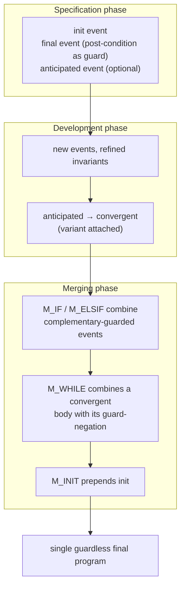

# Sequential Program Derivation

[[book-guidelines|↩ Back to guidelines]]

## Why a formal modeling book needs a chapter on *writing programs*

Every previous chapter in this book built event systems that stay abstract forever — controllers, protocols, circuits that just keep reacting. This chapter does something different: it derives an honest-to-goodness sequential program, the kind with `while` and `if` and a beginning and an end, and it proves that program correct *by construction* rather than verifying it after the fact.

The obvious approach — write one big non-deterministic "formula" describing the whole computation, then gradually transform it into code — is the one Abrial explicitly rejects. His reasoning is worth sitting with, because it's really an argument about proof engineering, not about programs:

> "In order to prove a large formula, a logician usually breaks it down into various pieces, on which he performs some simple manipulations before putting them together again in a final proof."

That's the whole design philosophy of this chapter in one sentence. Instead of transforming a monolithic specification, Abrial decomposes the *future program* into independent guarded actions first — proves each one correct in isolation — and only at the very end reassembles them into a single piece of imperative syntax. Scheduling (the `while`/`if`/`;` structure that a real program needs) is deferred to the last possible moment. **[[Discrete-Transition-Systems#What breaks without this|What breaks without this]]**: if you try to refine one giant specification formula toward an executable program, every refinement step has to simultaneously juggle control flow *and* data-flow correctness, and the proof obligations balloon combinatorially. By decoupling "what each piece of code does" from "in what order the pieces run," each obligation stays local and small.

For the reader's compiler/elaborator project this chapter is unusually load-bearing: it is, almost literally, a worked example of deriving a Hoare-verified imperative program from a specification, where the mechanism *is* the standard while-rule of Hoare logic, made completely explicit and mechanical. If you've ever wondered what it would look like to have a "compiler pass" that turns a set of guarded pre/post-condition pairs into structured control flow with a loop-invariant/variant pair already attached — that is exactly what Section 15.3's merging rules do.

## Naked events and implicit scheduling

### The core idea

A sequential program is "assignments glued together by constructs" — sequencing (`;`), `while`, `if`. Take this example, given up front as the target:

```
while j ≠ m do
   if g(j+1) > x then
      j := j + 1
   elsif k = j then
      k, j := k + 1, j + 1
   else
      k, j, g := k + 1, j + 1, swap(g, k+1, j+1)
   end
end ;
p := k
```

Abrial's method starts by *undoing* the scheduling. Each assignment is pulled out into its own **naked event**: a `when`-guarded action with no explicit place in a control-flow graph. The guard is just the conjunction of every condition the assignment sat underneath in the original program. So `k, j := k+1, j+1` (nested inside the loop, past the first `if` branch, inside the `elsif`) becomes:

```
when
  j ≠ m
  g(j+1) ≤ x
  k = j
then
  k := k + 1
  j := j + 1
end
```

Scheduling among the naked events is left to an **implicit hidden scheduler** — operationally, something that fires any event whose guard currently holds. Abrial calls this "an initial implicit distribution of the computation over a centralized explicit one." The point isn't that the hidden scheduler is a real runtime component; it's a *design discipline*: during development you get to reason about each event's correctness against the invariant in complete isolation from every other event, because nothing yet commits to when it fires relative to the others. Only in the merging phase (Section 15.3) does explicit control flow get reconstructed — and at that point it's reconstructed mechanically, by rule, not by hand.

**What breaks without this**: if events keep their scheduling attached while you're still deciding what each one does, every change to one piece of logic risks invalidating reasoning about neighboring pieces' control-flow interactions. Naked events give you the same kind of independence that pure functions give you over stateful ones — you can refine, reorder your thinking about, or even discard a naked event without re-deriving anyone else's proof obligations.

### The three-phase method

The chapter's method has exactly three phases:

1. **Specification phase.** Besides an `init` event, the system has a single guarded `final` event with no action — its guard *is* the post-condition. There may also be an **anticipated event**, a placeholder standing in for "the computation still has more work to do."
2. **Development phase.** New events get added, or anticipated events get refined into **convergent** ones (see next section), by ordinary Event-B refinement — new state variables, strengthened invariants, narrowed non-determinism.
3. **Merging phase.** Once every piece is "on the table," systematic **merging rules** (Section 15.3) combine events pairwise, eliminating guards, until a single guardless pseudo-event remains. That pseudo-event *is* the final program body.



### Encoding a Hoare triple as an event system

Section 15.1.4 shows the mechanical translation that makes everything else possible: a program $P$ with pre-condition and post-condition,
$$\{Pre\}\ P\ \{Post\}$$
becomes: parameters → constants, $Pre$ → axioms on those constants, results → variables, and $Post$ → the guard of a `final` event whose action is `skip`. This is not a loose analogy — it is exactly how the book represents every one of the nine worked examples: an axiom block encodes the precondition, and a guarded-skip `final` event encodes the postcondition as a reachability target. Proving "the merged final program refines this abstraction" *is* proving the Hoare triple.

```rust
// The Event-B encoding, read as a Rust-shaped mental model:
// constants ~ function parameters with axiom-encoded preconditions
struct SearchParams {
    n: usize,          // axm0_1: n ∈ ℕ
    f: Vec<i64>,        // axm0_2: f ∈ 1..n → S  (1-indexed in the book)
    v: i64,             // axm0_3: v ∈ ran(f)
}
// the `final` event's guard IS the postcondition of `search`:
//   r ∈ 1..n  ∧  f(r) = v
// `skip` as the action means: once this guard holds, we're done —
// no more state change is needed. The whole derivation's job is to
// build a program that *reaches* a state where this guard holds.
```

## Anticipated and convergent event status

An **anticipated event** is a deliberately non-deterministic placeholder for "progress still needs to happen" — in the search example:

```
progress
  status
     anticipated
  then
     r :∈ ℕ
  end
```

It says almost nothing: `r` becomes *some* natural number. This is legal in Event-B specifically because anticipated events are exempt from proving they *decrease* toward termination — they only promise not to *increase* whatever variant will eventually be attached (a promise discharged automatically once no variant yet exists). This is the same non-deterministic-witness technique used earlier in the book (Ch. 4 §7, Ch. 6 §4.2) for "we know something changes, we don't yet know how."

Refinement then turns the anticipated event **convergent**: it gets a real action, a strengthened guard, and — critically — a **variant**, a natural number expression the book requires to *strictly decrease* on every firing of the event. For `search`:

```
progress
  status
     convergent
  when
     f(r) ≠ v
  then
     r := r + 1
  end
```
with `variant1: n − r`. Concretely, `r` walks up through the array; `n − r` measures how much unexplored array remains, and it strictly shrinks each step.

**This is the loop variant of Hoare logic, stated as an Event-B status.** The connection to the reader's compiler project is direct and worth naming explicitly: proving an event convergent under a variant $V(w) \in \mathbb{N}$ is *exactly* proving loop termination the way a Hoare-logic verifier or an abstract-interpretation-based terminator would — exhibit a well-founded measure that decreases on every iteration of the loop body. When this chapter's merging rule (`M_WHILE`, next section) later turns a convergent event into a `while` loop body, that variant becomes literally the loop's termination measure, and it is available *before* the loop syntax even exists, because it was proved during the naked-event phase. A termination-checking pass in your compiler that wants a per-loop ranking function has, in this method, a natural place to get one: attach it to the naked event before scheduling is even decided, rather than trying to recover it after the fact from finished loop syntax.

**What breaks without this two-status split**: if every event had to carry a variant from the start, you couldn't use non-deterministic placeholders during early specification — you'd be forced to commit to a termination argument before you even know the final shape of the computation. Anticipated status buys you the ability to say "this makes progress, eventually, somehow" and defer the "how" and "why it terminates" to later refinement, exactly the way a type-and-effect system might let you defer totality-checking of a recursive function until its body is filled in.

## Merging rules: turning proofs into control flow

This is the mechanical heart of the chapter, and the piece most directly reusable as a compiler pass. Given naked events already proved individually correct, four rules assemble them into structured imperative syntax.

### M_IF — the conditional-merge rule

Two events sharing a common guard $P$, with complementary guards $Q$ and $\neg Q$ on top of it:

$$
\begin{array}{ll}
\texttt{when}\ P,Q\ \texttt{then}\ S\ \texttt{end} \\
\texttt{when}\ P,\neg Q\ \texttt{then}\ T\ \texttt{end}
\end{array}
\quad\Longrightarrow\quad
\texttt{when}\ P\ \texttt{then if}\ Q\ \texttt{then}\ S\ \texttt{else}\ T\ \texttt{end end}
$$

**Precondition**: both antecedent events must have been introduced at the same refinement level. No termination concern here — an `if` doesn't loop, so there's nothing to bound. The merged pseudo-event inherits that same level.

### M_WHILE — the loop-merge rule

Same shape of antecedents — a common guard $P$ split by $Q$ / $\neg Q$ — but interpreted as loop body vs. loop exit:

$$
\begin{array}{ll}
\texttt{when}\ P,Q\ \texttt{then}\ S\ \texttt{end} \\
\texttt{when}\ P,\neg Q\ \texttt{then}\ T\ \texttt{end}
\end{array}
\quad\Longrightarrow\quad
\texttt{when}\ P\ \texttt{then while}\ Q\ \texttt{do}\ S\ \texttt{end}\ ;\ T\ \texttt{end}
$$

**Precondition (exact, verbatim from the source)**: *"the first antecedent event (that giving rise to the 'body' $S$ of the loop) appears as new or non-anticipated, thus convergent, at one refinement level below that of the second one. In this way, we are certain that there exists a variant ensuring that the loop terminates. Moreover, the first event must keep the common condition $P$ invariant."* The merged event is considered to "appear" at the level of the *second* antecedent event (the exit event).

This is, almost word for word, the standard Hoare while-rule:

$$\dfrac{\{P \land Q\}\ S\ \{P\}}{\{P\}\ \texttt{while}\ Q\ \texttt{do}\ S\ \texttt{end}\ \{P \land \neg Q\}}$$

— except Event-B's proof obligations for a convergent event *already* discharged the "$S$ preserves $P$" and "$S$ strictly decreases a variant" side conditions, back when $S$ was still a naked event, long before anyone wrote `while`. **M_WHILE doesn't add a new proof; it recognizes that an already-completed proof licenses a particular piece of syntax.** That is the sense in which this chapter turns Hoare-logic verification into program *[[Case-Study-Bridge-and-Press-Controllers#Synthesis|synthesis]]*: the syntax is derived from, not checked against, the proof.

If M_IF is applicable when both events sit at the same level and neither is a loop body, M_WHILE is applicable exactly when one of them is a proven-convergent refinement of the other — the two rules have "incompatible side conditions," so there's never ambiguity about which applies. When $T$ reduces to `skip`, the rule simplifies (drops the trailing `; T`); when the common guard $P$ is absent, the merged pseudo-event is simply unguarded.

### M_ELSIF — chaining conditionals

A specialization of M_IF for when one antecedent event's action is *already* an `if`:

$$
\begin{array}{ll}
\texttt{when}\ P,Q\ \texttt{then}\ S\ \texttt{end} \\
\texttt{when}\ P,\neg Q\ \texttt{then if}\ R\ \texttt{then}\ T\ \texttt{else}\ U\ \texttt{end end}
\end{array}
\quad\Longrightarrow\quad
\texttt{when}\ P\ \texttt{then if}\ Q\ \texttt{then}\ S\ \texttt{elsif}\ R\ \texttt{then}\ T\ \texttt{else}\ U\ \texttt{end end}
$$

This is exactly how the introductory search-with-swap example's three-way branch gets built up — two applications of M_IF/M_ELSIF chained.

### M_INIT — closing the derivation

Once repeated M_IF/M_WHILE/M_ELSIF applications collapse everything to a single guardless pseudo-event, M_INIT prepends the `init` event's action, producing the final program. This is purely syntactic — the semicolon is the only "rule" — but it's the step that turns a pseudo-event into something with the shape `assignments ; loop-and-if-structure` that a real programming language accepts.

```rust
// M_WHILE as a compiler-pass sketch: given two proof-carrying "naked events"
// (guard, body, optional variant/convergent-status), decide whether they're
// mergeable and into what syntax.
enum EventStatus { Ordinary, Anticipated, Convergent { variant: Expr } }

struct NakedEvent {
    common_guard: Option<Pred>,   // P
    split: Pred,                  // Q  (this event is guarded by P ∧ split)
    action: Stmt,                 // S
    level: RefinementLevel,
    status: EventStatus,
    preserves_common_guard: bool, // proved: {P ∧ Q} action {P}
}

fn try_merge(body: &NakedEvent, exit: &NakedEvent) -> Option<Stmt> {
    let same_common = body.common_guard == exit.common_guard;
    let complementary = body.split == negate(&exit.split);
    if !(same_common && complementary) { return None; }

    match &body.status {
        EventStatus::Convergent { .. }
            if body.level < exit.level && body.preserves_common_guard =>
        {
            // M_WHILE: proof obligations already discharged upstream —
            // this is where the *proof* becomes *syntax*.
            Some(Stmt::Seq(
                Box::new(Stmt::While(exit.split.clone(), Box::new(body.action.clone()))),
                Box::new(exit.action.clone()),
            ))
        }
        _ if body.level == exit.level => {
            // M_IF
            Some(Stmt::If(exit.split.clone(), // Q on the "then" branch per the book's convention
                Box::new(body.action.clone()),
                Box::new(exit.action.clone())))
        }
        _ => None, // neither rule's side condition holds — not yet mergeable
    }
}
```

## Worked example: search (establishing the pattern)

The chapter's first example fixes the template every later example follows. Specification: array `f : 1..n → S`, value `v ∈ ran(f)`, find `r` with `f(r) = v`:

$$\left(\begin{array}{l}n\in\mathbb N\\ f\in 1..n\to S\\ v\in\operatorname{ran}(f)\end{array}\right)\ \ \texttt{search}\ \ \left(\begin{array}{l}r\in 1..n\\ f(r)=v\end{array}\right)$$

Refinement adds `inv1_1: r ∈ 1..n`, `inv1_2: v ∉ f[1..r-1]` (everything before `r` has already been ruled out), and `variant1: n − r`. The anticipated `progress` becomes convergent:

```
progress
  status convergent
  when f(r) ≠ v
  then r := r + 1
  end
```

M_WHILE merges `progress` (body, convergent, guard `f(r) ≠ v`) with `final` (exit, guard `f(r) = v` — the complement) into `while f(r) ≠ v do r := r+1 end`; M_INIT prepends `r := 1`:

```rust
fn search(f: &[i64], v: i64) -> usize {
    // Precondition: v ∈ f (encoded as axm0_3 in the Event-B model — the
    // caller's responsibility, not this function's; a refinement-typed
    // signature would carry it as f: {f: &[i64] | v ∈ f} rather than a comment.
    let mut r = 1;                 // r := 1          (M_INIT)
    while f[r - 1] != v {          // while f(r) ≠ v   (M_WHILE, guard = ¬final's guard)
        r += 1;                    // r := r + 1       (the convergent body, variant n−r)
    }
    r                               // final's guard f(r) = v now holds
}
```

The `n − r` variant is exactly what a termination-checker would need to synthesize or check for this loop — and here it was proved *before* the loop existed as syntax.

## Worked example: binary search — the highest-value case

Same specification as `search`, but `f` is now sorted (`axm0_4`, non-decreasing). This is the example to internalize in full, both because binary search is the canonical loop-invariant exercise and because the book's derivation makes the invariant's *provenance* completely transparent — most textbook presentations just assert the invariant; here you watch it get built.

**First refinement.** Introduce bounds `p, q ∈ 1..n` with `r ∈ p..q` and — the invariant doing the real work — `v ∈ f[p..q]`: the answer is guaranteed to still be inside the shrinking window. `variant1: q − p`.

Two convergent events `inc`/`dec` refine the single anticipated `progress`, splitting on which side of `v` the probe `f(r)` falls:

```
inc                              dec
  refines progress                 refines progress
  status convergent                status convergent
  when f(r) < v                    when v < f(r)
  then                              then
    p := r + 1                        q := r − 1
    r :∈ r+1..q                       r :∈ p..r−1
  end                                end
```

Note `r` is still chosen non-deterministically within the new bound — the interval narrows, but *where* inside it `r` lands next is unconstrained. That non-determinism is exactly what the **second refinement** eliminates by picking the midpoint deterministically: `r := (1+n)/2` at init, `r := (r+1+q)/2` in `inc`, `r := (p+r−1)/2` in `dec`. The "main proof" the book flags here is feasibility: showing `(r+1+q)/2 ∈ r+1..q` is non-empty follows directly from the *abstract* `inc` event's own feasibility proof (the interval `r+1..q` was already proved non-empty one level up) — refinement doesn't have to redo that argument, only transport it.

**Merging.** `inc` and `dec` share complementary guards derived from `f(r) < v` / `v < f(r)` (with `f(r) = v` as the boundary that routes to `final` instead) — M_IF merges them into `inc_dec`; M_WHILE then merges `inc_dec` with `final` (guard `f(r) = v`, the loop-exit condition):

```
bin_search_program
  p, q, r := 1, n, (1+n)/2 ;
  while f(r) ≠ v do
     if f(r) < v then
        p, r := r + 1, (r+1+q)/2
     else
        q, r := r − 1, (p+r−1)/2
     end
  end
```

```rust
fn binary_search(f: &[i64], v: i64) -> usize {
    // Loop invariant (Hoare-logic reading of inv1_1..inv1_4, carried across
    // every iteration): p ≤ r ≤ q  ∧  v ∈ f[p..=q]  ∧  f sorted non-decreasing.
    // Loop variant: q − p  (strictly decreases: each branch shrinks the window).
    let (mut p, mut q) = (1usize, f.len());
    let mut r = (1 + f.len()) / 2;
    while f[r - 1] != v {
        if f[r - 1] < v {
            p = r + 1;
            r = (r + 1 + q) / 2;
        } else {
            q = r - 1;
            r = (p + r - 1) / 2;
        }
    }
    r
}
```

The value of walking through this in full: the invariant `v ∈ f[p..q]` and the variant `q − p` are not textbook folklore you're asked to trust — they're each attached to a specific naked event, each discharged by a specific, local proof obligation, and each survives into the final loop only because M_WHILE's precondition *requires* the convergent status (and hence the variant) to already exist. If you were building an invariant-synthesis pass for a refinement-type checker, this derivation is a template: propose the shrinking-window invariant as an abstract-interpretation lattice element (interval domain over `[p, q]` combined with a membership fact `v ∈ f[p..q]`), verify it's preserved per-branch, and the loop's correctness (partial correctness *and* termination) falls out simultaneously.

## The remaining examples, more concisely

The rest of the chapter is the same method applied to increasingly interesting state shapes. Once the pattern above is internalized, each one is best read as "which invariant, which variant, which merging rule":

- **Minimum of an array (§15.5).** Indices `p ≤ q` narrow toward the minimum: `inc`/`dec` compare `f(p)` vs `f(q)` and shrink from whichever end is provably not the minimum, guarded by `inv1_4: min(ran(f)) ∈ f[p..q]`. Structurally a mirror of binary search without the midpoint arithmetic — proof left to the reader in the source.

- **Array partitioning (§15.6, Quicksort-style).** Three convergent events (`progress_1/2/3`) refine one anticipated `progress`, walking index `j` up while maintaining `k ≤ j` as the boundary between "known ≤ x" and "known > x" prefixes (`inv1_5`, `inv1_6`). Merges (via nested M_IF/M_ELSIF, mirroring the chapter's opening example) into:
  ```
  while j ≠ n do
     if g(j+1) > x then j := j + 1
     elsif k = j then k, j := k+1, j+1
     else k, j, g := k+1, j+1, swap(g, k+1, j+1)
     end
  end
  ```
  — literally the motivating example from Section 15.1, now derived rather than assumed.

- **Simple sorting (§15.7, selection-sort-style).** A sorted prefix `1..k−1` grows one element per outer-loop iteration; each iteration runs a *nested* inner loop (indices `j`, `l`) hunting for the minimum of the unsorted suffix. Notable because it's the chapter's only doubly-nested-loop derivation, produced by merging an inner `while` first and treating the resulting pseudo-event as an ordinary event body for the outer M_WHILE application — direct evidence that the merging rules compose recursively over nesting depth, not just flatly.

- **Array reversing (§15.8).** Two indices `i, j` converge from opposite ends (invariant `i + j = n + 1`), swapping and stepping inward until `i ≥ j`. The cleanest possible M_WHILE instance — single convergent event, no `if` needed at all:
  ```
  i, j, g := 1, n, f ;
  while i < j do
     i, j, g := i+1, j−1, swap(g, i, j)
  end
  ```

- **Reversing a linked list (§15.9) — pointer-based.** Genuinely different in kind from the array examples: state is a *chain relation* `c ∈ S ↔ S` rather than an indexed array, and the invariants use `cl(c)`, the irreflexive transitive closure of `c` (defined earlier, Ch. 9 §9.7.1), to talk about reachability along pointers instead of arithmetic over indices. Three successive refinements: (1) split `c` into `a` (already-reversed prefix) and `b` (not-yet-reversed suffix) around a moving pointer `p`; (2) replace `b` by `bn = b ∪ {l → nil}` and add a lookahead pointer `q = bn(p)`, so the loop guard becomes the pointer-arithmetic-free `q ≠ nil`; (3) fuse `a` and `bn` into one chain `e`. Final program:
  ```
  p, q, e := f, c(f), {f} ⩤ (c ∪ {l → nil}) ;
  while q ≠ nil do
     p := q ;  e(q) := p ;  q := e(q)
  end ;
  r := e ⩥ {nil}
  ```
  This is the example most worth flagging for an abstract-interpretation kernel that will need an automaton/graph-shaped abstract domain (per the reader's CSP/lattice goals): the invariant here is not a numeric range but a *reachability and disjointness* fact over a relation, tracked the same way a shape-analysis domain (points-to graphs, separation-logic-style chains) tracks heap structure. Abrial is doing, by hand, exactly the kind of relational reasoning a heap-aware abstract interpreter automates.

- **Integer square root (§15.10).** First cut: `r := 0; while (r+1)² ≤ n do r := r+1 end`, invariant `r² ≤ n`. Second refinement is a pure optimization, not a new algorithm: track `a = (r+1)²` and `b = 2r+3` incrementally via the identities $(r{+}2)^2=(r{+}1)^2+(2r{+}3)$ and $2(r{+}1){+}3=(2r{+}3){+}2$, avoiding recomputing a square each iteration — `r, a, b := 0, 1, 3; while a ≤ n do r, a, b := r+1, a+b, b+2 end`. Worth noting as a template for **strength reduction as a refinement step**, provable rather than just applied as a compiler optimization heuristic.

## Generic function inversion and instantiation (§15.11) — the second highest-value case

This is where the chapter closes on its most structurally interesting point: binary search, generalized. Given any total, *strictly increasing* `f : ℕ → ℕ` (`axm0_2`), the same interval-narrowing derivation computes the inverse-by-defect of `f` at `n` — the `r` such that
$$f(r) \le n < f(r+1).$$
Strict monotonicity is exactly the hypothesis that makes `f` injective (`thm0_1`, proved rather than assumed), which is what makes "the inverse" well-defined in the first place.

The derivation is a direct copy of binary search's structure — constants `a, b` bracket the answer (`f(a) ≤ n < f(b+1)`), invariant `f(r) ≤ n < f(q+1)`, `inc`/`dec` narrow `r..q`, midpoint selection removes non-determinism — arriving at:

```
inverse_program
  r, q := a, b ;
  while r ≠ q do
     if n < f((r+1+q)/2) then
        q := (r+1+q)/2 − 1
     else
        r := (r+1+q)/2
     end
  end
```

**Instantiation** is the payoff: `f`, `a`, `b` are the only free parameters, subject to exactly four proof obligations — `f` total (`axm0_1`), `f` strictly increasing (`axm0_2`), `f(a) ≤ n` (`axm1_3`), `n < f(b+1)` (`axm1_4`). Supply *any* `f, a, b` discharging those four, and the derivation — invariant, variant, merging, everything — transports unchanged.

- **Instantiate `f(x) = x²`, `a = 0`, `b = n`**: totality and monotonicity are trivial; `0² ≤ n` and `n < (n+1)²` hold for all `n`. Out comes the square-root program, verbatim modulo substitution.
- **Instantiate `f(x) = m·x`** (for fixed positive `m`), `a = 0`, `b = n`: out comes integer division of `n` by `m`.

Two syntactically unrelated-looking programs, derived "for free" from one proof, by instantiating one generic development at two different functions.

**This is worth connecting explicitly to the reader's elaborator project.** Section 15.11 is Event-B's version of writing a generic/polymorphic function once and getting every monomorphic instance's correctness for free — the exact shape of problem a dependently-typed elaborator faces when it needs to check that a generic definition's proof obligations transport correctly across instantiation of its type or value parameters. Concretely:

- The *generic development* (constants `f, a, b` plus their four axioms) is analogous to a parametrically-typed function together with the typeclass/refinement constraints its type parameters must satisfy — think `fn inverse<F: StrictlyIncreasing>(f: F, a: T, b: T) -> T` where `StrictlyIncreasing` bundles exactly `axm0_1`/`axm0_2`.
- **Instantiation-as-elaboration**: providing concrete `f = square`, `a = 0`, `b = n` is precisely what an elaborator does when it unifies a metavariable-parameterized generic instance against concrete arguments and then has to *discharge the constraint obligations* the generic definition assumed (here: re-proving `axm0_1`–`axm1_4` for the chosen `f, a, b`) — the elaboration step is incomplete, and unsound to accept, until those side conditions are actually checked, exactly as the book explicitly requires "proofs that the proposed values are obeying the properties that were given for these constants."
- The fact that the *loop body's code* is byte-for-byte identical across both instantiations (only `f`'s occurrences differ) is the semantic content of "correct by construction generic code" — your elaborator's guarantee, if it does this right, is exactly this: instantiate the type/value parameters, discharge the residual constraints, and the *rest of the proof* (here, the loop invariant and variant) needs no re-derivation.

```rust
// The generic development as a Rust trait bound — instantiation ~ elaboration
// discharging the trait's obligations for a concrete type/value.
trait StrictlyIncreasingTotal {
    fn f(&self, x: u64) -> u64;
    // axm0_1 (totality) is free in Rust's total function model;
    // axm0_2 must be an externally-checked proof obligation (not
    // expressible as a trait bound without a proof-carrying type system).
}

fn inverse_by_defect<F: StrictlyIncreasingTotal>(f: &F, n: u64, a: u64, b: u64) -> u64 {
    // Precondition (elaborator-checked, once per instantiation):
    //   f(a) ≤ n < f(b+1)
    let (mut r, mut q) = (a, b);
    while r != q {
        let mid = (r + 1 + q) / 2;
        if n < f.f(mid) { q = mid - 1; } else { r = mid; }
    }
    r
}

struct Square;
impl StrictlyIncreasingTotal for Square { fn f(&self, x: u64) -> u64 { x * x } }
// inverse_by_defect(&Square, n, 0, n)  →  integer square root, for free

struct MultiplyBy(u64);
impl StrictlyIncreasingTotal for MultiplyBy { fn f(&self, x: u64) -> u64 { self.0 * x } }
// inverse_by_defect(&MultiplyBy(m), n, 0, n)  →  integer division by m, for free
```

## Where this leads

Within the book, this chapter is a closed, self-contained methodological interlude — it doesn't feed forward into the later distributed/concurrent case studies (Chs. 16+) the way the refinement machinery of Ch. 14 does; those chapters go back to reactive, non-terminating controllers where "sequential program" isn't the target shape. Its real dependency is *backward*: naked events, anticipated/convergent status, and the refinement discipline are all inherited unchanged from Chapters 4, 6, 9, and 14 — this chapter's contribution is specifically the *merging rules*, which are new here and don't recur formally elsewhere in the book (though the underlying discipline — decompose into independent guarded actions, prove locally, reassemble mechanically — is the book's philosophy applied at program-scale).

For the standing project: this chapter is close to a template for one whole compiler-pass category — a *program-synthesis-from-Hoare-triples* pass that takes an invariant/variant-annotated set of guarded actions and mechanically emits structured control flow (the merging rules), sitting downstream of whatever invariant-generation/abstract-interpretation machinery proposes the invariants and variants in the first place, and upstream of whatever elaborator instantiates generic developments like §15.11 into concrete monomorphic code with their proof obligations discharged.
