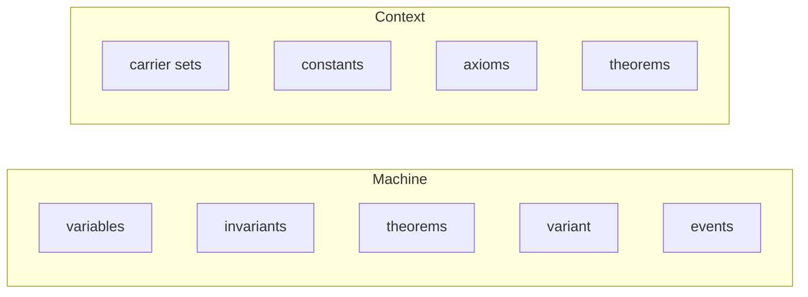
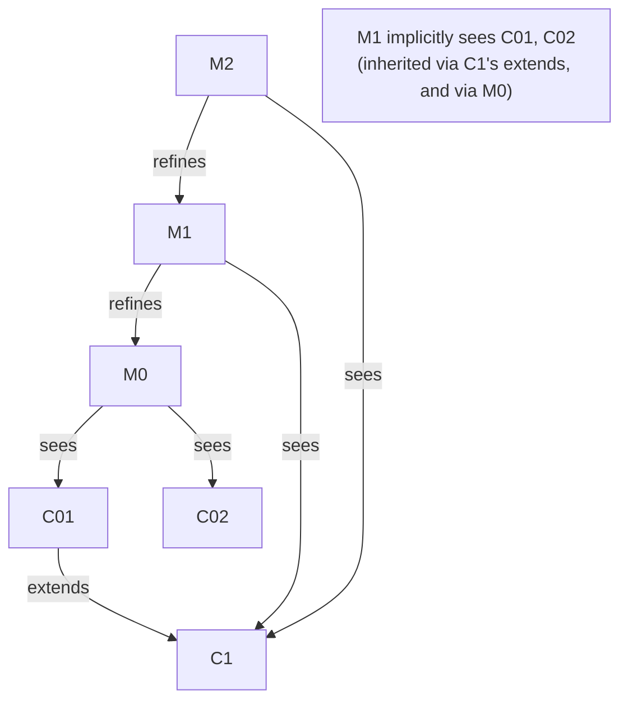

[[book-guidelines|↩ Back to guidelines]]

# The Event-B Notation

## What breaks without this

By Chapter 5, the book has already used most of the Event-B notation informally, chapter by chapter, introducing each construct exactly when a worked example needed it. That's a good pedagogical strategy but a bad *reference* strategy: if all you've seen is "machines look like this in the bridge example" and "events look like that in the protocol example," you have no way to tell what's a general rule of the language versus an accident of one particular model. Chapter 5 exists purely to fix that — it's the formal grammar chapter, deliberately assembled *after* the intuition has already been built by [[Discrete-Transition-Systems|Discrete Transition Systems]]. Read it as "now here's the actual syntax and structural rules behind everything you've already been reading."

If you're used to reading a language reference manual or a grammar for a compiler frontend, this is exactly that kind of chapter: two top-level component kinds (machines, contexts), a fixed set of clauses each can carry, and precise well-formedness rules governing how components may reference one another.

## Machines and contexts

A **model** in Event-B is the complete mathematical development of a single Discrete Transition System, and it's assembled from two kinds of components:

- **Contexts** hold the *static* parts: carrier sets, constants, axioms, theorems. Nothing in a context ever changes as the system runs.
- **Machines** hold the *dynamic* parts: variables, invariants, theorems, a variant, and events.



This is a familiar split if you think of it as a compiler frontend's separation between a *type/constant environment* (fixed once elaborated — your context) and *program state* (mutated by execution — your machine). A model can be context-only (a pure mathematical theory, no dynamics at all — think of proving properties of, say, a group structure with no notion of "running"), machine-only (an unparameterized transition system), or both (a machine parameterized by a context's sets and constants — the common case, and the one every case-study chapter uses).

## Sees, extends, and refines relationships

Three relationships connect components, and each has a distinct role:

- **`refines`** (machine → machine): a machine can refine at most one other machine. This is the relation underlying the whole refinement methodology — you'll go deep on the proof-theoretic content of this relation under [[Refinement-Theory|Refinement Theory]]; here it's just the syntactic link.
- **`extends`** (context → context): transitive — if $C_1$ extends $C_2$, and $C_2$ extends $C_3$, then $C_1$ implicitly extends $C_3$ too, and can use $C_3$'s sets and constants directly.
- **`sees`** (machine → context): when machine $M$ sees context $C$, $M$ may use $C$'s sets and constants. A machine implicitly sees every context extended by a context it explicitly sees.

Two well-formedness rules matter enough to be worth internalizing rather than just noting:

1. **No cycles.** The `refines` and `extends` relations, taken together, must be acyclic — you can't have $M_1$ refine $M_2$ refine $M_1$, nor the context analogue. This is exactly the acyclicity condition you'd enforce on an import graph or a class hierarchy in any language with modules and inheritance.
2. **Visibility must not shrink under refinement.** A refining machine's set of (explicitly or implicitly) seen contexts must be at least as large as its abstraction's. If $M_0$ can see context $C$, $M_1$ (refining $M_0$) must be able to see $C$ too — refinement is allowed to *add* visible context, never take it away. This matters because a refinement proof needs to reason using everything the abstraction could reason with, plus possibly more; losing access to an axiom the abstract invariant depended on would make the refinement unprovable.



If you've built a module system or a trait/typeclass resolver, this visibility-monotonicity rule is the same shape as requiring that a subtype's trait bounds be a superset of its supertype's — refinement in Event-B behaves like widening the *evidence available*, never narrowing it.

## Carrier sets, constants, and axioms

A context's structure, in full generality:

```
<context_identifier>
  extends   <context_identifier_list>
  sets      <set_identifier_list>
  constants <constant_identifier_list>
  axioms    <label>: <predicate> ...
  theorems  <label>: <predicate> ...
end
```

- **Carrier sets** define new, pairwise-disjoint types. The *only* thing you're licensed to assume about a carrier set, absent an axiom saying more, is that it's non-empty. This is a strikingly minimal commitment — a carrier set is closer to an abstract/opaque type in a module signature than to any concrete data type; it starts with no structure at all, and every property it has must be stated as an axiom.
- **Constants** are named values whose properties (not values!) are pinned down by axioms. A constant can be left almost entirely unconstrained (existentially "there exists some $n \in \mathbb{N}$") — Event-B never requires you to give a constant a concrete definition, only enough axioms to prove what you need.
- **Theorems** (in a context) are consequences of the axioms, proved once and then available as extra hypotheses downstream — exactly a lemma cache: prove it once here, cite it everywhere it's seen.

Worked example, a context defining a total function used as an array-like lookup table:

$$
\texttt{ctx\_0}: \quad \textbf{sets } D \quad \textbf{constants } n, f, v \quad
\begin{aligned}
&\text{axm1}: n \in \mathbb{N}\\
&\text{axm2}: f \in 1..n \to D\\
&\text{axm3}: v \in \text{ran}(f)
\end{aligned}
\quad \textbf{theorems } \text{thm1}: n > 0
$$

```rust
// The closest Rust shape: an opaque carrier set is like a phantom/opaque type,
// and axioms are the invariants you'd otherwise have to enforce by construction.
struct D; // carrier set: no structure beyond "it exists"

struct Ctx0 {
    n: u64,                       // axm1: n ∈ ℕ  (enforced by the type)
    f: std::collections::HashMap<u64, D>, // axm2: f ∈ 1..n → D  (a *total* function — Rust can't check totality; that's exactly why Event-B needs axm2 as a proof obligation, not a type)
    v: D,                         // axm3: v ∈ ran(f) — an obligation *about* f and v, not expressible in Rust's type system at all
}
```

## Machine structure

```
<machine_identifier>
  refines   <machine_identifier>
  sees      <context_identifier_list>
  variables <variable_identifier_list>
  invariants <label>: <predicate> ...
  theorems   <label>: <predicate> ...
  variant    <variant>
  events     <event_list>
end
```

Two clauses deserve special attention:

- **Invariants that mention a refined machine's variables are gluing invariants** by definition — the moment a predicate references both abstract and concrete variables, it's doing double duty: constraining the concrete state *and* relating it back to the abstraction. (Introduced conceptually in [[Discrete-Transition-Systems|Discrete Transition Systems]]; here it's just the syntactic marker — any invariant naming variables from both levels counts.)
- **The `variant` clause exists only when the machine has convergent events** — it's not optional decoration, it's *required exactly when* something in the events needs it, and absent otherwise. This is a good instance of Event-B's general design taste: clauses appear when semantically necessary, never "just in case."

## Event parameters and witnesses

The full event grammar:

```
<event_identifier>
  status  {ordinary, convergent, anticipated}
  refines <event_identifier_list>
  any     <parameter_identifier_list>
  where   <label>: <predicate> ...
  with    <label>: <witness> ...
  then    <label>: <action> ...
end
```

Only `status` is mandatory; everything else can be empty. A few points worth being precise about:

- **`any`** introduces *parameters* — locally scoped, existentially-flavored variables of the event itself, distinct from the machine's variables. Think of them as the bound variables of a $\exists$ that the guard and action live under.
- **`where`** (or `when`, in the Rodin tool's pretty-printer, used specifically when there's no `any` clause) holds the guards.
- **`with`** holds **witnesses** — and this is the one construct here that has no obvious analogue in an ordinary programming language, so it's worth being careful about. When a concrete event refines an abstract one, and either (a) one of the abstract event's *parameters* disappears in the refinement, or (b) an abstract *variable* that was assigned non-deterministically in the abstract event no longer appears (or is assigned differently) in the concrete one, the refining event must supply a **witness**: a predicate $a : P(a)$ that says what value the vanished parameter or variable *would have taken*, for the purposes of discharging the abstract event's proof obligations against the concrete state. A witness is **deterministic** if $P(a)$ has the shape $a = E$ (a specific value), non-deterministic otherwise.

  Concretely, from the running search example: the abstract event `search` in machine `m_0a` has a parameter `k` (`any k where k ∈ 1..n ∧ f(k) = v then i := k`). Its refinement in `m_1a` drops the parameter and just tests `f(j+1) = v` directly, assigning `i := j+1`. Since `k` disappeared, the refining event needs a witness: `k : j+1 = k` — literally "here is what the abstract parameter *would have been*, phrased so the abstract guard's proof obligations still go through." This is precisely a **Skolemization / metavariable-instantiation move**: you had an existentially-guarded parameter in the abstract event, and refinement resolves — witnesses — it to a concrete term, exactly the way an elaborator resolves an implicit argument to a concrete instantiation once enough context is available. If your mental model is Lean's elaborator, a witness clause *is* the recorded solution to a metavariable that the abstract level left implicit.

## Convergent, anticipated, and ordinary events

The `status` clause takes exactly one of three values, and this three-way distinction exists purely to support **variants** (used to prove that certain sequences of new events introduced in a refinement can't run forever, i.e., can't stall or starve the abstract-level events they're meant to eventually yield to):

- **ordinary** — no variant obligation at all.
- **convergent** — the event *must* strictly decrease the variant every time it fires.
- **anticipated** — the event must *not increase* the variant (a weaker promise: "no worse," not yet "getting closer"). Anticipated status is a placeholder for an event that will become convergent once its variant is known/finalized in a later refinement — you'll see this exact move in the file-transfer protocol's development (Chapter 4), where `receive` starts anticipated and is later made convergent once the right variant is chosen.

This maps directly onto termination-measure reasoning familiar from proving recursive functions terminate, or ranking functions in a program-analysis termination prover: convergent ≈ "this call is on the decreasing branch of the well-founded order," anticipated ≈ "this call doesn't grow the measure, so it can't be the cause of non-termination, but it isn't yet the thing forcing progress either."

## Numeric and finite-set variants

A variant can be one of two shapes, both requiring the underlying order to be well-founded so "always decreasing" can't continue forever:

- **Numeric variant**: an expression $n(v)$ valued in $\mathbb{N}$. Convergent events must strictly decrease it ($n(v') < n(v)$); anticipated events must not increase it ($n(v') \le n(v)$). Well-foundedness here is just $\mathbb{N}$'s own — you can't decrease a natural number infinitely often.
- **Finite-set variant**: an expression $t(v)$ valued as a finite set, ordered by strict subset $\subset$. Convergent events must shrink it ($t(v') \subset t(v)$); anticipated events must not grow it ($t(v') \subseteq t(v)$). This is exactly a well-founded measure valued in the power-set lattice rather than $\mathbb{N}$ — the same idea a termination checker uses when a natural-number counter isn't the natural measure but "the set of remaining unprocessed items" is (e.g., machine `m_1b`'s search variant `j..n`, shrinking as `j` climbs toward `n`).

```lean
-- The Lean-side correspondence: a convergent event's variant is exactly
-- the decreasing measure a `termination_by` / `decreasing_by` clause supplies
-- to Lean's own well-founded recursion checker.
def search (j n : Nat) (f : Nat → D) (v : D) : Nat :=
  if h : f (j + 1) = v then j + 1
  else search (j + 1) n f v
termination_by n - j  -- exactly Event-B's numeric variant n − j for event `progress`
```

## Functional override and non-deterministic assignment

Every action ultimately reduces to one canonical form — a **before-after predicate** — but three surface syntaxes exist for readability:

1. **Deterministic assignment**: $x := E$. Multiple assignments in one event's `then` clause fire *simultaneously* — the right-hand sides all read the *pre*-state, so `act1: x := x+z; act2: y := y−x` uses the old $x$ in computing the new $y$, never the just-updated one. (This rules out the C-style "statements execute top to bottom" reading entirely — it's closer to a single parallel/simultaneous-substitution step, as in a big-step semantics rule with multiple premises evaluated against the same starting state.)
2. **Functional override**, a shorthand for updating one point of a function-valued variable: $f(E_1) := E_2 \;\equiv\; f := f \mathbin{-\!\triangleleft} \{E_1 \to E_2\}$ — literally "remove the old pair with that domain point, add the new one." This is exactly array/map update as understood functionally (`HashMap::insert`, or Lean's `Function.update`), except spelled out via the relational override operator so it composes with the rest of the set-theoretic vocabulary rather than needing its own primitive.
3. **Non-deterministic assignment**: $x :| BA(v, v')$, a before-after predicate directly, or the sugar $x :\in S \equiv x :| x' \in S$ for "pick any element of $S$."

The chapter is explicit that *the non-deterministic before-after form is the general normalized form for all three* — deterministic assignment $x := E$ is definitionally just $x :| x' = E$. This matters for exactly the reason it matters in any semantics you'd design yourself: you don't want three separate proof-obligation rules for three action syntaxes; you want one rule stated against the normal form, with the surface syntaxes elaborating down to it before any proof obligation is generated. One well-formedness rule rides along with this: actions in the same `then` list must touch **disjoint** sets of variables — you cannot have two actions both assigning to $x$, because "simultaneous" only makes sense if there's no conflict to resolve.

```python
# The non-determinism sugar, spelled out explicitly
def nondeterministic_membership(x, A, y):
    # x :∈ A ∪ {y}   is exactly   x :| x' ∈ A ∪ {y}
    candidates = A | {y}
    return candidates  # any element is a valid "after" value; the model doesn't pick one for you
```

## Where this leads

This chapter's grammar is the fixed target every worked-example chapter compiles its informal descriptions down to — when Chapter 2's boxed "variable: n, inv0_1: ..." presentation style is read carefully, it's always this same underlying `machine`/`context`/`event` structure, just typeset compactly. The very next topic, **[[Proof-Obligation-Rules|Proof Obligation Rules]]**, is where this notation starts *doing work*: every clause introduced here (guards, actions as before-after predicates, witnesses, variants, the refines/sees/extends graph) exists specifically because some proof obligation rule needs to read it to generate a specific sequent to prove. Reading Chapter 5's two sections in sequence — notation, then proof obligations — is reading a grammar immediately followed by its type-checking/verification-condition-generation rules, which is exactly the right way to read them.

**Bearing on the standing project:** the witness mechanism is the cleanest bridge in this book between Event-B and your elaborator work — a witness resolving a vanished abstract parameter *is* metavariable resolution via pattern-style unification, and the deterministic/non-deterministic witness distinction mirrors exactly the distinction between a metavariable getting fully solved (`a = E`) versus merely constrained. The event-status/variant machinery (convergent/anticipated + numeric/finite-set variants) is a ready-made vocabulary for the termination side of your CSP/abstract-interpretation kernel: an anticipated event is precisely a program transition your invariant-generation engine should treat as "safe but not yet known to make progress," which is a useful three-valued refinement over the usual binary "terminates / might not."
