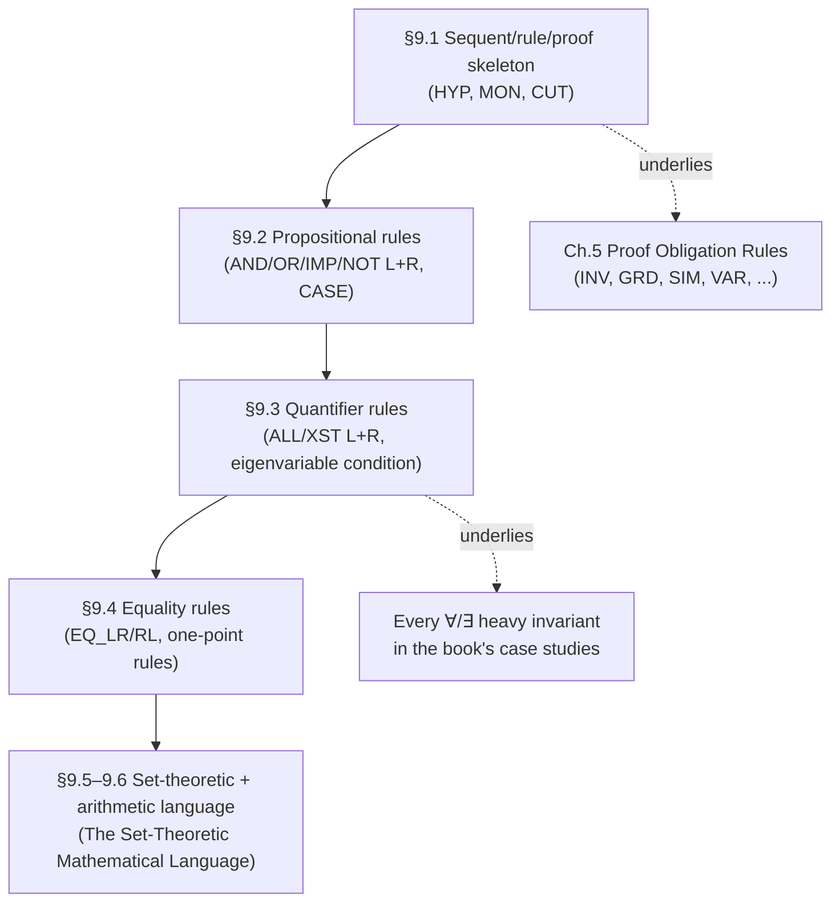

[[book-guidelines|↩ Back to guidelines]]

## Why a modeling book needs its own logic textbook chapter

Every earlier chapter of this book has been quietly using turnstiles ($\vdash$), rule schemas, and labels like `INV` or `GRD` as if the reader already knew what a "proof" formally *is*. Chapter 9 is where Abrial stops borrowing that vocabulary and builds it from the ground up. This matters for a very concrete engineering reason: everything the Rodin Platform does when it "discharges a proof obligation" is this chapter, executed mechanically. If you are ever going to build a checker — a type checker, a Hoare-logic verifier, a proof assistant kernel — this is the chapter that tells you what your checker's *trusted core* actually has to compute: given a claimed proof, does it check?

Think of it this way: a **sequent** is a claim ("this goal follows from these hypotheses"), an **inference rule** is a template for reducing one claim to simpler claims, and a **proof** is a finite record of having reduced your top-level claim all the way down to claims that need no further justification. That's the whole machine. Nothing here appeals to "truth" in a model-theoretic sense — it's pure syntax, which is exactly why a computer program (or a `enum` variant in Rust) can implement it without knowing anything about semantics.

## What breaks without a formal proof object

Before formalizing, it's worth asking: why not just say "obviously $P$ follows from $H$" and move on, the way an engineer reasons informally? Because informal reasoning has no *checkable artifact*. If your reasoning has a gap — a missing case, an implicit assumption smuggled in — nothing forces you to notice. The entire discipline of the book (state a proof obligation, discharge it, and treat proof *failure* as a diagnostic signal revealing a missing guard or invariant) depends on proofs being objects that can be mechanically verified independently of the person who constructed them. That's only possible if "proof" has a precise recursive definition. This is the same reason a compiler's type checker can't just trust "the programmer probably meant this to type-check" — it needs a decidable procedure.

## Sequents, inference rules, and proofs: the bare skeleton

Abrial builds the calculus in three deliberately minimal stages (§9.1.1).

**A sequent** is, for now, just "a generic name for something we want to prove." It's a placeholder — like declaring a trait before you've decided what implements it.

**An inference rule** has two parts: an *antecedent* (a finite set of sequents — the sub-goals) and a *consequent* (a single sequent — what you get if you prove all the sub-goals). Written:

$$\dfrac{A}{C}\;R1$$

read as: "rule $R1$ yields a proof of $C$ as soon as we have proofs of every sequent in $A$." When $A$ is empty, the rule is an *axiom* — it discharges its consequent for free:

$$\dfrac{}{C}\;R2$$

**A theory** is just a set of inference rules — a fixed rule-set your prover is allowed to use.

**A proof** is a finite tree whose nodes are pairs $(s, r)$ — a sequent $s$ and a rule $r$ — subject to one constraint: the consequent of $r$ must equal $s$, and the node's children are exactly the sequents in $r$'s antecedent. The root holds the sequent you originally wanted to prove; the leaves are necessarily nodes using rules with *empty* antecedents (axioms), because a leaf has no children to supply an antecedent's sequents.

This is precisely the shape of a **proof-carrying term** or an **elaborated derivation tree** in a proof assistant kernel. If you've ever looked at Lean's `Expr` representation of a completed proof term, you're looking at a serialized version of exactly this tree — every node names the rule (the constant/lemma applied) and its children are the sub-proofs it depended on. A trusted kernel's entire job (`isDefEq`-style checking, or Lean's `Kernel.check`) reduces to: walk this tree, and at every node verify that the rule's consequent really does match the node's stated sequent given the children's stated sequents. That's a two-line recursive function, and its simplicity *is* the whole point of having a small trusted computing base.

```rust
// A generic proof tree, parametric over which theory (rule set) you're using.
struct ProofNode<Rule, Sequent> {
    rule: Rule,
    sequent: Sequent,          // the consequent this node claims to establish
    children: Vec<ProofNode<Rule, Sequent>>,
}

// Checking is exactly Abrial's definition, made executable:
// for each node, re-derive what `rule` demands given `children`'s sequents,
// and confirm it equals `sequent`.
fn check<R: RuleSchema<S>, S: PartialEq>(node: &ProofNode<R, S>) -> bool {
    let child_sequents: Vec<&S> = node.children.iter().map(|c| &c.sequent).collect();
    node.rule.consequent_matches(&node.sequent, &child_sequents)
        && node.children.iter().all(check)
}
```

In Lean, this recursive well-formedness check is not something you write — it's what `rfl`, `exact`, and ultimately the kernel's type-checking function already do for you every time a term elaborates. But the *shape* is identical: a proof term is a tree of rule-applications, and checking it is bottom-up verification that each node's claim really is licensed by its children.

## Refining "sequent" for a mathematical language: hypotheses and goal

Once you actually have a language of predicates, §9.1.2 sharpens the sequent notion. A sequent becomes a pair: a finite *set* of hypotheses $H$ (predicates you're allowed to assume) and a single *goal* $G$ (the predicate you must derive), written:

$$H \vdash G$$

read as "goal $G$ holds under the set of hypotheses $H$." Two details matter and are easy to gloss over: $H$ is a **set**, so the order hypotheses were introduced in is meaningless and duplicates collapse — this is exactly the sense in which a **typing context** $\Gamma$ in a type-theory judgment $\Gamma \vdash e : T$ is *also* conventionally treated as a set/list-up-to-permutation of assumptions (a point that becomes load-bearing later when you worry about **variable capture** and context validity in a real implementation — see the closing [[Case-Study-Bridge-and-Press-Controllers#Synthesis|synthesis]]).

## The initial theory: HYP, MON, CUT

With sequents defined, §9.1.3 gives the three rules that exist before there is even a concrete predicate language — they're purely structural, valid no matter what predicates end up meaning.

**HYP** (an axiom — no antecedent): if the goal is already among the hypotheses, you're done.

$$\dfrac{}{H, P \vdash P}\;\text{HYP}$$

**MON** (monotonicity / weakening): a sequent provable with fewer hypotheses is still provable with more.

$$\dfrac{H \vdash Q}{H, P \vdash Q}\;\text{MON}$$

**CUT**: if you can prove $P$ from $H$, you may add $P$ to $H$'s stock of assumptions when proving some other goal $Q$.

$$\dfrac{H \vdash P \qquad H, P \vdash Q}{H \vdash Q}\;\text{CUT}$$

Abrial is careful to flag that $H$, $P$, $Q$ are **meta-variables** — a rule written with them is really a *rule schema*, standing for infinitely many concrete instances. This is worth dwelling on because it's exactly the distinction a compiler implementer needs between a *rule* (as data — one entry in your rule table) and the *instances* it generates when unified against a specific goal during proof search. CUT, in particular, is the formal ancestor of "lemma application": in a real prover, using a previously proved lemma $P$ to help discharge a new goal $Q$ is literally an application of CUT where the left branch is "already solved, filed away."

## The propositional language: syntax first, then rules

§9.2 makes the notion of "predicate" concrete for the first time — deliberately starting with the smallest possible language (falsity, negation, conjunction, disjunction, implication) so the rule-adding *pattern* is visible before it's obscured by a large grammar:

$$predicate ::= \bot \mid \neg\,predicate \mid predicate \wedge predicate \mid predicate \vee predicate \mid predicate \Rightarrow predicate$$

Every connective gets *two* rules — a left rule (used when the connective's formula sits among the hypotheses) and a right rule (used when it's the goal). This left/right symmetry is the sequent calculus's signature move, and it's what makes proof search *directed*: a left rule consumes a hypothesis and produces new, simpler hypotheses; a right rule consumes the goal and produces a new, simpler goal (or several). A handful of the rules, verbatim:

$$\dfrac{H,P,Q \vdash R}{H, P \wedge Q \vdash R}\;\text{AND\_L} \qquad \dfrac{H \vdash P \qquad H \vdash Q}{H \vdash P \wedge Q}\;\text{AND\_R}$$

$$\dfrac{H, P \vdash R \qquad H, Q \vdash R}{H, P \vee Q \vdash R}\;\text{OR\_L} \qquad \dfrac{H, \neg P \vdash Q}{H \vdash P \vee Q}\;\text{OR\_R}$$

$$\dfrac{H, P, Q \vdash R}{H, P, P \Rightarrow Q \vdash R}\;\text{IMP\_L} \qquad \dfrac{H, P \vdash Q}{H \vdash P \Rightarrow Q}\;\text{IMP\_R}$$

Notice **IMP_R** is the formal shape of "to prove $P \Rightarrow Q$, assume $P$ and prove $Q$" — this is *definitional* introduction of implication, and it is exactly the rule your Rust verifier will apply when checking a function against a precondition/postcondition contract: assuming the precondition holds (add it to $H$), you must derive the postcondition. **AND_R**'s two independent sub-goals are exactly why conjunctive Hoare-style postconditions split cleanly into independently dischargeable verification conditions — a fact your VC generator will lean on constantly to keep sub-goals small.

### What breaks without the left/right split

If you only had "right" rules (goal-directed rewriting) and no left rules, you'd have no systematic way to *exploit* a disjunctive or implicative hypothesis — you'd be stuck restating the goal forever without ever consuming what you were given to work with. The left rules are what let a prover perform **case analysis** and **hypothesis elimination** mechanically rather than by ad hoc human insight. This is precisely the operational content of `match` in Rust or the `cases`/`rcases` tactics in Lean: `OR_L`'s two branches *are* what a `match` on an `Either`-shaped hypothesis compiles down to at the proof-theoretic level.

### A derived rule: CASE

Beyond the primitive rules, §9.2.3 derives useful shortcuts — rules provable *from* the primitives rather than added as new axioms. The most important is **CASE**, proof by cases on an arbitrary predicate $Q$ (not necessarily one already in $H$):

$$\dfrac{H, Q \vdash P \qquad H, \neg Q \vdash P}{H \vdash P}\;\text{CASE}$$

This is worth internalizing as a template: a *derived* rule is one whose soundness is a theorem *of* the theory rather than a stipulation, and a real implementation should keep derived rules as compiled macros over primitives (so the trusted kernel only ever has to check primitive-rule applications) rather than as new trusted axioms — this is the "small trusted kernel, big library of derived tactics" architecture that Lean itself uses (`tauto`, `omega`, and friends all bottom out in kernel-checkable primitive proof terms).

## Quantifiers: ALL_L / ALL_R and XST_L / XST_R

§9.3 extends the syntax with variables, paired expressions ($E \to F$), and quantifiers $\forall x \cdot P$ / $\exists x \cdot P$. The universal rules:

$$\dfrac{H, \forall x \cdot P,\, [x:=E]P \vdash Q}{H, \forall x \cdot P \vdash Q}\;\text{ALL\_L} \qquad \dfrac{H \vdash P}{H \vdash \forall x \cdot P}\;\text{ALL\_R}\;\;(x \text{ not free in } H)$$

**ALL_L** instantiates a universally quantified hypothesis at any expression $E$ you choose — note it *keeps* the original $\forall x \cdot P$ around (you might need to instantiate it again at a different $E$ later), it only *adds* the instance $[x:=E]P$. **ALL_R** is where the book's own phrase "$x$ not free in $H$" names a *side condition* — a syntactic precondition on a rule's applicability beyond the shape-match of hypotheses and goal.

This is exactly, unglossed, the **eigenvariable / fresh-variable condition** that governs universal generalization in any first-order sequent calculus, and it is the direct proof-theoretic ancestor of **variable capture avoidance** in substitution-heavy systems: if $x$ *were* allowed to occur free in $H$, generalizing to $\forall x \cdot P$ would silently claim something true for *all* $x$ using a proof that secretly only worked for the *specific*, already-fixed $x$ mentioned in $H$ — precisely the bug class that a capture-avoiding substitution routine exists to prevent in a real implementation. Any Rust implementation of `ALL_R` must carry (or freshly generate) a name for $x$ and check non-freeness against the current context before firing the rule — this is your first taste of **context management** as a genuine engineering concern, not just bookkeeping.

The existential rules are the dual, with the side condition moved to the *left* rule instead:

$$\dfrac{H, P \vdash Q}{H, \exists x \cdot P \vdash Q}\;\text{XST\_L}\;\;(x \text{ not free in } H, Q) \qquad \dfrac{H \vdash [x:=E]P}{H \vdash \exists x \cdot P}\;\text{XST\_R}$$

**XST_R** is worth pausing on longer than the book does, because it is the single most important rule for anyone building a metavariable-based elaborator: to prove $\exists x \cdot P$, you must *produce a witness* $E$ and show $[x:=E]P$. Mechanically automating "pick the right $E$" — rather than requiring the human to supply it — is *exactly* what higher-order/pattern unification does inside a bidirectional elaborator: a metavariable `?m` stands in for the not-yet-chosen witness $E$, constraint generation records what $[x:=\,?m]P$ must equal, and unification later solves `?m` (in the tractable Miller-pattern fragment, when `?m` is applied only to distinct bound variables). Reading `XST_R` this way — "an existential goal is a request for a metavariable solved by later unification" — is the cleanest bridge from 1970s-style proof theory straight into a Lean-style elaborator's `isDefEq`/metavariable-assignment machinery.

### A worked derived rule: CUT_XST

The chapter proves one more derived rule, useful for *simplifying* an existential goal by swapping in an easier witness predicate:

$$\dfrac{H \vdash \exists x \cdot Q \qquad H, Q \vdash P}{H \vdash \exists x \cdot P}\;\text{CUT\_XST}\;\;(x \text{ not free in } H)$$

Its proof composes CUT with XST_L/XST_R exactly the way you'd expect from the primitives above — a small, satisfying exercise in seeing that "derived" really does mean "provable from what came before," not "assumed by fiat."

## Equality: EQ_LR, EQ_RL, and the one-point rules

§9.4 adds equality $E = F$ between expressions, with substitution rules that let you rewrite using an equality hypothesis in either direction:

$$\dfrac{[x:=F]H,\, E=F \vdash [x:=F]P}{[x:=E]H,\, E=F \vdash [x:=E]P}\;\text{EQ\_LR} \qquad \dfrac{[x:=E]H,\, E=F \vdash [x:=E]P}{[x:=F]H,\, E=F \vdash [x:=F]P}\;\text{EQ\_RL}$$

Alongside these, two purely definitional rewriting rules — reflexivity ($E=E \rightsquigarrow \top$) and pair equality ($E \to F = G \to H \rightsquigarrow E=G \wedge F=H$) — and the **one-point rules**, which collapse a quantifier tied to an equality constraint into a plain substitution:

$$\forall x \cdot x = E \Rightarrow P \;\rightsquigarrow\; [x:=E]P \qquad \exists x \cdot x = E \wedge P \;\rightsquigarrup\; [x:=E]P$$

These look like a minor simplification convenience, but they are the proof-theoretic seed of **definitional equality checking**: EQ_LR/EQ_RL is substitution-under-a-proven-equation, which is precisely what a kernel's `isDefEq E F` must decide before accepting a term of type `P[E]` in a position expecting `P[F]`, and the one-point rules are the special case where the equation is trivial enough that substitution can happen *immediately*, without invoking a general rewriting engine — this is why Lean's elaborator special-cases exactly this pattern (`Exists.intro`/`rfl`-closable goals) rather than always falling back to full congruence closure.

## Where this leads



This chapter is infrastructural: nothing in it is Event-B-specific, and that is deliberate. Every proof obligation named in [[Proof-Obligation-Rules|Proof Obligation Rules]] (INV, GRD, SIM, VAR, and the rest) is, underneath, a sequent in exactly this calculus — the "special" event-B content is only in *which* sequent gets generated for a given machine, never in how it gets discharged. Everything in [[The-Set-Theoretic-Mathematical-Language|The Set-Theoretic Mathematical Language]] is built as a further extension of this same syntax-then-rules pattern, one more layer of the "language" onion: set comprehension, relations, and functions all get their own left/right rules exactly the way $\wedge$ and $\forall$ did here.

For the standing compiler project, this chapter is closer to a checklist than a curiosity: your kernel's proof-term representation is this proof-tree definition; your `ALL_R`/eigenvariable handling is your first real substitution/capture-avoidance problem; and `XST_R`'s witness-production is the seam where proof search stops being purely rule-directed and starts needing metavariables and unification — which is exactly where Miller pattern unification and bidirectional typing enter the picture in later, more elaboration-heavy topics.
