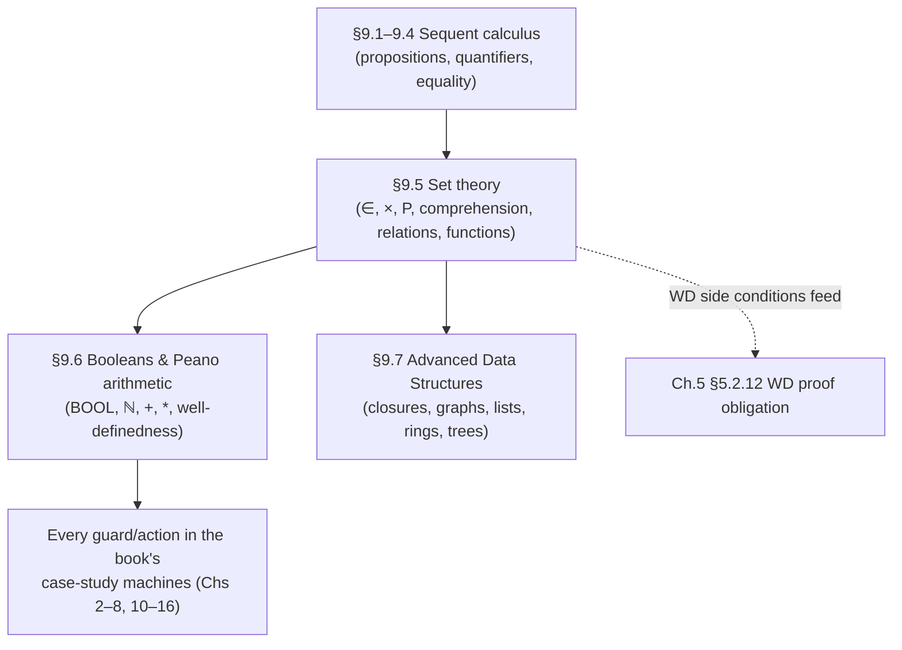

[[book-guidelines|↩ Back to guidelines]]

## Why the logic needed a data model

[[The-Sequent-Calculus-and-Logical-Inference|The previous chapter section]] built a logic with almost no *content* — propositions, quantifiers, equality, but nothing to reason *about*. You cannot write $n \le max(dom(f))$ in a language that only has $\wedge$, $\forall$, and $=$. Abrial's move in §9.5–9.6 is to keep extending the same predicate/expression grammar, layer by layer, adding exactly one new family of constructs at a time and immediately pinning down its meaning with a **rewriting rule** that reduces it back to something already defined. This is the same design discipline a compiler author uses when growing a core IR by desugaring surface syntax into a smaller kernel: every new construct is *defined away*, never left as an opaque primitive that the checker has to special-case.

The payoff is enormous for anyone building a verifier: the entire vocabulary of sets, relations, and functions used throughout the book's 15 case-study chapters ultimately bottoms out in about a dozen genuinely primitive notions (membership, Cartesian product, power set, set comprehension) plus a long, closed list of *definitions*. A checker only needs primitive support for the small core; everything else — union, domain restriction, function overriding, even the cardinality operator — can be unfolded by the elaborator before proof search ever sees it.

## What breaks without a layered, rewriting-based definition

If you instead gave every operator ($\cup$, $\rhd$, $;$, $\lambda$, ...) its own primitive inference rules from scratch, you would end up with dozens of independent rule families whose mutual consistency is not obvious and would have to be proved pairwise. By insisting each new operator reduces, via a side-condition-annotated rewrite, to membership statements already covered by earlier rules, Abrial gets consistency "for free" — a new operator can't secretly contradict the existing theory, because its meaning *is* an abbreviation within that theory. This is precisely the "desugaring to a small core calculus" strategy that lets a real compiler's type checker stay small and trustworthy while its surface language grows arbitrarily rich.

## Membership, Cartesian product, power set, comprehension: the four primitives

§9.5.1–9.5.2 introduces the irreducible core:

- **Membership** $E \in S$ — a new *predicate* former, unglossed. Every subsequent operator gets its meaning by being rewritten to a formula built from $\in$.
- **Cartesian product**: $E \to F \in S \times T \;\rightsquigarrow\; E \in S \wedge F \in T$.
- **Power set**: $E \in \mathbb{P}(S) \;\rightsquigarrow\; \forall x \cdot x \in E \Rightarrow x \in S$ (with the side condition $x$ not free in $E$ or $S$ — the fresh-variable discipline from the quantifier rules is already being reused).
- **Set comprehension**: $E \in \{x \cdot P \mid F\} \;\rightsquigarrow\; \exists x \cdot P \wedge E = F$.
- **Extensionality (set equality)**: $S = T \;\rightsquigarrow\; S \in \mathbb{P}(T) \wedge T \in \mathbb{P}(S)$ — two sets are equal exactly when each contains the other, which is *definitional*, not a separate axiom bolted on afterward.

Comprehension has two useful shorthands the book flags explicitly: $\{F \mid P\}$ (variables implicit — all free variables of $F$) and, when $F$ is literally a bound variable $x$, $\{x \mid P\}$ — the everyday "set of $x$ such that $P$" notation, for which membership collapses via the equality chapter's one-point rule to plain substitution: $E \in \{x \mid P\} \rightsquigarrow [x:=E]P$.

```rust
// Set comprehension as an elaboration target: this is what your desugaring
// pass produces before handing a goal to the prover.
enum Predicate {
    Member(Expr, Expr),                 // E ∈ S
    Exists(String, Box<Predicate>),     // ∃x · P
    And(Box<Predicate>, Box<Predicate>),
    Eq(Expr, Expr),
    // ...
}

// Desugaring {x · P | F} ∈-membership per the book's own rewrite rule.
fn desugar_comprehension(x: &str, p: &Predicate, f: &Expr, e: &Expr) -> Predicate {
    // E ∈ {x·P|F}  ~>  ∃x · P ∧ E = F
    Predicate::Exists(x.to_string(), Box::new(
        Predicate::And(Box::new(p.clone()), Box::new(Predicate::Eq(e.clone(), f.clone())))
    ))
}
```

In Lean terms, this whole layer is what `Set.mem`, `Set.image`, and anonymous-constructor set-builder notation elaborate down to — a `Set α` really is (definitionally, in the classical library) `α → Prop`, and `{x | P x}` is literally `fun x => P x`; membership is application. Abrial's comprehension rule is the informal, sequent-calculus-native version of the same idea.

## Elementary operators: everything else is sugar

§9.5.3 gives $\subseteq$, $\cup$, $\cap$, $\setminus$, set extension $\{a,\ldots,b\}$, and $\emptyset$, every one purely definitional:

$$S \subseteq T \rightsquigarrow S \in \mathbb{P}(T) \qquad E \in S \cup T \rightsquigarrow E \in S \vee E \in T \qquad E \in S \cap T \rightsquigarrow E \in S \wedge E \in T \qquad E \in S \setminus T \rightsquigarrow E \in S \wedge \neg(E \in T) \qquad E \in \emptyset \rightsquigarrow \bot$$

Nothing here is a new axiom about sets in the abstract — each line is a *notational* definition cashed out in terms of $\in$, $\wedge$, $\vee$, $\neg$, $\bot$ from the propositional/predicate layers you already have a proof theory for.

## Generalized union/intersection, and the first well-definedness conditions

§9.5.4 lifts union/intersection from binary operators to operators on a *set of sets* (`union(S)`, `inter(S)`) and to quantified forms ($\bigcup(x \cdot P \mid T)$, $\bigcap(x \cdot P \mid T)$):

$$E \in \mathrm{union}(S) \rightsquigarrow \exists s \cdot s \in S \wedge E \in s \qquad E \in \mathrm{inter}(S) \rightsquigarrow \forall s \cdot s \in S \Rightarrow E \in s$$

`inter(S)` is the first place the book flags a genuine **well-definedness condition**: the rewrite is only meaningful if $S \neq \emptyset$ (intersecting *nothing* would vacuously "contain" everything, which is not what you want $\bigcap$ to denote). This is a different kind of side condition from the earlier "$x$ not free in $E$" ones — those were about *soundness of a proof step*; this one is about whether an *expression itself denotes anything at all*. The book is explicit that these get folded into proof obligations (cross-reference: the `WD` obligation in [[Proof-Obligation-Rules|Proof Obligation Rules]], §5.2.12) — every time you write `inter(S)` in a model, Rodin silently generates a side-goal "prove $S \neq \emptyset$" alongside whatever you were actually trying to prove.

This is the single most transferable idea in this whole language layer for the compiler project: **well-definedness side conditions are exactly the class of proof obligation a refinement-type checker or symbolic executor must also generate** for partial operations — division, array indexing, `unwrap()`, precondition-guarded library calls. A Hoare-style verifier's weakest-precondition calculus needs a `WD`-obligation pass structurally identical to this one, generating "$S \ne \emptyset$"-shaped side conditions wherever a partial construct appears, not as an afterthought but as a first-class output of elaboration.

## Binary relations: the workhorse of the whole book

§9.5.5 is the densest section, and for good reason — Event-B events are, underneath everything, transformations on relations and functions, and every guard/action in the book's case studies is expressed with this vocabulary.

**The relation itself**: $r \in S \leftrightarrow T \rightsquigarrow r \subseteq S \times T$ — a relation is *just* a set of pairs, nothing more. **Domain and range**:

$$E \in \mathrm{dom}(r) \rightsquigarrow \exists y \cdot E \to y \in r \qquad F \in \mathrm{ran}(r) \rightsquigarrow \exists x \cdot x \to F \in r$$

**Totality/surjectivity** are then defined purely in terms of domain/range equalling the full carrier set — $r \in S \twoheadleftrightarrow T$ (total) means $r \in S \leftrightarrow T \wedge \mathrm{dom}(r) = S$; surjective and total-surjective compose the same way.

The **restriction/subtraction family** — domain restriction $S \lhd r$, range restriction $r \rhd T$, domain subtraction $S \mathbin{\lhd\!-} r$, range subtraction $r \mathbin{\rhd\!-} T$ — restrict or exclude a relation to/from a subset of its domain or range:

$$E \to F \in S \lhd r \rightsquigarrow E \in S \wedge E \to F \in r \qquad E \to F \in S \mathbin{\lhd\!-} r \rightsquigarrow \neg(E \in S) \wedge E \to F \in r$$

The **relational image** $r[U]$ — "follow every element of $U$ through $r$" — is the single most-used operator in the book's controller models (a channel's set of currently-in-flight messages, a graph's reachable set, and so on):

$$F \in r[U] \rightsquigarrow \exists x \cdot x \in U \wedge x \to F \in r$$

**Composition** — forward $f \,;\, g$ and backward $g \circ f$ (defined as $E \to F \in g \circ f \rightsquigarrow E \to F \in f \,;\, g$, i.e. purely a notational flip) — and **overriding**:

$$E \to F \in f \mathbin{\overline{\lhd}} g \rightsquigarrow E \to F \in (\mathrm{dom}(g) \mathbin{\lhd\!-} f) \cup g$$

**Overriding is worth pausing on**: when $f$ is a function and $g$ a singleton $\{x \to E\}$, $f \mathbin{\overline{\lhd}} \{x \to E\}$ is exactly *functional update* — "the function $f$, except at $x$, where it now maps to $E$." Every `x := E` assignment to a function-typed variable throughout the book's Event-B `then` clauses desugars to this operator (see the functional-override discussion in [[The-Event-B-Notation|The Event-B Notation]]). If you've ever written `HashMap::insert` or a Rust struct-update `..` expression, this is its exact set-theoretic ancestor — and it is a genuinely non-trivial abstract-domain object if you're building an abstract interpreter: representing "a function, overridden pointwise at a statically-unknown-but-constrained key" precisely is the same problem as **map/array abstraction with strong updates** in shape/points-to analysis, and reasoning about `dom(g) ⊴- f` symbolically (rather than concretely) is exactly the kind of relational reasoning a Horn-clause or CHC-based verifier needs a domain for.

## Function operators: partiality as a first-class distinction

§9.5.6 builds the full function hierarchy purely as increasingly constrained subsets of relations:

$$f \in S \nrightarrow T \rightsquigarrow f \in S \leftrightarrow T \wedge (f^{-1} \,;\, f) \subseteq id$$

Read this rewrite carefully — "$f$ is a partial function" means nothing more than "$f$ is a relation whose *converse-composed-with-itself* is contained in the identity relation," i.e. no element of the domain maps to two different outputs. There is no primitive "function" notion at all; **functionhood is a *property* a relation can have**, proved the same way any other set-membership fact is proved. Totality then layers on top: $f \in S \to T \rightsquigarrow f \in S \nrightarrow T \wedge S = \mathrm{dom}(f)$. Injectivity, surjectivity, and bijectivity for both partial and total functions are built the same compositional way (e.g. total injection $f \in S \rightarrowtail T \rightsquigarrow f \in S \to T \wedge f^{-1} \in T \nrightarrow S$).

This "partiality is a derived property, not a base type" stance is a genuinely useful lens for the refinement-type project: rather than baking partial vs. total function *types* into your type system as two disjoint primitives, you can treat totality as a **refinement predicate** on a relation-typed value — `{f : S ↔ T | ∀x ∈ S, ∃! y, (x,y) ∈ f}` — and let the same machinery that proves ordinary invariants also discharge "is this map total on its declared domain" obligations. It's the same move as Lean's `Function.Injective`/`Function.Surjective` being ordinary `Prop`-valued predicates over an arbitrary function, not separate types.

**Lambda abstraction and function invocation** (§9.5.8) close the loop by giving you a way to *construct* and *call* these relations-that-happen-to-be-functions:

$$F \in \lambda L \cdot P \mid E \rightsquigarrow F \in \{l \cdot P \mid L \to E\} \qquad F = f(E) \rightsquigarrow E \to F \in f$$

Function invocation $f(E)$ carries a **well-definedness condition** — $f^{-1}\,;\,f \subseteq id \wedge E \in \mathrm{dom}(f)$ — i.e. $f$ must actually *be* a (partial) function and $E$ must actually be in its domain. This is the direct formal ancestor of every "array index in bounds" or "map key present" side condition your symbolic executor will need to discharge before it can soundly reduce `f(E)` to a concrete value; skip the check and you've built an unsound evaluator.

## Booleans and Peano arithmetic: bootstrapping numbers from nothing

§9.6 finally introduces `BOOL`, `TRUE`/`FALSE`, and the natural numbers — and, notably, it does so *axiomatically* rather than by further rewriting, because numbers are the first genuinely new "base type" the language needs (everything up to here has been built purely from sets and relations over an unspecified carrier). The Peano-style presentation:

$$\mathrm{BOOL} = \{\mathrm{TRUE}, \mathrm{FALSE}\} \qquad \mathrm{TRUE} \ne \mathrm{FALSE} \qquad 0 \in \mathbb{N} \qquad \mathrm{succ} \in \mathbb{Z} \rightarrowtail \mathbb{Z} \qquad \mathrm{pred} = \mathrm{succ}^{-1}$$

$$\forall S \cdot 0 \in S \wedge (\forall n \cdot n \in S \Rightarrow \mathrm{succ}(n) \in S) \Rightarrow \mathbb{N} \subseteq S$$

That last line is the **induction axiom**, stated exactly the way it would be stated in second-order arithmetic: any set $S$ closed under zero and successor contains all of $\mathbb{N}$. This is worth flagging explicitly against the standing project's interest in **inductive types**: this axiom is the *set-theoretic shadow* of what an inductive type's eliminator/recursor gives you *for free, definitionally* in a dependently-typed system — in Lean, `Nat.rec` (or the `induction` tactic built on it) *is* this axiom, except the type theory bakes it into the type's very definition rather than stating it as a side postulate about an already-existing carrier set. Seeing both formulations side by side is a good gut-check for why inductive types are considered a strictly more structured (and more automatically-checkable) alternative to axiomatic set theory for this purpose: the "closed under constructors" property doesn't need to be *asserted*, it falls out of what it means to *be* the inductively defined type.

Addition, multiplication, and exponentiation are then given by the classical recursive equations ($a + \mathrm{succ}(b) = \mathrm{succ}(a+b)$, etc.) — textbook primitive recursion, and again the direct model for how you'd implement these operators as recursive functions over an inductively-defined `Nat` in Rust or Lean, rather than as opaque machine words.

## Rounding out arithmetic: comparisons, intervals, and more well-definedness

§9.6.3 adds $\le, <, \ge, >$ (all defined via existential witness on $\mathbb{N}$: $a \le b \rightsquigarrow \exists c \cdot c \in \mathbb{N} \wedge b = a + c$), the interval $a\,..\,b$, and the partial arithmetic operators — subtraction, division, modulo, `card`, `max`, `min` — each with its own well-definedness table entry:

| Expression | Well-definedness condition |
|---|---|
| $a/b$ | $b \ne 0$ |
| $a \bmod b$ | $0 \le a \wedge b > 0$ |
| $\mathrm{card}(s)$ | $\mathrm{finite}(s)$ |
| $\max(s)$ | $s \ne \emptyset \wedge \exists x \cdot \forall n \in s \cdot x \ge n$ |
| $\min(s)$ | $s \ne \emptyset \wedge \exists x \cdot \forall n \in s \cdot x \le n$ |

By this point the pattern should feel completely mechanical, which is exactly the intended effect: **every partial operator in this language comes with a machine-checkable side condition, generated uniformly by the same `WD` proof-obligation rule**, regardless of whether the partiality is about division-by-zero, an empty-set intersection, or an out-of-domain function call. If you are designing the verification-condition generator for the compiler project, this table is close to a direct specification of what your own `WD`/definedness pass needs to emit for the corresponding Rust-level operations (integer division, `Option::unwrap`, `HashMap::get` unwrapped, iterator `.max()`/`.min()`).

## Where this leads



Everything that follows in the book — every invariant, every guard, every action's before-after predicate — is written *in* this language, so this section is less "one topic among many" and more "the alphabet the rest of the book is spelled with." The next layer, [[Advanced-Data-Structures|Advanced Data Structures]], builds transitive closures, graphs, lists, rings, and trees as *definitions within this same language* rather than as new primitives — one more confirmation that the whole edifice really does stay this uniform, all the way up to the sophisticated inductive structures used in the book's protocol and network case studies. For the compiler project, this chapter is the closest thing in the book to a ready-made **specification language for refinement-type predicates and Horn-clause bodies**: relations, restricted domains, function overriding, and the well-definedness discipline are exactly the vocabulary your constraint generator will need when turning Rust-level contracts into checkable verification conditions.
