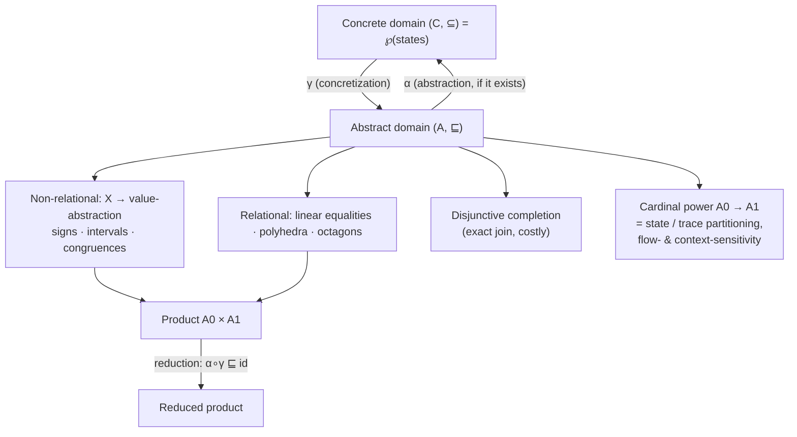

[[book-guidelines|↩ Back to guidelines]]

# Abstraction and Abstract Domains

## What breaks without abstraction

A static analyzer wants to answer a question like "can `x` ever be negative at this line?" The honest answer lives in the *collecting semantics* — literally the set of every memory state the program can reach at that line, across every input, every non-deterministic choice, every loop iteration count. That set is usually infinite (unbounded inputs, unbounded loop counts), and by Rice's theorem no algorithm can compute it exactly for a Turing-complete language anyway.

So the analysis cannot work with the real set of reachable states. It has to work with a *finite, computable stand-in* for that set — some data structure that can be built, compared, and combined in an algorithm, while still telling the truth (or at least, never lying) about what the program can do. That stand-in is an **abstract domain**, and the discipline of relating it back to the real, infinite set of behaviors is **abstraction**. Everything in this note is about making that relationship precise enough to build a provably sound algorithm on top of it — this is the second of the book's three design stages (semantics → **abstraction** → algorithm), and it is the stage that "mostly dictates the effectiveness of the resulting analysis" (the book says so explicitly in its closing chapter): a weak analysis is almost always a symptom of a weak abstract domain, not a weak algorithm.

## Concrete domains: what "abstraction" is relative to

Before defining "abstract," the book pins down what "concrete" means, because abstraction is always a relationship *between* two ordered structures, not a property of one domain in isolation.

> **Definition 3.1 (Concrete domain).** A concrete domain is a set $C$ used to describe concrete behaviors, together with an order relation $\subseteq$ that compares behaviors from a logical point of view: $x \subseteq y$ means behavior $x$ implies behavior $y$ (i.e. $x$ expresses a *stronger* property than $y$).

In this book $C$ is always a powerset $\wp(M)$ of memory states, so $\subseteq$ really is set inclusion — a smaller set of states is a stronger, more specific claim about what the program does.

**Rust [[Specialized-Static-Analysis-Frameworks#Grounding|grounding]].** Think of $(C, \subseteq)$ as anything implementing a partial order where "smaller" means "more informative":

```rust
trait ConcreteDomain {
    fn is_stronger_than(&self, other: &Self) -> bool; // x ⊆ y
}
```

`HashSet<Memory>` with subset-containment is the literal instance the book uses. The key discipline this sets up: *every* domain in this note — concrete or abstract — is a poset where "lower" = "more precise, stronger claim," and every abstract operation will be judged by whether it respects that ordering.

## Concretization: from abstract elements back to reality

An **abstract domain** is a second poset $(A, \sqsubseteq)$ — a set of abstract *elements* (finite descriptions: an interval, a sign, a polyhedron) with its own precision ordering. The bridge from $A$ back to $C$ is the **concretization function**:

> **Definition 3.3 (Concretization).** $\gamma : A \to C$ such that for every abstract element $a$, $\gamma(a)$ is the *largest* set of concrete behaviors satisfying $a$.

Read $\gamma(a)$ as "everything the abstract element $a$ is prepared to admit." $\gamma$ is always monotone: a bigger abstract element (weaker claim) concretizes to a bigger set of concrete states. This single function is what turns "$a$ describes concrete state $m$" ($m \models a$) into a checkable membership test: $m \models a \iff m \in \gamma(a)$.

**Worked example (the book's own).** With $X = \{x, y\}$ and the intervals domain, suppose $M^\# $ maps $x$ to $[0,10]$ and $y$ to $[0,80]$. Then $\gamma(M^\#)$ is *every* memory whose $x,y$ satisfy those bounds — including memories the analysis never actually produced, like $x=8, y=3$. That gap between "what $\gamma$ admits" and "what's actually reachable" is exactly the imprecision the analysis is allowed to have, and must have, because $C$ is generally infinite and $A$ is not.

## Abstraction functions and the (frequent) absence of a best one

Going the other direction — from a concrete set to *the* abstract element that describes it most precisely — is the **abstraction function** $\alpha$. It exists only when a *best* (least, most precise) abstraction is well defined:

> **Definition 3.4 (Abstraction / best abstraction).** $c$ has a best abstraction $a$ if $a$ describes $c$ and every other abstract element describing $c$ is coarser than $a$. When every concrete element has one, $\alpha : C \to A$ maps each to its best abstraction.

This is where the intuition from the book's toy geometric example (Chapter 2) earns its keep. The **intervals** domain always has a best abstraction: the smallest enclosing axis-aligned box of any point set is unique (take the componentwise infimum/supremum). But the **convex polyhedra** domain does *not*, in general:

> A disk of diameter 1 has no smallest enclosing convex polygon — you can always shave one more face off and get a strictly tighter polyhedron that still contains the disk. There is no minimum in the limit.

A sharper, purely combinatorial example the book gives (Example 3.6) is a *restricted* sign lattice with only $\{\bot, [\ge 0], [\le 0], \top\}$ (no $[=0]$). The set $\{0\}$ is described by both $[\ge 0]$ and $[\le 0]$, which are incomparable and both minimal — there is no unique least one, hence no $\alpha$, even though $\gamma$ is perfectly well defined on this lattice.

**What breaks without a best abstraction.** Nothing catastrophic — but the "ideal" specification of the analysis (`analysis(p) = α(⟦p⟧(γ(pre)))`, i.e. "compute the best possible abstract answer") stops being expressible. The analysis designer must instead choose *some* sound abstract element among several logically incomparable candidates, and different choices are genuinely non-comparable in precision. This is not a defect to engineer away; the book is explicit that it "only causes the analysis to err on the side of caution."

**Lean grounding.** Because this is pure order theory, Lean's Mathlib has this exact structure by name — `GaloisConnection`, and separately, the existence of a least upper bound is `IsLUB`/`sSup` machinery. The "no best abstraction" phenomenon is precisely the statement that a particular subset of $A$ has no least element, which in Lean you'd refute by exhibiting two incomparable minimal upper bounds — structurally identical to the $[\ge 0], [\le 0]$ argument above:

```lean
-- sketch: {0} has upper bounds [≥0] and [≤0] in the restricted sign lattice,
-- but they are incomparable, so {0} has no *least* upper bound (no α({0})).
example : ¬ ∃ a, IsLeast {b | ({0} : Set ℤ) ⊆ γ b} a := by
  sorry -- the witness is the incomparability of [≥0] and [≤0]
```

## Galois connections: when $\gamma$ and $\alpha$ agree with each other

When *both* $\gamma$ and $\alpha$ exist for an abstraction relation, they are not independent — they are forced into a tight algebraic relationship called a **Galois connection**:

> **Definition 3.5 (Galois connection).** A pair $(\alpha, \gamma)$ such that $\forall c \in C, a \in A:\quad \alpha(c) \sqsubseteq a \iff c \subseteq \gamma(a)$.

This single biconditional is doing a lot of work — it says $\alpha$ and $\gamma$ are *adjoint* functors between the two posets (an order-theoretic adjunction, the same categorical shape that underpins currying and free/forgetful functors elsewhere). From it, Appendix B.1 derives four properties that recur throughout the rest of the book (Theorem B.1):

$$
\text{id} \sqsubseteq \gamma \circ \alpha \qquad \alpha \circ \gamma \sqsubseteq \text{id} \qquad \alpha,\gamma \text{ monotone} \qquad \alpha \text{ continuous (if } C, A \text{ are CPOs)}
$$

Read the first two as: abstracting-then-concretizing a concrete element only ever *loses* precision (never invents states, but may over-admit some — that's $\text{id} \sqsubseteq \gamma \circ \alpha$), while concretizing-then-abstracting an abstract element only ever *refines* it or leaves it unchanged (that's $\alpha \circ \gamma \sqsubseteq \text{id}$, and this refinement is literally called a **reduction** — you'll meet it again as [[Specialized-Static-Analysis-Frameworks#The mechanism|the mechanism]] behind reduced products below).

**Why this is load-bearing for the compiler project.** A Galois connection is exactly the mathematical contract a constraint-propagation kernel needs between "the concrete satisfying assignments of a constraint" and "the abstract domain element the propagator tracks" — this is the same adjunction shape used to justify soundness of interval/octagon propagation in a CSP solver, and it is the *general* mechanism (not a numerical-domain-specific trick) for proving any new abstract domain sound before wiring it into an invariant-generation pass.

**Rust grounding** — the adjunction as a trait contract (the proof obligations live outside the type system, but the shape is enforceable in a test suite):

```rust
trait GaloisConnection {
    type Concrete: Ord;        // (C, ⊆)
    type Abstract: Ord;        // (A, ⊑)
    fn alpha(c: &Self::Concrete) -> Self::Abstract;
    fn gamma(a: &Self::Abstract) -> Self::Concrete;
    // law (checked by property tests, not the compiler):
    // alpha(c) <= a  <=>  c <= gamma(a)
}
```

**Lean grounding** — this is literally `Order.GaloisConnection` in Mathlib, which is worth citing by name precisely because the book's Definition 3.5 *is* that structure, not an analogy to it:

```lean
structure GaloisConnection (α : C → A) (γ : A → C) [Preorder C] [Preorder A] : Prop :=
  (gc : ∀ c a, α c ≤ a ↔ c ≤ γ a)
```

Mathlib's `GaloisConnection.monotone_l`, `.monotone_u`, `.le_u_l`, `.l_u_le` are, term for term, Theorem B.1. If you ever implement this compiler's domain-propagation layer, this is the interface to hold every new abstract domain to.

## Two axes for building a concrete abstract domain

Everything above is domain-agnostic scaffolding. The book then instantiates it along two axes: how a value is abstracted (**non-relational** vs **relational**), and how abstractions are combined (**products**, **disjunctions**, **partitions** — covered in the next section).

### Non-relational abstraction: one lattice per variable

The simplest recipe: abstract each variable's possible values independently, using a **value abstraction** — an abstraction of $(\wp(V), \subseteq)$ for the single-variable domain $V$ — and then take the pointwise product over all variables.

> **Definition 3.7 (Non-relational abstraction).** Given a value abstraction $(A_V, \sqsubseteq_V, \gamma_V)$, the non-relational domain is $A_N = X \to A_V$ (a function from variables to value-abstract-elements), ordered pointwise, with $\gamma_N(M^\#) = \{m \mid \forall x \in X,\ m(x) \in \gamma_V(M^\#(x))\}$.

Three concrete value abstractions the book works through:

- **Signs** $A_S = \{\bot, [\ge 0], [\le 0], [=0], \top\}$ — coarse, but the *full* five-element lattice (unlike the four-element example above) does have a best abstraction function $\alpha_S$.
- **Intervals** $A_I$ — pairs $(n_0, n_1)$ with $n_0 \in \mathbb{Z} \cup \{-\infty\}$, $n_1 \in \mathbb{Z} \cup \{+\infty\}$; strictly more expressive than signs (every sign is representable as an interval), always has a best abstraction, and costs only two bounds per variable.
- **Congruences** $A_C$ — pairs $(n, p)$ meaning "$\equiv n \pmod p$"; a genuinely different *shape* of constraint (not an inequality at all), useful for alignment facts (pointer arithmetic, array strides) that intervals can't express.

**What breaks without relational information** shows up immediately: a non-relational domain can never express $x + y \le 3$ or $x \le y$ precisely, because each variable's abstract element is computed in total ignorance of the others. If the analysis needs that kind of cross-variable fact, non-relational abstraction is architecturally the wrong tool, not just imprecise in this instance.

**Rust grounding** (this is checker-shaped machinery, so it gets full detail per the project's grounding priorities):

```rust
#[derive(Clone, PartialEq)]
enum Sign { Bot, NonNeg, NonPos, Zero, Top }

trait ValueAbstraction: Clone {
    fn join(&self, other: &Self) -> Self;   // ⊔_V
    fn leq(&self, other: &Self) -> bool;    // ⊑_V
    fn alpha(values: &[i64]) -> Self;       // best abstraction, when it exists
}

// The non-relational lift is generic over *any* ValueAbstraction:
struct NonRelational<V: ValueAbstraction> {
    per_var: std::collections::HashMap<VarId, V>,
}
```

The point of writing it this way: swapping the sign domain for intervals or congruences is a type parameter change, not a rewrite — exactly the "product domain, generic in its factors" idea the book leans on again in the next section.

**Python sketch**, quick and disposable, of what the interval join actually computes (the arithmetic, stripped of the lattice ceremony):

```python
def interval_join(a, b):
    if a is None: return b          # a is ⊥
    if b is None: return a
    (lo1, hi1), (lo2, hi2) = a, b
    return (min(lo1, lo2), max(hi1, hi2))
```

### Relational abstraction: paying for cross-variable constraints

To capture $x \le y$ or $x + y \le 3$, the abstract element itself must encode a relation among several variables at once.

- **Linear equalities** (Def. 3.8) — conjunctions of linear *equality* constraints; geometrically, affine subspaces (points, lines, planes, the whole space). Always has both $\gamma$ and $\alpha$ (the best abstraction of a point set is its smallest enclosing affine subspace).
- **Convex polyhedra** (Def. 3.9) — conjunctions of linear *inequality* constraints; geometrically, convex polyhedra of any dimension. Has $\gamma$ but, as shown above, generally no $\alpha$ — and the representation cost is unbounded (the number of faces can grow exponentially in the number of variables).
- **Octagons** (Def. 3.10) — a deliberately restricted fragment: only constraints of the form $\pm x \pm y \le c$ or $\pm x \le c$ (coefficients in $\{-1,0,1\}$, at most two variables per constraint). Geometrically, "octagonal" shapes (in 2D, polygons with at most eight faces, axis-parallel or at 45°). This *does* have both $\gamma$ and $\alpha$ — it trades expressiveness for exactly the tractability that full polyhedra gave up.

The polyhedra-vs-octagons contrast is the general lesson in miniature: **expressiveness and computability of a best abstraction pull in opposite directions.** A relational domain designer is explicitly choosing a point on that trade-off curve, not discovering a free lunch.

## Reduction, products, and reduced products: combining domains without losing information

Real analyses need *conjunctions* of heterogeneous facts — an interval range **and** a congruence class, say. The naive way to combine two domains $A_0, A_1$ is the **product**:

> **Definition 5.1 (Product domain).** $A_\times = A_0 \times A_1$, with $\gamma_\times(a_0, a_1) = \gamma_0(a_0) \cap \gamma_1(a_1)$.

This is sound but wasteful: the two components never talk to each other. The book's example: interval $[1,3]$ and congruence "even" $(0,2)$ jointly describe only $\{2\}$, but the plain product still *represents* the pair $([1,3], (0,2))$ rather than the tighter $([2,2], (0,2))$ — precision that's implied by the conjunction is left unexploited. Recall from the Galois-connection properties above that $\alpha \circ \gamma \sqsubseteq \text{id}$ is called a **reduction** — concretize, then re-abstract, to recover the information the flat product was throwing away. Formalizing that as an equivalence relation on pairs gives the **reduced product**:

> **Definition 5.2 (Reduced product).** $A_\bowtie$ is $A_0 \times A_1$ modulo the relation $(a_0,a_1) \equiv (a_0',a_1') \iff \gamma_\times(a_0,a_1) = \gamma_\times(a_0',a_1')$ — i.e. pairs with the same concretization are identified, collapsed to their most economical joint representative.

A special case worth naming on its own: the **coalescent product** — whenever *any* component of a non-relational tuple hits $\bot$ (empty value set for that variable), the whole tuple collapses to the global bottom element (the empty set, since a single impossible variable makes the whole state impossible). This is exactly what makes condition-test filtering precise: after `if (x0 == 1) ... else ...`, the false branch's interval computation for `x0` might yield $\bot$ for one variable *before* the join, and coalescent reduction propagates that all the way out rather than pointwise-joining a doomed branch with a live one.

**In general, reduced product strictly dominates plain product in precision** — but computing the *optimal* reduction can itself be expensive, so real analyzers apply it approximately (a sound-but-not-optimal reduction operator) and only at specific points (the book's example: condition tests, where component-wise $\bot$ can actually arise), not after every single abstract operation.

## Handling disjunction: disjunctive completion vs. cardinal power / partitioning

Every domain considered so far is fundamentally *conjunctive* — an abstract element describes an intersection of constraints, hence (for the numerical domains) a convex region. Some genuinely important facts are not convex.

**The canonical failure.** After `if (x0 == 1) x0 = 2; else x0 = -1;`, the reachable values of `x0` are exactly $\{2, -1\}$ — but any convex numerical domain (intervals, octagons, polyhedra, even signs/congruences in general) is forced to include everything between, up to and including possibly the value $1$ that was just excluded. The book proves this isn't a weakness of any *specific* domain — it's a structural fact about convexity: no domain whose elements all denote convex sets can express this exactly.

Two orthogonal fixes, corresponding to the two ways to state a disjunctive property logically ($A_0 \lor A_1 \lor \dots$ vs. $(A_0 \Rightarrow B_0) \land (A_1 \Rightarrow B_1) \land \dots$):

**1. Disjunctive completion.** Literally add finite disjunctions of existing abstract elements as new elements, so the domain can define an *exact* abstract join (one that loses no precision: $\gamma(a_0 \sqcup a_1) = \gamma(a_0) \cup \gamma(a_1)$, not just $\supseteq$). This directly fixes the example — $(-\infty, 0] \cup [2, +\infty)$ becomes representable. The catch: representations blow up, and even widening now has to operate over sets of disjuncts, not single elements. Rarely used wholesale in practice; more often applied locally.

**2. Cardinal power (partitioning).** Instead of representing a disjunction directly, represent a *case split*: a monotone function from a "discriminator" domain $A_0$ to a "payload" domain $A_1$.

> **Definition 5.3 (Cardinal power).** $A_\to$ = monotone functions $A_0 \to A_1$, with $\gamma_\to(a_\to) = \{m \in \mathcal{E} \mid \forall a_0 \in A_0,\ m \in \gamma_0(a_0) \Rightarrow m \in \gamma_1(a_\to(a_0))\}$.

This is deliberately parametric in what $\mathcal{E}$ (the space of "behaviors" being case-split) and $A_0$ (the discriminator) are — which is what makes it generalize to several familiar analysis flavors at once, all as *instances of the same construction*:

- **State partitioning**: $\mathcal{E} = M$ (memory states), $A_0 =$ the sign of `x0` — this is exactly the fix for the canonical failure above, splitting on `[<0]` vs `[>0]` to recover $\{2\} \cup \{-1\}$ precisely as two branches, each convex.
- **Flow-sensitivity**: $A_0 =$ the program label itself. Every analysis in Chapters 3–4 (one abstract state per program point) is *already* a cardinal power with the label set as discriminator — a fact the book only makes explicit here.
- **Context-sensitivity**: $A_0 =$ calling-context information (which call sites led here). A context-sensitive procedure analysis is a cardinal power over calling contexts.
- **Trace partitioning**: generalize $\mathcal{E}$ from *states* to *execution traces*, and let $A_0$ discriminate on the *path taken to get here* (e.g. "went through the true branch") rather than just the current state. State partitioning is the special case where $A_0$ only looks at the last state of the trace.

**Why partitioning usually wins over disjunctive completion in practice**: disjunctive completion pays for disjunction *everywhere, uniformly*, and its cost compounds every time abstract join or widening runs. Cardinal power pays for it only along the discriminator axis you actually chose (a sign, a label, a call-string), and — crucially — the discriminator itself is usually finite or already flattened by widening, so the case-splitting stays under control. It also composes cleanly with reduction: information in the discriminator ($a_0$) can refine the payload ($a_\to(a_0)$), the same way it does in reduced products.



## Where this leads

This chapter's abstraction machinery is the *input* to everything the next chapter (Chapter 5's transfer functions, and Chapter 3/4's soundness theorems) builds on top: a **transfer function** is, by definition, an operation over whatever abstract domain got chosen here, and its soundness proof (Theorem 3.1, generalized in Appendix B.2) is checked *relative to* the $\gamma$/$\alpha$ established in this note. The choice made here — non-relational vs. relational, plain vs. reduced product, convex vs. partitioned — is exactly what the book means when it later says imprecision should be "diagnosed by design stage": if an analysis fails to prove a property, the first question is whether the *abstraction* stage (this note) was even capable of expressing the needed fact, before blaming the algorithm.

For the compiler/elaborator project this vault is building toward: the Galois-connection contract above is the general soundness interface every custom abstract domain in a refinement-type checker's invariant-generation pass should satisfy before it's trusted; reduced product is the mechanism for combining, say, an interval domain with an alignment/shape domain inside one Hoare-style invariant without losing the interaction between them; and cardinal power's "context-sensitivity" instance is the direct ancestor of call-string-sensitive procedure summaries — the same axis of precision a $k$-CFA-flavored elaborator context or a CEGAR refinement loop's counterexample-driven case split will need later. Disjunctive completion vs. partitioning is also the same design choice a Craig-interpolation-based clause refinement step faces: refine by adding a new disjunct wholesale, or split the search on a discriminator and keep each branch convex.
