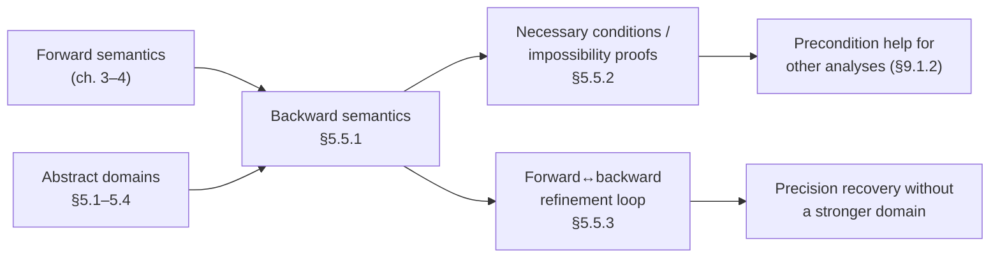

[[book-guidelines|↩ Back to guidelines]]

## The direction static analysis usually forgets

Every static analysis you've seen up to this chapter has run in one direction: start
from an over-approximation of the *inputs*, push it through the program, and
compute an over-approximation of the *outputs*. Forward transfer functions,
forward fixpoints, widening applied on the way "downstream" through loops — all
of chapters 3 and 4 assume you begin with what you know at the top of the program
and want to know what's true at the bottom.

But that's not the only question worth asking. Sometimes you're standing at a
*specific point* in the program — an assertion failure, a crash site, a suspicious
return value — and the question runs the other way: **what must have been true
earlier for the program to get here at all?** That's not a forward question. You're
not asking "given this input, what output is possible" — you're asking "given this
output (or this program point), what input conditions are *necessary*." This is
the same shift in direction that a Hoare-logic verifier makes when it computes a
weakest precondition instead of a strongest postcondition, and it's exactly the
shift Rival's §5.5 introduces: **backward semantics**, and the **backward
analysis** built on top of it.

The payoff is concrete and different in kind from anything forward analysis gives
you: forward analysis proves the *absence* of bad behavior (over-approximate
reachable states never violate a safety property); backward analysis, run from a
bad state backward, can prove the *impossibility* of reaching it — or, just as
usefully, it can fail to prove that and instead characterize exactly which inputs
would trigger it. That second case is a **necessary condition** for a behavior:
useful for program understanding, for generating a counterexample search space, and
— as you'll see in §5.5.3 — for sharpening a forward analysis that got stuck.

## 5.5.1 — Backward semantics: the same operators, run in reverse

### What "backward" means concretely

You already met a backward-shaped operator without being told it was one. In
chapter 3, the condition-test analysis used $\mathcal{F}_B(M) = \{m \in M \mid
\llbracket B \rrbracket(m) = \mathit{true}\}$ — filter a set of states down to those
where $B$ holds. That's forward in the sense that it still consumes a set of
*input* states. But Rival now factors it through a genuinely backward primitive:
define $\llbracket B \rrbracket^{bwd}$ as a function from a **Boolean result**
(true/false) to the **set of states that produce it**, and recover $\mathcal{F}_B$
from it. The reason this matters: $\llbracket B \rrbracket^{bwd}$ generalizes past
"filter a known set" to "given only a target result, reconstruct the states that
could produce it" — which is exactly what you need once the "known set" you're
reasoning about lives at the *end* of the program, not the beginning.

Generalize the pattern to every syntactic category:

- **Scalar/Boolean expressions**: $\llbracket E \rrbracket^{bwd}$ takes a *value*
  (or a set of values) and returns the states that evaluate $E$ to it.
- **Commands**: $\llbracket C \rrbracket^{bwd}$ takes a set of *output* states $M$
  and returns the states that **may** lead into $M$.

That "may" is doing real work, and it's worth being precise about, because it's
the one place backward semantics is asymmetric with its forward counterpart.
Because commands can be non-deterministic, a single input state can have several
possible executions — some landing in $M$, some not. The book's chosen backward
semantics includes an input state as soon as *at least one* of its executions
reaches $M$; it does not require *all* executions to land in $M$. This is a
deliberate choice (the "may reach" reading, not the "must reach" reading), and it
is what makes backward semantics dual to *reachability*, not to *total
correctness*. A stricter "must reach" backward semantics is possible and the book
flags it explicitly — but it isn't the one built here, and if you ever construct a
backward analysis of your own, that's the first design decision to pin down
before you write a single transfer rule.

### First-order reading: this is weakest-precondition territory, generalized

If you've seen Hoare logic, $\llbracket C \rrbracket^{bwd}(M)$ should look exactly
like Dijkstra's weakest-precondition operator $wp(C, Q)$ applied to postcondition
$Q = M$ — with one important twist. Classical $wp$ is defined for *total
correctness under demonic non-determinism*: $wp(C, Q)$ holds of a state iff
*every* execution of $C$ from that state terminates in $Q$. Rival's
$\llbracket C \rrbracket^{bwd}$ is the *angelic*/"may" dual — it asks for at least
one execution reaching $Q$, with no termination requirement. This is closer to
Dijkstra's weakest *liberal* precondition ($wlp$, dropping the termination
requirement) crossed with an existential rather than universal quantifier over
non-deterministic choices. The point isn't to force the terminology to line up
exactly — the book doesn't use $wp$/$wlp$ vocabulary at all — it's that **you
already understand the shape of this operator** from program verification: it's
"push a postcondition backward through a command," same as a VC generator does.

## 5.5.2 — What backward analysis buys you, and how it's built

### Two dual questions, one operator

Given the backward semantics, Rival works a single running example (a program
computing the absolute value: `x0` is an arbitrary input, `x1` stores
$|x_0|$, so the forward-computed postcondition is $\{x_0 \mapsto \top,\, x_1
\mapsto [0,+\infty)\}$) to show two outcomes of the same operation:

1. **Necessary-condition extraction.** Pose $M = \{x_1 \in [2,5]\}$ as the target
   postcondition. The exact backward image is $x_0 \in [-5,-2] \cup [2,5]$ — but an
   interval-domain analysis can't express a union of disjoint intervals, so the
   best a non-relational analysis can report is the containing interval
   $[-5,5]$. This is a genuine, familiar precision loss (the same shape of loss
   you already saw forward, on loops with non-convex reachable sets) — a
   partitioning/disjunctive domain (§5.1.3) recovers the exact union. The
   takeaway: *backward analysis is still abstract interpretation* — it inherits
   the same abstraction-domain tradeoffs as everything in chapters 3–5, just
   applied along the reverse edge of the transfer relation.

2. **Impossibility proof.** Pose $M = \{x_1 \le -3\}$. Concretely, no execution
   produces this — the absolute value is never negative — so the *exact* backward
   image is $\emptyset$, and a sound backward analysis is expected to compute
   $\bot$. This is the disproof application: backward analysis returning $\bot$ is
   a **proof that a target state is unreachable**, obtained without ever running a
   forward analysis at all.

These two outcomes are two faces of the same fact: backward analysis computes a
sound over-approximation of "what inputs could lead here." When that
over-approximation is empty, you've proved impossibility outright. When it's
non-empty, you've computed a genuine necessary condition — even if imprecise,
it is *sound to use as a filter*: no state outside the computed pre-condition can
reach $M$.

### Transfer rules, construct by construct

The rules mirror the forward ones in chapter 3, but compose in reverse and split
assignment into two genuinely different cases — this split is the crux of the
whole section, so it's worth internalizing precisely:

| Construct | Backward rule |
|---|---|
| `skip` | Identity: $\llbracket \mathtt{skip} \rrbracket^{bwd\#} = \mathrm{id}$ |
| `C0; C1` | Compose in **reverse** order: analyze $C1$'s backward effect first, then feed the result into $C0$'s |
| `x := E`, **non-invertible** ($x$ does *not* occur in $E$'s RHS) | Apply the abstract effect, then **forget** ("havoc") all constraints on $x$ — the assignment overwrote $x$, so nothing about its *pre*-state can be recovered from its post-state |
| `x := E`, **invertible** ($x$ *does* occur in $E$) | Algebraically invert $E$ against the abstract domain's operations. Interval example: post-condition $\{x \mapsto [10,12]\}$ with $E = x+2$ inverts to pre-condition $\{x \mapsto [8,10]\}$ by subtracting 2 from both bounds |
| `if(B){C0}else{C1}` | $\llbracket \mathtt{if}(B)\{C0\}\mathtt{else}\{C1\} \rrbracket^{bwd}(M) = \mathcal{F}_B(\llbracket C0 \rrbracket^{bwd}(M)) \cup \mathcal{F}_{\lnot B}(\llbracket C1 \rrbracket^{bwd}(M))$ — same test-then-branch composition as forward, just with the branch effects and the test composed in the opposite order, and joined (not met) because either branch could be the one taken |
| loop | Same fixpoint machinery as §3.3.3 (abstract iterates, widening if the domain has infinite height) — Rival doesn't re-derive it, since nothing about backward composition changes the *fixpoint theory*, only which transfer function you're iterating |

The invertible/non-invertible split deserves a second look because it's an
**information-flow** fact dressed up as a syntactic case split: whether you can
recover a pre-state constraint on $x$ from a post-state constraint on $x$ depends
entirely on whether the assignment's right-hand side still mentions $x$. If it
does, the assignment is (abstractly) *injective enough* to invert — algebraically,
for domains with a group-like structure on the relevant operations (interval
arithmetic under $+,-$ is the book's example), inversion is just "run the inverse
operation on the abstract value." If it doesn't, the assignment has *erased*
whatever information distinguished pre-states — $x$'s old value is a genuine
"don't know," which is exactly `⊤`/havoc, not an approximation of something more
precise.

### Where this already lived, unnamed

Rival is explicit that you've been doing a form of backward analysis since
chapter 3 without naming it: **the analysis of a condition test *is* a local
backward analysis** (using $\mathcal{F}_B$, i.e. $\llbracket B \rrbracket^{bwd}$
restricted to `true`). §5.5 doesn't introduce a new phenomenon so much as it
*generalizes and names* an operator you already had a special case of — the same
move as noticing that a data structure's iteration pattern is "actually a fold."

## 5.5.3 — Forward and backward, alternated: recovering precision a single pass can't

The third application is the sharpest one, and it's where backward analysis stops
being a standalone technique and becomes a **precision-refinement loop**.

**Setup.** A straight-line branch (no loop) with three sequential condition tests
that are jointly infeasible — no assignment of `x`, `y` satisfies all three at
once, so program point ③ is dead code, reachable never. The book frames it in the
*transitional* semantics (chapter 4) since there's no other control flow to
distract from the point.

**Forward alone, weak domain, fails.** With the **interval** domain (non-relational
— it forgets correlations between variables), the forward analysis at each program
point is sound but loses exactly the fact that matters: a relation like $y \le x$
gets dropped because intervals can't express *inter*-variable constraints at all.
The analysis reaches ③ with a non-empty abstract state and reports it as
potentially live. With **convex polyhedra** (a relational domain, definition 3.9)
forward alone *does* succeed — polyhedra track exactly the linear relations
intervals throw away. But that's an expensive domain, and the point of this
section is to show you don't have to pay for it everywhere.

**Forward, then backward, cheap domain, succeeds.** Run the weak (interval)
forward analysis to completion as before — same imprecise result at ③:
$\{x \mapsto (-\infty,4],\, y \mapsto [5,+\infty)\}$. Now run a **backward**
analysis using *that* abstract state as the starting post-condition, propagating
it back through the same three tests via the transfer rules above. Backward
composition combines the *late* range information ($y \ge 5$ from further down
the branch) with the *early* test ($y \le x$) in a way the purely forward,
one-pass analysis never gets the chance to: propagated backward, the constraints
collide, $y \le x$ becomes provably violated by the time you reach the start, and
the backward analysis returns $\bot$ — empty pre-condition. Feeding that back
through a second forward pass confirms: **no state reaches ③**, using only
intervals throughout, never touching polyhedra.

**Why this works in general, and its limits.** [[Specialized-Static-Analysis-Frameworks#The mechanism|The mechanism]] is: information that
is "born" late in a branch (a range fact only visible after several transformations)
gets carried *backward* to where it can collide with an early, cheap fact that a
single forward pass had already discarded by the time it would have been useful.
This is a genuine capability a single-direction analysis structurally cannot have
— it's not that the interval domain "tries harder" on the second pass, it's that
the *direction* of information flow changes what's available to combine. The book
notes this can be applied globally (whole-branch, as above) or very locally, as a
per-test refinement technique called **local iterations**, and that the
forward→backward→forward cycle can be iterated further for more precision, bounded
in practice by termination and cost — you don't get this refinement for free
indefinitely.

If you know CEGAR (counterexample-guided abstraction refinement) from the SMT/model-checking
world, flag the resemblance and also flag where it breaks down: CEGAR refines an
*abstraction* using information extracted from a spurious counterexample trace;
Rival's forward-backward loop keeps the *same* abstract domain fixed throughout and
instead alternates the *direction* of a fixed abstract semantics. It's a cheaper,
narrower move — no abstraction-refinement step, no new predicates introduced — but
it's solving a structurally similar problem: a spurious/imprecise result from one
analysis direction gets falsified by combining it with information from the other
direction, without paying for a strictly more expensive base technique (a
relational domain, in this case).

## Grounding: what this looks like as code

### Rust — backward transfer as an explicit, invertible operation

The invertible/non-invertible split is the part of this section with the most
direct payoff for a checker/verifier written in Rust: it's exactly the shape of
"can I run this assignment's abstract transformer backward to reconstruct a
precondition," which is precisely what a Hoare-triple weakest-precondition
generator or a backward-symbolic-execution engine needs for every assignment node.

```rust
/// A minimal interval abstract value, `None` meaning bottom.
#[derive(Clone, Copy, Debug, PartialEq)]
struct Interval { lo: f64, hi: f64 }

impl Interval {
    fn top() -> Self { Interval { lo: f64::NEG_INFINITY, hi: f64::INFINITY } }
}

/// A tiny expression language, just enough to show invertibility.
enum Expr {
    Var(String),
    Add(Box<Expr>, f64), // x + c
}

fn occurs(e: &Expr, x: &str) -> bool {
    match e {
        Expr::Var(v) => v == x,
        Expr::Add(inner, _) => occurs(inner, x),
    }
}

/// Backward transfer for `x := e`, given a postcondition on `x`.
/// Mirrors §5.5.2's case split exactly: invertible vs. non-invertible.
fn backward_assign(x: &str, e: &Expr, post_x: Interval) -> Interval {
    if !occurs(e, x) {
        // Non-invertible: x's old value is unconstrained by this equation.
        Interval::top()
    } else {
        // Invertible: algebraically invert against the interval's group
        // structure. Only Add(Var(x), c) is invertible in this toy language;
        // a real analyzer would dispatch per abstract-domain operator.
        match e {
            Expr::Add(_, c) => Interval { lo: post_x.lo - c, hi: post_x.hi - c },
            Expr::Var(_) => post_x, // x := x is the identity
        }
    }
}
```

The design lesson that generalizes past intervals: **a backward transfer function
is only as good as the abstract domain's ability to invert its own forward
operators.** For intervals under `+`/`-`, inversion is closed-form. For a
relational domain (polyhedra, octagons), "inversion" of an assignment is a
projection-and-substitution operation on the constraint system — more expensive,
but the same conceptual slot. If you're building the CSP kernel described in your
learning goals — searching for concrete counterexamples that *violate* an
invariant — this `backward_assign` shape is the load-bearing primitive: propagating
a target "bad" postcondition backward through a program to a *necessary*
precondition is exactly how you prune the search space before falling back to a
constraint solver for the remaining, non-invertible slack.

### Lean — backward semantics as a specification you'd actually prove sound

Where Lean earns its keep here isn't in re-deriving the transfer rules — it's in
making explicit *what soundness of a backward analysis even means*, the same
relational statement chapters 3–4 make for forward analysis, just with the
implication reversed:

```lean
-- Concrete backward semantics: states that MAY lead into `post` via `c`.
-- `Exec c s s'` : command `c` can step state `s` to `s'` (non-deterministic).
def bwd (c : Cmd) (post : Set State) : Set State :=
  { s | ∃ s' ∈ post, Exec c s s' }

-- Soundness obligation for an abstract backward transfer `bwd#`,
-- relative to a Galois connection (α, γ) between concrete and abstract states:
--   the concrete backward image, concretized, is contained in what bwd# claims.
theorem bwd_sound (c : Cmd) (post : AbsState) :
    bwd c (γ post) ⊆ γ (bwd_abs c post) := by
  sorry
```

This is the same soundness *shape* as every forward transfer function in the book
— $\alpha \circ F \sqsubseteq F^{\#} \circ \alpha$, mirrored — which is worth
stating explicitly because it means backward analysis doesn't need a new
metatheory: it slots into the same Galois-connection soundness proof obligations
your elaborator's or verifier's trusted kernel already needs to discharge for
forward transfer functions. If your compiler's kernel checks proof certificates
rather than trusting the analyzer outright, a certificate for a
backward-analysis-derived fact (e.g. "point ③ is unreachable") is a proof term of
exactly this `bwd_sound`-shaped statement, instantiated at the specific program and
post-condition — nothing about proof reconstruction changes because the analysis
ran backward instead of forward.

## Where this leads

Structurally, within the book: §5.5 depends on the compositional/transitional
semantics of chapters 3–4 (it reuses their transfer-rule *style*, just reversed)
and on the abstract-domain machinery of §5.1–5.4 (a backward analysis is only as
precise as the domain it's instantiated with — witness the interval-vs-polyhedra
contrast in §5.5.3). It feeds forward into §9.1.2, where backward-derived
pre-conditions are used to help *other* static analyses, and its "may reach"
framing recurs wherever the book later needs to reason about reachability rather
than pure safety.



For your compiler project specifically: this section is the cleanest textbook
statement of the **duality your architecture is built around**. Forward abstract
interpretation is your mechanism for *proving absence* of bugs — over-approximate
reachable states, show no bad state is among them. The CSP kernel you're planning,
searching for concrete counterexamples, is doing the *backward*, "may reach" job —
starting from a bad target state (a violated refinement, a failed Hoare
postcondition) and searching for satisfying assignments that reach it. §5.5.2's
invertible-assignment machinery is literally the pruning step that makes that
search tractable instead of brute-force: propagate the "bad" target backward
through invertible operations for free (closed-form inversion, no solver call),
and only hand the constraint solver the residual, non-invertible slack. And
§5.5.3's forward-backward alternation is a lightweight, same-domain cousin of the
CEGAR loop your CSP/abstract-interpretation combination will need at a larger
scale — the difference being CEGAR additionally *refines the abstraction itself*
between rounds, which is the natural next question once this section's
fixed-domain version stops being enough.
