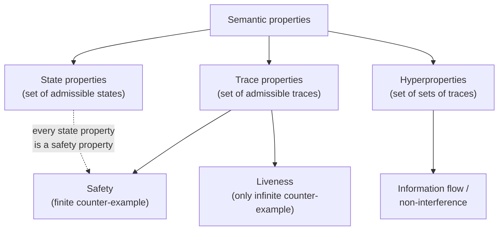
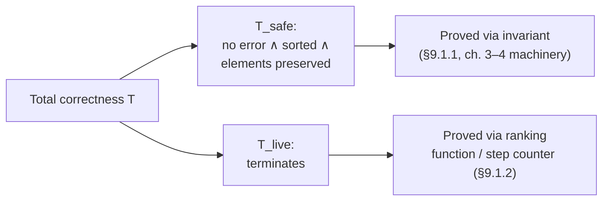
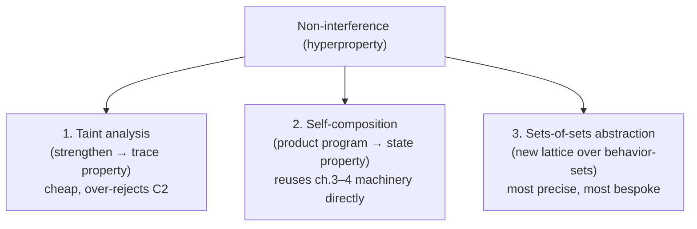

# Classes of Semantic Properties and Their Verification

[[book-guidelines|↩ Back to guidelines]]

## Why state properties aren't the whole story

Every analysis built in chapters 3–4 of the book answers one shape of question: *is this reachable state bad?* You compute an invariant — an over-approximation of the reachable states — and check it against a set of forbidden states. That machinery is powerful, but it silently assumes the property you care about is *about a single state, in isolation from how the program got there or where it's going*. Call this a **state property**: a set $S$ of admissible states, satisfied by a program $p$ iff every state reachable by $p$ lies in $S$.

Most bugs people care about are *not* state properties. Consider verifying that an in-place sort:

1. never crashes with a run-time error,
2. terminates,
3. returns a sorted array, and
4. returns an array containing exactly the same multiset of elements as the input.

(1) and (3) are checkable by looking at one state at a time — did we reach an error state, is the array sorted at exit. But (4) is not: staring at the final array alone, you cannot tell whether its elements are the *same* elements that were there initially, or a completely different set that happens to look permuted. You need to relate the *final* state to the *initial* state of the *same execution*. And (2), termination, can't even be falsified by looking at any single finite state — you'd need to observe an infinite trace to know for sure.

This is the chapter's organizing move: broaden the target from *sets of states* to **sets of execution traces**, and further, for some properties, to *sets of sets of traces*. Each broadening requires new abstraction machinery, but — and this is the payload the chapter wants you to walk away with — none of it discards the invariant-computation techniques from chapters 3–4. It reuses them, sometimes by extending what a "state" carries, sometimes by transforming the program itself before handing it to the existing analyzer.



## Trace properties: the generalization that costs nothing (for safety)

**Definition (trace property).** A semantic property $P$ is a *trace property* if it can be defined as a set $T$ of admissible execution traces, and a program $p$ satisfies $P$ iff $\llbracket p \rrbracket \subseteq T$, where $\llbracket p \rrbracket$ is the set of all execution traces of $p$ (the collecting/operational semantics from earlier chapters). This is strictly more general than a state property: absence of run-time errors, "the output array is sorted," and "the array's elements are preserved" are all trace properties, but only the first two are state properties.

Because satisfaction is subset inclusion, trace properties inherit two monotonicity facts directly from set theory, and the book flags both as load-bearing for what follows:

$$
\llbracket p_0 \rrbracket \subseteq \llbracket p_1 \rrbracket \ \wedge\ p_1 \models T \implies p_0 \models T
$$

(a program with *fewer* behaviors than a program satisfying $T$ also satisfies $T$ — "more behaviors can only hurt"), and

$$
p \models T_0 \ \wedge\ T_0 \subseteq T_1 \implies p \models T_1
$$

($T_0$ being a stronger property than $T_1$). Hold onto the first one — section 9.2 uses its failure as the key witness that information-flow properties are *not* trace properties at all.

**What breaks without trace properties.** If you only ever had state properties, you'd have no way to state "the sort preserves the input's multiset," because that's a relation between the *start* and *end* of one execution, and a bare set of states erases the connection between them. You'd be stuck describing only per-instant assertions, never per-run properties.

**Rust [[Specialized-Static-Analysis-Frameworks#Grounding|grounding]].** The shift from "state property" to "trace property" is exactly the shift from a predicate on a snapshot to a predicate on a *history*. If your analyzer's core type is

```rust
struct State {
    pc: Label,
    mem: Memory,
}
```

a state property is `fn admissible(s: &State) -> bool`. A trace property needs access to the whole run:

```rust
type Trace = Vec<State>;
fn admissible_trace(t: &Trace) -> bool;
```

but as we'll see below, you almost never implement it this way directly — you instead *enrich* `State` with just enough summary information about the trace-so-far that `admissible` on the enriched state recovers the trace property. That's the trick used twice in this chapter (once for safety, once for liveness), and it's the same trick a Hoare-logic verifier uses when it carries `old(x)` values into a postcondition — more on that below.

## 9.1.1 Safety properties: state properties are a special case, but not the only case

**Definition (safety).** A safety property is one refutable only by a *finite* counter-example trace — "some bad thing never happens in finite time." Every state property is automatically a safety property (an unreachable-state violation is witnessed by a finite trace reaching it), but the converse fails: the array-preservation property above is a safety property (a violation is witnessed by one finite execution that ends with the wrong multiset) yet it is *not* a state property, because you cannot decide it by looking at the final state alone.

**The general verification principle.** For a plain state property $P$, the book restates what chapters 3–4 already did operationally: proving $P$ reduces to finding an inductive invariant $I$ — a set of states closed under the initial condition and under one execution step — that is disjoint from the "bad" states. This is exactly what a fixpoint-based static analysis computes: the invariant *is* the abstract reachable-states approximation.

**What breaks without the extension trick, and how the book fixes it.** For a safety property that is *not* a state property (array preservation), a plain reachable-states analysis genuinely cannot express it — there's no set of "bad states" to separate from, because badness depends on trace history. The book's fix is to **enrich the state with symbolic trace summary information**:

- concretely, extend each state with a function tracking, with multiplicity, which values have been added to or removed from the array since the start;
- abstractly, let a symbolic variable $X$ denote "the multiset initially in the array," and let the abstract state carry a symbolic formula over $X$, e.g. $X \uplus \{x\} \setminus \{a[i]\}$ meaning "one occurrence of $a[i]$ removed, one occurrence of $x$ added."

Then the property becomes checkable state-by-state again: at the initial state the transformation is the identity; at the exit state, the accumulated transformation must *also* reduce to the identity ($X$, untouched). This is a general recipe — **reduce a non-state safety property to a state property by instrumenting the state with just enough symbolic trace-history**, then run the ordinary invariant analysis from chapters 3–4 unmodified. It's the same idea trace partitioning (section 5.1.3) already exploited to recover some path-sensitivity without abandoning state-based analysis.

**Rust grounding — the instrumentation as a compiler pass.** This is precisely a *ghost-state* transformation, the kind a Rust-hosted verifier would implement as a pre-analysis rewrite before calling the abstract interpreter:

```rust
/// Symbolic multiset delta, tracked as ghost state alongside the real memory.
/// Represents X ⊎ {added...} \ {removed...} relative to the initial array.
#[derive(Clone, PartialEq, Eq)]
struct MultisetDelta {
    added: Multiset<Value>,
    removed: Multiset<Value>,
}

impl MultisetDelta {
    fn identity() -> Self { MultisetDelta { added: Multiset::empty(), removed: Multiset::empty() } }
    fn is_identity(&self) -> bool { self.added == self.removed }
}

// Ghost-instrumented state: same interface the ordinary analyzer expects,
// but carrying one extra field the analyzer's join/widen never has to
// know is "special" — it's just another abstract domain component.
struct GhostState {
    real: State,
    delta: MultisetDelta,
}
```

The instrumentation is invisible to the fixpoint engine: `MultisetDelta` is just another non-relational abstract-domain component, joined and widened like any `val_abs`. This is the general pattern for reducing hyperproperty-*adjacent* trace properties down to something an off-the-shelf reachability analyzer can swallow — you'll see the same "add a ghost field, keep the engine dumb" move again below in liveness, and it is exactly how a Rust verifier would encode a Hoare-logic postcondition referring to `old(x)`.

## 9.1.2 Liveness properties: only infinite counter-examples refute them

**Definition (liveness).** A liveness property can be refuted only by an *infinite* counter-example — "the program eventually does the good thing," where no finite prefix can prove or disprove it. Termination is the canonical example: a program violates termination iff it has *some* infinite execution; a single finite execution tells you nothing (it might simply not have looped yet).

**What breaks without ranking functions.** A reachable-states analysis over-approximates the states that *can* occur; it says nothing about whether execution eventually *stops* occurring. You cannot certify "no infinite trace exists" by staring at any invariant over states alone — you need an argument that something strictly decreases along a well-founded order, forcing termination. That "something" is a **ranking function** (or *variant*): an integer-valued (or more generally well-founded-ordered) quantity that strictly decreases at every step and is bounded below.

**The book's technique: instrument with a step counter, then reuse ordinary invariant analysis.** Rather than reasoning about infinite traces directly, extend the state with an extra counter $c$: $c = 0$ initially, and $c$ increments by one at every step. Termination of a *particular* execution reduces to proving $c$ stays *bounded* along that execution — a state property again, provable by ordinary reachability analysis! Concretely, for a factorial loop over `n`, iterating `k` times costs `3k` steps (test + two assignments per iteration), so at the loop head the invariant $0 \le i \le n_0$ combined with the relation between $c$ and $i$ yields $c \le 3n_0 + 2$ — a numerical invariant a convex-polyhedra domain computes directly. The general recipe:

1. augment the state with a step-counter variable,
2. augment the state with a frozen copy of the initial values of the relevant numerical variables,
3. run a standard numerical analysis (relational, e.g. polyhedra) to bound the counter in terms of those frozen initial values.

This does not, by itself, prove termination for a *loop with unbounded iteration count* in general — it proves a *bound* on the number of steps as a function of initial values, which is the special case where a decreasing quantity ($n_0 - i$, in the example) is syntactically evident. The book notes this is a simplified instance of more advanced ranking-function-inference techniques; the essential idea — turn "prove no infinite trace" into "prove a numerical invariant on an instrumented state" — is the transferable one.

**Lean grounding — this is exactly Lean's own termination checker.** If you've written a recursive function in Lean that isn't obviously structurally recursive, you've already built a ranking function by hand:

```lean
def collatzLen : Nat → Nat
  | 1 => 0
  | n+1 =>
    if (n+1) % 2 = 0 then 1 + collatzLen ((n+1)/2)
    else 1 + collatzLen (3*(n+1)+1)
  termination_by n => n  -- WRONG in general: needs a real decreasing measure
```

Lean's `termination_by` / well-founded recursion elaborator demands *precisely* a ranking function: an expression valued in a well-founded order (usually `Nat` with `<`) that provably decreases across every recursive call, discharged as a proof obligation (`decreasing_by`) the kernel checks. The book's step-counter-plus-frozen-initial-values technique is the static-analysis analogue of synthesizing that measure *automatically* rather than requiring the programmer to supply it — which is exactly the gap between "Lean requires you to hand it a ranking function" and "a termination-proving static analyzer infers one." If your own compiler's totality checker for recursive refinement-typed functions needs to accept more than syntactically-obvious structural recursion, this chapter's instrumentation is [[Specialized-Static-Analysis-Frameworks#The mechanism|the mechanism]] to reach for before resorting to asking the user for an explicit measure.

## 9.1.3 General trace properties: safety ∧ liveness

Total correctness of the sort — error-free, terminating, sorted, multiset-preserving — mixes both categories and fits neither alone. The chapter states the general decomposition theorem:

$$
T = T_{\text{safe}} \wedge T_{\text{live}}
$$

*any* trace property $T$ decomposes into a safety part and a liveness part, verifiable independently (sections 9.1.1 and 9.1.2 respectively), though in practice they often reuse common facts about the program and are proved together. This is not a new idea — it's the abstract-interpretation restatement of the classical **Floyd proof method**: invariant assertions handle the safety half, a well-founded decreasing quantity handles the liveness half. For the sort: $T_{\text{live}}$ is "terminates"; $T_{\text{safe}}$ bundles the other three (no error, sorted output, preserved elements).



## 9.2 Beyond trace properties: hyperproperties and information flow

Everything so far still quantifies over *one* execution at a time — a trace property is, definitionally, "for each execution, [something] holds." Section 9.2 introduces a property that provably cannot be phrased that way.

**Definition (information flow).** An information flow from secret variable $s$ to public variable $p$ exists when observing $p$ reveals something about $s$. Absence of flow ("non-interference") is stated as:

> for every pair of executions whose initial states differ *only* in the value of $s$, the observable output on $p$ is the same.

This is a statement about **pairs of executions**, not about each execution individually — and that distinction turns out to be exactly what breaks trace properties.

**The $C_0, C_1, C_2$ counterexample.** With $s, p \in \{0,1\}$:

- $C_0$: assigns $p$ a non-deterministic value, ignoring $s$ entirely — secure, and has *many* behaviors (both outputs possible from any input).
- $C_1$: assigns $p \gets \text{nondet}() \times s$ — for $s=0$ always $p=0$; for $s=1$, $p$ may be $0$ or $1$. Observing $p=1$ tells you $s=1$ for certain: **insecure**.
- $C_2$: computes $p \gets \text{nondet}()[0,1] - s$ — syntactically reads $s$, but its *semantics* coincides exactly with $C_0$'s: secure, despite the syntactic dependency.

Now apply the first monotonicity fact from section 9.1: $\llbracket C_1 \rrbracket \subseteq \llbracket C_0 \rrbracket$ ($C_0$ has strictly more behaviors than $C_1$), and $C_0$ is secure. If "secure" were a trace property, monotonicity would force $C_1$ — having *fewer* behaviors than a secure program — to also be secure. But $C_1$ is not secure. **Contradiction — therefore non-interference is not a trace property.** The formal reason: trace properties quantify once over an execution ("for each execution, $P$ holds"); non-interference quantifies over a *pair*. The book names the general class: a **hyperproperty** is defined by a set of *sets of traces* (quantifying over more than one execution at once); trace properties are the special case where that outer set is a singleton-closed family.

This has teeth for anyone building an analyzer: **the standard "over-approximate an inconvenient fragment's behavior" soundness trick is unsound here.** For an ordinary trace property, replacing a hard-to-analyze fragment with "may do anything" is a safe, if imprecise, over-approximation — that's the whole point of soundness w.r.t. subset inclusion. For non-interference, replacing $C_1$-shaped code with "may do anything" (i.e., treating it as $C_0$-shaped) silently launders an insecurity away, because more behaviors *helped* $C_0$'s case here specifically due to non-determinism swamping the leak, not because more-behaviors-implies-secure in general. Widening/join operators tuned for reachability soundness can therefore be actively *wrong* for hyperproperties if applied naively.

**Rust grounding — the three programs as a lattice-of-behaviors sanity check.** It's worth writing out $C_0, C_1, C_2$ literally to see why they trip up a naive analyzer built only for trace properties:

```rust
fn c0(_s: bool, nondet: bool) -> bool { nondet }               // secure: ignores s
fn c1(s: bool, nondet: bool) -> bool { nondet && s }            // insecure: p=1 ⟹ s=1
fn c2(s: bool, nondet: bool) -> bool { nondet ^ s ^ s }          // secure but *reads* s syntactically
// c2 is semantically ≡ nondet, i.e. ≡ c0 — but no syntactic/trace-only
// analysis that just tracks "does the code path touch s" can see that.
```

Any dependence/taint analysis working purely syntactically will treat `c2` exactly like `c1` (both read `s`), because it cannot see the semantic cancellation — which is precisely the taint approach's known imprecision, discussed next.

### Three ways to verify a hyperproperty

The book gives three strategies, in increasing precision and increasing implementation cost — worth internalizing as a spectrum, not a single "correct" answer:

**1. Taint analysis — strengthen to a trace property, then use the usual machinery.** Define a *taint* relation: `x := E` propagates the taint of every variable in `E` (including condition guards) into `x`. Taint-freedom from $s$ to $p$ **is** a safety/trace property, so it's directly attackable with the abstract-interpretation techniques from earlier chapters — this is the cheap option. But it's strictly *stronger* than non-interference (taint-free $\Rightarrow$ secure, not the converse), so it over-rejects: it accepts $C_0$, correctly rejects $C_1$, but *also* rejects $C_2$, because $C_2$'s code syntactically reads `s` even though the read is semantically cancelled. That imprecision is introduced in the very first step (replacing the hyperproperty by a stronger trace property) and nothing downstream can recover it — a point worth remembering any time you're tempted to "just strengthen the spec and reuse the existing checker."

```rust
// Taint lattice: has the value been influenced by a secret source?
#[derive(Clone, Copy, PartialEq, Eq)]
enum Taint { Untainted, Tainted }
impl Taint {
    fn join(self, other: Taint) -> Taint {
        if self == Taint::Tainted || other == Taint::Tainted { Taint::Tainted } else { Taint::Untainted }
    }
}
// x := E  ⟹  taint(x) = join of taint(v) for every v (including guard vars) occurring in E
```

**2. Self-composition — reduce to a state property on a doubled program.** Since non-interference is a statement about a *pair* of executions of the same program, encode the pair as *one* execution of a transformed program $p'$: duplicate every variable ($p, s \to p_1, s_1, p_2, s_2$), run two copies of $p$ back-to-back (or interleaved) starting from states agreeing on public inputs but free on $s$, then assert $p_1 = p_2$ at the end. This assertion is a plain state property on $p'$ — verifiable with the *exact same* invariant-computation machinery as everything else in the book. Self-composition trades hyperproperty-specific abstraction machinery for a one-time program transformation, at the cost of doubling the state space the analyzer walks.

```rust
// Self-composition, sketched: p' runs two "copies" of p that agree on
// public inputs and may differ on the secret, then asserts equal outputs.
fn p_prime(s1: SecretVal, s2: SecretVal, pub_in: PubVal) -> bool {
    let out1 = p(s1, pub_in);
    let out2 = p(s2, pub_in);
    out1 == out2   // this assertion IS a state property of p'
}
```

Note the direct line to your compiler project's verification-condition generation: self-composition is exactly the trick **relational Hoare logic** uses to prove properties like "these two runs produce the same output" or "this function is deterministic w.r.t. its public inputs" — it's how you'd encode a *relational* refinement contract (`{s1 = s2 ⟹ p1 = p2}` across two calls) as an *ordinary* Hoare triple over a product program, discharging it through the same VC-generation and constraint-solving pipeline you'd build for single-execution contracts. No new proof theory — just a program transformation ahead of the existing one.

**3. Abstraction of sets of sets of executions — attack the hyperproperty directly.** The most precise (and most machinery-heavy) option: lift the abstract domain itself to over-approximate a *set of sets of traces*, i.e., compute $P$ such that $\{\llbracket p \rrbracket\} \subseteq P$ and $P \subseteq \mathcal{I}$ (the set of all secure behavior-sets). This avoids the "irrecoverable imprecision" the taint approach bakes in at step one. Sketching the domain used for $C_0, C_1, C_2$: let $a_0$ denote "the set of sets of traces where $p$ may take any value regardless of $s$, for any input" and $a_1 = \top$ denote "any set of sets of traces." An analysis built on this domain assigns $a_0$ to *both* $C_0$ and $C_2$ (correctly accepting both as secure) while still rejecting $C_1$ — strictly more precise than taint analysis, at the cost of needing bespoke lattice elements shaped like "sets of sets," rather than reusable off-the-shelf domains.



The chapter closes by noting the pattern generalizes beyond security: **average-case execution time** is also only expressible as a set-of-sets-of-executions property (you must consider *all* executions together to average over them), and admits the same two-strategy split — approximate with a stronger, single-execution property (worst-case execution time, which upper-bounds the average whenever it holds), or build a bespoke sets-of-sets abstraction.

## Where this leads

This chapter is the book's explicit acknowledgment that "compute an invariant, check inclusion" — the single recipe driving chapters 2 through 8 — is not the end of the story; it's the *base case* that everything else either reduces to (ghost-state instrumentation for non-state safety, step-counters for liveness, self-composition for hyperproperties) or must genuinely go beyond (sets-of-sets abstraction). The recurring move worth carrying forward is: **before inventing new abstract-domain machinery, ask whether a program (or state) transformation can reduce your property back down to something chapters 3–4 already solve.**

For the compiler/verifier project this vault is building toward, three threads here are directly load-bearing, not just analogous:

- **Self-composition is your template for relational refinement contracts.** Any specification of the shape "two calls/executions must agree" (determinism, non-interference, idempotence-style contracts) reduces to an *ordinary* Hoare-triple VC over a product program — no new proof theory needed in the trusted kernel, just a front-end transformation before constraint generation.
- **The taint-vs-self-composition-vs-sets-of-sets spectrum is a precision/cost dial your CSP-and-abstract-interpretation pipeline should expose deliberately**, the same way CEGAR exposes a coarse-then-refine dial: start with a cheap over-approximating trace property (taint-like) for a fast reject/accept, fall back to self-composition (still reusable machinery) when taint's imprecision produces a suspicious rejection, and reserve bespoke hyperproperty domains for the cases that matter enough to justify them — mirroring how abstract interpretation over-approximates to prove absence of bugs while your CSP kernel searches concrete counterexamples to prove their presence.
- **The termination-by-instrumentation technique is the automatic counterpart to Lean's `termination_by`/`decreasing_by` obligations.** If your refinement-type checker needs to accept non-structurally-obvious recursion (or your Hoare-logic side needs "eventually" contracts, not just "never bad"), this is the mechanism to synthesize a ranking function automatically rather than always demanding one from the user, the way Lean's kernel currently does.
