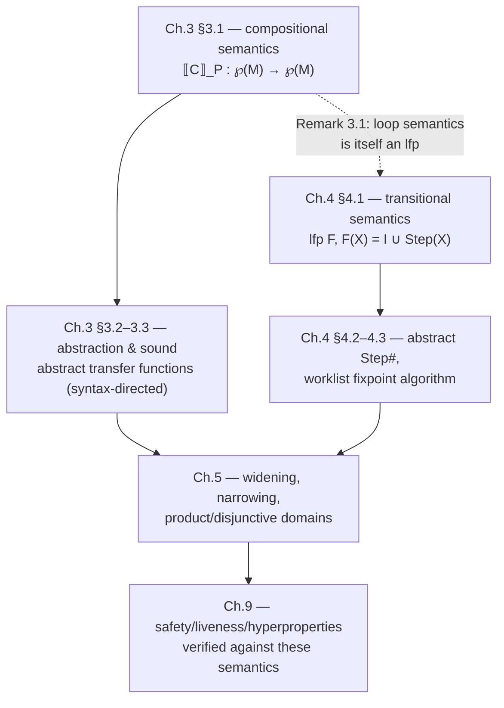

# Concrete Semantics of Programs

[[book-guidelines|↩ Back to guidelines]]

## Why fix a semantics before you write a single line of analysis code

Every later chapter of this book — abstraction, transfer functions, widening, soundness proofs — is a *deviation* from something. You can't define "a sound approximation" without first pinning down exactly what is being approximated. That's the entire job of this topic: before any abstract interpreter exists, Rival and Yi fix a **concrete semantics** — a mathematically precise, executable-in-principle description of what a program actually does at run time.

This might look like a formality you could skip. It isn't. If your reference semantics is too weak — say, it only records final outputs and throws away intermediate state — then no analysis built on top of it can ever prove a property about intermediate states, no matter how clever the abstract domain is. The concrete semantics is the **ceiling on precision**: everything the analysis will ever be able to say about a program is bounded by what the concrete semantics was rich enough to say in the first place. This is the same reason a type checker needs a well-specified operational semantics before you can state (let alone prove) type soundness — "well-typed programs don't get stuck" is meaningless until "stuck" is defined against something concrete.

The book deliberately builds **two** concrete semantics for the same target — a *compositional* (denotational-style) one in Chapter 3, and a *transitional* (small-step operational-style) one in Chapter 4 — because each is the natural foundation for a different family of analysis algorithms. Understanding both, and why they diverge, is the actual content of this topic.

## The shared vocabulary: states, memories, and labels

Both semantics need a notion of **state**. The book's full definition (§4.1.1) is a pair of a **program label** $l$ (which part of the program executes next) and a **machine state** $m$ (the memory contents so far):

$$ s = (l, m) \in S = L \times M $$

Chapter 3's compositional semantics gets to drop the label half entirely. Why? Because a denotational, input-output semantics only ever asks "given this input state, what output state(s) result?" — it doesn't need to name *where* execution currently is, because it never observes an intermediate point. So for Chapter 3, a state is just a memory:

$$ M : X \to V $$

a total function from a fixed, finite set of program variables $X$ to a set of scalar values $V$ (the book's notation: $\{x \mapsto 7, y \mapsto 3\}$ for the state mapping $x$ to 7 and $y$ to 3). This simplification is not free lunch — it is exactly what you lose when you go compositional, and exactly what Chapter 4 restores when a language needs to talk about *where* execution is (because control flow is no longer syntactically obvious).

**What breaks without labels:** consider a `goto E` whose target is computed by evaluating an expression at run time (function pointers and dynamic dispatch are the general case). A purely denotational semantics that "runs the composition of sub-semantics" has nowhere to put "and now jump to whatever label this expression evaluates to" — composition presupposes a static, syntax-determined control structure. That's precisely the reason Chapter 4 exists.

## Track 1 — Compositional (denotational-style) semantics

### The core idea, before the symbols

The book's toy imperative language (§3.1.1) has scalar and Boolean expressions, and commands: `skip`, sequencing, assignment, `input(x)` (non-deterministic input), `if`, and `while`. The compositional semantics defines the meaning of a command as a **function from a set of input states to a set of output states**:

$$ \llbracket C \rrbracket_P : \wp(M) \to \wp(M) $$

The word that matters here is *compositional*: the semantics of `C1; C2` is literally the function composition of the semantics of `C1` and `C2`. This is the same idea as denotational semantics anywhere in programming-language theory — meaning is assigned homomorphically over syntax, so `⟦-⟧` is a structure-preserving map from the abstract syntax tree to the mathematical domain of state-transformers. That's also exactly the shape of a **big-step evaluation judgment** in operational semantics presentations you may know from type theory: $C, m \Downarrow m'$ reads as "$C$ evaluates $m$ to $m'$," and $\llbracket C \rrbracket_P$ is its curried, set-lifted cousin.

Why a *set* of states in and out, rather than one state to one state? Because `input(x)` is non-deterministic — it can bind $x$ to any value in $V$ — so a single input state can legitimately produce many possible output states. Lifting to sets is what makes the semantics *sound with respect to all executions*, and — not coincidentally — it's exactly the lift that later turns into "the analysis must be sound with respect to all reachable concrete states," since the abstract semantics of Chapter 3's back half approximates this very function.

### Building it up, construct by construct

- **Expressions.** $\llbracket E \rrbracket(m)$ evaluates a scalar expression against a single memory state $m$, by structural induction: constants return themselves, variables are looked up in $m$, and $E_1 \odot E_2$ applies the operator's underlying mathematical function $f_\odot$ to the recursively evaluated operands. Boolean expressions $\llbracket B \rrbracket(m)$ are the same shape, returning $\mathbb{B} = \{\mathtt{true}, \mathtt{false}\}$.
- **Filtering.** Conditionals and loops both need to *split* a set of states by whether a condition holds. The book defines this once and reuses it everywhere:
$$ \mathcal{F}_B(M) = \{ m \in M \mid \llbracket B \rrbracket(m) = \mathtt{true} \} $$
  This single function is the seed of *abstract filtering* later in the book (§3.3.2) — you'll see $\mathcal{F}_B^\#$ show up as the operator that narrows an abstract state along a branch condition, which is the direct analogue of what a symbolic executor does at every branch point (push the path condition, restrict the state).
- **Commands.** `skip` is the identity function on state-sets. Sequencing is composition: $\llbracket C_1; C_2 \rrbracket_P = \llbracket C_2 \rrbracket_P \circ \llbracket C_1 \rrbracket_P$. Assignment $x := E$ updates the value bound to $x$ pointwise across the set of input states, using $\llbracket E \rrbracket$. Conditionals split the input state-set with $\mathcal{F}_B$ and $\mathcal{F}_{\lnot B}$, evaluate each branch's semantics separately, and take the union of the results.
- **Loops — the interesting case.** A `while` loop's output is the set of states reached after *some* number of iterations, so it's naturally an infinite union over an iteration count $i$:
$$ M_0, M_1, M_2, \dots \qquad M_i = \text{states reaching the loop exactly } i \text{ times} $$
  Each $M_i$ is defined recursively in terms of $M_{i-1}$ using exactly the same filtering-and-composing machinery as a sequence of conditionals unrolled $i$ times, and the loop's total output is $\mathcal{F}_{\lnot B}\big(\bigcup_i M_i\big)$.

### Where the least fixpoint quietly shows up

The book flags this as an aside (Remark 3.1) but it is, in fact, the single most consequential fact in the whole topic: the infinite-union definition of loop semantics is *equal to* a least fixpoint.

$$ \llbracket \mathtt{while}\ B\ \mathtt{do}\ C \rrbracket_P(M) = \mathcal{F}_{\lnot B}\big(\mathrm{lfp}_M\, F\big), \qquad F(M') = M \cup \llbracket C \rrbracket_P \circ \mathcal{F}_B(M') $$

Why does this matter more than the union formulation? Because a least fixpoint is a fact about a function's *entire* landscape of fixed points, provable via Kleene's theorem (continuity $\Rightarrow$ the least fixpoint is the limit of iterating $F$ from $\bot$) — and every soundness proof in Chapters 3–5 is stated as "the abstract iteration converges to something that over-approximates $\mathrm{lfp}\,F$." If loops were only ever presented as "an infinite union," you'd have no clean mathematical object to relate the abstract computation to. The least-fixpoint reading is what makes *soundness of abstract interpretation of loops* a theorem instead of a hand-wave.

## Track 2 — Transitional (operational-style) semantics

### Why a second semantics at all

Chapter 4 opens by naming the exact gap Track 1 leaves: dynamic control flow. If the next label to execute is computed from a run-time value (`goto E`, function pointers, dynamic dispatch), then "compose the semantics of the sub-commands" has no fixed sub-commands to compose — the control structure itself depends on the run. The fix is to stop trying to define a function from whole-program input to whole-program output, and instead define a **single-step transition relation** between states, then let the semantics be *closure under repeated stepping*. This is precisely small-step operational semantics as you'd meet it in any PL-theory text — Rival and Yi's $\hookrightarrow$ is your familiar $\to$.

$$ s \hookrightarrow s' \qquad s = (l, m),\ s' = (l', m') $$

A run is a chain $s_0 \hookrightarrow s_1 \hookrightarrow s_2 \hookrightarrow \cdots$, and the concrete semantics of interest is the **set of all reachable states** across all runs from all initial states — not input/output pairs, but the full trace-accessible frontier. This is a strictly more expressive artifact than Track 1's semantics: it can express safety properties about *any* reachable state (e.g., "no reachable state has $x < 0$"), not just properties about final states.

### From "keep stepping" to a least fixpoint, explicitly this time

Unlike Chapter 3 (where the fixpoint reading was a remark), Chapter 4 builds the least-fixpoint characterization as the primary definition, because it's the object the rest of the chapter's soundness theorems are stated against.

Let $I \subseteq S$ be the initial states, and lift $\hookrightarrow$ pointwise to sets via $\mathrm{Step}$:

$$ \mathrm{Step}(X) = \{\, s' \mid \exists s \in X,\ s \hookrightarrow s' \,\} $$

The set reachable within exactly $i$ steps is $\mathrm{Step}^i(I)$, and the accumulated reachable set through $i$ steps, $C_i$, obeys the recurrence $C_0 = I$, $C_{i+1} = I \cup \mathrm{Step}(C_i)$. The limit of this increasing chain is the least solution of

$$ X = I \cup \mathrm{Step}(X) $$

— i.e., $\mathrm{lfp}\, F$ for $F(X) = I \cup \mathrm{Step}(X)$. The book states this as **Theorem 4.1**, a direct instance of Kleene's fixpoint theorem: because $F$ is continuous over $(\wp(S), \subseteq)$,

$$ \mathrm{lfp}\, F = \bigcup_{n \geq 0} F^n(\varnothing) $$

and **Definition 4.1** names this the concrete semantics of the program. **Definition 4.2** then gives two reusable terms you'll see throughout the book: $F$ itself is the *concrete semantic function*, and $\wp(S)$ (ordered by $\subseteq$) is the *concrete semantic domain*. The book's **recipe for defining a transitional semantics** (§4.1.2) is exactly three steps — (1) fix the state space $S$, (2) define $\hookrightarrow$ and its lift $\mathrm{Step}$, (3) form $F(X) = I \cup \mathrm{Step}(X)$ and take $\mathrm{lfp}\,F$ — and this recipe is reused, verbatim in structure, for every abstract semantics built later by replacing $\mathrm{Step}$, $\cup$, and the domain with sound abstract counterparts.

**What breaks without the fixpoint framing:** without it, "the analysis is sound" has no fixed target to be sound *with respect to*. With it, soundness becomes a clean inequality between two fixpoints in related domains (the substance of Chapter 4's later soundness theorems, Theorem 4.2–4.4) — which is a provable mathematical statement, not an appeal to intuition about "the algorithm terminates and looks right."

### Instantiating the recipe: a language with dynamic `goto`

Section 4.4 runs the recipe concretely on a language almost identical to Chapter 3's, plus one addition: `goto E`, whose target is the run-time value of `E` rather than a syntactic label. Every other statement's next label is computable statically from a helper judgment the book writes 《$C, l'$》 (given a command $C$ and the label $l'$ to continue at afterward, it derives the `next`/`nextTrue`/`nextFalse` label graph). `goto` is exactly the one construct 《$\cdot,\cdot$》 *cannot* resolve statically — its transition rule has to consult the current memory state to compute the successor label. This is the payoff of having built the whole apparatus: one non-syntactic case, handled uniformly by the same $\hookrightarrow$/$\mathrm{Step}$/lfp machinery, instead of requiring a different semantic framework altogether.

The state space becomes $S = L \times M$ (label-memory pairs), and the concrete semantics is, once again, $\mathrm{lfp}\,F$ for the same shape of $F$ — the recipe doesn't change; only $\hookrightarrow$'s case analysis over statement labels does.

## Compositional vs. transitional: what you actually traded

| | Compositional (Ch. 3) | Transitional (Ch. 4) |
|---|---|---|
| State | memory only | label + memory |
| Semantics of a command | input-output function, defined by structural recursion | reachable-state set, defined as $\mathrm{lfp}(I \cup \mathrm{Step}(-))$ |
| Handles dynamic control flow? | no — composition assumes static structure | yes — labels are first-class in the state |
| Natural analysis style | recursive, syntax-directed (walk the AST) | iterative, worklist-driven (walk the CFG) |
| What the fixpoint captures | just loop bodies (Remark 3.1) | the *entire* program's reachable-state computation (Def. 4.1) |

Neither one is strictly better — the book picks per-chapter to show that the same three-stage design methodology (semantics → abstraction → sound algorithm) survives the choice. But the trade-off matters for *your* design decisions too: a syntax-directed abstract interpreter (typing-rule shaped, recursive over the AST) is the natural analogue of Track 1; a worklist/CFG-fixpoint abstract interpreter (the shape most real static analyzers and most SMT-based reachability tools actually use) is the natural analogue of Track 2.

## Grounding: making both semantics executable

### Rust — the concrete interpreter as a typed AST walk

The compositional semantics translates almost mechanically into a Rust enum-and-match interpreter — this *is* what "an interpreter... inputs a program and an input state and runs the program" (the book's own gloss on $\llbracket C \rrbracket_P$) looks like as code:

```rust
use std::collections::HashMap;

type Var = String;
type Val = i64;
type Mem = HashMap<Var, Val>;

enum Expr {
    Const(Val),
    Var(Var),
    BinOp(Box<Expr>, fn(Val, Val) -> Val, Box<Expr>),
}

enum Cond {
    Cmp(Box<Expr>, fn(Val, Val) -> bool, Box<Expr>),
    Not(Box<Cond>),
}

enum Cmd {
    Skip,
    Seq(Box<Cmd>, Box<Cmd>),
    Assign(Var, Expr),
    Input(Var),
    If(Cond, Box<Cmd>, Box<Cmd>),
    While(Cond, Box<Cmd>),
}

fn eval_expr(e: &Expr, m: &Mem) -> Val {
    match e {
        Expr::Const(n) => *n,
        Expr::Var(x) => m[x],
        Expr::BinOp(l, f, r) => f(eval_expr(l, m), eval_expr(r, m)),
    }
}

fn eval_cond(c: &Cond, m: &Mem) -> bool {
    match c {
        Cond::Cmp(l, f, r) => f(eval_expr(l, m), eval_expr(r, m)),
        Cond::Not(c) => !eval_cond(c, m),
    }
}

// One (single, chosen) run — the interpreter's single-state analogue
// of the set-valued ⟦C⟧_P. Non-determinism (`input`) is resolved by
// whatever supplies `input_source`, mirroring the book's remark that
// the interpreter "partly chooses" input in a non-deterministic manner.
fn run(c: &Cmd, m: &mut Mem, input_source: &mut impl FnMut() -> Val) {
    match c {
        Cmd::Skip => {}
        Cmd::Seq(c1, c2) => { run(c1, m, input_source); run(c2, m, input_source); }
        Cmd::Assign(x, e) => { let v = eval_expr(e, m); m.insert(x.clone(), v); }
        Cmd::Input(x) => { let v = input_source(); m.insert(x.clone(), v); }
        Cmd::If(b, ct, cf) => {
            if eval_cond(b, m) { run(ct, m, input_source) } else { run(cf, m, input_source) }
        }
        Cmd::While(b, body) => {
            while eval_cond(b, m) { run(body, m, input_source); }
        }
    }
}
```

Note precisely what's *missing* from this code relative to $\llbracket C \rrbracket_P$: it runs one state to one state, not a set to a set, and it doesn't terminate on non-terminating loops instead of "producing no output state." Recovering the book's actual set-valued, filter-based semantics from this sketch is exactly the move a static analyzer makes — replace `Mem` with an abstract-domain element, replace `run` with a structurally identical recursive walk that calls abstract transfer functions, and replace the concrete `while` loop with `lfp` iteration plus widening (Chapter 3 §3.3.3 / Chapter 5). This Rust interpreter *is*, almost verbatim, the compositional-style analyzer skeleton the book itself implements in OCaml in Chapter 7.

The transitional semantics is the natural shape for a **worklist-based abstract interpreter**, which is closer to what you'll want for a language with non-syntactic control flow (dynamic dispatch, exceptions, or — in your compiler's case — resolved implicit-argument call sites):

```rust
type Label = usize;

#[derive(Clone, PartialEq, Eq, Hash)]
struct State { label: Label, mem: Vec<(String, i64)> }

// Step: State -> Vec<State>   (one-step successors; goto reads the memory)
fn step(s: &State, program: &Program) -> Vec<State> { /* case on s.label */ todo!() }

// F(X) = I ∪ Step(X), iterated to a fixpoint — the literal Rust reading
// of Definition 4.1 / Theorem 4.1.
fn reachable_states(initial: Vec<State>, program: &Program) -> std::collections::HashSet<State> {
    use std::collections::HashSet;
    let mut reached: HashSet<State> = initial.into_iter().collect();
    loop {
        let mut next = reached.clone();
        for s in &reached {
            next.extend(step(s, program));
        }
        if next == reached { break; }
        reached = next;
    }
    reached
}
```

`reachable_states` is a direct, unaccelerated implementation of $\mathrm{lfp}\,F$ by Kleene iteration from $\varnothing$ — exactly Theorem 4.1's constructive reading — and it is the un-widened ancestor of every worklist fixpoint solver your abstract interpreter will eventually run, including the invariant-generation loop that turns Hoare-triple `requires`/`ensures` annotations into checkable obligations.

### Lean — the least fixpoint as a first-class object

Where the book gestures at "Kleene's fixpoint theorem" and "continuous function," Lean lets you state — and, in principle, check — the exact same object as a genuine mathematical construction rather than an informal recipe. A monotone endofunction on a complete lattice (here, $\wp(S)$ under $\subseteq$) has a least fixpoint by the Knaster–Tarski theorem, which is what actually backs the book's use of Kleene iteration for the *specific* continuous case:

```lean
-- ℘(S) with ⊆ is a complete lattice; F is monotone (in fact continuous).
-- Mathlib's OrderHom + lfp gives you the same object the book calls lfp F,
-- with monotonicity/continuity as an explicit, checkable hypothesis
-- rather than an aside.
variable {S : Type*} (I : Set S) (step : Set S → Set S)

def F (stepMono : Monotone step) : Set S →o Set S where
  toFun X := I ∪ step X
  monotone' := fun _ _ hXY => Set.union_subset_union_right I (stepMono hXY)

-- The book's Definition 4.1 is literally:
-- concreteSemantics := OrderHom.lfp (F I step stepMono)
```

This is not decoration: it is exactly the correspondence you'll lean on when the elaborator's metavariable-solving loop or the CSP kernel's constraint-propagation loop need their own termination/soundness arguments — "this iterative process converges to the least fixpoint of a monotone operator on a complete lattice" is the *same theorem*, reused. Definitional equality checking in a kernel (`isDefEq`) is itself often implemented as repeated reduction to a normal form; framing it against an explicit lfp, the way this chapter frames reachability, is what makes a soundness argument about the checker possible instead of just plausible.

### Python — a five-line sketch of the fixpoint idea, nothing load-bearing

```python
def lfp(F, bottom=frozenset()):
    X = bottom
    while True:
        X_next = F(X)
        if X_next == X:
            return X
        X = X_next

# reachable = lfp(lambda X: I | step_set(X))
```

This is the whole idea of Theorem 4.1 with all the type machinery stripped away — useful for building intuition fast, not for anything you'd want to typecheck.

## Structural map: how the two tracks feed the rest of the book



The compositional track's "aside" fixpoint (loops only) and the transitional track's "load-bearing" fixpoint (the whole program) are the *same mathematical device* wearing two different scopes — which is exactly why the book can reuse Kleene's theorem, and later reuse the same widening operator idea, on both sides without re-deriving anything.

## Where this leads

Everything downstream depends on having exactly this pair of objects on hand. Chapter 3's abstraction machinery (Galois connections, non-relational/relational domains) is stated as "approximate $\llbracket C \rrbracket_P$"; Chapter 4's abstract worklist algorithm is stated as "approximate $\mathrm{lfp}\,F$" — soundness in both cases is a fixpoint-inclusion argument that only makes sense because this chapter nailed down what the exact fixpoint *is*. Widening (Chapter 5) exists purely to make the transitional-style fixpoint iteration terminate on infinite-height domains; narrowing exists to claw back some of the precision widening throws away — neither is intelligible without Definition 4.1 as the ground truth they're both trying to approximate.

For your own project, this topic is the direct ancestor of three things: (1) the **operational semantics** your type checker's soundness proof will be stated against — "well-typed configurations don't get stuck" needs exactly this kind of $\hookrightarrow$/reachability setup; (2) the **least-fixpoint invariant-generation loop** at the heart of automated Hoare-triple/Horn-clause inference — a loop invariant is nothing but an over-approximation of $\mathrm{lfp}\,F$ restricted to a loop header, computed by widened Kleene iteration exactly as sketched above; and (3) the general pattern — monotone operator on a complete lattice, least fixpoint via Kleene/Knaster–Tarski — that will resurface, differently instantiated, in the CSP kernel's constraint-propagation fixpoint and in the elaborator's metavariable-resolution loop. Learning to see "iterate until stable" as *always* secretly "compute $\mathrm{lfp}\,F$ over some lattice" is the single highest-leverage habit this chapter is trying to install.
