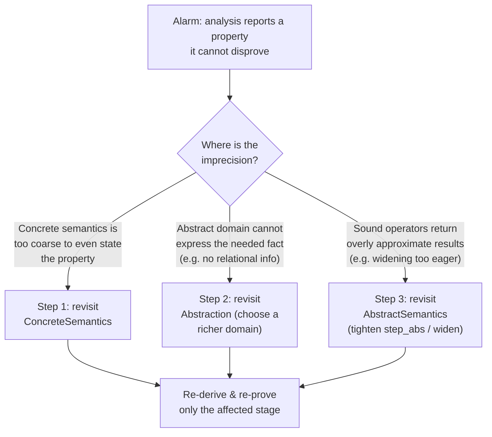
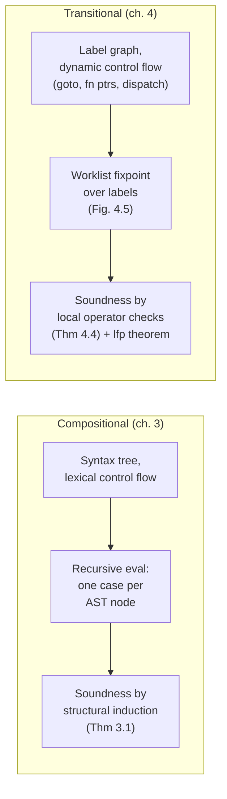

# Design Methodology for Static Analyzers

[[book-guidelines|↩ Back to guidelines]]

## The problem this methodology solves

By the end of chapter 3, Rival and Yi have built one working analyzer — abstract domains for signs and intervals, an abstract semantics defined by structural induction, a widening operator, a soundness proof. It would be tempting to treat that as "an example of static analysis" and move on to the next example. Instead, section 3.4 stops and asks a more useful question: *what did we actually just do, independent of the specific language and domain we happened to pick?*

The answer matters because static analysis has a reputation — deserved, historically — for being a bag of clever, disconnected tricks: one paper's technique for null-pointer checking, another's for buffer overruns, each with its own bespoke correctness argument that doesn't transfer. If every analysis is a one-off, you can't reuse the soundness argument, you can't localize *why* an analysis is imprecise when it disappoints you, and you can't decide in advance which of several possible designs will actually give you what you need. The book's thesis — stated explicitly at the close of chapter 3 and reinforced through chapter 4 — is that this doesn't have to be true: static analysis by abstract interpretation decomposes into a small number of *independent, separately-justifiable* design decisions, made in a fixed order, each with its own soundness obligation. Get the decomposition right and three things follow for free: the design process becomes teachable, the correctness proof becomes compositional (prove each stage sound, compose the proofs), and — the part that matters once you're actually debugging an analyzer — imprecision becomes diagnosable, because you can point at *which stage* introduced it.

This is exactly the shape of problem your own compiler-verifier project will hit once the abstract-interpretation-based invariant generator is running against real programs and producing false alarms: you need a principled way to ask "is this alarm here because my semantics is wrong, my abstraction is too coarse, or my algorithm is cutting corners for speed?" This chapter's methodology *is* the answer to that question, stated in general form before you have a specific bug to chase.

## The three-stage recipe

Here is the recipe as the book states it (§3.4, restated more generally in §4.1–4.2):

$$
\text{static analysis} \;=\; \underbrace{\text{concrete semantics}}_{\text{step 1}} \;\longrightarrow\; \underbrace{\text{abstraction}}_{\text{step 2}} \;\longrightarrow\; \underbrace{\text{analysis algorithms}}_{\text{step 3}}
$$

1. **Fix a concrete semantics.** Define, mathematically and precisely, what programs in your target language actually *do* at runtime. This is not the analysis yet — it's the ground truth the analysis will be judged against. It "specifies the properties the analysis should compute and is the reference compared to which soundness is to be proved." Crucially, this step has to be *compositional* in some sense — defined by structural recursion over the program's syntax, or by induction over a transition relation — because the entire methodology downstream depends on being able to define the abstract counterpart the same way, case by case, and prove soundness case by case (this is Theorem 3.1's role: it licenses "sound analysis = sound analysis of every syntactic piece").

2. **Choose an abstraction.** Decide what set of logical predicates the analysis is allowed to reason about, and fix a computer representation for them (signs, intervals, octagons, whatever fits the properties you care about). This step is governed by a Galois connection $(\alpha, \gamma)$ between the concrete domain (sets of program behaviors) and the abstract domain (finitely representable descriptions of those sets) — or, when no best abstraction exists, by a concretization function $\gamma$ alone. The abstraction is chosen *for the property of interest*, not for the language: the same language can be paired with wildly different abstractions depending on what you're trying to prove.

3. **Derive the analysis algorithms.** With the semantics and the abstraction both fixed, define abstract counterparts of every semantic operator — [[Sound-Abstract-Semantics-and-Analysis-Algorithms#Abstract expression evaluation|abstract expression evaluation]], abstract filtering of conditions, abstract union, a widening operator for infinite-height domains — each required only to be *sound* (never lose behaviors), not unique. This is where genuine design freedom remains: many different sound choices of $\phi_V^\#$, $\sqcup^\#$, or $\nabla$ exist, and picking a deliberately *imprecise* one for speed is a legitimate engineering trade-off, not a bug.

The book is explicit that this is meant to generalize far past the one imperative toy language used to teach it — "not only to imperative languages... but also to other programming paradigms, such as logic programming languages, mobile systems, or hardware designs." It's a recipe for *any* semantics-plus-abstraction pair, which is precisely why it will still apply once you swap the book's numeric domains for your own refinement-type constraint domains, Horn-clause abstractions, or CSP propagation lattices.

### Grounding the recipe: shape it like a trait hierarchy

The cleanest way to see why this decomposition is *load-bearing*, not just expository, is to notice that each stage corresponds to a separate abstraction boundary you'd want in real verifier code — and Rust's trait system makes those boundaries explicit rather than implicit:

```rust
// Step 1: the concrete semantics — what the language actually does.
// Nothing here is approximate; this is the ground truth.
trait ConcreteSemantics {
    type State;               // e.g. a full memory: Var -> i64
    fn step(&self, s: &Self::State) -> Vec<Self::State>; // one execution step
}

// Step 2: the abstraction — a Galois connection between concrete
// and abstract descriptions of state, fixed once per analysis.
trait Abstraction<C: ConcreteSemantics> {
    type AbsState: PartialOrd;               // the abstract domain, e.g. intervals
    fn alpha(&self, concrete: &[C::State]) -> Self::AbsState;   // best abstraction
    fn gamma(&self, a: &Self::AbsState) -> Vec<C::State>;       // concretization
}

// Step 3: the analysis algorithms — sound abstract operators over AbsState,
// and *only* required to satisfy soundness, never exact best-abstraction.
trait AbstractSemantics<C: ConcreteSemantics, A: Abstraction<C>> {
    fn step_abs(&self, s: &A::AbsState) -> A::AbsState;   // sound over-approx of `step`
    fn join(&self, a: &A::AbsState, b: &A::AbsState) -> A::AbsState;
    fn widen(&self, a: &A::AbsState, b: &A::AbsState) -> A::AbsState; // termination
}
```

Notice what this buys you, matching the book's own diagnostic claim almost line for line: if the analyzer emits a false alarm, you now have exactly three places to look, and the trait boundaries force you to look at them *independently*.



The book states this directly: "when an analysis is not precise enough, one should identify which properties it fails to compute and improve either the concrete semantics (step 1), the abstraction (step 2), or the analysis algorithms (step 3), depending on where the lack of precision stems from." It flags that the most common culprit is step 2 — too coarse an abstraction that cannot even *express* the fact you need — with step 3 (over-eager widening, imprecise sound-but-lossy operators) as the second most common source, and step 1 as the rarest but most fundamental failure (your semantics literally cannot state the property).

This maps onto Python for a lighter-weight sketch of the same triage, useful when you're rapid-prototyping before committing to the Rust trait boundaries:

```python
def diagnose_alarm(analysis_result, property_of_interest):
    if not can_state(concrete_semantics, property_of_interest):
        return "step 1: concrete semantics too coarse"
    if not can_express(abstract_domain, property_of_interest):
        return "step 2: abstraction too coarse"
    return "step 3: sound operators (join/widen) are losing precision"
```

## Two ways to fix the concrete semantics: compositional vs. transitional

Step 1 of the recipe — "fix a concrete semantics" — is not itself unique. The book builds the entire recipe *twice*, once per chapter, precisely to show that the same three-stage methodology survives a change of semantic style, and to make the trade-off between the two styles explicit.

**Compositional (denotational-style) semantics — chapter 3.** The semantics of a command $C$ is defined by structural recursion over its syntax: $\llbracket C_1 ; C_2 \rrbracket_P = \llbracket C_2 \rrbracket_P \circ \llbracket C_1 \rrbracket_P$, and so on for every syntactic constructor. This is the natural fit when control flow is *lexically* determined — you can always tell, just by reading the program text, what runs after what. Its major payoff is that soundness proofs become structural induction: Theorem 3.1 says that if each syntactic case's abstract semantics soundly approximates its concrete counterpart, the whole composed analysis is sound, by nothing more than induction on the AST.

**Transitional (small-step operational) semantics — chapter 4.** The semantics is instead defined as a relation between whole machine states, $(l, m) \hookrightarrow (l', m')$, where $l$ is a program label and $m$ a memory. The concrete semantics is the least fixpoint of $F(X) = I \cup \mathrm{Step}(X)$ (Theorem 4.1, a Kleene-fixpoint characterization) — reachable states accumulate by repeatedly applying one-step transitions starting from the initial states $I$.

The book is explicit about *why* you'd give up the clean inductive structure of the compositional style: it breaks down the moment control flow is not determined by lexical syntax alone. A `goto` whose target is computed by evaluating an expression, a function pointer, a dynamic dispatch, a non-local exception raise — in every one of these, "the next label is not fixed in the program text but... determined by the program execution." You cannot write $\llbracket \text{goto } E \rrbracket_P$ compositionally, because there is no fixed successor to compose with. The transitional style sidesteps this entirely: it never asks "what runs after this syntactic node" — it just exposes *every* intermediate state as a first-class element of the semantic domain, and lets reachability, not composition, do the work.

$$
\text{reachable states} \;=\; \mathrm{lfp}\, F, \qquad F(X) = I \cup \mathrm{Step}(X)
$$

This is also, not coincidentally, why the transitional style is the natural fit whenever the target property is *reachability itself* — "the set is obvious in the transitional style because the semantics explicitly exposes all the intermediate states of program executions," as opposed to compositional semantics, which natively only tells you input/output pairs and requires extra bookkeeping (an accumulator) to recover the reachable set.

The recipe's step 3 also changes shape between the two styles, and this is worth internalizing precisely: the compositional recipe derives algorithms *by structural recursion*, one clause per syntax constructor. The transitional recipe instead derives algorithms as *global fixpoint iteration over a label graph* — a worklist algorithm (Fig. 4.5) that tracks, for each program label, a table $\mathcal{C}: L \to M^\#$ of abstract memories, and only re-applies $\hookrightarrow^\#$ at labels whose input just changed, rather than rescanning the whole program every iteration. This is the six-step version of the recipe (§4.2.3): fix the memory/label sets, define the concrete transition and $F$, define the abstract domain and $F^\#$ via a Galois connection, check the CPO/Galois-connection conditions, check the three local soundness conditions on $\hookrightarrow^\#$, $\cup^\#$, and the collapse operator $\widehat{(\cdot)}$ (Theorem 4.4), and only then invoke the general soundness theorems (4.2 for finite-height/monotone $F^\#$, 4.3 with a widening operator otherwise).



### Grounding: recursive AST walk vs. label-graph worklist

The compositional analyzer is naturally a recursive interpreter shape:

```rust
// Compositional-style: analysis follows the AST shape directly.
fn analyze_stmt(stmt: &Stmt, pre: &AbsMemory) -> AbsMemory {
    match stmt {
        Stmt::Skip => pre.clone(),
        Stmt::Seq(c1, c2) => analyze_stmt(c2, &analyze_stmt(c1, pre)),
        Stmt::Assign(x, e) => pre.update(x, analyze_expr(e, pre)),
        Stmt::If(b, c1, c2) => {
            let then_pre = filter_abs(b, pre);
            let else_pre = filter_abs(&Expr::Not(Box::new(b.clone())), pre);
            join(&analyze_stmt(c1, &then_pre), &analyze_stmt(c2, &else_pre))
        }
        Stmt::While(b, body) => analyze_loop(b, body, pre), // widening lives here
    }
}
```

The transitional analyzer instead has no recursive call structure at all — it is a flat fixpoint loop over a mutable table indexed by label, exactly matching the worklist algorithm of Fig. 4.5:

```rust
// Transitional-style: analysis follows the label graph, not the AST.
use std::collections::{HashMap, VecDeque};

fn analyze_worklist(
    labels: &[Label],
    step_abs: impl Fn(Label, &AbsMemory) -> Vec<(Label, AbsMemory)>,
    is_loop_head: impl Fn(Label) -> bool,
) -> HashMap<Label, AbsMemory> {
    let mut table: HashMap<Label, AbsMemory> = init_table(labels);
    let mut worklist: VecDeque<Label> = labels.iter().copied().collect();

    while let Some(l) = worklist.pop_front() {
        for (l_next, m_next) in step_abs(l, &table[&l]) {
            let old = table.get(&l_next).cloned().unwrap_or(AbsMemory::bottom());
            let updated = if is_loop_head(l_next) {
                old.widen(&m_next)   // widening only at cycle targets — Fig. 4.5's refinement
            } else {
                old.join(&m_next)
            };
            if updated != old {
                table.insert(l_next, updated);
                worklist.push_back(l_next);  // only re-visit labels that actually changed
            }
        }
    }
    table
}
```

That `is_loop_head` branch is not a cosmetic detail — it's the book's own refinement of the naive worklist algorithm: applying widening at *every* changed label is sound but needlessly imprecise, whereas restricting widening to labels that are targets of cyclic control flow (loop heads, `goto` cycle targets) and using the precise join elsewhere recovers most of the lost precision for free.

## Where this leads

This recipe is the spine of the entire rest of the book, not a self-contained chapter topic. Chapter 5's product domains, disjunctive completion, and threshold widening are all refinements *inside* step 3, holding steps 1–2 fixed. Chapter 6's discussion of alarm triage is a direct application of the diagnostic reading of this recipe — deciding whether an alarm is a real bug or an artifact of steps 1–3. Chapter 7's implementation guidance is literally "how do you write the code for each of these three stages," compositional-style and transitional-style separately. Chapter 8's treatment of pointers and dynamic memory is a rerun of this exact recipe with a richer concrete semantics. Even the split between forward analysis (chapters 3–4) and [[Backward-Analysis|backward analysis]] (§5.5) is a variation at step 1: define the semantics "backward" and rerun the same abstraction/algorithm machinery.

For your own project, the load-bearing takeaway is stronger than "this is a nice organizing principle": it is *the* architectural pattern your invariant-generation engine should be built around. Your CSP-backed abstract interpreter needs exactly this separation — a concrete semantics for the language you're verifying (kept language-faithful and untouched by abstraction concerns), a Galois-connected abstraction layer for your refinement-type/Horn-clause domains (kept separate from the algorithms), and a step-3 layer of sound-but-tunable propagators (interval/octagon-style domain propagation, CEGAR-style refinement loops) that you are free to make deliberately imprecise for performance without touching soundness of steps 1–2. And when your analyzer produces a false alarm on a program you believe is correct, this recipe gives you the actual debugging discipline: ask, in order, whether your operational semantics can even state the invariant, whether your abstract domain can express it, or whether your sound-but-lossy propagators (widening, join) are throwing it away — rather than guessing.
