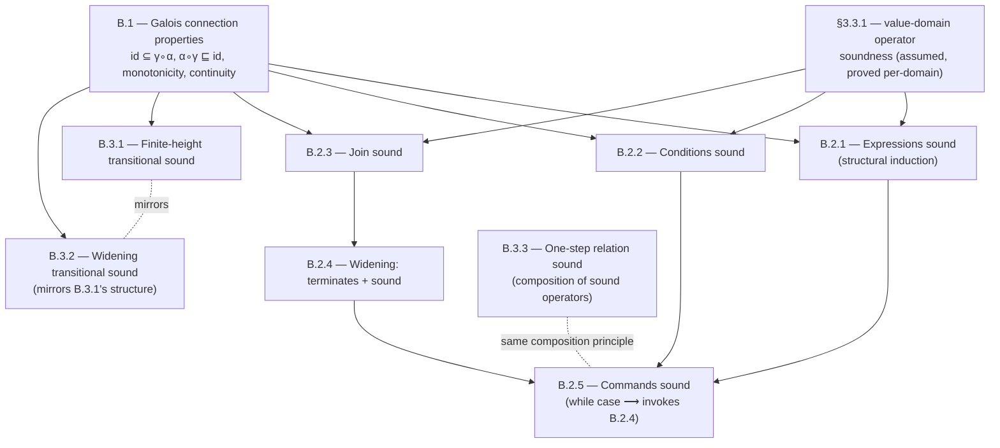

[[book-guidelines|↩ Back to guidelines]]

# Foundational Soundness Proofs

## Why this appendix exists, and why it's worth reading closely

Chapters 3 and 4 of the book *assert* that a whole battery of analysis machinery — [[Sound-Abstract-Semantics-and-Analysis-Algorithms#Abstract expression evaluation|abstract expression evaluation]], abstract joins, widening-based iteration, the transitional-style analyzer — is sound. Appendix B is where those assertions get cashed out as actual proofs. That distinction matters more than it looks: an abstract interpreter is only trustworthy to the extent that its soundness theorem is trustworthy, and a soundness theorem is only trustworthy to the extent you can see exactly which assumptions it leans on and where those assumptions get discharged. If you're eventually going to build a verifier with a trusted kernel, this appendix is a template for what "trusted" has to mean operationally: a short, closed chain of structural inductions, each step invoking either a previous theorem or a raw definitional unfolding, with no hand-waving step in between.

There's also a load-bearing methodological point the book makes almost in passing (Comments after Theorem B.2, restated in the Key Questions): *the soundness of the whole analyzer factors through the soundness of the value-domain operations.* You don't reprove soundness of the expression evaluator every time you swap intervals for octagons — you prove the value-domain operations sound once, and the structural-induction skeleton around them is domain-agnostic. This is exactly the "prove soundness once per abstract domain, compose freely" property you want out of any modular verification architecture — it's the direct analogue of proving a type-checking rule sound once and reusing it across every instantiation of a generic type family.

## B.1 — What a Galois connection actually buys you

### The problem before the symbols

Before B.1, you already have two structures: a concrete domain $(C, \subseteq)$ (say, sets of memory states, ordered by inclusion) and an abstract domain $(A, \sqsubseteq)$ (say, intervals, ordered by "describes a subset of"). You have a function $\alpha: C \to A$ that abstracts a concrete set into its best abstract description, and $\gamma: A \to C$ that concretizes an abstract element back into the set of states it describes. The question B.1 answers is: *what is the minimal contract between $\alpha$ and $\gamma$ that makes "abstract reasoning is safe" a theorem instead of a hope?*

The book's answer, from §3.2.1, is the **adjunction**:

$$
\forall c \in C,\ \forall a \in A,\quad \alpha(c) \sqsubseteq a \iff c \subseteq \gamma(a)
$$

Read this as a single sentence, not a formula: *"$a$ is a valid abstract description of $c$" and "$\alpha(c)$ is no more precise than needed to be covered by $a$" are the same fact, viewed from two sides.* This is deliberately weaker than asking $\alpha$ and $\gamma$ to be inverses — $\gamma(\alpha(c))$ is typically a strict superset of $c$ (that's the whole point: abstraction throws information away). What the adjunction guarantees instead is a controlled, symmetric relationship between the two directions of information loss.

### What Theorem B.1 derives, and why each piece matters

From that single biconditional, the book proves four properties, each of which corresponds to something you actually rely on later:

1. **$\mathrm{id} \subseteq \gamma \circ \alpha$** — abstracting and then concretizing never loses concrete elements. *Proof:* reflexivity gives $\alpha(c) \sqsubseteq \alpha(c)$, and the adjunction (right-to-left) converts that directly into $c \subseteq \gamma(\alpha(c))$. This is what guarantees "if you started with a real state, the abstract analysis's concretization still contains it" — the *soundness of round-tripping*, used implicitly every time a proof injects a concrete element into its abstract image.

2. **$\alpha \circ \gamma \sqsubseteq \mathrm{id}$** — concretizing and then re-abstracting never produces something *more precise* than you started with. Mirror-image proof, using reflexivity of $\subseteq$ this time.

3. **$\gamma$ and $\alpha$ are monotone.** This is what lets soundness proofs be compositional: if you know a sound *approximation* of some quantity, you can push it through $\gamma$ or $\alpha$ and know the result is still a sound approximation of the corresponding quantity on the other side. Every one of B.2–B.9's inductive steps that says "by the induction hypothesis, $\dots \in \gamma(\dots)$, therefore $\dots$" is silently invoking monotonicity to make that inference go through.

4. **$\alpha$ is continuous when $C, A$ are CPOs.** Continuity ($\alpha(\bigsqcup S) = \bigsqcup \alpha(S)$ for chains $S$) is what lets you commute $\alpha$ past an infinite limit — exactly the situation you're in when a fixpoint is computed as $\bigsqcup_n f^n(\bot)$ (Kleene's theorem, Appendix A.6) and you need to know the abstract analysis of *that* limit relates correctly to the concrete one.

The proof of continuity is worth walking through once because it's the templatic move used everywhere else in the appendix: monotonicity of $\gamma \circ \alpha$ turns a chain into a chain, chains have least upper bounds because $C$ and $A$ are CPOs, and then you sandwich $\alpha(\bigsqcup S)$ between two applications of $\mathrm{id} \subseteq \gamma \circ \alpha$ and the adjunction itself to squeeze out equality. Nothing here is deep; the depth is in noticing that four almost-trivial one-line arguments are *all* you ever need, downstream, to justify every "the abstract computation matches the concrete one" step in the rest of the book.

**Rust framing.** A Galois connection is a pair of trait methods with a *law*, not just a signature:

```rust
trait GaloisConnection {
    type Concrete: PartialOrd;   // (C, ⊆)
    type Abstract: PartialOrd;   // (A, ⊑)

    fn alpha(c: &Self::Concrete) -> Self::Abstract;
    fn gamma(a: &Self::Abstract) -> Self::Concrete;

    // LAW (not checkable by the type system — a proof obligation):
    // for all c, a:  alpha(c) <= a  <=>  c <= gamma(a)
}
```

Rust's type system can express the *shape* of the connection but never the law itself — that's exactly the gap a trusted kernel exists to close: it has to check, or be given a certificate, that a *specific* `alpha`/`gamma` pair actually satisfies the adjunction before any downstream soundness argument is allowed to depend on it.

**Lean framing.** This is precisely where Lean's `structure` + separate `theorem` fields earn their keep — you'd model it as

```lean
structure GaloisConnection (C A : Type) [Preorder C] [Preorder A] where
  α : C → A
  γ : A → C
  adjoint : ∀ c a, α c ≤ a ↔ c ≤ γ a

theorem GaloisConnection.id_le_gamma_alpha (gc : GaloisConnection C A) (c : C) :
    c ≤ gc.γ (gc.α c) := (gc.adjoint c (gc.α c)).mp (le_refl _)
```

which is a direct transcription of the book's own one-line proof (`le_refl` playing the role of "by reflexivity of ⊑"). This is also conceptually the same move `isDefEq` makes when it needs to know that reducing a term and then re-elaborating it doesn't produce something *less* defined than what you started with — an adjunction-flavored monotonicity guarantee, just for definitional equality instead of set inclusion.

## B.2 — Soundness for the compositional-style analyzer (Chapter 3)

The organizing idea of B.2 is structural induction over syntax, mirroring Appendix A.3's inductive proof principle for inductively-defined program syntax (this directly answers the guidelines' first Key Question for Appendix A: the technique that works for "prove $P(n)$ for all naturals by induction on $n$" works identically for "prove $P(C)$ for all commands $C$ by induction on the structure of $C$," because commands are just another inductively-defined datatype).

### B.2.1 — Expressions (Theorem B.2)

**Claim:** for all expressions $E$, non-relational abstract states $M^\#$, and memories $m \in \gamma(M^\#)$,
$$
\llbracket E \rrbracket(m) \in \gamma_V\big(\llbracket E \rrbracket^\#(M^\#)\big)
$$

The proof is a three-case structural induction and it's worth internalizing the *shape*, because it recurs verbatim (modulo the operator) in every later theorem:

- **Constants:** $\llbracket E \rrbracket(m) = n$ and $\llbracket E \rrbracket^\#(M^\#) = \varphi_V(n)$; soundness follows directly from the *definition* of $\varphi_V$ (the value domain's constant-injection operator is assumed sound by construction — this is the base case discharging on a raw definitional fact, not an inductive hypothesis).
- **Variables:** $\llbracket E \rrbracket(m) = m(x)$, $\llbracket E \rrbracket^\#(M^\#) = M^\#(x)$; soundness follows directly from the *assumption* $m \in \gamma(M^\#)$, unfolded pointwise.
- **Binary operators** $E_0 \odot E_1$: the two sub-expressions get the inductive hypothesis, and the case discharges by invoking the assumed soundness of the value domain's abstract operator $f_\odot^\#$ (§3.3.1) applied to the (already sound) abstracted operands.

Notice what's *not* proved here: nothing about how intervals, or octagons, or any specific value domain actually implements $\varphi_V$ or $f_\odot^\#$. That's deliberate — and it's the modularity property flagged above. The structural-induction skeleton is proved exactly once, generically over any value domain satisfying the soundness contract in §3.3.1; swapping value domains only requires re-proving that contract for the new domain's concrete operators, never touching B.2.1 again.

**Rust framing** — this is close to how you'd structure a soundness *test harness* (not a proof, but the executable shadow of one) for a real abstract interpreter:

```rust
enum Expr { Const(i64), Var(String), BinOp(Op, Box<Expr>, Box<Expr>) }

fn eval_abstract(e: &Expr, m: &AbstractState) -> AbstractValue {
    match e {
        Expr::Const(n)      => AbstractValue::inject(*n),        // φ_V — base case
        Expr::Var(x)        => m.lookup(x).clone(),               // direct from m ∈ γ(M#)
        Expr::BinOp(op, l, r) => {
            let (la, ra) = (eval_abstract(l, m), eval_abstract(r, m)); // IH applies to both
            op.apply_abstract(&la, &ra)                            // soundness of f_⊙#
        }
    }
}
```

The soundness *theorem* is the claim that this function's result always over-approximates what `eval_concrete` would produce for any concrete `m` represented by `M#` — exactly the property a property-based test (`proptest`-style, sampling concrete states from `γ(M#)`) can spot-check even before you have a hand proof, and exactly the property a Lean formalization of the same interpreter would prove for real.

### B.2.2 — Conditions (Theorem B.3)

Soundness of the abstract *filter* operator $\mathcal{F}_B^\#$: if a concrete memory $m \in \gamma(M^\#)$ satisfies $\llbracket B \rrbracket(m) = \mathsf{true}$, then $m$ belongs to the concretization of the abstract filtered set. The proof is a single unfolding step relying on §3.3.1's assumed soundness of $\mathcal{F}_B^\#$ itself — structurally the shortest proof in the appendix, and the book's own Comments note it's the same pattern as B.2.1, just one operator instead of a full inductive case split. This is the theoretical ancestor of what a **weakest-precondition** or **symbolic-execution** engine does at every branch: filtering the reachable-state abstraction along a guard is condition-narrowing, and its soundness proof here is the abstract-interpretation mirror of proving a Hoare-logic branch rule sound (if $\{P\}\ \text{skip}\ \{P \land B\}$ holds concretely, the abstract filter must not discard any state the concrete rule would keep).

### B.2.3 — Abstract join (Theorem B.4)

$\gamma(M_0^\#) \cup \gamma(M_1^\#) \subseteq \gamma(M_0^\# \sqcup^\# M_1^\#)$. Proved pointwise per variable, again bottoming out in the assumed soundness of the value domain's join $\sqcup_V$. Structurally trivial, but it's the piece every merge-point in a control-flow graph depends on — every `if`/`else` join and every loop-header widening step downstream is only as sound as this one pointwise argument.

### B.2.4 — Widening (Theorem B.5)

This is the first genuinely two-part proof in the appendix, and it's the one most directly relevant to anything you build with a CEGAR-style refinement loop or an abstract fixpoint solver, because it proves *both* termination and soundness for the same algorithm, by two different arguments:

**Termination.** The iterate sequence $Y_0 = M^\#,\ Y_{n+1} = Y_n \nabla F^\#(Y_n)$ is, by the defining property of a widening operator (Def. 3.11 — a widening must satisfy $a \sqsubseteq a \nabla b$ and $b \sqsubseteq a \nabla b$, plus that any sequence built by repeated widening is *ultimately stationary*), guaranteed to stabilize at some finite rank $n$. Termination here is bought entirely by widening's stabilization guarantee — nothing about finite height, nothing about continuity is needed for this half.

**Soundness.** Proved by induction on $n$ that $\bigsqcup_{i \le n} F^i(\bot) \subseteq \gamma(Y_n)$ — i.e., every iterate of the *concrete* fixpoint computation up to step $n$ is covered by the *abstract* iterate at the same step. Base case is trivial ($Y_0 = M^\#$ by construction). Inductive step uses monotonicity of $F$ (from continuity), the inductive hypothesis, and the fact that $\nabla$ over-approximates union — three separate soundness facts chained together in one line. Because the sequence is stationary past rank $N$, the inequality at rank $N$ *is* the inequality for every later rank, which is what finally yields $\mathrm{lfp}\, F \subseteq \gamma(Y_{\lim})$.

The two-part shape here — separate termination and soundness arguments, glued at the end — is the exact shape you'll need for a CHC (constrained Horn clause) solver's fixpoint engine: termination comes from your widening/extrapolation strategy, soundness comes from the invariant that every abstract iterate over-approximates the corresponding concrete reachability set, and the two arguments genuinely don't share machinery beyond "the sequence eventually stops changing."

### B.2.5 — Commands, the capstone (Theorem B.6)

Structural induction over command syntax (`skip`, sequence, assignment, input, conditional, `while`), each case either trivial or delegating to a previously-proved theorem. The only interesting case is the loop: soundness of `while(B){C0}` is reduced to an application of Theorem B.5, by defining $F$ and $F^\#$ as the (filter-then-body) step functions and checking B.5's two hypotheses — $F \circ \gamma \subseteq \gamma \circ F^\#$ (soundness of one loop-body step, itself built from $\mathcal{F}_B$'s and $\llbracket C_0 \rrbracket_P$'s soundness) and continuity of $\llbracket C_0 \rrbracket_P \circ \mathcal{F}_B$. Nothing new is proved here — it's pure composition of B.2.1–B.2.4, which is exactly the point the Comments make explicit: swapping in a relational abstract domain, or extending the language with new constructs, leaves this proof's *skeleton* untouched; only the base-case soundness facts about the new operators need re-proving.

## B.3 — Soundness for the transitional-style analyzer (Chapter 4)

Where B.2 works by structural induction over syntax (compositional semantics), B.3 works by induction over *iterate index* — appropriate, since Chapter 4's transitional semantics is itself defined as a least fixpoint of a one-step relation rather than compositionally over the AST.

### B.3.1 — Finite-height domains (Theorem B.7)

Given $F$ (concrete one-step transition, as a function on sets of labeled states) and $F^\#$ (its abstract counterpart), and assuming the abstract domain $S^\#$ has **finite height** (every chain is finite — so no widening is needed at all; plain iteration always terminates), the theorem proves $\mathrm{lfp}\,F \subseteq \gamma(\mathrm{lfp}\,F^\#)$ in three explicitly labeled sub-steps:

- **(Proof of B.1)** From the assumed condition $F \circ \gamma \subseteq \gamma \circ F^\#$ pointwise, derive it as a genuine set inclusion, using that $\sqsubseteq$ on $S^\#$ is defined label-wise and that the $(\mathrm{id}, \dots) \circ \pi$ partitioning operation returns a safe upper bound per partition.
- **(Proof of B.2)** Induction on $n$ that $F^n(\bot) \subseteq \gamma((F^\#)^n(\bot))$ — structurally identical to B.2.4's soundness half, but over the transitional semantics' one-step relation instead of a compositional command semantics.
- **(Proof of B.3)** Take the limit: both $\bigsqcup_n F^n(\bot)$ and $\bigsqcup_n \gamma((F^\#)^n(\bot))$ exist (the first because $F^n(\bot)$ is a chain in $\wp(S)$, the second because $\gamma$ is monotone and preserves chains), and the pointwise inclusion at every finite $n$ passes to the limit.

### B.3.2 — Widening (Theorem B.8)

Same overall shape as B.7, but for the case where $S^\#$ does *not* have finite height, so plain iteration might not terminate and a widening operator $\nabla$ is needed instead — mirroring exactly B.2.4's split into termination (from widening's two defining conditions: $a \sqsubseteq a \nabla b$, $b \sqsubseteq a\nabla b$, plus eventual stabilization) and soundness (induction showing every $Y_i$ dominates the corresponding concrete iterate, hence so does the stationary limit $Y_{\lim}$). The book is explicit that B.7 and B.8 are "the same argument, with two different termination guarantees plugged in" — this is worth sitting with, because it's a genuinely reusable design pattern: *separate your termination argument from your soundness argument, and the soundness argument transfers for free across different termination strategies* (finite height vs. widening vs., in a CEGAR loop, refinement-driven termination).

### B.3.3 — One-step transition soundness (Theorem B.9)

Soundness of $\hookrightarrow^\#$ (the abstract one-step transition relation, §4.4.4) relative to the concrete $\hookrightarrow$ (§4.4.2), proved by case analysis on the command at the current label (assignment, `if`, etc. — "other cases similarly hold"). The book's own Comments are unusually explicit about *why* this proof is easy: $\hookrightarrow$ and $\hookrightarrow^\#$ are both built by composing the *same shape* of semantic operators, just concrete vs. abstract instances of each; since each individual operator pair is assumed sound, and soundness is preserved under composition of homomorphic operator pairs, the whole relation inherits soundness compositionally. This composition-preserves-soundness property is called out as recurring elsewhere too (Theorem 3.1) — it is, in effect, the abstract-interpretation analogue of the substitution lemma in a type-soundness proof: a structural fact about how a proof obligation distributes over syntactic composition, proved once and reused everywhere a new operator gets plugged in.

## Where the load-bearing structure actually is



Everything in B.2 and B.3 ultimately rests on two things: the four properties of Galois connections proved once in B.1, and the assumed (per-domain) soundness of the value-domain's own primitive operators from §3.3.1. Structural induction over syntax (B.2) and induction over iterate index (B.3) are the two proof techniques that carry those base facts up to the level of whole-program soundness — and both techniques bottom out, in the loop/widening cases, in the same two-part termination-then-soundness pattern first proved in B.2.4.

## Where this leads

This appendix is the part of the book that most directly transfers to building a trusted verification kernel. A few explicit connections worth carrying forward:

- **Modularity of soundness proofs** (the Key Question the guidelines flag) is not a slogan here — it's structurally visible in B.2.1–B.2.3 depending on §3.3.1 as an opaque, swappable soundness assumption. If you design your own abstract-domain trait hierarchy in Rust, this appendix is the argument for *why* a `trait AbstractDomain { fn sound_op(...) }` boundary is the right place to put your proof obligations: prove the boundary sound once per domain, and every client theorem (expression evaluation, condition filtering, command soundness) is free.
- **The termination/soundness split in widening (B.2.4, B.3.2)** is the direct ancestor of how you'll need to structure soundness for your own CHC/Horn-clause fixpoint engine and any CEGAR-style refinement loop: prove termination from your extrapolation strategy's stabilization guarantee, prove soundness from a separate induction over iterate index, and keep the two arguments decoupled so a change in termination strategy (finite height → widening → refinement-based) doesn't force you to redo the soundness half.
- **Composition-preserves-soundness (B.3.3)** is the structural cousin of the substitution lemma that will anchor Hoare-triple soundness and definitional-equality preservation in your elaborator — both are proofs that a semantic property survives syntactic composition, and both get proved once and invoked everywhere a term or command gets built out of smaller pieces.
- **The Galois-connection properties (B.1)** are the piece your CSP/abstract-interpretation kernel will invoke every time it needs to justify "the abstract lattice's answer soundly bounds the concrete search space" — this is the formal core of what makes over-approximation-based bug-absence proofs and precise, satisfying-assignment-based bug-presence search (the CEGAR loop between your abstract interpreter and your CSP kernel) composable at all: both sides are speaking the same $(\alpha, \gamma)$ language, and B.1 is the proof that the language is coherent.
