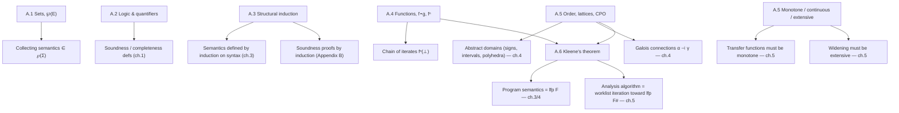

[[book-guidelines|↩ Back to guidelines]]

## Why this appendix, and why it matters before anything else

Rival and Yi tuck this material into Appendix A, at the very back of the book. The Topic List for this vault, however, places it second — right after the landscape survey and before a single line of semantics is defined. That's the correct reading order, not the book's physical order: everything from chapter 2 onward — the collecting semantics, the abstraction relation, the analysis algorithm, the soundness proofs in Appendix B — is stated in the vocabulary defined here. You cannot parse "$\mathrm{lfp}\, F$" in chapter 3, or "$F$ is a monotone, continuous, extensive operator" in chapter 5, without this appendix first. The book treats it as a reference to flip back to; this article treats it as the load-bearing foundation it actually is.

There's also a reason the book needs *its own* self-contained math primer rather than pointing you at a discrete-math textbook: static analysis leans on a narrow, specific slice of order theory — complete lattices, CPOs, monotonicity, continuity, least fixpoints — used for one purpose throughout: **making "the set of all possible program behaviors" into an object you can compute with.** Every concept below exists to serve that one goal, so it's worth reading them as a single connected argument rather than six independent definitions.

## Sets: the substrate everything else sits on

A **set** is just a collection of elements — $x \in E$ means $x$ belongs to $E$, and $E \subseteq F$ means every element of $E$ also belongs to $F$. The book uses the standard constructors: $\emptyset$ (empty set), $\{x_0, \dots, x_n\}$ (enumeration), and set-builder notation $\{x \in E \mid P(x)\}$ — "all elements of $E$ satisfying property $P$." Union $E \cup F$, intersection $E \cap F$, set difference $E \setminus F$, disjoint union $E \uplus F$, and Cartesian product $E \times F$ round out the toolkit. The one operator worth pausing on is the **powerset** $\wp(E)$: the set of *all subsets* of $E$. For $E = \{0,1\}$, $\wp(E) = \{\emptyset, \{0\}, \{1\}, \{0,1\}\}$ — four elements from a two-element set, because $|\wp(E)| = 2^{|E|}$.

Why does this matter for static analysis specifically? Because the **concrete semantics** of a program — "the set of all its possible executions" — is itself an element of a powerset: if $\Sigma$ is the set of all program states, the semantics lives in $\wp(\Sigma)$. Abstraction (topic 4 in this vault) is then a map between powersets — or between $\wp(\Sigma)$ and some smaller, more tractable ordered set. Set theory isn't background trivia here; it's the type signature of the entire analysis pipeline.

```rust
// A Rust reading of "the collecting semantics lives in ℘(Σ)":
// a set of reachable states is just a set-of-states, and the
// analysis question ("is Ξ reachable?") is a subset query.
use std::collections::HashSet;

type State = (i64, i64); // e.g. the (x, y) point from the book's toy language

fn reaches_error(reachable: &HashSet<State>, error_zone: impl Fn(&State) -> bool) -> bool {
    reachable.iter().any(error_zone)
}
```

```lean
-- Lean reads ℘(E) literally as `Set E := E → Prop`, so "x ∈ E" is
-- definitionally a proposition, not a runtime membership test.
def PowerSet (E : Type) := Set E   -- Set E is already ℘(E) in Lean/Mathlib
example : ({0, 1} : Finset ℕ).powerset = {∅, {0}, {1}, {0, 1}} := by decide
```

## Logical connectives and quantifiers: the language of definitions like soundness

Nothing exotic here — conjunction $P \wedge Q$, disjunction $P \vee Q$, implication $P \Rightarrow Q$, universal quantification $\forall x \in E,\, P(x)$, existential quantification $\exists x \in E,\, P(x)$. The appendix is terse about this on purpose: these are the connectives every reader already has from programming (`&&`, `||`, boolean implication). What's worth flagging is that the book's central definitions — **soundness** ($\mathrm{analysis}(p) = \mathrm{true} \Rightarrow p \text{ satisfies } P$) and **completeness** ($p \text{ satisfies } P \Rightarrow \mathrm{analysis}(p) = \mathrm{true}$) from chapter 1 — are nothing more than a single $\Rightarrow$ stated in two directions. If you've internalized *only* implication and its non-commutativity, you already understand the soundness/completeness asymmetry that drives the entire book's design philosophy: analyses give up completeness, never soundness, precisely because $\Rightarrow$ only points one way.

## Induction: proving properties of infinite (or infinitely-structured) things

### The base case: Peano induction

For a predicate $P$ over the natural numbers, proving $\forall n \in \mathbb{N}, P(n)$ reduces to two finite obligations:

$$
P(0) \quad \text{and} \quad \forall n \in \mathbb{N},\ P(n) \Rightarrow P(n+1)
$$

This is unremarkable as stated — every programmer has written a loop invariant. What's worth internalizing is *why* it works: proving the two obligations is a finite amount of work that certifies infinitely many instances, because the implication $P(n) \Rightarrow P(n+1)$ is itself a reusable machine you can crank forward as far as you like.

### The generalization that actually matters here: structural induction over syntax

The book immediately generalizes this to **inductively defined data types** — its example is exactly the expression grammar it will use in chapter 3:

$$
E ::= n \mid x \mid E \odot E
$$

"An expression is a constant, a variable, or a binary operator applied to two sub-expressions." To prove a property $P$ holds for *all* expressions, you don't induct on a number — you induct on the grammar's own recursive structure: prove $P$ for constants, prove $P$ for variables, and prove $P$ for $E_1 \odot E_2$ *assuming* $P$ already holds for $E_1$ and $E_2$ (the induction hypothesis). This is **structural induction**, and it is the single most load-bearing idea in this appendix for anyone building a type checker or verifier: it is the proof principle underneath every soundness argument that proceeds "by induction on the syntax of the program" — which is exactly how Appendix B proves the analyzer sound, and exactly how a typing-judgment soundness proof (progress/preservation) or a substitution lemma is proved in a dependently-typed kernel.

```rust
// The grammar E ::= n | x | E ⊙ E, as a Rust enum — the recursive
// variant IS the inductive-type definition, and any function that
// pattern-matches exhaustively over it is, by construction, defined
// by structural recursion (the computational twin of structural induction).
enum Expr {
    Num(i64),
    Var(String),
    BinOp(Box<Expr>, Op, Box<Expr>),
}

enum Op { Add, Sub, Mul }

// eval is total *because* the match is exhaustive over the inductive
// structure — this is structural induction used to prove totality.
fn eval(e: &Expr, env: &std::collections::HashMap<String, i64>) -> i64 {
    match e {
        Expr::Num(n) => *n,
        Expr::Var(x) => env[x],
        Expr::BinOp(l, op, r) => {
            let (lv, rv) = (eval(l, env), eval(r, env));
            match op {
                Op::Add => lv + rv,
                Op::Sub => lv - rv,
                Op::Mul => lv * rv,
            }
        }
    }
}
```

```lean
-- Lean makes the connection between "inductive datatype" and
-- "induction principle" completely explicit: declaring `inductive Expr`
-- automatically generates `Expr.rec`, the structural-induction/recursion
-- principle used above informally in Rust. Proving a property `P`
-- for all `Expr` by `induction e` literally invokes `Expr.rec`.
inductive Expr where
  | num : Int → Expr
  | var : String → Expr
  | binOp : Expr → Expr → Expr

def size : Expr → Nat
  | .num _ => 1
  | .var _ => 1
  | .binOp l r => size l + size r + 1

theorem size_pos (e : Expr) : size e > 0 := by
  induction e with
  | num _ | var _ => simp [size]
  | binOp l r ihl ihr => simp [size]; omega
```

This is the appendix's most direct payoff for a compiler/elaborator project: every typing rule you'll write later (judgments of the form $\Gamma \vdash e : \tau$) is a property indexed by an inductively defined `Expr`/`Term`, and every soundness proof about that judgment (type preservation, substitution lemmas) will be a structural induction exactly of this shape — Lean's `induction e with | ...` tactic is, mechanically, running `Expr.rec`.

## Functions: composition as the algebra of transformations

A function $f : E \to F$ maps each element of a *domain* $E$ to an element of a *codomain* $F$; $f : x \mapsto e$ names the mapping rule. Composition $g \circ f$ applies $f$ first, then $g$. Iterated self-composition $f^n$ (with $f^0 = \mathrm{id}$) will resurface, unannounced but load-bearing, the moment Kleene's theorem below writes the least fixpoint as $\bigsqcup_n f^n(\bot)$ — *that* $f^n$ is exactly this one. A **sequence** is just a function $\mathbb{N} \to E$, written $(f(n))_{n \in \mathbb{N}}$ — the same object you'll see a page later as "the chain of iterates of $f$ from $\bot$." Characteristic functions $f: E \to \mathbb{B}$ pick out subsets ($\{x \in E \mid f(x) = \mathrm{true}\}$), and generalize to **multisets** via $f : E \to \mathbb{N}$, where $f(x)$ counts occurrences of $x$.

```rust
// f^n as iterated composition — precisely what the Kleene-iteration
// loop below computes, made explicit as a combinator.
fn iterate<T: Clone>(f: impl Fn(T) -> T, x0: T, n: usize) -> T {
    (0..n).fold(x0, |x, _| f(x))
}
```

```lean
-- Function.iterate is Lean/Mathlib's name for exactly f^n.
#check @Function.iterate  -- (α → α) → ℕ → α → α
example (f : ℕ → ℕ) (x : ℕ) : f^[0] x = x := rfl
```

## Order relations, lattices, and CPOs: making "more approximate" precise

This is the section the rest of the book actually runs on, so it earns the most space.

### The order relation itself

An **order relation** $\preceq$ over a set $E$ is a binary relation that is:

- **reflexive**: $\forall x \in E,\ x \preceq x$
- **transitive**: $\forall x,y,z \in E,\ x \preceq y \wedge y \preceq z \Rightarrow x \preceq z$
- **antisymmetric**: $\forall x,y \in E,\ x \preceq y \wedge y \preceq x \Rightarrow x = y$

Read $x \preceq y$ as "$x$ is a *more precise* (or more concrete) description than $y$." Set inclusion $\subseteq$ over $\wp(E)$ is the canonical example, and it is *not total*: $\{0\}$ and $\{1\}$ are incomparable — neither contains the other. This matters immediately, because abstract domains are ordered by precision (intervals, signs, polyhedra) and that order is essentially never total either. A **chain** is a subset of $E$ that *is* totally ordered under $\preceq$ — e.g. $\emptyset \subseteq \{0\} \subseteq \{0,2\}$.

### Bounds: bottom, top, join, meet

- **Infimum** $\bot$ ("bottom"): the element smaller than everything — read it as "no information" or "unreachable."
- **Supremum** $\top$ ("top"): the element bigger than everything — "all possible behavior, no information gained."
- **Least upper bound** $x \sqcup y$ ("join"): the smallest element that is $\succeq$ both $x$ and $y$ — the natural operation for "combine two approximations losslessly" (union, in $\wp(E)$).
- **Greatest lower bound** $x \sqcap y$ ("meet"): dually, the largest element $\preceq$ both — intersection, in $\wp(E)$.

$E$ is a **lattice** when infimum, supremum, and pairwise $\sqcup$/$\sqcap$ all exist. It is a **complete lattice** when *every* subset (not just pairs) has a join and a meet — $\wp(E)$, ordered by $\subseteq$, is the running example, always complete. $E$ is a **complete partial order (CPO)** if it has a $\bot$ and every *chain* (not necessarily every subset) has a least upper bound — a weaker, more general requirement than a complete lattice, and the one Kleene's theorem actually needs.

```rust
// A minimal lattice trait — the sign domain from chapter 2 is the
// smallest nontrivial instance: {⊥, Neg, Zero, Pos, ⊤} ordered by
// information content, ⊥ = "unreachable", ⊤ = "any integer."
#[derive(Clone, Copy, PartialEq, Debug)]
enum Sign { Bottom, Neg, Zero, Pos, Top }

trait Lattice {
    fn bottom() -> Self;
    fn join(&self, other: &Self) -> Self;   // ⊔
    fn meet(&self, other: &Self) -> Self;   // ⊓
    fn leq(&self, other: &Self) -> bool;    // ⪯
}

impl Lattice for Sign {
    fn bottom() -> Self { Sign::Bottom }
    fn join(&self, o: &Self) -> Self {
        use Sign::*;
        match (self, o) {
            (Bottom, x) | (x, Bottom) => *x,
            (a, b) if a == b => *a,
            _ => Top, // e.g. Neg ⊔ Pos = Top: no exact join, so over-approximate
        }
    }
    fn meet(&self, o: &Self) -> Self {
        use Sign::*;
        match (self, o) {
            (Top, x) | (x, Top) => *x,
            (a, b) if a == b => *a,
            _ => Bottom,
        }
    }
    fn leq(&self, o: &Self) -> bool { self.join(o) == *o }
}
```

```lean
-- Mathlib's `CompleteLattice` class is a direct formalization of the
-- appendix's definition — `⊔`, `⊓`, `⊥`, `⊤`, and completeness over
-- arbitrary sets, not just pairs, exactly as A.5 states it.
#check @CompleteLattice        -- class CompleteLattice (α : Type*) extends Lattice α, ...
#check @CompleteLattice.sSup   -- arbitrary-subset join, generalizing ⊔
example : CompleteLattice (Set ℕ) := inferInstance  -- ℘(ℕ) is a complete lattice, as claimed
```

Here's a small Hasse diagram of the sign lattice, showing precisely which pairs are ordered (an edge means "the lower node $\preceq$ the upper node") and which are incomparable (`Neg` and `Pos` have no direct edge — their join is forced up to `Top`):

<svg viewBox="0 0 320 220" xmlns="http://www.w3.org/2000/svg" font-family="sans-serif" font-size="13">
  <line x1="160" y1="30" x2="80" y2="110" stroke="#888" stroke-width="1.5"/>
  <line x1="160" y1="30" x2="160" y2="110" stroke="#888" stroke-width="1.5"/>
  <line x1="160" y1="30" x2="240" y2="110" stroke="#888" stroke-width="1.5"/>
  <line x1="80" y1="110" x2="160" y2="190" stroke="#888" stroke-width="1.5"/>
  <line x1="160" y1="110" x2="160" y2="190" stroke="#888" stroke-width="1.5"/>
  <line x1="240" y1="110" x2="160" y2="190" stroke="#888" stroke-width="1.5"/>

  <circle cx="160" cy="30" r="18" fill="#4a7fbf" stroke="#2c4d75" stroke-width="1.5"/>
  <text x="160" y="34" text-anchor="middle" fill="#fff">⊤</text>

  <circle cx="80" cy="110" r="20" fill="#6fa06f" stroke="#3f6b3f" stroke-width="1.5"/>
  <text x="80" y="114" text-anchor="middle" fill="#fff">Neg</text>

  <circle cx="160" cy="110" r="24" fill="#6fa06f" stroke="#3f6b3f" stroke-width="1.5"/>
  <text x="160" y="114" text-anchor="middle" fill="#fff">Zero</text>

  <circle cx="240" cy="110" r="20" fill="#6fa06f" stroke="#3f6b3f" stroke-width="1.5"/>
  <text x="240" y="114" text-anchor="middle" fill="#fff">Pos</text>

  <circle cx="160" cy="190" r="18" fill="#b06a6a" stroke="#7a4646" stroke-width="1.5"/>
  <text x="160" y="194" text-anchor="middle" fill="#fff">⊥</text>
</svg>

### Monotone, continuous, extensive functions

Let $f : E \to F$, both ordered by $\preceq$:

- **Monotone**: $x \preceq y \Rightarrow f(x) \preceq f(y)$ — approximating the input more coarsely never makes the output more precise. This is the *minimum* requirement for any abstract transfer function: garbage in, garbage out, monotonically.
- **Continuous** (requires $E,F$ to be CPOs): for any chain $G \subseteq E$, $f$ commutes with the chain's least upper bound: $\bigsqcup \{f(x) \mid x \in G\} = f(\bigsqcup G)$. Every continuous function is monotone, but not conversely — continuity is the stronger property that Kleene's theorem below actually needs.
- **Extensive**: $\forall x \in E,\ x \preceq f(x)$ — applying $f$ never *loses* information relative to $\preceq$. This is precisely the correctness requirement placed on **widening operators** (topic 5) later in the book: a widening step must only ever move you upward in the lattice.

## Fixpoints and Kleene's fixpoint theorem: the engine of the whole book

A **fixpoint** of $f : E \to E$ is an $x$ with $f(x) = x$. The **least fixpoint**, $\mathrm{lfp}\, f$, is the smallest such $x$ under $\preceq$, when it exists. Fixpoints matter here because the book is about to define **program semantics as a least fixpoint** (topic 3: "semantics as a least fixpoint") — a loop's meaning is the smallest set of behaviors closed under "run the loop body once more" — and then define **static analysis as computing an approximation of that same fixpoint** on an abstract domain.

**Theorem A.1 (Kleene's fixpoint theorem).** If $f$ is continuous and $E$ is a CPO with infimum $\bot$, then $f$ has a least fixpoint, given constructively by:

$$
\mathrm{lfp}\, f \;=\; \bigsqcup_{n \in \mathbb{N}} f^n(\bot)
$$

The word "constructively" is the entire point: this isn't just an existence proof, it's a *recipe* — start at $\bot$, apply $f$ repeatedly, take the limit. That recipe *is* the abstract iteration algorithm of chapters 3–5, almost verbatim.

**Proof sketch (reconstructed from the appendix):**

1. Since $\bot$ is the infimum, $\bot \preceq f(\bot)$.
2. $f$ monotone (continuity implies monotonicity) $+$ induction on $n$ gives $f^n(\bot) \preceq f^{n+1}(\bot)$ for all $n$ — so $\{f^n(\bot)\}_{n \in \mathbb{N}}$ is a chain.
3. $E$ is a CPO, so this chain has a least upper bound; call it $X$.
4. Because $f$ is continuous, it commutes with this chain's lub too, so $f(X) = \bigsqcup_n f^{n+1}(\bot) = X$ — $X$ *is* a fixpoint.
5. Minimality: for any other fixpoint $X'$, induction shows $f^n(\bot) \preceq X'$ for every $n$ (base case from $\bot$ being infimum; step case from monotonicity plus $f(X') = X'$), so $X = \bigsqcup_n f^n(\bot) \preceq X'$ by definition of least upper bound. Hence $X = \mathrm{lfp}\, f$.

```rust
// Kleene iteration, directly implementing the theorem's constructive
// content — this is the shape of every abstract-interpretation fixpoint
// solver in the book (chapters 3–5), modulo the widening operator that
// forces termination when the abstract CPO has infinite ascending chains
// (Sign is finite-height, so plain iteration already terminates here;
// interval/polyhedra domains generally are not, and need `widen`).
fn kleene_lfp<T: Lattice + PartialEq + Clone>(f: impl Fn(&T) -> T) -> T {
    let mut x = T::bottom();
    loop {
        let next = f(&x);
        if next == x { return x; }  // reached the fixpoint
        x = next;                    // x, f(x), f(f(x)), ... — the chain f^n(⊥)
    }
}
```

```lean
-- Mathlib proves the complete-lattice cousin of this theorem
-- (Knaster–Tarski, not requiring continuity, only monotonicity,
-- because a complete lattice has *all* sups, not just chain sups)
-- as `OrderHom.lfp`. The CPO/continuity version the book proves is the
-- constructive, "compute it by iterating from ⊥" specialization that
-- an actual analyzer implementation needs — Tarski gives existence,
-- Kleene gives an algorithm.
#check @OrderHom.lfp
-- OrderHom.lfp : α →o α → α   (for α a CompleteLattice)
```

## How these pieces fit together across the book



The synthesis is almost mechanical once you see it laid out this way: **every later chapter is discharging one obligation from this appendix.** Chapter 3/4 show that a program's meaning is $\mathrm{lfp}\, F$ for some semantic operator $F$ — an instance of Theorem A.1 with $E = \wp(\Sigma)$, always a complete lattice, so continuity is free. Chapter 4's abstract domains are CPOs (or lattices) equipped with monotone $\alpha, \gamma$. Chapter 5's soundness of abstract iteration hinges on the transfer function $F^\#$ being monotone (else the analysis algorithm's own iteration might not even converge to a well-defined fixpoint) and its widening operator being extensive (else it could silently *lose* reachable states rather than merely coarsen them) — both properties named nowhere except in this appendix. Appendix B's soundness theorems are literally structural inductions over the same command grammar introduced in A.3.

## Where this leads, and how it bears on the compiler/elaborator project

For the standing project — a Rust-based dependently-typed/refinement-typed compiler with an embedded theorem prover and CSP-driven invariant search — three threads from this appendix are directly load-bearing, not just background:

1. **Structural induction over inductively defined syntax** (A.3) is the shared ancestor of *both* target framings: it's how you prove a type checker's judgment rules sound (progress/preservation via induction on typing derivations) and how you prove a program-logic verifier's Hoare triples sound (induction on command syntax, exactly as Appendix B does for this book's analyzer). Lean's `inductive` + auto-generated recursor makes this correspondence literal rather than analogical.
2. **Lattices, CPOs, and monotonicity** (A.5) are the vocabulary your abstract-interpretation invariant generator will speak fluently: every abstract domain you build (intervals, octagons, or a custom refinement-type domain) needs to be a lattice with provably monotone transfer functions before any fixpoint computation over it is even well-defined — this is the precondition, not a footnote, for reachability analysis and Horn-clause invariant solving.
3. **Kleene's fixpoint theorem** (A.6) is *the* algorithmic template for invariant generation via abstract interpretation: start from $\bot$ (no invariant), apply the abstract transfer relation, iterate, widen when the chain doesn't stabilize in finite height. This is precisely [[Specialized-Static-Analysis-Frameworks#The mechanism|the mechanism]] your CSP/abstract-interpretation kernel will use to over-approximate program semantics in search of a sound inductive invariant — the same fixpoint machinery that, read at the logic-programming level rather than the program-semantics level, is also how a Constraint Handling Rules / CHC solver computes a least model.

**One honest caveat about this article's source material:** Appendix A is genuinely short — five pages of dense reference, not a worked development — so the depth above comes from tracing forward *connections* the appendix itself only gestures at (Galois connections, widening, the CHC parallel), not from padding the appendix's own content. The book's own worked instances of these ideas — the sign/interval lattices, the actual Galois connections, the actual widening operators — belong to the next topic in this vault ("[[Abstraction-and-Abstract-Domains|Abstraction and Abstract Domains]]," chapter 4) and are covered there rather than invented here.
