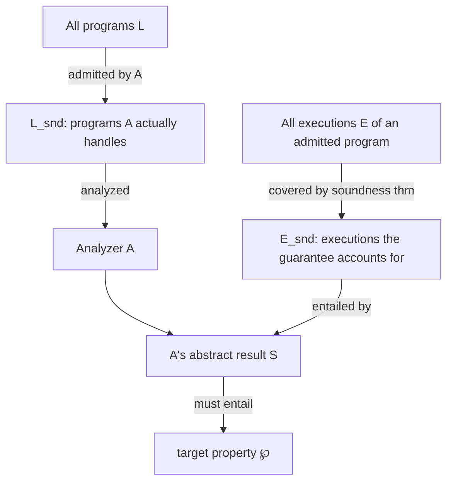
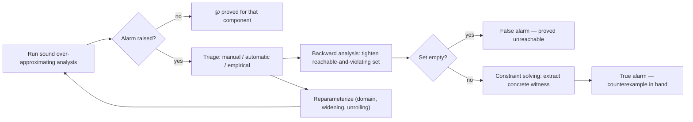

# Practical Use and Deployment of Static Analysis Tools

[[book-guidelines|↩ Back to guidelines]]

## Why this chapter exists

Chapters 3 and 4 gave you a machine that provably computes sound over-approximations of program behavior, given a language, a semantics, and an abstract domain. That machine is a mathematical object. The moment you hand it to an engineer who needs to ship verified C or Java code, a second set of questions opens up that the soundness theorem alone does not answer: *Does this tool's soundness theorem even talk about the property I care about? Does it talk about the language dialect I'm actually compiling? What do I do with the 4,000 "alarm" messages it just printed? Do I re-run it on every commit or once a release?*

This is the gap between "we proved the analyzer sound" and "we can trust a specific run of it on a specific codebase." Rival and Yi devote chapter 6 to it, deliberately staying at the level of the *user* of a static analyzer rather than its implementor (that's chapter 7). If you are building your own verification tool — a refinement-type checker with an abstract-interpretation backend for invariant generation — this chapter is really a checklist of everything a soundness proof does *not* automatically give you, and that you will have to design deliberately: what your tool's soundness theorem should state, how a caller configures it, how alarms get triaged, and how it gets wired into a development loop.

The chapter is organized around four questions, in order: (6.1) is this tool even the right tool for this goal, (6.2) how do I configure a specific run, (6.3) what do I do with the results, (6.4) how does this fit into a workflow.

## 6.1 — Soundness is a relation between three moving parts, not a single boolean

### The problem with "the analyzer is sound"

A soundness theorem like Theorem 3.6 or 4.3 is stated for a *fixed* language $L$, a *fixed* concrete semantics, and a *fixed* target property $\wp$. But no real analyzer implements the full, unrestricted semantics of a real language — C's standard leaves evaluation order, struct padding, and integer overflow behavior partially unspecified; IEEE 754 floating point depends on the rounding mode of the actual machine; Java exceptions interact with the call stack in ways a numeric-domain analyzer may not model at all. So the honest theorem a real analyzer $A$ satisfies is never "sound for $L$," it's:

**Theorem 6.1 (Soundness under assumption).** $A$ is sound with respect to the subset of programs $L_{snd} \subseteq L$ and the subset of executions $E_{snd} \subseteq E$: for any $p \in L_{snd}$, the results computed by $A$ account for every execution of $p$ that lies in $E_{snd}$.

Read this carefully — it is a soundness theorem *with a footnote baked into its statement*, and the footnote is doing the real work. $L_{snd}$ says which *programs* the guarantee even applies to (e.g. "programs that don't rely on a specific evaluation order for `f(&x) + g(&x)`"). $E_{snd}$ says which *executions* of an admitted program are covered (e.g. "only executions under round-to-nearest rounding mode"). A tool that states $L_{snd}$ and $E_{snd}$ precisely is strictly more useful than one that just says "sound" and leaves you to discover the restrictions empirically, because a precise statement lets you check *before* you run the analysis whether your target program and your deployment environment actually fall inside the covered set.

**What breaks without this distinction.** If you silently equate "sound" with "sound, full stop," you will eventually hand a critical-software team a false sense of security: the tool proved no property violation, but only over the subset of behaviors it happened to model, and the production build uses a compiler with a different rounding mode or evaluation order than the one $E_{snd}$ assumed. The bug that slips through is not a bug in the analysis's logic — the analysis was sound *relative to its stated assumption*. It's a bug in how the assumption was communicated (or not) to the user.

### Where the restriction actually comes from — three recurring sources

The book gives three concrete examples of where $L_{snd}/E_{snd}$ narrowing typically originates, and they generalize past C/Java:

1. **Numeric representation gaps.** Floating point rounding modes ("to nearest," "toward $0$," "toward $+\infty$," "toward $-\infty$") change the concrete semantics of arithmetic; an analyzer must either model all rounding modes (expensive, imprecise) or commit to the one the target toolchain uses.
2. **Memory layout gaps.** The C standard doesn't fix struct field alignment or pointer-arithmetic results — those come from the ABI and the compiler. An analyzer that computes symbolic offsets without knowing the ABI is only sound relative to *some* unspecified-but-fixed layout, not all possible ones.
3. **Evaluation order gaps.** `f(&x) + g(&x)` has undefined evaluation order in C. An analyzer has three honest options: (a) soundly account for *all* orders (costly, imprecise), (b) fix one order and restrict $E_{snd}$ to it, or (c) statically reject programs whose result would depend on order, and analyze the rest under the fixed order.

Every one of these is a case where the *concrete semantics itself* is underspecified by the source language, and the analyzer designer has to pick a refinement of it before soundness can even be stated. This is exactly the situation you'll face building a refinement-type checker for a language with, say, unspecified integer-overflow behavior or non-deterministic scheduling: your Hoare-triple soundness theorem needs its own $L_{snd}/E_{snd}$-shaped disclaimer, stated as precisely as you can manage, rather than a blanket "the type checker is sound."



### Implementation bugs vs. soundness bugs — not the same failure mode

Separately from *what the theorem covers*, there's the question of whether the implementation actually satisfies its own theorem. The book draws a sharp distinction:

- A **crash or a spurious loss-of-precision bug** in $A$ is annoying but not dangerous to soundness: from the user's point of view, "the analyzer crashed" or "the analyzer failed to prove a true property" both just mean *rejected/unproven*, which is exactly what the analyzer is allowed to say about anything outside its power. No false confidence is created.
- A **soundness bug** — a bug that causes $A$ to *claim* $\wp$ holds when it doesn't — is the dangerous case, because it silently invalidates every guarantee downstream. This is the direct analogue of a bug in a proof checker's trusted kernel: a crash in your elaborator is safe (it just fails to typecheck something valid); a bug that makes the kernel accept an *invalid* proof term is catastrophic, because everything built on that acceptance inherits the corruption.

The book lists three engineering mitigations, worth internalizing as design requirements for your own verifier, not just "nice to have":

1. **Cross-checking with independently implemented tools** — the analyzer equivalent of differential testing.
2. **Proof-producing / certifying analysis** — each run emits a *certificate* that an independent, presumably simpler and more trusted, checker can verify. This is precisely the trusted-kernel architecture you want for a theorem prover embedded in a compiler: keep the proof *search* engine untrusted and complex, and make the proof *checker* small, separately verified, and the only component that gets to say "yes, sound." A CHC solver or CEGAR loop that outputs Farkas certificates / Craig interpolants that a small linear-arithmetic checker re-verifies is this pattern in exactly the shape you'll need.
3. **Verifying the analyzer itself with assisted proof techniques**, or shipping a **qualification kit** (documentation + regression test suite) so users can independently gain confidence on their own code before trusting the tool on production software.

```rust
// Sketch: an untrusted, complex invariant-generation engine paired with
// a small, trusted certificate checker — the trusted-kernel pattern
// Theorem 6.1's "soundness bug" discussion is nudging you toward.

trait InvariantSynthesizer {
    // Complex: widening, CEGAR refinement, heuristics — NOT trusted.
    fn synthesize(&self, program: &Cfg) -> Option<(Invariant, Certificate)>;
}

// Small, independently re-checkable, IS the trusted computing base.
fn check_certificate(program: &Cfg, inv: &Invariant, cert: &Certificate) -> bool {
    // e.g. re-derive each Horn-clause implication inv(pre) ∧ guard ⇒ inv(post)
    // from cert's Farkas coefficients / interpolant, using only linear algebra —
    // no widening, no heuristics, nothing the synthesizer could have gotten wrong
    // without the checker independently catching it.
    cert.verify_against(program, inv)
}
```

### Precision is a separate axis from soundness, and it is *not* monotone

Even given a sound analyzer, undecidability (§1.3.3) rules out an analyzer that is both sound, automatic, and *complete* over all input programs — you can build a complete analyzer for one fixed program, or even a finite set of programs, but never for an infinite class. So the practical question is not "is it complete" but "how often is it precise enough to actually discharge $\wp$." This is a resource trade-off tuned by abstract-domain choice and iteration strategy (§6.2.2 below) — but the book flags a genuinely counterintuitive fact you should carry into your own CSP/abstract-interpretation kernel design:

> Because widening and several abstract operators are **not monotone**, locally increasing precision (a more expressive domain on one loop, a tighter assumption) can *decrease* overall precision, and locally reducing cost can *increase* overall runtime (a coarser domain may need to explore more branches to compensate).

This is worth sitting with. In a monotone system, "spend more, get at least as good a result" is a safe intuition; in abstract interpretation with widening it is *not* a theorem, it's a heuristic that usually holds. If your CSP kernel over abstract lattices uses anything widening-shaped for infinite domains, you inherit this non-monotonicity, and any auto-tuning/reparameterization loop you build needs to re-measure after every parameter change rather than assuming local improvements compose.

## 6.2 — Configuring a specific analysis run

Given a suitable tool, the next layer of decisions is: what exactly do you point it at, and how do you tell it what to prove.

### Whole-program vs. program-fragment analysis

- **Whole-program analysis**: full source, a known entry point (e.g. `main`), and known input ranges. This is the easy case — you supply everything the concrete semantics needs to fix a starting state.
- **Program-fragment analysis**: a library or incomplete component with *several* possible entry points, each of which needs its own precondition on the state (e.g. "removal may only be called on a well-formed container that contains the element"). Two mechanisms handle this:
  1. An analyzer-native interface to specify initial states directly, or
  2. A **code harness** — a driver you write that constructs a valid initial state and calls the library function, reducing fragment analysis back to whole-program analysis of *(harness + function)*.

This is precisely the client-side of Hoare-triple modular verification: a harness *is* an executable encoding of a precondition. If you're building a compiler that checks `requires`/`ensures` contracts function-by-function, your top-down vs. bottom-up choice below, and your harness-construction machinery, are literally the same design problem the book is describing for library analysis.

**Top-down vs. bottom-up** matters here too: top-down analysis (start at the entry point, descend into callees at each call site) suits whole-program analysis and can exploit calling context precisely; bottom-up analysis (analyze callees first, compute a reusable **procedure summary**, then instantiate it at each call site — the section 5.4 buffer-overflow case study) suits fragment analysis where there is no single entry point, at the cost of needing more expressive abstract domains to represent a summary that must be valid for *any* calling context. This maps directly onto your compiler's function-summary machinery for interprocedural refinement-type checking: a bottom-up, summary-based design is what lets you check a library function once and reuse the result at every call site instead of re-verifying it under every caller's context.

### Stubs for code you can't (or won't) analyze

When a program calls external code — a system call, a precompiled binary, a library too large to include — the standard move is a **stub**: a mock with the real function's signature but replaced by *assumptions and assertions* the analyzer can reason about directly. The canonical example: a stub for integer square root asserts the input is non-negative and returns *some* non-negative integer — deliberately coarse, but sound and usually precise enough for the caller's analysis to still succeed.

```python
# A stub is exactly a manually-supplied abstract transfer function
# for a black-box call — the analyzer never sees the real body.
def stub_isqrt(abstract_state, arg_interval):
    assert arg_interval.lower_bound >= 0, "isqrt requires non-negative input"
    # sound over-approximation of isqrt's range, without executing isqrt
    return Interval(0, float('inf'))
```

This is the informal cousin of a formally specified `requires`/`ensures` contract: a stub *is* a hand-written Hoare-style summary for a procedure whose body the analyzer refuses (or is unable) to look inside. In your compiler this generalizes to: any external/opaque function must carry an explicitly supplied refinement-type signature, because there is no body from which to *infer* one — the CSP/abstract-interpretation kernel has to treat it as a leaf assumption, exactly like a stub.

### Choosing an abstract domain, and packing

Domain choice is the direct precision/cost dial from chapters 2–5: non-relational domains (constants, intervals) are cheap but cannot express cross-variable constraints; relational domains (convex polyhedra, octagons) are expressive but polyhedra in particular have unbounded constraint count as a function of variable count. Real tools such as ASTRÉE expose this as a literal switch. Reduced products (§5.1.2) and partitioning (§5.1.3) let you get more expressive constructions out of cheap base domains.

**Packing** is the practical compromise worth calling out explicitly: instead of applying an expensive relational domain to *all* variables, restrict it to small groups ("packs") — e.g. only variables that appear together in the same guard or expression. Packing changes precision and cost, **never soundness** — the analysis is still a valid over-approximation for any packing choice, because the reduced expressiveness inside a pack is just a further abstraction, and abstractions compose soundly by construction (Galois-connection composition from chapter 4). This is a template for your CSP kernel: if you need expensive relational reasoning (e.g. non-linear or DFA-shaped domains) over specific variable subsets, restricting the expensive machinery to small, syntactically-derived packs while defaulting to a cheap non-relational domain elsewhere is a soundness-neutral scalability lever, not a hack.

### Iteration-strategy parameters, recapped as knobs

Four techniques from chapter 5 reappear here purely as *user-facing parameters*: loop unrolling (delay $\sqcup^\#$/widening for the first $N$ iterations), delayed widening (use plain join, not widening, for the first few iterations), widening with thresholds (bias widened bounds toward pre-supplied "natural" constants instead of jumping to $\pm\infty$), and post-fixpoint refinement (a few extra narrowing-style iterations after reaching a post-fixpoint). None of these change what a *sound* result looks like — they only change how expensive it is to reach one, and how tight it ends up being.

### Automatic vs. manual parameterization — a workflow, not a binary choice

The book's four automatic-selection strategies form a useful taxonomy of *when information becomes available relative to the main analysis*:

| Strategy | When it runs | Trade-off |
|---|---|---|
| Syntactic pre-analysis | Before, pattern-matching on source text | Cheap, fragile — no semantic [[Specialized-Static-Analysis-Frameworks#Grounding|grounding]] |
| ML-based pre-analysis | Before, learned from (features, params, results) triples | More systematic than hand-written syntactic rules, still pre-semantic |
| Semantic pre-analysis | Before, using a cheaper auxiliary analysis | More robust, harder to design |
| Semantic online analysis | *During*, main analysis self-tunes (e.g. co-fibered domains) | Most powerful, can react to intermediate abstract state, hardest to design |

The recommended practical loop is: fix the soundness-critical parameters (code, entry points, goal) carefully by hand; leave everything else automatic; run; inspect (§6.3); manually override only the specific knob that's causing trouble; re-run. This "automatic first, manual only where diagnosed" workflow is the sane default for any tool you build with more than a couple of tunable knobs — don't force users to hand-configure a 10-parameter abstract-domain-and-widening pipeline before they've even seen a first result.

## 6.3 — Reading the output: alarms, triage, and counterexample construction

### What an alarm actually asserts

Because $A$ is sound, a positive result ("$\wp$ holds") can always be trusted. A negative result — an **alarm** — only ever means *the analysis failed to prove* $\wp$; it says nothing about whether $\wp$ actually fails. When $\wp$ decomposes into a conjunction of local properties (e.g. "operation $o_i$ never crashes," for each potentially-dangerous operation $o_i$ in the program), the analysis result decomposes the same way, and each conjunct that couldn't be discharged produces its own alarm.

### "Cutting out" executions after an alarm is still sound

This is a subtle and important point worth internalizing precisely, because it looks unsound at first glance. Consider an out-of-bounds array write: after it, memory may be silently corrupted in a way the analyzer cannot usefully track. A common analyzer behavior is to report the alarm and then simply *stop modeling* the corrupted execution going forward (as opposed to continuing with an over-approximation of "whatever might have happened"). Is that sound?

Yes — because of how the disjunction is structured. Every concrete execution is *either* safe at that access, *or* it exhibits the out-of-bounds write. In the first case the analysis result (which does keep tracking safe executions) still soundly covers it. In the second case, the alarm itself *is* the analysis's complete, sound statement about that execution: "this execution may violate the property here." The analysis doesn't need to say anything further about what happens *after* the violation, because it already reported the violation — reporting it once, then declining to speculate about post-corruption behavior, does not drop any execution from the union of {safe executions, correctly-flagged unsafe executions}. This is a direct instance of Theorem 6.1's soundness-under-assumption: $E_{snd}$ implicitly narrows to "executions up to their first reported violation," and the theorem's guarantee is honest about that scope rather than silently pretending to cover more.

### Triage: is this alarm true or false, and why

Each alarm is either a **true alarm** (a real defect, witnessable on a concrete execution) or a **false alarm** (an artifact of the analysis's own imprecision). Diagnosing which, and *why* in the false case, is called **alarm triage**, and the book attributes false alarms to exactly three causes, each pointing to a different fix:

1. Overly coarse assumptions supplied at setup (§6.2) — fix the setup, re-run.
2. The abstract domain can't express the needed invariant — use a more expressive domain if available, or none exists yet (out of scope for a user).
3. Imprecision from the iteration/widening strategy itself — tune iteration parameters, or it's a tool-implementation limitation.

Three families of triage technique, usable in combination:

- **Manual inspection** — read the computed invariants at (especially) loop heads and the first-reported alarm specifically, because precision loss cascades: an early loss "domino"-effects into many downstream alarms, so understanding the first alarm often explains several later ones for free.
- **Automatic refinement** — dependence analysis / slicing narrows down which commands could possibly have caused the alarm; **[[Backward-Analysis|backward analysis]]** (§5.5.3) computes a tighter approximation of the executions that reach the alarm point *and* violate the property — if that tighter set is empty, the alarm is proven false outright; otherwise it sharpens the search for a genuine counterexample. **Constraint solving** identifies concrete satisfying assignments to the violating conditions directly.
- **Empirical ranking / clustering** — unsound-but-useful heuristics (severity ranking, ML-learned categories, per-domain empirical accuracy) plus **logical clustering**, where alarms are grouped by detected dependency (e.g. several out-of-bounds alarms on the same loop-index variable are likely one root cause, not many).

This entire triage machinery — over-approximate soundly, then when the over-approximation is inconclusive, sharpen by computing tighter reachability sets, and fall back to constraint solving for an explicit witness — is a direct, unformalized description of the **CEGAR loop** (counterexample-guided abstraction refinement) at the heart of modern software model checkers, and of the abstraction-refinement half of a CHC solver. Backward analysis narrowing the reachable-and-violating set toward emptiness *is* spurious-counterexample elimination; constraint solving producing "a set of realizable error conditions" *is* SMT-style witness extraction. If your compiler's verification backend pairs abstract-interpretation-based invariant generation with a CSP kernel for counterexample search, this section is describing the exact protocol by which the two halves should hand off to each other: over-approximate first; when inconclusive, refine the abstraction locally (backward analysis) or hand the residual constraint to the solver for a concrete assignment.



### Reparameterization is a search, not a monotone refinement

Closing the loop on §6.1's non-monotonicity warning: when triage suggests a better parameter choice (more unrolling on a specific loop, a more expressive domain somewhere), a re-run is *likely* but not *guaranteed* to help, and it can even make things worse — locally, or globally in either precision or runtime. The practical implication for tool design is that reparameterization has to be treated as a search with re-measurement at each step, never as a monotone tightening you can reason about compositionally.

## 6.4 — Deployment: where the analysis lives in the development process

The book calls this the **dispatch model** — how the analysis is wired into the development workflow — and gives two archetypes:

**Online (in-line) dispatch**: the analysis runs frequently, on every commit/build/test, as part of the everyday development loop (compiler-level typing is the extreme case of this). This forces: lightweight, self-service alarm triage (developers can't wait for a specialist), a strong bias toward incremental/modular analysis techniques for speed, and routine reliance on soundness-under-assumption to keep runs fast (e.g. INFER's design target; CLOUSOT's explicit no-aliasing assumption between distinct pointer parameters, trading full generality for modular per-procedure speed).

**Offline dispatch**: analysis is a separate validation phase, run by a dedicated team after larger batches of changes, decoupled from the day-to-day edit loop. This affords precise, expensive, global analyses (full invariant computation, exhaustive run-time-error absence proofs), tools that demand real expertise to parameterize and triage, and — for domains like avionics needing certification — fully manual verification of every alarm with an understood, precisely stated $L_{snd}/E_{snd}$.

Most real processes are **hybrid**: periodic dedicated-team runs alongside continuous lightweight developer-facing checks. The underlying design principle is the same soundness-under-assumption trade-off from §6.1, now applied at the level of *when* you're willing to pay for precision versus speed, rather than *what* the analyzer covers.

For a compiler with an embedded prover, this maps onto a very concrete engineering decision: your fast, modular, per-function refinement checker (used on every `cargo check`-equivalent invocation) is the online dispatch model, necessarily built on stated, weaker assumptions (e.g. no-aliasing-by-default, bounded unrolling, cheap non-relational domains by default with packing for hot spots); a slower, whole-program, CSP-and-CHC-backed batch verifier used before a release or for a formal certification artifact is the offline model, entitled to expensive relational domains, exhaustive counterexample search, and manual triage.

## Where this leads

Chapter 6 sits between the theory (chapters 3–5, "here is a provably sound recipe") and the implementation (chapter 7, "here is the OCaml"). Its real content is a set of engineering obligations that a soundness *theorem* never discharges on its own: state $L_{snd}/E_{snd}$ precisely rather than claiming unconditional soundness; separate the untrusted search/precision engine from a small, independently checkable soundness kernel; treat precision and non-monotonicity as an empirical, re-measured property of a specific configuration, not a compositional guarantee; and design the alarm/counterexample pipeline as a refinement loop (over-approximate, then tighten via backward analysis or hand off to a solver) — which is exactly the shape a CEGAR-based CHC solver takes.

For the compiler project this feeds directly: your refinement-type checker's soundness statement should be written in the Theorem 6.1 mold from day one (what source-language behaviors are actually modeled, not assumed away); its trusted computing base should be a small proof-certificate checker sitting underneath an untrusted, heuristic-heavy invariant synthesizer and CSP-based counterexample search; its interprocedural story should default to bottom-up summaries with explicit stub-style contracts at any boundary it can't see through; and it should ship two dispatch modes from the start — a fast, weak-assumption, packing-and-widening-tuned online checker for everyday use, and a slow, precise, exhaustively-triaged offline verifier for anything claiming a real correctness certificate.
